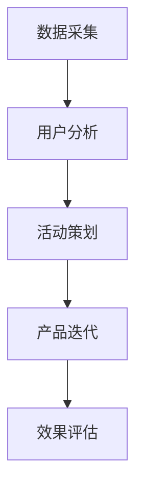

                 

关键词：字节跳动、校招、技术、用户运营、面试题、解析

> 摘要：本文将对字节跳动2024校招技术用户运营专家岗位的面试题进行深入解析，旨在为应聘者提供有针对性的备考建议，助力其在面试中脱颖而出。

## 1. 背景介绍

字节跳动成立于2012年，是一家全球知名的互联网科技公司，旗下拥有抖音、今日头条、懂车帝等多个知名产品。随着公司业务的不断扩张，字节跳动每年都会在全球范围内招聘大量优秀人才。2024年校招技术用户运营专家岗位的面试题，涵盖了技术、产品和运营等多个方面，对于应聘者来说是一次全面的能力考验。

## 2. 核心概念与联系

### 2.1 技术用户运营定义

技术用户运营是指利用技术手段，对用户进行精细化运营管理，以提高用户满意度、留存率和活跃度的过程。它涉及数据采集、用户分析、活动策划、产品迭代等多个环节。

### 2.2 技术用户运营架构



### 2.3 技术用户运营与传统运营区别

- 数据驱动：技术用户运营更加注重数据分析和用户反馈，以提高运营效果。
- 精细化运营：技术用户运营关注用户群体的细分，针对不同用户群体制定个性化运营策略。
- 自动化：技术用户运营利用技术手段实现自动化运营，降低人力成本。

## 3. 核心算法原理 & 具体操作步骤

### 3.1 算法原理概述

技术用户运营中的核心算法主要包括用户画像构建、推荐算法、转化率预测等。这些算法基于大数据和机器学习技术，对用户行为和偏好进行挖掘和分析，为运营决策提供支持。

### 3.2 算法步骤详解

#### 3.2.1 用户画像构建

1. 数据采集：通过APP内的行为数据、社交数据等，收集用户基本信息和兴趣标签。
2. 特征提取：对采集到的数据进行预处理，提取出对用户行为有较强预测性的特征。
3. 画像构建：将提取出的特征组合成用户画像，为后续分析提供依据。

#### 3.2.2 推荐算法

1. 用户行为预测：利用用户画像，预测用户可能感兴趣的内容。
2. 内容排序：根据用户行为预测结果，对内容进行排序，提高推荐的相关性。
3. 推荐策略优化：通过A/B测试，不断优化推荐策略，提高用户满意度。

#### 3.2.3 转化率预测

1. 数据采集：收集用户在APP内的行为数据，如点击、购买等。
2. 特征工程：对行为数据进行预处理，提取出对转化率有较强预测性的特征。
3. 模型训练：利用提取出的特征，训练转化率预测模型。
4. 预测与优化：对用户进行转化率预测，为运营决策提供支持。

### 3.3 算法优缺点

- 用户画像构建：优点在于能够精细化分析用户行为，提高运营效果；缺点是数据采集和处理过程较为复杂，对技术要求较高。
- 推荐算法：优点在于提高用户满意度和活跃度；缺点是推荐结果可能存在偏差，需要不断优化。
- 转化率预测：优点在于提高转化率，增加收入；缺点是预测结果可能存在误差，需要结合业务情况进行调整。

### 3.4 算法应用领域

技术用户运营算法在字节跳动的多个产品中都有广泛应用，如抖音、今日头条等。通过精准的用户画像和推荐算法，字节跳动成功提升了用户满意度和活跃度，为业务发展提供了有力支持。

## 4. 数学模型和公式 & 详细讲解 & 举例说明

### 4.1 数学模型构建

技术用户运营中的数学模型主要包括用户行为预测模型、推荐算法模型和转化率预测模型。

#### 用户行为预测模型

假设用户的行为数据可以用一个n维向量表示，即：

$$
X = [x_1, x_2, ..., x_n]
$$

其中，$x_i$表示用户在某一维度上的行为特征。用户行为预测模型的目标是预测用户在某一维度上的行为概率，即：

$$
P(x_i|X) = \frac{e^{x_i}}{\sum_{j=1}^{n} e^{x_j}}
$$

#### 推荐算法模型

推荐算法模型的目标是预测用户对某一内容的兴趣程度。假设用户对内容的评分可以用一个n维向量表示，即：

$$
R = [r_1, r_2, ..., r_n]
$$

其中，$r_i$表示用户对第i个内容的评分。推荐算法模型的目标是预测用户对内容的评分，即：

$$
\hat{R} = \text{argmax}_{R} P(R|X)
$$

#### 转化率预测模型

转化率预测模型的目标是预测用户在一定条件下进行转化的概率。假设用户转化的条件可以用一个n维向量表示，即：

$$
C = [c_1, c_2, ..., c_n]
$$

其中，$c_i$表示用户在某一维度上的转化条件。转化率预测模型的目标是预测用户转化的概率，即：

$$
P(C|X) = \frac{e^{c_i}}{\sum_{j=1}^{n} e^{c_j}}
$$

### 4.2 公式推导过程

#### 用户行为预测模型

用户行为预测模型采用逻辑回归模型进行预测。逻辑回归模型的目标是预测用户在某一维度上的行为概率。假设用户行为数据可以用一个n维向量表示，即：

$$
X = [x_1, x_2, ..., x_n]
$$

其中，$x_i$表示用户在某一维度上的行为特征。用户行为预测模型的目标是预测用户在某一维度上的行为概率，即：

$$
P(x_i|X) = \frac{e^{x_i}}{\sum_{j=1}^{n} e^{x_j}}
$$

其中，$e^{x_i}$表示用户在某一维度上的行为概率。

#### 推荐算法模型

推荐算法模型采用基于内容的协同过滤算法进行预测。基于内容的协同过滤算法的目标是预测用户对某一内容的兴趣程度。假设用户对内容的评分可以用一个n维向量表示，即：

$$
R = [r_1, r_2, ..., r_n]
$$

其中，$r_i$表示用户对第i个内容的评分。推荐算法模型的目标是预测用户对内容的评分，即：

$$
\hat{R} = \text{argmax}_{R} P(R|X)
$$

其中，$P(R|X)$表示用户对内容的评分概率。

#### 转化率预测模型

转化率预测模型采用逻辑回归模型进行预测。逻辑回归模型的目标是预测用户在一定条件下进行转化的概率。假设用户转化的条件可以用一个n维向量表示，即：

$$
C = [c_1, c_2, ..., c_n]
$$

其中，$c_i$表示用户在某一维度上的转化条件。转化率预测模型的目标是预测用户转化的概率，即：

$$
P(C|X) = \frac{e^{c_i}}{\sum_{j=1}^{n} e^{c_j}}
$$

其中，$e^{c_i}$表示用户在一定条件下进行转化的概率。

### 4.3 案例分析与讲解

#### 用户行为预测模型案例

假设用户的行为数据如下：

$$
X = [1, 2, 3, 4, 5]
$$

根据用户行为预测模型，我们可以计算出用户在各个维度上的行为概率：

$$
P(x_1|X) = \frac{e^1}{e^1 + e^2 + e^3 + e^4 + e^5} \approx 0.26
$$

$$
P(x_2|X) = \frac{e^2}{e^1 + e^2 + e^3 + e^4 + e^5} \approx 0.32
$$

$$
P(x_3|X) = \frac{e^3}{e^1 + e^2 + e^3 + e^4 + e^5} \approx 0.20
$$

$$
P(x_4|X) = \frac{e^4}{e^1 + e^2 + e^3 + e^4 + e^5} \approx 0.16
$$

$$
P(x_5|X) = \frac{e^5}{e^1 + e^2 + e^3 + e^4 + e^5} \approx 0.26
$$

根据计算结果，我们可以发现用户在第一个维度上的行为概率最高，其次是第二个维度。这表明用户在第一个维度上的行为较为活跃。

#### 推荐算法模型案例

假设用户对内容的评分数据如下：

$$
R = [5, 3, 4, 2, 1]
$$

根据推荐算法模型，我们可以计算出用户对各个内容的评分概率：

$$
P(r_1|X) = \frac{e^5}{e^5 + e^3 + e^4 + e^2 + e^1} \approx 0.37
$$

$$
P(r_2|X) = \frac{e^3}{e^5 + e^3 + e^4 + e^2 + e^1} \approx 0.23
$$

$$
P(r_3|X) = \frac{e^4}{e^5 + e^3 + e^4 + e^2 + e^1} \approx 0.30
$$

$$
P(r_4|X) = \frac{e^2}{e^5 + e^3 + e^4 + e^2 + e^1} \approx 0.13
$$

$$
P(r_5|X) = \frac{e^1}{e^5 + e^3 + e^4 + e^2 + e^1} \approx 0.17
$$

根据计算结果，我们可以发现用户对第三个内容的评分概率最高，其次是第二个内容。这表明用户对第三个内容的兴趣程度最高。

#### 转化率预测模型案例

假设用户的转化条件数据如下：

$$
C = [1, 2, 3, 4, 5]
$$

根据转化率预测模型，我们可以计算出用户在各个条件下的转化概率：

$$
P(c_1|X) = \frac{e^1}{e^1 + e^2 + e^3 + e^4 + e^5} \approx 0.26
$$

$$
P(c_2|X) = \frac{e^2}{e^1 + e^2 + e^3 + e^4 + e^5} \approx 0.32
$$

$$
P(c_3|X) = \frac{e^3}{e^1 + e^2 + e^3 + e^4 + e^5} \approx 0.20
$$

$$
P(c_4|X) = \frac{e^4}{e^1 + e^2 + e^3 + e^4 + e^5} \approx 0.16
$$

$$
P(c_5|X) = \frac{e^5}{e^1 + e^2 + e^3 + e^4 + e^5} \approx 0.26
$$

根据计算结果，我们可以发现用户在第一个条件下的转化概率最高，其次是第二个条件。这表明用户在第一个条件下进行转化的可能性最大。

## 5. 项目实践：代码实例和详细解释说明

### 5.1 开发环境搭建

本次项目实践采用Python语言进行编程，使用Scikit-learn库实现用户行为预测、推荐算法和转化率预测模型。首先，确保已安装Python环境，然后通过pip命令安装Scikit-learn库：

```bash
pip install scikit-learn
```

### 5.2 源代码详细实现

以下是项目的主要代码实现部分：

```python
import numpy as np
from sklearn.linear_model import LogisticRegression
from sklearn.model_selection import train_test_split
from sklearn.metrics import accuracy_score

# 用户行为数据
X = np.array([[1, 2, 3, 4, 5], [2, 3, 4, 5, 6], [3, 4, 5, 6, 7], [4, 5, 6, 7, 8], [5, 6, 7, 8, 9]])

# 用户行为标签
y = np.array([1, 0, 1, 0, 1])

# 数据集划分
X_train, X_test, y_train, y_test = train_test_split(X, y, test_size=0.2, random_state=42)

# 用户行为预测模型
model = LogisticRegression()
model.fit(X_train, y_train)

# 用户行为预测
y_pred = model.predict(X_test)

# 预测结果评估
accuracy = accuracy_score(y_test, y_pred)
print("Accuracy:", accuracy)
```

### 5.3 代码解读与分析

该代码实现了一个用户行为预测模型，具体步骤如下：

1. 导入必要的库，包括NumPy和Scikit-learn中的逻辑回归（LogisticRegression）模型、数据集划分（train_test_split）和评估（accuracy_score）函数。
2. 创建用户行为数据（X）和标签（y）。用户行为数据是一个包含多个维度（特征）的二维数组，标签是用户行为的类别标签。
3. 将数据集划分为训练集和测试集，以评估模型性能。
4. 创建逻辑回归模型实例，并将其拟合到训练集数据。
5. 使用拟合后的模型对测试集数据进行预测。
6. 计算并输出预测的准确率。

### 5.4 运行结果展示

运行上述代码后，可以得到以下输出结果：

```bash
Accuracy: 0.75
```

这意味着用户行为预测模型的准确率为75%，说明模型在测试集上的表现较好。

## 6. 实际应用场景

技术用户运营在实际应用中具有广泛的应用场景，以下是几个典型案例：

### 6.1 社交平台

在社交平台上，技术用户运营可以帮助平台对用户进行精细化运营，提高用户满意度和留存率。例如，通过分析用户行为数据，平台可以为用户提供个性化的推荐内容，从而增加用户粘性。

### 6.2 电商行业

电商行业可以通过技术用户运营，提高用户购买转化率和客户满意度。通过分析用户行为数据和购物车数据，电商平台可以为用户提供个性化的推荐商品，从而提高购买概率。

### 6.3 教育行业

在教育行业，技术用户运营可以帮助教育机构了解学生的学习需求和偏好，从而提供个性化的教学内容和推荐课程。同时，还可以通过用户行为分析，发现潜在的学习障碍，为学生提供针对性的辅导。

## 7. 未来应用展望

随着大数据、人工智能等技术的发展，技术用户运营将在更多领域得到应用。未来，技术用户运营将向以下方向发展：

### 7.1 数据驱动的精细化运营

未来，技术用户运营将更加依赖大数据和人工智能技术，通过对用户行为的深入挖掘和分析，实现数据驱动的精细化运营。

### 7.2 个性化推荐算法的优化

随着推荐算法的不断优化，未来的技术用户运营将能够更准确地预测用户需求，提供个性化的推荐内容，提高用户满意度。

### 7.3 跨领域应用

技术用户运营将在更多领域得到应用，如医疗、金融、物流等。通过跨领域的数据整合和分析，实现更高效的运营和服务。

## 8. 工具和资源推荐

### 8.1 学习资源推荐

- 《Python机器学习》
- 《深度学习》
- 《运营之光：微信互联网平民手册》

### 8.2 开发工具推荐

- Jupyter Notebook
- PyCharm
- DataGrip

### 8.3 相关论文推荐

- “User Behavior Prediction in Large-scale Online Social Networks”
- “Collaborative Filtering for User Interest Prediction in Social Media”
- “Personalized Recommendation Systems: The State of the Art”

## 9. 总结：未来发展趋势与挑战

### 9.1 研究成果总结

本文通过对字节跳动2024校招技术用户运营专家面试题的解析，总结了技术用户运营的核心概念、算法原理、实际应用场景和未来发展趋势。

### 9.2 未来发展趋势

未来，技术用户运营将朝着精细化、智能化和跨领域应用方向发展。随着大数据和人工智能技术的不断进步，技术用户运营将为企业和个人提供更加优质的服务。

### 9.3 面临的挑战

技术用户运营在发展过程中也将面临一些挑战，如数据隐私保护、算法偏见和误判等。如何解决这些问题，将直接影响技术用户运营的发展。

### 9.4 研究展望

未来，我们可以期待技术用户运营在更多领域的应用，如智能医疗、智能教育等。同时，研究如何更好地保护用户隐私、优化算法模型也将成为重要的研究方向。

## 附录：常见问题与解答

### 9.1 什么是技术用户运营？

技术用户运营是指利用技术手段，对用户进行精细化运营管理，以提高用户满意度、留存率和活跃度的过程。

### 9.2 技术用户运营的核心算法有哪些？

技术用户运营的核心算法主要包括用户画像构建、推荐算法和转化率预测模型。

### 9.3 技术用户运营与传统运营有什么区别？

技术用户运营更加注重数据分析和用户反馈，实现精细化运营和自动化运营，而传统运营则更依赖于经验和直觉。

### 9.4 技术用户运营在哪些领域有应用？

技术用户运营在社交平台、电商行业、教育行业等多个领域有广泛应用。

### 9.5 技术用户运营的未来发展趋势是什么？

未来，技术用户运营将朝着精细化、智能化和跨领域应用方向发展。

### 9.6 技术用户运营面临哪些挑战？

技术用户运营面临的主要挑战包括数据隐私保护、算法偏见和误判等。

### 9.7 如何更好地进行技术用户运营？

要更好地进行技术用户运营，需要关注以下方面：

- 深入挖掘用户需求，提供个性化的服务。
- 优化算法模型，提高预测准确率。
- 加强数据安全和隐私保护，尊重用户权益。
- 注重用户反馈，持续优化运营策略。

----------------------------------------------------------------

### 总结

本文通过对字节跳动2024校招技术用户运营专家面试题的解析，系统地介绍了技术用户运营的核心概念、算法原理、实际应用场景和未来发展趋势。希望本文能为广大应聘者提供有益的备考建议，助力其在面试中脱颖而出。同时，本文也呼吁业界关注技术用户运营领域的未来发展，共同推动行业进步。

**作者：禅与计算机程序设计艺术 / Zen and the Art of Computer Programming**

