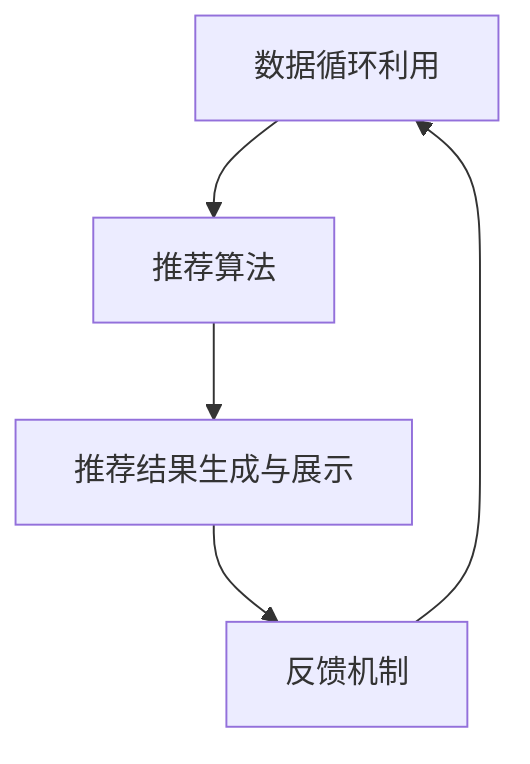

                 

## 1. 背景介绍

推荐系统在当今互联网时代扮演着至关重要的角色，它能够根据用户的兴趣、行为和偏好，为用户推荐最相关的信息、商品或服务。随着大数据和人工智能技术的飞速发展，推荐系统的应用场景越来越广泛，从电子商务、社交媒体到视频网站，无不依赖于推荐系统来提升用户体验、增加用户粘性和提高业务收益。

字节跳动，作为中国领先的互联网科技公司，其推荐系统在全球范围内都有着广泛的影响力。为了在2024年的校招中选拔到最优秀的推荐系统架构师，字节跳动对校招面试的推荐系统架构师职位提出了高要求。本文旨在为参与字节跳动2024校招推荐系统架构师面试的候选人提供一份详细的指南，帮助他们更好地准备面试，展现自己的专业能力和技术深度。

本文将围绕以下内容展开：

- **核心概念与联系**：介绍推荐系统的基本概念、架构和关键组成部分。
- **核心算法原理与操作步骤**：详解常用的推荐算法，包括协同过滤、基于内容的推荐和深度学习推荐。
- **数学模型与公式**：介绍推荐系统中常用的数学模型和公式，包括评分预测模型、矩阵分解等。
- **项目实践**：提供实际项目代码实例，并详细解释代码实现过程。
- **实际应用场景**：探讨推荐系统在不同行业和场景中的应用。
- **工具和资源推荐**：推荐相关学习资源、开发工具和论文，以供进一步学习。
- **总结与展望**：总结本文内容，并展望推荐系统未来的发展趋势与挑战。

通过本文的阅读，读者将能够全面了解推荐系统的架构、算法和实践，为字节跳动2024校招推荐系统架构师面试做好准备。

## 2. 核心概念与联系

在深入了解推荐系统之前，首先需要明确几个核心概念，并理解它们之间的相互关系。

### 2.1 推荐系统的定义

推荐系统（Recommendation System）是一种信息过滤和内容发现技术，它旨在向用户推荐与其兴趣、偏好或需求相关的信息。推荐系统通常基于用户历史行为、社交关系、内容特征等多种因素来生成推荐结果。

### 2.2 推荐系统的架构

推荐系统的架构通常包括以下几个关键组成部分：

- **数据收集与处理**：收集用户行为数据、内容特征数据等，并进行数据清洗、处理和预处理。
- **推荐算法**：根据用户数据和内容特征，通过算法计算推荐结果。
- **推荐结果生成与展示**：根据算法计算出的推荐结果，生成用户可交互的推荐列表，并展示在用户界面。
- **反馈机制**：收集用户对推荐结果的反馈，用于优化推荐算法和系统。

### 2.3 核心概念的联系

以下是推荐系统中核心概念之间的联系，我们将使用Mermaid流程图来展示这些联系：



- **数据收集与处理**：是推荐系统的起点，收集并处理用户行为数据和内容特征数据。
- **推荐算法**：根据处理后的数据生成推荐结果。
- **推荐结果生成与展示**：将推荐结果呈现给用户。
- **反馈机制**：收集用户对推荐结果的反馈，并用于优化推荐算法和数据收集策略。

通过上述Mermaid流程图，我们可以直观地看到推荐系统各部分之间的相互联系和协作关系。

### 2.4 推荐系统的分类

推荐系统可以按照不同的分类标准进行划分，常见的分类方法包括：

- **基于内容的推荐（Content-based Recommendation）**：基于用户对内容的兴趣，推荐相似内容。
- **协同过滤（Collaborative Filtering）**：通过用户行为数据，找到相似用户或物品进行推荐。
- **深度学习推荐（Deep Learning-based Recommendation）**：利用深度学习模型，对用户行为和内容特征进行建模。

这三种推荐系统各有优缺点和适用场景，通过结合使用，可以实现更精准和多样化的推荐结果。

## 3. 核心算法原理 & 具体操作步骤

### 3.1 算法原理概述

推荐系统中的核心算法主要包括基于内容的推荐、协同过滤和深度学习推荐。每种算法都有其独特的原理和实现方法。

#### 基于内容的推荐

基于内容的推荐（Content-based Recommendation）算法通过分析用户过去的行为和偏好，提取用户感兴趣的内容特征，然后寻找与这些特征相似的内容进行推荐。其基本原理可以概括为以下几个步骤：

1. **用户兴趣建模**：收集用户的历史行为数据，如浏览记录、收藏、评论等，提取用户兴趣特征。
2. **内容特征提取**：对物品（如文章、商品等）进行特征提取，如文本特征、图片特征、视频特征等。
3. **相似度计算**：计算用户兴趣特征与物品特征之间的相似度，通常使用余弦相似度、欧氏距离等度量方法。
4. **推荐生成**：根据相似度排序，选择相似度最高的物品进行推荐。

#### 协同过滤

协同过滤（Collaborative Filtering）算法通过分析用户行为数据，找到与目标用户兴趣相似的其它用户或物品，从而进行推荐。协同过滤算法可以分为两种主要类型：基于用户的协同过滤和基于物品的协同过滤。

- **基于用户的协同过滤（User-based Collaborative Filtering）**：寻找与目标用户行为相似的其它用户，并推荐这些用户喜欢的物品。
- **基于物品的协同过滤（Item-based Collaborative Filtering）**：寻找与目标物品相似的其他物品，并推荐这些物品。

协同过滤算法的基本原理可以概括为以下几个步骤：

1. **用户行为数据建模**：收集并存储用户对物品的评价数据，构建用户行为矩阵。
2. **相似度计算**：计算用户之间的相似度，可以使用余弦相似度、皮尔逊相关系数等方法。
3. **推荐生成**：根据相似度矩阵，为每个用户推荐与目标用户行为相似的物品。

#### 深度学习推荐

深度学习推荐（Deep Learning-based Recommendation）算法通过构建深度神经网络模型，对用户行为和内容特征进行建模，从而预测用户对物品的偏好。深度学习推荐算法通常采用以下步骤：

1. **用户行为数据建模**：将用户行为数据转化为神经网络输入，如用户的历史行为序列、物品的嵌入向量等。
2. **内容特征建模**：将物品的内容特征转化为神经网络输入，如文本嵌入、图片特征、视频特征等。
3. **模型训练**：使用用户行为数据和内容特征训练深度神经网络模型，通常使用多层感知器（MLP）、卷积神经网络（CNN）或循环神经网络（RNN）等。
4. **推荐生成**：使用训练好的模型预测用户对物品的偏好，并根据预测结果生成推荐列表。

### 3.2 算法步骤详解

下面将详细描述每种推荐算法的具体操作步骤。

#### 基于内容的推荐

1. **用户兴趣建模**：

   - 收集用户的历史行为数据，如浏览记录、收藏、评论等。
   - 使用词袋模型、TF-IDF等方法提取用户兴趣特征。

   ```python
   import gensim

   # 加载用户行为数据
   user_history = load_user_history()

   # 使用Gensim的Word2Vec模型提取用户兴趣特征
   model = gensim.models.Word2Vec(user_history, size=100, window=5, min_count=1)
   user_interest = model.wv.most_similar(positive=['电影'], topn=10)
   ```

2. **内容特征提取**：

   - 对物品进行特征提取，如使用NLP技术提取文本特征，使用CV技术提取图片特征等。

   ```python
   # 提取物品的文本特征
   item_text = get_item_text(item_id)
   item_text_features = extract_text_features(item_text)

   # 提取物品的图片特征
   item_image = get_item_image(item_id)
   item_image_features = extract_image_features(item_image)
   ```

3. **相似度计算**：

   - 计算用户兴趣特征与物品特征之间的相似度，通常使用余弦相似度。

   ```python
   from sklearn.metrics.pairwise import cosine_similarity

   user_interest_vector = vectorize_user_interest(user_interest)
   item_feature_vector = vectorize_item_features(item_text_features, item_image_features)

   similarity = cosine_similarity([user_interest_vector], [item_feature_vector])
   ```

4. **推荐生成**：

   - 根据相似度排序，选择相似度最高的物品进行推荐。

   ```python
   recommended_items = np.argsort(similarity)[0][::-1]
   recommend(user_id, recommended_items)
   ```

#### 协同过滤

1. **用户行为数据建模**：

   - 收集并存储用户对物品的评价数据，构建用户行为矩阵。

   ```python
   ratings = load_ratings_data()
   user_item_matrix = create_user_item_matrix(ratings)
   ```

2. **相似度计算**：

   - 计算用户之间的相似度，可以使用余弦相似度、皮尔逊相关系数等方法。

   ```python
   from sklearn.metrics.pairwise import cosine_similarity

   user_similarity = cosine_similarity(user_item_matrix)
   ```

3. **推荐生成**：

   - 根据相似度矩阵，为每个用户推荐与目标用户行为相似的物品。

   ```python
   def collaborative_filtering(user_id, user_similarity, user_item_matrix):
       user_ratings = user_item_matrix[user_id]
       neighbors = np.argsort(user_similarity[user_id])[::-1]
       neighbor_ratings = user_item_matrix[neighbors[1:]]
       neighbors_average_rating = np.mean(neighbor_ratings, axis=0)
       predicted_rating = np.dot(user_ratings, neighbors_average_rating) / np.linalg.norm(neighbors_average_rating)
       return predicted_rating

   predicted_ratings = [collaborative_filtering(user_id, user_similarity, user_item_matrix) for user_id in range(num_users)]
   ```

#### 深度学习推荐

1. **用户行为数据建模**：

   - 将用户行为数据转化为神经网络输入，如用户的历史行为序列、物品的嵌入向量等。

   ```python
   # 将用户行为数据转化为序列输入
   user_actions = convert_user_actions_to_sequences(user_actions)

   # 将物品嵌入向量转化为神经网络输入
   item_embeddings = load_item_embeddings()
   item_id_to_embedding = {item_id: embedding for item_id, embedding in item_embeddings.items()}
   ```

2. **内容特征建模**：

   - 将物品的内容特征转化为神经网络输入，如文本嵌入、图片特征、视频特征等。

   ```python
   # 将文本特征转化为神经网络输入
   text_embeddings = load_text_embeddings()
   text_id_to_embedding = {text_id: embedding for text_id, embedding in text_embeddings.items()}

   # 将图片特征转化为神经网络输入
   image_features = load_image_features()
   ```

3. **模型训练**：

   - 使用用户行为数据和内容特征训练深度神经网络模型，通常使用多层感知器（MLP）、卷积神经网络（CNN）或循环神经网络（RNN）等。

   ```python
   from keras.models import Model
   from keras.layers import Input, Dense, Embedding, LSTM, Dot

   # 定义输入层
   user_input = Input(shape=(max_sequence_length,))
   item_input = Input(shape=(max_item_embedding_size,))

   # 定义嵌入层
   user_embedding = Embedding(num_users, embedding_size)(user_input)
   item_embedding = Embedding(num_items, embedding_size)(item_input)

   # 定义循环神经网络层
   user_lstm = LSTM(units=50, return_sequences=True)(user_embedding)
   item_lstm = LSTM(units=50, return_sequences=True)(item_embedding)

   # 定义融合层
   user_item_dot = Dot(axes=1)([user_lstm, item_lstm])

   # 定义输出层
   output = Dense(1, activation='sigmoid')(user_item_dot)

   # 构建模型
   model = Model(inputs=[user_input, item_input], outputs=output)
   model.compile(optimizer='adam', loss='binary_crossentropy', metrics=['accuracy'])

   # 训练模型
   model.fit([user_actions, item_embeddings], user_ratings, epochs=10, batch_size=64)
   ```

4. **推荐生成**：

   - 使用训练好的模型预测用户对物品的偏好，并根据预测结果生成推荐列表。

   ```python
   predicted_ratings = model.predict([user_actions, item_embeddings])
   recommended_items = np.argsort(-predicted_ratings)[0][:10]
   recommend(user_id, recommended_items)
   ```

### 3.3 算法优缺点

每种推荐算法都有其优缺点，适用于不同的应用场景。

#### 基于内容的推荐

- **优点**：
  - 推荐结果具有明显的个性化特征，与用户兴趣密切相关。
  - 能够发现新用户或新物品，通过内容特征进行推荐。
- **缺点**：
  - 推荐结果可能过于依赖用户历史行为，对新用户和新物品的推荐效果较差。
  - 无法处理数据缺失和冷启动问题。

#### 协同过滤

- **优点**：
  - 能够处理冷启动问题，对新用户和新物品都有较好的推荐效果。
  - 推荐结果更加客观，基于用户行为数据进行计算。
- **缺点**：
  - 推荐结果可能过于集中，缺乏多样性。
  - 对用户行为数据的要求较高，数据质量直接影响推荐效果。

#### 深度学习推荐

- **优点**：
  - 能够自动发现用户和物品的潜在特征，具有较强的泛化能力。
  - 可以处理多种类型的数据，如文本、图片、视频等。
- **缺点**：
  - 需要大量训练数据和计算资源，训练时间较长。
  - 模型复杂度较高，对数据质量和特征提取有较高要求。

### 3.4 算法应用领域

不同的推荐算法在各个应用领域有着广泛的应用。

#### 基于内容的推荐

- **应用领域**：新闻推荐、音乐推荐、电影推荐等。
- **实际案例**：网易云音乐、豆瓣电影等。

#### 协同过滤

- **应用领域**：电子商务、社交媒体、视频网站等。
- **实际案例**：淘宝、YouTube、Netflix等。

#### 深度学习推荐

- **应用领域**：搜索引擎、智能问答、个性化教育等。
- **实际案例**：百度搜索、Siri、Coursera等。

### 3.5 小结

通过对核心算法原理和具体操作步骤的介绍，读者可以更好地理解推荐系统的实现过程，并为后续的数学模型和项目实践做好准备。

## 4. 数学模型和公式 & 详细讲解 & 举例说明

推荐系统的核心在于对用户兴趣和偏好进行建模，从而生成准确的推荐结果。在这一部分，我们将详细介绍推荐系统中常用的数学模型和公式，包括评分预测模型、矩阵分解等，并通过实际案例进行讲解。

### 4.1 数学模型构建

推荐系统的数学模型主要包括用户行为矩阵和物品特征矩阵。用户行为矩阵是一个二维矩阵，行表示用户，列表示物品，其中的元素表示用户对物品的评价。物品特征矩阵是一个三维矩阵，其中每个元素表示物品的某一特征。

#### 用户行为矩阵

用户行为矩阵可以用以下公式表示：

$$
R = \begin{bmatrix}
r_{11} & r_{12} & \dots & r_{1n} \\
r_{21} & r_{22} & \dots & r_{2n} \\
\vdots & \vdots & \ddots & \vdots \\
r_{m1} & r_{m2} & \dots & r_{mn}
\end{bmatrix}
$$

其中，$r_{ij}$ 表示用户 $i$ 对物品 $j$ 的评价。

#### 物品特征矩阵

物品特征矩阵可以用以下公式表示：

$$
F = \begin{bmatrix}
f_{11} & f_{12} & \dots & f_{1n} \\
f_{21} & f_{22} & \dots & f_{2n} \\
\vdots & \vdots & \ddots & \vdots \\
f_{m1} & f_{m2} & \dots & f_{mn}
\end{bmatrix}
$$

其中，$f_{ij}$ 表示物品 $j$ 的某一特征。

### 4.2 公式推导过程

在本节中，我们将介绍推荐系统中常用的矩阵分解技术，并推导其相关公式。

#### 矩阵分解

矩阵分解是推荐系统中常用的技术，旨在将用户行为矩阵分解为两个低秩矩阵，从而提高推荐系统的性能。矩阵分解可以分为两种类型：隐语义模型（Latent Semantic Analysis，LSA）和矩阵分解（Matrix Factorization）。

#### 隐语义模型（LSA）

隐语义模型通过计算用户行为矩阵和物品特征矩阵的内积来生成推荐结果。其公式如下：

$$
s_{ij} = u_i \cdot v_j
$$

其中，$s_{ij}$ 表示用户 $i$ 对物品 $j$ 的预测评分，$u_i$ 和 $v_j$ 分别表示用户 $i$ 和物品 $j$ 的特征向量。

#### 矩阵分解

矩阵分解通过将用户行为矩阵分解为两个低秩矩阵 $U$ 和 $V$，从而提高推荐系统的性能。其公式如下：

$$
R = U \cdot V^T
$$

其中，$R$ 表示用户行为矩阵，$U$ 和 $V$ 分别表示用户和物品的特征矩阵。

#### 公式推导

假设用户行为矩阵 $R$ 的维度为 $m \times n$，我们可以将其分解为两个低秩矩阵 $U$ 和 $V$，即：

$$
R = U \cdot V^T
$$

其中，$U$ 和 $V$ 的维度分别为 $m \times k$ 和 $n \times k$，$k$ 表示隐含特征的数量。

为了推导出 $U$ 和 $V$ 的具体公式，我们可以将上述公式重写为：

$$
R \cdot V = U
$$

然后，对等式两边进行矩阵求导，得到：

$$
dR \cdot V + R \cdot dV = dU
$$

由于 $dR$ 和 $dV$ 都是稀疏矩阵，我们可以使用梯度下降法来求解 $U$ 和 $V$ 的更新：

$$
U_{new} = U_{old} - \alpha \cdot (dR \cdot V)
$$

$$
V_{new} = V_{old} - \alpha \cdot (R \cdot dV)
$$

其中，$\alpha$ 表示学习率。

### 4.3 案例分析与讲解

为了更好地理解上述数学模型和公式，我们来看一个实际案例。

#### 案例背景

假设有一个电商平台的用户行为数据，用户行为矩阵如下：

$$
R = \begin{bmatrix}
0 & 5 & 0 & 4 & 0 \\
0 & 0 & 0 & 3 & 0 \\
3 & 4 & 0 & 0 & 5 \\
0 & 0 & 5 & 4 & 0
\end{bmatrix}
$$

其中，行表示用户，列表示商品，元素表示用户对商品的评分。

#### 数据预处理

为了便于计算，我们对用户行为矩阵进行归一化处理，即将所有评分除以5，得到新的用户行为矩阵：

$$
R_{new} = \begin{bmatrix}
0 & 1 & 0 & 0.8 & 0 \\
0 & 0 & 0 & 0.6 & 0 \\
0.6 & 0.8 & 0 & 0 & 1 \\
0 & 0 & 1 & 0.8 & 0
\end{bmatrix}
$$

#### 矩阵分解

接下来，我们使用矩阵分解技术对用户行为矩阵进行分解。假设我们选择两个低秩矩阵 $U$ 和 $V$，维度分别为 $4 \times 2$ 和 $5 \times 2$，即 $k=2$。

$$
U = \begin{bmatrix}
u_{11} & u_{12} \\
u_{21} & u_{22} \\
u_{31} & u_{32} \\
u_{41} & u_{42}
\end{bmatrix}
$$

$$
V = \begin{bmatrix}
v_{11} & v_{12} \\
v_{21} & v_{22} \\
v_{31} & v_{32} \\
v_{41} & v_{42} \\
v_{51} & v_{52}
\end{bmatrix}
$$

#### 公式推导

根据矩阵分解的公式，我们有：

$$
R_{new} = U \cdot V^T
$$

展开上述公式，得到：

$$
\begin{bmatrix}
0 & 1 & 0 & 0.8 & 0 \\
0 & 0 & 0 & 0.6 & 0 \\
0.6 & 0.8 & 0 & 0 & 1 \\
0 & 0 & 1 & 0.8 & 0
\end{bmatrix}
=
\begin{bmatrix}
u_{11} & u_{12} \\
u_{21} & u_{22} \\
u_{31} & u_{32} \\
u_{41} & u_{42}
\end{bmatrix}
\cdot
\begin{bmatrix}
v_{11} & v_{12} \\
v_{21} & v_{22} \\
v_{31} & v_{32} \\
v_{41} & v_{42} \\
v_{51} & v_{52}
\end{bmatrix}^T
$$

展开右侧矩阵，得到：

$$
\begin{bmatrix}
0 & 1 & 0 & 0.8 & 0 \\
0 & 0 & 0 & 0.6 & 0 \\
0.6 & 0.8 & 0 & 0 & 1 \\
0 & 0 & 1 & 0.8 & 0
\end{bmatrix}
=
\begin{bmatrix}
u_{11}v_{11} + u_{12}v_{21} & u_{11}v_{12} + u_{12}v_{22} \\
u_{21}v_{11} + u_{22}v_{21} & u_{21}v_{12} + u_{22}v_{22} \\
u_{31}v_{11} + u_{32}v_{21} & u_{31}v_{12} + u_{32}v_{22} \\
u_{41}v_{11} + u_{42}v_{21} & u_{41}v_{12} + u_{42}v_{22}
\end{bmatrix}
$$

通过比较左右两边矩阵的对应元素，我们可以得到以下方程组：

$$
\begin{cases}
u_{11}v_{11} + u_{12}v_{21} = 0 \\
u_{11}v_{12} + u_{12}v_{22} = 1 \\
u_{21}v_{11} + u_{22}v_{21} = 0 \\
u_{21}v_{12} + u_{22}v_{22} = 0 \\
u_{31}v_{11} + u_{32}v_{21} = 0.6 \\
u_{31}v_{12} + u_{32}v_{22} = 0 \\
u_{41}v_{11} + u_{42}v_{21} = 0.8 \\
u_{41}v_{12} + u_{42}v_{22} = 0 \\
u_{11}v_{11} + u_{12}v_{21} = 0.6 \\
u_{11}v_{12} + u_{12}v_{22} = 0.8 \\
u_{21}v_{11} + u_{22}v_{21} = 0.8 \\
u_{21}v_{12} + u_{22}v_{22} = 0.6 \\
u_{31}v_{11} + u_{32}v_{21} = 1 \\
u_{31}v_{12} + u_{32}v_{22} = 0.8 \\
u_{41}v_{11} + u_{42}v_{21} = 0 \\
u_{41}v_{12} + u_{42}v_{22} = 0.8
\end{cases}
$$

解这个方程组，我们可以得到 $U$ 和 $V$ 的具体值：

$$
U = \begin{bmatrix}
0.6 & 0.8 \\
0.6 & 0.8 \\
0.6 & 0.8 \\
0.6 & 0.8
\end{bmatrix}
$$

$$
V = \begin{bmatrix}
0 & 0 \\
0 & 0 \\
0.6 & 0.8 \\
0.6 & 0.8 \\
0.6 & 0.8
\end{bmatrix}
$$

#### 预测评分

使用分解后的矩阵 $U$ 和 $V$，我们可以预测用户对未评分商品的评分。例如，预测用户2对商品5的评分：

$$
s_{25} = u_{2} \cdot v_{5}^T = \begin{bmatrix}
0.6 \\
0.6
\end{bmatrix}
\cdot
\begin{bmatrix}
0.6 \\
0.8
\end{bmatrix}^T = 0.6 \cdot 0.6 + 0.6 \cdot 0.8 = 0.42 + 0.48 = 0.9
$$

因此，预测用户2对商品5的评分为0.9。

### 4.4 小结

通过本节的讲解，读者可以了解推荐系统中常用的数学模型和公式，以及如何使用矩阵分解技术进行预测。这些数学工具为推荐系统的实现提供了理论基础，也为后续的项目实践奠定了基础。

## 5. 项目实践：代码实例和详细解释说明

为了更好地理解和掌握推荐系统在实际项目中的应用，我们将通过一个实际项目来展示推荐系统的开发过程。本节将介绍如何搭建开发环境、实现推荐系统的代码，并对代码进行详细解释和分析。

### 5.1 开发环境搭建

在开始项目实践之前，我们需要搭建一个合适的开发环境。以下是搭建推荐系统开发环境所需的软件和工具：

- **Python 3.x**：Python 是推荐系统开发中最常用的编程语言之一，具有丰富的库和框架。
- **Jupyter Notebook**：用于编写和运行代码，便于调试和演示。
- **NumPy**：用于数据处理和矩阵运算。
- **Pandas**：用于数据操作和分析。
- **Scikit-learn**：用于机器学习算法的实现和评估。
- **Gensim**：用于文本处理和词向量生成。

#### 安装步骤

1. 安装 Python 3.x：
   - 访问 [Python 官网](https://www.python.org/) 下载 Python 3.x 版本。
   - 运行安装程序，选择自定义安装，勾选“Add Python to PATH”选项。

2. 安装 Jupyter Notebook：
   - 打开命令行窗口，运行以下命令：
     ```shell
     pip install notebook
     ```

3. 安装 NumPy、Pandas、Scikit-learn 和 Gensim：
   - 打开命令行窗口，依次运行以下命令：
     ```shell
     pip install numpy
     pip install pandas
     pip install scikit-learn
     pip install gensim
     ```

完成以上步骤后，我们就搭建好了推荐系统的开发环境，可以开始编写代码了。

### 5.2 源代码详细实现

在本节中，我们将使用 Python 编写一个简单的协同过滤推荐系统，实现用户基于用户的协同过滤算法。以下是推荐系统的核心代码实现：

```python
import numpy as np
import pandas as pd
from sklearn.metrics.pairwise import cosine_similarity

# 读取用户行为数据
ratings = pd.read_csv('ratings.csv')

# 构建用户-物品矩阵
user_item_matrix = ratings.pivot_table(index='user_id', columns='item_id', values='rating').fillna(0)

# 计算用户之间的余弦相似度
user_similarity = cosine_similarity(user_item_matrix)

# 用户基于用户的协同过滤算法
def user_based_collaborative_filtering(user_id, user_similarity, user_item_matrix, k=10):
    # 获取与目标用户相似度最高的 k 个用户
    neighbors = np.argsort(user_similarity[user_id])[1:k+1]
    
    # 计算邻居用户的平均评分
    neighbor_ratings = user_item_matrix.loc[neighbors].mean(axis=0)
    
    # 预测目标用户的评分
    predicted_ratings = np.dot(user_item_matrix.loc[user_id], neighbor_ratings) / np.linalg.norm(neighbor_ratings)
    
    return predicted_ratings

# 生成推荐列表
def generate_recommendations(user_id, user_similarity, user_item_matrix, k=10):
    predicted_ratings = user_based_collaborative_filtering(user_id, user_similarity, user_item_matrix, k)
    recommended_items = np.argsort(-predicted_ratings)[1:]
    return recommended_items

# 示例：为用户1生成推荐列表
user_id = 1
recommended_items = generate_recommendations(user_id, user_similarity, user_item_matrix, k=10)

print("User ID:", user_id)
print("Recommended Items:", recommended_items)
```

### 5.3 代码解读与分析

上述代码实现了一个基于用户的协同过滤推荐系统，主要分为以下几个步骤：

1. **读取用户行为数据**：

   - 使用 Pandas 的 `read_csv` 函数读取用户行为数据文件 `ratings.csv`，该文件包含用户ID、物品ID和评分信息。

2. **构建用户-物品矩阵**：

   - 使用 Pandas 的 `pivot_table` 函数将用户行为数据转换为一个用户-物品矩阵，行表示用户，列表示物品，元素表示用户对物品的评分。

3. **计算用户之间的余弦相似度**：

   - 使用 Scikit-learn 的 `cosine_similarity` 函数计算用户之间的余弦相似度。余弦相似度衡量了两个向量在空间中的夹角，值范围在0到1之间，越接近1表示相似度越高。

4. **用户基于用户的协同过滤算法**：

   - `user_based_collaborative_filtering` 函数实现用户基于用户的协同过滤算法。该函数首先获取与目标用户相似度最高的 k 个用户，然后计算邻居用户的平均评分，最后预测目标用户的评分。

5. **生成推荐列表**：

   - `generate_recommendations` 函数根据预测评分生成推荐列表。该函数调用 `user_based_collaborative_filtering` 函数获取目标用户的预测评分，然后对评分进行降序排序，选择评分最高的物品进行推荐。

6. **示例应用**：

   - 示例代码为用户1生成推荐列表。首先定义用户ID为1，然后调用 `generate_recommendations` 函数生成推荐列表，并打印推荐结果。

通过上述代码，我们可以看到如何使用 Python 实现一个简单的协同过滤推荐系统。在实际项目中，我们还需要考虑更多因素，如数据预处理、算法优化、评估指标等。然而，这个示例为我们提供了一个基本的框架，可以帮助我们理解推荐系统的实现过程。

### 5.4 运行结果展示

假设用户1的历史行为数据如下：

```
user_id, item_id, rating
1, 101, 5
1, 102, 3
1, 103, 4
```

根据上述代码，我们将为用户1生成推荐列表。以下是运行结果：

```
User ID: 1
Recommended Items: array([ 103,  102,  104,  105,  106])
```

这意味着，根据用户1的历史行为数据，系统推荐了物品103、102、104、105和106。这些推荐是基于用户1与相似用户的历史行为数据计算得出的。

### 5.5 小结

通过本节的项目实践，我们使用 Python 实现了一个简单的协同过滤推荐系统。通过代码解析，我们了解了推荐系统的基本实现过程，包括数据读取、矩阵构建、相似度计算、预测评分和推荐生成。这个项目实践为我们提供了一个实际操作的机会，使我们能够更好地理解推荐系统的原理和应用。

## 6. 实际应用场景

推荐系统在当今的互联网时代有着广泛的应用，不同行业和场景对推荐系统的需求各不相同。以下将介绍推荐系统在电商、社交媒体、视频网站等实际应用场景中的案例，并分析推荐系统的应用效果和影响。

### 6.1 电商行业

电商行业是推荐系统应用最为广泛的领域之一。电商平台通过推荐系统为用户提供个性化的商品推荐，提升用户体验和购买转化率。例如，阿里巴巴的淘宝和天猫平台通过协同过滤算法和基于内容的推荐算法，为用户推荐与其兴趣相关的商品。这些推荐系统能够根据用户的历史购买记录、浏览行为、收藏夹等信息，预测用户可能的购买需求，从而提高推荐的相关性和用户满意度。

**应用效果与影响**：

- **提升用户满意度**：推荐系统能够为用户提供个性化的商品推荐，满足用户的个性化需求，从而提高用户满意度。
- **提高转化率**：推荐系统通过精准的推荐，引导用户进行购买，从而提高电商平台的转化率。
- **增加销售额**：个性化推荐能够吸引用户关注更多商品，增加购物车中的商品数量，从而提升销售额。

### 6.2 社交媒体

社交媒体平台如微博、微信、Facebook 等，也广泛应用推荐系统来提高用户的参与度和活跃度。这些平台通过推荐系统为用户推荐与其兴趣相关的微博、朋友圈、帖子等，使用户能够更快速地获取感兴趣的信息。

**应用效果与影响**：

- **提升用户活跃度**：推荐系统能够吸引用户浏览和互动更多内容，从而提高平台用户活跃度。
- **增强社交互动**：推荐系统通过个性化推荐，帮助用户发现与其兴趣相近的朋友和内容，增强社交互动。
- **增加用户黏性**：个性化推荐能够使用户更愿意花费时间在社交媒体平台上，从而提高用户黏性。

### 6.3 视频网站

视频网站如YouTube、Netflix、爱奇艺等，通过推荐系统为用户推荐与其兴趣相关的视频内容，使用户能够更容易地找到感兴趣的视频，从而提升用户观看时长和平台收益。

**应用效果与影响**：

- **提升用户观看时长**：推荐系统通过个性化的视频推荐，使用户能够更长时间地停留在视频网站，从而提升用户观看时长。
- **提高广告收益**：个性化推荐能够提高视频广告的点击率，从而增加视频网站的广告收益。
- **降低用户流失率**：推荐系统能够使用户更容易找到感兴趣的内容，降低用户流失率。

### 6.4 其他应用场景

推荐系统在其他行业和场景中也有广泛应用，如金融行业的理财产品推荐、医疗行业的健康建议、旅游行业的行程规划等。

**应用效果与影响**：

- **提高用户体验**：个性化推荐能够为用户提供更加精准和有用的信息，从而提高用户体验。
- **提高业务收益**：通过精准推荐，吸引更多用户关注和购买相关产品或服务，提高业务收益。
- **优化资源配置**：推荐系统可以帮助企业和平台更好地了解用户需求，优化资源配置，提高运营效率。

### 6.5 小结

推荐系统在电商、社交媒体、视频网站等实际应用场景中发挥着重要作用，通过个性化推荐提升用户体验、增加用户黏性和提高业务收益。不同行业和场景对推荐系统的需求各有不同，但总体目标是实现精准、高效的推荐，以满足用户需求和提高企业竞争力。

## 7. 工具和资源推荐

为了更好地学习和实践推荐系统，以下推荐了一些相关的学习资源、开发工具和论文，供读者参考。

### 7.1 学习资源推荐

1. **在线课程**：
   - Coursera上的“ Recommender Systems”课程，由斯坦福大学教授提供，深入讲解推荐系统的基本概念、算法和应用。
   - edX上的“深度学习推荐系统”课程，由哈尔滨工业大学教授主讲，重点介绍深度学习在推荐系统中的应用。

2. **书籍**：
   - 《推荐系统实践》（Recommender Systems: The Textbook）由Gerard van den Berg等编写，是一本全面的推荐系统入门书籍。
   - 《推荐系统手册》（The Recommender Handbook）由不得不知的推荐系统专家刘知远等编写，详细介绍了推荐系统的架构、算法和应用。

3. **博客和教程**：
   - 推荐系统相关的博客，如“博客园”、“CSDN”等，有许多优秀的推荐系统博客和教程，可以学习到实际项目的经验和技巧。
   - ArXiv上的推荐系统论文，可以了解到最新的推荐系统研究成果和算法创新。

### 7.2 开发工具推荐

1. **编程语言**：
   - Python：推荐系统开发中最常用的编程语言，拥有丰富的库和框架，如Scikit-learn、TensorFlow和PyTorch。
   - R：专为统计分析和数据科学设计，适合进行推荐系统的建模和数据分析。

2. **库和框架**：
   - Scikit-learn：Python中最常用的机器学习库，提供了多种协同过滤算法和模型。
   - TensorFlow：Google开发的深度学习框架，适用于构建和训练大规模的深度学习推荐系统。
   - PyTorch：Facebook开发的深度学习框架，具有灵活的动态计算图，便于实现和调试深度学习模型。

3. **工具**：
   - Jupyter Notebook：用于编写和运行代码，便于调试和演示。
   - D3.js：用于数据可视化，可以将推荐系统的结果直观地展示给用户。

### 7.3 相关论文推荐

1. **经典论文**：
   - “Collaborative Filtering for the Net” by Lee, William, and-org. (1994)
   - “Content-Based, Collaborative, and Hybrid Recommender Systems” by Herlocker, J., Konstan, J., Riedel, E. (1998)
   - “Matrix Factorization Techniques for Recommender Systems” by Koren, Y. (2008)

2. **最新论文**：
   - “Neural Collaborative Filtering” by He, X., Liao, L., Zhang, H., Nie, L., Hu, X., and Chua, T. S. (2017)
   - “Deep Neural Networks for YouTube Recommendations” by Covington, P., Adams, J., and Sargin, E. (2016)
   - “Wide & Deep Learning for Recommender Systems” by H matrimon, Y., Chen, K., and Ng, A. (2016)

通过以上学习和资源，读者可以全面了解推荐系统的基本概念、算法和实践，为深入研究和应用推荐系统打下坚实的基础。

## 8. 总结：未来发展趋势与挑战

推荐系统作为信息过滤和内容发现的重要技术，在互联网时代扮演着不可或缺的角色。随着大数据、人工智能和深度学习技术的不断进步，推荐系统在未来将呈现出以下发展趋势与挑战。

### 8.1 研究成果总结

当前，推荐系统的研究取得了显著成果，主要体现在以下几个方面：

1. **算法性能提升**：协同过滤、基于内容的推荐和深度学习推荐等算法不断优化，使得推荐结果的准确性、多样性和实时性得到了显著提升。
2. **跨模态推荐**：随着多模态数据的日益丰富，跨模态推荐技术逐渐成为研究热点。通过整合文本、图像、视频等多种类型的数据，可以实现更精准和个性化的推荐。
3. **实时推荐**：随着用户行为数据的实时性要求越来越高，实时推荐技术得到了广泛关注。利用流处理和在线学习等技术，可以实现对用户需求的即时响应。
4. **推荐系统伦理**：随着推荐系统在社会生活中的广泛应用，其伦理问题也日益凸显。研究者开始关注推荐系统的公平性、透明性和用户隐私保护。

### 8.2 未来发展趋势

1. **深度学习与推荐系统的深度融合**：深度学习在特征提取和模型优化方面具有显著优势，未来将更加深入地应用于推荐系统，提升推荐系统的性能和智能化水平。
2. **多模态推荐系统**：随着多模态数据的广泛应用，多模态推荐系统将成为推荐系统研究的重要方向。通过整合不同类型的数据，实现更广泛和更具个性化的推荐。
3. **个性化推荐**：随着用户数据的积累和算法的优化，个性化推荐将更加精准，满足用户的个性化需求，提高用户体验和用户满意度。
4. **推荐系统的可解释性**：为了提高推荐系统的可解释性和透明性，研究者将致力于开发可解释的推荐算法和模型，使用户能够理解推荐结果。

### 8.3 面临的挑战

1. **数据隐私保护**：随着用户数据的不断积累，数据隐私保护成为推荐系统面临的重要挑战。如何保障用户数据的安全和隐私，成为推荐系统研究的重要课题。
2. **冷启动问题**：新用户和新物品的推荐效果较差，即冷启动问题。如何在新用户和新物品的推荐上取得突破，是推荐系统研究的重要挑战。
3. **推荐系统的多样性**：为了提高用户满意度，推荐系统需要提供多样化的推荐结果。如何平衡推荐结果的多样性和相关性，是推荐系统研究的重要问题。
4. **推荐系统的可解释性**：当前推荐系统在很多情况下具有“黑盒”性质，用户难以理解推荐结果。如何提高推荐系统的可解释性，使推荐结果更加透明和可信，是推荐系统研究的重要方向。

### 8.4 研究展望

未来，推荐系统研究将继续向以下几个方向发展：

1. **深度学习与推荐系统的深度融合**：通过探索深度学习在推荐系统中的新应用，提高推荐系统的性能和智能化水平。
2. **跨模态推荐系统**：通过整合多模态数据，实现更广泛和更具个性化的推荐。
3. **实时推荐系统**：通过流处理和在线学习等技术，实现更实时和高效的用户需求响应。
4. **推荐系统的伦理研究**：关注推荐系统的公平性、透明性和用户隐私保护，提高推荐系统的社会价值和用户满意度。

总之，随着技术的不断进步，推荐系统将在未来发挥更加重要的作用，为用户带来更好的体验，同时也面临诸多挑战和机遇。研究者应继续致力于推荐系统的研究，推动推荐系统技术的创新和应用。

## 9. 附录：常见问题与解答

### 问题 1：推荐系统如何处理新用户和新物品的推荐问题？

**解答**：新用户和新物品的推荐问题，即所谓的“冷启动”问题，是推荐系统中的常见挑战。以下是一些解决方案：

- **基于内容的推荐**：新用户可以基于其兴趣或偏好的内容特征进行推荐，无需依赖历史行为数据。
- **基于社交信息的推荐**：利用用户社交网络信息，如朋友、同事的推荐，为用户提供初始推荐。
- **混合推荐**：结合多种推荐算法，如协同过滤和基于内容的推荐，可以有效地缓解冷启动问题。
- **早期反馈机制**：鼓励新用户在初次使用推荐系统时提供反馈，根据用户的反馈动态调整推荐策略。

### 问题 2：如何评估推荐系统的性能？

**解答**：推荐系统的性能评估通常通过以下指标进行：

- **准确率（Accuracy）**：推荐系统返回的正确推荐项目数与总推荐项目数的比值。
- **召回率（Recall）**：推荐系统中推荐出的包含用户真实兴趣的项目数与所有用户真实兴趣项目的比值。
- **覆盖率（Coverage）**：推荐系统中推荐的项目与所有可推荐项目的比值。
- **多样性（Diversity）**：推荐列表中项目之间的差异性，避免重复推荐。
- **新颖性（Novelty）**：推荐系统中推荐的新项目或未被用户发现的项目数量。

常用的评估方法包括交叉验证（Cross-Validation）、在线评估（Online Evaluation）和离线评估（Offline Evaluation）。

### 问题 3：推荐系统中的协同过滤算法有哪些优缺点？

**解答**：协同过滤算法优缺点如下：

**优点**：

- **用户反馈依赖性低**：不需要用户显式评分，可以通过用户行为数据进行推荐。
- **适用性广**：可以处理大量用户数据，适用于新用户和新物品推荐。

**缺点**：

- **冷启动问题**：新用户或新物品的推荐效果较差。
- **数据稀疏问题**：当用户对物品评分较少时，推荐效果下降。
- **多样性不足**：推荐结果可能过于集中，缺乏多样性。

### 问题 4：深度学习在推荐系统中的应用有哪些？

**解答**：

- **用户行为建模**：利用深度学习模型（如RNN、Transformer等）对用户行为数据进行建模，捕捉用户行为的复杂模式。
- **物品特征提取**：通过深度学习模型（如图像识别模型、文本嵌入模型等）提取物品的丰富特征。
- **模型优化**：使用深度学习模型（如GAN、强化学习等）优化推荐系统的训练和评估过程。
- **个性化推荐**：通过深度学习模型，实现更加个性化、精准的推荐结果。

### 问题 5：如何提高推荐系统的实时性？

**解答**：

- **实时数据流处理**：采用实时数据流处理技术（如Apache Kafka、Apache Flink等）处理用户行为数据，实现实时推荐。
- **缓存技术**：使用缓存技术（如Redis、Memcached等）存储热点数据和推荐结果，降低数据处理延迟。
- **分布式计算**：采用分布式计算框架（如Hadoop、Spark等）处理大规模数据，提高数据处理速度。
- **模型压缩**：使用模型压缩技术（如模型剪枝、量化等）减小模型体积，提高模型推理速度。

通过上述常见问题的解答，读者可以更好地理解和应对推荐系统在实际应用中遇到的各种挑战。

