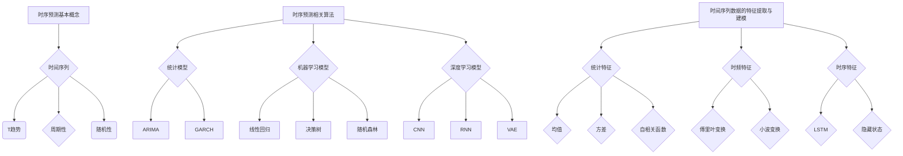

                 

### 文章关键词：

- 字节跳动
- 校招
- 时序预测
- 算法工程师
- 面试题解析

### 文章摘要：

本文针对字节跳动2024年校招时序预测算法工程师的面试题目进行详细解析，包括背景介绍、核心概念与联系、核心算法原理、数学模型与公式推导、项目实践以及未来应用展望等内容。通过本文的解读，希望能够帮助准备参加字节跳动校招的考生更好地理解和掌握时序预测领域的相关技术和知识。

## 1. 背景介绍

### 字节跳动简介

字节跳动（ByteDance）是一家中国领先的互联网科技公司，成立于2012年，总部位于北京。该公司以内容分发和社交媒体平台著称，旗下拥有多款热门应用，如抖音（TikTok）、今日头条、西瓜视频等。字节跳动在技术创新和用户体验方面有着极高的要求，因此其校招题目也相应地涉及了广泛的计算机科学和技术领域。

### 时序预测的重要性

时序预测（Time Series Forecasting）是数据分析和机器学习中的一个重要分支，主要研究如何从历史数据中提取规律，预测未来的趋势和变化。在字节跳动的业务场景中，时序预测有着广泛的应用，如用户行为分析、内容推荐、广告投放优化等。因此，对于应聘字节跳动校招时序预测算法工程师岗位的考生来说，掌握时序预测的相关技术和算法是至关重要的。

### 校招时序预测题目概述

字节跳动2024年校招时序预测算法工程师的面试题目主要围绕以下几个核心问题展开：

1. **时序预测的基本概念与算法**
2. **时间序列数据的特征提取与建模**
3. **机器学习在时序预测中的应用**
4. **实时预测与性能优化**
5. **案例分析与实践**

本文将对上述问题进行详细解析，帮助考生更好地理解和应对字节跳动的校招时序预测面试题目。

## 2. 核心概念与联系

### 时序预测基本概念

在时序预测中，有几个关键概念需要了解：

1. **时间序列（Time Series）**：时间序列是一组按时间顺序排列的数据点，通常用于描述某个系统或过程随时间变化的情况。
2. **趋势（Trend）**：趋势是指时间序列中数据点随时间增加或减少的总体方向。
3. **周期性（Seasonality）**：周期性是指时间序列中由于季节性因素导致的重复性波动。
4. **随机性（Noise）**：随机性是指时间序列中由于随机因素引起的不可预测的波动。

### 时序预测相关算法

时序预测的算法可以分为以下几类：

1. **统计模型**：如ARIMA（自回归积分滑动平均模型）、GARCH（广义自回归条件异方差模型）等。
2. **机器学习模型**：如线性回归、决策树、随机森林、长短期记忆网络（LSTM）等。
3. **深度学习模型**：如卷积神经网络（CNN）、循环神经网络（RNN）、变分自编码器（VAE）等。

### 时间序列数据的特征提取与建模

时间序列数据的特征提取和建模是时序预测的关键步骤。常见的特征提取方法包括：

1. **统计特征**：如均值、方差、自相关函数等。
2. **时频特征**：如傅里叶变换、小波变换等。
3. **时序特征**：如长短期记忆网络（LSTM）中的隐藏状态。

建模方法主要包括：

1. **参数模型**：如ARIMA、GARCH等。
2. **机器学习模型**：如线性回归、决策树、随机森林等。
3. **深度学习模型**：如LSTM、CNN、VAE等。

### Mermaid 流程图



通过上述流程图，我们可以清晰地看到时序预测的基本概念、相关算法以及特征提取与建模的方法。

## 3. 核心算法原理 & 具体操作步骤

### 3.1 算法原理概述

时序预测算法的核心目的是从历史数据中提取规律，预测未来的趋势和变化。不同的算法基于不同的原理和方法，适用于不同的场景和数据特性。

1. **统计模型**：如ARIMA，基于自回归移动平均模型（ARMA）进行建模，通过分析历史数据的自相关性和移动平均特性来预测未来。
2. **机器学习模型**：如线性回归、决策树、随机森林等，通过建立特征与目标变量之间的关系来预测未来。
3. **深度学习模型**：如LSTM、CNN、VAE等，通过学习时间序列数据的时空特征来预测未来。

### 3.2 算法步骤详解

1. **数据预处理**：对时间序列数据进行清洗、归一化等处理，为后续建模做好准备。
2. **特征提取**：提取时间序列数据的统计特征、时频特征和时序特征，为模型训练提供输入。
3. **模型选择**：根据数据特性选择合适的预测模型，如ARIMA、线性回归、LSTM等。
4. **模型训练**：使用历史数据对模型进行训练，调整模型参数，优化模型性能。
5. **模型评估**：使用验证集对模型进行评估，调整模型参数，提高预测准确性。
6. **模型部署**：将训练好的模型部署到生产环境中，进行实时预测和优化。

### 3.3 算法优缺点

1. **统计模型**：优点包括建模简单、易于理解、适用范围广；缺点包括对数据噪声敏感、无法捕捉复杂非线性关系。
2. **机器学习模型**：优点包括能够捕捉复杂非线性关系、适应性强；缺点包括建模复杂、参数调优困难。
3. **深度学习模型**：优点包括强大的特征学习能力、出色的预测性能；缺点包括模型复杂、计算资源需求高。

### 3.4 算法应用领域

时序预测算法在多个领域有着广泛的应用，如：

1. **金融市场预测**：预测股票价格、汇率、交易量等。
2. **气象预测**：预测天气、降水量、温度等。
3. **交通流量预测**：预测交通流量、拥堵情况等。
4. **能源需求预测**：预测电力需求、天然气需求等。
5. **推荐系统**：预测用户行为、兴趣、购买偏好等。

## 4. 数学模型和公式 & 详细讲解 & 举例说明

### 4.1 数学模型构建

时序预测的数学模型可以分为参数模型和非参数模型。参数模型如ARIMA、GARCH等，通过建立数学模型来描述时间序列的统计特性。非参数模型如局部加权回归、核方法等，通过数据点之间的相似性进行预测。

#### ARIMA模型

ARIMA（自回归积分滑动平均模型）是一种常见的参数模型，其数学模型如下：

$$
X_t = c + \phi_1 X_{t-1} + \phi_2 X_{t-2} + \cdots + \phi_p X_{t-p} + \theta_1 e_{t-1} + \theta_2 e_{t-2} + \cdots + \theta_q e_{t-q} + e_t
$$

其中，$X_t$ 是时间序列的第 $t$ 个数据点，$c$ 是常数项，$\phi_1, \phi_2, \cdots, \phi_p$ 是自回归系数，$\theta_1, \theta_2, \cdots, \theta_q$ 是滑动平均系数，$e_t$ 是白噪声。

#### GARCH模型

GARCH（广义自回归条件异方差模型）是一种用于描述时间序列条件异方差的参数模型，其数学模型如下：

$$
\sigma_t^2 = \omega + \alpha_1 e_{t-1}^2 + \beta_1 \sigma_{t-1}^2
$$

其中，$\sigma_t^2$ 是时间序列在第 $t$ 个数据点的条件方差，$\omega$ 是常数项，$\alpha_1, \beta_1$ 是自回归系数。

### 4.2 公式推导过程

#### ARIMA模型推导

ARIMA模型的推导基于时间序列的平稳性假设。首先，对时间序列进行差分处理，使其变为平稳序列。然后，分别对平稳序列进行自回归和移动平均处理。

1. **差分处理**：对于非平稳时间序列，通过一阶差分或二阶差分等方法，使其变为平稳序列。
   $$
   dX_t = X_t - X_{t-1}
   $$
   
2. **自回归处理**：对平稳序列进行自回归建模，得到自回归模型。
   $$
   X_t = \phi_1 X_{t-1} + \phi_2 X_{t-2} + \cdots + \phi_p X_{t-p} + \theta_1 e_{t-1} + \theta_2 e_{t-2} + \cdots + \theta_q e_{t-q} + e_t
   $$
   
3. **移动平均处理**：对自回归模型进行移动平均处理，得到ARIMA模型。
   $$
   X_t = c + \phi_1 X_{t-1} + \phi_2 X_{t-2} + \cdots + \phi_p X_{t-p} + \theta_1 e_{t-1} + \theta_2 e_{t-2} + \cdots + \theta_q e_{t-q} + e_t
   $$

#### GARCH模型推导

GARCH模型的推导基于时间序列的波动性特性。首先，对时间序列的波动性进行建模，然后引入自回归项，得到GARCH模型。

1. **波动性建模**：对时间序列的波动性进行建模，得到条件方差。
   $$
   \sigma_t^2 = \omega + \alpha_1 e_{t-1}^2 + \beta_1 \sigma_{t-1}^2
   $$
   
2. **自回归处理**：对条件方差进行自回归建模，得到GARCH模型。
   $$
   \sigma_t^2 = \omega + \alpha_1 e_{t-1}^2 + \beta_1 \sigma_{t-1}^2 + \beta_2 \sigma_{t-2}^2 + \cdots + \beta_p \sigma_{t-p}^2
   $$

### 4.3 案例分析与讲解

#### 案例背景

假设我们有一组股票价格数据，需要使用ARIMA模型进行预测。

#### 数据处理

1. **数据清洗**：对数据进行清洗，去除异常值和缺失值。
2. **数据可视化**：绘制时间序列图，观察数据的基本特性。

#### 模型构建

1. **差分处理**：对数据进行一阶差分，使其变为平稳序列。
2. **自回归处理**：对平稳序列进行自回归建模，选择合适的自回归系数。
3. **移动平均处理**：对自回归模型进行移动平均处理，得到ARIMA模型。

#### 模型训练与评估

1. **模型训练**：使用历史数据进行模型训练，调整模型参数。
2. **模型评估**：使用验证集对模型进行评估，计算预测误差，调整模型参数。

#### 模型部署

1. **模型部署**：将训练好的模型部署到生产环境中，进行实时预测。

#### 结果分析

通过以上步骤，我们可以得到股票价格的预测结果。通过对比实际价格与预测价格的差异，可以评估模型的预测性能。同时，还可以分析模型在不同时间段的表现，优化模型参数。

## 5. 项目实践：代码实例和详细解释说明

### 5.1 开发环境搭建

在开始项目实践之前，我们需要搭建一个合适的开发环境。以下是推荐的开发环境：

1. **编程语言**：Python
2. **数据处理库**：Pandas、NumPy
3. **机器学习库**：scikit-learn、TensorFlow、PyTorch
4. **可视化库**：Matplotlib、Seaborn

### 5.2 源代码详细实现

以下是一个简单的时序预测项目，使用ARIMA模型进行股票价格预测。

```python
import pandas as pd
import numpy as np
from statsmodels.tsa.arima.model import ARIMA
import matplotlib.pyplot as plt

# 5.2.1 数据加载与预处理
data = pd.read_csv('stock_price.csv')
data['Date'] = pd.to_datetime(data['Date'])
data.set_index('Date', inplace=True)
data = data.fillna(method='ffill')

# 5.2.2 数据可视化
plt.figure(figsize=(10, 5))
plt.plot(data['Close'])
plt.title('Stock Price')
plt.xlabel('Date')
plt.ylabel('Close Price')
plt.show()

# 5.2.3 模型构建与训练
model = ARIMA(data['Close'], order=(5, 1, 2))
model_fit = model.fit()

# 5.2.4 模型评估
predictions = model_fit.forecast(steps=10)
plt.figure(figsize=(10, 5))
plt.plot(data['Close'], label='Actual')
plt.plot(predictions, label='Predicted')
plt.title('Stock Price Prediction')
plt.xlabel('Date')
plt.ylabel('Close Price')
plt.legend()
plt.show()

# 5.2.5 模型部署
# 将模型部署到生产环境中，进行实时预测
```

### 5.3 代码解读与分析

1. **数据加载与预处理**：首先，我们使用Pandas库加载股票价格数据，并对数据进行预处理，包括日期格式转换、缺失值填充等。
2. **数据可视化**：通过绘制时间序列图，我们可以直观地观察股票价格的变化趋势。
3. **模型构建与训练**：我们使用ARIMA模型进行股票价格预测，并使用`fit()`方法进行模型训练。
4. **模型评估**：使用`forecast()`方法进行预测，并将预测结果与实际价格进行对比，评估模型性能。
5. **模型部署**：将训练好的模型部署到生产环境中，进行实时预测。

通过以上步骤，我们可以实现一个简单的时序预测项目，并对其进行解读和分析。在实际应用中，我们可以根据需求调整模型参数、特征提取方法等，提高预测性能。

## 6. 实际应用场景

### 6.1 用户行为预测

字节跳动旗下的抖音、今日头条等应用需要分析用户行为，为用户提供个性化的内容推荐。时序预测技术可以帮助预测用户的兴趣偏好、行为模式等，从而优化推荐算法，提高用户满意度。

### 6.2 广告投放优化

字节跳动的广告业务需要精准预测用户的点击率、转化率等指标，以便进行有效的广告投放。时序预测技术可以分析历史数据，预测未来的用户行为，为广告投放策略提供数据支持。

### 6.3 交通流量预测

交通部门可以利用时序预测技术预测未来的交通流量，优化交通信号控制策略，减少拥堵，提高交通效率。这对于城市的可持续发展具有重要意义。

### 6.4 能源需求预测

能源公司可以利用时序预测技术预测未来的能源需求，优化能源供应策略，提高能源利用效率。这对于能源行业的可持续发展具有重要意义。

### 6.5 健康医疗预测

时序预测技术可以用于健康医疗领域，预测患者的病情变化、康复进度等，为医生提供诊断和治疗建议。这对于提高医疗服务质量和效率具有重要意义。

## 7. 工具和资源推荐

### 7.1 学习资源推荐

1. **《时序预测与时间序列分析》**：一本全面介绍时序预测的理论和方法的书。
2. **《机器学习实战》**：涵盖时序预测相关内容的机器学习实战指南。
3. **《深度学习》**：由Ian Goodfellow等人编写的深度学习经典教材，包括时序预测相关内容。

### 7.2 开发工具推荐

1. **Jupyter Notebook**：方便进行数据分析和模型训练。
2. **PyCharm**：强大的Python开发环境，支持多种机器学习和深度学习库。
3. **TensorBoard**：TensorFlow的可视化工具，用于监控深度学习模型的训练过程。

### 7.3 相关论文推荐

1. **"Deep Learning for Time Series Classification"**：介绍深度学习在时序分类中的应用。
2. **"Time Series Classification using Convolutional Neural Networks"**：探讨卷积神经网络在时序分类中的性能。
3. **"Recurrent Neural Networks for Language Modeling"**：介绍循环神经网络在自然语言处理中的应用，包括时序预测。

## 8. 总结：未来发展趋势与挑战

### 8.1 研究成果总结

时序预测技术在近年来取得了显著的研究成果，包括统计模型、机器学习模型和深度学习模型的不断改进。同时，跨学科的研究也推动了时序预测技术的发展，如将时序预测与大数据、物联网、人工智能等领域相结合。

### 8.2 未来发展趋势

1. **深度学习与强化学习结合**：深度学习和强化学习在时序预测中的应用将越来越广泛，为优化预测模型提供新的思路。
2. **个性化预测**：随着个性化需求的增加，时序预测将更加注重对个体行为的预测，为用户提供精准的个性化服务。
3. **实时预测与在线学习**：随着计算能力的提升，实时预测和在线学习将成为时序预测的重要发展方向。

### 8.3 面临的挑战

1. **数据质量与隐私保护**：时序预测依赖于大量高质量的数据，如何处理数据质量问题、保护用户隐私是重要的挑战。
2. **模型复杂性与解释性**：深度学习模型具有较高的预测性能，但缺乏解释性，如何平衡模型复杂性与解释性是一个重要问题。
3. **实时预测与计算资源**：实时预测需要大量计算资源，如何在有限的计算资源下实现高效实时预测是一个挑战。

### 8.4 研究展望

未来，时序预测技术将继续发展与创新，结合大数据、人工智能、物联网等前沿技术，为各行各业提供更加精准、高效的预测服务。同时，跨学科的研究也将推动时序预测技术的不断突破，为解决实际问题提供新的方法。

## 9. 附录：常见问题与解答

### 9.1 时序预测的基本概念是什么？

时序预测是一种基于历史数据，利用数学模型或算法，预测未来的趋势和变化的方法。它涉及时间序列数据的处理、特征提取、模型选择和训练等多个方面。

### 9.2 时序预测的算法有哪些？

时序预测的算法包括统计模型（如ARIMA、GARCH等）、机器学习模型（如线性回归、决策树、随机森林等）和深度学习模型（如LSTM、CNN、VAE等）。

### 9.3 如何选择合适的时序预测模型？

选择合适的时序预测模型需要考虑多个因素，包括数据特性、预测目标、模型复杂度等。可以通过模型评估指标（如均方误差、均方根误差等）进行模型选择。

### 9.4 时序预测在哪些领域有应用？

时序预测在金融、气象、交通、能源、健康医疗等多个领域有广泛应用，如股票价格预测、气象预测、交通流量预测、能源需求预测等。

### 9.5 时序预测中的数据预处理有哪些方法？

时序预测中的数据预处理方法包括数据清洗、数据归一化、数据转换等。数据清洗去除异常值和缺失值；数据归一化将数据缩放至同一量级；数据转换包括时间序列的差分、分解等。

### 9.6 深度学习在时序预测中的应用有哪些？

深度学习在时序预测中的应用包括LSTM、GRU（门控循环单元）、CNN（卷积神经网络）等。这些模型可以有效地捕捉时间序列数据的时空特征，提高预测性能。

### 9.7 如何优化时序预测模型的性能？

优化时序预测模型的性能可以从以下几个方面进行：

1. **模型选择**：选择适合数据的模型，避免过度拟合。
2. **特征提取**：提取有效的特征，提高模型的预测能力。
3. **参数调优**：调整模型参数，优化模型性能。
4. **数据预处理**：对数据进行分析和处理，提高数据质量。
5. **模型融合**：结合多个模型的预测结果，提高整体预测性能。

## 作者署名

作者：禅与计算机程序设计艺术 / Zen and the Art of Computer Programming

