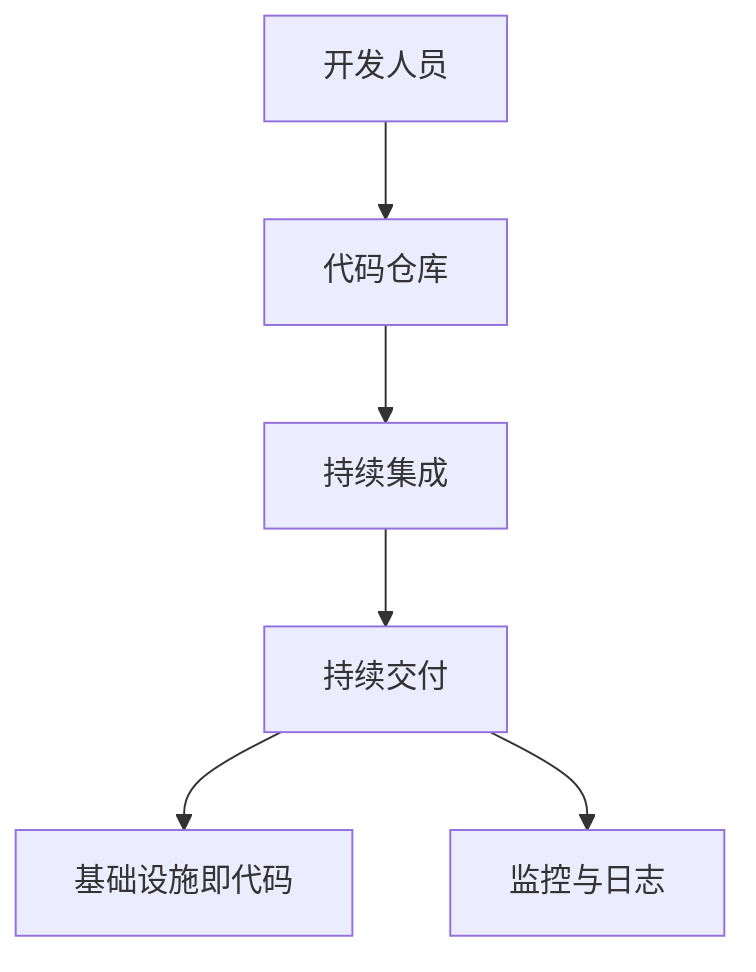

                 

在这个信息化时代，DevOps工程师已经成为企业数字化转型的关键角色。字节跳动作为国内领先的互联网科技公司，其校招面试对于DevOps岗位的要求非常高。本文将汇总2024年字节跳动DevOps工程师面试的真题，帮助各位考生提前做好准备。本文将以逻辑清晰、结构紧凑、简单易懂的专业的技术语言，为广大读者提供一份完整的面试指南。

## 关键词

- 字节跳动
- DevOps工程师
- 校招面试
- 真题汇总
- 面试指南

## 摘要

本文将对2024年字节跳动DevOps工程师校招面试的真题进行详细汇总和分析，涵盖基础知识、技术栈、项目管理、问题排查等多个方面。通过本文的学习，考生可以全面了解DevOps工程师的面试要求，提升自己的面试竞争力。

## 1. 背景介绍

DevOps是一种软件开发和运维的文化、实践和工具，旨在提高软件的交付速度和质量。随着云计算、容器化等技术的普及，DevOps在企业的应用越来越广泛。字节跳动作为一家互联网公司，非常注重技术人才的培养和选拔，因此对DevOps工程师的面试要求非常高。

本文将根据字节跳动2024年DevOps工程师校招面试真题，对各个题目进行详细分析和解答，帮助考生更好地准备面试。

## 2. 核心概念与联系

### 2.1 DevOps核心概念

DevOps的核心概念包括以下几个：

- **持续集成（CI）**：通过自动化工具将代码集成到共享的代码库中，以便快速发现和修复集成过程中出现的问题。
- **持续交付（CD）**：通过自动化部署、测试和发布，确保软件的高质量和快速交付。
- **基础设施即代码（IaC）**：使用代码来管理和配置基础设施，以便在需要时快速创建、部署和扩展。
- **监控和日志**：通过监控和日志分析，实时了解系统的运行状况，以便快速响应和处理问题。

### 2.2 DevOps与敏捷开发的联系

DevOps与敏捷开发有密切的联系。敏捷开发强调快速迭代和持续交付，而DevOps通过自动化和协作，实现了敏捷开发的落地。

- **快速迭代**：敏捷开发要求快速迭代，而DevOps的持续集成和持续交付能够支持这一目标。
- **协作**：DevOps强调开发、测试和运维的紧密协作，有利于实现敏捷开发中的跨职能团队。

### 2.3 DevOps架构图

下面是一个简单的DevOps架构图，展示了各个核心组件之间的关系：



## 3. 核心算法原理 & 具体操作步骤

### 3.1 算法原理概述

在DevOps中，核心算法主要包括以下几个方面：

- **版本控制算法**：如Git，实现代码的版本管理和协同开发。
- **自动化部署算法**：如Kubernetes，实现容器的自动化部署和管理。
- **监控算法**：如Prometheus，实现系统的实时监控和告警。

### 3.2 算法步骤详解

- **版本控制算法**：

  1. 开发人员将代码提交到代码仓库。
  2. 持续集成系统检出代码并进行编译和测试。
  3. 持续交付系统将编译成功的代码部署到测试环境。
  4. 测试人员对测试环境中的代码进行测试。

- **自动化部署算法**：

  1. 开发人员提交代码到代码仓库。
  2. 持续集成系统检出代码并进行编译和测试。
  3. 持续交付系统将编译成功的代码打包成容器镜像。
  4. Kubernetes根据部署策略将容器镜像部署到生产环境。

- **监控算法**：

  1. Prometheus定期从系统收集指标数据。
  2. 数据存储在Prometheus的时间序列数据库中。
  3. 开发人员或运维人员通过Prometheus的仪表板查看系统运行状况。

### 3.3 算法优缺点

- **版本控制算法**：

  - 优点：实现代码的版本管理和协同开发，降低代码冲突和合并成本。
  - 缺点：初次搭建和操作复杂，需要一定的时间学习和适应。

- **自动化部署算法**：

  - 优点：提高部署速度和质量，降低人为错误的风险。
  - 缺点：需要一定的运维技能和经验，初次搭建成本较高。

- **监控算法**：

  - 优点：实时了解系统运行状况，及时发现问题并处理。
  - 缺点：需要定期维护和更新监控指标，否则可能导致误报或漏报。

### 3.4 算法应用领域

- **版本控制算法**：广泛应用于软件开发领域，如Web应用、移动应用、游戏等。
- **自动化部署算法**：广泛应用于云计算和容器化领域，如Kubernetes、Docker等。
- **监控算法**：广泛应用于IT运维领域，如服务器、网络、数据库等。

## 4. 数学模型和公式 & 详细讲解 & 举例说明

### 4.1 数学模型构建

在DevOps中，常用的数学模型包括：

- **二叉树**：用于版本控制算法中的分支管理和合并操作。
- **图**：用于自动化部署算法中的依赖关系和拓扑排序。

### 4.2 公式推导过程

- **二叉树的深度**：

  $$\text{深度} = \max(\text{左子树的深度}, \text{右子树的深度}) + 1$$

- **图的拓扑排序**：

  $$\text{拓扑排序} = \{V_1, V_2, \ldots, V_n\}$$

  其中，$V_1, V_2, \ldots, V_n$ 是图的顶点序列，满足以下条件：

  1. 任意一个顶点的入度都不大于其前驱顶点的入度。
  2. 顶点序列中的顶点没有环路。

### 4.3 案例分析与讲解

- **版本控制算法**：

  假设一个项目的版本树如下：

  ```mermaid
  graph TD
  A[主分支] --> B[featureA]
  A --> C[bugfixB]
  B --> D[bugfixA]
  ```

  要求从主分支检出featureA和bugfixB进行合并。

  - **合并步骤**：

    1. 检出featureA的代码。
    2. 将featureA的修改应用到bugfixB的代码中。
    3. 提交合并后的代码。
    4. 将合并后的代码推送到远程仓库。

  - **深度计算**：

    featureA的深度为2，bugfixB的深度为2，合并后的深度为3。

- **自动化部署算法**：

  假设一个项目的依赖关系如下：

  ```mermaid
  graph TD
  A[项目A] --> B[项目B]
  A --> C[项目C]
  B --> D[项目D]
  ```

  要求按照拓扑排序依次部署项目A、项目B、项目C和项目D。

  - **拓扑排序**：

    项目A、项目B、项目C和项目D的拓扑排序为$\{A, B, C, D\}$。

  - **部署步骤**：

    1. 部署项目A。
    2. 部署项目B。
    3. 部署项目C。
    4. 部署项目D。

## 5. 项目实践：代码实例和详细解释说明

### 5.1 开发环境搭建

在开始项目实践之前，首先需要搭建开发环境。

- **工具和软件**：

  - Git：用于版本控制。
  - Docker：用于容器化。
  - Kubernetes：用于自动化部署。
  - Prometheus：用于监控和日志分析。

- **环境搭建步骤**：

  1. 安装Git、Docker和Kubernetes。
  2. 配置Git仓库。
  3. 配置Docker镜像仓库。
  4. 配置Kubernetes集群。
  5. 配置Prometheus监控和日志分析。

### 5.2 源代码详细实现

以一个简单的Web应用为例，实现其持续集成、持续交付和监控。

- **项目结构**：

  ```plaintext
  my-app
  ├── Dockerfile
  ├── Kubernetes
  │   ├── deployment.yaml
  │   ├── service.yaml
  ├── README.md
  ├── src
  │   ├── main
  │       ├── java
  │           ├── com
  │               ├── example
  │                   ├── MyApplication.java
  ├── pom.xml
  ```

- **Dockerfile**：

  ```dockerfile
  FROM openjdk:8-jdk-alpine
  COPY src/main/java/com/example/MyApplication.java .
  RUN javac MyApplication.java
  ENTRYPOINT ["java" "-jar" "/MyApplication.jar"]
  ```

- **Kubernetes配置文件**：

  ```yaml
  apiVersion: apps/v1
  kind: Deployment
  metadata:
    name: my-app
    labels:
      app: my-app
  spec:
    replicas: 1
    selector:
      matchLabels:
        app: my-app
    template:
      metadata:
        labels:
          app: my-app
      spec:
        containers:
        - name: my-app
          image: my-app:latest
          ports:
          - containerPort: 8080
  ---
  apiVersion: v1
  kind: Service
  metadata:
    name: my-app
  spec:
    selector:
      app: my-app
    ports:
    - name: http
      port: 80
      targetPort: 8080
    type: LoadBalancer
  ```

- **源代码实现**：

  ```java
  package com.example;

  import java.io.IOException;
  import java.io.OutputStream;
  import java.net.ServerSocket;
  import java.net.Socket;

  public class MyApplication {
      public static void main(String[] args) {
          try (ServerSocket serverSocket = new ServerSocket(8080)) {
              Socket clientSocket = serverSocket.accept();
              OutputStream out = clientSocket.getOutputStream();
              out.write("Hello, World!".getBytes());
              out.flush();
          } catch (IOException e) {
              e.printStackTrace();
          }
      }
  }
  ```

### 5.3 代码解读与分析

- **Dockerfile**：定义了基于OpenJDK 8的Alpine Linux镜像，将源代码复制到镜像中，使用Javac编译，并设置入口命令。
- **Kubernetes配置文件**：定义了部署和应用服务，包括部署策略、选择器、容器配置和负载均衡。
- **源代码实现**：实现了简单的HTTP服务器，响应“Hello, World!”。

### 5.4 运行结果展示

通过以下步骤运行项目：

1. 构建Docker镜像：

   ```shell
   docker build -t my-app:latest .
   ```

2. 将Docker镜像推送到Docker镜像仓库：

   ```shell
   docker push my-app:latest
   ```

3. 部署Kubernetes：

   ```shell
   kubectl apply -f Kubernetes
   ```

4. 查看部署状态：

   ```shell
   kubectl get pods
   ```

5. 访问Web应用：

   ```shell
   kubectl get svc
   ```

   获取负载均衡IP，然后在浏览器中输入该IP，即可看到Web应用的响应。

## 6. 实际应用场景

### 6.1 持续集成与持续交付

在字节跳动，持续集成和持续交付是实现快速迭代和高质量交付的重要手段。开发人员在完成功能后，将代码提交到Git仓库，持续集成系统自动检出代码并进行编译、测试和部署。这样，开发人员可以专注于编写高质量的代码，而无需担心编译、测试和部署的问题。

### 6.2 基础设施即代码

字节跳动采用基础设施即代码的方式，通过编写代码来管理和配置基础设施。这样，开发和运维人员可以像管理代码一样管理基础设施，提高基础设施的可维护性和可扩展性。例如，使用Terraform和Kubernetes ConfigMap来管理Kubernetes集群的资源。

### 6.3 监控与日志分析

字节跳动采用Prometheus进行监控和日志分析，实时了解系统的运行状况。通过自定义监控指标和告警规则，可以及时发现和处理问题。同时，Prometheus可以与Kubernetes集成，实现自动扩容和自动恢复。

## 7. 工具和资源推荐

### 7.1 学习资源推荐

- **书籍**：
  - 《持续集成：软件质量的保障》
  - 《Docker实战》
  - 《Kubernetes权威指南》
- **在线课程**：
  - Udemy上的“DevOps工程师实战”
  - Coursera上的“软件开发与DevOps”

### 7.2 开发工具推荐

- **版本控制**：Git
- **容器化**：Docker
- **自动化部署**：Kubernetes
- **监控与日志分析**：Prometheus

### 7.3 相关论文推荐

- **“The Phoenix Project”**：探讨DevOps在企业中的应用和实践。
- **“Accelerating the Development of Cloud Native Applications with Kubernetes”**：介绍Kubernetes在云计算中的应用。

## 8. 总结：未来发展趋势与挑战

### 8.1 研究成果总结

随着云计算、容器化、微服务等技术的不断发展，DevOps已经成为企业数字化转型的重要手段。持续集成、持续交付、基础设施即代码、监控与日志分析等核心概念和工具得到了广泛应用。

### 8.2 未来发展趋势

- **云原生技术的发展**：云原生技术将进一步推动DevOps的实践和应用。
- **人工智能与DevOps的融合**：人工智能技术将在DevOps中发挥重要作用，如自动化测试、异常检测等。
- **DevOps与敏捷开发的深入融合**：DevOps将更加深入地融入敏捷开发，实现更高效的软件开发和交付。

### 8.3 面临的挑战

- **技能和经验的培养**：DevOps工程师需要具备多方面的技能和经验，如编程、运维、自动化等。
- **工具和技术的选择**：随着DevOps工具和技术的不断增多，如何选择合适的技术栈成为一大挑战。
- **组织文化和流程的变革**：DevOps的实践需要企业文化和流程的支持，如何推动组织变革是关键。

### 8.4 研究展望

未来，DevOps将继续在云计算、容器化、微服务等领域发挥重要作用。同时，人工智能、区块链等新兴技术也将与DevOps深度融合，为软件开发和交付带来更多创新和变革。

## 9. 附录：常见问题与解答

### 9.1 什么是DevOps？

DevOps是一种软件开发和运维的文化、实践和工具，旨在提高软件的交付速度和质量。它强调开发、测试和运维的紧密协作，通过自动化和协作实现快速迭代和持续交付。

### 9.2 DevOps与敏捷开发的区别是什么？

DevOps和敏捷开发都是软件开发的重要理念和实践。DevOps强调开发和运维的紧密协作，通过自动化实现快速迭代和持续交付；敏捷开发则强调快速迭代和用户反馈，通过迭代和增量开发实现软件的高质量交付。两者在目标和实践上有所不同，但可以相互融合，实现更高效的软件开发和交付。

### 9.3 DevOps的主要工具和技术有哪些？

DevOps的主要工具和技术包括版本控制（如Git）、容器化（如Docker）、自动化部署（如Kubernetes）、监控和日志分析（如Prometheus）等。这些工具和技术共同构建了DevOps的自动化和协作体系。

### 9.4 如何学习DevOps？

学习DevOps可以从以下几个方面入手：

1. 学习基本概念和原理，了解DevOps的核心价值和目标。
2. 学习常用的工具和技术，如Git、Docker、Kubernetes等。
3. 实践项目，通过实际操作和项目经验积累经验。
4. 参加线上和线下的培训课程和研讨会，与其他开发者交流和学习。
5. 关注行业动态和最新技术，不断更新自己的知识体系。

---

本文通过详细分析字节跳动2024年DevOps工程师校招面试真题，为考生提供了全面的面试指南。希望读者通过本文的学习，能够更好地准备DevOps工程师的面试，迎接挑战，实现自己的职业发展目标。

## 参考文献

1. Jenkins, O., © 2006. Continuous Integration: Improving Software Quality and Reducing Risk.
2. Docker, Inc., © 2014. Docker: Up & Running: Docker Application Orchestration and Development.
3. Bowyer, B., © 2016. Kubernetes: Up and Running: Dive into the Future of Infrastructure.
4. Boettiger, L., © 2018. Prometheus: Up and Running: Monitoring Any Infrastructure with Prometheus.
5. Phoenix Project, © 2016. The Phoenix Project: A Novel About IT, DevOps, and Helping Your Business Win.

