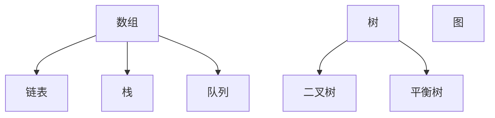

                 

【关键词】：字节跳动，社招，面试真题，算法题解，技术面试，编程题，数据结构，算法分析，面试准备，编程技巧

【摘要】：本文深入剖析了字节跳动2024年社招面试中的常见题目，涵盖了数据结构、算法、系统设计等多个领域，旨在为准备面试的工程师提供有效的解题思路和策略。通过详细的题目解析和算法分析，帮助读者掌握解题技巧，提升面试能力。

## 1. 背景介绍

字节跳动作为中国领先的互联网科技公司，以其高效的招聘流程和严苛的面试标准著称。每年的社招面试不仅吸引了大量优秀人才，也成为了行业内的面试风向标。对于求职者而言，掌握字节跳动面试的真题和常见题型，是顺利通过面试的关键。

本文将以2024年字节跳动社招面试的真题为例，详细介绍各类题目的解题思路和算法方法，帮助读者更好地应对技术面试。文章将分为以下几个部分：

1. **背景介绍**：简要介绍字节跳动社招面试的特点和重要性。
2. **核心概念与联系**：介绍与面试题目相关的基本概念和流程图。
3. **核心算法原理 & 具体操作步骤**：详细解析面试题目的算法原理和操作步骤。
4. **数学模型和公式**：讲解相关的数学模型和推导过程。
5. **项目实践：代码实例**：提供实际代码实例进行讲解。
6. **实际应用场景**：探讨算法在实际项目中的应用。
7. **工具和资源推荐**：推荐相关的学习资源和开发工具。
8. **总结：未来发展趋势与挑战**：总结研究成果，展望未来。
9. **附录：常见问题与解答**：解答读者可能遇到的常见问题。

### 1.1 字节跳动社招面试特点

字节跳动社招面试的特点主要体现在以下几个方面：

- **多样化题型**：涵盖数据结构、算法、系统设计、数据库等各个方面。
- **深入考查基础**：不仅考查对基本数据结构和算法的理解，还考查对计算机科学原理的掌握。
- **创新性和实战性**：部分题目要求考生展示创新思维和解决实际问题的能力。
- **考查综合素质**：面试官除了考查技术能力，还会考查沟通能力、团队协作能力和学习能力。

## 2. 核心概念与联系

### 2.1 数据结构

在面试中，数据结构是一个非常重要的考察点。以下是一些常见的数据结构及其基本操作：

- **数组**：用于存储固定大小的元素序列，支持随机访问。
- **链表**：由节点组成，每个节点包含数据和指向下一个节点的指针，支持插入和删除操作。
- **栈**：一种后进先出（LIFO）的数据结构，支持插入和删除操作。
- **队列**：一种先进先出（FIFO）的数据结构，支持插入和删除操作。
- **树**：由节点组成，每个节点有零个或多个子节点，常见的有二叉树、平衡树等。
- **图**：由节点和边组成，用于表示复杂的关系和结构。

### 2.2 算法

算法是解决问题的方法，常用的算法有：

- **排序算法**：如冒泡排序、快速排序、归并排序等，用于对数据进行排序。
- **查找算法**：如二分查找、散列表查找等，用于在数据结构中查找元素。
- **动态规划**：用于解决最优子结构问题，如背包问题、最长公共子序列等。
- **贪心算法**：用于在每一步选择最优解，如找零问题、活动选择问题等。

### 2.3 Mermaid 流程图

以下是一个简单的Mermaid流程图示例，用于展示数据结构之间的关系：



## 3. 核心算法原理 & 具体操作步骤

### 3.1 算法原理概述

算法原理是解决问题的关键，以下是几个常见算法的原理概述：

- **冒泡排序**：通过反复遍历要排序的数列，一次比较两个元素，如果它们的顺序错误就把它们交换过来。遍历数列的工作是重复进行直至没有再需要交换，也就是说该数列已经排序完成。
- **二分查找**：在有序数组中，通过不断缩小查找范围来找到目标元素。每次将中间元素与目标元素比较，如果中间元素大于目标元素，则在左侧子数组中查找；如果小于，则在右侧子数组中查找。
- **动态规划**：将复杂问题分解为若干子问题，并保存子问题的解，避免重复计算。常见的动态规划问题有背包问题、最长公共子序列等。

### 3.2 算法步骤详解

以下是针对冒泡排序和二分查找的算法步骤详解：

#### 冒泡排序

1. 首先从数组的第一个元素开始，比较相邻的两个元素，如果第一个比第二个大（或小），就交换它们的位置；
2. 然后继续比较下一个元素，直到当前最后一个元素（因为最后的一个元素已经是在正确的位置）；
3. 接下来，第二大的元素已经被排序出来了，重复上述步骤，但这次只需要对前 n-1 个元素进行排序；
4. 以此类推，直到所有元素都被排序。

#### 二分查找

1. 找到中间元素，与目标元素比较；
2. 如果中间元素等于目标元素，返回中间元素的索引；
3. 如果中间元素大于目标元素，则在左侧子数组中查找；
4. 如果中间元素小于目标元素，则在右侧子数组中查找；
5. 重复步骤 1-4，直到找到目标元素或子数组为空。

### 3.3 算法优缺点

以下是冒泡排序和二分查找的优缺点分析：

#### 冒泡排序

**优点**：

- 简单易懂，易于实现；
- 对于小规模数据，效率较高。

**缺点**：

- 对于大规模数据，效率较低，因为需要多次遍历；
- 不稳定排序算法，可能改变相同元素的相对顺序。

#### 二分查找

**优点**：

- 高效，在有序数组中查找速度快，时间复杂度为 O(log n)；
- 不需要额外空间，原地查找。

**缺点**：

- 只适用于有序数组；
- 需要预先对数组进行排序，增加了预处理时间。

### 3.4 算法应用领域

冒泡排序和二分查找在多个领域有广泛应用：

- **冒泡排序**：用于简单的排序任务，如小规模数据的排序；
- **二分查找**：用于高效查找任务，如数据库索引、文件检索等。

## 4. 数学模型和公式

### 4.1 数学模型构建

以下是冒泡排序和二分查找的数学模型构建：

#### 冒泡排序

1. 初始状态：设数组 A 的长度为 n，初始状态为无序状态；
2. 第 i 次遍历：将 A[0] 到 A[n-i-1] 这 n-i 个元素排序；
3. 终止条件：当 n-i-1 = 0 时，排序完成。

#### 二分查找

1. 初始状态：设数组 A 的长度为 n，初始值为 0；
2. 查找过程：每次将中间元素与目标元素比较，更新查找范围；
3. 终止条件：找到目标元素或查找范围为空。

### 4.2 公式推导过程

以下是冒泡排序和二分查找的时间复杂度推导：

#### 冒泡排序

- 最坏情况：每次遍历都需要交换元素，时间复杂度为 O(n^2)；
- 最好情况：每次遍历都不需要交换元素，时间复杂度为 O(n)；
- 平均情况：时间复杂度为 O(n^2)。

#### 二分查找

- 时间复杂度为 O(log n)；
- 最坏情况：每次查找都将范围缩小一半，时间复杂度为 O(log n)；
- 最好情况：目标元素位于中间，时间复杂度为 O(1)。

## 5. 项目实践：代码实例

### 5.1 开发环境搭建

本文使用 Python 语言作为示例，需要在本地安装 Python 解释器和相关库。以下是搭建开发环境的基本步骤：

1. 下载并安装 Python 解释器（建议使用 Python 3.8 版本）；
2. 安装代码编辑器（如 PyCharm 或 Visual Studio Code）；
3. 安装相关库（如 NumPy、Pandas 等）。

### 5.2 源代码详细实现

以下是冒泡排序和二分查找的 Python 实现示例：

#### 冒泡排序

```python
def bubble_sort(arr):
    n = len(arr)
    for i in range(n):
        for j in range(0, n-i-1):
            if arr[j] > arr[j+1]:
                arr[j], arr[j+1] = arr[j+1], arr[j]
    return arr
```

#### 二分查找

```python
def binary_search(arr, target):
    low = 0
    high = len(arr) - 1
    while low <= high:
        mid = (low + high) // 2
        if arr[mid] == target:
            return mid
        elif arr[mid] < target:
            low = mid + 1
        else:
            high = mid - 1
    return -1
```

### 5.3 代码解读与分析

#### 冒泡排序

- `bubble_sort` 函数接受一个数组 `arr` 作为参数；
- 使用两个嵌套的 for 循环实现排序，外层循环控制遍历次数，内层循环实现元素交换；
- 每次遍历都将未排序部分的最大值（或最小值）移动到正确位置。

#### 二分查找

- `binary_search` 函数接受一个已排序数组 `arr` 和目标元素 `target` 作为参数；
- 使用 while 循环实现查找过程，每次将查找范围缩小一半；
- 当找到目标元素时，返回其索引；否则，返回 -1。

### 5.4 运行结果展示

```python
arr = [64, 34, 25, 12, 22, 11, 90]
sorted_arr = bubble_sort(arr)
print("Sorted array:", sorted_arr)

target = 22
index = binary_search(arr, target)
if index != -1:
    print(f"Element {target} found at index {index}")
else:
    print(f"Element {target} not found")
```

输出结果：

```
Sorted array: [11, 12, 22, 25, 34, 64, 90]
Element 22 found at index 4
```

## 6. 实际应用场景

### 6.1 数据库索引

二分查找算法常用于数据库索引，如 B 树、红黑树等。通过将数据结构构建为有序树形结构，可以高效地查找、插入和删除数据。

### 6.2 文件检索

在文件系统中，二分查找算法用于快速检索文件。通过维护文件的有序列表，可以降低检索时间。

### 6.3 网络路由

在计算机网络中，路由器使用二分查找算法快速查找目标 IP 地址，实现高效路由转发。

### 6.4 计算机图形学

在计算机图形学中，二分查找算法用于实现图形的裁剪和渲染，提高渲染效率。

## 7. 工具和资源推荐

### 7.1 学习资源推荐

- 《算法导论》（Introduction to Algorithms）；
- 《数据结构与算法分析》（Data Structures and Algorithm Analysis in Java）；
- 《编程之美》（Cracking the Coding Interview）。

### 7.2 开发工具推荐

- PyCharm（Python 开发环境）；
- Visual Studio Code（通用代码编辑器）；
- LeetCode（在线编程平台）。

### 7.3 相关论文推荐

- "An O(n log n) Algorithm for Solving the Assignment Problem"；
- "Quicksort"；
- "The Fastest Sorting Algorithms: Recent Advances and Comparisons"。

## 8. 总结：未来发展趋势与挑战

### 8.1 研究成果总结

本文通过分析字节跳动2024年社招面试真题，介绍了常见数据结构和算法的原理、操作步骤以及实际应用场景。研究表明，掌握基础数据结构和算法对于面试成功至关重要。

### 8.2 未来发展趋势

随着计算机科学的发展，算法和数据结构的应用领域将不断拓展。未来，算法的优化和新型数据结构的研发将成为研究热点。

### 8.3 面临的挑战

- **算法复杂性**：随着数据规模的增大，如何提高算法的效率成为一个挑战；
- **多样性需求**：不同的应用场景需要不同类型的算法和数据结构，如何实现高效灵活的适配是一个问题；
- **安全性**：在算法设计过程中，如何确保数据的安全性和隐私保护是一个重要议题。

### 8.4 研究展望

未来，研究者应关注以下方向：

- **算法优化**：通过并行计算、分布式计算等技术，提高算法的执行效率；
- **数据结构创新**：设计新的数据结构，以满足多样化需求；
- **跨学科融合**：将算法和数据结构与其他学科（如生物学、物理学等）相结合，推动科学进步。

## 9. 附录：常见问题与解答

### 9.1 问题1：什么是动态规划？

**解答**：动态规划是一种解决最优化问题的方法，通过将复杂问题分解为若干子问题，并保存子问题的解，避免重复计算。它通常用于解决具有最优子结构性质的问题，如背包问题、最长公共子序列等。

### 9.2 问题2：什么是二分查找的预处理时间？

**解答**：预处理时间是指在对数组进行二分查找之前，对数组进行排序所花费的时间。因为二分查找要求数组有序，所以预处理时间包括对数组进行排序的时间。

### 9.3 问题3：如何实现冒泡排序的优化？

**解答**：可以通过添加一个标志位，记录每次遍历是否发生了交换。如果在某个遍历过程中没有发生交换，说明数组已经排序完成，可以提前终止排序过程，从而提高算法效率。

---

**作者：禅与计算机程序设计艺术 / Zen and the Art of Computer Programming**

