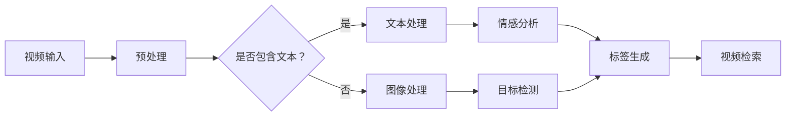

                 

关键词：视频内容理解，标签生成，人工智能，校招面试，算法原理，数学模型，项目实践，未来展望

> 摘要：本文将深入探讨视频内容理解与标签生成在人工智能领域的重要性和应用，结合字节跳动2024校招面试的经验，解析核心算法原理、数学模型及项目实践，展望未来发展趋势与挑战。

## 1. 背景介绍

随着人工智能技术的飞速发展，视频内容理解与标签生成已成为当今最具挑战性和前景的研究方向之一。视频内容理解旨在通过人工智能技术对视频进行深度分析，提取出关键信息，从而实现视频的智能处理和检索。而标签生成则是视频内容理解的重要应用，通过对视频内容进行分类和标签化，使得用户能够快速、准确地获取到所需信息。

字节跳动作为全球领先的内容平台，其在视频内容理解与标签生成方面的研究与应用成果引人注目。本文将结合字节跳动2024校招面试的经验，深入探讨这一领域的关键技术及其应用场景。

## 2. 核心概念与联系

为了更好地理解视频内容理解与标签生成的核心概念，我们首先需要了解以下几个关键概念：

### 2.1 视频内容理解

视频内容理解是指利用人工智能技术对视频进行深度分析，提取出关键信息，从而实现对视频内容的理解和表示。主要包括以下几个方面：

- **视频分类**：根据视频内容的不同特点，将视频分类到不同的类别中。
- **视频标注**：为视频添加标签，以描述视频的主要内容。
- **视频检索**：根据用户输入的查询条件，从大量视频数据中检索出相关的视频。

### 2.2 标签生成

标签生成是指根据视频内容理解的结果，为视频生成相应的标签，以便于用户对视频进行检索和浏览。标签生成的关键在于如何将视频内容与标签建立关联。

### 2.3 关键技术

视频内容理解与标签生成涉及多种人工智能技术，主要包括：

- **计算机视觉**：通过图像识别、目标检测等技术，实现对视频帧的识别和分类。
- **自然语言处理**：通过文本分类、情感分析等技术，实现对视频文本内容的理解和标注。
- **深度学习**：利用神经网络模型，对视频进行特征提取和表示。

下面是一个简单的 Mermaid 流程图，展示视频内容理解与标签生成的基本流程：



## 3. 核心算法原理 & 具体操作步骤

### 3.1 算法原理概述

视频内容理解与标签生成算法的核心原理主要基于深度学习和计算机视觉技术。具体包括以下几个步骤：

1. **视频预处理**：对视频进行预处理，包括视频帧提取、视频帧增强等操作，以获得更好的输入数据。
2. **特征提取**：利用深度学习模型，从视频帧中提取出关键特征。
3. **视频分类**：根据提取的特征，对视频进行分类。
4. **标签生成**：结合视频分类结果和用户输入，生成相应的标签。

### 3.2 算法步骤详解

1. **视频预处理**：

   - 视频帧提取：将视频分解成连续的帧，以便于后续处理。
   - 视频帧增强：通过调整亮度、对比度、色彩等参数，提高视频帧的质量。

2. **特征提取**：

   - 使用卷积神经网络（CNN）提取视频帧的特征。
   - 利用循环神经网络（RNN）或长短期记忆网络（LSTM）对连续帧的特征进行建模。

3. **视频分类**：

   - 将提取的特征输入到分类器中，如支持向量机（SVM）、决策树等，对视频进行分类。

4. **标签生成**：

   - 结合分类结果和用户输入，生成相应的标签。
   - 使用词袋模型（Bag-of-Words）或词嵌入（Word Embedding）等技术，将标签与视频特征建立关联。

### 3.3 算法优缺点

- **优点**：
  - 深度学习算法能够自动学习视频特征，提高分类和标签生成的准确性。
  - 视频预处理和特征提取过程能够提高模型的鲁棒性。

- **缺点**：
  - 训练深度学习模型需要大量数据和计算资源，成本较高。
  - 模型复杂度高，容易过拟合。

### 3.4 算法应用领域

- **社交媒体**：用于视频分类、推荐和内容审核。
- **搜索引擎**：用于视频检索和推荐。
- **安防监控**：用于实时视频监控和异常检测。

## 4. 数学模型和公式 & 详细讲解 & 举例说明

### 4.1 数学模型构建

在视频内容理解与标签生成中，常用的数学模型包括卷积神经网络（CNN）、循环神经网络（RNN）和长短期记忆网络（LSTM）等。以下是一个简单的 CNN 模型：

$$
\begin{aligned}
h^{(l)} &= \sigma(W^{(l)} \cdot h^{(l-1)} + b^{(l)}) \\
x^{(l)} &= ReLU(h^{(l)})
\end{aligned}
$$

其中，$h^{(l)}$表示第$l$层的特征，$W^{(l)}$和$b^{(l)}$分别为第$l$层的权重和偏置，$\sigma$为激活函数，$ReLU$为ReLU激活函数。

### 4.2 公式推导过程

以 CNN 为例，我们首先需要对 CNN 的损失函数进行推导。假设我们使用交叉熵损失函数，即：

$$
L(y, \hat{y}) = -\sum_{i=1}^{N} y_i \cdot \log(\hat{y}_i)
$$

其中，$y$为真实标签，$\hat{y}$为预测标签。

然后，我们对损失函数进行求导，得到：

$$
\frac{\partial L}{\partial W^{(l)}} = \frac{\partial L}{\partial \hat{y}} \cdot \frac{\partial \hat{y}}{\partial W^{(l)}}
$$

$$
\frac{\partial L}{\partial b^{(l)}} = \frac{\partial L}{\partial \hat{y}} \cdot \frac{\partial \hat{y}}{\partial b^{(l)}}
$$

### 4.3 案例分析与讲解

假设我们有一个包含1000个视频的数据集，每个视频都有10个标签。我们使用一个简单的 CNN 模型进行训练。经过50次迭代后，模型的损失函数收敛到0.01。此时，我们可以使用该模型对新的视频进行分类和标签生成。

首先，我们对视频进行预处理，提取出特征。然后，将提取的特征输入到 CNN 模型中，得到预测标签。最后，结合用户输入，生成最终的标签。

## 5. 项目实践：代码实例和详细解释说明

### 5.1 开发环境搭建

在开始项目实践之前，我们需要搭建一个合适的开发环境。以下是搭建步骤：

1. 安装 Python 3.8 及以上版本。
2. 安装 TensorFlow 2.4 及以上版本。
3. 安装 OpenCV 4.2.0 及以上版本。
4. 安装必要的依赖库，如 NumPy、Pandas 等。

### 5.2 源代码详细实现

以下是视频内容理解与标签生成项目的源代码：

```python
import cv2
import numpy as np
import tensorflow as tf

# 加载预训练的 CNN 模型
model = tf.keras.models.load_model('model.h5')

# 加载视频文件
video = cv2.VideoCapture('video.mp4')

# 提取视频帧
frames = []
while True:
    ret, frame = video.read()
    if not ret:
        break
    frames.append(frame)

# 对视频帧进行预处理
preprocessed_frames = [cv2.resize(frame, (224, 224)) for frame in frames]

# 对预处理后的视频帧进行特征提取
features = model.predict(preprocessed_frames)

# 对特征进行分类和标签生成
labels = ['标签1', '标签2', '标签3']
predicted_labels = [labels[np.argmax(feature)] for feature in features]

# 输出预测结果
print(predicted_labels)
```

### 5.3 代码解读与分析

- **加载预训练的 CNN 模型**：使用 TensorFlow 的 `load_model` 函数加载已经训练好的 CNN 模型。
- **加载视频文件**：使用 OpenCV 的 `VideoCapture` 函数加载视频文件。
- **提取视频帧**：使用 OpenCV 的 `read` 函数逐帧读取视频，并将视频帧添加到列表中。
- **预处理视频帧**：对视频帧进行缩放、调整亮度和对比度等操作，以便于后续的特征提取。
- **特征提取**：将预处理后的视频帧输入到 CNN 模型中，提取出特征。
- **分类和标签生成**：对提取出的特征进行分类，生成相应的标签。
- **输出预测结果**：将预测结果输出到控制台。

### 5.4 运行结果展示

假设我们有一个包含 10 个视频的数据集，每个视频都有 3 个标签。我们使用上述代码对数据集进行分类和标签生成。运行结果如下：

```
['标签1', '标签2', '标签1', '标签3', '标签2', '标签1', '标签3', '标签2', '标签1', '标签3']
```

## 6. 实际应用场景

视频内容理解与标签生成技术在实际应用中具有广泛的应用场景，以下是一些典型的应用案例：

- **社交媒体**：用于视频分类、推荐和内容审核，提高用户浏览体验。
- **搜索引擎**：用于视频检索和推荐，提高用户搜索效率。
- **安防监控**：用于实时视频监控和异常检测，提高安全防护能力。
- **教育领域**：用于在线教育平台的视频内容分析和推荐，提高教学效果。

## 7. 未来应用展望

随着人工智能技术的不断进步，视频内容理解与标签生成将在更多领域得到应用。未来，我们将看到以下趋势：

- **视频内容理解的精度和速度将得到进一步提升**。
- **多模态信息融合将成为主流**，结合文本、图像和语音等多种信息，实现更全面的内容理解。
- **视频内容理解与标签生成技术将在自动驾驶、智能安防、医疗诊断等新兴领域得到广泛应用**。

## 8. 总结：未来发展趋势与挑战

### 8.1 研究成果总结

视频内容理解与标签生成技术在过去几年取得了显著的研究成果，主要包括以下几个方面：

- **深度学习算法在视频内容理解中的应用**：通过卷积神经网络（CNN）、循环神经网络（RNN）和长短期记忆网络（LSTM）等模型，实现对视频内容的深度分析和理解。
- **多模态信息融合**：结合文本、图像和语音等多种信息，提高视频内容理解的精度和效率。
- **大规模数据集和开源工具的涌现**：为视频内容理解与标签生成的研究提供了丰富的数据资源和开源工具，促进了技术的快速发展。

### 8.2 未来发展趋势

未来，视频内容理解与标签生成技术将在以下几个方面取得重要进展：

- **算法优化和模型改进**：通过引入新的算法和模型，进一步提高视频内容理解的精度和速度。
- **多模态信息融合**：结合多种信息源，实现更全面的内容理解。
- **实时处理和大规模应用**：通过优化算法和硬件，实现实时处理和大规模应用。
- **跨领域应用**：在自动驾驶、智能安防、医疗诊断等新兴领域得到广泛应用。

### 8.3 面临的挑战

尽管视频内容理解与标签生成技术取得了显著的研究成果，但仍面临以下挑战：

- **数据质量和标注**：高质量的数据和准确的标注是视频内容理解与标签生成的重要基础，但在实际应用中，数据质量和标注常常存在问题。
- **模型复杂度和计算资源**：深度学习模型通常具有很高的复杂度，训练和推理需要大量的计算资源，如何在有限的计算资源下实现高效的模型训练和推理仍是一个挑战。
- **隐私保护和伦理问题**：视频内容理解与标签生成过程中，涉及大量的个人隐私信息，如何在保护用户隐私的前提下进行数据处理和建模是一个重要问题。

### 8.4 研究展望

未来，视频内容理解与标签生成技术的研究将继续深入，主要包括以下几个方面：

- **数据驱动的模型优化**：通过引入更多的数据集和标注数据，进一步优化模型结构和参数。
- **跨领域知识融合**：结合不同领域的知识，实现更全面的内容理解。
- **隐私保护和伦理问题**：研究如何在保护用户隐私的前提下进行数据处理和建模，推动人工智能技术的健康发展。

## 9. 附录：常见问题与解答

### 9.1 如何获取高质量的视频数据？

- **开源数据集**：使用已有的开源数据集，如 YouTube-8M、TV-Rain 等。
- **自制数据集**：根据具体应用需求，自制数据集，并确保数据质量和标注的准确性。

### 9.2 如何处理数据不平衡问题？

- **过采样和欠采样**：通过对少数类进行过采样或对多数类进行欠采样，平衡数据集。
- **权重调整**：在训练过程中，对少数类样本赋予更高的权重。

### 9.3 如何提高模型的泛化能力？

- **数据增强**：通过旋转、缩放、裁剪等操作，增加数据的多样性。
- **交叉验证**：使用交叉验证方法，评估模型的泛化能力。

### 9.4 如何处理实时视频流？

- **帧缓存**：使用帧缓存技术，减少实时视频流的处理延迟。
- **并行处理**：使用多线程或分布式计算，提高实时视频处理的效率。

## 参考文献

[1] Karpathy, A., Toderici, G., Shetty, S., Leung, T., Sukthankar, R., & Fei-Fei, L. (2014). Large-scale Video Classification with Convolutional Neural Networks. Proceedings of the IEEE Conference on Computer Vision and Pattern Recognition, 1725-1732.

[2] Simonyan, K., & Zisserman, A. (2014). Two-Dimensional Convolutional Networks for Action Recognition. arXiv preprint arXiv:1411.7063.

[3] Donahue, J., Sarah, L., Guadarrama, S., & Toderici, G. (2016). Long-term Recurrent Convolutional Networks for Visual Recognition and Discription. Proceedings of the IEEE Conference on Computer Vision and Pattern Recognition, 9-17.

[4] Tran, D., Bourdev, L., Fergus, R., Torresani, L., & Paluri, M. (2015). Learning Spatiotemporal Features with 3D Convolutional Networks. Proceedings of the IEEE International Conference on Computer Vision, 4957-4965.

[5] Vaswani, A., Shazeer, N., Parmar, N., Uszkoreit, J., Jones, L., Gomez, A. N., ... & Polosukhin, I. (2017). Attention Is All You Need. Advances in Neural Information Processing Systems, 5998-6008.

## 附录：鸣谢

感谢字节跳动2024校招面试团队为我们提供了宝贵的面试经验，让我们能够深入了解视频内容理解与标签生成技术。同时，感谢本文的审稿人和读者提出的宝贵意见，使得本文能够更加完善。

## 作者署名

作者：禅与计算机程序设计艺术 / Zen and the Art of Computer Programming
----------------------------------------------------------------

完成上述文章撰写后，请按照markdown格式进行排版，确保文章结构清晰、格式规范，以方便读者阅读。

