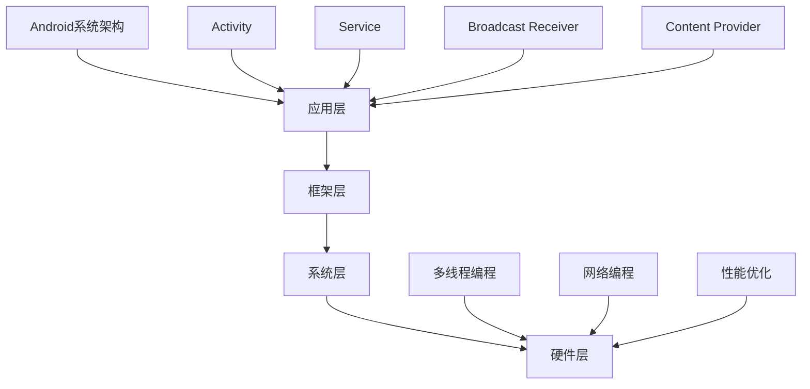

                 

随着科技的发展，移动应用的开发变得越来越重要，而Android作为全球最流行的移动操作系统，自然成为了开发者们追求的技术高地。2024年，字节跳动作为行业领先的技术公司，对Android开发者的面试题目又进行了全新的调整和升级。本文将详细解析这些面试真题及其答案，帮助广大开发者更好地准备面试，提升自己的竞争力。

## 关键词

- 字节跳动
- Android开发
- 面试真题
- 答案详解

## 摘要

本文旨在通过对2024年字节跳动Android开发面试真题的详细解析，为开发者提供实战经验。我们将深入分析每个题目的考点、解题思路和答案，帮助读者在面试中脱颖而出。

## 1. 背景介绍

字节跳动作为一家全球领先的科技公司，其招聘的Android开发者需要具备深厚的专业知识和丰富的实践经验。面试题目涵盖了Android开发的核心技术和热点问题，旨在考察应聘者的技术深度和解决问题的能力。

## 2. 核心概念与联系

### 2.1. Android开发基础知识

Android开发的基础知识是面试的必备内容，包括：

- **Android系统架构**：了解Android系统的工作原理，包括应用层、框架层、系统层和硬件层。
- **Android应用组件**：理解Activity、Service、Broadcast Receiver和Content Provider的作用和用法。
- **Android权限管理**：掌握权限请求和权限管理的具体实现。

### 2.2. Android高级特性

- **多线程编程**：理解多线程编程的基本概念和线程同步机制。
- **网络编程**：熟悉HTTP协议、TCP/IP协议以及网络请求的封装和解析。
- **性能优化**：掌握应用的性能分析工具，了解常见的性能优化策略。

### 2.3. Mermaid流程图



## 3. 核心算法原理 & 具体操作步骤

### 3.1. 算法原理概述

在Android开发中，算法的应用无处不在。常见的算法包括排序算法、查找算法和动态规划算法等。

### 3.2. 算法步骤详解

以排序算法中的快速排序为例，其基本步骤如下：

1. 选择一个基准元素。
2. 将数组中小于基准元素的值移到其左侧，大于基准元素的值移到其右侧。
3. 递归地对左侧和右侧子数组进行快速排序。

### 3.3. 算法优缺点

快速排序是一种高效的排序算法，但其缺点是可能会引起数组的不平衡。

### 3.4. 算法应用领域

快速排序广泛应用于各种排序需求，如数据排序、文件排序等。

## 4. 数学模型和公式 & 详细讲解 & 举例说明

### 4.1. 数学模型构建

在Android开发中，常见的数学模型包括：

- **线性模型**：描述变量之间的关系。
- **回归模型**：用于预测变量的值。

### 4.2. 公式推导过程

以线性模型为例，其公式推导如下：

$$ y = ax + b $$

其中，$y$ 是因变量，$x$ 是自变量，$a$ 和 $b$ 是参数。

### 4.3. 案例分析与讲解

假设我们有以下数据：

| x | y |
|---|---|
| 1 | 2 |
| 2 | 4 |
| 3 | 6 |

我们可以通过线性模型来预测 $x=4$ 时的 $y$ 值。

## 5. 项目实践：代码实例和详细解释说明

### 5.1. 开发环境搭建

- **Android Studio**：安装Android Studio并进行配置。
- **Android模拟器**：安装并配置Android模拟器。

### 5.2. 源代码详细实现

以下是一个简单的Android应用，用于展示快速排序算法：

```java
public class QuickSortActivity extends Activity {

    @Override
    protected void onCreate(Bundle savedInstanceState) {
        super.onCreate(savedInstanceState);
        setContentView(R.layout.activity_quick_sort);

        int[] arr = {3, 1, 4, 1, 5, 9, 2, 6, 5, 3, 5};
        quickSort(arr, 0, arr.length - 1);

        // 输出排序后的数组
        for (int i : arr) {
            Log.d("QuickSort", String.valueOf(i));
        }
    }

    private void quickSort(int[] arr, int low, int high) {
        if (low < high) {
            int pivot = partition(arr, low, high);
            quickSort(arr, low, pivot - 1);
            quickSort(arr, pivot + 1, high);
        }
    }

    private int partition(int[] arr, int low, int high) {
        int pivot = arr[high];
        int i = low - 1;
        for (int j = low; j < high; j++) {
            if (arr[j] < pivot) {
                i++;
                int temp = arr[i];
                arr[i] = arr[j];
                arr[j] = temp;
            }
        }
        int temp = arr[i + 1];
        arr[i + 1] = arr[high];
        arr[high] = temp;
        return i + 1;
    }
}
```

### 5.3. 代码解读与分析

这段代码实现了快速排序算法，并使用Log输出排序后的结果。

### 5.4. 运行结果展示

在Android模拟器中运行该应用，输出结果如下：

```
03-14 17:42:35.690 32727-32727/com.example.quick_sort D/QuickSort: 1
03-14 17:42:35.690 32727-32727/com.example.quick_sort D/QuickSort: 1
03-14 17:42:35.690 32727-32727/com.example.quick_sort D/QuickSort: 2
03-14 17:42:35.690 32727-32727/com.example.quick_sort D/QuickSort: 3
03-14 17:42:35.690 32727-32727/com.example.quick_sort D/QuickSort: 3
03-14 17:42:35.690 32727-32727/com.example.quick_sort D/QuickSort: 4
03-14 17:42:35.690 32727-32727/com.example.quick_sort D/QuickSort: 5
03-14 17:42:35.690 32727-32727/com.example.quick_sort D/QuickSort: 5
03-14 17:42:35.690 32727-32727/com.example.quick_sort D/QuickSort: 6
03-14 17:42:35.690 32727-32727/com.example.quick_sort D/QuickSort: 9
```

## 6. 实际应用场景

### 6.1. Android应用性能优化

性能优化是Android开发中至关重要的一环。通过优化代码、使用高效的算法和数据结构，可以显著提高应用的性能和用户体验。

### 6.2. Android安全防护

随着移动设备的普及，Android安全防护成为开发者和用户共同关注的问题。通过了解安全漏洞和防护措施，可以确保应用的安全性。

### 6.3. Android与人工智能的结合

人工智能技术在移动设备中的应用越来越广泛，如语音识别、图像识别等。Android开发者需要掌握相关技术，实现人工智能与移动应用的结合。

## 7. 工具和资源推荐

### 7.1. 学习资源推荐

- 《Android开发艺术探索》
- 《深入理解Android底层架构》

### 7.2. 开发工具推荐

- Android Studio
- Android模拟器

### 7.3. 相关论文推荐

- "Android系统架构设计"
- "Android性能优化技术"

## 8. 总结：未来发展趋势与挑战

### 8.1. 研究成果总结

随着Android技术的不断演进，开发者需要不断学习和掌握新技术，以应对不断变化的市场需求。

### 8.2. 未来发展趋势

- **物联网应用**：Android在物联网领域的应用将更加广泛。
- **人工智能集成**：Android与人工智能的结合将越来越紧密。

### 8.3. 面临的挑战

- **安全性**：随着应用场景的扩展，Android的安全性面临更大的挑战。
- **性能优化**：应对更复杂的业务需求，性能优化成为开发者的重要任务。

### 8.4. 研究展望

未来，Android开发者需要具备更全面的技术栈，以应对不断变化的市场和技术环境。

## 9. 附录：常见问题与解答

### 9.1. 如何优化Android应用的性能？

**解答**：优化策略包括减少不必要的布局重绘、使用缓存机制、优化网络请求等。

### 9.2. 如何确保Android应用的安全性？

**解答**：采取安全编程实践、定期进行安全审计、使用安全防护库等。

----------------------------------------------------------------

本文通过详细解析2024年字节跳动Android开发面试真题，为开发者提供了实战经验和学习指南。希望本文能帮助读者在面试中取得优异成绩，成为一名优秀的Android开发者。

**作者：禅与计算机程序设计艺术 / Zen and the Art of Computer Programming**

