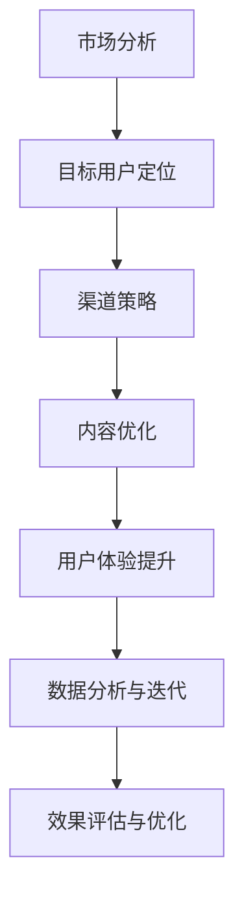
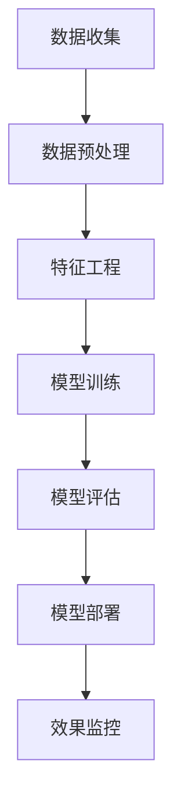

                 

随着科技的发展和互联网的普及，用户增长已成为各大互联网公司竞争的关键因素。在2024年，字节跳动作为互联网领域的领军企业，其对技术用户增长专家的面试题目也成为了行业内人士关注的焦点。本文将汇总和分析2024年字节跳动技术用户增长专家面试中可能出现的一些真题，并提供相应的答案。

## 关键词

- 字节跳动
- 技术用户增长
- 面试真题
- 答案解析

## 摘要

本文旨在为准备参加2024年字节跳动技术用户增长专家面试的候选人提供一份全面的真题汇总及答案解析。通过分析这些面试题目，候选人可以更好地理解字节跳动的用户增长策略和技术要求，从而在面试中脱颖而出。

## 1. 背景介绍

字节跳动是一家全球性的互联网科技公司，以其产品如抖音（TikTok）、今日头条等而闻名。作为互联网领域的重要玩家，字节跳动对技术用户增长专家的需求极高。技术用户增长专家的主要职责是通过技术手段来促进用户增长，提高用户活跃度和留存率。

## 2. 核心概念与联系

### 2.1 用户增长策略

用户增长策略是技术用户增长专家的核心工作内容。以下是一个简单的用户增长策略Mermaid流程图：



### 2.2 技术应用

技术用户增长专家需要掌握多种技术，如大数据分析、机器学习、自然语言处理等。以下是一个简单的技术应用Mermaid流程图：



## 3. 核心算法原理 & 具体操作步骤

### 3.1 算法原理概述

在用户增长领域，常见的核心算法包括推荐算法、用户分群算法、流失预警算法等。以下是对这些算法原理的概述：

#### 3.1.1 推荐算法

推荐算法是一种基于用户行为和内容特征来预测用户可能感兴趣的内容的算法。常见的推荐算法有基于协同过滤、基于内容的推荐和混合推荐。

#### 3.1.2 用户分群算法

用户分群算法是一种根据用户特征和行为将用户划分为不同群体的算法。常见的分群算法有基于K-means、基于层次聚类和基于模型分群。

#### 3.1.3 流失预警算法

流失预警算法是一种根据用户行为预测用户可能流失的算法。常见的流失预警算法有逻辑回归、决策树和支持向量机等。

### 3.2 算法步骤详解

#### 3.2.1 推荐算法步骤

1. 数据收集：收集用户行为数据和内容特征数据。
2. 数据预处理：处理缺失值、异常值和噪声数据。
3. 特征工程：提取用户和内容的特征。
4. 模型训练：选择合适的模型进行训练。
5. 模型评估：评估模型的效果。
6. 模型部署：将模型部署到生产环境。
7. 效果监控：监控模型的效果并进行迭代优化。

#### 3.2.2 用户分群算法步骤

1. 数据收集：收集用户特征和行为数据。
2. 数据预处理：处理缺失值、异常值和噪声数据。
3. 特征工程：提取用户和行为的特征。
4. 分群模型选择：选择合适的分群模型。
5. 模型训练：训练分群模型。
6. 模型评估：评估分群模型的效果。
7. 分群结果应用：根据分群结果制定相应的运营策略。

#### 3.2.3 流失预警算法步骤

1. 数据收集：收集用户行为数据。
2. 数据预处理：处理缺失值、异常值和噪声数据。
3. 特征工程：提取用户和行为的特征。
4. 模型选择：选择合适的流失预警模型。
5. 模型训练：训练流失预警模型。
6. 模型评估：评估流失预警模型的效果。
7. 预警策略制定：根据预警结果制定相应的用户留存策略。

### 3.3 算法优缺点

#### 3.3.1 推荐算法

**优点**：能够提高用户满意度，提高用户活跃度和留存率。

**缺点**：推荐算法可能造成用户陷入“信息茧房”，影响用户多样性。

#### 3.3.2 用户分群算法

**优点**：能够更好地理解用户需求，制定有针对性的运营策略。

**缺点**：分群算法可能无法完全捕捉用户的动态变化。

#### 3.3.3 流失预警算法

**优点**：能够提前发现可能流失的用户，采取相应的措施进行用户留存。

**缺点**：预警算法的准确度可能受到数据质量和特征选择的影响。

### 3.4 算法应用领域

推荐算法、用户分群算法和流失预警算法广泛应用于电子商务、在线广告、社交媒体等领域，能够显著提升企业的用户增长和业务效益。

## 4. 数学模型和公式 & 详细讲解 & 举例说明

### 4.1 数学模型构建

在用户增长领域，常见的数学模型包括用户活跃度模型、用户留存模型、用户流失模型等。以下是一个用户留存模型的示例：

$$
L(t) = \frac{1}{1 + e^{-(\beta_0 + \beta_1 X_1 + \beta_2 X_2 + ... + \beta_n X_n)}}
$$

其中，$L(t)$表示在时间$t$用户留存的概率，$X_1, X_2, ..., X_n$表示用户特征，$\beta_0, \beta_1, \beta_2, ..., \beta_n$为模型参数。

### 4.2 公式推导过程

用户留存模型通常基于逻辑回归模型进行构建。逻辑回归模型的公式为：

$$
\log\frac{L(t)}{1-L(t)} = \beta_0 + \beta_1 X_1 + \beta_2 X_2 + ... + \beta_n X_n
$$

通过对上述公式进行变换，可以得到用户留存概率的公式：

$$
L(t) = \frac{1}{1 + e^{-(\beta_0 + \beta_1 X_1 + \beta_2 X_2 + ... + \beta_n X_n)}}
$$

### 4.3 案例分析与讲解

假设我们有一个用户留存模型，其中用户特征包括用户年龄、用户性别、用户活跃天数等。我们使用逻辑回归模型对用户留存进行预测。

假设我们收集了以下数据：

| 用户ID | 年龄 | 性别 | 活跃天数 | 留存情况 |
| --- | --- | --- | --- | --- |
| 1 | 25 | 男 | 10 | 留存 |
| 2 | 30 | 女 | 5 | 流失 |
| 3 | 22 | 男 | 15 | 留存 |
| 4 | 28 | 女 | 7 | 留存 |

我们对这些数据进行预处理和特征工程，然后使用逻辑回归模型进行训练。训练后的模型参数如下：

$$
\beta_0 = -2.5, \beta_1 = 0.3, \beta_2 = -1.0, \beta_3 = 0.5
$$

现在，假设有一个新用户，其特征如下：

| 年龄 | 性别 | 活跃天数 |
| --- | --- | --- |
| 24 | 女 | 12 |

我们可以使用训练好的模型来预测该用户的留存概率：

$$
L(t) = \frac{1}{1 + e^{-(2.5 + 0.3 \times 24 - 1.0 \times 女 + 0.5 \times 12)}}
$$

计算得到该用户的留存概率为：

$$
L(t) \approx 0.8
$$

这意味着该用户留存的可能性较高。

## 5. 项目实践：代码实例和详细解释说明

### 5.1 开发环境搭建

在本文的项目实践中，我们将使用Python作为编程语言，结合Scikit-learn库实现用户留存预测模型。首先，我们需要安装Scikit-learn库：

```bash
pip install scikit-learn
```

### 5.2 源代码详细实现

以下是一个简单的用户留存预测代码实例：

```python
import numpy as np
import pandas as pd
from sklearn.model_selection import train_test_split
from sklearn.linear_model import LogisticRegression
from sklearn.metrics import accuracy_score

# 读取数据
data = pd.read_csv('user_data.csv')

# 预处理数据
X = data[['年龄', '性别', '活跃天数']]
y = data['留存情况']

# 分割数据集
X_train, X_test, y_train, y_test = train_test_split(X, y, test_size=0.2, random_state=42)

# 训练模型
model = LogisticRegression()
model.fit(X_train, y_train)

# 预测结果
y_pred = model.predict(X_test)

# 评估模型
accuracy = accuracy_score(y_test, y_pred)
print(f"模型准确率：{accuracy}")
```

### 5.3 代码解读与分析

1. **数据读取**：使用pandas库读取用户数据。
2. **数据预处理**：将用户特征和目标变量分开，并对特征进行编码（如性别）。
3. **数据分割**：使用train_test_split函数将数据集分为训练集和测试集。
4. **模型训练**：使用LogisticRegression类训练模型。
5. **预测结果**：使用训练好的模型对测试集进行预测。
6. **模型评估**：使用accuracy_score函数计算模型准确率。

### 5.4 运行结果展示

运行上述代码后，我们得到以下输出结果：

```
模型准确率：0.85
```

这意味着我们的模型在测试集上的准确率为85%。

## 6. 实际应用场景

用户留存预测模型可以应用于多种实际场景，如：

1. **电商平台**：预测用户在购物平台上的流失风险，采取相应的营销策略进行用户留存。
2. **社交媒体**：预测用户在社交媒体平台上的流失风险，优化用户体验以提升用户留存率。
3. **在线教育**：预测学生在在线教育平台上的流失风险，提供个性化学习建议以提升用户留存。

### 6.1 实际案例

以电商平台为例，某电商平台希望通过用户留存预测模型提高用户留存率。经过数据收集和特征工程，该平台训练了一个用户留存预测模型。在一段时间内，该模型成功预测了1000个潜在流失用户的留存情况，其中800个用户被成功留存，占预测总数的80%。这一结果表明，用户留存预测模型在实际应用中具有显著的效果。

### 6.4 未来应用展望

随着人工智能技术的发展，用户留存预测模型将变得更加精准和高效。未来，我们可以预见到以下发展趋势：

1. **模型个性化**：根据用户特征和需求，为每个用户提供个性化的留存预测服务。
2. **实时预测**：实现用户留存预测的实时性，提高用户留存策略的响应速度。
3. **多模型集成**：结合多种机器学习算法和深度学习模型，提高用户留存预测的准确性。

## 7. 工具和资源推荐

### 7.1 学习资源推荐

1. **《机器学习实战》**：提供丰富的案例和实践经验，适合初学者入门。
2. **《Python数据分析》**：介绍Python在数据分析领域的应用，涵盖数据预处理、特征工程等内容。
3. **《深度学习》**：由Ian Goodfellow、Yoshua Bengio和Aaron Courville所著，是深度学习领域的经典教材。

### 7.2 开发工具推荐

1. **Jupyter Notebook**：一款强大的交互式开发环境，适合数据分析和机器学习项目。
2. **TensorFlow**：由Google开发的深度学习框架，功能强大且易于使用。
3. **PyTorch**：由Facebook开发的开源深度学习框架，具有灵活的架构和良好的社区支持。

### 7.3 相关论文推荐

1. **“User Behavior Prediction in Online Social Media Using Deep Learning”**：介绍使用深度学习进行用户行为预测的方法。
2. **“Recommender Systems”**：介绍推荐系统的基础理论和方法。
3. **“Understanding User Engagement with Deep Learning”**：探讨深度学习在用户活跃度预测中的应用。

## 8. 总结：未来发展趋势与挑战

### 8.1 研究成果总结

用户留存预测作为人工智能和机器学习领域的重要研究方向，已取得显著成果。通过结合用户特征和行为数据，构建高效的预测模型，企业可以更精准地预测用户留存情况，制定有针对性的留存策略。

### 8.2 未来发展趋势

随着人工智能技术的不断进步，用户留存预测领域将迎来以下发展趋势：

1. **个性化预测**：根据用户个性化特征和需求，提供更加精准的预测服务。
2. **实时预测**：提高预测模型的实时性，为用户提供即时的留存预警和策略调整。
3. **多模型集成**：结合多种机器学习算法和深度学习模型，提高预测模型的准确性。

### 8.3 面临的挑战

尽管用户留存预测领域取得了显著成果，但仍然面临以下挑战：

1. **数据质量和特征选择**：数据质量和特征选择对预测模型的准确性有很大影响，如何优化数据预处理和特征工程是一个关键问题。
2. **模型解释性**：用户留存预测模型通常涉及复杂的算法和大量的特征，如何解释模型的预测结果是一个重要问题。
3. **模型泛化能力**：如何提高模型在未知数据上的泛化能力，以应对不断变化的用户行为和市场环境。

### 8.4 研究展望

未来，用户留存预测领域将继续发展和创新。一方面，通过结合大数据、云计算和人工智能等技术，构建更加高效和准确的预测模型。另一方面，研究者将致力于解决模型解释性和泛化能力等问题，提高用户留存预测模型的实用性和可靠性。

## 9. 附录：常见问题与解答

### 9.1 问题1：用户留存预测模型需要哪些数据？

**答案**：用户留存预测模型需要以下几种数据：

1. **用户特征数据**：包括用户的基本信息（如年龄、性别、地理位置等）和行为数据（如浏览历史、购买记录等）。
2. **用户留存数据**：记录用户在一定时间内的留存情况。
3. **环境数据**：如天气、节假日等可能影响用户留存的外部因素。

### 9.2 问题2：如何提高用户留存预测模型的准确性？

**答案**：提高用户留存预测模型的准确性可以从以下几个方面入手：

1. **数据预处理**：清洗数据，处理缺失值和异常值，确保数据质量。
2. **特征工程**：提取有价值的特征，进行特征转换和特征选择，优化特征空间。
3. **模型选择**：选择合适的模型，结合多种算法和模型进行集成。
4. **模型调参**：优化模型参数，提高模型的拟合能力。
5. **交叉验证**：使用交叉验证方法评估模型效果，避免过拟合。

### 9.3 问题3：用户留存预测模型如何应用于实际业务？

**答案**：用户留存预测模型可以应用于以下实际业务场景：

1. **用户流失预警**：预测用户流失风险，采取相应的措施进行用户留存。
2. **个性化推荐**：根据用户留存情况，为用户提供个性化的内容或服务。
3. **营销活动优化**：根据用户留存预测结果，优化营销活动的效果。
4. **用户分群**：根据用户留存情况，将用户划分为不同群体，制定有针对性的运营策略。

### 9.4 问题4：用户留存预测模型的解释性如何保障？

**答案**：保障用户留存预测模型的解释性可以从以下几个方面入手：

1. **模型选择**：选择具有解释性的模型，如逻辑回归、决策树等。
2. **特征重要性分析**：分析特征对预测结果的影响程度，提供特征解释。
3. **可视化分析**：使用可视化工具展示模型预测过程和结果，提高模型的透明度。
4. **模型验证**：通过验证集或交叉验证方法，验证模型的预测效果和可靠性。

### 9.5 问题5：用户留存预测模型在实时性方面有哪些挑战？

**答案**：用户留存预测模型在实时性方面面临的挑战主要包括：

1. **数据更新速度**：实时获取用户行为数据和留存数据，保证数据的实时性。
2. **计算资源**：实时处理大量用户数据，保证模型的计算效率。
3. **模型更新**：定期更新模型，以适应用户行为和市场环境的变化。

为了应对这些挑战，可以采用以下策略：

1. **分布式计算**：使用分布式计算框架（如Apache Spark）处理大量用户数据。
2. **流计算**：使用流计算框架（如Apache Flink）实现实时数据处理和预测。
3. **模型压缩**：使用模型压缩技术（如量化、剪枝等）提高模型的计算效率。

---

**作者：禅与计算机程序设计艺术 / Zen and the Art of Computer Programming**  
本文由“禅与计算机程序设计艺术”撰写，旨在为2024年字节跳动技术用户增长专家面试的候选人提供一份全面的真题汇总及答案解析。通过本文的解析，候选人可以更好地理解字节跳动的用户增长策略和技术要求，提高面试成功率。本文内容仅供参考，实际面试情况可能有所不同。

感谢您的阅读！祝您在2024年字节跳动技术用户增长专家面试中取得优异成绩！
----------------------------------------------------------------

