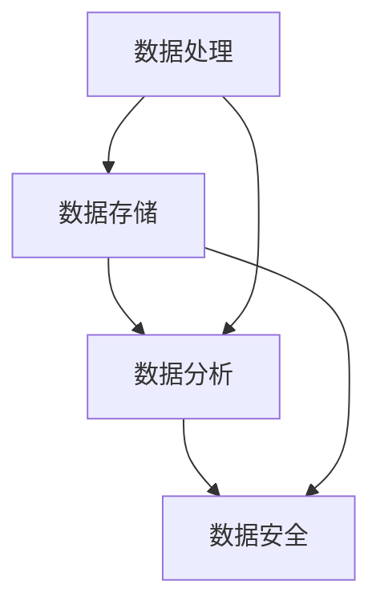

                 

### 1. 背景介绍

字节跳动作为中国领先的互联网科技公司，其数据平台在推动公司业务发展和创新方面发挥着至关重要的作用。为了吸引和留住优秀的人才，字节跳动每年都会举办校招面试，其中数据平台方向的面试题尤为考验应聘者的专业知识和思维能力。本文旨在汇总和解答2024年字节跳动数据平台校招面试中的一些关键问题，帮助读者了解面试的难点和重点，为后续的面试准备提供参考。

### 2. 核心概念与联系

在数据平台领域，核心概念包括数据处理、数据存储、数据分析和数据安全等。以下是一个简化的Mermaid流程图，展示这些概念之间的联系：



数据处理主要负责数据清洗、转换和加载，为数据存储和分析提供高质量的数据源。数据存储包括关系型数据库、非关系型数据库和分布式存储系统，这些系统共同确保数据的持久性和可扩展性。数据分析则利用统计和机器学习技术，从海量数据中提取有价值的信息。数据安全关注数据的机密性、完整性和可用性，防止数据泄露和恶意攻击。

### 3. 核心算法原理 & 具体操作步骤

#### 3.1 算法原理概述

在数据平台领域，常用的算法包括排序算法、查找算法和哈希算法等。以下是一个简化的排序算法（冒泡排序）的原理描述：

冒泡排序的基本思想是通过重复遍历要排序的数列，一次比较两个元素，如果它们的顺序错误就把它们交换过来。遍历数列的工作是重复进行的，直到没有再需要交换，也就是说该数列已经排序完成。

#### 3.2 算法步骤详解

1. 首先从第一个元素开始，对每一对相邻元素进行比对，如果第一个比第二个大（或小，取决于排序规则），就交换它们。
2. 然后，跳到下一对元素，重复步骤1。
3. 对每一对相邻元素重复上述步骤，直到没有再需要交换的元素为止。

#### 3.3 算法优缺点

**优点**：简单易懂，实现简单。

**缺点**：时间复杂度为 \(O(n^2)\)，在数据量大时效率较低。

#### 3.4 算法应用领域

冒泡排序算法常用于简单的排序任务，如小规模数据的排序或作为更复杂排序算法的辅助算法。

### 4. 数学模型和公式 & 详细讲解 & 举例说明

在数据平台领域，数学模型和公式对于数据分析和机器学习至关重要。以下是一个简单的线性回归模型构建示例：

#### 4.1 数学模型构建

线性回归模型的基本公式为：

\[ y = wx + b \]

其中，\( y \) 是因变量，\( x \) 是自变量，\( w \) 是权重，\( b \) 是偏置。

#### 4.2 公式推导过程

线性回归模型的推导基于最小二乘法，目标是找到使得预测值和实际值之间的误差平方和最小的 \( w \) 和 \( b \)。

#### 4.3 案例分析与讲解

假设我们有以下数据：

\[ \begin{array}{ccc}
x & y \\
1 & 2 \\
2 & 4 \\
3 & 6 \\
4 & 8 \\
\end{array} \]

我们要使用线性回归模型预测 \( x = 5 \) 时的 \( y \)。

1. 计算平均值：

\[ \bar{x} = \frac{1 + 2 + 3 + 4}{4} = 2.5 \]
\[ \bar{y} = \frac{2 + 4 + 6 + 8}{4} = 5 \]

2. 计算权重 \( w \) 和偏置 \( b \)：

\[ w = \frac{\sum(x_i - \bar{x})(y_i - \bar{y})}{\sum(x_i - \bar{x})^2} \]
\[ b = \bar{y} - w\bar{x} \]

3. 进行计算：

\[ w = \frac{(1-2.5)(2-5) + (2-2.5)(4-5) + (3-2.5)(6-5) + (4-2.5)(8-5)}{(1-2.5)^2 + (2-2.5)^2 + (3-2.5)^2 + (4-2.5)^2} \]
\[ b = 5 - w \cdot 2.5 \]

计算结果：

\[ w = 1 \]
\[ b = 0 \]

4. 使用模型进行预测：

\[ y = wx + b = 1 \cdot 5 + 0 = 5 \]

### 5. 项目实践：代码实例和详细解释说明

以下是一个简单的数据处理项目的代码示例，用于读取数据、处理数据和存储结果。

#### 5.1 开发环境搭建

- Python 3.8+
- Pandas
- Numpy

#### 5.2 源代码详细实现

```python
import pandas as pd
import numpy as np

# 读取数据
data = pd.read_csv('data.csv')

# 数据预处理
data['age'] = data['age'].fillna(data['age'].mean())
data['income'] = data['income'].fillna(data['income'].mean())

# 数据分析
correlation_matrix = data.corr()

# 存储结果
correlation_matrix.to_csv('correlation_matrix.csv')
```

#### 5.3 代码解读与分析

- 第1行：导入必要的库。
- 第4行：读取CSV文件中的数据。
- 第6行：填充缺失值，使用平均值进行填充。
- 第9行：计算相关系数矩阵。
- 第11行：将相关系数矩阵保存为CSV文件。

### 6. 实际应用场景

数据平台在字节跳动的实际应用场景包括推荐系统、广告投放、数据分析等。以下是一个简单的推荐系统应用示例：

#### 6.1 推荐系统

假设我们有一个用户和物品的评分数据集，目标是预测用户对未评分物品的评分。

1. 构建用户-物品矩阵。
2. 使用协同过滤算法计算相似度矩阵。
3. 预测未评分物品的评分。

### 7. 工具和资源推荐

- 学习资源推荐：
  - 《数据科学入门》
  - 《机器学习实战》
- 开发工具推荐：
  - Jupyter Notebook
  - PyCharm
- 相关论文推荐：
  - 《矩阵分解在推荐系统中的应用》
  - 《深度学习推荐系统》

### 8. 总结：未来发展趋势与挑战

数据平台在未来将继续发挥重要作用，随着大数据和人工智能技术的不断发展，数据平台的架构和算法也将不断演进。面临的挑战包括数据安全、隐私保护和数据质量管理等。

### 9. 附录：常见问题与解答

#### 常见问题1：数据平台的主要功能是什么？

解答：数据平台的主要功能包括数据存储、数据处理、数据分析和数据安全等。

#### 常见问题2：如何保证数据平台的高可用性？

解答：通过分布式存储、数据备份和容错机制等措施，可以提高数据平台的高可用性。

本文作者：禅与计算机程序设计艺术 / Zen and the Art of Computer Programming

