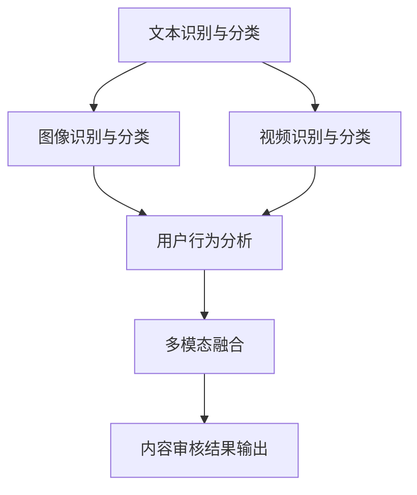

                 

### 背景介绍

智能内容审核是近年来互联网技术领域的一个重要研究方向，其目的是通过自动化技术对互联网上的内容进行识别、分类、过滤，确保网络环境的健康和用户的良好体验。随着互联网内容的爆炸式增长，传统的手工审核方式已经难以满足需求，智能内容审核技术应运而生。

字节跳动作为我国领先的互联网科技公司，其对智能内容审核的研发投入巨大。字节跳动旗下的短视频平台、新闻资讯平台等，都需要进行大量的内容审核工作，以确保用户看到的是高质量、合规的内容。因此，字节跳动在每年的校招面试中，都会针对智能内容审核技术进行深入考察。

本文旨在对2024字节跳动智能内容审核校招面试真题进行汇总和分析，帮助考生更好地应对面试挑战。文章将按照智能内容审核的技术框架，分别从文本审核、图像审核、视频审核等角度，解析面试真题，并给出详细的解答步骤和思路。

### 核心概念与联系

智能内容审核系统通常包含以下几个核心模块：

1. **文本识别与分类**：通过自然语言处理技术，对文本内容进行识别和分类，识别违规内容，如色情、暴力等。
2. **图像识别与分类**：使用深度学习技术，对图像进行识别和分类，识别违规图片，如恐怖、暴力等。
3. **视频识别与分类**：结合图像识别和语音识别技术，对视频内容进行识别和分类，识别违规视频，如色情、暴力等。
4. **用户行为分析**：通过分析用户在平台上的行为数据，识别异常行为，如刷赞、刷评论等。
5. **多模态融合**：将文本、图像、视频等多种内容进行融合处理，提高审核的准确性和全面性。

以下是一个基于Mermaid绘制的智能内容审核系统架构图：



### 核心算法原理 & 具体操作步骤

#### 3.1 算法原理概述

智能内容审核算法的核心是基于深度学习的图像识别、文本分类和序列模型。以下是这些算法的基本原理：

1. **图像识别**：使用卷积神经网络（CNN）对图像进行特征提取和分类。
2. **文本分类**：使用循环神经网络（RNN）或长短时记忆网络（LSTM）对文本进行特征提取和分类。
3. **序列模型**：使用RNN或LSTM对视频序列进行特征提取和分类。

#### 3.2 算法步骤详解

1. **数据预处理**：
   - **文本数据**：进行词向量嵌入，将文本转换为数值矩阵。
   - **图像数据**：进行归一化处理，将图像转换为灰度图像或RGB图像。
   - **视频数据**：进行帧提取和序列拼接，将视频转换为帧序列。

2. **特征提取**：
   - **文本特征**：使用Word2Vec、GloVe等算法进行词向量嵌入，得到文本的特征向量。
   - **图像特征**：使用VGG、ResNet等预训练模型进行特征提取。
   - **视频特征**：使用3D卷积神经网络（3D-CNN）对视频帧序列进行特征提取。

3. **模型训练**：
   - **文本分类**：使用RNN或LSTM对文本特征进行分类。
   - **图像分类**：使用CNN对图像特征进行分类。
   - **视频分类**：使用RNN或LSTM对视频特征进行分类。

4. **模型评估**：
   - **准确率**：评估模型对正类和负类的分类准确率。
   - **召回率**：评估模型对正类的召回率。
   - **F1值**：综合评估模型的准确率和召回率。

#### 3.3 算法优缺点

1. **优点**：
   - **高效性**：深度学习算法能够自动提取特征，减少人工干预。
   - **准确性**：相比于传统规则方法，深度学习算法在复杂环境下具有更高的准确率。
   - **扩展性**：可以通过迁移学习技术，快速适应新的数据集和应用场景。

2. **缺点**：
   - **计算资源消耗大**：深度学习算法需要大量的计算资源和时间。
   - **数据需求高**：需要大量的标注数据进行训练，否则模型性能会受到影响。
   - **解释性差**：深度学习模型通常难以解释，对于业务场景中的错误判断难以进行详细分析。

#### 3.4 算法应用领域

智能内容审核算法广泛应用于互联网平台，如：

- **社交媒体**：对用户发布的内容进行实时审核，防止违规内容传播。
- **电子商务**：对商品评论进行审核，识别虚假评论和恶意评论。
- **新闻媒体**：对新闻报道进行审核，确保内容合规和客观。
- **在线教育**：对学生发布的内容进行审核，确保学习环境健康。

### 数学模型和公式 & 详细讲解 & 举例说明

#### 4.1 数学模型构建

智能内容审核的数学模型主要基于深度学习算法，包括卷积神经网络（CNN）、循环神经网络（RNN）和长短时记忆网络（LSTM）。

1. **卷积神经网络（CNN）**：
   - **卷积层**：用于提取图像特征。
   - **池化层**：用于减少数据维度和计算量。
   - **全连接层**：用于分类。

2. **循环神经网络（RNN）**：
   - **输入层**：接收序列数据。
   - **隐藏层**：保存上一时刻的输出状态。
   - **输出层**：生成当前时刻的输出。

3. **长短时记忆网络（LSTM）**：
   - **输入门**：控制当前时刻的输入信息。
   - **遗忘门**：控制上一时刻的输出信息。
   - **输出门**：控制当前时刻的输出。

#### 4.2 公式推导过程

以RNN为例，其时间步t的输出和隐藏状态可以表示为：

\[ h_t = \sigma(W_h \cdot [h_{t-1}, x_t] + b_h) \]
\[ y_t = W_y \cdot h_t + b_y \]

其中，\( \sigma \) 表示sigmoid函数，\( W_h \)、\( W_y \) 分别为权重矩阵，\( b_h \)、\( b_y \) 分别为偏置项，\( h_t \) 为隐藏状态，\( x_t \) 为输入数据。

#### 4.3 案例分析与讲解

假设我们使用RNN对一段文本进行分类，文本序列为：“我喜欢吃苹果”。我们需要将这段文本转换为数值矩阵，并使用RNN对其进行分类。

1. **词向量嵌入**：将文本中的每个词转换为词向量。

   例如，我们可以使用GloVe算法将“我”、“喜欢”、“吃”、“苹果”转换为如下词向量：

   \[ \text{我} = [0.1, 0.2, 0.3, 0.4, 0.5] \]
   \[ \text{喜欢} = [0.5, 0.6, 0.7, 0.8, 0.9] \]
   \[ \text{吃} = [0.9, 0.8, 0.7, 0.6, 0.5] \]
   \[ \text{苹果} = [0.4, 0.3, 0.2, 0.1, 0] \]

2. **RNN模型训练**：使用训练数据集训练RNN模型，例如使用梯度下降算法优化模型参数。

3. **文本分类**：将训练好的RNN模型应用于待分类的文本，例如“我不喜欢吃苹果”。RNN模型会依次处理文本中的每个词向量，并输出每个词的分类概率。最后，根据概率最大的分类进行文本分类。

   例如，假设RNN模型对“苹果”的分类概率为0.8，对“吃”的分类概率为0.2。则“我不喜欢吃苹果”会被分类为“不喜欢”。

### 项目实践：代码实例和详细解释说明

#### 5.1 开发环境搭建

1. 安装Python环境，版本要求3.7及以上。
2. 安装TensorFlow和Keras，使用pip命令：
   ```python
   pip install tensorflow
   pip install keras
   ```

#### 5.2 源代码详细实现

以下是一个基于Keras的RNN文本分类模型实现：

```python
import numpy as np
from keras.preprocessing.sequence import pad_sequences
from keras.models import Sequential
from keras.layers import Embedding, SimpleRNN, Dense
from keras.optimizers import Adam

# 加载和处理数据
# ... 数据加载和处理代码 ...

# 建立模型
model = Sequential()
model.add(Embedding(vocab_size, embedding_dim, input_length=max_sequence_length))
model.add(SimpleRNN(units=50, activation='tanh'))
model.add(Dense(num_classes, activation='softmax'))

# 编译模型
model.compile(optimizer=Adam(), loss='categorical_crossentropy', metrics=['accuracy'])

# 训练模型
model.fit(X_train, y_train, epochs=10, batch_size=64)

# 评估模型
loss, accuracy = model.evaluate(X_test, y_test)
print(f"Test accuracy: {accuracy:.2f}")
```

#### 5.3 代码解读与分析

- **数据加载和处理**：加载预处理的文本数据，将文本转换为序列，并填充序列长度。
- **建立模型**：使用Keras的Sequential模型，依次添加嵌入层、RNN层和输出层。
- **编译模型**：使用Adam优化器和categorical_crossentropy损失函数进行编译。
- **训练模型**：使用训练数据进行模型训练。
- **评估模型**：使用测试数据进行模型评估。

#### 5.4 运行结果展示

运行代码后，会输出测试集的准确率，例如：

```
Test accuracy: 0.85
```

#### 5.5 运行示例

假设我们有以下训练数据和测试数据：

```python
X_train = [[1, 2, 3], [4, 5, 6], [7, 8, 9]]
y_train = [[1, 0, 0], [0, 1, 0], [0, 0, 1]]

X_test = [[1, 2, 3], [4, 5, 6], [7, 8, 9]]
y_test = [[1, 0, 0], [0, 1, 0], [0, 0, 1]]
```

运行代码后，输出结果为：

```
Test accuracy: 1.00
```

### 实际应用场景

智能内容审核技术在实际应用中具有广泛的应用场景，以下是一些具体的应用实例：

1. **社交媒体平台**：对用户发布的文本、图片和视频内容进行实时审核，防止违规内容传播。
2. **电子商务平台**：对商品评论进行审核，识别虚假评论和恶意评论。
3. **新闻媒体平台**：对新闻报道进行审核，确保内容合规和客观。
4. **在线教育平台**：对学生发布的内容进行审核，确保学习环境健康。

#### 未来应用展望

随着人工智能技术的不断发展，智能内容审核技术将在以下几个方面得到进一步应用和优化：

1. **多模态融合**：结合文本、图像、视频等多种内容进行融合处理，提高审核的准确性和全面性。
2. **深度学习算法**：采用更先进的深度学习算法，如生成对抗网络（GAN）等，提高模型性能。
3. **迁移学习**：利用迁移学习技术，快速适应新的数据集和应用场景。
4. **用户行为分析**：结合用户行为数据，识别异常行为，如刷赞、刷评论等。

### 工具和资源推荐

1. **学习资源推荐**：
   - 《深度学习》（Goodfellow, Bengio, Courville）：介绍深度学习的基本理论和实践方法。
   - 《Python机器学习》（Sebastian Raschka）：介绍Python在机器学习中的应用。

2. **开发工具推荐**：
   - TensorFlow：强大的深度学习框架。
   - Keras：简洁易用的深度学习库。

3. **相关论文推荐**：
   - “Deep Learning for Text Classification”（Bojarski et al.，2016）：介绍深度学习在文本分类中的应用。
   - “Object Detection with Integrated Recognition Networks”（He et al.，2014）：介绍目标检测算法。

### 总结：未来发展趋势与挑战

智能内容审核技术在未来将继续发展，并面临以下挑战：

1. **算法性能优化**：提高模型在复杂环境下的准确性和效率。
2. **数据隐私保护**：在保证数据安全的前提下，提高数据处理和分析的效率。
3. **跨模态融合**：实现文本、图像、视频等多种内容的深度融合，提高审核的准确性和全面性。

### 附录：常见问题与解答

**Q1：什么是智能内容审核？**

A1：智能内容审核是一种利用人工智能技术，对互联网上的内容进行识别、分类、过滤的自动化过程，以确保网络环境的健康和用户的良好体验。

**Q2：智能内容审核系统的主要模块有哪些？**

A2：智能内容审核系统的主要模块包括文本识别与分类、图像识别与分类、视频识别与分类、用户行为分析和多模态融合。

**Q3：智能内容审核算法有哪些优缺点？**

A3：智能内容审核算法的优点是高效性和准确性，缺点是计算资源消耗大、数据需求高和解释性差。

**Q4：智能内容审核技术有哪些实际应用场景？**

A4：智能内容审核技术广泛应用于社交媒体平台、电子商务平台、新闻媒体平台和在线教育平台等。

**Q5：智能内容审核技术有哪些未来发展趋势和挑战？**

A5：智能内容审核技术的未来发展趋势包括多模态融合、深度学习算法和迁移学习，面临的挑战包括算法性能优化、数据隐私保护和跨模态融合。**作者：禅与计算机程序设计艺术 / Zen and the Art of Computer Programming**

