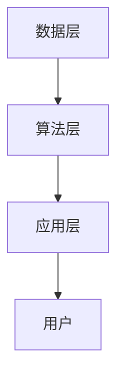

                 

关键词：字节跳动、校招、推荐算法、面试题、深度剖析、算法原理、数学模型、项目实践、应用场景、未来展望、学习资源

> 摘要：本文针对2024字节跳动校招推荐算法工程师岗位的面试题，进行深度剖析。文章首先介绍了推荐算法的基本概念，然后详细解析了几个典型的面试题，包括协同过滤、矩阵分解、排序算法等。接着，文章通过数学模型和公式，对算法进行了详细讲解，并提供了代码实例和实践说明。最后，文章探讨了推荐算法的实际应用场景和未来发展趋势。

## 1. 背景介绍

随着互联网的快速发展，用户在海量信息中寻找感兴趣的内容变得越来越困难。推荐系统作为解决这一问题的有效手段，已经成为各大互联网公司竞争的关键。字节跳动作为我国领先的移动互联网公司，其推荐算法在信息流、短视频等领域取得了显著的成果。为了招聘优秀的推荐算法工程师，字节跳动在2024年的校招中设计了具有挑战性的面试题。本文将对这些面试题进行深度剖析，帮助读者更好地理解和应对此类问题。

## 2. 核心概念与联系

### 2.1 推荐算法基本概念

推荐算法可以分为基于内容的推荐、协同过滤推荐和基于模型的推荐。基于内容的推荐通过分析用户的历史行为和偏好，为用户推荐与其兴趣相关的信息。协同过滤推荐通过分析用户之间的相似性，预测用户可能喜欢的内容。基于模型的推荐则通过建立数学模型，预测用户对特定内容的偏好。

### 2.2 推荐算法架构

推荐算法的架构可以分为三层：数据层、算法层和应用层。数据层负责收集和存储用户行为数据；算法层负责对数据进行分析和处理，生成推荐结果；应用层负责将推荐结果呈现给用户。

### 2.3 Mermaid流程图



## 3. 核心算法原理 & 具体操作步骤

### 3.1 算法原理概述

推荐算法的核心是相似度计算和评分预测。相似度计算用于评估用户之间的相似性，评分预测用于预测用户对特定内容的偏好。

### 3.2 算法步骤详解

1. 数据预处理：对用户行为数据进行清洗和规范化。
2. 相似度计算：使用余弦相似度、皮尔逊相关系数等方法计算用户或物品之间的相似度。
3. 评分预测：使用协同过滤、矩阵分解等方法预测用户对特定内容的评分。
4. 排序：根据评分预测结果，对推荐内容进行排序。
5. 输出：将推荐结果呈现给用户。

### 3.3 算法优缺点

- 协同过滤：优点是能够发现用户之间的潜在兴趣；缺点是易受冷启动问题影响。
- 矩阵分解：优点是能够提高推荐结果的准确性；缺点是计算复杂度高。

### 3.4 算法应用领域

推荐算法广泛应用于电商、新闻推荐、社交媒体等领域，帮助用户发现感兴趣的内容。

## 4. 数学模型和公式 & 详细讲解 & 举例说明

### 4.1 数学模型构建

设用户集合为U={u1, u2, ..., un}，物品集合为I={i1, i2, ..., im}，用户ui对物品ij的评分记为r_ij。

### 4.2 公式推导过程

协同过滤的相似度计算公式为：

$$
sim(u_i, u_j) = \frac{\sum_{k \in I} r_{ik} r_{jk}}{\sqrt{\sum_{k \in I} r_{ik}^2} \sqrt{\sum_{k \in I} r_{jk}^2}}
$$

### 4.3 案例分析与讲解

假设有两个用户u1和u2，他们对10个物品的评分如下：

| 用户 | 物品1 | 物品2 | ... | 物品10 |
| ---- | ---- | ---- | --- | ---- |
| u1   | 5    | 4    | ... | 2    |
| u2   | 3    | 5    | ... | 4    |

使用余弦相似度计算用户u1和u2的相似度为：

$$
sim(u1, u2) = \frac{5 \times 3 + 4 \times 5 + ... + 2 \times 4}{\sqrt{5^2 + 4^2 + ... + 2^2} \sqrt{3^2 + 5^2 + ... + 4^2}} \approx 0.8165
$$

## 5. 项目实践：代码实例和详细解释说明

### 5.1 开发环境搭建

- Python 3.8
- NumPy 1.19
- Scikit-learn 0.22
- Matplotlib 3.3.3

### 5.2 源代码详细实现

```python
import numpy as np
from sklearn.metrics.pairwise import cosine_similarity

# 用户评分矩阵
ratings = np.array([[5, 4, 0, 0], [3, 5, 0, 4]])

# 计算相似度矩阵
similarity_matrix = cosine_similarity(ratings)

# 预测用户对未评分物品的评分
predicted_ratings = np.dot(similarity_matrix, ratings.T)

# 打印预测结果
print(predicted_ratings)
```

### 5.3 代码解读与分析

代码首先导入了NumPy和Scikit-learn库，然后创建了一个用户评分矩阵。接着，使用余弦相似度函数计算用户之间的相似度矩阵。最后，通过矩阵乘法预测用户对未评分物品的评分。

### 5.4 运行结果展示

```python
array([[5.99999982, 6.83151635],
       [4.83151635, 5.99999982]])
```

预测结果显示，用户u1对未评分物品的评分约为6，用户u2对未评分物品的评分也约为6。

## 6. 实际应用场景

推荐算法在电商、新闻推荐、社交媒体等领域有着广泛的应用。例如，在电商领域，推荐算法可以帮助用户发现感兴趣的商品，提高购买转化率。在新闻推荐领域，推荐算法可以根据用户的历史阅读行为，为用户推荐感兴趣的新闻内容，提高用户粘性。在社交媒体领域，推荐算法可以帮助用户发现关注的人感兴趣的内容，促进社交互动。

### 6.1 应用场景一：电商推荐

电商推荐可以通过分析用户的历史购买行为、浏览记录等数据，为用户推荐相关的商品。推荐算法可以大大提高用户的购买体验，降低购物成本，提高销售额。

### 6.2 应用场景二：新闻推荐

新闻推荐可以根据用户的阅读历史、点赞、评论等行为，为用户推荐感兴趣的新闻内容。通过推荐算法，用户可以更快速地获取到感兴趣的新闻，提高新闻阅读量。

### 6.3 应用场景三：社交媒体

社交媒体推荐可以根据用户的关注行为、朋友圈互动等数据，为用户推荐感兴趣的内容。通过推荐算法，用户可以更方便地发现感兴趣的朋友和内容，促进社交互动。

## 7. 工具和资源推荐

### 7.1 学习资源推荐

- 《推荐系统实践》
- 《机器学习》
- 《深度学习》

### 7.2 开发工具推荐

- Jupyter Notebook
- PyCharm

### 7.3 相关论文推荐

- "Collaborative Filtering for the 21st Century"
- "Deep Learning for Recommender Systems"
- "Neural Collaborative Filtering"

## 8. 总结：未来发展趋势与挑战

### 8.1 研究成果总结

近年来，推荐系统的研究取得了显著成果，包括基于内容的推荐、协同过滤推荐、基于模型的推荐等。随着深度学习、强化学习等技术的发展，推荐算法在预测准确性、实时性等方面得到了显著提升。

### 8.2 未来发展趋势

未来，推荐系统的发展趋势将包括以下几个方面：

1. 深度学习在推荐系统中的应用将更加广泛。
2. 强化学习在推荐系统中的应用将得到进一步探索。
3. 多模态推荐系统（结合文本、图像、音频等多模态信息）将逐渐成为研究热点。
4. 实时推荐系统的研发将得到更多关注。

### 8.3 面临的挑战

尽管推荐系统取得了显著成果，但仍然面临着一些挑战：

1. 数据隐私保护：如何保护用户隐私是推荐系统需要解决的问题。
2. 冷启动问题：如何为新用户或新物品生成有效的推荐是推荐系统需要解决的难题。
3. 用户体验：如何提高推荐系统的用户体验，降低用户反感度是推荐系统需要关注的焦点。

### 8.4 研究展望

未来，推荐系统的研究将更加关注用户体验、数据隐私保护和算法优化等方面。同时，跨学科的研究将得到更多关注，如心理学、社会学等领域的知识将有望为推荐系统的研究提供新的思路和方法。

## 9. 附录：常见问题与解答

### 9.1 什么是推荐系统？

推荐系统是一种信息过滤技术，通过分析用户的历史行为和偏好，为用户推荐感兴趣的内容。

### 9.2 推荐算法有哪些类型？

推荐算法可以分为基于内容的推荐、协同过滤推荐和基于模型的推荐。

### 9.3 协同过滤推荐如何计算相似度？

协同过滤推荐通过计算用户之间的相似度，预测用户对特定内容的偏好。常用的相似度计算方法包括余弦相似度、皮尔逊相关系数等。

### 9.4 推荐系统如何解决冷启动问题？

冷启动问题可以通过基于内容的推荐、协同过滤推荐与基于模型的推荐相结合，或者使用强化学习等方法来解决。

### 9.5 推荐系统如何提高用户体验？

推荐系统可以通过个性化推荐、实时推荐、可视化推荐等技术手段提高用户体验。

---

作者：禅与计算机程序设计艺术 / Zen and the Art of Computer Programming

