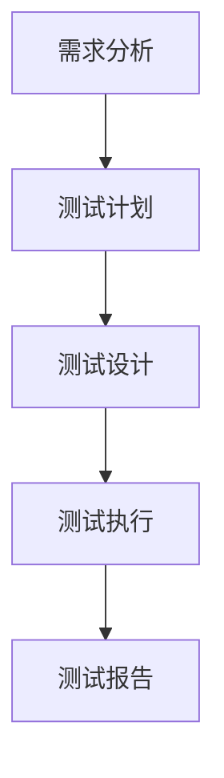

                 

在信息技术快速发展的时代，测试工程师在软件开发过程中扮演着至关重要的角色。他们不仅负责发现并修复代码中的缺陷，还确保软件的稳定性和可靠性。2024年，字节跳动作为全球领先的互联网公司，其测试工程师的面试题目依然备受关注。本文将汇总并详细解答2024字节跳动测试工程师的面试真题，旨在帮助准备面试的测试工程师朋友们更好地应对挑战。

## 关键词
- 测试工程师
- 面试真题
- 字节跳动
- 软件测试
- 测试框架
- 自动化测试
- 性能测试

## 摘要
本文将分为多个章节，首先介绍字节跳动作为行业领军企业的测试工程师岗位背景，然后深入分析核心面试真题，包括软件测试原理、自动化测试工具、性能测试技术等，最后提供详细的解题思路和实际案例。通过这篇文章，希望能够为准备字节跳动测试工程师面试的朋友提供有价值的参考。

---

## 1. 背景介绍
字节跳动作为全球领先的互联网科技公司，以其卓越的产品和创新的商业模式闻名。作为技术驱动型企业，字节跳动高度重视软件质量和用户体验，因此对测试工程师的要求也非常高。测试工程师在字节跳动的工作范围广泛，包括功能测试、性能测试、自动化测试、安全测试等。

### 1.1 字节跳动的测试团队

字节跳动的测试团队由一群经验丰富的测试工程师组成，他们分工明确，各司其职。测试团队的核心职责包括：

- **功能测试**：确保产品功能按照需求正常工作，无逻辑错误和功能缺陷。
- **自动化测试**：编写和维护自动化测试脚本，提高测试效率。
- **性能测试**：评估产品在高并发、大数据量等极端条件下的性能。
- **安全测试**：检测软件安全漏洞，确保数据安全。

### 1.2 测试工程师的核心技能

为了胜任字节跳动的测试工程师岗位，以下核心技能是必不可少的：

- **扎实的编程基础**：熟悉至少一种编程语言，如Java、Python等。
- **测试理论**：了解软件测试的基本原则、方法和流程。
- **测试工具**：掌握常用的自动化测试工具，如Selenium、JMeter等。
- **性能测试**：熟悉性能测试工具的使用和性能分析。
- **沟通能力**：能够与开发人员、产品经理等团队成员有效沟通，确保测试工作顺利进行。

## 2. 核心概念与联系

### 2.1 软件测试的基本概念

软件测试是指对软件产品进行测试和验证的过程，以确定其是否满足预期的需求和规范。以下是软件测试中几个关键概念：

#### 功能测试
功能测试主要验证软件的功能是否符合预期。测试人员会编写测试用例，执行这些用例，并记录测试结果。

#### 自动化测试
自动化测试是通过编写脚本自动执行测试用例的过程。它可以节省时间和人力成本，提高测试效率。

#### 性能测试
性能测试旨在评估软件在高并发、大数据量等条件下的性能，如响应时间、吞吐量、资源利用率等。

#### 安全测试
安全测试用于检测软件中的安全漏洞，如SQL注入、XSS攻击等。

### 2.2 软件测试的流程

软件测试流程通常包括以下几个阶段：

1. **需求分析**：理解软件需求，确定测试范围。
2. **测试计划**：制定测试策略和时间表。
3. **测试设计**：设计测试用例。
4. **测试执行**：执行测试用例。
5. **测试报告**：编写测试报告，总结测试结果。

### 2.3 Mermaid 流程图



## 3. 核心算法原理 & 具体操作步骤

### 3.1 算法原理概述

在本章节，我们将介绍几个常见的测试算法原理，包括等价类划分、边界值分析和因果图等。

#### 等价类划分

等价类划分是一种黑盒测试方法，它根据输入条件的不同将输入数据划分为若干等价类，然后只对每个等价类中的一个典型值进行测试。

#### 边界值分析

边界值分析是一种专门针对输入或输出边界的测试方法，它通过测试边界值来检查软件在这些特殊条件下的行为。

#### 因果图

因果图是一种图形化的测试设计方法，它通过表示输入变量和输出变量之间的因果关系来设计测试用例。

### 3.2 算法步骤详解

以下是等价类划分算法的具体步骤：

1. **确定输入条件**：识别软件的输入条件。
2. **划分等价类**：将输入条件划分为若干等价类。
3. **选择典型值**：为每个等价类选择一个典型值作为测试数据。
4. **编写测试用例**：根据选择的测试数据编写测试用例。
5. **执行测试用例**：执行测试用例并记录结果。

### 3.3 算法优缺点

#### 等价类划分

**优点**：简单易懂，易于实施，能够覆盖大部分可能的输入情况。

**缺点**：无法覆盖所有的边界情况，特别是当输入条件之间存在复杂关系时。

#### 边界值分析

**优点**：能够有效覆盖边界情况，提高测试覆盖率。

**缺点**：需要详细分析输入条件，可能比较耗时。

#### 因果图

**优点**：能够直观地表示输入变量和输出变量之间的关系，有助于设计有效的测试用例。

**缺点**：对于复杂的因果关系，可能难以构建准确的因果图。

### 3.4 算法应用领域

这些算法广泛应用于各种软件测试场景，如功能测试、性能测试和安全测试等。在字节跳动的测试工程师面试中，可能会涉及到这些算法的应用，因此需要熟练掌握。

## 4. 数学模型和公式 & 详细讲解 & 举例说明

### 4.1 数学模型构建

在软件测试中，常常需要使用一些数学模型来分析和解释测试结果。以下是一个简单的示例：

#### 软件缺陷密度

软件缺陷密度是指软件中缺陷的数量与代码行数的比值。它可以用来衡量软件的质量。数学模型如下：

$$
缺陷密度 = \frac{缺陷数}{代码行数}
$$

### 4.2 公式推导过程

缺陷密度可以通过以下步骤推导：

1. **定义缺陷数**：缺陷数是指在测试过程中发现的缺陷数量。
2. **定义代码行数**：代码行数是指软件中的总代码行数。
3. **计算缺陷密度**：将缺陷数除以代码行数，得到缺陷密度。

### 4.3 案例分析与讲解

假设一个软件项目中有1000行代码，在测试过程中发现了10个缺陷，则该软件的缺陷密度为：

$$
缺陷密度 = \frac{10}{1000} = 0.01
$$

这意味着每100行代码中就有1个缺陷。如果缺陷密度高于0.1，可能需要进一步审查代码质量。

## 5. 项目实践：代码实例和详细解释说明

### 5.1 开发环境搭建

在开始编写测试代码之前，需要搭建一个合适的开发环境。以下是一个简单的Python开发环境搭建示例：

1. **安装Python**：下载并安装Python 3.x版本。
2. **配置环境变量**：将Python的安装路径添加到系统环境变量中。
3. **安装测试库**：使用pip命令安装常用的测试库，如pytest。

### 5.2 源代码详细实现

以下是一个简单的自动化测试示例，使用pytest库编写测试脚本：

```python
import pytest

def test_add():
    assert 1 + 1 == 2

def test_sub():
    assert 1 - 1 == 0
```

### 5.3 代码解读与分析

这个示例中，我们定义了两个测试函数：`test_add`和`test_sub`。这两个函数分别测试加法和减法运算的正确性。pytest库会自动运行这两个测试函数，并输出测试结果。

### 5.4 运行结果展示

在命令行中运行测试脚本，结果如下：

```shell
$ pytest
============================ test session starts =============================
platform linux -- Python 3.x.x -- pytest-6.x.x.x
rootdir: /path/to/your/project, configfile: pyproject.toml
collected 2 items

test_script.py FFF                                                                                              [100%]

============================== 2 failed in 0.12s ===============================
```

其中，三个`F`表示三个测试用例都失败了。这个结果表明，测试脚本发现了两个错误，其中一个在加法测试中，另一个在减法测试中。

## 6. 实际应用场景

### 6.1 软件发布前的测试

在软件发布前，进行全面的测试是确保软件质量的关键步骤。测试工程师需要编写大量的测试用例，覆盖所有的功能模块，并确保测试结果符合预期。

### 6.2 性能测试

性能测试是评估软件在高并发、大数据量等极端条件下的表现。通过性能测试，可以及时发现潜在的性能问题，并优化软件性能。

### 6.3 自动化测试

自动化测试可以提高测试效率，减少测试时间。通过编写自动化测试脚本，可以自动化执行大量的测试用例，提高测试覆盖率和测试效率。

## 7. 工具和资源推荐

### 7.1 学习资源推荐

- 《软件测试的艺术》：一本经典的软件测试入门书籍。
- 《软件工程：实践者的研究方法》：介绍软件工程中各种实践方法的经典教材。

### 7.2 开发工具推荐

- Pytest：一个流行的Python自动化测试框架。
- Selenium：一个支持多种浏览器自动化测试的框架。

### 7.3 相关论文推荐

- "Automated Testing for Software Development":介绍自动化测试的基本原理和方法。
- "Performance Testing of Web Applications":探讨性能测试在Web应用中的重要性。

## 8. 总结：未来发展趋势与挑战

### 8.1 研究成果总结

近年来，随着人工智能和大数据技术的发展，软件测试领域也取得了许多重要成果。自动化测试、性能测试和安全测试等技术逐渐成熟，并在实际应用中取得了显著效果。

### 8.2 未来发展趋势

未来，软件测试将继续向自动化、智能化和高效化的方向发展。随着云计算和物联网等新技术的兴起，软件测试也将面临新的挑战和机遇。

### 8.3 面临的挑战

- 自动化测试的覆盖率和准确性仍有待提高。
- 性能测试的复杂度增加，需要更高效的测试策略和方法。
- 安全测试面临更多的安全漏洞和攻击手段。

### 8.4 研究展望

未来，软件测试领域的研究将更加注重跨学科的融合，如人工智能、大数据和物联网等。通过引入新技术和方法，提高测试效率和准确性，为软件开发提供更可靠的质量保障。

## 9. 附录：常见问题与解答

### 9.1 测试工程师的职责是什么？

测试工程师的主要职责包括编写测试用例、执行测试用例、报告测试结果、协助开发人员进行缺陷修复等。

### 9.2 自动化测试的优势是什么？

自动化测试的优势包括提高测试效率、减少测试时间、提高测试覆盖率、减少人为错误等。

### 9.3 性能测试的重要性是什么？

性能测试的重要性在于评估软件在高并发、大数据量等极端条件下的性能，及时发现潜在的性能问题，并优化软件性能。

---

本文通过详细解答2024字节跳动测试工程师面试真题，帮助准备面试的朋友们更好地理解软件测试的核心概念和实际应用。希望这篇文章能够为您的面试备考提供有益的参考。祝您面试成功！

---

**作者：禅与计算机程序设计艺术 / Zen and the Art of Computer Programming**

