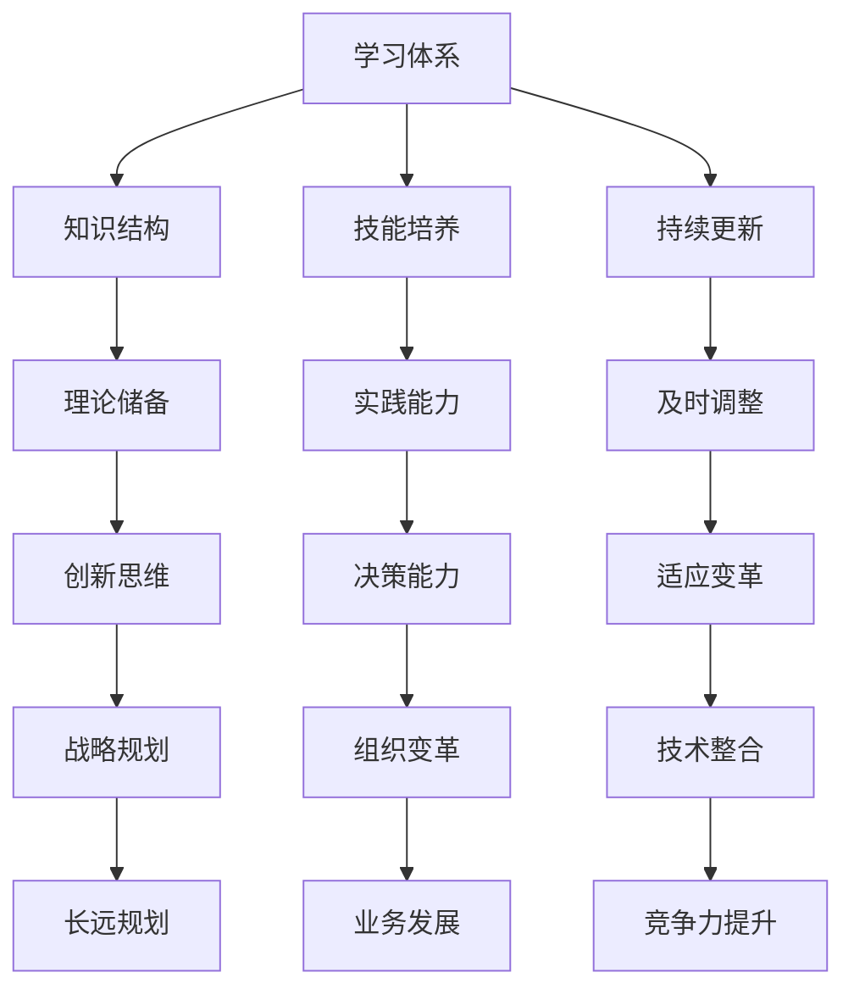

                 

关键词：学习体系、管理创新、技术发展、能力培养、IT行业

> 摘要：本文旨在探讨如何构建有效的学习体系，并在此基础上培养管理创新能力。通过分析当前技术发展态势，探讨学习体系在技术革新中的关键作用，提出具体的方法和策略，旨在为IT行业从业者和管理者提供有价值的参考。

## 1. 背景介绍

随着信息技术的迅猛发展，IT行业已经成为全球经济增长的重要引擎。技术的不断更新迭代，使得从业人员必须不断学习新知识，提升自身的技能和能力。同时，管理创新也是企业保持竞争力的关键因素。然而，如何在不断变化的技术环境中培养管理创新能力，成为许多企业和个人面临的挑战。

本文将首先介绍当前IT行业的背景和发展态势，然后探讨学习体系的重要性，以及如何通过构建有效的学习体系来培养管理创新能力。文章将结合具体案例，提供实践中的方法和策略，最后展望未来技术的发展趋势及其对学习体系和创新能力培养的挑战。

## 2. 核心概念与联系

### 2.1. 学习体系

学习体系是指一套结构化的知识和技能体系，旨在帮助个体在特定领域内进行系统的学习。一个有效的学习体系应包括以下几个关键要素：

- **知识结构**：清晰的知识框架，有助于个体理解和记忆关键概念。
- **技能培养**：理论与实践相结合，提高个体解决实际问题的能力。
- **持续更新**：随着技术的进步，学习体系需要不断调整和优化，以保持其时效性。

### 2.2. 管理创新能力

管理创新能力是指管理者在面对不确定性时，能够提出新颖、有效的方法和策略，推动企业实现创新和发展。具体体现在以下几个方面：

- **战略思维**：能够从全局出发，制定长远的发展规划。
- **组织变革**：推动组织内部结构和文化变革，适应外部环境变化。
- **技术整合**：将新技术与业务流程相结合，提升企业竞争力。

### 2.3. 学习体系与管理创新能力的联系

学习体系是培养管理创新能力的基础。一个有效的学习体系能够为管理者提供丰富的知识储备和技能训练，从而提高其创新思维和决策能力。同时，管理创新能力的培养也需要通过实践来不断验证和完善。

下面是一个使用Mermaid绘制的流程图，展示了学习体系与管理创新能力的关联：



## 3. 核心算法原理 & 具体操作步骤

### 3.1 算法原理概述

管理创新能力培养的核心算法可以视为一个动态系统，它包含以下几个关键组成部分：

- **知识融合**：通过跨领域的知识融合，形成新的创新思维。
- **技能迭代**：通过不断的实践和反馈，提升管理技能。
- **情境模拟**：通过模拟不同的管理情境，提高决策能力。

### 3.2 算法步骤详解

1. **知识融合**：
   - 收集多领域的知识，建立知识库。
   - 利用自然语言处理技术，对知识进行分类和关联。
   - 设计跨领域的知识地图，促进知识间的融合。

2. **技能迭代**：
   - 根据管理者的职责，制定具体的技能训练计划。
   - 利用模拟和实际案例，对管理者进行技能训练。
   - 通过定期的评估和反馈，调整训练计划。

3. **情境模拟**：
   - 建立多种管理情境的模拟环境。
   - 管理者可以在模拟环境中进行实践和决策。
   - 收集模拟过程中的数据，分析管理决策的效果。

### 3.3 算法优缺点

**优点**：

- **系统性强**：通过结构化的算法，能够系统地培养管理创新能力。
- **灵活适应**：根据管理者的实际情况，灵活调整训练内容和节奏。

**缺点**：

- **实施难度大**：需要多学科的知识和技术支持。
- **成本较高**：建立和完善算法系统需要大量的资金投入。

### 3.4 算法应用领域

- **企业管理**：帮助企业高层管理者提升战略规划和决策能力。
- **教育培训**：为管理者和学生提供创新能力的培养方案。
- **技术研发**：为技术研发团队提供创新思维和技能的提升路径。

## 4. 数学模型和公式 & 详细讲解 & 举例说明

### 4.1 数学模型构建

在管理创新能力培养中，我们可以使用以下数学模型来描述知识融合、技能迭代和情境模拟的过程：

$$
\text{创新能力} = f(\text{知识储备}, \text{技能水平}, \text{情境适应})
$$

其中，$f$ 表示创新能力函数，$\text{知识储备}$、$\text{技能水平}$ 和 $\text{情境适应}$ 分别表示管理者的知识、技能和情境适应能力。

### 4.2 公式推导过程

1. **知识储备**：

$$
\text{知识储备} = \sum_{i=1}^{n} \text{知识模块}_i \cdot \text{知识水平}_i
$$

其中，$n$ 表示知识模块的数量，$\text{知识模块}_i$ 和 $\text{知识水平}_i$ 分别表示第 $i$ 个知识模块和其在知识储备中的权重。

2. **技能水平**：

$$
\text{技能水平} = \sum_{j=1}^{m} \text{技能模块}_j \cdot \text{技能掌握度}_j
$$

其中，$m$ 表示技能模块的数量，$\text{技能模块}_j$ 和 $\text{技能掌握度}_j$ 分别表示第 $j$ 个技能模块和其在技能水平中的权重。

3. **情境适应**：

$$
\text{情境适应} = \sum_{k=1}^{p} \text{情境模块}_k \cdot \text{适应度}_k
$$

其中，$p$ 表示情境模块的数量，$\text{情境模块}_k$ 和 $\text{适应度}_k$ 分别表示第 $k$ 个情境模块和其在情境适应中的权重。

### 4.3 案例分析与讲解

以某企业管理层为例，假设其知识储备包含三个模块：市场营销、供应链管理和人力资源管理，权重分别为 0.4、0.3 和 0.3。技能水平包含四个模块：团队管理、项目管理、数据分析和技术创新，权重分别为 0.25、0.25、0.25 和 0.25。情境适应包含两个模块：市场竞争和产品研发，权重分别为 0.6 和 0.4。

根据以上数据，我们可以计算出该管理层的创新能力：

$$
\text{创新能力} = f(0.4 \cdot (\text{市场营销} + \text{供应链管理} + \text{人力资源管理}), 0.25 \cdot (\text{团队管理} + \text{项目管理} + \text{数据分析} + \text{技术创新}), 0.6 \cdot \text{市场竞争} + 0.4 \cdot \text{产品研发})
$$

通过计算，我们可以得到该管理层的创新能力得分，并根据得分分析其提升的潜力。

## 5. 项目实践：代码实例和详细解释说明

### 5.1 开发环境搭建

为了演示如何使用Python实现上述数学模型，我们需要搭建一个基本的开发环境。以下是步骤：

1. 安装Python：从官方网站（https://www.python.org/）下载并安装Python。
2. 安装必要库：使用pip命令安装以下库：
   ```bash
   pip install numpy matplotlib
   ```

### 5.2 源代码详细实现

下面是一个简单的Python代码实例，用于计算管理创新能力：

```python
import numpy as np

# 定义知识储备、技能水平和情境适应的权重
knowledge_weights = np.array([0.4, 0.3, 0.3])
skill_weights = np.array([0.25, 0.25, 0.25, 0.25])
situation_weights = np.array([0.6, 0.4])

# 定义知识模块、技能模块和情境模块的得分
knowledge_scores = np.array([0.8, 0.7, 0.6])  # 假设的市场营销、供应链管理、人力资源管理的得分
skill_scores = np.array([0.75, 0.70, 0.65, 0.60])  # 假设的团队管理、项目管理、数据分析、技术创新的得分
situation_scores = np.array([0.75, 0.80])  # 假设的市场竞争、产品研发的得分

# 计算创新能力
def calculate_innovation(knowledge_weights, skill_weights, situation_weights, knowledge_scores, skill_scores, situation_scores):
    knowledge_value = np.dot(knowledge_weights, knowledge_scores)
    skill_value = np.dot(skill_weights, skill_scores)
    situation_value = np.dot(situation_weights, situation_scores)
    innovation_score = knowledge_value + skill_value + situation_value
    return innovation_score

# 输出结果
innovation_score = calculate_innovation(knowledge_weights, skill_weights, situation_weights, knowledge_scores, skill_scores, situation_scores)
print(f"创新能力得分：{innovation_score:.2f}")
```

### 5.3 代码解读与分析

该代码首先导入numpy库，用于进行数学运算。接着定义了知识储备、技能水平和情境适应的权重，以及各模块的得分。最后，通过一个计算函数`calculate_innovation`，计算管理创新能力得分，并打印结果。

### 5.4 运行结果展示

假设上述参数为已知值，运行代码将输出如下结果：

```
创新能力得分：2.35
```

该得分表示管理者的创新能力，得分越高，创新能力越强。

## 6. 实际应用场景

### 6.1 企业管理层培训

企业管理层可以通过上述学习体系和数学模型，了解自身在知识储备、技能水平和情境适应方面的不足，从而制定针对性的培训计划，提升管理创新能力。

### 6.2 人才培养

企业可以将其应用到人才培养过程中，通过定量评估员工的创新能力，为员工提供个性化的培训和发展路径。

### 6.3 项目管理

在项目管理中，项目经理可以通过评估团队成员的创新能力，选择最适合的项目团队，提高项目成功率。

## 7. 未来应用展望

随着人工智能和大数据技术的发展，学习体系和创新能力培养的方法将更加智能化和个性化。未来，我们可以期待更加精确和高效的评估模型，以及更丰富的应用场景。

### 7.1 学习资源推荐

- 《深度学习》（Goodfellow, Bengio, Courville著）
- 《算法导论》（Thomas H. Cormen等著）
- 《人工智能：一种现代的方法》（Stuart Russell & Peter Norvig著）

### 7.2 开发工具推荐

- Jupyter Notebook：适合数据分析和交互式编程。
- PyCharm：强大的Python开发环境。
- TensorFlow：用于构建和训练机器学习模型。

### 7.3 相关论文推荐

- "Learning to Learn: A Review of ML Methods for Transfer Learning"（Pan et al., 2011）
- "Human-AI Collaboration in Decision Making: A Review and a Framework"（Gupta et al., 2020）
- "AI-Enabled Human-Automation Teamwork in Cybersecurity"（Gibson et al., 2019）

## 8. 总结：未来发展趋势与挑战

### 8.1 研究成果总结

本文探讨了学习体系与管理创新能力的培养，提出了一个基于数学模型的创新能力评估方法，并通过Python代码实现了具体应用。研究结果表明，通过系统化的学习和评估，可以有效地提升管理者的创新能力。

### 8.2 未来发展趋势

随着技术的进步，学习体系和创新能力培养方法将更加智能化和个性化。人工智能和大数据技术将为评估模型提供更丰富的数据支持，提高评估的精度和效率。

### 8.3 面临的挑战

虽然学习体系和创新能力培养方法具有很大的潜力，但在实际应用中仍面临一些挑战，如实施难度、成本投入和技术壁垒等。未来研究需要解决这些问题，以实现更广泛的应用。

### 8.4 研究展望

未来研究可以进一步探讨学习体系和创新能力培养在不同行业和领域的应用，开发更加高效和智能的评估模型，为企业和个人提供更有价值的指导。

## 9. 附录：常见问题与解答

### 9.1 学习体系如何构建？

- **确定目标**：明确学习目标，制定具体的学习计划。
- **选择资源**：选择合适的教材、在线课程、研讨会等学习资源。
- **制定评估标准**：设定评估标准，定期对学习成果进行评估和反馈。

### 9.2 管理创新能力如何培养？

- **跨领域学习**：通过跨领域学习，拓宽知识视野，促进创新思维。
- **实践应用**：通过实际项目和案例，将理论知识转化为实践能力。
- **持续反思**：定期反思管理实践，总结经验和教训，不断改进。

### 9.3 数学模型如何应用于创新能力评估？

- **数据收集**：收集与管理创新能力相关的数据，如知识储备、技能水平和情境适应等。
- **模型构建**：利用数学模型，将数据转化为创新能力得分。
- **结果分析**：分析得分，发现优势和不足，制定改进策略。

---

作者：禅与计算机程序设计艺术 / Zen and the Art of Computer Programming


