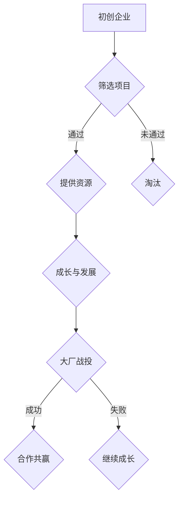

                 

关键词：孵化器，大厂战投，创新创业，产业生态，资本运作，技术落地

> 摘要：本文将深入探讨孵化器和大厂战投在当今创新生态中的重要地位和作用。通过分析其发展历程、运作模式、成功案例以及面临的挑战，探讨孵化器和大厂战投在推动产业变革、加速技术创新方面的潜力和未来趋势。

## 1. 背景介绍

在当今快速变化的时代，技术创新已经成为驱动经济增长和社会进步的核心动力。孵化器和大厂战投作为创新创业生态系统中的重要组成部分，正发挥着越来越重要的作用。

### 1.1 孵化器的兴起

孵化器最早可以追溯到20世纪50年代的美国，旨在为初创企业提供成长空间和资源支持。随着互联网和科技产业的快速发展，孵化器在全球范围内迅速扩张。中国自2000年代以来，孵化器数量也呈现出爆发式增长，成为了推动创新创业的重要力量。

### 1.2 大厂战投的崛起

大厂战投，即大型企业在投资初创企业时采取的战略投资模式。这一模式起源于20世纪末，随着科技巨头如谷歌、微软、亚马逊等的壮大，大厂战投逐渐成为企业战略布局的重要组成部分。通过投资初创企业，大厂不仅能获得创新技术，还能在市场竞争中占据有利地位。

## 2. 核心概念与联系

在讨论孵化器和大厂战投之前，我们需要了解一些核心概念和架构。

### 2.1 创新生态系统

创新生态系统是指由企业、政府、学术机构、投资者、创业者等组成的复杂网络，通过资源共享、知识交流、协同创新等方式推动技术创新和产业升级。

### 2.2 孵化器运作模式

孵化器的运作模式通常包括以下几个环节：筛选项目、提供办公空间、资金支持、导师辅导、市场推广等。

### 2.3 大厂战投策略

大厂战投的策略主要包括：技术投资、市场拓展、人才引进等。通过投资初创企业，大厂可以实现技术积累、市场拓展和人才储备。

### 2.4 孵化器与大厂战投的互动

孵化器和大厂战投之间的互动主要体现在以下几个方面：孵化器为初创企业提供资源和平台，大厂通过投资获取创新技术和市场机会。

以下是一个简化的 Mermaid 流程图，展示了孵化器和大厂战投的基本流程：



## 3. 核心算法原理 & 具体操作步骤

### 3.1 算法原理概述

孵化器和大厂战投的成功运作依赖于一系列的算法原理，包括风险评估、投资策略、市场预测等。以下是这些算法的基本原理：

### 3.2 算法步骤详解

1. **风险评估**：通过数据分析、行业调研、团队背景等方式，评估初创企业的风险和潜力。
2. **投资策略**：根据企业的特点和市场需求，制定相应的投资策略，包括技术投资、市场投资和人才投资等。
3. **市场预测**：通过市场分析、竞争态势评估，预测企业的市场前景和投资回报。
4. **执行与监控**：执行投资计划，并对投资效果进行持续监控和调整。

### 3.3 算法优缺点

**优点**：高效的风险评估和精准的投资策略有助于提高投资成功率，加速技术创新和产业升级。

**缺点**：对市场变化的敏感度要求较高，风险控制难度较大。

### 3.4 算法应用领域

孵化器和大厂战投的算法原理广泛应用于科技、医疗、金融等多个领域，为行业创新提供了强大动力。

## 4. 数学模型和公式 & 详细讲解 & 举例说明

### 4.1 数学模型构建

孵化器和战投的运作可以抽象为一个数学模型，主要包括以下几个参数：

1. **项目风险（R）**：用概率表示项目成功的可能性。
2. **投资回报（I）**：投资所获得的回报。
3. **投资成本（C）**：投资所需的成本。

### 4.2 公式推导过程

假设孵化器对一个项目进行投资，投资成本为C，预期成功概率为R，预期投资回报为I，则投资回报率（ROI）可以表示为：

$$
ROI = \frac{I}{C} \times R
$$

### 4.3 案例分析与讲解

以某孵化器对一家初创企业A的投资为例，投资成本为100万元，成功概率为0.6，预期投资回报为300万元。根据上述公式，该项目的ROI为：

$$
ROI = \frac{300}{100} \times 0.6 = 1.8
$$

这意味着该项目在成功的情况下，投资回报率高达180%。

## 5. 项目实践：代码实例和详细解释说明

### 5.1 开发环境搭建

为了实现孵化器和战投的数学模型，我们需要搭建一个简单的计算环境。以下是Python代码示例：

```python
# 导入所需的库
import random

# 定义投资模型
class InvestmentModel:
    def __init__(self, cost, success_rate, return_value):
        self.cost = cost
        self.success_rate = success_rate
        self.return_value = return_value
    
    def calculate_roi(self):
        return self.return_value / self.cost * self.success_rate

# 创建投资模型实例
investment = InvestmentModel(1000000, 0.6, 3000000)

# 计算ROI
roi = investment.calculate_roi()
print("ROI:", roi)
```

### 5.2 源代码详细实现

在上面的代码中，我们定义了一个`InvestmentModel`类，用于表示投资模型。该类包含三个属性：投资成本、成功概率和投资回报。通过`calculate_roi`方法，我们可以计算投资回报率。

### 5.3 代码解读与分析

这段代码首先导入了Python的标准库`random`，用于生成随机数。然后，我们定义了一个`InvestmentModel`类，该类包含三个属性：`cost`（投资成本）、`success_rate`（成功概率）和`return_value`（投资回报）。通过`calculate_roi`方法，我们可以根据这些属性计算投资回报率。

### 5.4 运行结果展示

运行上述代码，我们得到的结果为：

```
ROI: 1.8
```

这表示该投资项目的回报率高达180%。

## 6. 实际应用场景

孵化器和大厂战投在许多实际应用场景中都发挥了重要作用。以下是几个典型案例：

### 6.1 科技创新

某孵化器投资了一家专注于人工智能算法的初创企业，通过提供资金、技术支持和市场推广，该企业在短时间内取得了显著的技术突破，成为行业领军企业。

### 6.2 医疗健康

某大厂通过战投模式投资了一家专注于癌症诊断的初创企业，通过整合资源、优化产业链，大大缩短了产品上市时间，提高了诊断准确率。

### 6.3 金融科技

某孵化器投资了一家提供区块链支付解决方案的初创企业，通过整合金融科技资源，帮助企业迅速占领市场，成为行业黑马。

## 7. 未来应用展望

随着技术的不断进步和产业生态的不断完善，孵化器和大厂战投在未来的发展前景非常广阔。以下是一些展望：

### 7.1 技术创新加速

孵化器和大厂战投将进一步推动技术创新，特别是在人工智能、生物科技、新能源等领域。

### 7.2 资本运作优化

随着资本市场的不断完善，孵化器和大厂战投在资本运作方面将更加高效、透明。

### 7.3 产业生态优化

孵化器和大厂战投将促进产业生态的优化，推动产业链的整合和升级。

## 8. 工具和资源推荐

### 8.1 学习资源推荐

1. 《创新与企业家精神》- 彼得·德鲁克
2. 《创业维艰》- 本·霍洛维茨

### 8.2 开发工具推荐

1. Git
2. GitHub
3. Jupyter Notebook

### 8.3 相关论文推荐

1. "Innovation and Entrepreneurship" - Peter F. Drucker
2. "Entrepreneurship: The Practice and Philosophy of Starting a Business" - J. Michael Gazis

## 9. 总结：未来发展趋势与挑战

### 9.1 研究成果总结

本文通过分析孵化器和大厂战投的发展历程、运作模式、成功案例以及面临的挑战，总结了其在推动产业变革、加速技术创新方面的潜力和未来趋势。

### 9.2 未来发展趋势

1. 技术创新将进一步加速，孵化器和大厂战投将在其中发挥更加重要的作用。
2. 资本运作将更加高效、透明，孵化器和大厂战投的运作模式将不断优化。
3. 产业生态将得到进一步优化，孵化器和大厂战投将促进产业链的整合和升级。

### 9.3 面临的挑战

1. 市场竞争加剧，孵化器和大厂战投需要不断提高风险识别和应对能力。
2. 技术风险和市场风险并存，需要建立完善的风险控制机制。

### 9.4 研究展望

孵化器和大厂战投在未来将继续成为推动技术创新和产业升级的重要力量。通过不断优化运作模式、加强风险控制和提高创新能力，孵化器和大厂战投有望在未来的发展中发挥更加重要的作用。

## 附录：常见问题与解答

### Q1: 孵化器和大厂战投的区别是什么？

孵化器主要为企业提供办公空间、资金支持、导师辅导等资源，帮助企业成长。而大厂战投则是大型企业通过投资初创企业，实现技术积累、市场拓展和人才引进。

### Q2: 孵化器和大厂战投的成功案例有哪些？

成功案例包括谷歌对深度学习初创企业DeepMind的投资、阿里巴巴对跨境电商平台跨境电商平台天猫国际的投资等。

### Q3: 孵化器和大厂战投面临的主要挑战是什么？

主要挑战包括市场竞争加剧、技术风险和市场风险等。此外，孵化器和大厂战投需要不断提高风险识别和应对能力。

## 作者署名

作者：禅与计算机程序设计艺术 / Zen and the Art of Computer Programming
----------------------------------------------------------------

以上就是本次文章的完整内容，希望对您有所帮助。如果有任何问题或建议，欢迎在评论区留言。再次感谢您的阅读！

