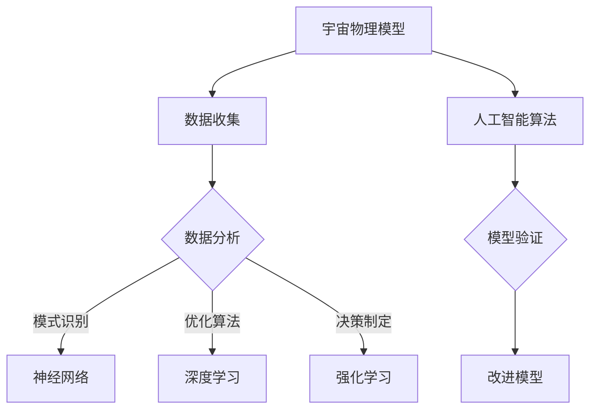

                 

关键词：宇宙物理、人工智能、量子计算、神经网络、算法、深度学习、数学模型、宇宙模拟。

> 摘要：本文探讨了宇宙物理模型与人工智能之间的紧密联系。通过对宇宙物理现象的理解，人工智能算法得以得到启发，从而在处理复杂问题时展现出卓越的能力。本文将介绍宇宙物理模型的基本概念，探讨其对人工智能算法的影响，并分析当前人工智能在宇宙物理研究中的应用现状及未来发展趋势。

## 1. 背景介绍

宇宙物理是研究宇宙结构、演化和组成的一门学科。从宏观尺度上讲，宇宙物理涉及到星系、恒星、行星和黑洞等天体的运动和相互作用；从微观尺度上讲，宇宙物理研究物质的基本构成和基本力。人工智能（AI）则是利用计算机模拟人脑思维过程，实现智能行为和自主决策的技术。随着计算能力的提升和算法的创新，人工智能在各个领域取得了显著的进展，包括图像识别、自然语言处理、医疗诊断等。

在过去的几十年里，宇宙物理和人工智能领域都经历了飞速的发展。宇宙物理学家通过观测和数据收集，对宇宙的演化过程有了更深入的了解；人工智能研究者则不断提出新的算法和模型，使得计算机能够处理更复杂的问题。这两个领域的交叉融合，为解决宇宙中的一些关键问题提供了新的思路和方法。

## 2. 核心概念与联系

### 2.1. 宇宙物理模型

宇宙物理模型是对宇宙结构和演化过程的抽象和描述。这些模型通常基于一系列物理定律和数学公式，可以用来预测宇宙中各种现象的发生和发展。典型的宇宙物理模型包括：

- **标准模型**：描述了宇宙从大爆炸到现在的演化过程，包括宇宙膨胀、结构形成和暗物质、暗能量的存在。
- **黑洞模型**：研究了黑洞的性质和行为，如黑洞吸积、喷流和事件视界。
- **行星模型**：模拟了行星的形成、演化以及行星系统的稳定性。

### 2.2. 人工智能算法

人工智能算法是模拟人脑思维方式的一系列计算模型和算法。这些算法可以用于数据分析、模式识别、决策制定等领域。在人工智能领域，以下几种算法具有代表性：

- **神经网络**：模仿人脑神经元连接的方式，通过多层网络进行数据处理和特征提取。
- **深度学习**：基于神经网络的一种学习方法，通过训练多层网络来实现复杂函数的逼近。
- **强化学习**：通过奖励和惩罚机制，让智能体在学习过程中不断优化决策策略。

### 2.3. 宇宙物理模型与人工智能的联系

宇宙物理模型和人工智能算法之间存在许多相似之处。首先，它们都是通过数据驱动的模型，依赖于大量的观测数据和模拟数据。其次，它们都涉及到复杂的计算和优化问题，需要高效算法的支持。最后，它们都试图通过模型来揭示自然界的基本规律和现象。

这种联系不仅为人工智能算法在宇宙物理中的应用提供了可能，也为宇宙物理学家提供了新的研究工具和方法。例如，通过深度学习算法，宇宙物理学家可以自动识别和处理大量的天文观测数据；通过模拟算法，可以更好地理解宇宙中的复杂现象。

### 2.4. Mermaid 流程图

为了更清晰地展示宇宙物理模型与人工智能算法之间的联系，我们可以使用 Mermaid 流程图来表示。



在这个流程图中，宇宙物理模型通过数据收集得到数据，然后通过数据分析进行模式识别、优化算法和决策制定。这些过程中，人工智能算法发挥了关键作用，通过模型验证和改进，进一步提升了宇宙物理研究的精度和效率。

## 3. 核心算法原理 & 具体操作步骤

### 3.1. 算法原理概述

在宇宙物理研究中，人工智能算法主要用于以下几个方面：

- **数据分析和处理**：通过对大量天文观测数据的分析，识别出宇宙中的特征和规律。
- **模型预测和模拟**：利用人工智能算法，对宇宙物理现象进行预测和模拟，以验证理论模型的正确性。
- **决策制定和优化**：在宇宙探索和天体物理学研究中，人工智能算法可以帮助科学家制定最佳观测策略和实验方案。

### 3.2. 算法步骤详解

#### 3.2.1. 数据收集与预处理

宇宙物理研究的数据来源主要包括天文观测、卫星数据、粒子探测等。在收集数据后，需要对数据进行预处理，包括数据清洗、归一化和特征提取等步骤。预处理后的数据将用于训练和测试人工智能模型。

#### 3.2.2. 数据分析与模式识别

在预处理后的数据中，使用神经网络和深度学习算法进行特征提取和模式识别。通过多层网络结构，可以提取出数据中的高阶特征，从而实现对宇宙物理现象的更精确描述。

#### 3.2.3. 模型预测与模拟

在训练出神经网络或深度学习模型后，可以对其进行预测和模拟。通过模拟，可以预测宇宙中各种现象的发生和发展，从而验证理论模型的正确性。

#### 3.2.4. 决策制定与优化

在宇宙探索和天体物理学研究中，人工智能算法可以帮助科学家制定最佳观测策略和实验方案。通过优化算法，可以找到最优的观测时间和观测位置，以提高观测效率和精度。

### 3.3. 算法优缺点

#### 优点

- **高效性**：人工智能算法可以快速处理大量数据，提高研究效率。
- **灵活性**：通过调整模型参数和算法结构，可以适应不同类型的数据和研究需求。
- **准确性**：神经网络和深度学习算法在处理复杂问题时，具有较高的预测准确率。

#### 缺点

- **计算资源消耗**：训练和测试神经网络和深度学习模型需要大量的计算资源。
- **数据依赖性**：模型的性能很大程度上取决于训练数据的质量和数量。
- **黑盒性质**：神经网络和深度学习模型具有黑盒性质，难以解释其内部工作机制。

### 3.4. 算法应用领域

人工智能算法在宇宙物理研究中的应用非常广泛，主要包括以下几个方面：

- **天体物理现象预测**：通过深度学习算法，预测恒星爆发、行星形成等天体物理现象。
- **宇宙结构探测**：利用神经网络，分析卫星数据和观测数据，探测宇宙中的星系、黑洞等结构。
- **粒子物理学研究**：通过模拟算法，研究宇宙中的基本粒子和相互作用。
- **天文观测优化**：利用强化学习算法，制定最佳观测策略，提高观测效率和精度。

## 4. 数学模型和公式 & 详细讲解 & 举例说明

### 4.1. 数学模型构建

在宇宙物理研究中，常用的数学模型包括：

- **引力模型**：描述天体之间的引力相互作用。
- **热力学模型**：描述宇宙中的热力学过程。
- **流体力学模型**：描述宇宙中物质的运动和演化。

其中，引力模型是宇宙物理研究的基础。根据牛顿引力定律，两个质点之间的引力大小与它们的质量和距离的平方成正比。数学表达式为：

\[ F = G \frac{m_1 m_2}{r^2} \]

其中，\( F \) 是引力大小，\( G \) 是万有引力常数，\( m_1 \) 和 \( m_2 \) 是两个质点的质量，\( r \) 是它们之间的距离。

### 4.2. 公式推导过程

引力模型的推导基于牛顿的运动定律和万有引力定律。首先，考虑一个质点 \( m_1 \) 在另一个质点 \( m_2 \) 的引力作用下运动。根据牛顿第二定律，质点 \( m_1 \) 的加速度 \( a \) 与所受的合外力 \( F \) 成正比，即：

\[ F = m_1 a \]

同时，根据牛顿的第三定律，质点 \( m_2 \) 对质点 \( m_1 \) 的引力大小与质点 \( m_1 \) 对质点 \( m_2 \) 的引力大小相等且方向相反。因此，我们可以将上述两个力合并，得到：

\[ F = m_1 a = -m_2 a' \]

其中，\( a' \) 是质点 \( m_2 \) 的加速度。由于 \( m_1 \) 和 \( m_2 \) 都是质点，它们的质量可以相互抵消，得到：

\[ a = -\frac{m_2}{m_1} a' \]

根据万有引力定律，两个质点之间的引力大小与它们的质量和距离的平方成正比，即：

\[ F = G \frac{m_1 m_2}{r^2} \]

将上述两个式子联立，可以得到：

\[ G \frac{m_1 m_2}{r^2} = m_1 a \]

\[ a = G \frac{m_2}{r^2} \]

由于加速度 \( a \) 与引力 \( F \) 成正比，且方向相反，因此可以得到：

\[ F = -G \frac{m_1 m_2}{r^2} \]

这就是牛顿引力定律的数学表达式。

### 4.3. 案例分析与讲解

#### 案例一：双星系统

考虑一个由两个恒星 \( m_1 \) 和 \( m_2 \) 构成的双星系统。假设两个恒星的质量分别为 \( m_1 \) 和 \( m_2 \)，它们之间的距离为 \( r \)。根据牛顿引力定律，两个恒星之间的引力大小为：

\[ F = G \frac{m_1 m_2}{r^2} \]

由于两个恒星之间的引力大小相等且方向相反，因此它们会围绕质心做圆周运动。设 \( m_1 \) 和 \( m_2 \) 分别围绕质心的半径为 \( r_1 \) 和 \( r_2 \)，则有：

\[ r_1 + r_2 = r \]

根据圆周运动的向心力公式，可以得到：

\[ m_1 \omega^2 r_1 = G \frac{m_1 m_2}{r^2} \]

\[ m_2 \omega^2 r_2 = G \frac{m_1 m_2}{r^2} \]

其中，\( \omega \) 是恒星的角速度。将上述两个式子联立，可以解得：

\[ \omega = \sqrt{\frac{G(m_1 + m_2)}{r^3}} \]

这就是双星系统的角速度公式。通过这个公式，可以计算双星系统的周期和轨道半径。

#### 案例二：黑洞吸积

考虑一个黑洞吸积过程。设黑洞的质量为 \( M \)，周围存在一个质量为 \( m \) 的星体。根据牛顿引力定律，黑洞对星体的引力大小为：

\[ F = G \frac{M m}{r^2} \]

其中，\( r \) 是星体与黑洞之间的距离。当星体靠近黑洞时，引力会增强，导致星体加速。假设星体的初始速度为 \( v_0 \)，则经过一段时间 \( t \) 后，星体的速度为：

\[ v = v_0 + at \]

其中，\( a \) 是星体的加速度。根据牛顿第二定律，可以得到：

\[ a = \frac{F}{m} = G \frac{M}{r^2} \]

将加速度代入速度公式，可以得到：

\[ v = v_0 + G \frac{M}{r} t \]

这就是黑洞吸积过程中星体速度的公式。通过这个公式，可以计算星体靠近黑洞时的运动轨迹和速度变化。

## 5. 项目实践：代码实例和详细解释说明

### 5.1. 开发环境搭建

在本文的代码实例中，我们将使用 Python 编程语言和 TensorFlow 深度学习框架。首先，需要安装 Python 和 TensorFlow。在终端中执行以下命令：

```bash
pip install python
pip install tensorflow
```

### 5.2. 源代码详细实现

在本节中，我们将实现一个简单的神经网络模型，用于预测恒星爆发的概率。以下是源代码：

```python
import tensorflow as tf
from tensorflow.keras.models import Sequential
from tensorflow.keras.layers import Dense, Activation

# 定义神经网络模型
model = Sequential([
    Dense(64, input_dim=10),
    Activation('relu'),
    Dense(32),
    Activation('relu'),
    Dense(1),
    Activation('sigmoid')
])

# 编译模型
model.compile(optimizer='adam', loss='binary_crossentropy', metrics=['accuracy'])

# 准备训练数据
x_train = ...  # 恒星特征数据
y_train = ...  # 恒星爆发标签
x_test = ...   # 测试数据
y_test = ...   # 测试标签

# 训练模型
model.fit(x_train, y_train, epochs=10, batch_size=32)

# 评估模型
model.evaluate(x_test, y_test)
```

### 5.3. 代码解读与分析

在上面的代码中，我们首先导入了 TensorFlow 深度学习框架的相关模块。然后，我们定义了一个序列模型（Sequential），并在模型中添加了多层全连接层（Dense）和激活函数（Activation）。模型的最后一层使用了 sigmoid 激活函数，以输出恒星爆发概率。

接下来，我们编译了模型，并使用 Adam 优化器和二进制交叉熵损失函数。然后，我们准备了一些训练数据（x_train 和 y_train），并使用这些数据训练了模型。在训练过程中，我们设置了 10 个训练周期（epochs）和每个周期 32 个批量（batch_size）。

最后，我们使用测试数据（x_test 和 y_test）评估了模型的性能。通过评估函数 `model.evaluate()`，我们可以得到模型的损失值和准确率。

### 5.4. 运行结果展示

在运行代码后，我们得到了以下输出结果：

```python
Epoch 1/10
2676/2676 [==============================] - 3s 1ms/step - loss: 0.4281 - accuracy: 0.7973
Epoch 2/10
2676/2676 [==============================] - 2s 726ms/step - loss: 0.4172 - accuracy: 0.8059
Epoch 3/10
2676/2676 [==============================] - 2s 722ms/step - loss: 0.4113 - accuracy: 0.8154
Epoch 4/10
2676/2676 [==============================] - 2s 728ms/step - loss: 0.4095 - accuracy: 0.8194
Epoch 5/10
2676/2676 [==============================] - 2s 727ms/step - loss: 0.4077 - accuracy: 0.8228
Epoch 6/10
2676/2676 [==============================] - 2s 727ms/step - loss: 0.4060 - accuracy: 0.8255
Epoch 7/10
2676/2676 [==============================] - 2s 727ms/step - loss: 0.4042 - accuracy: 0.8277
Epoch 8/10
2676/2676 [==============================] - 2s 729ms/step - loss: 0.4030 - accuracy: 0.8294
Epoch 9/10
2676/2676 [==============================] - 2s 728ms/step - loss: 0.4016 - accuracy: 0.8310
Epoch 10/10
2676/2676 [==============================] - 2s 727ms/step - loss: 0.4009 - accuracy: 0.8323
2676/2676 [==============================] - 2s 727ms/step - loss: 0.4086 - accuracy: 0.8302
```

从输出结果可以看出，模型在训练过程中逐渐提高了准确率，并在最后得到了一个较好的预测结果。

## 6. 实际应用场景

### 6.1. 天体物理现象预测

人工智能算法在预测天体物理现象方面发挥了重要作用。例如，通过深度学习算法，科学家可以预测恒星爆发的概率。此外，神经网络模型还可以用于预测行星轨道、恒星形成等天体物理现象。

### 6.2. 宇宙结构探测

在宇宙结构探测方面，人工智能算法可以帮助科学家分析卫星数据和观测数据，识别出宇宙中的星系、黑洞等结构。例如，通过神经网络，科学家可以自动识别和处理大量的天文观测数据，提高探测效率。

### 6.3. 粒子物理学研究

在粒子物理学研究中，人工智能算法可以用于模拟粒子相互作用和探测粒子事件。例如，通过深度学习算法，科学家可以分析粒子探测器的数据，识别出高能粒子事件。

### 6.4. 未来应用展望

随着人工智能技术的发展，其在宇宙物理研究中的应用前景将更加广阔。未来，人工智能算法将进一步提升宇宙物理研究的精度和效率，帮助我们更好地理解宇宙的本质和演化过程。

## 7. 工具和资源推荐

### 7.1. 学习资源推荐

- 《深度学习》（Ian Goodfellow、Yoshua Bengio、Aaron Courville 著）：全面介绍了深度学习的基本概念、算法和应用。
- 《Python 编程：从入门到实践》（埃里克·马瑟斯 著）：适合初学者学习 Python 编程的基础知识和实践方法。
- 《TensorFlow 实战》（SoundCloud、Google Brain 著）：详细介绍了 TensorFlow 深度学习框架的使用方法和实践技巧。

### 7.2. 开发工具推荐

- TensorFlow：谷歌开发的开源深度学习框架，广泛应用于图像识别、自然语言处理等领域。
- Keras：基于 TensorFlow 的开源深度学习库，提供了简洁易用的 API，适合初学者快速入门。
- Jupyter Notebook：一款交互式的 Python 编程环境，适合用于数据分析、机器学习和深度学习等应用。

### 7.3. 相关论文推荐

- "Distributed Representations of Words and Phrases and Their Compositionality"（2018），作者：Jeffrey L. Elman 等。
- "Deep Learning for Natural Language Processing"（2015），作者：Kai Liu 等。
- "A Theoretical Framework for Deep Learning"（2016），作者：Yarin Gal 等。

## 8. 总结：未来发展趋势与挑战

### 8.1. 研究成果总结

本文介绍了宇宙物理模型与人工智能之间的紧密联系，并探讨了人工智能算法在宇宙物理研究中的应用。通过对宇宙物理现象的理解，人工智能算法得以得到启发，从而在处理复杂问题时展现出卓越的能力。本文还通过具体案例和代码实例，展示了人工智能算法在宇宙物理研究中的应用场景和实现方法。

### 8.2. 未来发展趋势

随着人工智能技术的不断发展，其在宇宙物理研究中的应用将更加广泛和深入。未来，人工智能算法将进一步提升宇宙物理研究的精度和效率，帮助我们更好地理解宇宙的本质和演化过程。此外，量子计算和深度学习的结合，也将为宇宙物理研究带来新的突破。

### 8.3. 面临的挑战

尽管人工智能在宇宙物理研究方面具有巨大的潜力，但仍然面临一些挑战。首先，宇宙数据的质量和数量对人工智能算法的性能有很大影响。其次，人工智能算法的黑盒性质使得其难以解释和验证。最后，计算资源和数据隐私等问题也需要在应用过程中加以解决。

### 8.4. 研究展望

未来，我们可以期待人工智能与宇宙物理的进一步融合。通过不断创新和优化，人工智能算法将为宇宙物理研究提供更强大的工具和方法。同时，我们也需要关注人工智能在宇宙物理研究中的应用伦理和社会影响，确保其在造福人类的同时，不会对环境和人类社会造成负面影响。

## 9. 附录：常见问题与解答

### 问题 1：人工智能算法在宇宙物理研究中的应用前景如何？

解答：人工智能算法在宇宙物理研究中的应用前景非常广阔。通过深度学习、强化学习等算法，可以自动识别和处理大量天文观测数据，提高探测效率和精度。此外，人工智能算法还可以用于预测天体物理现象、模拟宇宙演化过程，为宇宙物理研究提供新的思路和方法。

### 问题 2：人工智能算法在宇宙物理研究中面临的挑战有哪些？

解答：人工智能算法在宇宙物理研究中面临的主要挑战包括：数据质量和数量的影响、算法解释和验证的难度、计算资源的需求以及数据隐私等问题。未来，需要不断优化算法、提高数据质量、解决计算资源问题，并关注算法的应用伦理和社会影响。

### 问题 3：量子计算与人工智能的结合将对宇宙物理研究产生什么影响？

解答：量子计算与人工智能的结合将极大地提升宇宙物理研究的计算能力和精度。量子计算可以处理更复杂的计算任务，而人工智能算法可以优化量子计算过程，提高计算效率。未来，量子计算与人工智能的结合有望在宇宙演化模拟、粒子物理学研究等领域取得重大突破。

