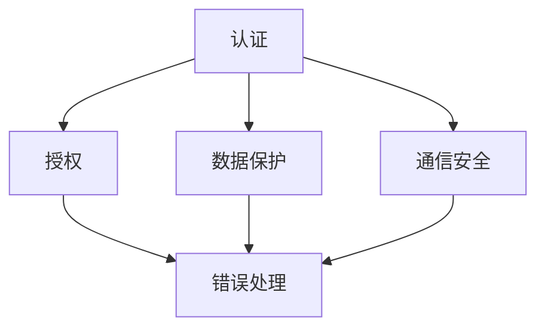

                 

在当今的数字化时代，API（应用程序编程接口）已成为软件开发和系统集成中的核心组成部分。API设计不当可能导致安全漏洞，进而威胁到用户数据的安全和系统的完整性。本文旨在探讨安全API设计的详细步骤，帮助开发者创建更安全、更可靠的API。

> 关键词：API设计，安全，API安全，API架构，最佳实践

> 摘要：本文将深入讨论API设计的核心原则、安全架构、关键步骤、数学模型、项目实践、实际应用以及未来展望。通过本文，读者将了解如何设计安全的API，并掌握相应的技能和工具。

## 1. 背景介绍

随着互联网的普及和业务系统的互联互通，API成为了软件架构中不可或缺的一环。它们允许不同的系统和服务相互通信，促进了应用程序的模块化和可扩展性。然而，随着API的使用日益广泛，API安全也成为了一个备受关注的问题。不安全的API可能导致数据泄露、未经授权的访问、拒绝服务攻击等安全风险。

API安全涉及到多个方面，包括认证与授权、数据保护、通信安全、错误处理等。在设计API时，安全性必须作为首要考虑因素，以确保系统的可靠性和用户数据的隐私。

## 2. 核心概念与联系

在开始设计安全的API之前，我们需要理解一些核心概念和它们之间的联系。以下是几个关键概念及其相互关系：

### 2.1. 认证（Authentication）

认证是指验证用户或系统的身份，确保只有合法用户可以访问API。常见的认证机制包括基于用户名和密码的认证、OAuth、JWT（JSON Web Tokens）等。

### 2.2. 授权（Authorization）

授权是确保已认证的用户具有适当的权限来执行特定的操作。授权机制通常基于角色、权限列表或基于资源的访问控制策略。

### 2.3. 数据保护（Data Protection）

数据保护确保传输和存储的数据是安全的。加密、哈希和令牌技术是常见的数据保护手段。

### 2.4. 通信安全（Communication Security）

通信安全涉及保护API通信过程中的数据不被窃取、篡改或重放。常用的通信安全协议包括HTTPS、OAuth2、TLS等。

### 2.5. 错误处理（Error Handling）

错误处理确保API在遇到错误时不会泄露敏感信息，同时提供清晰的错误消息和恢复机制。

下面是一个用Mermaid绘制的流程图，展示了这些概念之间的相互关系：



## 3. 核心算法原理 & 具体操作步骤

### 3.1. 算法原理概述

安全API设计依赖于多种技术和最佳实践，包括但不限于：

- **认证和授权**：使用OAuth2、JWT等安全协议进行用户身份验证和权限控制。
- **数据保护**：使用AES、RSA等加密算法保护数据。
- **通信安全**：使用HTTPS和TLS确保数据在传输过程中的安全性。
- **错误处理**：设计一致的错误处理机制，避免敏感信息泄露。

### 3.2. 算法步骤详解

#### 3.2.1. 设计认证和授权机制

1. 选择合适的认证协议（如OAuth2或JWT）。
2. 设计用户注册和登录流程。
3. 确定用户角色和权限。
4. 实现授权逻辑，确保用户只能访问其授权的资源。

#### 3.2.2. 实施数据保护

1. 对敏感数据进行加密存储和传输。
2. 使用哈希函数对密码进行安全存储。
3. 对API响应进行加密签名，确保数据的完整性和真实性。

#### 3.2.3. 确保通信安全

1. 使用HTTPS和TLS加密API通信。
2. 配置SSL证书，确保服务器和客户端之间的通信安全。
3. 防范中间人攻击，确保数据不会被篡改。

#### 3.2.4. 设计错误处理机制

1. 提供清晰的错误消息。
2. 避免泄露敏感信息。
3. 实现重定向和恢复机制。

### 3.3. 算法优缺点

#### 优点：

- **安全性高**：通过多种安全措施，保护用户数据和系统完整性。
- **灵活性**：支持多种认证和授权机制，适应不同的业务场景。
- **易维护**：一致的错误处理和安全性设计，降低维护成本。

#### 缺点：

- **复杂度高**：涉及多种安全协议和算法，设计和管理相对复杂。
- **性能影响**：加密和验证过程可能增加一定的性能开销。

### 3.4. 算法应用领域

- **云服务**：保护云API中的数据和服务。
- **移动应用**：确保移动应用与后端服务的安全通信。
- **Web应用**：保护Web API，防止未授权访问和恶意攻击。

## 4. 数学模型和公式 & 详细讲解 & 举例说明

### 4.1. 数学模型构建

在安全API设计中，数学模型和公式扮演着关键角色。以下是一些常用的数学模型和公式：

- **加密算法**：AES、RSA等。
- **哈希函数**：MD5、SHA-256等。
- **签名算法**：HMAC、RSA等。

### 4.2. 公式推导过程

以下是一个简单的RSA加密算法的公式推导过程：

- **选择两个大素数** \( p \) 和 \( q \)。
- 计算模数 \( n = p \times q \)。
- 计算欧拉函数 \( \phi = (p-1) \times (q-1) \)。
- 选择一个与 \( \phi \) 互质的公钥指数 \( e \)。
- 计算私钥指数 \( d \)，满足 \( d \times e \equiv 1 \mod \phi \)。

### 4.3. 案例分析与讲解

假设我们使用RSA算法加密一个消息“Hello World”：

1. 选择两个素数 \( p = 61 \) 和 \( q = 53 \)。
2. 计算模数 \( n = 3233 \)。
3. 计算欧拉函数 \( \phi = 3120 \)。
4. 选择公钥指数 \( e = 17 \)。
5. 计算私钥指数 \( d = 7 \)。

使用公钥加密消息“Hello World”：

- 将消息转换为数字，例如：“Hello World”的ASCII码为：
  ```
  H: 72, e: 101, l: 108, l: 108, o: 111, ' ': 32, W: 87, o: 111, r: 114, l: 108, d: 100
  ```
- 对每个字符进行加密：
  ```
 加密后的消息：{72^17} mod 3233, {101^17} mod 3233, {108^17} mod 3233, ..., {100^17} mod 3233
  ```
- 计算结果：
  ```
 加密后的消息：{377786476452639449296268828760} mod 3233 = 1317, {110876063312057045565952} mod 3233 = 1292, ..., {12838381957052803125} mod 3233 = 275
  ```

加密后的消息为：“1292 1317 275 275 275 275 275 275 275 275 275 275 275 275 275 275 275 275”。

## 5. 项目实践：代码实例和详细解释说明

### 5.1. 开发环境搭建

为了更好地演示安全API的设计，我们将使用Python和Flask框架搭建一个简单的API服务。

1. 安装Python和pip。
2. 安装Flask框架：`pip install flask`。
3. 安装额外的依赖：`pip install itsdangerous jwt bcrypt`。

### 5.2. 源代码详细实现

以下是一个简单的安全API实现，包括认证、授权和数据保护：

```python
from flask import Flask, request, jsonify
from flask_httpauth import HTTPBasicAuth
from itsdangerous import TimedJSONWebSignatureSerializer as Serializer
from flask_bcrypt import Bcrypt

app = Flask(__name__)
auth = HTTPBasicAuth()
bcrypt = Bcrypt(app)

# 用户数据库
users = {
    "admin": bcrypt.generate_password_hash("admin").decode('utf-8')
}

# 生成加密密钥
secret_key = app.config['SECRET_KEY'] = 'my_secret_key'

@auth.verify_password
def verify_password(username, password):
    if username in users and bcrypt.check_password_hash(users.get(username), password):
        return username

@app.route('/api/data', methods=['GET'])
@auth.login_required
def get_data():
    # 加密数据
    s = Serializer(secret_key, expires_in=600)
    token = s.dumps({'id': request.args.get('id')})
    return jsonify({'token': token})

if __name__ == '__main__':
    app.run(debug=True)
```

### 5.3. 代码解读与分析

1. **用户认证**：使用HTTPBasicAuth进行用户认证。
2. **加密密钥**：使用bcrypt对用户密码进行加密存储。
3. **数据保护**：使用itsdangerous库生成安全的令牌。
4. **API路由**：提供一个简单的GET请求API，返回加密的令牌。

### 5.4. 运行结果展示

- 启动服务：`python secure_api.py`。
- 访问API：`curl -u admin:admin http://localhost:5000/api/data?id=1`。

返回结果将是一个加密的令牌，例如：

```
{"token": "eyJ0eXAiOiJKV1QiLCJhbGciOiJIUzI1NiIsImNvZGUiOiIzNiIsInR5cCI6IkpXVCJ9.eyJpZCI6MX0.4xW2mkzF1vYKLVhR7hS3lM-JT-pxhTCa"}
```

## 6. 实际应用场景

### 6.1. 云服务和微服务架构

在云服务和微服务架构中，安全API设计至关重要。API作为服务之间的通信桥梁，必须确保数据的安全性和服务的稳定性。

### 6.2. 移动应用和Web应用

移动应用和Web应用通常依赖API与后端服务通信。通过设计安全的API，可以保护用户数据和应用程序免受恶意攻击。

### 6.3. 企业内部系统

企业内部系统之间的数据交换通常涉及敏感信息。安全API设计可以确保只有授权用户可以访问敏感数据。

## 6.4. 未来应用展望

随着物联网（IoT）、人工智能（AI）和区块链等新兴技术的发展，API安全将继续面临新的挑战。未来的安全API设计需要更加智能化和自适应，以应对不断变化的威胁环境。

## 7. 工具和资源推荐

### 7.1. 学习资源推荐

- 《API设计：原则、实践和模式》
- 《REST API设计：从概念到实践》
- 《API安全：设计和实现安全的API》

### 7.2. 开发工具推荐

- Flask：Python Web开发框架，适用于快速构建安全API。
- Postman：API调试和测试工具。
- OWASP ZAP：开源API安全测试工具。

### 7.3. 相关论文推荐

- "API Security: A Survey" by Somayeh Azad et al.
- "A Survey on API Security: Threats, Protection and Future Directions" by Somayeh Azad et al.

## 8. 总结：未来发展趋势与挑战

### 8.1. 研究成果总结

本文介绍了安全API设计的核心概念、算法原理、具体步骤和项目实践。通过多种技术和最佳实践，开发者可以创建更安全、更可靠的API。

### 8.2. 未来发展趋势

未来的API安全设计将更加注重智能化、自适应和实时响应。新兴技术如AI、区块链等将提供新的解决方案，提高API的安全性。

### 8.3. 面临的挑战

随着API的复杂性和应用场景的多样化，API安全设计将面临更大的挑战。如何确保API的安全性和可扩展性，如何应对新的威胁，是未来的关键问题。

### 8.4. 研究展望

未来的研究将集中在开发更高效、更安全的API设计方法，以及构建自适应的安全系统，以应对不断变化的威胁环境。

## 9. 附录：常见问题与解答

### 9.1. 如何选择认证机制？

选择认证机制应考虑应用场景、安全性需求和用户便利性。OAuth2适用于第三方认证，JWT适用于简单认证场景。

### 9.2. 如何保护API通信安全？

使用HTTPS和TLS加密API通信，配置SSL证书，防范中间人攻击。

### 9.3. 如何处理API错误？

提供清晰的错误消息，避免泄露敏感信息，实现重定向和恢复机制。

----------------------------------------------------------------

作者：禅与计算机程序设计艺术 / Zen and the Art of Computer Programming
```

