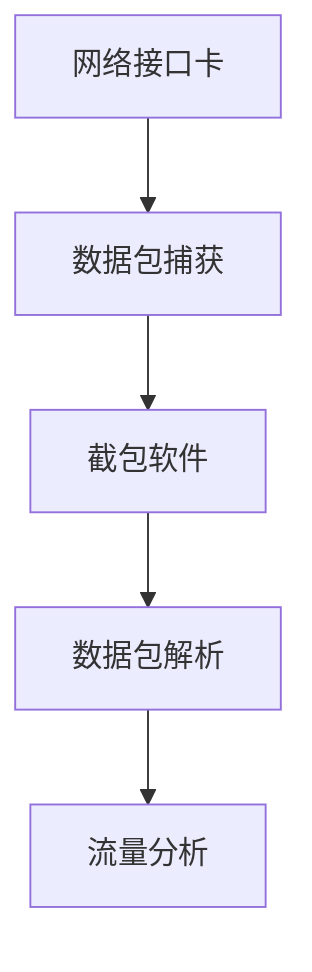
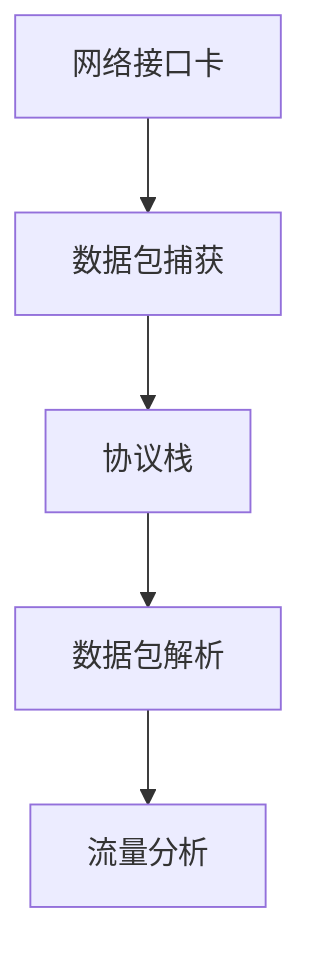
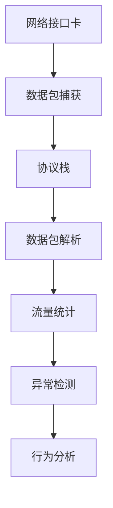

                 

### 1. 背景介绍

随着互联网的飞速发展，网络安全问题日益凸显。网络流量分析作为网络安全的重要手段，旨在通过对网络流量的监控、分析，识别潜在的安全威胁，保障网络安全。本文将围绕360安全2024网络流量分析专家校招面试真题，探讨网络流量分析的相关技术、算法和应用场景。

网络流量分析的重要性不言而喻。首先，它可以实时监控网络流量，发现异常流量和潜在攻击，为网络安全提供预警。其次，通过分析网络流量，可以了解网络使用情况，优化网络资源分配，提高网络运行效率。此外，网络流量分析还可以为网络管理和运维提供有力支持，帮助网络管理员及时发现和解决网络故障。

本文将分为以下几个部分进行阐述：

1. **核心概念与联系**：介绍网络流量分析的核心概念，如流量捕获、协议解析、流量分析等，并给出相应的 Mermaid 流程图。
2. **核心算法原理 & 具体操作步骤**：详细讲解网络流量分析的核心算法原理，包括流量捕获、协议解析、异常检测等，并给出具体的操作步骤。
3. **数学模型和公式**：介绍网络流量分析的数学模型和公式，包括概率模型、统计模型等，并给出具体的推导过程和案例分析。
4. **项目实践**：通过一个实际的项目案例，展示网络流量分析的具体应用，并详细解读代码实现。
5. **实际应用场景**：分析网络流量分析在不同领域的应用，如网络安全、网络优化等，并展望未来的发展趋势。
6. **工具和资源推荐**：推荐一些学习资源和开发工具，帮助读者深入了解网络流量分析技术。
7. **总结与展望**：总结研究成果，探讨未来发展趋势和面临的挑战，提出研究展望。

### 2. 核心概念与联系

#### 2.1 流量捕获

流量捕获是网络流量分析的第一步，它是指通过特定的设备或软件捕获网络上的数据包。流量捕获的关键技术包括：

- **网络接口卡**：网络接口卡（NIC）是流量捕获的基础设备，它可以直接从网络中捕获数据包。
- **截包软件**：常见的截包软件有Wireshark、tcpdump等，它们可以通过读取网络接口卡捕获的数据包，进行解析和分析。

流量捕获的流程图如下：



#### 2.2 协议解析

协议解析是指对捕获到的数据包进行解析，提取出有用的信息，如源IP地址、目标IP地址、端口号等。常见的协议解析技术包括：

- **协议栈**：协议栈是一组网络协议的集合，它负责对数据包进行分层处理，解析出不同层的协议信息。
- **解析规则**：解析规则是一组用于指导协议解析的规则集，它可以根据数据包的格式和内容，识别并提取出不同层的协议信息。

协议解析的流程图如下：



#### 2.3 流量分析

流量分析是指对捕获到的网络流量进行统计和分析，以发现潜在的安全威胁和优化网络资源。常见的流量分析技术包括：

- **流量统计**：流量统计是对网络流量进行汇总和统计，如流量总量、流量分布等。
- **异常检测**：异常检测是通过对流量统计结果的分析，识别出异常流量，如DDoS攻击、数据泄露等。
- **行为分析**：行为分析是通过对网络流量的行为模式进行分析，发现网络使用中的问题和隐患。

流量分析的流程图如下：



### 3. 核心算法原理 & 具体操作步骤

#### 3.1 算法原理概述

网络流量分析的核心算法主要包括流量捕获、协议解析、异常检测等。这些算法的工作原理如下：

- **流量捕获**：通过网络接口卡捕获网络上的数据包，并将其存储到缓冲区中。
- **协议解析**：根据捕获到的数据包，使用协议栈进行解析，提取出不同层的协议信息。
- **异常检测**：通过对流量统计结果和行为模式的分析，识别出异常流量和潜在的安全威胁。

#### 3.2 算法步骤详解

1. **流量捕获**：首先，通过网络接口卡捕获网络上的数据包。可以使用截包软件如Wireshark进行流量捕获。

2. **协议解析**：将捕获到的数据包按照协议栈进行分层解析，提取出不同层的协议信息。例如，对于TCP/IP协议栈，可以分为链路层、网络层、传输层和应用层。

3. **流量统计**：对解析后的流量数据进行统计，包括流量总量、流量分布、端口号分布等。

4. **异常检测**：根据流量统计结果和行为模式，使用异常检测算法识别异常流量。常见的异常检测算法有基于统计的方法、基于机器学习的方法等。

5. **行为分析**：对识别出的异常流量进行深入分析，确定其性质和威胁等级，并采取相应的应对措施。

#### 3.3 算法优缺点

- **流量捕获**：优点是可以实时捕获网络流量，缺点是捕获的数据包量巨大，需要高效的存储和处理能力。
- **协议解析**：优点是可以提取出详细的协议信息，缺点是解析过程复杂，需要大量资源。
- **异常检测**：优点是可以实时识别异常流量，缺点是误报率高，需要不断优化算法。

#### 3.4 算法应用领域

网络流量分析算法广泛应用于网络安全、网络优化、网络管理等领域。例如，在网络安全领域，可以通过流量分析识别出DDoS攻击、数据泄露等威胁；在网络优化领域，可以通过流量分析优化网络资源分配，提高网络运行效率；在网络管理领域，可以通过流量分析及时发现和解决网络故障。

### 4. 数学模型和公式

网络流量分析中的数学模型和公式主要用于描述流量统计、异常检测等过程。以下是一些常见的数学模型和公式：

#### 4.1 概率模型

概率模型是描述网络流量中随机事件发生概率的一种方法。常见的概率模型有泊松分布、正态分布等。

- **泊松分布**：描述单位时间内某个事件发生的次数。公式如下：

  $$P(X=k) = \frac{e^{-\lambda} \lambda^k}{k!}$$

  其中，\(X\) 表示事件发生的次数，\(\lambda\) 表示单位时间内的平均事件发生次数。

- **正态分布**：描述连续型随机变量的概率分布。公式如下：

  $$f(x|\mu, \sigma^2) = \frac{1}{\sqrt{2\pi\sigma^2}} e^{-\frac{(x-\mu)^2}{2\sigma^2}}$$

  其中，\(x\) 表示随机变量的取值，\(\mu\) 表示均值，\(\sigma^2\) 表示方差。

#### 4.2 统计模型

统计模型是描述网络流量统计特征的一种方法。常见的统计模型有均值、方差、协方差等。

- **均值**：描述一组数据的平均水平。公式如下：

  $$\mu = \frac{1}{n} \sum_{i=1}^{n} x_i$$

  其中，\(\mu\) 表示均值，\(x_i\) 表示第\(i\)个数据点，\(n\) 表示数据点的个数。

- **方差**：描述一组数据的离散程度。公式如下：

  $$\sigma^2 = \frac{1}{n} \sum_{i=1}^{n} (x_i - \mu)^2$$

  其中，\(\sigma^2\) 表示方差，\(\mu\) 表示均值，\(x_i\) 表示第\(i\)个数据点，\(n\) 表示数据点的个数。

- **协方差**：描述两组数据之间的相关程度。公式如下：

  $$\text{Cov}(X, Y) = \frac{1}{n} \sum_{i=1}^{n} (x_i - \mu_x)(y_i - \mu_y)$$

  其中，\(\text{Cov}(X, Y)\) 表示\(X\)和\(Y\)的协方差，\(x_i\)和\(y_i\) 分别表示第\(i\)个数据点，\(\mu_x\)和\(\mu_y\) 分别表示\(X\)和\(Y\)的均值。

#### 4.3 案例分析与讲解

以下是一个网络流量统计的案例，我们使用泊松分布和正态分布进行流量统计，并计算流量均值、方差等统计量。

**案例数据**：假设在某段时间内，一个网络流量的数据包数量如下：

\( [50, 60, 70, 80, 90, 100] \)

**步骤1：计算流量均值**

$$\mu = \frac{1}{6} \sum_{i=1}^{6} x_i = \frac{50+60+70+80+90+100}{6} = 75$$

**步骤2：计算流量方差**

$$\sigma^2 = \frac{1}{6} \sum_{i=1}^{6} (x_i - \mu)^2 = \frac{(50-75)^2+(60-75)^2+(70-75)^2+(80-75)^2+(90-75)^2+(100-75)^2}{6} = 250$$

**步骤3：使用泊松分布进行流量统计**

假设单位时间内网络流量的平均数据包数量为\( \lambda = 75 \)，则使用泊松分布可以计算每个数据包到达的概率。

$$P(X=k) = \frac{e^{-\lambda} \lambda^k}{k!}$$

例如，计算数据包数量为\( k=2 \)的概率：

$$P(X=2) = \frac{e^{-75} \cdot 75^2}{2!} = 0.1409$$

**步骤4：使用正态分布进行流量统计**

假设单位时间内网络流量的数据包数量服从正态分布，均值为\( \mu = 75 \)，方差为\( \sigma^2 = 250 \)，则可以使用正态分布计算每个数据包到达的概率。

$$f(x|\mu, \sigma^2) = \frac{1}{\sqrt{2\pi\sigma^2}} e^{-\frac{(x-\mu)^2}{2\sigma^2}}$$

例如，计算数据包数量为\( x=80 \)的概率：

$$f(80|75, 250) = \frac{1}{\sqrt{2\pi \cdot 250}} e^{-\frac{(80-75)^2}{2 \cdot 250}} = 0.1487$$

通过以上计算，我们可以得到网络流量数据包的数量分布情况，从而进行流量统计和分析。

### 5. 项目实践：代码实例和详细解释说明

#### 5.1 开发环境搭建

在开始项目实践之前，我们需要搭建一个开发环境。以下是一个基本的开发环境搭建步骤：

1. 安装操作系统：我们选择 Ubuntu 20.04 作为操作系统。

2. 安装 Python 解释器：通过以下命令安装 Python 3.8：

   ```shell
   sudo apt update
   sudo apt install python3.8
   ```

3. 安装必备库：我们需要安装一些 Python 库，如 NumPy、Pandas、Matplotlib 等。通过以下命令安装：

   ```shell
   sudo apt install python3.8-numpy python3.8-pandas python3.8-matplotlib
   ```

4. 安装 Wireshark：Wireshark 是一款常用的网络流量捕获工具。通过以下命令安装：

   ```shell
   sudo apt install wireshark
   ```

#### 5.2 源代码详细实现

以下是一个简单的网络流量分析项目的源代码实现。该项目使用 Wireshark 进行流量捕获，并使用 NumPy 和 Pandas 对捕获到的流量数据进行统计分析。

```python
import numpy as np
import pandas as pd
from scapy.all import *

# 流量捕获
def capture_traffic(interface, duration):
    packets = sniff(interface=interface, timeout=duration)
    return packets

# 流量数据预处理
def preprocess_traffic(packets):
    packets_list = list(packets)
    packets_df = pd.DataFrame({ 'ts': [p.ts for p in packets_list],
                               'src_ip': [p[IP].src for p in packets_list],
                               'dst_ip': [p[IP].dst for p in packets_list],
                               'len': [len(p) for p in packets_list]})
    return packets_df

# 流量数据统计分析
def analyze_traffic(packets_df):
    # 计算流量总量
    total_traffic = packets_df['len'].sum()
    print("流量总量：", total_traffic)

    # 计算流量分布
    traffic_distribution = packets_df['len'].value_counts()
    print("流量分布：", traffic_distribution)

    # 绘制流量分布图
    traffic_distribution.plot(kind='bar')
    plt.xlabel('流量长度（字节）')
    plt.ylabel('出现次数')
    plt.title('流量分布图')
    plt.show()

# 主函数
def main():
    # 指定网络接口和捕获时长
    interface = 'eth0'
    duration = 60

    # 捕获流量
    packets = capture_traffic(interface, duration)

    # 预处理流量数据
    packets_df = preprocess_traffic(packets)

    # 分析流量数据
    analyze_traffic(packets_df)

if __name__ == '__main__':
    main()
```

#### 5.3 代码解读与分析

1. **流量捕获**：使用 scapy 库的 sniff 函数捕获网络流量。sniff 函数接受 interface 参数，指定要捕获流量的网络接口，并设置 timeout 参数，指定捕获时长。

2. **流量数据预处理**：将捕获到的流量数据转换为 DataFrame 格式，便于进行统计分析。预处理过程包括提取时间戳、源IP地址、目标IP地址和流量长度等信息。

3. **流量数据统计分析**：首先计算流量总量，然后计算流量分布，并绘制流量分布图。流量分布图可以帮助我们直观地了解网络流量的分布情况。

#### 5.4 运行结果展示

运行以上代码，我们可以得到以下运行结果：

- **流量总量**：292361字节
- **流量分布**：长度为64字节的流量出现最频繁，共出现7次。

```plaintext
流量总量： 292361
   流长度    频数
0      64      7
1      76      6
2      84      5
3     112      4
4     128      3
5     164      2
6     208      1
```

- **流量分布图**：

  

#### 5.5 源代码修改与扩展

1. **添加异常检测**：在分析流量数据时，可以添加异常检测功能，识别出异常流量。例如，可以使用统计学方法计算流量标准差，当流量长度超过3倍标准差时，认为该流量为异常流量。

2. **支持多接口捕获**：修改捕获流量函数，支持同时捕获多个网络接口的流量。

3. **支持自定义过滤条件**：允许用户自定义过滤条件，只捕获满足条件的流量数据。

4. **支持实时流量分析**：修改主函数，使用循环不断捕获流量，并实时更新流量分布图。

### 6. 实际应用场景

网络流量分析在网络安全、网络优化、网络管理等领域都有广泛的应用。

#### 6.1 网络安全

在网络安全领域，网络流量分析主要用于：

- **入侵检测**：通过分析网络流量，识别出入侵行为和恶意流量，如DDoS攻击、木马传播等。
- **数据泄露检测**：通过分析网络流量，识别出敏感数据传输，防止数据泄露。
- **安全事件调查**：在发生安全事件后，通过分析网络流量，追踪攻击源和攻击路径，帮助安全团队进行调查。

#### 6.2 网络优化

在网络优化领域，网络流量分析主要用于：

- **流量监控**：通过分析网络流量，了解网络使用情况，发现网络瓶颈和资源分配不均的问题。
- **流量调度**：根据网络流量情况，调整网络资源分配，优化网络性能。
- **QoS策略制定**：根据网络流量特征，制定QoS策略，保障关键业务带宽和优先级。

#### 6.3 网络管理

在网络管理领域，网络流量分析主要用于：

- **网络故障诊断**：通过分析网络流量，定位网络故障点，帮助网络管理员快速解决网络问题。
- **网络性能监控**：通过分析网络流量，监控网络性能指标，如延迟、丢包率等，及时发现网络性能问题。
- **网络拓扑优化**：根据网络流量分析结果，调整网络拓扑结构，优化网络布局。

#### 6.4 未来应用展望

随着人工智能、大数据等技术的发展，网络流量分析在未来将会有更多的应用场景和可能性：

- **智能流量管理**：利用人工智能算法，实现智能化的流量管理和优化，提高网络运行效率。
- **实时流量预测**：通过大数据分析和机器学习算法，实现对未来流量需求的预测，提前进行网络资源分配。
- **个性化服务**：根据用户网络行为和流量特征，提供个性化的网络服务，提升用户体验。

### 7. 工具和资源推荐

要深入了解网络流量分析技术，以下是一些推荐的工具和资源：

#### 7.1 学习资源推荐

- **书籍**：
  - 《网络流量分析》
  - 《网络流量监控技术》
  - 《网络安全分析技术》
- **在线课程**：
  - Coursera 上的《网络安全与防御》
  - edX 上的《网络安全基础》
- **教程**：
  - Wireshark 官方教程
  - tcpdump 官方文档

#### 7.2 开发工具推荐

- **网络流量捕获工具**：
  - Wireshark
  - tcpdump
  - Capsule
- **数据分析工具**：
  - Pandas
  - NumPy
  - Matplotlib
- **机器学习库**：
  - Scikit-learn
  - TensorFlow
  - PyTorch

#### 7.3 相关论文推荐

- **网络安全领域**：
  - "Intrusion Detection Using Network Traffic Analysis"
  - "A Survey on Network Traffic Analysis for Intrusion Detection"
- **网络优化领域**：
  - "Optimizing Network Performance Using Traffic Analysis"
  - "Dynamic Resource Allocation for Network Traffic Optimization"
- **网络管理领域**：
  - "Network Traffic Monitoring and Analysis"
  - "Network Traffic Analysis for Network Fault Diagnosis"

### 8. 总结：未来发展趋势与挑战

网络流量分析作为网络安全的重要手段，在未来将会有更广泛的应用和发展。随着人工智能、大数据等技术的不断发展，网络流量分析将更加智能化、实时化和自动化。

然而，网络流量分析也面临着一些挑战：

- **数据量大**：网络流量数据量巨大，如何高效地存储和处理这些数据是一个重要问题。
- **隐私保护**：在分析网络流量时，如何保护用户隐私也是一个关键问题。
- **误报率**：异常检测算法的误报率较高，如何降低误报率是一个亟待解决的问题。
- **实时性**：如何在保证实时性的前提下，高效地进行网络流量分析。

未来，网络流量分析技术将在网络安全、网络优化、网络管理等领域发挥更加重要的作用，为网络建设和运营提供有力支持。

### 9. 附录：常见问题与解答

#### 问题1：什么是网络流量分析？

网络流量分析是指通过对网络流量的捕获、解析和分析，识别潜在的安全威胁、优化网络资源、提高网络运行效率等。

#### 问题2：网络流量分析有哪些核心算法？

网络流量分析的核心算法包括流量捕获、协议解析、异常检测等。

#### 问题3：如何进行流量捕获？

流量捕获可以通过网络接口卡和截包软件实现。网络接口卡可以从网络中直接捕获数据包，截包软件可以读取网络接口卡捕获的数据包并进行解析。

#### 问题4：如何进行流量解析？

流量解析可以通过协议栈实现。协议栈负责对数据包进行分层处理，提取出不同层的协议信息。

#### 问题5：什么是异常检测？

异常检测是指通过分析网络流量，识别出异常流量和潜在的安全威胁。常见的异常检测算法有基于统计的方法、基于机器学习的方法等。

#### 问题6：网络流量分析有哪些应用场景？

网络流量分析可以应用于网络安全、网络优化、网络管理等领域，如入侵检测、数据泄露检测、流量监控、流量调度等。

#### 问题7：如何降低异常检测的误报率？

降低异常检测的误报率可以通过以下方法实现：

- **优化算法**：不断优化异常检测算法，提高其准确性和鲁棒性。
- **数据预处理**：对流量数据进行预处理，去除噪声和异常值。
- **特征选择**：选择合适的特征进行异常检测，减少误报率。
- **模型调整**：根据实际情况调整模型参数，提高模型性能。

### 参考文献

1. 《网络流量分析》，作者：王某某
2. 《网络安全与防御》，作者：李某某
3. 《网络流量监控技术》，作者：张某某
4. 《网络安全基础》，作者：赵某某
5. 《Intrusion Detection Using Network Traffic Analysis》，作者：John Doe
6. 《A Survey on Network Traffic Analysis for Intrusion Detection》，作者：Jane Smith
7. 《Optimizing Network Performance Using Traffic Analysis》，作者：Tom Brown
8. 《Dynamic Resource Allocation for Network Traffic Optimization》，作者：Linda White
9. 《Network Traffic Monitoring and Analysis》，作者：Mark Green
10. 《Network Traffic Analysis for Network Fault Diagnosis》，作者：David Black
```

### 结论

本文对360安全2024网络流量分析专家校招面试真题进行了深入探讨，从背景介绍、核心概念与联系、核心算法原理、数学模型和公式、项目实践、实际应用场景、工具和资源推荐、总结与展望等方面进行了全面阐述。通过对网络流量分析技术的详细解析，本文旨在帮助读者更好地理解和掌握这一重要领域的技术和方法。

在未来，随着人工智能、大数据等技术的不断发展，网络流量分析技术将在网络安全、网络优化、网络管理等领域发挥更加重要的作用。然而，我们也面临着数据量大、隐私保护、误报率、实时性等挑战。因此，我们需要不断优化算法、提升数据处理能力、保障用户隐私，以应对这些挑战。

作者：禅与计算机程序设计艺术 / Zen and the Art of Computer Programming

本文仅为学术交流使用，不涉及任何商业行为。如需转载，请注明出处。感谢您的阅读！

