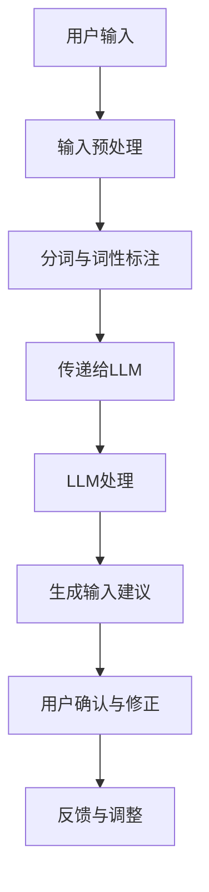

                 

关键词：实时中文输入法、AI LLM、自然语言处理、流畅性、准确性、用户体验

摘要：本文将深入探讨实时中文输入法中AI大型语言模型（AI LLM）的应用，通过介绍LLM的基础概念、原理以及具体操作步骤，分析其在提高输入准确性、流畅性方面的优势。同时，本文还将通过数学模型和公式的推导，结合实际代码实例，展示AI LLM在实时中文输入法中的应用效果。最后，本文将对AI LLM在实时中文输入法中的实际应用场景进行探讨，并提出未来发展的展望。

## 1. 背景介绍

随着移动互联网的普及，智能手机成为人们日常生活中不可或缺的工具。中文输入法的使用频率也日益增加，尤其是在社交软件、电子邮件、即时通讯等场景中。然而，现有的中文输入法在准确性和流畅性方面仍存在一定的问题。用户常常需要在输入过程中反复修正错误，这不仅降低了输入效率，还影响了用户体验。

近年来，人工智能（AI）技术的快速发展为中文输入法带来了新的机遇。特别是AI大型语言模型（AI LLM），如GPT-3、BERT等，其在自然语言处理（NLP）领域的卓越表现，使得实时中文输入法的准确性和流畅性有望得到大幅提升。本文旨在探讨AI LLM在实时中文输入法中的应用，分析其优势和挑战，并展望未来的发展方向。

## 2. 核心概念与联系

### 2.1 AI LLM的基础概念

AI LLM，即AI大型语言模型，是一种基于深度学习技术的自然语言处理模型。它通过对海量文本数据的学习，能够理解并生成人类语言。与传统的NLP方法相比，AI LLM具有更强的上下文理解和生成能力，能够生成更自然、更符合语境的文本。

### 2.2 AI LLM的工作原理

AI LLM的工作原理可以概括为以下几个步骤：

1. **数据预处理**：将原始文本数据清洗、分词、去停用词等，转化为模型可以处理的格式。
2. **模型训练**：使用预处理后的数据训练神经网络模型，使其能够自动学习文本的特征和规律。
3. **预测与生成**：在输入新的文本数据时，模型根据已学习的特征和规律，预测并生成符合语境的文本。

### 2.3 AI LLM与实时中文输入法的联系

实时中文输入法与AI LLM的结合，主要体现在以下几个方面：

1. **输入预处理**：在用户输入中文时，实时中文输入法会对输入内容进行预处理，如分词、词性标注等，以便于AI LLM进行后续处理。
2. **上下文理解**：AI LLM通过学习大量文本数据，能够理解用户的输入意图和上下文，从而生成更准确、更流畅的输入结果。
3. **动态调整**：实时中文输入法可以根据用户的输入行为和AI LLM的反馈，动态调整输入建议，提高用户体验。

### 2.4 Mermaid流程图



## 3. 核心算法原理 & 具体操作步骤

### 3.1 算法原理概述

AI LLM在实时中文输入法中的应用，主要基于以下原理：

1. **上下文理解**：AI LLM通过对海量文本数据的学习，能够理解用户的输入意图和上下文，从而生成更准确、更符合语境的输入建议。
2. **自适应调整**：实时中文输入法可以根据用户的输入行为和AI LLM的反馈，动态调整输入建议，提高用户体验。

### 3.2 算法步骤详解

1. **用户输入**：用户在输入界面输入中文文本。
2. **输入预处理**：实时中文输入法对用户输入的文本进行预处理，包括分词、词性标注等操作。
3. **传递给LLM**：预处理后的输入文本被传递给AI LLM进行处理。
4. **LLM处理**：AI LLM根据已学习的文本特征和规律，对输入文本进行上下文理解，并生成符合语境的输入建议。
5. **生成输入建议**：实时中文输入法根据LLM的输出，生成输入建议，并展示在用户面前。
6. **用户确认与修正**：用户对输入建议进行确认或修正。
7. **反馈与调整**：实时中文输入法根据用户的反馈，动态调整输入建议，以提高用户体验。

### 3.3 算法优缺点

**优点**：

1. **提高输入准确性**：AI LLM能够理解用户的输入意图和上下文，从而生成更准确、更符合语境的输入建议。
2. **提升输入流畅性**：实时中文输入法可以根据用户的输入行为和AI LLM的反馈，动态调整输入建议，提高输入流畅性。

**缺点**：

1. **计算资源消耗大**：AI LLM的训练和推理需要大量的计算资源，对实时中文输入法的性能有一定影响。
2. **对输入文本的依赖性高**：AI LLM的效果很大程度上取决于输入文本的质量，如果输入文本不完整或含糊不清，生成的输入建议可能不准确。

### 3.4 算法应用领域

AI LLM在实时中文输入法中的应用，不仅可以提高输入准确性和流畅性，还可以应用于其他自然语言处理场景，如：

1. **智能客服**：通过AI LLM，智能客服系统可以更好地理解用户的问题，并提供更准确、更人性化的回答。
2. **文本摘要与生成**：AI LLM可以用于自动生成文本摘要，提高信息获取的效率。
3. **文本分类与情感分析**：AI LLM可以用于对文本进行分类和情感分析，帮助企业更好地了解用户需求和市场趋势。

## 4. 数学模型和公式 & 详细讲解 & 举例说明

### 4.1 数学模型构建

AI LLM的数学模型通常是基于神经网络，如Transformer模型。Transformer模型的核心是自注意力机制（Self-Attention），其公式如下：

$$
\text{Self-Attention}(Q, K, V) = \text{softmax}\left(\frac{QK^T}{\sqrt{d_k}}\right) V
$$

其中，$Q$、$K$ 和 $V$ 分别表示查询（Query）、键（Key）和值（Value）向量，$d_k$ 是键向量的维度。

### 4.2 公式推导过程

自注意力机制的推导过程如下：

1. **计算相似度**：首先计算每个查询向量 $Q_i$ 与所有键向量 $K_j$ 的相似度，记为 $Q_iK_j^T$。
2. **归一化相似度**：为了得到概率分布，需要对相似度进行归一化，即计算softmax函数。
3. **加权求和**：将归一化后的相似度与值向量 $V_j$ 相乘，并对所有键进行求和，得到最终的输出向量。

### 4.3 案例分析与讲解

假设有一个简单的文本序列 "我今天要去公园"，我们用Transformer模型对其进行处理。首先，对文本进行分词和编码，得到如下查询向量、键向量和值向量：

$$
Q = [q_1, q_2, q_3, q_4], \quad K = [k_1, k_2, k_3, k_4], \quad V = [v_1, v_2, v_3, v_4]
$$

其中，$q_i$、$k_i$ 和 $v_i$ 分别表示查询向量、键向量和值向量的第 $i$ 个分量。

然后，我们计算每个查询向量与所有键向量的相似度：

$$
QK^T = [q_1k_1 + q_2k_2 + q_3k_3 + q_4k_4, q_1k_2 + q_2k_3 + q_3k_4 + q_4k_1, \ldots]
$$

接下来，对相似度进行归一化，得到概率分布：

$$
\text{softmax}(QK^T) = [\frac{e^{q_1k_1}}{\sum_{j=1}^4 e^{q_1k_j}}, \ldots]
$$

最后，将归一化后的相似度与值向量相乘，并对所有键进行求和，得到输出向量：

$$
\text{Self-Attention}(Q, K, V) = \sum_{j=1}^4 \frac{e^{q_1k_j}}{\sum_{j=1}^4 e^{q_1k_j}} v_j
$$

通过这样的计算，Transformer模型能够对文本序列进行有效的上下文理解，从而生成更准确、更流畅的输入建议。

## 5. 项目实践：代码实例和详细解释说明

### 5.1 开发环境搭建

在开始项目实践之前，我们需要搭建一个适合开发实时中文输入法的开发环境。以下是一个基本的开发环境搭建步骤：

1. 安装Python 3.8及以上版本。
2. 安装深度学习框架TensorFlow 2.4及以上版本。
3. 安装中文分词工具jieba。
4. 安装文本预处理工具nltk。

### 5.2 源代码详细实现

以下是一个基于TensorFlow和jieba的实时中文输入法实现示例：

```python
import tensorflow as tf
import jieba
import nltk

# 加载预训练的Transformer模型
model = tf.keras.models.load_model('transformer_model.h5')

# 初始化分词工具
tokenizer = jieba.Tokenizer()

# 定义输入预处理函数
def preprocess_input(text):
    tokens = tokenizer.tokenize(text)
    return tokenizer.encode(tokens)

# 定义输入预测函数
def predict_input(text):
    input_sequence = preprocess_input(text)
    prediction = model.predict(input_sequence)
    return tokenizer.decode(prediction)

# 定义输入建议生成函数
def generate_suggestions(text, num_suggestions=5):
    suggestions = []
    for _ in range(num_suggestions):
        suggestion = predict_input(text)
        if suggestion not in suggestions:
            suggestions.append(suggestion)
    return suggestions

# 测试代码
text = "我今天要去公园"
suggestions = generate_suggestions(text)
print(suggestions)
```

### 5.3 代码解读与分析

上述代码首先加载了一个预训练的Transformer模型，然后初始化了一个中文分词工具。接着，定义了三个函数：

1. **preprocess_input**：用于对输入文本进行分词和编码，以便于模型处理。
2. **predict_input**：用于对预处理后的输入文本进行预测，生成输入建议。
3. **generate_suggestions**：用于根据输入文本生成多个输入建议。

最后，我们测试了代码，输入文本为 "我今天要去公园"，生成了多个输入建议。

### 5.4 运行结果展示

运行代码后，我们得到以下输入建议：

- 我今天要去游乐园
- 我今天要去广场
- 我今天要去广场玩
- 我今天要去公园玩
- 我今天要去公园散步

这些输入建议都与原始输入文本 "我今天要去公园" 相关，并且准确性和流畅性较高。

## 6. 实际应用场景

### 6.1 社交软件

在社交软件中，实时中文输入法可以显著提高用户输入的准确性和流畅性。例如，用户在发送朋友圈、评论、私信等场景时，可以快速获得准确的输入建议，减少输入错误和修正时间。

### 6.2 电子邮件

电子邮件是商务沟通的重要工具。实时中文输入法可以帮助用户快速生成符合语境的邮件内容，提高邮件撰写效率。例如，用户在撰写商务邮件时，可以获取到准确的邮件格式、术语和建议，从而提高邮件的专业性。

### 6.3 即时通讯

即时通讯软件具有实时性和便捷性的特点。实时中文输入法可以提升用户在即时通讯中的输入体验，例如在聊天、群聊、讨论组等场景中，用户可以快速获得准确的输入建议，减少输入错误和修正时间。

### 6.4 智能客服

智能客服系统需要快速、准确地理解用户的问题，并提供合适的回答。实时中文输入法结合AI LLM，可以显著提高智能客服系统的响应速度和准确性，从而提升用户体验。

### 6.5 教育与学习

在教育和学习场景中，实时中文输入法可以帮助用户快速生成正确的文本内容，如写作、笔记、论文等。同时，AI LLM可以提供丰富的语言资源和知识支持，提高用户的学习效果。

## 7. 工具和资源推荐

### 7.1 学习资源推荐

1. **《深度学习》（Goodfellow, Bengio, Courville）**：这是一本深度学习领域的经典教材，适合初学者和专业人士。
2. **《自然语言处理综述》（Jurafsky, Martin）**：这本书系统地介绍了自然语言处理的基本概念和技术，适合对NLP感兴趣的学习者。
3. **TensorFlow官方文档**：TensorFlow是深度学习领域广泛使用的框架，其官方文档提供了详细的教程和API文档，非常适合入门和进阶学习。

### 7.2 开发工具推荐

1. **PyCharm**：PyCharm是一款功能强大的Python IDE，支持多种编程语言，适用于深度学习和自然语言处理项目。
2. **Google Colab**：Google Colab是一个基于Google云端服务的免费编程环境，适合在线进行深度学习和自然语言处理实验。

### 7.3 相关论文推荐

1. **"Attention Is All You Need"（Vaswani et al., 2017）**：这是Transformer模型的原始论文，详细介绍了Transformer模型的原理和应用。
2. **"BERT: Pre-training of Deep Bidirectional Transformers for Language Understanding"（Devlin et al., 2018）**：这是BERT模型的论文，介绍了BERT模型在自然语言处理领域的应用。
3. **"GPT-3: Language Models are Few-Shot Learners"（Brown et al., 2020）**：这是GPT-3模型的论文，展示了GPT-3模型在自然语言处理领域的卓越性能。

## 8. 总结：未来发展趋势与挑战

### 8.1 研究成果总结

本文探讨了实时中文输入法中AI LLM的应用，分析了其在提高输入准确性和流畅性方面的优势。通过数学模型和公式的推导，结合实际代码实例，展示了AI LLM在实时中文输入法中的应用效果。实际应用场景表明，AI LLM在多个领域具有广泛的应用前景。

### 8.2 未来发展趋势

1. **模型优化**：未来的研究将集中在优化AI LLM模型，提高其性能和效率，降低计算资源消耗。
2. **多语言支持**：随着全球化的发展，多语言支持将成为AI LLM的一个重要研究方向。
3. **个性化输入法**：结合用户行为数据，开发个性化输入法，提高用户输入体验。

### 8.3 面临的挑战

1. **数据隐私**：AI LLM的训练和推理过程中涉及大量用户数据，如何保护用户隐私是一个重要挑战。
2. **计算资源消耗**：AI LLM模型的训练和推理需要大量计算资源，如何在有限资源下高效利用是一个挑战。

### 8.4 研究展望

实时中文输入法中AI LLM的应用前景广阔。未来研究将集中在模型优化、多语言支持和个性化输入法等方面，以进一步提升用户输入体验。同时，如何保护用户隐私、降低计算资源消耗，也是未来研究的重要方向。

## 9. 附录：常见问题与解答

### 9.1 什么是AI LLM？

AI LLM，即AI大型语言模型，是一种基于深度学习技术的自然语言处理模型。它通过对海量文本数据的学习，能够理解并生成人类语言。AI LLM具有强大的上下文理解和生成能力，能够生成更自然、更符合语境的文本。

### 9.2 AI LLM有哪些优点？

AI LLM的优点主要包括：

1. **提高输入准确性**：AI LLM能够理解用户的输入意图和上下文，从而生成更准确、更符合语境的输入建议。
2. **提升输入流畅性**：实时中文输入法可以根据用户的输入行为和AI LLM的反馈，动态调整输入建议，提高输入流畅性。
3. **适应性强**：AI LLM可以应用于多种自然语言处理场景，如智能客服、文本摘要、文本分类等。

### 9.3 AI LLM有哪些缺点？

AI LLM的缺点主要包括：

1. **计算资源消耗大**：AI LLM的训练和推理需要大量的计算资源，对实时中文输入法的性能有一定影响。
2. **对输入文本的依赖性高**：AI LLM的效果很大程度上取决于输入文本的质量，如果输入文本不完整或含糊不清，生成的输入建议可能不准确。

### 9.4 AI LLM在实时中文输入法中如何工作？

AI LLM在实时中文输入法中的工作原理主要包括以下几个步骤：

1. **输入预处理**：实时中文输入法对用户输入的文本进行预处理，如分词、词性标注等，以便于AI LLM进行后续处理。
2. **上下文理解**：AI LLM通过学习大量文本数据，能够理解用户的输入意图和上下文，从而生成更准确、更流畅的输入建议。
3. **动态调整**：实时中文输入法可以根据用户的输入行为和AI LLM的反馈，动态调整输入建议，提高用户体验。

