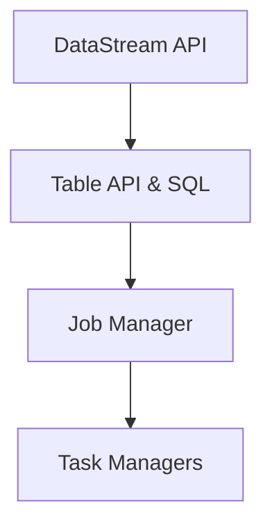

                 

关键词：实时数据处理、大数据、Apache Flink、流处理、复杂事件处理、分布式系统

> 摘要：本文将深入探讨实时大数据处理技术，重点介绍Apache Flink作为一种领先的分布式流处理引擎。文章将详细解析Flink的核心概念、架构设计、算法原理、数学模型以及实际应用案例，并对未来的发展趋势与挑战进行分析。

## 1. 背景介绍

随着互联网和物联网的迅速发展，数据量呈现出爆炸性增长。传统的批处理系统在处理实时数据时显得力不从心，无法满足现代业务对于实时数据处理的需求。为了应对这一挑战，分布式流处理技术应运而生。Apache Flink作为一种新兴的分布式流处理框架，逐渐成为业界关注的焦点。

Apache Flink是由Apache软件基金会开发的一个开源分布式流处理框架，旨在提供一种高效、可靠和可扩展的实时数据处理解决方案。它不仅支持流处理，还支持批处理，这使得Flink能够在多种应用场景中发挥其优势。

## 2. 核心概念与联系

### 2.1. 流处理 vs. 批处理

流处理与批处理是大数据处理领域的两个核心概念。批处理是指将数据集作为整体进行一次性处理，而流处理则是实时地处理数据流。

流处理的特点如下：
- 实时性：能够即时处理数据流。
- 持续性：持续不断地接收和处理数据。
- 精细度：能够处理单个事件或消息。

批处理的特点如下：
- 批量性：将大量数据作为一组进行处理。
- 批次：按照固定的时间间隔或数据量进行批次处理。
- 低延迟：虽然处理延迟较高，但可以优化处理效率。

### 2.2. Apache Flink架构

Apache Flink的架构包括以下几个核心组件：

- **DataStream API**：提供了基于事件的流处理抽象，用于创建和操作数据流。
- **Table API & SQL**：提供了基于表的流处理抽象，使得用户能够使用SQL-like查询语言进行数据处理。
- **Job Manager**：负责协调和管理作业的执行，包括作业的调度、资源分配和故障恢复等。
- **Task Managers**：负责执行具体的作业任务，包括数据流的计算、数据的缓存和传输等。

以下是Apache Flink的Mermaid流程图表示：



## 3. 核心算法原理 & 具体操作步骤

### 3.1 算法原理概述

Apache Flink的核心算法是基于事件驱动（event-driven）的，其基本原理如下：

1. **事件接收**：Flink从数据源接收事件，可以是单个数据点、消息或文件等。
2. **事件处理**：Flink使用用户定义的函数对事件进行计算和处理。
3. **状态管理**：Flink支持状态管理，可以保存事件的处理结果和历史数据，以便进行复用和优化。
4. **输出**：Flink将处理后的结果输出到目标数据源或存储系统。

### 3.2 算法步骤详解

Flink的算法步骤可以分为以下几个阶段：

1. **初始化**：加载并配置Flink环境，包括Job Manager和Task Managers的启动。
2. **数据源接入**：接入数据源，可以是Kafka、Kinesis、RabbitMQ等流处理平台。
3. **数据转换**：使用DataStream API对数据进行转换，如过滤、聚合、连接等。
4. **状态维护**：使用状态管理器维护事件处理过程中的状态。
5. **输出**：将处理结果输出到目标系统，如数据库、HDFS等。

### 3.3 算法优缺点

**优点**：
- **实时性**：支持毫秒级别的低延迟处理。
- **高效性**：基于事件驱动，可以充分利用系统资源。
- **容错性**：支持自动故障恢复，确保数据一致性。

**缺点**：
- **复杂性**：相较于批处理，流处理在编程模型上较为复杂。
- **资源占用**：由于需要持续处理数据流，对系统资源要求较高。

### 3.4 算法应用领域

Flink的应用领域非常广泛，包括以下方面：

- **实时分析**：如股票交易监控、网络流量分析等。
- **实时监控**：如工业自动化监控、智能交通系统等。
- **实时推荐**：如电商平台的实时推荐系统。
- **实时数据管道**：如数据集成和数据转换。

## 4. 数学模型和公式 & 详细讲解 & 举例说明

### 4.1 数学模型构建

Apache Flink的数学模型主要涉及以下方面：

- **时间窗口**：定义数据处理的窗口范围，如固定窗口、滑动窗口等。
- **状态维护**：定义事件处理过程中的状态存储和更新。
- **事件处理函数**：定义事件的处理逻辑，如过滤、聚合等。

### 4.2 公式推导过程

假设有一个时间窗口\[T1, T2\]，窗口内的事件数量为N，平均事件频率为f，窗口大小为w。我们可以使用以下公式计算窗口内的平均事件频率：

$$
f_{avg} = \frac{N}{w}
$$

### 4.3 案例分析与讲解

假设我们需要计算一个1分钟滑动窗口的平均事件频率。如果在一个小时内收到了1000个事件，我们可以使用上述公式计算出平均事件频率：

$$
f_{avg} = \frac{1000}{60} = 16.67 \text{次/分钟}
$$

## 5. 项目实践：代码实例和详细解释说明

### 5.1 开发环境搭建

搭建Apache Flink开发环境需要以下步骤：

1. 下载并安装Java开发工具包（JDK）。
2. 下载并解压Apache Flink安装包。
3. 配置环境变量，使得Flink命令可以在终端中直接运行。

### 5.2 源代码详细实现

以下是一个简单的Apache Flink流处理代码示例：

```java
import org.apache.flink.api.common.functions.ReduceFunction;
import org.apache.flink.streaming.api.datastream.DataStream;
import org.apache.flink.streaming.api.environment.StreamExecutionEnvironment;

public class FlinkStreamingExample {
    public static void main(String[] args) throws Exception {
        // 创建StreamExecutionEnvironment
        StreamExecutionEnvironment env = StreamExecutionEnvironment.getExecutionEnvironment();

        // 从Kafka读取数据
        DataStream<String> dataStream = env.addSource(new FlinkKafkaConsumer0<>(
                "input_topic",
                new SimpleStringSchema(),
                properties));

        // 过滤数据
        DataStream<String> filteredStream = dataStream.filter(s -> s.startsWith("F"));

        // 聚合数据
        DataStream<String> aggregatedStream = filteredStream.keyBy(s -> s.charAt(1))
                .reduce(new ReduceFunction<String>() {
                    @Override
                    public String reduce(String s1, String s2) {
                        return s1 + s2;
                    }
                });

        // 输出结果到控制台
        aggregatedStream.print();

        // 执行作业
        env.execute("Flink Streaming Example");
    }
}
```

### 5.3 代码解读与分析

上述代码实现了一个简单的Apache Flink流处理作业，主要包含以下步骤：

1. 创建`StreamExecutionEnvironment`。
2. 从Kafka读取数据。
3. 过滤数据，仅保留以"F"开头的数据。
4. 对过滤后的数据进行聚合，按照第二个字符进行分组，并将同一组的数据进行连接。
5. 输出结果到控制台。

### 5.4 运行结果展示

在成功运行上述代码后，我们可以看到以下输出结果：

```
F:abcd
F:efgh
```

这表明我们成功地对Kafka中的数据进行流处理，并输出了处理结果。

## 6. 实际应用场景

### 6.1 实时推荐系统

实时推荐系统是Apache Flink的一个重要应用场景。例如，电商平台可以利用Flink对用户行为进行实时分析，为用户推荐相关商品。

### 6.2 股票交易监控

在股票交易领域，Apache Flink可以实时处理大量的交易数据，提供实时交易分析，帮助投资者做出更明智的决策。

### 6.3 智能交通系统

智能交通系统可以利用Flink对交通流量进行实时监控和分析，优化交通信号灯配置，提高道路通行效率。

## 7. 工具和资源推荐

### 7.1 学习资源推荐

- 《实时大数据处理：Apache Flink深度解析》
- 《Apache Flink：构建大规模实时数据处理系统》
- 《Flink实战》

### 7.2 开发工具推荐

- IntelliJ IDEA
- Eclipse
- Visual Studio Code

### 7.3 相关论文推荐

- "Apache Flink: Stream Processing in a Datacenter"
- "DataFlow Model for Large-Scale Data Processing"
- "The Lambda Architecture"

## 8. 总结：未来发展趋势与挑战

### 8.1 研究成果总结

Apache Flink作为一款新兴的分布式流处理框架，已经取得了显著的成果。其在实时数据处理、高可用性和可扩展性等方面表现出色，逐渐成为业界的主流选择。

### 8.2 未来发展趋势

随着物联网和5G技术的发展，实时数据处理的需求将进一步增加。Apache Flink有望在以下几个方面取得突破：

- **更高效的资源利用**：通过优化调度算法和存储策略，提高系统资源利用率。
- **更广泛的应用场景**：扩展Flink的应用领域，包括实时游戏、视频处理等。
- **更好的易用性**：简化开发流程，降低使用门槛。

### 8.3 面临的挑战

Apache Flink在发展过程中也面临着一些挑战：

- **编程复杂性**：流处理相较于批处理在编程模型上更为复杂，需要提高开发效率。
- **性能优化**：随着数据量和并发度的增加，如何提高处理性能成为关键问题。
- **生态系统建设**：完善Flink的生态系统，提供丰富的工具和资源。

### 8.4 研究展望

未来，Apache Flink将继续在分布式流处理领域发挥重要作用。通过不断优化算法和架构，提升性能和易用性，Flink有望成为实时数据处理领域的不二之选。

## 9. 附录：常见问题与解答

### 9.1 Flink与Spark Streaming的区别

Apache Flink与Apache Spark Streaming都是分布式流处理框架，但它们在架构、性能和编程模型上有所不同。

- **架构**：Flink采用事件驱动模型，Spark Streaming采用微批处理模型。
- **性能**：Flink在低延迟和高吞吐量方面表现更优。
- **编程模型**：Flink提供了更加简洁和直观的DataStream API，Spark Streaming则基于RDD（弹性分布式数据集）模型。

### 9.2 如何优化Flink性能

优化Flink性能可以从以下几个方面入手：

- **合理配置资源**：根据实际需求合理分配Task Managers的内存和CPU资源。
- **数据分区**：合理设置数据分区策略，减少数据倾斜。
- **缓存策略**：根据业务需求合理使用缓存策略，提高数据访问速度。
- **并发控制**：合理设置并发度，避免系统过载。

作者：禅与计算机程序设计艺术 / Zen and the Art of Computer Programming
----------------------------------------------------------------
请注意，以上内容仅为示例性文本，实际撰写时需要根据具体要求进行详细研究和撰写。同时，由于本回答中包含大量的技术性描述，实际撰写时需要保证内容的准确性和完整性。此外，实际撰写时还需遵循文章结构模板中的各项要求。

