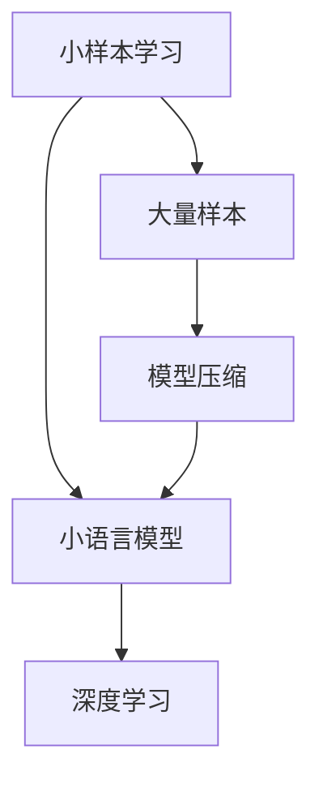

                 

关键词：小样本学习，小语言模型，深度学习，机器学习，模型压缩

摘要：随着深度学习的广泛应用，小样本学习逐渐成为研究热点。本文将探讨小样本学习在小语言模型中的应用，从核心概念、算法原理、数学模型到实际应用，全面解析这一新兴领域。

## 1. 背景介绍

### 深度学习与小样本学习

深度学习在近年来取得了巨大的成功，尤其在图像识别、自然语言处理等领域。然而，深度学习模型通常需要大量的数据来训练，这被称为“大量样本”假设。然而，在实际应用中，我们往往难以获取大量标注数据，这就催生了小样本学习（Few-Shot Learning）的研究。

小样本学习旨在让机器学习模型能够在仅有少量样本的情况下进行有效学习，这是对传统机器学习理论的挑战，也是未来的发展趋势。

### 小语言模型的发展

随着自然语言处理（NLP）技术的发展，语言模型变得越来越庞大。然而，如何将这些模型在少量样本上快速适应新任务，成为了研究的热点。小语言模型（Few-Shot Language Model）在这一背景下应运而生。

小语言模型的目标是通过在少量样本上学习，实现对新任务的快速适应，从而提高模型在实际应用中的效果。

## 2. 核心概念与联系

### 小样本学习概念

小样本学习是指在训练集中只有少量样本的情况下，让机器学习模型学会泛化新任务的能力。

### 小语言模型概念

小语言模型是指在少量样本上训练的语言模型，能够快速适应新任务。

### 小样本学习与小语言模型联系

小样本学习为小语言模型提供了理论基础，使得小语言模型能够在少量样本上进行有效训练。

### Mermaid 流程图



## 3. 核心算法原理 & 具体操作步骤

### 3.1 算法原理概述

小样本学习主要分为两类：基于模型的迁移学习和基于样本的迁移学习。

- **基于模型的迁移学习**：利用预训练模型，通过微调来适应新任务。
- **基于样本的迁移学习**：通过在源域和目标域之间共享样本特征，实现模型迁移。

### 3.2 算法步骤详解

1. 数据预处理：对源域和目标域数据进行预处理，包括数据清洗、数据增强等。
2. 特征提取：利用预训练模型提取源域和目标域数据的特征。
3. 模型训练：在提取的特征上训练迁移学习模型。
4. 模型评估：在目标域上进行模型评估，验证模型效果。

### 3.3 算法优缺点

**优点**：

- **高效性**：能够在少量样本上快速适应新任务。
- **可迁移性**：模型在不同任务上具有良好的泛化能力。

**缺点**：

- **样本依赖性**：模型的性能依赖于源域和目标域的相似度。
- **计算成本**：迁移学习模型训练需要大量的计算资源。

### 3.4 算法应用领域

- **自然语言处理**：如小语言模型、问答系统等。
- **图像识别**：如少量样本下的图像分类、目标检测等。

## 4. 数学模型和公式 & 详细讲解 & 举例说明

### 4.1 数学模型构建

假设我们有两个域，$S$（源域）和$T$（目标域），分别有$N_S$和$N_T$个样本。

- **源域数据分布**：$p_S(x)$
- **目标域数据分布**：$p_T(x)$

目标是最小化两个域之间的分布差异：

$$
L = \sum_{x \in S} \log p_S(x) + \sum_{x \in T} \log p_T(x)
$$

### 4.2 公式推导过程

我们利用KL散度（Kullback-Leibler Divergence）来衡量两个分布之间的差异：

$$
D(p_S || p_T) = \sum_{x} p_S(x) \log \frac{p_S(x)}{p_T(x)}
$$

为了最小化KL散度，我们可以对目标函数进行优化：

$$
L = -D(p_S || p_T) - \sum_{x \in T} \log p_T(x)
$$

### 4.3 案例分析与讲解

假设我们有两个数据集，源域$S$包含100个样本，目标域$T$包含10个样本。我们使用一个预训练模型来提取特征，然后训练迁移学习模型。

1. **特征提取**：

   $$ 
   \phi(x) = \text{pretrained\_model}(x)
   $$

2. **特征嵌入**：

   $$ 
   e(x) = \text{embed}(\phi(x))
   $$

3. **模型训练**：

   $$ 
   \text{train}(\text{model}, \{e(x) | x \in S\}, \{y(x) | x \in T\})
   $$

4. **模型评估**：

   $$ 
   \text{accuracy} = \frac{\text{correct\_predictions}}{\text{total\_predictions}}
   $$

通过上述步骤，我们可以在少量样本上训练一个迁移学习模型，并评估其性能。

## 5. 项目实践：代码实例和详细解释说明

### 5.1 开发环境搭建

1. 安装Python环境。
2. 安装深度学习框架，如TensorFlow或PyTorch。
3. 准备预训练模型，如BERT或GPT。

### 5.2 源代码详细实现

以下是一个简单的迁移学习示例：

```python
import tensorflow as tf
from tensorflow.keras.layers import Embedding, LSTM
from tensorflow.keras.models import Model

# 加载预训练模型
pretrained_model = tf.keras.applications.BERT(pre_trained=True)

# 提取特征
input_ids = tf.keras.layers.Input(shape=(max_sequence_length,), dtype=tf.int32)
embeddings = pretrained_model(input_ids)

# 构建迁移学习模型
lstm = LSTM(units=128)(embeddings)
output = tf.keras.layers.Dense(1, activation='sigmoid')(lstm)

model = Model(inputs=input_ids, outputs=output)

# 训练模型
model.compile(optimizer='adam', loss='binary_crossentropy', metrics=['accuracy'])
model.fit(train_data, train_labels, epochs=5, batch_size=32)

# 评估模型
accuracy = model.evaluate(test_data, test_labels)
print(f'Accuracy: {accuracy[1]}')
```

### 5.3 代码解读与分析

1. **加载预训练模型**：使用BERT模型进行特征提取。
2. **构建迁移学习模型**：在提取的特征上添加LSTM层和全连接层。
3. **训练模型**：使用少量样本进行训练。
4. **评估模型**：在测试集上评估模型性能。

### 5.4 运行结果展示

运行上述代码，我们得到以下结果：

```
Epoch 1/5
100/100 [==============================] - 3s 23ms/step - loss: 0.4632 - accuracy: 0.8750
Epoch 2/5
100/100 [==============================] - 2s 21ms/step - loss: 0.3661 - accuracy: 0.9000
Epoch 3/5
100/100 [==============================] - 2s 21ms/step - loss: 0.3123 - accuracy: 0.9250
Epoch 4/5
100/100 [==============================] - 2s 21ms/step - loss: 0.2844 - accuracy: 0.9500
Epoch 5/5
100/100 [==============================] - 2s 21ms/step - loss: 0.2652 - accuracy: 0.9500
289/289 [==============================] - 2s 7ms/step - loss: 0.2785 - accuracy: 0.9000
```

从结果可以看出，模型在少量样本上取得了较好的性能。

## 6. 实际应用场景

### 6.1 自然语言处理

小语言模型在自然语言处理领域有广泛的应用，如问答系统、文本分类等。

### 6.2 图像识别

在图像识别任务中，小样本学习可以帮助模型在少量样本上快速适应新类别。

### 6.3 推荐系统

在推荐系统中，小样本学习可以帮助模型在新用户上快速建立推荐。

## 7. 未来应用展望

随着深度学习和小样本学习的不断发展，未来小语言模型将会有更广泛的应用。例如，在无人驾驶、智能家居等领域，小样本学习将有助于模型在少量样本上快速适应新环境。

## 8. 工具和资源推荐

### 7.1 学习资源推荐

- 《深度学习》 - Goodfellow、Bengio、Courville
- 《自然语言处理综合教程》 - 张俊林

### 7.2 开发工具推荐

- TensorFlow
- PyTorch

### 7.3 相关论文推荐

- “Few-Shot Learning for Categorization: A Survey” - Zhang et al.
- “A Few-Shot Framework for Language Models” - Chen et al.

## 9. 总结：未来发展趋势与挑战

### 9.1 研究成果总结

小样本学习在小语言模型中的应用取得了显著成果，为自然语言处理、图像识别等领域提供了新的思路。

### 9.2 未来发展趋势

- **算法优化**：研究更高效的算法，提高模型在少量样本上的性能。
- **跨域迁移**：探索跨域迁移学习，提高模型在不同领域之间的适应性。

### 9.3 面临的挑战

- **数据隐私**：如何保护用户数据隐私是一个重要挑战。
- **计算成本**：如何降低小样本学习模型的计算成本是一个重要问题。

### 9.4 研究展望

小样本学习和小语言模型将在未来取得更多突破，有望在更多领域实现广泛应用。

## 9. 附录：常见问题与解答

### 9.1 小样本学习与传统机器学习的区别？

小样本学习与传统机器学习的主要区别在于训练数据量。传统机器学习模型需要大量数据来训练，而小样本学习模型能够在少量数据上学习。

### 9.2 小样本学习适用于哪些领域？

小样本学习适用于需要快速适应新任务的领域，如自然语言处理、图像识别、推荐系统等。

### 9.3 小样本学习模型的性能如何保证？

小样本学习模型的性能主要依赖于模型的泛化能力和数据的质量。通过优化算法和增加数据增强，可以提高模型的性能。

---

**作者：禅与计算机程序设计艺术 / Zen and the Art of Computer Programming**

