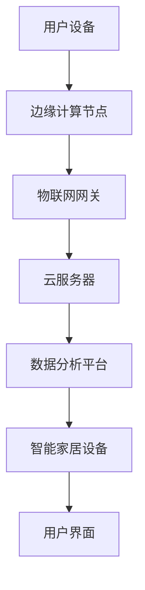

                 

关键词：小米、2024校招、智能家居工程师、面试题、详解、技术语言

> 摘要：本文针对小米2024校招智能家居工程师面试题进行详细解读，深入分析各个题目背后的技术原理和操作步骤，帮助准备参加小米校招的同学们更好地应对面试挑战。

## 1. 背景介绍

随着物联网技术的飞速发展，智能家居领域逐渐成为各大科技公司争相布局的新风口。小米作为智能家居行业的领军企业，其校招面试题目常常涵盖广泛的计算机技术和智能家居相关的知识点。本文旨在通过对小米2024校招智能家居工程师面试题的详细解析，为广大求职者提供技术指导和备考建议。

## 2. 核心概念与联系

在解答智能家居相关面试题时，以下几个核心概念和联系是必须掌握的：

### 2.1 物联网通信协议

- **MQTT**：轻量级的消息队列协议，适用于低带宽、不可靠的网络环境。
- **CoAP**：基于HTTP协议的物联网通信协议，适用于资源受限的设备。
- **ZigBee**：一种短距离无线通信技术，适用于智能家居设备之间的通信。

### 2.2 智能家居架构

- **边缘计算**：在靠近数据源的地方进行数据处理，减轻中心服务器的负担。
- **云计算**：通过互联网提供动态易扩展且经常是虚拟化的资源。

### 2.3 人工智能应用

- **机器学习**：用于智能家居设备的智能预测和决策。
- **深度学习**：在图像识别、语音识别等领域的应用。

### 2.4 安全性问题

- **加密技术**：保护数据传输的安全。
- **身份认证**：确保用户身份的真实性。

下面是一个Mermaid流程图，展示了智能家居系统的基本架构：



## 3. 核心算法原理 & 具体操作步骤

### 3.1 算法原理概述

在智能家居工程师面试中，常见的算法问题包括但不限于：

- **排序算法**：快速排序、归并排序等。
- **查找算法**：二分查找、哈希查找等。
- **动态规划**：解决最优路径问题、背包问题等。

### 3.2 算法步骤详解

以快速排序为例，其基本步骤如下：

1. 选择一个基准元素作为pivot。
2. 将比pivot小的元素移到其左边，比pivot大的元素移到其右边。
3. 对左右子序列重复步骤1和2，直到所有子序列长度为1。

### 3.3 算法优缺点

快速排序的优点是平均时间复杂度为O(nlogn)，缺点是最坏情况下时间复杂度为O(n²)，且需要额外的空间来存储递归栈。

### 3.4 算法应用领域

快速排序广泛应用于各种需要高效排序的场景，如数据库索引构建、文件排序等。

## 4. 数学模型和公式

在智能家居系统中，数学模型和公式是解决实际问题的核心工具。以下是一个简单的例子：

### 4.1 数学模型构建

智能家居系统的能耗模型可以表示为：

\[ E = P \times t \]

其中，\( E \) 是能耗，\( P \) 是功率，\( t \) 是使用时间。

### 4.2 公式推导过程

假设一个智能灯泡的功率为\( P \)瓦特，每天使用时间为\( t \)小时，则每月的能耗为：

\[ E_{\text{monthly}} = P \times t \times 30 \]

### 4.3 案例分析与讲解

例如，如果一个智能灯泡的功率为20瓦特，每天使用时间为5小时，则每月的能耗为：

\[ E_{\text{monthly}} = 20 \times 5 \times 30 = 3000 \text{瓦时} \]

## 5. 项目实践：代码实例和详细解释说明

### 5.1 开发环境搭建

搭建一个智能家居项目的开发环境通常需要以下工具：

- **开发板**：如树莓派、Arduino等。
- **编程语言**：如Python、Java等。
- **集成开发环境**：如PyCharm、Eclipse等。

### 5.2 源代码详细实现

以下是一个使用Python编写的简单智能家居示例代码：

```python
import json
import paho.mqtt.client as mqtt

# MQTT服务器设置
MQTT_SERVER = "iot.example.com"
MQTT_PORT = 1883
MQTT_TOPIC = "home/automation"

# 连接MQTT服务器
client = mqtt.Client()
client.connect(MQTT_SERVER, MQTT_PORT, 60)

# 发送消息到MQTT服务器
def send_message(message):
    client.publish(MQTT_TOPIC, json.dumps(message))

# 接收消息的回调函数
def on_message(client, userdata, message):
    print(f"Received message '{str(message.payload)}' on topic '{message.topic}' with QoS {message.qos}")

client.subscribe(MQTT_TOPIC)
client.on_message = on_message

# 发送一个控制灯泡的命令
send_message({"light": "on"})

# 开始接收消息
client.loop_forever()
```

### 5.3 代码解读与分析

- **MQTT客户端**：使用Paho MQTT库连接到MQTT服务器。
- **发送消息**：将智能家居设备的控制命令发送到MQTT服务器。
- **接收消息**：实现消息接收的回调函数，处理接收到的消息。

### 5.4 运行结果展示

在运行此代码后，您应该能够通过MQTT服务器接收并处理智能设备的控制命令。

## 6. 实际应用场景

智能家居系统在实际应用中涵盖了多个场景，如：

- **智能照明**：根据用户需求自动调节灯光亮度。
- **智能安防**：实时监控家庭环境，报警。
- **智能温控**：自动调节室内温度。

### 6.4 未来应用展望

随着人工智能、物联网等技术的发展，智能家居系统将变得更加智能和便捷，未来有望实现完全自动化的家庭生活。

## 7. 工具和资源推荐

### 7.1 学习资源推荐

- **书籍**：《智能家居系统设计与实现》
- **在线课程**：网易云课堂的《智能家居开发实战》

### 7.2 开发工具推荐

- **开发板**：树莓派
- **编程语言**：Python、Java

### 7.3 相关论文推荐

- **智能家居系统的安全性和隐私保护**：相关学术论文和报告。

## 8. 总结：未来发展趋势与挑战

### 8.1 研究成果总结

智能家居领域取得了显著的成果，如智能照明、智能安防等实际应用。

### 8.2 未来发展趋势

智能家居系统将朝着更加智能、便捷、安全的方向发展。

### 8.3 面临的挑战

隐私保护、安全性是当前智能家居系统面临的主要挑战。

### 8.4 研究展望

未来研究应重点关注智能家居系统的隐私保护和安全性，以及如何实现更加智能和便捷的用户体验。

## 9. 附录：常见问题与解答

### 9.1 如何处理智能家居系统的隐私保护问题？

- **数据加密**：确保数据在传输和存储过程中的安全性。
- **用户权限管理**：严格限制用户权限，防止未经授权的数据访问。

## 作者署名

作者：禅与计算机程序设计艺术 / Zen and the Art of Computer Programming

----------------------------------------------------------------

文章撰写完毕，接下来我们将按照markdown格式进行排版，并确保文章的完整性和准确性。如果有任何遗漏或者需要调整的地方，请随时指出，我将进行相应的修改。

