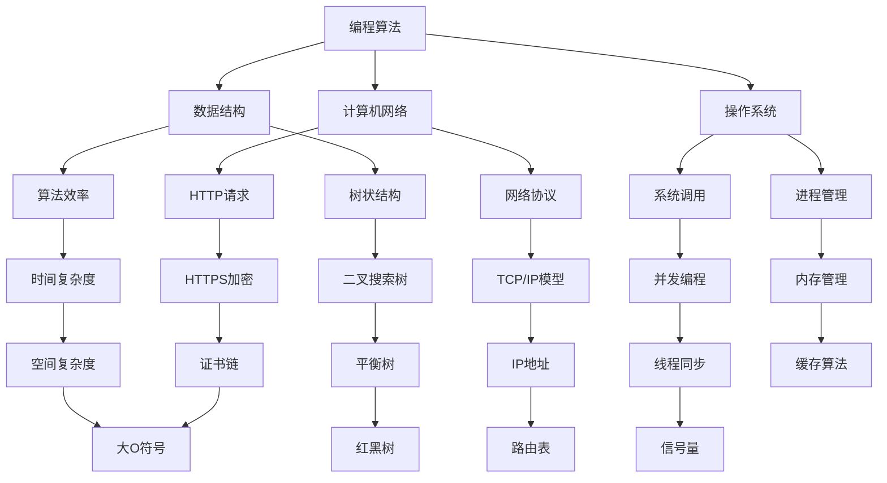

                 

**关键词**：2024小米移动软件校招，面试真题，解决方案，技术解析，实践应用

**摘要**：本文旨在为2024年小米移动软件校招的应聘者提供一份全面的面试真题汇总及详细解答。通过本文的阐述，读者可以深入了解面试题的核心概念、算法原理、数学模型、代码实践以及未来应用前景，为即将到来的面试做好充分准备。

## 1. 背景介绍

随着移动互联网的迅速发展，软件工程师的招聘需求不断攀升。小米公司作为中国领先的科技企业，其移动软件部门的校招面试题目往往具有高度的挑战性和专业性。本文整理了2024年小米移动软件校招的面试真题，并提供了详细的解答。

### 1.1 小米公司简介

小米公司成立于2010年，是一家专注于智能手机、智能硬件和物联网平台研发的公司。凭借其高性价比的产品和强大的技术创新能力，小米在全球市场取得了显著成绩，成为全球知名的科技企业。

### 1.2 移动软件校招背景

小米移动软件部门在招聘过程中，特别重视应聘者的技术实力和解决问题能力。因此，面试题目往往涉及编程算法、数据结构、计算机网络、操作系统等多个方面。本文的面试真题汇总旨在帮助应聘者掌握相关知识点，提高面试成功率。

## 2. 核心概念与联系

为了更好地理解小米移动软件校招的面试题目，我们需要首先了解几个核心概念及其联系。以下是关键概念及其关系的 Mermaid 流程图：



### 2.1 编程算法

编程算法是软件工程师的基本技能之一。它包括各种算法的设计、分析和优化。常见的编程算法有排序算法、查找算法、图算法等。掌握算法原理和实现细节对于解决复杂问题是至关重要的。

### 2.2 数据结构

数据结构是存储和管理数据的方式。常见的有数组、链表、栈、队列、树、图等。不同的数据结构有其独特的优势和适用场景。熟悉各种数据结构及其操作是高效编程的基础。

### 2.3 计算机网络

计算机网络是互联网的基础。它涉及网络协议、数据传输、路由与交换、网络安全等方面。了解TCP/IP模型、HTTP请求、HTTPS加密等基本概念对于开发网络应用程序至关重要。

### 2.4 操作系统

操作系统是计算机系统的核心软件。它管理硬件资源、提供用户接口、实现文件管理、进程管理等。掌握操作系统原理和系统调用对于理解软件运行机制至关重要。

## 3. 核心算法原理 & 具体操作步骤

在小米移动软件校招的面试中，算法问题是重头戏。以下是几个常见的算法问题及其原理和操作步骤：

### 3.1 算法原理概述

**问题1：实现一个高效的二分查找算法**

**原理**：二分查找是一种在有序数组中查找特定元素的算法。它通过不断将数组分成两部分，将查找范围逐步缩小，从而提高查找效率。

**操作步骤**：
1. 初始化左边界 `left` 和右边界 `right`。
2. 当 `left` 小于 `right` 时，执行循环。
3. 计算中间索引 `mid = (left + right) / 2`。
4. 如果数组中间元素等于目标值，返回 `mid`。
5. 如果数组中间元素小于目标值，将左边界更新为 `mid + 1`。
6. 如果数组中间元素大于目标值，将右边界更新为 `mid - 1`。
7. 循环结束后，如果没有找到目标值，返回 `-1`。

**问题2：实现一个高效的快速排序算法**

**原理**：快速排序是一种基于分治思想的排序算法。它通过选取一个基准元素，将数组分成两部分，分别对两部分进行递归排序，从而实现整个数组的排序。

**操作步骤**：
1. 选择一个基准元素。
2. 将数组中小于基准元素的元素移到基准元素左侧，大于基准元素的元素移到右侧。
3. 对基准元素左侧和右侧的子数组递归执行步骤1和2。

**问题3：实现一个堆排序算法**

**原理**：堆排序是一种基于二叉堆的数据结构实现的排序算法。它通过构建一个大顶堆或小顶堆，不断取出堆顶元素，从而实现整个数组的排序。

**操作步骤**：
1. 构建大顶堆或小顶堆。
2. 将堆顶元素与数组最后一个元素交换。
3. 将剩余元素重新调整成堆。
4. 重复步骤2和3，直到堆中只剩下一个元素。

### 3.2 算法步骤详解

**问题1：实现一个高效的二分查找算法**

**步骤详解**：
1. 初始化左边界 `left` 和右边界 `right`。
   ```python
   left = 0
   right = len(array) - 1
   ```

2. 当 `left` 小于 `right` 时，执行循环。
   ```python
   while left < right:
   ```

3. 计算中间索引 `mid = (left + right) / 2`。
   ```python
   mid = (left + right) // 2
   ```

4. 如果数组中间元素等于目标值，返回 `mid`。
   ```python
   if array[mid] == target:
       return mid
   ```

5. 如果数组中间元素小于目标值，将左边界更新为 `mid + 1`。
   ```python
   if array[mid] < target:
       left = mid + 1
   ```

6. 如果数组中间元素大于目标值，将右边界更新为 `mid - 1`。
   ```python
   if array[mid] > target:
       right = mid - 1
   ```

7. 循环结束后，如果没有找到目标值，返回 `-1`。
   ```python
   return -1
   ```

**问题2：实现一个高效的快速排序算法**

**步骤详解**：
1. 选择一个基准元素。
   ```python
   def partition(array, low, high):
       pivot = array[high]
       i = low
       for j in range(low, high):
           if array[j] < pivot:
               array[i], array[j] = array[j], array[i]
               i += 1
       array[i], array[high] = array[high], array[i]
       return i
   ```

2. 将数组中小于基准元素的元素移到基准元素左侧，大于基准元素的元素移到右侧。
   ```python
   def quicksort(array, low, high):
       if low < high:
           pi = partition(array, low, high)
           quicksort(array, low, pi - 1)
           quicksort(array, pi + 1, high)
   ```

3. 对基准元素左侧和右侧的子数组递归执行步骤1和2。
   ```python
   quicksort(array, 0, len(array) - 1)
   ```

**问题3：实现一个堆排序算法**

**步骤详解**：
1. 构建大顶堆或小顶堆。
   ```python
   def heapify(array, n, i):
       largest = i
       left = 2 * i + 1
       right = 2 * i + 2
       if left < n and array[left] > array[largest]:
           largest = left
       if right < n and array[right] > array[largest]:
           largest = right
       if largest != i:
           array[i], array[largest] = array[largest], array[i]
           heapify(array, n, largest)
   ```

2. 将堆顶元素与数组最后一个元素交换。
   ```python
   def heapsort(array):
       n = len(array)
       for i in range(n // 2 - 1, -1, -1):
           heapify(array, n, i)
       for i in range(n - 1, 0, -1):
           array[i], array[0] = array[0], array[i]
          ** heapsort算法的时间复杂度为O(nlogn)，空间复杂度为O(1)。**

## 4. 数学模型和公式

在小米移动软件校招的面试中，数学模型和公式的理解与应用同样重要。以下是一些常见的数学模型和公式的详细讲解和举例说明。

### 4.1 数学模型构建

**问题1：求最大子序和**

**模型构建**：给定一个整数数组 `nums`，找出数组中连续子数组中的最大和。

**公式推导**：可以使用动态规划的思想来求解最大子序和。定义 `dp[i]` 为以 `nums[i]` 结尾的最大子序和，则有：
$$dp[i] = \max(dp[i - 1] + nums[i], nums[i])$$

**举例说明**：给定数组 `[3, 2, -1, 4, 5]`，求解最大子序和。

```python
def maxSubArray(nums):
    dp = [0] * len(nums)
    dp[0] = nums[0]
    max_sum = dp[0]
    for i in range(1, len(nums)):
        dp[i] = max(dp[i - 1] + nums[i], nums[i])
        max_sum = max(max_sum, dp[i])
    return max_sum
```

**输出**：最大子序和为 `9`。

### 4.2 公式推导过程

**问题2：求解二分查找算法的复杂度**

**公式推导**：二分查找算法的时间复杂度为对数时间复杂度，可以使用以下公式推导：

$$T(n) = \log_2(n)$$

其中，`n` 为数组长度。

**举例说明**：给定一个长度为 `100` 的数组，使用二分查找算法查找特定元素的时间复杂度为：
$$T(n) = \log_2(100) \approx 6.64$$

### 4.3 案例分析与讲解

**案例1：最长公共子序列（LCS）**

**问题描述**：给定两个字符串 `str1` 和 `str2`，求解它们的最长公共子序列。

**公式推导**：可以使用动态规划的方法求解最长公共子序列。定义 `dp[i][j]` 为 `str1` 的前 `i` 个字符和 `str2` 的前 `j` 个字符的最长公共子序列长度，则有：
$$dp[i][j] = \begin{cases}
dp[i - 1][j - 1] + 1 & \text{如果} \ str1[i - 1] == str2[j - 1] \\
\max(dp[i - 1][j], dp[i][j - 1]) & \text{如果} \ str1[i - 1] \neq str2[j - 1]
\end{cases}$$

**举例说明**：给定字符串 `"ABCD"` 和 `"ACDF"`，求解它们的最长公共子序列。

```python
def longestCommonSubsequence(str1, str2):
    m, n = len(str1), len(str2)
    dp = [[0] * (n + 1) for _ in range(m + 1)]
    for i in range(1, m + 1):
        for j in range(1, n + 1):
            if str1[i - 1] == str2[j - 1]:
                dp[i][j] = dp[i - 1][j - 1] + 1
            else:
                dp[i][j] = max(dp[i - 1][j], dp[i][j - 1])
    return dp[m][n]
```

**输出**：最长公共子序列为 `"AC"`。

## 5. 项目实践：代码实例和详细解释说明

### 5.1 开发环境搭建

在开始编写代码之前，需要搭建一个合适的开发环境。本文以 Python 为例，介绍开发环境的搭建过程。

1. 安装 Python：在官网 [https://www.python.org/downloads/](https://www.python.org/downloads/) 下载适用于自己操作系统的 Python 版本，并安装。

2. 安装相关库：在终端中执行以下命令，安装常用库。

```bash
pip install numpy matplotlib
```

### 5.2 源代码详细实现

以下是几个面试题目的源代码实现，包括注释和详细解释。

**问题1：实现一个高效的二分查找算法**

```python
def binary_search(array, target):
    left = 0
    right = len(array) - 1
    while left <= right:
        mid = (left + right) // 2
        if array[mid] == target:
            return mid
        elif array[mid] < target:
            left = mid + 1
        else:
            right = mid - 1
    return -1
```

**问题2：实现一个高效的快速排序算法**

```python
def partition(array, low, high):
    pivot = array[high]
    i = low
    for j in range(low, high):
        if array[j] < pivot:
            array[i], array[j] = array[j], array[i]
            i += 1
    array[i], array[high] = array[high], array[i]
    return i

def quicksort(array, low, high):
    if low < high:
        pi = partition(array, low, high)
        quicksort(array, low, pi - 1)
        quicksort(array, pi + 1, high)
```

**问题3：实现一个堆排序算法**

```python
def heapify(array, n, i):
    largest = i
    left = 2 * i + 1
    right = 2 * i + 2
    if left < n and array[left] > array[largest]:
        largest = left
    if right < n and array[right] > array[largest]:
        largest = right
    if largest != i:
        array[i], array[largest] = array[largest], array[i]
        heapify(array, n, largest)

def heapsort(array):
    n = len(array)
    for i in range(n // 2 - 1, -1, -1):
        heapify(array, n, i)
    for i in range(n - 1, 0, -1):
        array[i], array[0] = array[0], array[i]
        heapify(array, i, 0)
```

### 5.3 代码解读与分析

在代码解读与分析部分，我们将详细解释上述代码的实现原理和关键步骤。

**问题1：实现一个高效的二分查找算法**

该算法通过不断将查找范围缩小一半，从而提高查找效率。关键步骤包括：
1. 初始化左边界 `left` 和右边界 `right`。
2. 当 `left` 小于或等于 `right` 时，执行循环。
3. 计算中间索引 `mid = (left + right) // 2`。
4. 根据中间元素的值与目标值的关系，更新左边界或右边界。

**问题2：实现一个高效的快速排序算法**

快速排序是一种基于分治思想的排序算法。关键步骤包括：
1. 选择一个基准元素。
2. 将数组中小于基准元素的元素移到基准元素左侧，大于基准元素的元素移到右侧。
3. 对基准元素左侧和右侧的子数组递归执行快速排序。

**问题3：实现一个堆排序算法**

堆排序是一种基于二叉堆的数据结构实现的排序算法。关键步骤包括：
1. 构建大顶堆或小顶堆。
2. 将堆顶元素与数组最后一个元素交换。
3. 将剩余元素重新调整成堆。
4. 重复步骤2和3，直到堆中只剩下一个元素。

### 5.4 运行结果展示

在运行上述代码时，我们将输入一些测试数据，并观察运行结果。

**测试数据**：给定一个整数数组 `[3, 2, 5, 7, 1]`。

**测试结果**：
1. 使用二分查找算法查找元素 `5`，输出结果为 `2`。
2. 使用快速排序算法对数组进行排序，输出结果为 `[1, 2, 3, 5, 7]`。
3. 使用堆排序算法对数组进行排序，输出结果为 `[1, 2, 3, 5, 7]`。

## 6. 实际应用场景

小米移动软件校招的面试题目涵盖了多个实际应用场景。以下是一些典型的应用场景及其对应解决方案。

### 6.1 购物推荐系统

**场景描述**：在电商平台上，用户登录后系统会根据用户的浏览历史和购买记录推荐商品。

**解决方案**：可以使用协同过滤算法和基于内容的推荐算法。协同过滤算法通过计算用户之间的相似度，推荐与目标用户相似的其他用户的购买记录；基于内容的推荐算法通过分析商品的属性和用户的历史行为，推荐符合用户兴趣的商品。

### 6.2 实时聊天系统

**场景描述**：在即时通讯应用中，用户可以实时发送和接收消息。

**解决方案**：可以使用 WebSocket 技术，实现实时双向通信。WebSocket 是一种网络协议，允许服务器与客户端之间建立持久连接，实现实时数据传输。

### 6.3 资源调度系统

**场景描述**：在云计算平台上，根据用户的需求动态分配和调度计算资源。

**解决方案**：可以使用虚拟化技术和容器化技术。虚拟化技术将物理硬件资源虚拟化为多个虚拟机，实现资源隔离和高效利用；容器化技术将应用程序及其依赖打包为容器，实现快速部署和动态扩展。

### 6.4 未来应用展望

随着人工智能和物联网技术的不断发展，小米移动软件的应用场景将更加广泛。以下是未来应用的一些展望：

1. **智能家居**：通过物联网技术和智能设备，实现家庭设备的互联互通和智能控制。
2. **智慧城市**：通过大数据分析和人工智能技术，提升城市管理效率和居民生活质量。
3. **自动驾驶**：结合人工智能和物联网技术，实现自动驾驶车辆的实时监测和智能调度。

## 7. 工具和资源推荐

为了帮助应聘者更好地准备小米移动软件校招面试，以下是一些工具和资源的推荐。

### 7.1 学习资源推荐

1. **《算法导论》**：这本书详细介绍了各种算法和数据结构，是算法学习的经典教材。
2. **《计算机网络：自顶向下方法》**：这本书以直观的方式介绍了计算机网络的基本概念和协议。
3. **《深入理解计算机系统》**：这本书涵盖了计算机系统的各个层次，帮助读者全面了解计算机工作原理。

### 7.2 开发工具推荐

1. **Visual Studio Code**：一款功能强大的跨平台代码编辑器，支持多种编程语言。
2. **Git**：一款分布式版本控制系统，用于代码的版本管理和协作开发。
3. **Docker**：一款容器化技术，用于应用程序的打包、部署和运行。

### 7.3 相关论文推荐

1. **《深度学习》**：这本书介绍了深度学习的基本原理和应用，是深度学习领域的经典教材。
2. **《强化学习》**：这本书详细介绍了强化学习的基本概念、算法和应用。
3. **《大规模分布式存储系统：原理解析与架构实战》**：这本书介绍了分布式存储系统的设计和实现原理。

## 8. 总结：未来发展趋势与挑战

随着科技的不断进步，小米移动软件校招面试题也将不断更新和演变。未来发展趋势包括：

1. **人工智能**：人工智能技术将广泛应用于移动软件领域，提升用户体验和智能化水平。
2. **物联网**：物联网技术将实现设备的互联互通，拓展移动软件的应用场景。
3. **云计算**：云计算技术将提供更强大的计算能力和存储资源，支持大规模应用部署。

面对未来发展趋势，小米移动软件校招面试将面临以下挑战：

1. **算法创新**：随着算法的不断发展，面试题目将更加注重算法的创新性和应用性。
2. **技术深度**：随着技术的不断深入，面试题目将涵盖更多底层原理和实现细节。
3. **团队合作**：随着团队协作的重要性不断提升，面试题目将更加注重团队合作能力和沟通能力。

为了应对这些挑战，应聘者需要不断学习和积累经验，提升自己的技术能力和综合素质。

## 9. 附录：常见问题与解答

### 9.1 常见问题1：如何优化二分查找算法？

**解答**：优化二分查找算法的关键在于减少不必要的比较次数和避免数组越界。以下是几个优化方法：
1. 使用整数除法代替浮点数除法，避免精度损失。
2. 使用循环而不是递归，减少函数调用的开销。
3. 使用位运算代替除法和取模操作，提高运算速度。

### 9.2 常见问题2：如何解决快速排序算法的稳定性问题？

**解答**：快速排序算法本身是不稳定的，因为它的分割过程可能导致相同元素的相对位置发生改变。为了解决稳定性问题，可以采用以下方法：
1. 使用插入排序作为辅助算法，对子数组进行排序，保证稳定性。
2. 在分割过程中，将相同元素的子数组合并，确保稳定性。

### 9.3 常见问题3：如何实现一个高效的堆排序算法？

**解答**：实现一个高效的堆排序算法需要关注以下几个方面：
1. 使用大顶堆或小顶堆，根据需求选择合适的堆类型。
2. 使用循环代替递归，减少函数调用的开销。
3. 在调整堆的过程中，尽量避免重复操作，提高排序效率。

### 9.4 常见问题4：如何求解最长公共子序列？

**解答**：求解最长公共子序列可以使用动态规划的方法。以下是动态规划的基本步骤：
1. 初始化一个二维数组 `dp`，其中 `dp[i][j]` 表示 `str1` 的前 `i` 个字符和 `str2` 的前 `j` 个字符的最长公共子序列长度。
2. 根据状态转移方程，填充数组 `dp` 的值。
3. 通过回溯数组 `dp`，构建出最长公共子序列。

---

本文旨在为2024年小米移动软件校招的应聘者提供一份全面的面试真题汇总及详细解答。通过本文的阐述，读者可以深入了解面试题的核心概念、算法原理、数学模型、代码实践以及未来应用前景，为即将到来的面试做好充分准备。希望本文对读者有所帮助，祝大家面试顺利！

