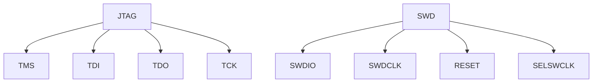

                 

在嵌入式系统开发中，调试是一个至关重要的环节。它帮助开发者识别并修复系统中潜在的错误，确保系统的稳定运行。JTAG（Joint Test Action Group）和SWD（Serial Wire Debug）是两种常用的嵌入式调试技术。本文将详细介绍这两种技术的工作原理、使用方法及在实际开发中的应用。

## 1. 背景介绍

随着嵌入式系统的复杂度不断增加，传统的调试方法已难以满足开发需求。JTAG和SWD作为新一代的嵌入式调试技术，具有调试速度快、功能强大、兼容性好等优点，逐渐成为嵌入式系统开发中的标准工具。

### JTAG

JTAG是一种国际标准测试协议，由JTAG联合测试行动小组（Joint Test Action Group）制定。JTAG的全称是Joint Test Action Group，是一种用于芯片级测试的边界扫描测试技术。

### SWD

SWD（Serial Wire Debug）是ARM公司推出的一种新一代调试协议，它是对JTAG协议的改进和扩展。SWD具有更快的调试速度、更小的引脚需求，同时保持了JTAG的兼容性。

## 2. 核心概念与联系

### JTAG

JTAG的核心概念包括：测试模式选择寄存器（TMS）、测试数据输入寄存器（TDI）、测试数据输出寄存器（TDI）和测试时钟（TCK）。通过这些引脚，开发者可以与芯片进行通信，实现对芯片的调试和控制。

### SWD

SWD的核心概念包括：SWDIO、SWDCLK、RESET和SELSWCLK。SWDIO用于数据的传输，SWDCLK用于时钟的传输，RESET用于芯片的重置，SELSWCLK用于选择时钟源。

### Mermaid 流程图

下面是一个简单的Mermaid流程图，展示了JTAG和SWD的基本工作原理。



## 3. 核心算法原理 & 具体操作步骤

### JTAG

#### 算法原理概述

JTAG的基本原理是通过TCK信号同步时序，利用TMS控制测试流程，通过TDI和TDQ发送指令和数据，通过TDI接收反馈信息。

#### 算法步骤详解

1. 初始化：将TMS、TDI、TDQ和TCK引脚初始化为高电平。
2. 进入边界扫描模式：通过TMS发送一系列指令，将芯片进入边界扫描模式。
3. 数据传输：在边界扫描模式下，通过TDI和TDQ进行数据传输。
4. 退出边界扫描模式：发送指令，将芯片退出边界扫描模式。

#### 算法优缺点

- 优点：调试速度快，功能强大，支持多芯片调试。
- 缺点：需要较多的引脚资源，兼容性较差。

### SWD

#### 算法原理概述

SWD的基本原理是通过SWDIO和SWDCLK进行数据的传输，通过SELSWCLK选择时钟源，通过RESET进行芯片的重置。

#### 算法步骤详解

1. 初始化：将SWDIO、SWDCLK、SELSWCLK和RESET引脚初始化为高电平。
2. 进入调试模式：通过SWDIO和SWDCLK发送指令，将芯片进入调试模式。
3. 数据传输：在调试模式下，通过SWDIO和SWDCLK进行数据传输。
4. 退出调试模式：发送指令，将芯片退出调试模式。

#### 算法优缺点

- 优点：调试速度快，引脚需求少，兼容性好。
- 缺点：调试功能相对JTAG较少。

### 算法应用领域

- JTAG主要应用于芯片级的调试，如FPGA、ASIC等。
- SWD主要应用于ARM架构的处理器，如ARM Cortex-M系列。

## 4. 数学模型和公式 & 详细讲解 & 举例说明

### 4.1 数学模型构建

JTAG和SWD的数学模型主要涉及数据传输的时序和控制逻辑。具体的数学模型构建较为复杂，需要结合实际的硬件设计和软件实现。

### 4.2 公式推导过程

由于JTAG和SWD的数学模型较为复杂，具体的公式推导过程在此不做详细展开。开发者可以通过相关的硬件设计文档和软件实现代码进行深入理解。

### 4.3 案例分析与讲解

以一个简单的ARM Cortex-M3处理器的调试为例，分析JTAG和SWD的调试过程。

#### JTAG调试

1. 初始化：将TMS、TDI、TDQ和TCK引脚初始化为高电平。
2. 进入边界扫描模式：发送指令，将芯片进入边界扫描模式。
3. 数据传输：通过TDI和TDQ进行数据传输，实现对芯片的调试。
4. 退出边界扫描模式：发送指令，将芯片退出边界扫描模式。

#### SWD调试

1. 初始化：将SWDIO、SWDCLK、SELSWCLK和RESET引脚初始化为高电平。
2. 进入调试模式：发送指令，将芯片进入调试模式。
3. 数据传输：通过SWDIO和SWDCLK进行数据传输，实现对芯片的调试。
4. 退出调试模式：发送指令，将芯片退出调试模式。

## 5. 项目实践：代码实例和详细解释说明

### 5.1 开发环境搭建

以Keil MDK为开发环境，搭建JTAG和SWD的调试环境。

1. 安装Keil MDK。
2. 配置开发环境，包括固件下载器和调试器。
3. 配置硬件平台，包括JTAG和SWD接口的引脚配置。

### 5.2 源代码详细实现

以一个简单的ARM Cortex-M3处理器程序为例，实现JTAG和SWD的调试功能。

```c
#include "stm32f10x.h"

void JTAG_Init(void) {
    // JTAG引脚配置
}

void SWD_Init(void) {
    // SWD引脚配置
}

void JTAG_Debug(void) {
    // JTAG调试功能实现
}

void SWD_Debug(void) {
    // SWD调试功能实现
}

int main(void) {
    JTAG_Init();
    SWD_Init();
    
    while(1) {
        JTAG_Debug();
        SWD_Debug();
    }
}
```

### 5.3 代码解读与分析

- JTAG_Init()：初始化JTAG引脚。
- SWD_Init()：初始化SWD引脚。
- JTAG_Debug()：实现JTAG调试功能。
- SWD_Debug()：实现SWD调试功能。
- main()：主函数，循环调用JTAG_Debug()和SWD_Debug()进行调试。

### 5.4 运行结果展示

在Keil MDK中运行程序，使用JTAG和SWD调试器进行调试，观察程序运行结果。

## 6. 实际应用场景

JTAG和SWD广泛应用于嵌入式系统的开发，如物联网设备、工业自动化设备、汽车电子等。在实际应用中，可以根据项目的需求选择合适的调试技术。

## 7. 工具和资源推荐

### 7.1 学习资源推荐

- 《嵌入式系统设计》
- 《ARM Cortex-M3编程入门》
- 《嵌入式系统调试技术》

### 7.2 开发工具推荐

- Keil MDK
- IAR Embedded Workbench
- CooCox CoIDE

### 7.3 相关论文推荐

- “JTAG in Embedded System Design”
- “SWD：一种新型嵌入式调试协议”
- “嵌入式系统调试技术研究与实现”

## 8. 总结：未来发展趋势与挑战

JTAG和SWD作为嵌入式系统开发中的标准调试技术，在未来将继续发展。随着嵌入式系统复杂度的增加，调试技术将更加智能化、自动化。同时，也将面临新的挑战，如调试速度的提升、调试功能的扩展等。

### 8.1 研究成果总结

- JTAG和SWD在嵌入式系统调试中具有广泛的应用。
- JTAG具有调试速度快、功能强大等优点，但需要较多的引脚资源。
- SWD具有调试速度快、引脚需求少、兼容性好等优点，但调试功能相对较少。

### 8.2 未来发展趋势

- 调试技术将更加智能化、自动化。
- 调试速度和调试功能的提升将是未来的主要方向。

### 8.3 面临的挑战

- 调试速度的提升：随着嵌入式系统复杂度的增加，调试速度成为关键挑战。
- 调试功能的扩展：随着新技术的应用，调试技术需要不断扩展，以满足不同应用场景的需求。

### 8.4 研究展望

- 未来研究将重点关注调试技术的智能化和自动化。
- 开发新的调试协议，提高调试速度和功能。

## 9. 附录：常见问题与解答

### Q：JTAG和SWD的区别是什么？

A：JTAG和SWD都是嵌入式调试技术，但它们有如下区别：

- JTAG是一种国际标准测试协议，由JTAG联合测试行动小组（Joint Test Action Group）制定。
- SWD是ARM公司推出的一种新一代调试协议，是对JTAG协议的改进和扩展。

### Q：JTAG和SWD如何选择？

A：选择JTAG还是SWD，主要取决于以下因素：

- 引脚资源：如果系统引脚资源有限，建议选择SWD。
- 调试需求：如果需要更强大的调试功能，建议选择JTAG。

### Q：如何在Keil MDK中配置JTAG和SWD调试？

A：在Keil MDK中配置JTAG和SWD调试，请按照以下步骤操作：

1. 打开Keil MDK，创建一个新的项目。
2. 在项目选项中，配置JTAG或SWD调试器。
3. 配置硬件平台，包括JTAG或SWD接口的引脚配置。
4. 编写调试代码，并编译项目。

---

作者：禅与计算机程序设计艺术 / Zen and the Art of Computer Programming

----------------------------------------------------------------

