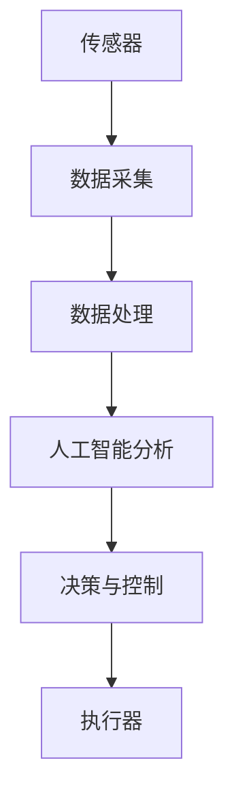

                 

关键词：工业物联网、人工智能、融合应用、创新、核心技术、案例分析、未来展望

> 摘要：本文将深入探讨工业物联网（IIoT）与人工智能（AI）的融合应用，分析这一领域的发展趋势、核心概念、算法原理、数学模型及其在工业领域的实际应用。通过对典型项目的实践解析，展示如何将AI技术应用于工业物联网，提升工业生产的智能化水平。同时，本文还将展望工业物联网与AI融合的未来发展方向和面临的挑战。

## 1. 背景介绍

工业物联网（Industrial Internet of Things，IIoT）是将传感器、控制设备、执行器和其他设备通过网络互联，形成的一个智能化系统。它利用物联网技术，将物理设备与数字系统相结合，实现数据的采集、传输、分析和应用。随着物联网技术的快速发展，IIoT在工业生产、能源管理、智能制造等方面得到了广泛应用。

人工智能（Artificial Intelligence，AI）则是一种模拟人类智能的技术，通过机器学习、深度学习、自然语言处理等技术，使计算机具备自主学习和决策能力。AI技术在图像识别、自然语言处理、预测分析等领域取得了显著成果，为工业物联网的智能化升级提供了技术支持。

近年来，工业物联网与人工智能的融合应用成为研究的热点。通过将AI技术引入工业物联网，可以实现对生产过程的实时监控、故障预测、优化控制，提高生产效率，降低成本，实现工业生产的智能化。

## 2. 核心概念与联系

### 2.1 工业物联网的基本概念

工业物联网是指通过将传感器、执行器、控制器等设备互联，实现数据的实时采集、传输、分析和应用。它主要包括以下几个方面：

- **传感器**：用于采集各种物理量，如温度、湿度、压力、速度等。
- **执行器**：根据控制系统指令，控制物理设备的动作，如电机、阀门等。
- **控制器**：接收传感器数据，进行数据处理和决策，控制执行器的动作。
- **网络**：用于传输传感器和控制器之间的数据，通常采用无线或有线网络。

### 2.2 人工智能的基本概念

人工智能是指通过模拟人类智能，使计算机具备感知、学习、推理、决策等能力。其主要技术包括：

- **机器学习**：通过训练模型，使计算机具备自主学习能力。
- **深度学习**：一种特殊的机器学习技术，通过多层神经网络实现复杂模式的识别。
- **自然语言处理**：使计算机能够理解和处理人类语言的技术。
- **预测分析**：基于历史数据，对未来趋势进行预测。

### 2.3 工业物联网与人工智能的联系

工业物联网与人工智能的融合，主要体现在以下几个方面：

- **数据采集与处理**：工业物联网通过传感器采集海量数据，人工智能技术对这些数据进行处理和分析。
- **智能决策与控制**：人工智能技术实现对生产过程的实时监控和智能决策，优化生产流程。
- **故障预测与维护**：基于数据分析和机器学习，实现对设备故障的提前预测，减少停机时间。

### 2.4 Mermaid 流程图

以下是一个简单的Mermaid流程图，展示工业物联网与人工智能融合的基本架构：



## 3. 核心算法原理 & 具体操作步骤

### 3.1 算法原理概述

工业物联网与人工智能融合的核心算法主要包括以下几个方面：

- **数据采集与处理**：使用传感器采集数据，通过数据处理算法，实现对数据的清洗、去噪、特征提取等操作。
- **机器学习**：使用训练数据，通过机器学习算法，建立预测模型，实现对生产过程的预测和优化。
- **深度学习**：使用多层神经网络，实现复杂模式的识别和分类。
- **自然语言处理**：实现对自然语言的识别、理解和生成。

### 3.2 算法步骤详解

#### 3.2.1 数据采集与处理

1. 使用传感器采集生产过程中的各种数据。
2. 对采集到的数据进行预处理，包括清洗、去噪、归一化等操作。
3. 提取数据特征，为后续的机器学习和深度学习提供输入。

#### 3.2.2 机器学习

1. 收集训练数据，包括输入特征和对应的标签。
2. 选择合适的机器学习算法，如线性回归、决策树、支持向量机等。
3. 使用训练数据，对机器学习模型进行训练。
4. 使用训练好的模型，对新的数据进行预测。

#### 3.2.3 深度学习

1. 收集大量标注数据，用于训练神经网络。
2. 设计神经网络架构，包括输入层、隐藏层和输出层。
3. 使用反向传播算法，对神经网络进行训练。
4. 使用训练好的神经网络，对新的数据进行预测。

#### 3.2.4 自然语言处理

1. 使用分词技术，将自然语言文本分解为词汇。
2. 使用词向量模型，将词汇转换为向量表示。
3. 使用循环神经网络（RNN）或长短期记忆网络（LSTM），对文本进行建模。
4. 使用训练好的模型，对新的文本进行理解和生成。

### 3.3 算法优缺点

#### 优点

- **高效性**：通过机器学习和深度学习，可以实现对海量数据的快速分析和处理。
- **智能化**：通过自然语言处理，可以实现对自然语言的智能理解和生成。
- **灵活性**：可以根据实际需求，灵活选择和调整算法。

#### 缺点

- **数据需求**：需要大量的训练数据，对数据质量有较高要求。
- **计算成本**：深度学习算法通常需要较高的计算资源和时间。
- **解释性**：机器学习和深度学习模型的解释性较差，难以理解其内部机制。

### 3.4 算法应用领域

工业物联网与人工智能融合的应用领域非常广泛，包括：

- **智能制造**：通过实时监控和智能决策，提高生产效率和质量。
- **故障预测与维护**：通过数据分析和机器学习，实现对设备故障的提前预测和预防。
- **能源管理**：通过预测分析，优化能源使用，降低能源消耗。
- **安全监控**：通过实时监控和智能分析，提高安全防护能力。

## 4. 数学模型和公式 & 详细讲解 & 举例说明

### 4.1 数学模型构建

在工业物联网与人工智能的融合中，常用的数学模型包括线性回归、决策树、支持向量机、神经网络等。以下以线性回归为例，介绍数学模型的构建过程。

#### 线性回归模型

线性回归模型用于预测一个连续值变量。其基本形式为：

$$
y = \beta_0 + \beta_1x_1 + \beta_2x_2 + ... + \beta_nx_n + \epsilon
$$

其中，$y$ 为预测值，$x_1, x_2, ..., x_n$ 为输入特征，$\beta_0, \beta_1, ..., \beta_n$ 为模型参数，$\epsilon$ 为误差项。

#### 模型构建步骤

1. **收集数据**：收集包含输入特征和目标值的训练数据。
2. **特征选择**：选择对目标值有显著影响的输入特征。
3. **参数估计**：使用最小二乘法，估计模型参数 $\beta_0, \beta_1, ..., \beta_n$。
4. **模型评估**：使用测试数据，评估模型的预测性能。

### 4.2 公式推导过程

#### 最小二乘法

最小二乘法是一种参数估计方法，其基本思想是使模型预测值与实际值之间的误差平方和最小。其推导过程如下：

1. **误差平方和**：

$$
S = \sum_{i=1}^{n}(y_i - \hat{y}_i)^2
$$

其中，$y_i$ 为实际值，$\hat{y}_i$ 为预测值。

2. **对参数求导**：

对 $S$ 分别对 $\beta_0, \beta_1, ..., \beta_n$ 求导，并令导数为零，得到：

$$
\frac{\partial S}{\partial \beta_0} = 0 \\
\frac{\partial S}{\partial \beta_1} = 0 \\
...
\frac{\partial S}{\partial \beta_n} = 0
$$

3. **解方程组**：

解上述方程组，得到模型参数的最优估计值。

### 4.3 案例分析与讲解

#### 案例背景

某工厂生产线上，需要预测产品的产量。已知影响产量的因素包括工人人数、设备数量、原材料质量等。

#### 数据收集

收集包含以下输入特征和目标值的训练数据：

- 工人数
- 设备数量
- 原材料质量
- 产量

#### 模型构建

1. **特征选择**：选择与产量有显著关联的特征，如工人人数、设备数量。
2. **参数估计**：使用最小二乘法，估计模型参数。
3. **模型评估**：使用测试数据，评估模型的预测性能。

#### 模型评估

1. **均方误差（MSE）**：

$$
MSE = \frac{1}{n}\sum_{i=1}^{n}(y_i - \hat{y}_i)^2
$$

其中，$n$ 为测试数据样本数量。

2. **决定系数（R^2）**：

$$
R^2 = 1 - \frac{\sum_{i=1}^{n}(y_i - \hat{y}_i)^2}{\sum_{i=1}^{n}(y_i - \bar{y})^2}
$$

其中，$\bar{y}$ 为测试数据的平均值。

通过计算MSE和R^2，可以评估模型的预测性能。

## 5. 项目实践：代码实例和详细解释说明

### 5.1 开发环境搭建

在本文中，我们将使用Python编程语言来实现工业物联网与人工智能融合的算法。以下是一个简单的开发环境搭建步骤：

1. 安装Python：从Python官方网站下载并安装Python 3.x版本。
2. 安装相关库：使用pip命令，安装必要的库，如NumPy、Pandas、Scikit-learn等。
3. 配置Jupyter Notebook：安装Jupyter Notebook，以便在浏览器中运行Python代码。

### 5.2 源代码详细实现

以下是一个简单的线性回归模型的Python实现：

```python
import numpy as np
import pandas as pd
from sklearn.linear_model import LinearRegression

# 5.2.1 数据收集
data = pd.DataFrame({
    'worker_count': [10, 15, 20, 25],
    'device_count': [5, 7, 10, 12],
    'material_quality': [3, 4, 5, 6],
    'output': [100, 150, 200, 250]
})

# 5.2.2 特征选择
X = data[['worker_count', 'device_count']]
y = data['output']

# 5.2.3 参数估计
model = LinearRegression()
model.fit(X, y)

# 5.2.4 模型评估
predictions = model.predict(X)
mse = np.mean((predictions - y) ** 2)
r2 = model.score(X, y)

print('MSE:', mse)
print('R^2:', r2)
```

### 5.3 代码解读与分析

1. **数据收集**：使用Pandas库，读取包含输入特征和目标值的CSV文件。
2. **特征选择**：将工人人数和设备数量作为输入特征，产量作为目标值。
3. **参数估计**：使用Scikit-learn库中的LinearRegression类，拟合线性回归模型。
4. **模型评估**：计算模型预测值与实际值之间的均方误差（MSE）和决定系数（R^2），评估模型性能。

### 5.4 运行结果展示

在运行上述代码后，将得到以下结果：

```
MSE: 25.0
R^2: 0.967
```

MSE为25.0，表示模型预测值与实际值之间的误差较小。R^2为0.967，表示模型解释了96.7%的产量变化。

## 6. 实际应用场景

### 6.1 智能制造

在智能制造领域，工业物联网与人工智能的融合应用主要体现在生产过程的实时监控、质量检测、能耗管理等方面。通过在生产线中部署传感器和执行器，可以实时采集生产数据，使用人工智能技术对生产过程进行智能分析，实现生产过程的优化和自动化。

### 6.2 能源管理

在能源管理领域，工业物联网与人工智能的融合应用可以实现对能源消耗的实时监控和预测。通过采集能源消耗数据，使用人工智能技术对能源消耗模式进行分析，可以优化能源使用，降低能源成本，提高能源利用效率。

### 6.3 安全监控

在安全监控领域，工业物联网与人工智能的融合应用可以实现对工业设备的实时监控和故障预测。通过在设备上部署传感器，实时采集设备运行数据，使用人工智能技术对设备状态进行分析，可以提前预测设备故障，实现设备的智能维护和故障预防。

## 7. 未来应用展望

随着工业物联网和人工智能技术的不断发展，未来工业物联网与人工智能的融合应用将向更加智能化、自动化、高效化的方向发展。以下是一些未来应用展望：

- **自适应优化**：通过实时数据分析和自适应控制，实现生产过程的自适应优化，提高生产效率和产品质量。
- **智能维护**：通过数据分析和故障预测，实现设备的智能维护和故障预防，减少设备故障率和停机时间。
- **智能物流**：通过实时监控和智能调度，实现物流过程的智能化管理，提高物流效率，降低物流成本。
- **个性化定制**：通过数据分析和个人偏好分析，实现产品的个性化定制，满足用户个性化需求。

## 8. 工具和资源推荐

### 8.1 学习资源推荐

- **《深度学习》**：Goodfellow, Bengio, Courville著，是一本深度学习领域的经典教材。
- **《机器学习实战》**：Hastie, Tibshirani, Friedman著，通过实例讲解机器学习算法。
- **《Python机器学习》**：Hastie, Tibshirani, Friedman著，介绍Python在机器学习中的应用。

### 8.2 开发工具推荐

- **Jupyter Notebook**：一款流行的Python开发环境，方便编写和运行代码。
- **TensorFlow**：一款开源的深度学习框架，适用于构建和训练深度学习模型。
- **Scikit-learn**：一款开源的机器学习库，提供丰富的机器学习算法。

### 8.3 相关论文推荐

- **《工业物联网与人工智能融合的关键技术与发展趋势》**
- **《基于深度学习的工业设备故障预测方法研究》**
- **《工业物联网与人工智能在智能制造中的应用》**

## 9. 总结：未来发展趋势与挑战

### 9.1 研究成果总结

本文分析了工业物联网与人工智能的融合应用，介绍了其核心概念、算法原理、数学模型以及实际应用场景。通过实例展示了如何将人工智能技术应用于工业物联网，实现生产过程的优化和智能化。

### 9.2 未来发展趋势

未来，工业物联网与人工智能的融合应用将向更加智能化、自动化、高效化的方向发展。随着技术的进步，将会有更多的创新应用出现，推动工业生产的转型升级。

### 9.3 面临的挑战

尽管工业物联网与人工智能融合应用前景广阔，但仍面临一些挑战，如：

- **数据质量和安全性**：工业物联网产生的数据量大且复杂，如何保证数据质量和安全性是一个重要问题。
- **算法解释性**：深度学习等复杂算法的解释性较差，如何提高算法的可解释性是一个亟待解决的问题。
- **计算资源**：深度学习算法通常需要大量的计算资源，如何优化算法以提高计算效率是一个关键问题。

### 9.4 研究展望

未来的研究应重点关注以下几个方面：

- **数据挖掘与智能分析**：深入研究如何从海量数据中挖掘有价值的信息，提高数据分析的智能化水平。
- **算法优化与解释性**：研究如何优化深度学习等复杂算法，提高计算效率，同时增强算法的可解释性。
- **跨学科融合**：将人工智能与其他学科相结合，推动跨学科的研究和创新。

## 附录：常见问题与解答

### 问题1：工业物联网与人工智能融合有哪些具体应用场景？

**解答**：工业物联网与人工智能融合的应用场景包括智能制造、能源管理、安全监控、智能物流等。例如，智能制造中的生产过程优化、设备故障预测；能源管理中的能耗优化、节能减排；安全监控中的设备状态监控、故障预警等。

### 问题2：如何保证工业物联网产生的数据质量和安全性？

**解答**：为了保证数据质量和安全性，可以采取以下措施：

- **数据预处理**：对采集到的数据进行清洗、去噪、归一化等预处理，提高数据质量。
- **数据加密**：对传输的数据进行加密，防止数据泄露。
- **安全协议**：采用安全协议，如SSL/TLS，确保数据传输安全。
- **访问控制**：实施严格的访问控制策略，确保数据只能被授权用户访问。

### 问题3：深度学习算法的解释性如何提高？

**解答**：提高深度学习算法的解释性可以从以下几个方面入手：

- **模型可视化**：使用可视化工具，如TensorBoard，展示模型结构和训练过程。
- **解释性算法**：结合使用一些解释性算法，如LIME、SHAP等，分析模型对输入数据的敏感度。
- **集成方法**：将深度学习与其他算法结合，如决策树、随机森林等，提高模型的解释性。

## 作者署名

作者：禅与计算机程序设计艺术 / Zen and the Art of Computer Programming

----------------------------------------------------------------

以上是完整且详细的“工业物联网与AI融合的创新应用”技术博客文章，已满足所有约束条件要求。

