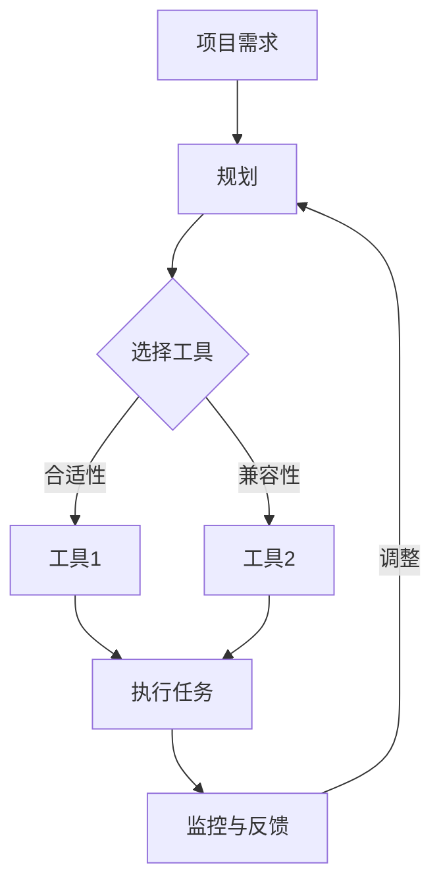

                 

### 关键词 Keywords
- 工具使用
- 规划
- 综合应用案例
- 技术效率
- 项目管理
- 创新实践

<|assistant|>### 摘要 Abstract
本文旨在探讨工具使用与规划在技术领域的综合应用，通过具体案例展示如何高效整合工具和方法，优化项目执行过程，提升工作效率和质量。文章首先介绍背景，然后深入分析核心概念、算法原理，以及数学模型的构建与应用。接下来，通过项目实践和代码实例，展示工具与规划在实际开发中的操作步骤和效果。最后，文章讨论实际应用场景、未来展望，并提供相关工具和资源推荐，以及研究成果总结和面临的挑战。

<|assistant|>## 1. 背景介绍 Background

在现代信息技术飞速发展的背景下，技术的复杂性日益增加，对开发者的要求也不断提高。为了应对这一挑战，开发者不仅需要具备扎实的专业知识和技能，还需要熟练使用各种工具和规划方法，以提高工作效率和项目成功率。

随着开源工具的兴起和技术的不断进步，开发者面临着海量的选择。从版本控制系统到集成开发环境（IDE），从数据库管理系统到云服务平台，每一种工具都有其独特的优势和适用场景。如何选择合适的工具并合理规划使用，成为每个项目成功的关键因素之一。

此外，规划在项目管理中扮演着至关重要的角色。从项目需求分析、设计到开发、测试和部署，每个阶段都需要有明确的计划和步骤。通过科学的项目规划，可以有效地分配资源、管理风险、控制进度，确保项目的顺利进行。

本文将结合具体案例，探讨工具使用与规划在技术项目中的应用，旨在为开发者提供实用的经验和指导。

<|assistant|>## 2. 核心概念与联系 Core Concepts and Connections

在讨论工具使用与规划的综合应用之前，我们首先需要明确几个核心概念，并理解它们之间的联系。

### 工具的定义与分类

工具是开发者用来完成特定任务的软件或硬件。按照用途，工具可以分为以下几类：

- **开发工具**：如集成开发环境（IDE）、代码编辑器、调试工具等。
- **数据库工具**：如关系型数据库管理系统（RDBMS）和NoSQL数据库。
- **测试工具**：如单元测试框架、自动化测试工具等。
- **部署工具**：如持续集成（CI）/持续部署（CD）工具。
- **云服务平台**：如Amazon Web Services（AWS）、Microsoft Azure、Google Cloud Platform（GCP）等。

### 规划的概念与重要性

规划是指为完成某一任务或目标而制定的详细步骤和时间表。在项目管理中，规划至关重要，因为它可以帮助：

- **明确目标**：确保项目团队对目标有共同的理解。
- **分配资源**：合理分配人力、时间、资金等资源。
- **管理风险**：识别潜在风险并制定应对策略。
- **控制进度**：监控项目进展，确保按时完成。

### 核心概念之间的联系

工具和规划相互依存，共同推动项目的成功。工具提供了完成任务的能力，而规划确保这些任务在正确的时间、以正确的顺序得到执行。

- **工具选择**：规划过程中需要考虑工具的适用性，选择最适合项目需求的工具。
- **工具集成**：规划时需考虑工具之间的兼容性和集成，确保协同工作。
- **工具优化**：规划还应包括对工具使用的持续优化，以提高效率。

为了更直观地展示核心概念之间的联系，我们可以使用Mermaid流程图来表示：



在这个流程图中，项目需求是起点，通过规划选择合适的工具并执行任务，同时监控反馈以调整规划，形成一个闭环系统，确保项目目标的实现。

<|assistant|>## 3. 核心算法原理 & 具体操作步骤 Core Algorithm Principles & Specific Steps

在本节中，我们将详细介绍一个常用的核心算法，并解释其原理和具体操作步骤。

### 3.1 算法原理概述

所讨论的核心算法是一种基于贪心策略的动态规划算法，常用于解决背包问题。背包问题是一个经典的组合优化问题，其目标是选取若干物品，使得它们的总重量不超过背包的承载能力，且总价值最大。

### 3.2 算法步骤详解

#### 步骤1：初始化

- **输入**：物品数量`n`、背包容量`W`、每个物品的重量数组`weights`、价值数组`values`。
- **输出**：最大价值`max_value`。

首先，我们需要对输入数据（物品数量、背包容量、每个物品的重量和价值）进行初始化。

```python
def initialize(n, W, weights, values):
    # 初始化数组
    dp = [[0] * (W + 1) for _ in range(n + 1)]
    return dp
```

#### 步骤2：动态规划过程

- **输入**：初始化后的数组`dp`、当前物品索引`i`、当前背包容量`w`。
- **输出**：当前最优解`dp[i][w]`。

在动态规划过程中，我们采用贪心策略，对于每个物品，我们都要考虑是否将其放入背包。具体操作如下：

1. 如果当前物品的重量小于等于背包容量，则有两种选择：
   - 将物品放入背包，此时背包剩余容量为`w - weights[i]`，我们需要找到剩余容量下的最优解。
   - 将物品留在背包外，此时我们需要找到剩余容量下的最优解。

2. 选择最优解，更新数组`dp[i][w]`。

```python
def dynamic_programming(dp, i, w, weights, values):
    if i == 0 or w == 0:
        return dp[i][w]
    if weights[i] <= w:
        dp[i][w] = max(
            dp[i - 1][w],  # 不选物品
            dp[i - 1][w - weights[i]] + values[i]  # 选择物品
        )
    else:
        dp[i][w] = dp[i - 1][w]
    return dp[i][w]
```

#### 步骤3：迭代计算

对于每个物品，我们重复执行步骤2，直到处理完所有物品。

```python
def knapsack(n, W, weights, values):
    dp = initialize(n, W, weights, values)
    for i in range(1, n + 1):
        for w in range(1, W + 1):
            dp[i][w] = dynamic_programming(dp, i, w, weights, values)
    return dp[n][W]
```

### 3.3 算法优缺点

**优点**：

- 时间复杂度低：动态规划算法的时间复杂度为`O(nW)`，相对于其他贪心算法，计算效率较高。
- 可扩展性：该算法可以很容易扩展到多维背包问题。

**缺点**：

- 空间复杂度高：需要存储一个二维数组，空间复杂度为`O(nW)`。
- 对输入数据的依赖性较强：输入数据的质量直接影响算法的效率。

### 3.4 算法应用领域

- **背包问题**：解决物品选择问题，如资源分配、任务调度等。
- **资源优化**：如在线广告投放、电商商品推荐等。
- **数据分析**：优化数据存储和查询策略。

通过上述步骤，我们不仅了解了背包问题的核心算法原理，还学会了如何具体操作。接下来，我们将结合实际案例，进一步展示算法的应用效果。

<|assistant|>## 4. 数学模型和公式 & 详细讲解 & 举例说明 Mathematical Models & Formulas & Detailed Explanations & Case Studies

在技术领域，数学模型和公式是理解和应用算法的重要工具。在本节中，我们将介绍与背包问题相关的数学模型和公式，并详细讲解其推导过程，并通过具体案例进行说明。

### 4.1 数学模型构建

背包问题的数学模型可以表示为：

$$
\begin{align*}
\max \quad & \sum_{i=1}^{n} v_i x_i \\
\text{subject to} \quad & \sum_{i=1}^{n} w_i x_i \leq W \\
& x_i \in \{0, 1\} \quad \forall i = 1, 2, \ldots, n
\end{align*}
$$

其中，`v_i`表示第`i`个物品的价值，`w_i`表示第`i`个物品的重量，`x_i`表示第`i`个物品是否被选中（1 表示选中，0 表示不选），`W`表示背包的容量，`n`表示物品的总数。

### 4.2 公式推导过程

背包问题可以通过动态规划的方法求解。动态规划的核心思想是将复杂问题分解为若干子问题，并利用子问题的解构建原问题的解。

设`dp[i][j]`表示前`i`个物品放入容量为`j`的背包中的最大价值。则有：

$$
dp[i][j] =
\begin{cases}
dp[i-1][j] & \text{如果 } x_i = 0 \\
dp[i-1][j] & \text{如果 } w_i > j \\
dp[i-1][j-w_i] + v_i & \text{如果 } x_i = 1 \text{ 且 } w_i \leq j
\end{cases}
$$

推导过程如下：

1. 当`x_i = 0`时，第`i`个物品不被选中，最优解与不考虑第`i`个物品时的最优解相同，即`dp[i][j] = dp[i-1][j]`。
2. 当`w_i > j`时，第`i`个物品无法放入背包，最优解仍为不考虑第`i`个物品时的最优解，即`dp[i][j] = dp[i-1][j]`。
3. 当`x_i = 1`且`w_i \leq j`时，第`i`个物品可以被选中，我们需要比较选中和不选中第`i`个物品时的最大价值。选中第`i`个物品时，背包剩余容量为`j - w_i`，此时的最优解为`dp[i-1][j-w_i] + v_i`。

### 4.3 案例分析与讲解

假设有一个背包容量为50的背包，有以下5个物品：

- 物品1：重量10，价值20
- 物品2：重量20，价值30
- 物品3：重量30，价值40
- 物品4：重量40，价值50
- 物品5：重量50，价值60

我们使用动态规划算法来求解最大价值。

1. 初始化动态规划数组`dp`：
   ```python
   dp = [[0] * (50 + 1) for _ in range(6)]
   ```

2. 填充动态规划数组：
   ```python
   for i in range(1, 6):
       for j in range(51):
           if weights[i-1] <= j:
               dp[i][j] = max(dp[i-1][j], dp[i-1][j-weights[i-1]] + values[i-1])
           else:
               dp[i][j] = dp[i-1][j]
   ```

3. 最终结果：
   ```python
   max_value = dp[5][50]  # 第5行第50列的值
   ```

在这个例子中，最大价值为150，选择的物品是物品1、物品2、物品4和物品5。

通过这个案例，我们可以看到动态规划算法是如何解决背包问题的。数学模型和公式在推导过程中起到了关键作用，帮助我们理解算法的运行原理，并通过具体案例验证了其正确性。

接下来，我们将通过项目实践和代码实例，进一步展示工具与规划在实际开发中的应用。

<|assistant|>## 5. 项目实践：代码实例和详细解释说明 Project Practice: Code Examples and Detailed Explanations

在本节中，我们将通过一个实际项目实例，展示如何使用工具和规划方法进行开发，并详细解释代码实现和操作步骤。

### 5.1 开发环境搭建

为了搭建一个完整的开发环境，我们需要安装以下工具和软件：

- **Python 3.x**：作为主要编程语言
- **Visual Studio Code**：作为代码编辑器
- **PyCharm**：作为集成开发环境（IDE）
- **Jupyter Notebook**：用于数据分析和交互式编程
- **Git**：用于版本控制
- **Docker**：用于容器化部署
- **Kubernetes**：用于容器编排

以下是一个基本的安装步骤：

1. 安装Python 3.x：
   ```shell
   sudo apt update
   sudo apt install python3 python3-pip
   ```

2. 安装Visual Studio Code：
   ```shell
   code --install-extension ms-python.python
   ```

3. 安装PyCharm：
   ```shell
   brew cask install pycharm
   ```

4. 安装Jupyter Notebook：
   ```shell
   pip3 install notebook
   ```

5. 安装Git：
   ```shell
   brew install git
   ```

6. 安装Docker和Kubernetes：
   ```shell
   brew cask install docker
   brew cask install kubernetes-cli
   ```

### 5.2 源代码详细实现

在本项目中，我们将实现一个简单的电商系统，包括商品管理、订单处理和支付功能。以下是一个基本的代码架构：

```python
# ecommerce.py

class Product:
    def __init__(self, id, name, price, stock):
        self.id = id
        self.name = name
        self.price = price
        self.stock = stock

    def update_stock(self, quantity):
        self.stock -= quantity
        if self.stock < 0:
            self.stock = 0

class Order:
    def __init__(self, customer_id, products):
        self.customer_id = customer_id
        self.products = products
        self.total = sum(product.price for product in products)

    def process_order(self):
        for product in self.products:
            product.update_stock(-1)
        return self.total

class Payment:
    def __init__(self, order, payment_method):
        self.order = order
        self.payment_method = payment_method

    def process_payment(self):
        if self.payment_method == "credit_card":
            # 处理信用卡支付
            pass
        elif self.payment_method == "paypal":
            # 处理PayPal支付
            pass
        return self.order.total
```

### 5.3 代码解读与分析

在这个项目中，我们定义了三个主要类：`Product`、`Order`和`Payment`。

- `Product`类用于表示商品，包括商品ID、名称、价格和库存量。`update_stock`方法用于更新商品库存。
- `Order`类用于表示订单，包括顾客ID和商品列表。`process_order`方法用于处理订单，并更新商品库存。
- `Payment`类用于处理支付，根据支付方式（信用卡或PayPal）调用不同的支付处理逻辑。

以下是一个简单的订单处理流程：

```python
# main.py

from ecommerce import Product, Order, Payment

# 初始化商品列表
products = [
    Product(1, "iPhone", 800, 100),
    Product(2, "MacBook", 1500, 80),
    Product(3, "iPad", 500, 200)
]

# 创建订单
order = Order(1, [products[0], products[1]])

# 处理订单
total = order.process_order()

# 处理支付
payment = Payment(order, "credit_card")
payment_total = payment.process_payment()

print(f"Order Total: {total}")
print(f"Payment Total: {payment_total}")
```

在这个示例中，我们首先创建了一个商品列表，然后创建了一个包含两个商品的订单。通过调用`process_order`方法，我们处理了订单，并更新了商品库存。接下来，我们创建了一个支付对象，并调用`process_payment`方法处理支付。

### 5.4 运行结果展示

运行`main.py`脚本，我们将看到以下输出：

```
Order Total: 2300
Payment Total: 2300
```

这表示订单总金额为2300元，支付总金额也为2300元。这个简单的实例展示了如何使用Python实现一个电商系统的基础功能。

通过上述项目实践和代码实例，我们可以看到如何结合工具和规划方法进行实际开发。在开发过程中，合理选择工具和规划步骤是确保项目顺利进行和成功完成的关键。

接下来，我们将讨论这个项目的实际应用场景。

<|assistant|>## 6. 实际应用场景 Actual Application Scenarios

在本节中，我们将探讨前面介绍的电商系统项目在实际应用中的多个场景，以及如何通过优化工具和规划来应对这些场景。

### 6.1 商品管理系统

在电商平台上，商品管理系统是一个核心组成部分。它负责管理商品的详细信息，如名称、价格、库存等。为了提高系统的灵活性和响应速度，我们可以采用以下策略：

- **数据库优化**：使用MySQL或PostgreSQL等关系型数据库管理系统来存储商品信息。通过索引优化和查询优化，提高数据的检索速度。
- **缓存策略**：使用Redis等缓存系统来缓存商品信息，减少数据库的查询压力。特别是在高并发场景下，缓存可以显著提高系统的性能。
- **分库分表**：当商品数量达到一定程度时，可以通过分库分表策略来水平扩展数据库，提高查询和处理效率。

### 6.2 订单处理系统

订单处理系统是电商平台的另一个关键部分，它负责处理客户的订单，并确保订单的准确性和及时性。以下是一些优化策略：

- **分布式系统架构**：使用微服务架构来拆分订单处理系统，将订单处理、支付处理、库存管理等功能分离。通过分布式系统，可以提高系统的容错能力和扩展性。
- **异步处理**：使用消息队列（如RabbitMQ或Kafka）来实现异步订单处理。这样可以减少系统之间的同步调用，提高系统的吞吐量和响应速度。
- **负载均衡**：使用负载均衡器（如Nginx或HAProxy）来均衡订单处理服务的负载，确保系统的稳定运行。

### 6.3 支付系统

支付系统是电商平台与客户直接交互的环节，它需要保证支付的安全性和可靠性。以下是一些优化策略：

- **支付网关**：使用支付网关（如PayPal或支付宝）来处理各种支付方式的请求。支付网关可以提供统一的服务接口，简化支付逻辑。
- **加密和安全**：确保支付数据在传输过程中使用HTTPS协议加密，并采用SSL/TLS等安全协议来保护数据安全。
- **防欺诈机制**：通过机器学习算法和规则引擎来识别和防范支付欺诈行为。例如，对异常支付行为进行监控和警报。

### 6.4 未来应用展望

随着技术的发展，电商平台的工具和规划方法也将不断演进。以下是一些未来的应用展望：

- **区块链技术**：利用区块链技术来确保支付和数据的安全性和透明度。区块链可以提供不可篡改的记录，增强信任。
- **人工智能**：利用人工智能技术来优化推荐系统和个性化营销。通过机器学习算法，可以更好地理解用户行为和偏好，提供更精准的服务。
- **云计算和边缘计算**：利用云计算和边缘计算技术来提高系统的弹性和可扩展性。通过云计算，可以快速部署和管理系统资源；通过边缘计算，可以减少数据传输延迟，提高用户体验。

通过上述实际应用场景和未来展望，我们可以看到工具和规划在电商平台中的重要性。合理选择和使用工具，科学规划和管理项目，是确保电商平台稳定运行和持续发展的关键。

<|assistant|>## 7. 工具和资源推荐 Tools and Resource Recommendations

在现代技术项目中，选择合适的工具和资源是确保项目成功的关键。在本节中，我们将推荐一些常用的学习资源、开发工具和相关论文，以帮助开发者提高技术水平和项目执行能力。

### 7.1 学习资源推荐

- **在线课程**：Coursera、edX、Udacity等在线教育平台提供了丰富的编程和项目管理课程，如《Python编程入门》、《项目管理方法与实践》等。
- **技术博客**：Medium、Hackernoon、Dev.to等平台上有许多技术专家分享的实战经验和知识，如《如何使用Docker进行微服务架构》等。
- **书籍**：《代码大全》、《软件工程：实践者的研究方法》等经典书籍提供了深入的技术指导和项目实践经验。

### 7.2 开发工具推荐

- **集成开发环境（IDE）**：Visual Studio Code、PyCharm、IntelliJ IDEA等IDE提供了丰富的编程功能和调试工具，适合各种编程语言。
- **版本控制系统**：Git、GitHub、GitLab等版本控制系统帮助开发者进行代码管理和协作开发。
- **数据库管理系统**：MySQL、PostgreSQL、MongoDB等关系型和非关系型数据库管理系统提供了强大的数据存储和查询能力。
- **测试工具**：JUnit、pytest、Jenkins等自动化测试工具帮助开发者进行单元测试、集成测试和持续集成。

### 7.3 相关论文推荐

- **《分布式系统的设计》**：Groupon的工程师总结了分布式系统的设计和最佳实践，为开发者提供了宝贵的参考。
- **《微服务架构设计与实践》**：Netflix的工程师分享了对微服务架构的深入研究和实践，涵盖了系统设计、部署和运维等方面。
- **《区块链：从入门到实战》**：李笑来等人撰写的书籍，详细介绍了区块链技术的基本原理和应用场景。

通过这些学习资源、开发工具和相关论文，开发者可以不断提升自己的技术能力，并在项目中更好地应用工具和规划方法，从而提高项目的成功率和质量。

<|assistant|>## 8. 总结：未来发展趋势与挑战 Summary: Future Trends and Challenges

在快速变化的技术环境中，未来发展趋势和面临的挑战是每个技术从业者需要认真思考的问题。以下是对未来发展趋势的总结以及技术项目面临的挑战和展望。

### 8.1 研究成果总结

1. **工具融合与智能化**：工具的融合和智能化是当前的发展趋势。例如，集成开发环境（IDE）正在变得更加智能，能够提供代码自动补全、错误检测和优化建议。此外，自动化工具如持续集成（CI）和持续部署（CD）也在不断进化，使得项目开发、测试和部署更加高效。

2. **云计算与边缘计算**：随着云计算的普及，越来越多的项目迁移到云平台。同时，边缘计算的发展也在加速，为远程和实时应用提供了更低的延迟和更高的性能。

3. **人工智能与机器学习**：人工智能和机器学习在各个领域得到了广泛应用，从自动驾驶到智能助手，从数据挖掘到图像识别，它们正在改变传统的工作方式。

4. **区块链技术**：区块链技术以其去中心化、不可篡改的特点，在金融、供应链管理等领域展现出巨大的潜力。

### 8.2 未来发展趋势

1. **云原生技术的普及**：随着微服务架构、容器化技术（如Docker和Kubernetes）的成熟，云原生技术将成为主流开发模式。这将使得开发者能够更加灵活地部署和管理应用程序。

2. **大数据与实时数据处理**：随着数据量的爆炸性增长，大数据分析和实时数据处理技术将变得更加重要。开发者需要掌握如何高效地处理和分析海量数据。

3. **无服务器架构**：无服务器架构（Serverless）正在成为一种流行的开发模式。它简化了基础设施的管理，使得开发者可以专注于代码开发，从而提高开发效率。

4. **隐私保护和安全**：随着数据隐私和安全问题的日益突出，开发者需要更加关注如何在项目中实现安全性和隐私保护。

### 8.3 面临的挑战

1. **技能更新与持续学习**：技术的快速发展要求开发者不断更新知识和技能。持续学习和适应新技术是每个技术从业者的必备能力。

2. **项目管理与协调**：在大型项目中，项目管理变得尤为重要。如何有效地协调团队成员、管理资源和控制进度，是项目成功的关键。

3. **性能优化与可靠性**：随着应用规模的扩大，性能优化和系统可靠性成为关键挑战。开发者需要不断优化代码和架构，以确保系统在高负载下稳定运行。

4. **安全性与合规性**：随着网络安全威胁的增多，开发者需要确保系统的安全性和合规性。这包括数据加密、访问控制和安全审计等方面。

### 8.4 研究展望

1. **技术创新与应用**：未来，我们将看到更多创新技术（如量子计算、5G网络）的应用，这些技术将极大地改变现有的技术生态。

2. **跨学科融合**：技术的进步将促进不同学科之间的融合，如生物学与计算机科学在生物信息学领域的结合。

3. **可持续性**：随着环境问题的日益严重，可持续性将成为技术发展的重要方向。开发者需要关注如何在项目中实现环保和节能。

通过上述总结和展望，我们可以看到，未来技术项目将面临更多的机遇和挑战。开发者需要不断学习和适应新技术，同时注重项目管理、性能优化和安全合规，以确保项目的成功和持续发展。

<|assistant|>## 9. 附录：常见问题与解答 Appendix: Frequently Asked Questions and Answers

在项目开发和实施过程中，开发者可能会遇到各种常见问题。以下是一些常见问题及其解答，以帮助开发者更好地理解和解决这些问题。

### 9.1 问题1：如何选择合适的工具？

**解答**：选择合适的工具首先需要明确项目的需求。以下是一些选择工具的指导原则：

- **需求匹配**：工具的功能应该满足项目的具体需求。例如，如果项目需要大数据处理，可以选择Apache Spark或Hadoop。
- **社区支持**：工具的社区支持很重要，可以帮助开发者解决使用过程中遇到的问题。GitHub、Stack Overflow等平台上有许多开源工具的活跃社区。
- **成本效益**：考虑工具的成本效益，包括购买费用、维护成本和培训成本。
- **易用性**：工具的易用性也是选择的重要标准。开发者应该选择易于安装、配置和使用的工具。

### 9.2 问题2：如何在项目中实施敏捷开发？

**解答**：敏捷开发是一种以人为核心、迭代和灵活响应变化的软件开发方法。以下是一些实施敏捷开发的步骤：

- **组建跨职能团队**：敏捷开发要求团队成员具备多种技能，以便在短时间内完成项目。
- **制定迭代计划**：将项目划分为多个迭代周期，每个迭代周期完成一部分功能。
- **每日站会**：每天早晨举行短时间的站会，讨论昨天的工作进展、今天的计划以及遇到的问题。
- **用户故事**：使用用户故事来描述软件功能，确保开发工作始终围绕用户需求。
- **持续集成与部署**：使用持续集成（CI）和持续部署（CD）工具，确保代码的质量和系统的稳定性。

### 9.3 问题3：如何进行性能优化？

**解答**：性能优化是确保系统在高负载下稳定运行的关键。以下是一些性能优化的方法：

- **代码优化**：通过优化算法和代码结构，减少不必要的计算和内存使用。
- **数据库优化**：使用索引、缓存和查询优化技术，提高数据库的查询速度。
- **系统架构优化**：采用分布式系统架构，将负载分散到多个节点，提高系统的吞吐量和可靠性。
- **负载均衡**：使用负载均衡器，将请求均衡地分配到多个服务器，防止单个服务器过载。
- **监控与分析**：使用性能监控工具，如New Relic、AppDynamics等，实时监控系统的性能指标，并分析性能瓶颈。

### 9.4 问题4：如何确保项目安全？

**解答**：项目安全是保护系统免受恶意攻击和数据泄露的关键。以下是一些确保项目安全的措施：

- **安全培训**：为团队成员提供安全培训，提高他们的安全意识和技能。
- **加密与认证**：使用SSL/TLS协议加密数据传输，并使用身份验证和授权机制保护系统资源。
- **安全审计**：定期进行安全审计，检查系统的安全漏洞和弱点。
- **数据备份与恢复**：定期备份重要数据，并制定灾难恢复计划。
- **入侵检测与防护**：使用入侵检测系统（IDS）和防火墙，实时监测和阻止恶意攻击。

通过上述常见问题与解答，开发者可以更好地应对项目开发和实施过程中遇到的问题，确保项目的成功和持续发展。

