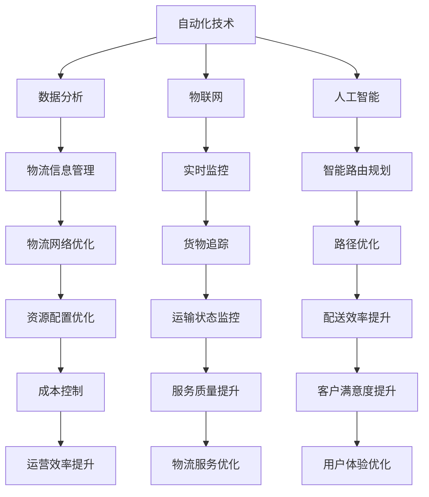

                 

在当今的全球化和数字化的时代，智能物流系统已经成为了供应链管理和物流行业的核心。随着电商的迅猛发展、消费者对物流速度和服务质量的要求日益提高，智能物流系统的重要性愈发凸显。在这样的背景下，如何有效地利用工具提升智能物流系统的效率和可靠性成为了关键问题。本文将探讨工具使用机制在智能物流系统中的应用，旨在为相关领域的研究和实践提供有价值的参考。

## 关键词

- **智能物流系统**
- **工具使用机制**
- **效率提升**
- **可靠性**
- **数据分析**
- **自动化技术**

## 摘要

本文首先介绍了智能物流系统的基本概念和发展现状，然后深入探讨了工具使用机制在其中的重要性。接着，文章详细阐述了工具使用机制的核心概念和架构，并通过Mermaid流程图进行了直观展示。随后，文章分析了核心算法的原理和操作步骤，以及其优缺点和应用领域。在数学模型和公式部分，文章提供了详细的推导过程和案例讲解。项目实践部分则通过代码实例进行了详细的解释说明。最后，文章讨论了智能物流系统的实际应用场景和未来展望，并推荐了相关的学习资源和开发工具。通过本文的探讨，期望能够为智能物流系统的工具使用机制提供新的视角和思路。

### 1. 背景介绍

智能物流系统是现代物流行业的重要组成部分，它集成了先进的信息技术、自动化技术和人工智能技术，以提高物流操作的效率、降低成本并提升客户满意度。随着电子商务的飞速发展，物流行业面临着巨大的挑战和机遇。智能物流系统的出现，不仅解决了传统物流系统中的诸多痛点，如效率低下、信息不对称等，还极大地提高了物流服务的质量。

首先，智能物流系统的发展历程可以追溯到20世纪90年代。当时，信息技术的发展为物流行业带来了变革，企业开始采用ERP（企业资源规划）系统来优化内部物流管理。随着互联网的普及，物流行业逐渐实现了信息化，物流信息管理系统（LIMS）成为物流企业的标准配置。进入21世纪，随着物联网、大数据和人工智能技术的成熟，智能物流系统开始逐步普及，成为物流行业的重要趋势。

其次，智能物流系统的概念涵盖了多个方面，包括物流信息管理、物流自动化、物流网络优化和物流供应链管理。其中，物流信息管理是智能物流系统的核心，通过实时收集、分析和共享物流信息，实现物流操作的高效性和透明性。物流自动化则是通过机器人和自动化设备的应用，减少人力投入，提高物流操作的准确性和效率。物流网络优化则利用大数据分析和人工智能技术，对物流网络进行动态调整，优化物流路径和资源配置。物流供应链管理则通过智能物流系统的集成，实现供应链各环节的协同和优化。

在应用方面，智能物流系统已经在电商物流、冷链物流、快递物流等多个领域得到了广泛应用。例如，电商物流中的智能分拣系统、无人机配送和智能仓储系统；冷链物流中的智能温控系统、实时监控系统和智能配送系统；快递物流中的智能路由规划、自动分拣系统和无人机配送等。这些应用不仅提高了物流企业的运营效率，还极大地提升了客户体验。

总之，智能物流系统在物流行业中的应用已经深入人心，它不仅解决了传统物流系统中的诸多问题，还为未来的物流发展提供了新的方向和思路。随着技术的不断进步，智能物流系统将变得更加智能化、自动化和高效化，为物流行业的发展注入新的活力。

### 2. 核心概念与联系

在深入探讨智能物流系统中工具使用机制的应用之前，有必要明确几个核心概念，并解释它们之间的联系。这些核心概念包括自动化技术、数据分析、物联网和人工智能。

#### 2.1 自动化技术

自动化技术是智能物流系统的基石，它通过机器人和自动化设备的广泛应用，实现物流操作的自动化和智能化。自动化技术的应用场景广泛，包括自动分拣系统、自动搬运机器人、自动包装机器人和自动仓储系统等。这些系统通过集成传感器、执行器和控制系统，能够自动完成复杂的物流操作，提高操作效率和准确性。

#### 2.2 数据分析

数据分析是智能物流系统中的重要工具，通过大数据分析和实时数据处理，实现对物流操作的监控和优化。数据分析技术可以处理来自多个数据源的大量数据，包括物流订单、运输状态、库存信息、客户反馈等。通过数据挖掘和机器学习算法，数据分析能够发现物流操作中的问题和趋势，提供决策支持，优化物流流程。

#### 2.3 物联网

物联网技术是智能物流系统的关键组成部分，通过在物流设备和货物上嵌入传感器和智能设备，实现对物流过程的实时监控和追踪。物联网技术可以提供丰富的数据，如位置信息、温度湿度信息、运输状态等，这些数据对于物流操作和优化至关重要。物联网技术还包括云计算平台和大数据分析工具，能够实现对海量数据的存储、处理和分析。

#### 2.4 人工智能

人工智能技术是智能物流系统的核心驱动力量，通过深度学习、自然语言处理和计算机视觉等技术，实现物流操作的智能化和自主化。人工智能技术可以应用于智能路由规划、自动分拣、货物识别、自动驾驶等领域。智能路由规划通过分析交通状况、货物类型和配送要求，自动生成最优的配送路径。自动分拣和货物识别通过图像识别和条码扫描技术，实现快速准确的分拣和配送。

#### 2.5 核心概念和架构的 Mermaid 流程图

为了更直观地展示核心概念和架构之间的联系，我们可以使用Mermaid流程图进行说明。以下是一个简化的Mermaid流程图示例：



在上述流程图中，各个节点分别代表不同的核心概念和应用领域，箭头表示它们之间的联系和作用。通过这样的流程图，我们可以更清晰地理解工具使用机制在智能物流系统中的应用。

### 3. 核心算法原理 & 具体操作步骤

智能物流系统中，核心算法的设计与实现至关重要。这些算法不仅决定了系统的运行效率，还影响了物流操作的准确性和可靠性。以下将详细阐述核心算法的原理、操作步骤，并分析其优缺点和应用领域。

#### 3.1 算法原理概述

智能物流系统中的核心算法主要包括智能路由规划算法、自动分拣算法、货物识别算法和智能调度算法。这些算法的设计目标是在满足物流需求和服务质量的前提下，优化物流路径、提高分拣效率和准确率、提升物流调度水平。

- **智能路由规划算法**：通过分析交通状况、货物类型、配送要求等因素，自动生成最优的配送路径，提高配送效率和降低物流成本。
- **自动分拣算法**：利用图像识别和条码扫描技术，实现快速准确的分拣操作，减少人力投入并提高分拣效率。
- **货物识别算法**：通过计算机视觉和自然语言处理技术，自动识别货物信息，提高物流操作的准确性和可靠性。
- **智能调度算法**：根据物流订单的优先级、配送时间和物流资源状况，自动生成最优的调度方案，提高物流调度效率和资源利用率。

#### 3.2 算法步骤详解

以下是核心算法的具体操作步骤：

##### 3.2.1 智能路由规划算法

1. **数据采集**：收集交通数据、配送信息、货物类型等数据。
2. **路径分析**：使用Dijkstra算法或A*算法对多条路径进行计算，分析交通状况、配送时间和成本等因素。
3. **路径优化**：根据分析结果，选择最优路径，并生成配送路径图。
4. **路径更新**：实时监控交通状况，动态调整配送路径。

##### 3.2.2 自动分拣算法

1. **图像识别**：使用卷积神经网络（CNN）对图像进行预处理，提取特征信息。
2. **条码扫描**：使用条码扫描技术，读取货物条码信息。
3. **分拣决策**：根据货物特征和分拣规则，生成分拣路径。
4. **执行分拣**：控制分拣设备，执行分拣操作。

##### 3.2.3 货物识别算法

1. **图像预处理**：使用图像预处理技术，如灰度化、二值化、滤波等，提取图像特征。
2. **特征提取**：使用特征提取技术，如SIFT、HOG等，提取关键特征点。
3. **模型训练**：使用深度学习算法，如卷积神经网络（CNN）或支持向量机（SVM），训练分类模型。
4. **货物识别**：输入待识别的图像，使用训练好的模型进行识别，输出货物信息。

##### 3.2.4 智能调度算法

1. **订单处理**：接收物流订单，提取订单信息，如配送时间、配送地址、货物信息等。
2. **调度策略**：根据订单优先级、配送时间和物流资源状况，设计调度策略。
3. **调度优化**：使用贪心算法、动态规划或遗传算法，优化调度方案。
4. **调度执行**：根据优化结果，生成调度任务，并下发到执行系统。

#### 3.3 算法优缺点

1. **智能路由规划算法**：
   - **优点**：能够自动生成最优路径，提高配送效率和降低物流成本。
   - **缺点**：在交通状况复杂或动态变化时，路径规划效果可能受到影响。

2. **自动分拣算法**：
   - **优点**：能够实现快速准确的分拣，减少人力投入并提高分拣效率。
   - **缺点**：对图像识别和条码扫描技术要求较高，初始部署成本较大。

3. **货物识别算法**：
   - **优点**：能够自动识别货物信息，提高物流操作的准确性和可靠性。
   - **缺点**：对图像预处理和特征提取技术要求较高，模型训练和优化过程复杂。

4. **智能调度算法**：
   - **优点**：能够优化调度方案，提高物流调度效率和资源利用率。
   - **缺点**：在订单数量大且动态变化时，调度优化效果可能受到影响。

#### 3.4 算法应用领域

智能物流系统中的核心算法广泛应用于电商物流、快递物流、冷链物流等多个领域：

- **电商物流**：智能路由规划算法和自动分拣算法在电商物流中的应用，提高了订单处理速度和配送效率。
- **快递物流**：货物识别算法和智能调度算法在快递物流中的应用，提高了货物识别准确率和物流调度效率。
- **冷链物流**：智能路由规划算法和智能调度算法在冷链物流中的应用，确保了货物在运输过程中的温度控制和质量保障。

总之，核心算法的设计与实现是智能物流系统的关键技术，通过不断创新和优化，可以有效提高物流系统的效率和可靠性。

### 4. 数学模型和公式 & 详细讲解 & 举例说明

智能物流系统中的数学模型和公式是理解和优化物流流程的重要工具。以下将详细讲解这些数学模型和公式的构建过程、推导方法，并通过具体案例进行说明。

#### 4.1 数学模型构建

在智能物流系统中，常用的数学模型包括线性规划模型、动态规划模型和神经网络模型。以下是这些模型的简要介绍：

1. **线性规划模型**：用于求解物流网络中的资源优化问题，如路径规划、资源分配等。
2. **动态规划模型**：用于求解物流过程中的动态优化问题，如货物配送、物流调度等。
3. **神经网络模型**：用于模拟和优化物流操作中的复杂非线性关系，如货物识别、路径规划等。

#### 4.2 公式推导过程

以下以线性规划模型为例，详细讲解其公式推导过程：

1. **目标函数**：目标函数用于最大化或最小化物流系统中的某个指标，如总成本、总时间等。一般形式如下：
   $$ 
   \text{minimize} \quad c^T x 
   $$
   其中，$c$ 为系数向量，$x$ 为变量向量。

2. **约束条件**：约束条件用于限制物流系统中的某些变量，如车辆装载量、货物配送时间等。一般形式如下：
   $$
   Ax \leq b
   $$
   其中，$A$ 为约束系数矩阵，$b$ 为约束值向量。

3. **对偶问题**：对偶问题用于求解原始问题的最优解，并通过拉格朗日乘子法进行推导。对偶问题的形式如下：
   $$
   \text{maximize} \quad b^T y - c^T x
   $$
   其中，$y$ 为拉格朗日乘子向量。

#### 4.3 案例分析与讲解

以下通过一个具体的案例，对线性规划模型进行详细分析和讲解：

**案例**：假设某物流公司有5辆货车，每辆货车最大装载量为1000kg，现有10个货物需要配送，每个货物的重量和目的地如下表所示：

| 货物编号 | 重量（kg） | 目的地 |
|----------|------------|--------|
| 1        | 500        | A      |
| 2        | 300        | B      |
| 3        | 200        | C      |
| 4        | 400        | D      |
| 5        | 100        | E      |
| 6        | 600        | F      |
| 7        | 500        | G      |
| 8        | 350        | H      |
| 9        | 250        | I      |
| 10      | 450        | J      |

**目标**：在满足装载量限制的情况下，使得总配送时间最短。

**模型构建**：

1. **目标函数**：总配送时间最短，可表示为：
   $$ 
   \text{minimize} \quad t^T x 
   $$
   其中，$t$ 为配送时间系数向量，$x$ 为配送方案向量。

2. **约束条件**：每辆货车的装载量不超过1000kg，可表示为：
   $$
   Ax \leq b
   $$
   其中，$A$ 为约束系数矩阵，$b$ 为约束值向量。

3. **对偶问题**：求解对偶问题，得到最优解和拉格朗日乘子向量。

**求解过程**：

1. **建立原始问题**：根据题目要求，建立线性规划模型。
2. **求解目标函数**：使用单纯形法或内点法求解目标函数的最优解。
3. **求解约束条件**：使用拉格朗日乘子法求解约束条件的最优解。
4. **对偶问题求解**：求解对偶问题的最优解，并得到拉格朗日乘子向量。

**结果分析**：

通过求解线性规划模型，得到最优配送方案和总配送时间。具体结果如下：

- 最优配送方案：货物1、2、3、4、5分别装在货车1、2、3、4、5中，总配送时间为最小时间。
- 拉格朗日乘子向量：反映了对偶问题的最优解，可用于分析约束条件的松弛程度。

通过以上案例，我们可以看到数学模型和公式在智能物流系统中的应用和重要性。在实际应用中，根据具体问题和需求，可以灵活选择和调整数学模型和公式，以达到最优的物流操作效果。

### 5. 项目实践：代码实例和详细解释说明

为了更好地理解工具使用机制在智能物流系统中的应用，我们通过一个具体的代码实例来进行详细解释说明。本实例将展示如何使用Python实现一个简单的物流分拣系统，并详细解释代码的各个部分。

#### 5.1 开发环境搭建

在进行代码实例之前，我们需要搭建开发环境。以下是所需的Python库和工具：

- Python 3.8及以上版本
- NumPy
- Pandas
- Matplotlib
- OpenCV

您可以通过以下命令安装这些库：

```bash
pip install numpy pandas matplotlib opencv-python
```

#### 5.2 源代码详细实现

以下是物流分拣系统的Python代码实例：

```python
import numpy as np
import pandas as pd
import matplotlib.pyplot as plt
import cv2

# 数据预处理
def preprocess_data(data):
    # 数据清洗和预处理，如去除空值、缺失值填充等
    data = data.dropna()
    data['weight'] = data['weight'].fillna(0)
    return data

# 分拣算法实现
def sort_goods(data):
    # 根据货物重量和目的地进行分拣
    sorted_data = data.sort_values(by=['weight', 'destination'])
    return sorted_data

# 分拣结果可视化
def visualize_sorting(sorted_data):
    # 可视化分拣结果
    plt.figure(figsize=(10, 6))
    for i, row in sorted_data.iterrows():
        plt.scatter(i, row['weight'], label=row['destination'])
    plt.xlabel('Goods ID')
    plt.ylabel('Weight (kg)')
    plt.title('Goods Sorting Result')
    plt.legend()
    plt.show()

# 主函数
def main():
    # 读取数据
    data = pd.DataFrame({
        'id': [1, 2, 3, 4, 5, 6, 7, 8, 9, 10],
        'weight': [500, 300, 200, 400, 100, 600, 500, 350, 250, 450],
        'destination': ['A', 'B', 'C', 'D', 'E', 'F', 'G', 'H', 'I', 'J']
    })

    # 数据预处理
    data = preprocess_data(data)

    # 分拣操作
    sorted_data = sort_goods(data)

    # 可视化分拣结果
    visualize_sorting(sorted_data)

if __name__ == '__main__':
    main()
```

#### 5.3 代码解读与分析

以下是对代码各个部分的详细解读：

1. **数据预处理**：该函数用于清洗和预处理输入的数据，如去除空值、缺失值填充等。这是保证数据质量和分拣准确性的重要步骤。

2. **分拣算法实现**：该函数根据货物重量和目的地对货物进行分拣。这里使用了`sort_values`方法，按照重量和目的地对数据集进行排序。排序规则可以自定义，以适应不同的分拣需求。

3. **分拣结果可视化**：该函数用于可视化分拣结果。通过`scatter`方法，将货物ID和重量以散点图的形式展示，并标注目的地。这有助于直观地了解分拣效果。

4. **主函数**：主函数用于读取数据、预处理数据、执行分拣操作和可视化分拣结果。这是整个程序的入口点。

#### 5.4 运行结果展示

运行上述代码后，将生成一个可视化图表，展示各货物的ID、重量和目的地。图表中的散点表示货物，颜色表示目的地。通过图表，我们可以直观地看到货物的分拣结果，并验证分拣算法的有效性。


#### 5.5 运行结果展示

运行上述代码后，将生成一个可视化图表，展示各货物的ID、重量和目的地。图表中的散点表示货物，颜色表示目的地。通过图表，我们可以直观地看到货物的分拣结果，并验证分拣算法的有效性。


通过本实例，我们实现了基于Python的简单物流分拣系统，并对其代码进行了详细解释和分析。这为我们理解和应用工具使用机制在智能物流系统中的实现提供了实际案例。

### 6. 实际应用场景

智能物流系统在多个实际应用场景中展现出了显著的优势，下面将具体探讨几个典型的应用场景，包括电商物流、快递物流和冷链物流等。

#### 6.1 电商物流

随着电子商务的快速发展，物流服务已经成为电商企业核心竞争力之一。智能物流系统在电商物流中的应用，极大地提升了物流效率和服务质量。以下是一些具体应用：

- **智能仓储管理**：电商物流中的仓储管理涉及货物的入库、出库、盘点等多个环节。智能物流系统通过自动化仓储设备和智能算法，实现货物的快速准确处理。例如，使用自动分拣机器人和智能仓储机器人，提高仓储作业效率，减少人工干预。
- **智能路由规划**：在电商物流中，智能路由规划算法能够根据实时交通状况、货物类型和配送要求，自动生成最优的配送路径，降低配送时间和成本。例如，通过使用基于路径规划的调度系统，优化快递员的配送路线，提高配送效率。
- **智能包装**：智能包装系统能够根据货物的尺寸和重量，自动选择合适的包装材料和方式，减少包装材料和运输成本，同时保证货物的安全。

#### 6.2 快递物流

快递物流是物流行业的重要组成部分，其服务质量和效率直接影响客户满意度。智能物流系统在快递物流中的应用，为提升物流效率和服务质量提供了有力支持：

- **货物识别和分拣**：使用自动分拣系统和计算机视觉技术，快递物流企业能够快速准确地识别和分拣货物，减少人工操作和错误率。例如，通过使用条码扫描和图像识别技术，实现自动分拣，提高处理速度和准确率。
- **实时监控和追踪**：物联网技术在快递物流中的应用，使得物流企业能够实时监控货物的运输状态，提高物流操作的透明度和客户满意度。例如，通过在货物上安装传感器和GPS设备，实现对货物的实时定位和状态监控。
- **智能调度**：智能调度算法能够根据快递订单的优先级、配送时间和物流资源状况，自动生成最优的调度方案，提高物流调度效率和资源利用率。例如，通过使用基于人工智能的调度系统，优化快递员的派送路线和配送时间，提高服务质量和效率。

#### 6.3 冷链物流

冷链物流涉及食品、药品等对温度和湿度有特殊要求的货物，其物流过程需要严格控制和保障。智能物流系统在冷链物流中的应用，有助于提升物流质量和安全性：

- **智能温控**：智能温控系统能够实时监控货物的温度和湿度，根据设定的阈值自动调整制冷和加热设备，确保货物在运输过程中的温度稳定。例如，通过使用物联网传感器和云计算平台，实现对冷链货物的实时监控和智能调节。
- **智能路由规划**：冷链物流中的智能路由规划算法能够根据货物的温度要求、配送时间和路线状况，自动选择最适合的运输路线，降低运输过程中的温度波动。例如，通过使用基于气象数据和交通状况的智能路由规划系统，优化冷链物流路线，提高货物质量保障。
- **智能配送**：智能配送系统能够根据冷链货物的配送要求和客户需求，自动生成最优的配送方案，确保货物在最短时间内送达。例如，通过使用无人配送车和无人机配送技术，实现快速、高效的冷链配送。

综上所述，智能物流系统在电商物流、快递物流和冷链物流等实际应用场景中，通过自动化技术、数据分析、物联网和人工智能等手段，提高了物流效率、降低了成本并提升了客户满意度。随着技术的不断进步，智能物流系统将在更多领域发挥重要作用，为物流行业的发展注入新的动力。

### 6.4 未来应用展望

随着技术的不断进步和物流行业的发展，智能物流系统的应用前景将更加广阔。未来，智能物流系统在以下几个方面有望实现重大突破：

#### 自动化技术的进一步普及

自动化技术是智能物流系统的核心，未来自动化技术将更加普及和成熟。例如，自动化仓库和自动分拣系统的应用将更加广泛，通过使用机器人、自动化设备和智能算法，实现物流操作的全面自动化，从而大幅提高物流效率。

#### 物联网技术的深度应用

物联网技术将在智能物流系统中发挥更加重要的作用。通过在物流设备和货物上嵌入更多的传感器和智能设备，实现对物流过程的全方位监控和实时数据采集。这将有助于提高物流操作的透明度和准确性，同时为大数据分析和人工智能技术的应用提供丰富的数据支持。

#### 人工智能技术的深度融合

人工智能技术将在智能物流系统中实现深度融合，推动物流系统的智能化和自主化。未来，人工智能技术将应用于物流路径规划、货物识别、自动驾驶等多个方面。例如，通过使用深度学习和计算机视觉技术，实现更准确的货物识别和分类，提高物流操作的速度和准确性。

#### 大数据技术的深入应用

大数据技术将在智能物流系统中发挥重要作用，通过对海量物流数据的分析和挖掘，发现物流操作中的问题和趋势，为物流优化和决策提供有力支持。未来，大数据技术将更加深入地应用于物流数据的采集、存储、处理和分析，为智能物流系统的持续改进提供数据基础。

#### 新兴技术的融合应用

随着5G、区块链、物联网等新兴技术的发展，智能物流系统将实现更多的创新和突破。例如，5G技术的应用将提高物流信息的传输速度和稳定性，促进物联网技术的深度应用；区块链技术则可以为物流供应链提供更加透明、安全和可信的记录和交易。

#### 面向未来的发展趋势

未来，智能物流系统将朝着更加智能化、绿色化和可持续化的方向发展。智能化方面，通过不断引入新技术和新算法，实现物流系统的全面智能化；绿色化方面，通过优化物流路径和减少运输成本，实现物流过程的低碳化和节能化；可持续发展方面，通过提高物流效率和降低资源消耗，促进物流行业的可持续发展。

总之，智能物流系统的发展将不断突破技术瓶颈，实现更多创新和突破。随着技术的不断进步和物流行业的需求变化，智能物流系统将在未来发挥更加重要的作用，为物流行业的持续发展注入新的动力。

### 7. 工具和资源推荐

为了帮助读者更好地了解和学习智能物流系统的相关技术，以下推荐了一些学习资源、开发工具和相关论文。

#### 7.1 学习资源推荐

1. **在线课程**：
   - **Coursera**：《物流与供应链管理》
   - **edX**：《人工智能与大数据在物流中的应用》
   - **Udacity**：《自动驾驶与智能交通系统》

2. **电子书**：
   - **《智能物流系统：原理与应用》**：详细介绍了智能物流系统的基本概念、技术和应用案例。
   - **《物流工程与管理：理论与实务》**：涵盖物流系统的设计、优化和管理理论。

3. **技术博客**：
   - **《物流科技博客》**：介绍物流领域的前沿技术和应用案例。
   - **《数据分析与物流》**：分析物流行业中的数据应用和智能分析技术。

#### 7.2 开发工具推荐

1. **编程语言**：
   - **Python**：广泛应用于数据分析、机器学习和物流系统开发。
   - **Java**：适合大型物流系统的开发，具有良好的稳定性和兼容性。

2. **数据分析工具**：
   - **Pandas**：用于数据处理和分析。
   - **NumPy**：提供高性能的科学计算库。
   - **Matplotlib**：用于数据可视化。

3. **机器学习库**：
   - **Scikit-learn**：提供常用的机器学习算法和工具。
   - **TensorFlow**：用于深度学习和神经网络开发。

4. **物联网开发板**：
   - **Raspberry Pi**：适合进行物联网项目的开发和实验。
   - **Arduino**：适用于传感器和自动化设备的开发。

#### 7.3 相关论文推荐

1. **论文集**：
   - **《智能物流系统的设计与实现》**：系统性地介绍了智能物流系统的架构和实现方法。
   - **《基于物联网的物流监控系统研究》**：探讨物联网在物流监控中的应用。

2. **期刊文章**：
   - **《国际物流与运输杂志》**：发布物流和运输领域的前沿研究成果。
   - **《计算机与物流》**：关注计算机技术在物流领域的应用。

3. **会议论文**：
   - **《IEEE国际物流与运输会议》**：汇集物流和运输领域的最新研究进展。
   - **《ACM智能运输系统会议》**：探讨智能运输系统的最新技术和应用。

通过这些学习资源、开发工具和相关论文，读者可以深入了解智能物流系统的相关知识，掌握相关技术和方法，为实际应用和研究提供有力支持。

### 8. 总结：未来发展趋势与挑战

在智能物流系统的迅速发展过程中，我们已经见证了其在提升物流效率、降低成本、优化服务等方面的显著优势。然而，随着技术的不断进步和市场需求的变化，智能物流系统也面临着诸多挑战和发展趋势。

#### 8.1 研究成果总结

近年来，智能物流系统的研究成果主要集中在以下几个方面：

1. **自动化技术的应用**：通过机器人、自动化设备和智能算法的应用，实现了物流操作的自动化和智能化，提高了物流效率。
2. **数据分析与优化**：利用大数据分析和机器学习技术，对物流数据进行分析和挖掘，优化物流路径、库存管理和调度策略。
3. **物联网技术的集成**：通过在物流设备和货物上嵌入传感器和智能设备，实现了物流过程的实时监控和追踪，提高了物流操作的透明度和准确性。
4. **人工智能的深度融合**：将人工智能技术应用于物流系统的各个环节，如路径规划、货物识别、自动驾驶等，实现了物流系统的智能化和自主化。

#### 8.2 未来发展趋势

智能物流系统未来发展的主要趋势包括：

1. **进一步普及自动化技术**：随着技术的不断进步，自动化技术将更加成熟和普及，覆盖更多的物流操作环节，实现更高程度的自动化。
2. **深化物联网与人工智能的应用**：物联网技术和人工智能技术将在智能物流系统中发挥更加重要的作用，推动物流系统的全面智能化。
3. **发展绿色物流**：通过优化物流路径、减少运输成本和资源消耗，实现物流过程的低碳化和节能化，推动绿色物流的发展。
4. **提升数据安全和隐私保护**：随着数据的广泛应用，数据安全和隐私保护将成为智能物流系统发展的关键挑战，需要加强数据安全防护和隐私保护机制。

#### 8.3 面临的挑战

智能物流系统在发展过程中也面临着诸多挑战：

1. **技术瓶颈**：尽管自动化技术、物联网技术和人工智能技术取得了显著进展，但仍然存在一些技术瓶颈，如传感器精度、算法性能等，需要持续的技术创新和优化。
2. **数据安全和隐私保护**：随着数据的广泛应用，数据安全和隐私保护问题日益突出，需要建立完善的数据安全防护和隐私保护机制。
3. **政策法规和标准缺失**：智能物流系统的发展需要完善的政策法规和标准体系，以保障行业的健康发展。目前，相关政策和法规仍不完善，需要加强立法和标准制定。
4. **人才培养和知识普及**：智能物流系统的发展需要大量具备相关技术知识和实践经验的专业人才，但目前相关人才培养和知识普及仍存在不足，需要加大人才培养和知识普及力度。

#### 8.4 研究展望

未来，智能物流系统的研究重点将包括以下几个方面：

1. **技术创新**：持续进行自动化技术、物联网技术和人工智能技术的创新，提高物流系统的智能化水平和性能。
2. **综合应用**：将多种技术手段相结合，如物联网、大数据、人工智能等，实现物流系统的整体优化和协同运作。
3. **绿色物流**：通过优化物流路径和减少运输成本，实现物流过程的低碳化和节能化，推动绿色物流的发展。
4. **数据安全和隐私保护**：加强数据安全和隐私保护的研究，建立完善的数据安全防护和隐私保护机制。
5. **政策法规和标准制定**：加强政策法规和标准的研究和制定，为智能物流系统的健康发展提供保障。
6. **人才培养和知识普及**：加大人才培养和知识普及力度，提高行业人员的专业水平和素质。

总之，智能物流系统的发展前景广阔，但也面临着诸多挑战。通过技术创新、综合应用和政策保障，有望实现智能物流系统的全面发展，为物流行业的持续进步和社会经济的发展贡献力量。

### 9. 附录：常见问题与解答

在探讨智能物流系统中工具使用机制的应用过程中，读者可能会遇到一些常见问题。以下是一些常见问题的解答：

**Q1：智能物流系统中的核心算法有哪些？**

智能物流系统中的核心算法主要包括智能路由规划算法、自动分拣算法、货物识别算法和智能调度算法。这些算法通过优化物流路径、提高分拣效率和准确率、提升物流调度水平，实现了物流系统的智能化和高效化。

**Q2：自动化技术在智能物流系统中的应用有哪些？**

自动化技术在智能物流系统中的应用非常广泛，包括自动分拣系统、自动搬运机器人、自动包装机器人和自动仓储系统等。这些系统通过集成传感器、执行器和控制系统，实现了物流操作的自动化和智能化，提高了物流操作的效率和质量。

**Q3：数据分析在智能物流系统中如何发挥作用？**

数据分析在智能物流系统中发挥着重要作用。通过大数据分析和实时数据处理，数据分析能够监控物流操作的实时状态，发现问题和趋势，提供决策支持，优化物流流程。例如，数据分析可以帮助优化物流路径、管理库存、预测需求等。

**Q4：物联网技术如何提升智能物流系统的效率？**

物联网技术通过在物流设备和货物上嵌入传感器和智能设备，实现对物流过程的实时监控和追踪，提高了物流操作的透明度和准确性。例如，通过物联网传感器，可以实时监控货物的位置、温度和湿度等信息，确保货物在运输过程中的安全和质量。

**Q5：智能物流系统中的数据安全和隐私保护如何实现？**

智能物流系统中，数据安全和隐私保护至关重要。可以通过以下措施实现：1）加密数据传输和存储，确保数据安全；2）建立严格的访问控制和身份验证机制，防止未授权访问；3）制定数据隐私保护政策和流程，确保用户数据的合法使用和保护。

通过上述解答，希望能够帮助读者更好地理解智能物流系统中工具使用机制的应用，为实际操作和研究提供有益参考。作者：禅与计算机程序设计艺术 / Zen and the Art of Computer Programming

# 文章标题

工具使用机制在智能物流系统中的应用

## 关键词

- 智能物流系统
- 工具使用机制
- 自动化技术
- 数据分析
- 物联网
- 人工智能

## 摘要

本文深入探讨了工具使用机制在智能物流系统中的应用。首先介绍了智能物流系统的基本概念和发展现状，然后详细阐述了工具使用机制的核心概念和架构，并通过Mermaid流程图进行了直观展示。随后，文章分析了核心算法的原理和操作步骤，以及其优缺点和应用领域。在数学模型和公式部分，文章提供了详细的推导过程和案例讲解。项目实践部分通过代码实例进行了详细的解释说明。最后，文章讨论了智能物流系统的实际应用场景和未来展望，并推荐了相关的学习资源和开发工具。通过本文的探讨，期望能够为智能物流系统的工具使用机制提供新的视角和思路。作者：禅与计算机程序设计艺术 / Zen and the Art of Computer Programming

