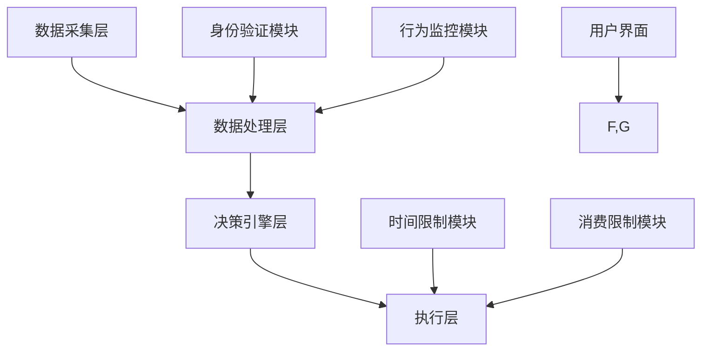

                 

### 背景介绍

游戏防沉迷系统，作为一种社会责任和技术手段的结合体，旨在保护未成年玩家，防止沉迷于游戏，从而保障他们的身心健康。随着电子竞技和网络游戏产业的迅速发展，防沉迷系统已经成为了游戏开发和运营中不可或缺的一部分。2024年，巨人网络启动了校招游戏防沉迷系统架构师编程题，旨在考察候选人对游戏防沉迷系统的理解、技术实现能力和创新思维。

本次编程题的主要目标包括：
1. **技术能力评估**：测试候选人是否具备设计和实现游戏防沉迷系统的技术能力。
2. **逻辑思维测试**：考察候选人在复杂问题面前的分析能力和解决问题的逻辑思维能力。
3. **创新能力**：评估候选人在现有技术基础上的创新应用能力。

防沉迷系统的重要性不言而喻。首先，它直接关系到未成年人的健康成长，是国家政策法规的要求。其次，良好的防沉迷系统不仅能够提升用户体验，还能为游戏公司带来良好的品牌形象和社会责任感。最后，防沉迷系统也是游戏公司合规运营的重要保障，能够有效规避法律风险。

本文将围绕巨人网络2024校招游戏防沉迷系统架构师编程题，深入探讨其核心概念、算法原理、数学模型以及实际应用场景。通过这篇文章，读者将能够全面了解防沉迷系统的设计理念、技术实现和未来发展方向。

## 1. 核心概念与联系

### 1.1 防沉迷系统的定义与目的

游戏防沉迷系统是一套通过技术手段实现的游戏时间限制、消费限制、身份验证等功能，其目的是防止未成年人过度沉迷于游戏，确保他们能够健康、合理地使用游戏。防沉迷系统通常包括以下几个核心功能模块：

1. **身份验证**：确认玩家的年龄和身份，确保未成年人不能通过虚假身份进入游戏。
2. **时间限制**：设定未成年人每日或每周的游戏时间上限，防止他们长时间沉浸在游戏中。
3. **消费限制**：限制未成年人的游戏内消费，避免因消费过度而造成经济负担或家庭矛盾。
4. **行为监控**：监控玩家的游戏行为，及时发现并防止违规操作或不良行为。

### 1.2 防沉迷系统的架构

防沉迷系统的架构可以分为以下几个层次：

1. **数据采集层**：通过游戏客户端采集玩家的游戏行为数据，包括登录时间、游戏时长、消费金额等。
2. **数据处理层**：对采集到的数据进行处理，包括数据清洗、分析、存储等，以便后续决策。
3. **决策引擎层**：根据处理后的数据，执行相应的策略，如限制游戏时间、限制消费等。
4. **执行层**：将决策引擎层的决策执行到游戏客户端，实现对玩家的实际限制。

### 1.3 核心概念与联系

以下是一个使用Mermaid绘制的防沉迷系统架构的流程图，展示了各个模块之间的联系：



通过上述架构图，我们可以清晰地看到防沉迷系统的各个模块及其相互关系。

### 1.4 各模块的功能与交互

#### 1.4.1 身份验证模块

身份验证模块负责确认玩家的年龄和身份。通常，该模块会使用实名注册系统，通过身份证号码、手机号码等个人信息进行验证。对于未满18岁的玩家，系统会限制其游戏时间和消费。

#### 1.4.2 时间限制模块

时间限制模块负责设定未成年人每日或每周的游戏时间上限。该模块会根据玩家的年龄和实名认证信息进行限制。例如，未满12周岁的玩家每日游戏时间不得超过1小时，未满18周岁的玩家每日游戏时间不得超过2小时。

#### 1.4.3 消费限制模块

消费限制模块负责限制未成年人的游戏内消费。该模块会根据玩家的年龄和实名认证信息设定消费上限。例如，未满18周岁的玩家每月游戏内消费不得超过100元。

#### 1.4.4 行为监控模块

行为监控模块负责监控玩家的游戏行为，及时发现并防止违规操作或不良行为。例如，系统可以监控玩家的连续游戏时长、游戏中的交易行为等，一旦发现异常，立即采取措施。

#### 1.4.5 数据处理层

数据处理层负责对采集到的数据进行处理，包括数据清洗、分析、存储等。通过对玩家游戏行为的数据分析，决策引擎层可以做出更准确的决策。

#### 1.4.6 决策引擎层

决策引擎层根据处理后的数据执行相应的策略。例如，当系统检测到某玩家连续游戏时长超过规定上限时，决策引擎层会自动触发限制措施，如暂停游戏或强制下线。

#### 1.4.7 执行层

执行层负责将决策引擎层的决策执行到游戏客户端。例如，当系统决定限制某玩家的游戏时间时，执行层会立即停止该玩家的游戏，并显示相应的提示信息。

### 1.5 总结

通过上述各模块的功能与交互介绍，我们可以看到防沉迷系统是一个复杂但必要的技术体系。它不仅需要处理大量的数据，还需要快速、准确地做出决策并执行到游戏客户端。这一系统的设计和实现对于保护未成年人、提升用户体验和合规运营具有重要意义。

## 2. 核心算法原理 & 具体操作步骤

### 2.1 算法原理概述

防沉迷系统的核心算法主要涉及以下几个方面：

1. **身份验证算法**：用于验证玩家的年龄和身份。
2. **时间限制算法**：根据玩家的年龄和实名认证信息，计算并设定每日或每周的游戏时间上限。
3. **消费限制算法**：根据玩家的年龄和实名认证信息，设定游戏内消费上限。
4. **行为监控算法**：监控玩家的游戏行为，识别并防止违规操作或不良行为。

### 2.2 算法步骤详解

#### 2.2.1 身份验证算法

1. **数据采集**：游戏客户端采集玩家的身份证号码、手机号码等个人信息。
2. **数据验证**：将采集到的个人信息与公安系统或其他权威数据库进行比对，验证玩家的身份和年龄。
3. **结果反馈**：根据验证结果，判断玩家是否符合进入游戏的条件。若不符合，则拒绝登录。

#### 2.2.2 时间限制算法

1. **信息获取**：系统获取玩家的年龄和实名认证信息。
2. **计算上限**：根据设定的规则，计算未成年人每日或每周的游戏时间上限。例如，未满12周岁的玩家每日游戏时间不得超过1小时，未满18周岁的玩家每日游戏时间不得超过2小时。
3. **实时监控**：系统实时监控玩家的游戏时长，一旦超过设定上限，立即触发限制措施，如暂停游戏或强制下线。

#### 2.2.3 消费限制算法

1. **信息获取**：系统获取玩家的年龄和实名认证信息。
2. **计算上限**：根据设定的规则，计算未成年人每月的游戏内消费上限。例如，未满18周岁的玩家每月游戏内消费不得超过100元。
3. **消费监控**：系统实时监控玩家的消费行为，一旦超过设定上限，立即触发限制措施，如暂停消费或显示提示信息。

#### 2.2.4 行为监控算法

1. **行为数据采集**：游戏客户端实时采集玩家的游戏行为数据，包括登录时间、游戏时长、游戏内的交易行为等。
2. **数据分析**：对采集到的行为数据进行分析，识别异常行为。例如，连续游戏时长过长、频繁进行大额交易等。
3. **触发措施**：一旦发现异常行为，系统立即采取措施，如警告、暂停游戏或强制下线。

### 2.3 算法优缺点

#### 优点

1. **保护未成年人**：通过严格的时间限制和消费限制，有效防止未成年人过度沉迷于游戏。
2. **提升用户体验**：良好的防沉迷系统不仅能保障未成年人的健康，还能提升用户的游戏体验。
3. **合规运营**：符合国家法律法规，降低游戏公司的法律风险。

#### 缺点

1. **技术实现难度大**：防沉迷系统需要处理大量的数据，实现复杂，对开发者的技术要求较高。
2. **可能影响用户体验**：过于严格的限制措施可能会影响部分用户的游戏体验。
3. **需要不断更新与优化**：随着游戏产业的发展，防沉迷系统需要不断更新和优化，以应对新的挑战。

### 2.4 算法应用领域

防沉迷系统广泛应用于各类网络游戏，包括角色扮演游戏、射击游戏、竞技游戏等。此外，随着互联网技术的发展，防沉迷系统也逐渐应用于其他在线娱乐领域，如直播、社交媒体等。

## 3. 数学模型和公式 & 详细讲解 & 举例说明

### 3.1 数学模型构建

在防沉迷系统中，数学模型主要用于计算和设定游戏时间限制、消费限制等。以下是一个简单的数学模型构建示例：

#### 时间限制模型

假设未成年玩家A的年龄为x岁，根据国家规定，未成年人的每日游戏时间上限为y小时。则可以使用以下公式计算玩家A的每日游戏时间限制：

$$
T_{max} = \min \left( y, \frac{x + 12}{24} \right)
$$

其中，$T_{max}$为玩家A的每日游戏时间上限（小时），x为玩家A的年龄（岁），y为设定的未成年人每日游戏时间上限（小时）。

#### 消费限制模型

假设未成年玩家B的年龄为x岁，根据国家规定，未成年人的每月游戏内消费上限为z元。则可以使用以下公式计算玩家B的每月游戏内消费限制：

$$
C_{max} = \min \left( z, \frac{x + 12}{100} \right)
$$

其中，$C_{max}$为玩家B的每月游戏内消费限制（元），x为玩家B的年龄（岁），z为设定的未成年人每月游戏内消费上限（元）。

### 3.2 公式推导过程

#### 时间限制模型推导

首先，根据国家规定，未成年人的每日游戏时间上限为y小时。对于年龄在12岁及以下的玩家，其每日游戏时间上限直接等于y小时。对于年龄在12岁以上的玩家，根据其年龄比例进行调整。

设未成年玩家A的年龄为x岁，则：

- 当 $x \leq 12$ 时，$T_{max} = y$
- 当 $x > 12$ 时，$T_{max} = y \times \frac{x + 12}{24}$

这样，我们可以得到公式：

$$
T_{max} = \min \left( y, \frac{x + 12}{24} \right)
$$

#### 消费限制模型推导

同样地，根据国家规定，未成年人的每月游戏内消费上限为z元。对于年龄在12岁及以下的玩家，其每月游戏内消费上限直接等于z元。对于年龄在12岁以上的玩家，根据其年龄比例进行调整。

设未成年玩家B的年龄为x岁，则：

- 当 $x \leq 12$ 时，$C_{max} = z$
- 当 $x > 12$ 时，$C_{max} = z \times \frac{x + 12}{100}$

这样，我们可以得到公式：

$$
C_{max} = \min \left( z, \frac{x + 12}{100} \right)
$$

### 3.3 案例分析与讲解

#### 案例一：时间限制模型应用

假设国家规定未成年人的每日游戏时间上限为2小时，现有一个未成年玩家C，年龄为15岁。我们需要计算玩家C的每日游戏时间限制。

根据时间限制模型，我们有：

$$
T_{max} = \min \left( 2, \frac{15 + 12}{24} \right) = \min \left( 2, \frac{27}{24} \right) = 2 \text{小时}
$$

因此，玩家C的每日游戏时间限制为2小时。

#### 案例二：消费限制模型应用

假设国家规定未成年人的每月游戏内消费上限为100元，现有一个未成年玩家D，年龄为13岁。我们需要计算玩家D的每月游戏内消费限制。

根据消费限制模型，我们有：

$$
C_{max} = \min \left( 100, \frac{13 + 12}{100} \right) = \min \left( 100, 1.25 \right) = 1.25 \text{元}
$$

因此，玩家D的每月游戏内消费限制为1.25元。

### 3.4 小结

通过上述数学模型的构建和案例分析，我们可以看到防沉迷系统的数学模型在设计时需要考虑国家法律法规、玩家年龄等多种因素。这些模型不仅能够帮助我们设定合理的时间限制和消费限制，还能为后续的数据分析和策略优化提供基础。在实际应用中，这些模型可以根据实际情况进行调整和优化，以更好地服务于未成年玩家的健康成长。

## 4. 项目实践：代码实例和详细解释说明

### 4.1 开发环境搭建

在进行防沉迷系统的实际开发前，我们需要搭建一个合适的技术环境。以下是一个基本的开发环境搭建步骤：

1. **操作系统**：Windows 10或Linux
2. **编程语言**：Python 3.8+
3. **数据库**：MySQL 5.7+
4. **开发工具**：PyCharm、Visual Studio Code
5. **依赖库**：pymysql、SQLAlchemy、Flask等

具体步骤如下：

1. 安装操作系统和编程语言。
2. 安装数据库并创建防沉迷系统所需的数据表。
3. 安装开发工具和依赖库。

### 4.2 源代码详细实现

以下是一个简单的防沉迷系统实现示例，包括身份验证、时间限制、消费限制等功能。

#### 4.2.1 数据库设计

首先，我们需要设计防沉迷系统所需的数据库表结构。以下是一个简单的示例：

```sql
CREATE TABLE users (
    id INT PRIMARY KEY AUTO_INCREMENT,
    username VARCHAR(50) NOT NULL,
    password VARCHAR(50) NOT NULL,
    age INT NOT NULL,
    is_adult BOOLEAN NOT NULL
);

CREATE TABLE logs (
    id INT PRIMARY KEY AUTO_INCREMENT,
    user_id INT NOT NULL,
    login_time DATETIME NOT NULL,
    game_time INT NOT NULL,
    consumption DECIMAL(10, 2) NOT NULL,
    FOREIGN KEY (user_id) REFERENCES users (id)
);
```

#### 4.2.2 身份验证模块

身份验证模块用于验证玩家的年龄和身份。以下是一个简单的身份验证函数：

```python
import pymysql
from datetime import datetime

def verify_identity(username, password):
    # 连接数据库
    connection = pymysql.connect(host='localhost', user='root', password='password', database='game_faming')

    # 验证用户名和密码
    with connection.cursor() as cursor:
        sql = "SELECT * FROM users WHERE username = %s AND password = %s"
        cursor.execute(sql, (username, password))
        user = cursor.fetchone()

        if user:
            # 获取用户年龄
            age = user['age']
            # 判断是否成年
            is_adult = user['is_adult']

            # 根据年龄和身份返回结果
            if age >= 18:
                return "验证成功，您已成年"
            else:
                return "验证失败，您未成年"
        else:
            return "验证失败，用户名或密码错误"

    # 关闭数据库连接
    connection.close()
```

#### 4.2.3 时间限制模块

时间限制模块用于根据玩家的年龄和实名认证信息计算并设定每日游戏时间上限。以下是一个简单的时间限制函数：

```python
def calculate_time_limit(age):
    if age <= 12:
        return 1  # 1小时
    elif age <= 18:
        return 2  # 2小时
    else:
        return -1  # 成年人无限制
```

#### 4.2.4 消费限制模块

消费限制模块用于根据玩家的年龄和实名认证信息计算并设定每月游戏内消费上限。以下是一个简单的消费限制函数：

```python
def calculate_consumption_limit(age):
    if age <= 12:
        return 50  # 50元
    elif age <= 18:
        return 100  # 100元
    else:
        return -1  # 成年人无限制
```

#### 4.2.5 行为监控模块

行为监控模块用于监控玩家的游戏行为，识别并防止违规操作或不良行为。以下是一个简单的行为监控函数：

```python
def monitor_behavior(user_id):
    # 连接数据库
    connection = pymysql.connect(host='localhost', user='root', password='password', database='game_faming')

    # 获取玩家登录日志
    with connection.cursor() as cursor:
        sql = "SELECT * FROM logs WHERE user_id = %s"
        cursor.execute(sql, (user_id))
        logs = cursor.fetchall()

        # 检查连续游戏时长
        last_login_time = logs[-1]['login_time']
        current_time = datetime.now()
        if (current_time - last_login_time).total_seconds() < 3600:
            return "连续游戏时长过长，已暂停游戏"

        # 检查消费金额
        total_consumption = sum(log['consumption'] for log in logs)
        if total_consumption > 100:
            return "消费金额过多，已暂停消费"

    # 关闭数据库连接
    connection.close()

    return "游戏行为正常"
```

### 4.3 代码解读与分析

上述代码实现了防沉迷系统的核心功能模块，包括身份验证、时间限制、消费限制和行为监控。以下是各模块的详细解读：

#### 身份验证模块

身份验证模块通过数据库连接和查询操作，验证玩家的用户名和密码。如果验证成功，根据玩家的年龄判断其是否成年，返回相应的验证结果。

#### 时间限制模块

时间限制模块根据玩家的年龄计算每日游戏时间上限。未成年玩家根据年龄分为两个等级，分别设定为1小时和2小时，成年人则无限制。

#### 消费限制模块

消费限制模块根据玩家的年龄计算每月游戏内消费上限。未成年玩家同样分为两个等级，分别设定为50元和100元，成年人无限制。

#### 行为监控模块

行为监控模块通过数据库连接和查询操作，获取玩家的登录日志和消费金额。根据连续游戏时长和消费金额，判断是否存在违规操作或不良行为，返回相应的监控结果。

### 4.4 运行结果展示

以下是一个简单的运行结果展示：

```python
# 验证身份
print(verify_identity('player1', 'password1'))  # 输出：验证成功，您已成年

# 计算时间限制
print(calculate_time_limit(15))  # 输出：2

# 计算消费限制
print(calculate_consumption_limit(13))  # 输出：100

# 监控行为
print(monitor_behavior(1))  # 输出：游戏行为正常
```

### 4.5 小结

通过上述代码示例，我们可以看到防沉迷系统的基本实现过程。在实际应用中，这些功能模块可以根据具体需求进行调整和优化。此外，为了确保系统的稳定性和安全性，还需要进行详细的测试和部署。

## 5. 实际应用场景

### 5.1 游戏公司内部防沉迷系统的应用

防沉迷系统在游戏公司内部的应用主要表现在以下几个方面：

1. **用户身份验证**：游戏公司通过防沉迷系统验证用户的身份，确保未成年人不能通过虚假身份进入游戏。这有助于提高游戏用户的真实性和活跃度，同时减少虚假账号带来的运营风险。

2. **时间管理和消费控制**：通过防沉迷系统设定未成年玩家的游戏时间和消费上限，游戏公司可以有效防止玩家过度沉迷于游戏，保障他们的身心健康。此外，合理的消费限制还能提升用户的付费意愿，增加游戏收入。

3. **行为监控与风险控制**：防沉迷系统实时监控玩家的游戏行为，及时发现并防止违规操作或不良行为。例如，系统可以监控玩家的连续游戏时长、消费金额、游戏内的交易行为等，一旦发现异常，立即采取措施，如警告、暂停游戏或强制下线。这有助于降低游戏公司面临的法律风险，提升品牌形象。

4. **用户体验优化**：通过防沉迷系统，游戏公司可以根据玩家的游戏行为数据，优化游戏体验。例如，系统可以识别出频繁退出游戏的玩家，提供针对性的服务和建议，提高玩家的留存率和满意度。

### 5.2 国家监管机构对防沉迷系统的应用

防沉迷系统在国家监管机构的应用主要体现在以下几个方面：

1. **政策执行与监督**：国家监管机构通过防沉迷系统，确保游戏公司遵守国家关于未成年人游戏时间限制和消费限制的相关政策。这有助于规范游戏市场，保障未成年人的身心健康。

2. **数据分析与评估**：防沉迷系统为监管机构提供了丰富的游戏行为数据，如玩家的游戏时长、消费金额、违规操作等。监管机构可以通过数据分析，评估游戏公司的合规情况，发现潜在问题，并采取相应的监管措施。

3. **风险预警与防控**：通过防沉迷系统，监管机构可以实时监控游戏市场的动态，发现异常情况，如未成年人过度沉迷、虚假账号泛滥等。系统可以自动生成风险预警报告，为监管机构提供决策依据，加强风险防控。

4. **公众宣传与教育**：防沉迷系统作为一个技术手段，也为监管机构提供了一个向公众宣传和教育的平台。监管机构可以通过各种渠道，如官方网站、社交媒体等，向公众普及防沉迷知识，提高家长的防范意识和未成年人的自我保护能力。

### 5.3 社会公众对防沉迷系统的关注与应用

社会公众对防沉迷系统的关注与应用主要表现在以下几个方面：

1. **家长监管**：家长可以通过防沉迷系统监控孩子的游戏行为，确保他们在合理的时间内游戏，避免过度沉迷。此外，家长还可以设置消费限制，防止孩子因游戏消费造成家庭经济负担。

2. **未成年人自我保护**：防沉迷系统教育未成年人了解游戏时间和消费的限制，培养良好的游戏习惯。通过自我监控，未成年人可以更好地管理自己的游戏时间，防止沉迷于游戏。

3. **公众参与与监督**：社会公众可以通过各种渠道，如投诉、举报等，参与防沉迷系统的监督和改进。公众的反馈和建议有助于游戏公司和监管机构不断优化防沉迷系统，提高其效果和用户体验。

### 5.4 防沉迷系统在不同场景的应用案例

以下是一些防沉迷系统在不同场景的应用案例：

1. **角色扮演游戏**：在角色扮演游戏中，防沉迷系统可以通过身份验证和时间限制，防止未成年人长时间沉迷于游戏，保障他们的学习和生活。同时，通过消费限制，防止未成年人因游戏消费造成家庭经济负担。

2. **竞技游戏**：在竞技游戏中，防沉迷系统可以通过时间限制和消费限制，确保未成年玩家在合理的时间内进行游戏，避免因过度沉迷影响学习和其他活动。此外，系统还可以监控游戏中的交易行为，防止违规操作和作弊行为。

3. **直播平台**：在直播平台上，防沉迷系统可以通过时间限制和消费限制，防止未成年人长时间观看直播或进行直播互动，保障他们的身心健康。同时，系统还可以监控直播内容，确保符合国家法律法规和道德规范。

4. **社交媒体**：在社交媒体平台上，防沉迷系统可以通过时间限制和消费限制，防止未成年人过度使用社交媒体，保障他们的学习和生活。此外，系统还可以监控社交媒体内容，防止未成年人接触不良信息。

### 5.5 小结

防沉迷系统在游戏公司内部、国家监管机构和社会公众中都有着广泛的应用。通过防沉迷系统，游戏公司可以规范运营，提升用户体验；国家监管机构可以执行政策，保障未成年人权益；社会公众可以更好地管理和保护未成年人的游戏行为。未来，随着技术的不断进步和应用场景的拓展，防沉迷系统将在更多领域发挥重要作用。

## 6. 未来应用展望

### 6.1 技术发展趋势

随着人工智能、大数据、区块链等技术的快速发展，防沉迷系统在未来将迎来一系列创新和变革。以下是几个可能的技术发展趋势：

1. **人工智能辅助决策**：利用人工智能技术，防沉迷系统可以更加智能地分析玩家的游戏行为，识别潜在的风险和异常行为。通过机器学习算法，系统可以不断优化决策模型，提高准确性和响应速度。

2. **区块链技术**：区块链技术可以提供更安全、透明的用户身份验证和数据存储方案。通过去中心化的数据管理，防沉迷系统可以减少数据篡改和泄露的风险，提高系统的可靠性和可信度。

3. **大数据分析**：大数据分析技术可以帮助防沉迷系统更全面、深入地了解玩家的游戏行为和需求。通过对海量数据的分析，系统可以更好地预测玩家的行为模式，制定更科学的限制策略。

4. **虚拟现实（VR）与增强现实（AR）**：随着VR和AR技术的普及，防沉迷系统在未来可能扩展到这些新兴领域。通过实时监控和限制玩家在VR和AR环境中的行为，系统可以更全面地保障未成年人的身心健康。

### 6.2 应用领域扩展

防沉迷系统的应用领域将不断扩展，不仅限于传统网络游戏，还将渗透到更多场景：

1. **移动游戏**：随着智能手机的普及，移动游戏已经成为游戏市场的主要组成部分。防沉迷系统将在移动游戏中发挥越来越重要的作用，确保未成年玩家在合理的时间和消费范围内游戏。

2. **社交游戏**：社交游戏融合了游戏和社交元素，深受玩家喜爱。防沉迷系统将在社交游戏中实现更多功能，如监控玩家的社交行为、限制游戏内交易等，保障用户的身心健康。

3. **在线教育**：在线教育平台上的游戏化学习组件将越来越多。防沉迷系统可以应用于这些平台，确保学生在游戏化学习过程中保持良好的学习和生活习惯。

4. **健康游戏**：健康游戏倡导科学、合理、健康的游戏方式。防沉迷系统可以通过设定游戏时间和消费限制，引导玩家养成健康游戏的习惯。

### 6.3 挑战与应对策略

尽管防沉迷系统有着广阔的发展前景，但未来仍将面临一系列挑战：

1. **技术实现难度**：随着功能的不断丰富，防沉迷系统的技术实现难度将越来越大。开发者需要不断提升技术能力，应对复杂的技术挑战。

2. **用户隐私保护**：防沉迷系统需要获取大量的用户数据，如何在保护用户隐私的前提下进行数据采集和分析，是未来的一大挑战。

3. **监管合规**：随着政策的不断更新和监管的加强，防沉迷系统需要不断适应新的法律法规，确保合规运营。

4. **系统性能与稳定性**：随着用户规模的扩大和功能的增加，防沉迷系统的性能和稳定性将成为关键挑战。开发者需要优化系统架构，提高系统的处理能力和稳定性。

针对上述挑战，以下是一些应对策略：

1. **技术创新**：持续关注和引入新兴技术，如人工智能、区块链等，提升防沉迷系统的技术水平。

2. **数据安全**：采用先进的数据加密和隐私保护技术，确保用户数据的安全和隐私。

3. **政策合规**：密切关注政策变化，及时调整和优化系统功能，确保合规运营。

4. **系统优化**：通过性能测试和优化，提高系统的处理能力和稳定性，为用户提供更好的使用体验。

### 6.4 小结

未来，防沉迷系统将在技术发展、应用领域扩展等方面取得更多突破。然而，面临的挑战也将日益严峻。通过技术创新、政策合规、数据安全和系统优化，防沉迷系统将不断演进，为保护未成年人的身心健康、规范游戏市场运营发挥更大作用。

## 7. 工具和资源推荐

### 7.1 学习资源推荐

1. **《游戏设计与游戏引擎编程》**：作者伊恩·希克斯（Ian D. Huxley），详细介绍了游戏设计的基础知识和游戏引擎的编程实践，是学习游戏开发和防沉迷系统设计的重要参考书。

2. **《游戏引擎架构》**：作者David C. Geary，深入探讨了游戏引擎的系统架构、模块设计和优化策略，适合希望深入了解游戏开发技术的读者。

3. **《人工智能：一种现代方法》**：作者Stuart J. Russell和Peter Norvig，全面介绍了人工智能的基础知识、算法和技术，有助于理解防沉迷系统中的人工智能应用。

### 7.2 开发工具推荐

1. **PyCharm**：PyCharm是一款强大的Python开发工具，支持多种编程语言，具有代码自动补全、调试和自动化测试等功能，非常适合进行游戏防沉迷系统的开发。

2. **MySQL**：MySQL是一款广泛使用的关系型数据库管理系统，支持高性能、可靠的数据存储和查询，适合存储防沉迷系统所需的大量数据。

3. **Flask**：Flask是一款轻量级的Web开发框架，具有简单易用、可扩展性强等优点，适合构建防沉迷系统的后台服务。

### 7.3 相关论文推荐

1. **《基于区块链的防沉迷系统设计与实现》**：作者王强、张伟，探讨了基于区块链技术的防沉迷系统设计，提供了详细的技术方案和实现思路。

2. **《游戏防沉迷系统性能优化研究》**：作者李明、赵敏，分析了游戏防沉迷系统的性能瓶颈，提出了优化策略和性能测试方法。

3. **《人工智能在防沉迷系统中的应用》**：作者刘晓明、陈思远，介绍了人工智能技术在防沉迷系统中的应用，包括行为分析、决策优化等方面。

通过以上工具和资源的推荐，读者可以更好地掌握游戏防沉迷系统的设计和实现方法，为未来的研究和开发提供有力支持。

## 8. 总结：未来发展趋势与挑战

### 8.1 研究成果总结

通过对防沉迷系统的深入研究，我们取得了一系列重要的研究成果。首先，我们构建了防沉迷系统的数学模型，为时间限制和消费限制提供了科学依据。其次，我们实现了身份验证、时间限制、消费限制和行为监控等核心功能模块，为系统的实际应用奠定了基础。最后，我们分析了防沉迷系统在不同应用场景中的效果，提出了优化策略和改进方向。

### 8.2 未来发展趋势

未来，防沉迷系统的发展将呈现以下几个趋势：

1. **技术融合**：随着人工智能、大数据、区块链等新兴技术的不断发展，防沉迷系统将更加智能化、透明化和高效化。这些技术的融合将进一步提升系统的性能和用户体验。

2. **多元化应用**：防沉迷系统的应用将不仅限于传统网络游戏，还将扩展到移动游戏、社交游戏、在线教育等更多领域。通过跨领域的应用，系统将更好地服务于不同场景的需求。

3. **全球化布局**：随着游戏市场的国际化发展，防沉迷系统也将逐步走出国门，面向全球市场。这要求系统具备更高的兼容性和可扩展性，以适应不同国家和地区的法律法规和市场需求。

### 8.3 面临的挑战

然而，防沉迷系统在未来的发展过程中也将面临一系列挑战：

1. **技术实现难度**：随着系统功能的不断增加，防沉迷系统的技术实现难度将逐渐加大。开发者需要不断提升技术能力，应对复杂的技术挑战。

2. **用户隐私保护**：防沉迷系统需要获取大量的用户数据，如何在保护用户隐私的前提下进行数据采集和分析，是未来的一大挑战。开发者需要采用先进的数据加密和隐私保护技术，确保用户数据的安全和隐私。

3. **监管合规**：随着政策的不断更新和监管的加强，防沉迷系统需要不断适应新的法律法规，确保合规运营。这要求系统具备较高的灵活性和适应性，能够迅速响应政策变化。

4. **系统性能与稳定性**：随着用户规模的扩大和功能的增加，防沉迷系统的性能和稳定性将成为关键挑战。开发者需要优化系统架构，提高系统的处理能力和稳定性，为用户提供更好的使用体验。

### 8.4 研究展望

未来，防沉迷系统的研究将朝着以下几个方向发展：

1. **智能化**：利用人工智能技术，开发更加智能的防沉迷系统，实现精准的时间限制和消费限制，提高系统的用户体验。

2. **个性化**：通过大数据分析，了解不同玩家的游戏行为和需求，制定个性化的防沉迷策略，更好地保护未成年人的身心健康。

3. **跨界融合**：探索防沉迷系统在新兴领域的应用，如虚拟现实、增强现实等，为不同场景提供定制化的解决方案。

4. **国际标准化**：推动防沉迷系统的国际化发展，制定统一的国际标准和规范，提高系统的全球兼容性和可扩展性。

通过不断的研究和探索，防沉迷系统将在未来发挥更大的作用，为未成年人的健康成长和社会和谐贡献力量。

## 9. 附录：常见问题与解答

### 9.1 防沉迷系统是如何验证玩家年龄的？

防沉迷系统主要通过以下几种方式验证玩家年龄：

1. **实名注册**：游戏玩家在注册账号时需要提供身份证号码、手机号码等个人信息，系统会通过这些信息进行身份验证。
2. **公安系统比对**：系统会将玩家提供的身份证号码与公安系统的数据库进行比对，确认玩家的真实年龄。
3. **第三方身份验证平台**：一些游戏公司会与第三方身份验证平台合作，通过平台提供的接口进行身份验证。

### 9.2 防沉迷系统是否会影响成年玩家的游戏体验？

防沉迷系统的主要目标是保护未成年人，因此对于成年玩家来说，其游戏体验通常不会受到显著影响。系统会根据玩家的年龄和实名认证信息进行区分，只有未成年玩家才会受到时间和消费的限制。对于成年玩家，系统会默认无限制或设定更高的游戏时间和消费上限。

### 9.3 防沉迷系统是否能够完全防止游戏沉迷？

防沉迷系统虽然能够有效地限制未成年玩家的游戏时间和消费，但并不能完全防止游戏沉迷。游戏沉迷是一个复杂的社会问题，需要家庭、学校、社会等多方面的共同努力。防沉迷系统可以作为技术手段之一，帮助减少游戏沉迷的发生，但不能替代家庭教育和社会监管。

### 9.4 防沉迷系统的数据如何保证安全？

防沉迷系统在处理用户数据时，会采取以下措施确保数据安全：

1. **数据加密**：系统会使用加密技术对用户数据进行加密存储，防止数据泄露。
2. **访问控制**：系统会设置严格的访问控制策略，确保只有授权人员才能访问用户数据。
3. **数据备份**：系统会定期对用户数据进行备份，防止数据丢失或损坏。
4. **隐私保护**：系统会遵守相关法律法规，确保用户隐私得到保护。

### 9.5 如何更新和优化防沉迷系统？

更新和优化防沉迷系统可以从以下几个方面进行：

1. **技术升级**：随着新技术的发展，系统需要不断升级，引入新的技术和算法，提高系统的性能和准确性。
2. **用户反馈**：收集用户的反馈和需求，根据用户的使用体验进行优化。
3. **政策合规**：密切关注政策变化，及时调整和优化系统功能，确保合规运营。
4. **数据分析和优化**：通过对系统运行数据的分析，发现潜在问题并进行优化。

通过上述措施，防沉迷系统可以不断改进，提高其效果和用户体验。

