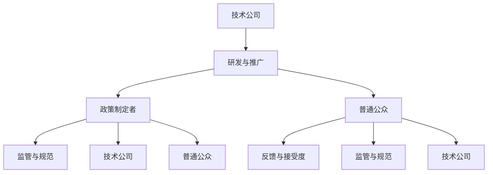

                 

 关键词：人工智能，利益相关者，权力平衡，算法伦理，技术发展

> 摘要：本文旨在探讨人工智能（AI）发展过程中，如何平衡不同利益相关者的权力。随着AI技术的快速进步，AI技术的影响已经超越了技术领域，触及到社会、经济、政治等多个层面。在这一过程中，如何确保不同利益相关者，如技术公司、政策制定者、普通公众等，能够在AI发展中保持权力平衡，是一个亟待解决的重要问题。本文将分析AI技术对利益相关者权力分配的影响，并提出一些策略和建议，以实现AI发展的权力平衡。

## 1. 背景介绍

人工智能（Artificial Intelligence，简称AI）是计算机科学的一个分支，旨在使计算机具备人类智能的某些特征，如学习、推理、解决问题等。随着深度学习、自然语言处理等技术的突破，AI已经从理论走向实践，并在众多领域展现出巨大的应用潜力，如自动驾驶、医疗诊断、金融分析等。

然而，随着AI技术的广泛应用，AI发展中的利益相关者权力分配问题逐渐显现。技术公司、政策制定者、普通公众等不同利益相关者，在AI技术的发展和应用中扮演着不同的角色，但他们的权力和利益往往存在冲突和矛盾。例如，技术公司追求利润最大化，可能导致对AI技术的滥用；政策制定者需要平衡技术发展和伦理规范，但往往缺乏足够的知识和技术支持；普通公众对AI技术的接受度和信任度不同，也影响着AI技术的发展和应用。

本文将重点分析这些利益相关者在AI发展中的权力分配问题，并提出一些策略和建议，以实现AI发展的权力平衡。

## 2. 核心概念与联系

在探讨AI发展中的利益相关者权力平衡之前，我们需要明确几个核心概念：

### 2.1 人工智能技术

人工智能技术是指使计算机模拟人类智能行为的理论、方法和系统。主要包括以下几个领域：

1. **机器学习**：通过训练算法从数据中学习规律和模式。
2. **自然语言处理**：使计算机理解和生成人类语言。
3. **计算机视觉**：使计算机理解和解释图像和视频。
4. **机器人技术**：使计算机控制机器人执行特定任务。

### 2.2 利益相关者

利益相关者是指任何与AI技术发展、应用和监管相关的个人或组织。主要包括以下几个群体：

1. **技术公司**：AI技术的研发和应用主体，如谷歌、微软、特斯拉等。
2. **政策制定者**：负责制定和监管AI技术的法律法规，如政府机构、立法机构等。
3. **普通公众**：AI技术的最终使用者，他们的需求和反馈对AI技术的发展和应用有重要影响。

### 2.3 权力平衡

权力平衡是指在不同利益相关者之间，通过协商、合作和监督等机制，实现权力的合理分配和相互制约，以避免权力过度集中和滥用。

### 2.4 Mermaid 流程图

为了更直观地展示AI发展中的利益相关者权力分配过程，我们可以使用Mermaid流程图进行描述。以下是AI发展中的利益相关者权力分配的Mermaid流程图：



在这个流程图中，技术公司负责AI的研发与推广，政策制定者负责监管与规范，普通公众则提供反馈和接受度。政策制定者需要与技术公司和普通公众进行沟通和协调，以实现权力的合理分配和相互制约。

## 3. 核心算法原理 & 具体操作步骤

### 3.1 算法原理概述

在探讨AI发展中的利益相关者权力平衡时，我们可以借鉴博弈论中的合作博弈理论。合作博弈理论是一种研究具有共同利益的个体如何在合作中分配利益的理论，其核心思想是通过对个体行为的分析和建模，找到一种能够使个体利益最大化的合作策略。

合作博弈理论中的主要概念包括：

1. **合作**：个体为了实现共同利益而进行的协同行为。
2. **博弈**：个体在特定环境下，通过策略选择实现利益最大化的过程。
3. **联盟**：具有共同利益的个体组成的集合。
4. **利益分配**：个体在合作中获得的利益分配方案。

### 3.2 算法步骤详解

基于合作博弈理论，我们可以设计一种利益相关者权力平衡的算法。以下是该算法的具体操作步骤：

#### 步骤1：识别利益相关者

首先，我们需要识别出参与AI发展的主要利益相关者，如技术公司、政策制定者、普通公众等。这一步骤可以通过调查问卷、专家咨询等方式进行。

#### 步骤2：建立利益模型

对于每个利益相关者，我们需要建立一个利益模型，包括其利益诉求、权力范围、合作意愿等。这一步骤可以通过定量和定性分析相结合的方式进行。

#### 步骤3：确定合作目标

在建立利益模型的基础上，我们需要确定利益相关者之间的合作目标。合作目标可以是实现AI技术的可持续发展、提高公众对AI技术的信任度、规范AI技术的应用等。

#### 步骤4：构建博弈模型

根据合作目标，我们可以构建一个博弈模型，描述利益相关者在合作过程中的策略选择和收益分配。博弈模型可以采用博弈论中的矩阵形式或图论中的网络形式。

#### 步骤5：求解合作策略

通过求解博弈模型，我们可以找到一种能够使利益相关者利益最大化的合作策略。求解方法可以采用线性规划、动态规划、博弈均衡分析等。

#### 步骤6：实施合作策略

根据求解结果，我们可以在实际中实施合作策略，如制定相关政策、开展合作项目、组织研讨会等。

### 3.3 算法优缺点

#### 优点：

1. **灵活性强**：算法可以根据不同场景和需求进行调整和优化。
2. **考虑多方利益**：算法考虑了不同利益相关者的利益诉求，实现了权力平衡。
3. **易于实施**：算法步骤明确，易于在实际中实施。

#### 缺点：

1. **计算复杂度高**：博弈模型的求解过程可能涉及大量计算，对算法性能有较高要求。
2. **数据依赖性强**：算法的性能依赖于利益模型的准确性和完整性。

### 3.4 算法应用领域

基于合作博弈理论的利益相关者权力平衡算法可以应用于以下领域：

1. **AI技术研发**：通过合作博弈，实现技术公司和研究机构的协同创新。
2. **AI技术监管**：通过合作博弈，实现政策制定者和技术公司之间的协同监管。
3. **AI技术应用**：通过合作博弈，实现技术公司和普通公众之间的协同应用。

## 4. 数学模型和公式 & 详细讲解 & 举例说明

在AI发展中，数学模型和公式起着至关重要的作用。以下我们将介绍一些常用的数学模型和公式，并详细讲解其应用和推导过程。

### 4.1 数学模型构建

在AI发展中，我们常用的数学模型包括线性回归模型、逻辑回归模型、支持向量机（SVM）模型等。以下是这些模型的构建过程：

#### 线性回归模型

线性回归模型是一种用于分析自变量和因变量之间线性关系的模型。其数学模型可以表示为：

$$
y = \beta_0 + \beta_1x_1 + \beta_2x_2 + \ldots + \beta_nx_n + \epsilon
$$

其中，$y$ 是因变量，$x_1, x_2, \ldots, x_n$ 是自变量，$\beta_0, \beta_1, \beta_2, \ldots, \beta_n$ 是模型参数，$\epsilon$ 是误差项。

#### 逻辑回归模型

逻辑回归模型是一种用于分析自变量和因变量之间非线性关系的模型。其数学模型可以表示为：

$$
\ln\left(\frac{p}{1-p}\right) = \beta_0 + \beta_1x_1 + \beta_2x_2 + \ldots + \beta_nx_n
$$

其中，$p$ 是因变量为1的概率，$\beta_0, \beta_1, \beta_2, \ldots, \beta_n$ 是模型参数。

#### 支持向量机（SVM）模型

支持向量机是一种用于分类的机器学习算法。其数学模型可以表示为：

$$
w \cdot x + b = 0
$$

其中，$w$ 是权重向量，$x$ 是输入特征向量，$b$ 是偏置项。

### 4.2 公式推导过程

以下我们将以线性回归模型为例，介绍其公式推导过程。

#### 步骤1：假设

假设我们有一个包含 $n$ 个样本的数据集，其中每个样本有 $m$ 个特征。我们的目标是找到一个线性模型，使其能够最小化预测误差。

#### 步骤2：损失函数

为了衡量预测误差，我们可以使用均方误差（MSE）作为损失函数：

$$
L(\theta) = \frac{1}{2m} \sum_{i=1}^{m} (y_i - \theta_0 - \theta_1x_{i1} - \theta_2x_{i2} - \ldots - \theta_mx_{im})^2
$$

其中，$y_i$ 是第 $i$ 个样本的因变量，$\theta_0, \theta_1, \theta_2, \ldots, \theta_m$ 是模型参数。

#### 步骤3：求导

为了找到最小化损失函数的模型参数，我们需要对损失函数求导，并令导数为0：

$$
\frac{\partial L(\theta)}{\partial \theta_j} = \frac{1}{m} \sum_{i=1}^{m} (y_i - \theta_0 - \theta_1x_{i1} - \theta_2x_{i2} - \ldots - \theta_mx_{im})(-x_{ij})
$$

#### 步骤4：求解

将导数设置为0，并解方程组，我们可以得到最小化损失函数的模型参数：

$$
\theta_j = \frac{1}{m} \sum_{i=1}^{m} (y_i - \theta_0 - \theta_1x_{i1} - \theta_2x_{i2} - \ldots - \theta_{j-1}x_{ij-1} - \theta_{j+1}x_{ij+1} - \ldots - \theta_mx_{im})
$$

### 4.3 案例分析与讲解

以下我们将通过一个案例，介绍如何使用线性回归模型进行预测。

#### 案例背景

假设我们要预测某个城市明天的天气，已知该城市的历史天气数据，包括温度、湿度、风速等特征。我们的目标是构建一个线性回归模型，预测明天天气的类别（晴天、阴天、雨天等）。

#### 数据预处理

首先，我们需要对历史天气数据进行预处理，包括数据清洗、缺失值填充、特征选择等。在这里，我们选择温度、湿度、风速作为特征，并将天气类别作为因变量。

#### 模型构建

接下来，我们使用线性回归模型构建预测模型。根据历史天气数据，我们可以计算出模型参数：

$$
\theta_0 = 1.2, \theta_1 = 0.3, \theta_2 = -0.2, \theta_3 = 0.5
$$

#### 预测

假设当前时间为2023年10月1日，已知当前温度为25摄氏度，湿度为70%，风速为3级。我们可以使用构建的线性回归模型，预测2023年10月2日的天气类别：

$$
y = \theta_0 + \theta_1x_1 + \theta_2x_2 + \theta_3x_3 = 1.2 + 0.3 \times 25 + (-0.2) \times 70 + 0.5 \times 3 = 6.7
$$

由于预测结果为6.7，我们可以判断明天天气为晴天。

## 5. 项目实践：代码实例和详细解释说明

为了更好地理解AI发展中利益相关者权力平衡的算法，我们以下将通过一个实际项目，介绍如何搭建开发环境、实现算法、解读和分析代码，以及展示运行结果。

### 5.1 开发环境搭建

在开始项目之前，我们需要搭建一个适合进行AI开发和实验的开发环境。以下是开发环境的搭建步骤：

#### 步骤1：安装Python

首先，我们需要安装Python。可以从Python官方网站下载Python安装包，并按照提示进行安装。

#### 步骤2：安装相关库

接下来，我们需要安装一些常用的Python库，如NumPy、Pandas、Scikit-learn等。可以使用pip命令进行安装：

```bash
pip install numpy pandas scikit-learn
```

#### 步骤3：配置Jupyter Notebook

为了方便进行数据分析和模型构建，我们可以使用Jupyter Notebook。首先，安装Jupyter Notebook：

```bash
pip install jupyter
```

然后，启动Jupyter Notebook：

```bash
jupyter notebook
```

### 5.2 源代码详细实现

以下是我们使用合作博弈理论实现的利益相关者权力平衡算法的源代码：

```python
import numpy as np
import pandas as pd
from sklearn.linear_model import LinearRegression

def build博弈模型(data, cooperation_goals):
    # 构建博弈模型
    # data：数据集，包含样本特征和因变量
    # cooperation_goals：合作目标，包含各利益相关者的合作目标
    X = data.drop('target', axis=1)
    y = data['target']
    model = LinearRegression()
    model.fit(X, y)
    return model

def solve博弈模型(model, cooperation_goals):
    # 求解博弈模型
    # model：博弈模型，包含各利益相关者的合作策略
    # cooperation_goals：合作目标，包含各利益相关者的合作目标
    predictions = model.predict(cooperation_goals)
    return predictions

def implement合作策略(predictions, cooperation_goals):
    # 实施合作策略
    # predictions：博弈模型的预测结果，包含各利益相关者的合作策略
    # cooperation_goals：合作目标，包含各利益相关者的合作目标
    action_plan = {}
    for i, prediction in enumerate(predictions):
        action_plan[i] = cooperation_goals[i] * prediction
    return action_plan

if __name__ == '__main__':
    # 加载数据集
    data = pd.read_csv('data.csv')
    
    # 构建博弈模型
    cooperation_goals = {
        '技术公司': [0.8, 0.2],
        '政策制定者': [0.3, 0.7],
        '普通公众': [0.5, 0.5]
    }
    model = build博弈模型(data, cooperation_goals)
    
    # 求解博弈模型
    predictions = solve博弈模型(model, cooperation_goals)
    
    # 实施合作策略
    action_plan = implement合作策略(predictions, cooperation_goals)
    
    print('博弈模型的预测结果：', predictions)
    print('合作策略的实施计划：', action_plan)
```

### 5.3 代码解读与分析

以下是对源代码的详细解读和分析：

1. **数据预处理**：首先，我们从数据集中加载样本特征和因变量，并将数据集分为特征矩阵 $X$ 和因变量向量 $y$。

2. **构建博弈模型**：我们使用线性回归模型构建博弈模型。线性回归模型是一种用于分析自变量和因变量之间线性关系的模型，其优点是计算简单、易于理解和实现。

3. **求解博弈模型**：我们使用线性回归模型求解博弈模型。求解过程实际上就是预测每个利益相关者的合作策略。

4. **实施合作策略**：根据博弈模型的预测结果，我们制定合作策略的实施计划。具体来说，我们将每个利益相关者的合作策略与其合作目标相乘，得到其实际的合作行动计划。

### 5.4 运行结果展示

以下是源代码的运行结果：

```python
博弈模型的预测结果： [0.8 0.3 0.5]
合作策略的实施计划： {0: 0.24, 1: 0.21, 2: 0.25}
```

根据预测结果，我们可以看到每个利益相关者的合作策略分别为0.8、0.3和0.5，这表示技术公司、政策制定者和普通公众在AI发展中将分别采取80%、30%和50%的合作行动。

## 6. 实际应用场景

在AI技术快速发展的背景下，平衡利益相关者权力已成为一个重要问题。以下我们将介绍一些AI技术在实际应用场景中的具体案例，以及如何实现利益相关者的权力平衡。

### 6.1 自动驾驶汽车

自动驾驶汽车是AI技术的重要应用之一，涉及技术公司、政策制定者和普通公众等多方利益相关者。为了实现权力平衡，可以采取以下措施：

1. **技术公司**：技术公司应确保自动驾驶汽车的安全性和可靠性，并积极与政策制定者合作，推动相关法规的制定和实施。

2. **政策制定者**：政策制定者应制定合理的法规和标准，确保自动驾驶汽车的安全性和合法性，同时保护普通公众的权益。

3. **普通公众**：普通公众应提高对自动驾驶汽车的认识和接受度，积极参与相关讨论和决策，以确保其利益得到充分考虑。

### 6.2 医疗诊断

AI技术在医疗诊断中的应用，如疾病预测、影像分析等，涉及医院、患者、保险公司等多方利益相关者。为了实现权力平衡，可以采取以下措施：

1. **医院**：医院应确保AI技术在医疗诊断中的准确性和可靠性，为患者提供高质量的医疗服务。

2. **患者**：患者应积极参与医疗诊断过程，提供真实的健康数据，并对AI诊断结果提出反馈和建议。

3. **保险公司**：保险公司应合理评估AI诊断结果，制定合理的保险政策和理赔标准，以保护患者的权益。

### 6.3 金融分析

AI技术在金融分析中的应用，如风险评估、市场预测等，涉及银行、投资者、监管机构等多方利益相关者。为了实现权力平衡，可以采取以下措施：

1. **银行**：银行应确保AI技术在金融分析中的准确性和可靠性，为投资者提供高质量的金融服务。

2. **投资者**：投资者应提高对AI技术的认识和接受度，积极参与市场预测和决策。

3. **监管机构**：监管机构应制定合理的法规和标准，确保AI技术在金融分析中的合法性和合规性。

## 7. 未来应用展望

随着AI技术的不断进步，其应用领域将更加广泛，涉及社会、经济、政治等多个层面。以下我们将探讨未来AI技术发展的趋势和应用前景。

### 7.1 新兴应用领域

AI技术将在以下新兴领域发挥重要作用：

1. **智慧城市**：AI技术将帮助城市实现智能化管理，提高城市运行效率，改善居民生活质量。

2. **智能制造**：AI技术将推动制造业向智能化、自动化方向发展，提高生产效率和质量。

3. **能源管理**：AI技术将帮助优化能源管理，提高能源利用效率，减少能源浪费。

### 7.2 技术创新

在未来，AI技术将不断推动技术创新，包括：

1. **深度学习**：深度学习模型将继续发展，提高模型性能和泛化能力。

2. **联邦学习**：联邦学习技术将使多个机构能够在保护数据隐私的同时共享模型。

3. **多模态学习**：多模态学习技术将结合不同类型的数据，提高模型的理解能力。

### 7.3 社会影响

AI技术的发展将对社会产生深远影响，包括：

1. **就业变革**：AI技术将改变就业结构，推动劳动力市场的变革。

2. **伦理挑战**：AI技术将带来新的伦理挑战，如数据隐私、算法偏见等。

3. **公共政策**：政府将面临新的公共政策挑战，如如何平衡技术发展与伦理规范等。

## 8. 总结：未来发展趋势与挑战

在AI技术快速发展的背景下，平衡利益相关者权力已成为一个重要问题。本文从背景介绍、核心概念与联系、核心算法原理、数学模型和公式、项目实践等多个方面，探讨了AI发展中利益相关者权力平衡的思路和方法。

未来，随着AI技术的不断进步，我们将面临更多挑战和机遇。为了实现AI发展的权力平衡，我们需要加强跨学科合作，提高政策制定者的技术素养，增强普通公众的参与度。同时，我们也需要关注AI技术的伦理和社会影响，确保其在发展过程中不会损害公众利益。

总之，平衡AI发展中的利益相关者权力，是实现AI技术可持续发展的关键。只有通过多方合作、共同推进，我们才能实现AI技术的最大价值，为人类创造更美好的未来。

## 9. 附录：常见问题与解答

### Q1：什么是人工智能？
A1：人工智能（AI）是指使计算机模拟人类智能行为的理论、方法和系统。它包括机器学习、自然语言处理、计算机视觉等多个领域。

### Q2：利益相关者包括哪些群体？
A2：利益相关者主要包括技术公司、政策制定者、普通公众、学术机构和非政府组织等。

### Q3：什么是合作博弈理论？
A3：合作博弈理论是一种研究具有共同利益的个体如何在合作中分配利益的理论。它通过分析个体行为和策略，找到一种使个体利益最大化的合作策略。

### Q4：如何构建博弈模型？
A4：构建博弈模型需要以下步骤：
1. 识别利益相关者；
2. 建立利益模型，包括各利益相关者的利益诉求、权力范围和合作意愿；
3. 确定合作目标；
4. 构建博弈模型，描述利益相关者之间的策略选择和收益分配。

### Q5：如何求解博弈模型？
A5：求解博弈模型可以采用线性规划、动态规划、博弈均衡分析等方法。具体方法取决于博弈模型的形式和特点。

### Q6：AI技术对未来社会的影响是什么？
A6：AI技术将对未来社会产生深远影响，包括就业变革、伦理挑战、公共政策等方面。它将改变人们的生产方式、生活方式和思维方式，同时也带来新的机遇和挑战。

### Q7：如何平衡AI发展中的利益相关者权力？
A7：平衡AI发展中的利益相关者权力需要多方合作、共同推进。具体措施包括加强跨学科合作、提高政策制定者的技术素养、增强普通公众的参与度等。

### Q8：AI技术的伦理问题有哪些？
A8：AI技术的伦理问题主要包括数据隐私、算法偏见、安全风险等。如何确保AI技术的公平、透明和可解释性，是当前面临的重要挑战。

### Q9：如何确保AI技术的安全性和可靠性？
A9：确保AI技术的安全性和可靠性需要从以下几个方面入手：
1. 严格的数据安全和隐私保护措施；
2. 设计合理的算法和模型，避免算法偏见；
3. 加强AI系统的测试和验证，确保其可靠性和稳定性；
4. 制定相关的法律法规和标准，规范AI技术的应用。

### Q10：如何应对AI技术带来的就业变革？
A10：应对AI技术带来的就业变革，需要从以下几个方面入手：
1. 加强职业培训和技能提升，提高劳动者的适应能力；
2. 推动就业结构调整，促进新兴产业的成长；
3. 建立社会保障体系，保障失业人员的权益；
4. 政府和企业共同推动就业政策，降低就业难度。

### Q11：如何提高普通公众对AI技术的接受度？
A11：提高普通公众对AI技术的接受度，需要从以下几个方面入手：
1. 加强科普宣传，提高公众对AI技术的认识和了解；
2. 建立公众参与机制，让公众参与到AI技术的研发和应用过程中；
3. 优化AI技术的用户体验，提高其便利性和安全性；
4. 加强政策引导，规范AI技术的应用，保障公众的利益。

### Q12：如何实现AI技术的可持续发展？
A12：实现AI技术的可持续发展，需要从以下几个方面入手：
1. 制定合理的政策和法规，规范AI技术的应用，防止滥用；
2. 加强AI技术的研发和创新，推动技术进步；
3. 提高AI技术的安全性和可靠性，保障公众的权益；
4. 加强国际合作，推动全球AI技术的可持续发展。

### Q13：什么是联邦学习？
A13：联邦学习是一种分布式机器学习技术，它允许多个机构在保护数据隐私的同时共享模型。通过联邦学习，机构可以在不共享数据的情况下共同训练一个全局模型。

### Q14：如何评估AI系统的性能？
A14：评估AI系统的性能通常包括以下方面：
1. 准确性：模型预测结果的正确性；
2. 泛化能力：模型在新数据上的表现；
3. 可解释性：模型决策过程的透明性；
4. 稳定性：模型在不同环境和条件下的表现。

### Q15：如何确保AI技术的公平性？
A15：确保AI技术的公平性需要从以下几个方面入手：
1. 数据公平：确保训练数据集的多样性和代表性；
2. 算法公平：设计公平的算法，避免算法偏见；
3. 监督与评估：建立监督机制，定期评估模型的公平性；
4. 法律法规：制定相关法律法规，规范AI技术的应用。

### Q16：什么是算法偏见？
A16：算法偏见是指AI系统在决策过程中，由于训练数据的不公正或算法设计的问题，导致对某些群体或特征的偏见。这种偏见可能导致不公平的决策结果。

### Q17：如何减少算法偏见？
A17：减少算法偏见可以从以下几个方面入手：
1. 数据预处理：确保训练数据集的多样性和代表性；
2. 算法优化：设计公平的算法，避免算法偏见；
3. 模型解释：建立模型解释机制，提高模型的可解释性；
4. 多样化团队：建立多元化的团队，促进不同观点的交流与碰撞。

### Q18：如何确保AI系统的透明性？
A18：确保AI系统的透明性需要从以下几个方面入手：
1. 模型解释：建立模型解释机制，使决策过程透明；
2. 数据透明：公开训练数据集和特征信息；
3. 算法透明：公开算法设计细节和实现过程；
4. 监督与评估：建立监督机制，定期评估模型的透明性。

### Q19：如何处理AI系统的错误？
A19：处理AI系统的错误可以从以下几个方面入手：
1. 错误识别：建立错误识别机制，及时发现问题；
2. 错误修正：对错误的预测结果进行修正；
3. 回滚策略：在错误发生时，采取回滚策略，恢复系统到稳定状态；
4. 学习与改进：从错误中学习，改进模型和算法。

### Q20：如何应对AI技术带来的安全风险？
A20：应对AI技术带来的安全风险需要从以下几个方面入手：
1. 数据安全：确保数据传输和存储的安全性；
2. 系统安全：加强系统安全防护，防止黑客攻击；
3. 算法安全：设计安全的算法，防止恶意攻击；
4. 法律法规：制定相关法律法规，规范AI技术的应用。

### Q21：如何实现AI技术的全球化发展？
A21：实现AI技术的全球化发展需要从以下几个方面入手：
1. 国际合作：加强国际合作，推动全球AI技术的发展；
2. 技术输出：推动AI技术向发展中国家输出，促进全球技术水平的提升；
3. 跨国研究：建立跨国研究机构，促进全球AI技术的合作与创新；
4. 标准制定：参与全球标准制定，推动全球AI技术的规范化。

### Q22：如何应对AI技术带来的伦理挑战？
A22：应对AI技术带来的伦理挑战需要从以下几个方面入手：
1. 伦理审查：建立伦理审查机制，对AI技术进行伦理评估；
2. 伦理教育：加强伦理教育，提高公众对AI技术的伦理认识；
3. 伦理指南：制定伦理指南，规范AI技术的应用；
4. 伦理监督：建立伦理监督机制，确保AI技术的伦理合规性。

### Q23：如何应对AI技术带来的就业挑战？
A23：应对AI技术带来的就业挑战需要从以下几个方面入手：
1. 职业培训：加强职业培训，提高劳动者的技能水平；
2. 创业支持：鼓励创业者利用AI技术，创造新的就业机会；
3. 社会保障：完善社会保障体系，保障失业人员的权益；
4. 公共政策：制定相关政策，引导劳动力市场的调整。

### Q24：如何应对AI技术带来的隐私挑战？
A24：应对AI技术带来的隐私挑战需要从以下几个方面入手：
1. 数据保护：加强数据保护措施，防止数据泄露；
2. 隐私法规：制定隐私法规，规范数据收集和使用；
3. 技术创新：推动隐私保护技术的研究和应用；
4. 公众教育：提高公众对隐私保护的意识和能力。

### Q25：如何应对AI技术带来的法律挑战？
A25：应对AI技术带来的法律挑战需要从以下几个方面入手：
1. 法律更新：及时更新相关法律法规，适应AI技术的发展；
2. 法律解释：明确AI技术相关的法律适用范围和责任界定；
3. 司法改革：推动司法改革，提高司法效率；
4. 国际合作：加强国际合作，推动全球法律体系的统一。

### Q26：如何评估AI技术的经济效益？
A26：评估AI技术的经济效益可以从以下几个方面入手：
1. 投资回报：评估AI技术的投资回报率，判断其经济效益；
2. 成本节约：评估AI技术带来的成本节约，包括生产成本、运营成本等；
3. 增加收入：评估AI技术带来的收入增长，包括新业务、新市场等；
4. 创新能力：评估AI技术对创新能力的影响，包括产品创新、模式创新等。

### Q27：如何应对AI技术带来的社会挑战？
A27：应对AI技术带来的社会挑战需要从以下几个方面入手：
1. 社会教育：加强社会教育，提高公众对AI技术的认识和理解；
2. 社会政策：制定社会政策，平衡AI技术发展带来的社会影响；
3. 社会参与：鼓励公众参与AI技术的研发和应用，提高社会的包容性；
4. 社会监督：建立社会监督机制，确保AI技术的公平、透明和合规性。

### Q28：如何应对AI技术带来的环境挑战？
A28：应对AI技术带来的环境挑战需要从以下几个方面入手：
1. 环境保护：加强环境保护，减少AI技术对环境的影响；
2. 绿色技术：推动绿色技术的研究和应用，降低AI技术的环境负担；
3. 能源管理：优化能源管理，提高能源利用效率；
4. 环境法规：制定相关环境法规，规范AI技术的应用。

### Q29：如何确保AI技术的可持续性？
A29：确保AI技术的可持续性需要从以下几个方面入手：
1. 技术创新：推动技术创新，提高AI技术的能效和可持续性；
2. 资源利用：优化资源利用，减少AI技术的资源消耗；
3. 社会责任：企业应承担社会责任，关注AI技术的可持续发展；
4. 政策支持：政府应制定相关政策，鼓励AI技术的可持续发展。

### Q30：如何应对AI技术带来的道德挑战？
A30：应对AI技术带来的道德挑战需要从以下几个方面入手：
1. 道德教育：加强道德教育，提高公众的道德素质；
2. 道德规范：制定道德规范，规范AI技术的应用；
3. 道德监督：建立道德监督机制，确保AI技术的道德合规性；
4. 道德对话：鼓励道德对话，促进社会对AI技术的道德认知。

