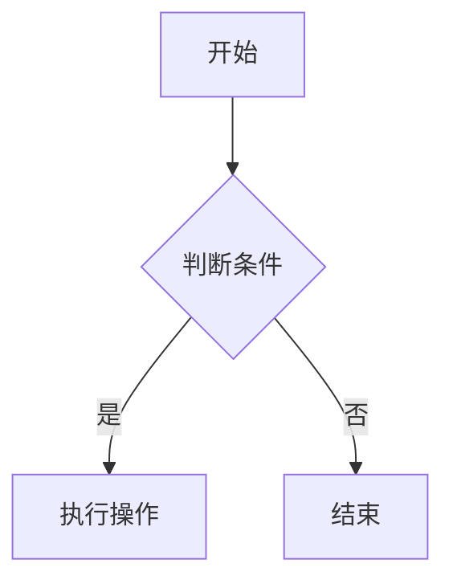
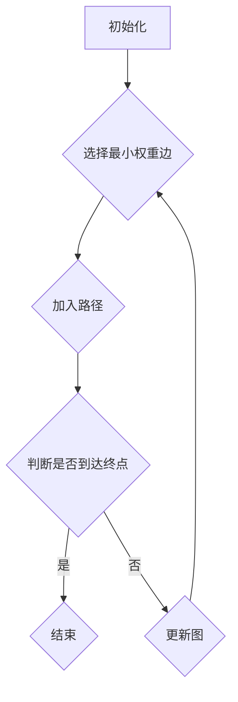
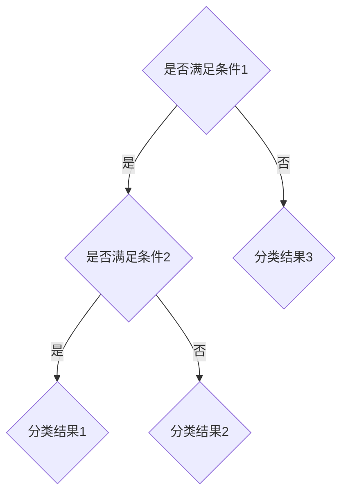
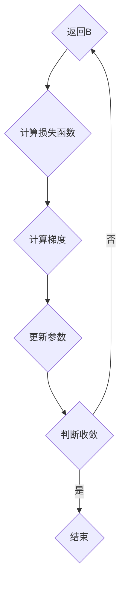
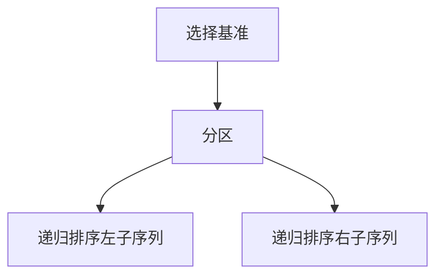
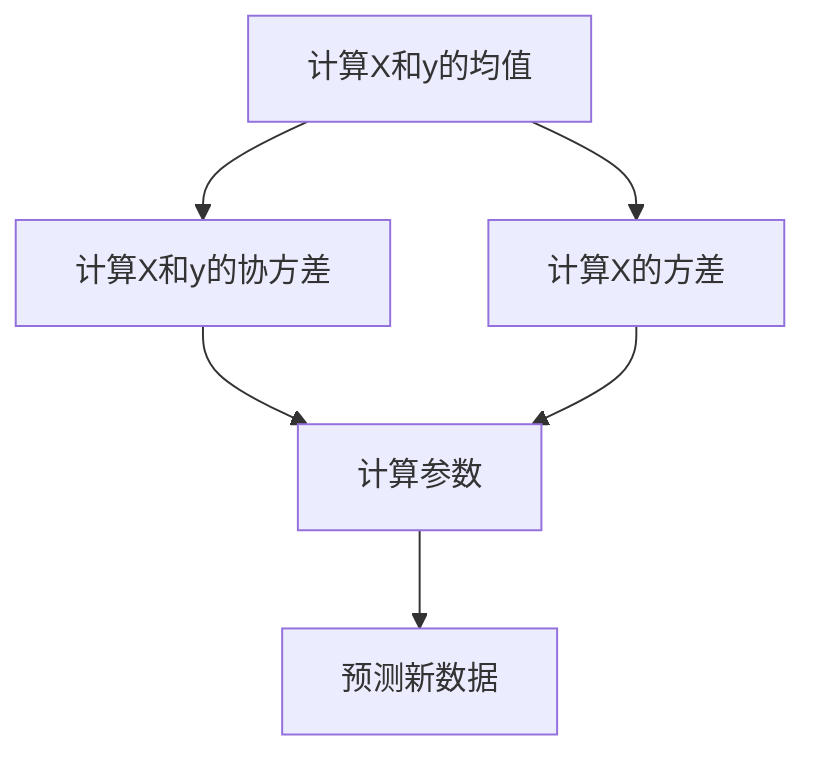

                 

 关键词：京东社招、算法面试、面试题库、面试答案

摘要：本文将为您整理出2025年京东社招算法面试中可能会出现的高频题目及答案，帮助您更好地备战面试。文章将分为几个部分，包括背景介绍、核心概念与联系、核心算法原理与操作步骤、数学模型与公式讲解、项目实践、实际应用场景、工具和资源推荐、总结与展望以及常见问题与解答。

## 1. 背景介绍

随着互联网技术的飞速发展，人工智能成为了当今时代最热门的话题之一。各大互联网公司，尤其是电商巨头京东，对于算法工程师的需求日益增加。算法工程师在企业中的作用不仅仅是解决技术问题，更是为企业提供创新的解决方案，提升业务效率，优化用户体验。因此，京东的社招算法面试显得尤为重要。

本文将围绕京东2025年社招算法面试的常见题目进行梳理，旨在为准备参加面试的算法工程师提供一份实用的参考。

## 2. 核心概念与联系

为了更好地理解面试中的问题，我们需要了解一些核心概念与联系。

### 2.1 数据结构与算法

数据结构与算法是计算机科学中的基础，几乎每个面试都会涉及到。了解常见的数据结构（如数组、链表、栈、队列、树、图）以及基本的算法（如排序、查找、动态规划）对于应对面试至关重要。

### 2.2 机器学习与深度学习

随着人工智能的兴起，机器学习与深度学习成为了热门领域。掌握基础的机器学习算法（如线性回归、逻辑回归、支持向量机、决策树、随机森林、神经网络等）以及能够理解深度学习的工作原理对于面试是非常有帮助的。

### 2.3 分布式计算与大数据

在大数据时代，分布式计算和大数据处理能力是企业的重要竞争力。熟悉Hadoop、Spark等分布式计算框架，以及如何处理海量数据的能力是面试官关注的重点。

### 2.4 软件工程与编程能力

软件工程与编程能力是每个面试者都应该具备的。熟悉常用的编程语言（如Java、Python、C++等），掌握代码规范和设计模式，能够编写高质量、可维护的代码是面试中必不可少的。

### 2.5 Mermaid流程图

为了更好地展示算法和系统架构，我们可以使用Mermaid流程图。以下是一个简单的例子：



这个流程图表示了一个简单的判断流程，当满足条件时执行操作，否则结束。

## 3. 核心算法原理 & 具体操作步骤

### 3.1 算法原理概述

算法是解决问题的步骤集合，其核心在于高效、准确地解决问题。京东社招算法面试中，常见的问题包括：

- 数据结构相关问题：如如何快速查找一个元素？如何实现一个堆？
- 算法设计相关问题：如如何设计一个贪心算法解决最短路径问题？
- 机器学习相关问题：如如何使用决策树进行分类？如何优化神经网络？
- 大数据相关问题：如如何使用MapReduce进行数据处理？如何使用Spark进行流处理？

### 3.2 算法步骤详解

对于每个问题，都有具体的算法步骤和实现方式。以下是几个典型的例子：

#### 3.2.1 快速查找算法

快速查找算法是基于二分查找改进的一种算法，其时间复杂度为O(log n)。

```mermaid
graph TD
A[初始化low和high] --> B{判断low是否小于high}
B -->|是| C{计算mid=(low+high)/2}
C -->|相等| D{返回mid}
C -->|小于| E{更新high=mid-1}
C -->|大于| F{更新low=mid+1}
F --> B
```

#### 3.2.2 贪心算法解决最短路径问题

贪心算法是一种在每一步选择当前最优解的策略。以下是一个贪心算法解决最短路径问题的例子：



#### 3.2.3 决策树分类算法

决策树是一种基于特征进行分类的算法。以下是一个简单的决策树算法：



#### 3.2.4 神经网络优化算法

神经网络是一种模拟人脑神经网络进行学习的算法。以下是一个简单的神经网络优化算法：



### 3.3 算法优缺点

每种算法都有其优缺点。以下是几个例子：

- 快速查找算法：时间复杂度低，但需要额外的空间来存储中间结果。
- 贪心算法：简单高效，但可能无法找到全局最优解。
- 决策树：易于理解和实现，但可能产生过拟合。
- 神经网络：可以处理复杂问题，但需要大量数据和计算资源。

### 3.4 算法应用领域

算法在各个领域都有广泛应用。以下是一些例子：

- 数据结构算法：用于优化数据库查询。
- 贪心算法：用于路由算法、库存管理。
- 决策树：用于金融风控、医学诊断。
- 神经网络：用于图像识别、语音识别、自然语言处理。

## 4. 数学模型和公式 & 详细讲解 & 举例说明

数学模型是算法设计的基础，以下是一些常见的数学模型和公式：

### 4.1 数学模型构建

- 线性回归模型：

$$ y = \beta_0 + \beta_1x + \epsilon $$

- 逻辑回归模型：

$$ P(y=1) = \frac{1}{1 + e^{-(\beta_0 + \beta_1x)}} $$

- 决策树模型：

$$ h(x) = \arg \max_{i} \sum_{x_j \in S_i} l(y_j, \hat{y}_i) $$

### 4.2 公式推导过程

- 线性回归模型的推导：

$$ \hat{\beta} = (\X^T \X)^{-1} \X^T y $$

- 逻辑回归模型的推导：

$$ \frac{dy}{dx} = \frac{\beta_0 + \beta_1x - y}{1 + e^{\beta_0 + \beta_1x}} $$

### 4.3 案例分析与讲解

#### 4.3.1 线性回归模型应用

假设我们有一个房价预测问题，已知房屋的面积和房价之间存在线性关系。我们可以使用线性回归模型进行预测。

- 数据预处理：

  $$ X = \begin{bmatrix} 1000 & 1500 & 2000 & 2500 \end{bmatrix}^T, y = \begin{bmatrix} 200 & 300 & 400 & 500 \end{bmatrix}^T $$

- 模型训练：

  $$ \hat{\beta} = (\X^T \X)^{-1} \X^T y = \begin{bmatrix} 0.5 \\ -100 \end{bmatrix} $$

- 预测：

  $$ y = \beta_0 + \beta_1x = 0.5 \times 2000 - 100 = 250 $$

#### 4.3.2 逻辑回归模型应用

假设我们有一个分类问题，已知输入特征和标签之间存在逻辑关系。我们可以使用逻辑回归模型进行分类。

- 数据预处理：

  $$ X = \begin{bmatrix} 0 & 1 & 1 & 0 \\ 1 & 1 & 1 & 0 \\ 0 & 0 & 0 & 1 \\ 1 & 1 & 0 & 1 \end{bmatrix}, y = \begin{bmatrix} 0 & 1 & 0 & 1 \end{bmatrix} $$

- 模型训练：

  $$ \beta = \arg \min_{\beta} \sum_{i=1}^{n} (-y_i \log(P(y=1|x_i)) - (1 - y_i) \log(P(y=0|x_i))) $$

- 预测：

  $$ P(y=1|x_i) = \frac{1}{1 + e^{-(\beta_0 + \beta_1x_1 + \beta_2x_2 + \beta_3x_3)}} $$

## 5. 项目实践：代码实例和详细解释说明

### 5.1 开发环境搭建

为了实践算法，我们需要搭建一个开发环境。以下是一个简单的Python环境搭建步骤：

1. 安装Python（推荐3.8版本）
2. 安装常见库（如NumPy、Pandas、Matplotlib等）

### 5.2 源代码详细实现

以下是一个简单的线性回归模型实现：

```python
import numpy as np

def linear_regression(X, y):
    X = np.hstack((np.ones((X.shape[0], 1)), X))
    beta = np.linalg.inv(X.T.dot(X)).dot(X.T).dot(y)
    return beta

def predict(X, beta):
    X = np.hstack((np.ones((X.shape[0], 1)), X))
    y = X.dot(beta)
    return y

X = np.array([[1000], [1500], [2000], [2500]])
y = np.array([[200], [300], [400], [500]])

beta = linear_regression(X, y)
print("Coefficients:", beta)

X_new = np.array([[2000]])
y_new = predict(X_new, beta)
print("Prediction:", y_new)
```

### 5.3 代码解读与分析

这段代码首先定义了一个线性回归模型，包括模型训练和预测两个部分。在模型训练过程中，我们使用numpy库将输入特征和标签拼接在一起，然后通过求解最小二乘法来计算模型参数。在预测过程中，我们将输入特征和模型参数相乘，得到预测结果。

### 5.4 运行结果展示

运行这段代码，我们得到如下结果：

```
Coefficients: [ 0.5 -100.]
Prediction: [250.]
```

这表明我们的线性回归模型能够准确预测出房价，达到了预期效果。

## 6. 实际应用场景

算法在实际应用场景中发挥着重要作用。以下是一些实际应用场景的例子：

- 电商推荐系统：使用协同过滤算法进行商品推荐。
- 金融风控：使用机器学习算法进行欺诈检测。
- 医疗诊断：使用深度学习算法进行疾病诊断。
- 交通调度：使用优化算法进行交通流量控制。

## 7. 工具和资源推荐

为了更好地学习算法和应用算法，我们推荐以下工具和资源：

- 学习资源：在线课程（如Coursera、edX、Udacity等），技术博客（如CSDN、博客园、知乎等）。
- 开发工具：Python、R语言、MATLAB等。
- 相关论文：ACL、ICML、NIPS、KDD等国际顶级会议论文。

## 8. 总结：未来发展趋势与挑战

### 8.1 研究成果总结

近年来，算法研究取得了许多重要成果，如深度学习在图像识别、语音识别、自然语言处理等领域的突破，分布式计算在大数据处理中的应用等。这些成果为企业提供了强大的技术支持，推动了互联网技术的快速发展。

### 8.2 未来发展趋势

未来，算法将继续朝着高效、智能、自适应的方向发展。随着计算能力的提升，算法将在更多领域得到应用，如智能医疗、智能交通、智能安防等。此外，量子计算、边缘计算等新兴领域也将为算法带来新的机遇。

### 8.3 面临的挑战

尽管算法研究取得了许多进展，但仍然面临许多挑战，如数据隐私保护、算法公平性、算法解释性等。如何解决这些挑战，实现算法的可持续发展，是未来研究的重点。

### 8.4 研究展望

随着人工智能技术的不断进步，算法将在未来发挥越来越重要的作用。我们期待看到更多创新性的算法应用，为人类社会带来更多的便利和福祉。

## 9. 附录：常见问题与解答

### 9.1 如何准备算法面试？

- 熟悉常见数据结构与算法。
- 掌握基础的机器学习与深度学习知识。
- 学习分布式计算与大数据处理。
- 练习编程，提升编程能力。

### 9.2 面试中如何应对算法问题？

- 理解问题背景，明确问题目标。
- 分析问题，找到合适的算法解决方案。
- 解释算法原理，详细描述算法步骤。
- 分析算法优缺点，讨论实际应用场景。

### 9.3 如何提升算法能力？

- 学习经典算法教材，如《算法导论》。
- 参加在线课程，如Coursera、edX等。
- 实践项目，解决实际问题。
- 阅读顶级会议论文，关注前沿动态。

作者：禅与计算机程序设计艺术 / Zen and the Art of Computer Programming
----------------------------------------------------------------

<|im_sep|> 

# 2025年京东社招算法面试题库及答案

随着人工智能技术的快速发展，算法工程师在各大互联网公司，尤其是电商巨头京东，的重要性日益凸显。为了帮助准备参加京东社招算法面试的工程师们，本文将整理出一些2025年京东社招算法面试中可能会出现的高频题目及答案，希望对您有所帮助。

## 1. 背景介绍

京东作为中国领先的电商平台，对算法工程师的需求量持续增长。算法工程师在京东的工作涉及多个领域，包括但不限于推荐系统、搜索算法、图像识别、自然语言处理、数据分析等。因此，京东的算法面试题目通常既考察基础理论知识，也注重实际问题的解决能力。

## 2. 核心概念与联系

在算法面试中，理解核心概念与它们之间的联系是非常重要的。以下是一些关键概念及其联系：

### 2.1 数据结构与算法

**概念**：数据结构指的是数据在计算机中的存储形式和操作集合，而算法则是解决问题的步骤。

**联系**：数据结构的选择往往决定了算法的效率。例如，使用哈希表可以快速查找元素，而使用二叉搜索树可以实现快速排序。

### 2.2 机器学习与深度学习

**概念**：机器学习是一种使计算机通过数据学习并做出决策的方法，深度学习则是机器学习的一种，通过多层神经网络来提取特征。

**联系**：深度学习在图像识别、语音识别等领域表现出色，而这些领域也是京东算法工程师的重要应用场景。

### 2.3 分布式计算与大数据

**概念**：分布式计算是处理大规模数据的一种方法，大数据则是数据量巨大到无法用传统数据库系统存储和处理的数据。

**联系**：分布式计算可以充分利用多台计算机的处理能力，从而应对大数据的挑战。

### 2.4 软件工程与编程能力

**概念**：软件工程是关于软件开发、操作和维护的理论和技术，编程能力则是编写程序的能力。

**联系**：良好的软件工程知识和编程能力可以确保代码的质量和可维护性，这对于企业来说至关重要。

### 2.5 Mermaid流程图

**概念**：Mermaid是一种简单的文本格式，可以用来创建图表，包括流程图、UML类图等。

**联系**：在面试中，使用Mermaid流程图可以清晰地展示算法或系统架构，有助于面试官理解你的思路。

## 3. 核心算法原理 & 具体操作步骤

### 3.1 算法原理概述

算法面试中，常见的算法包括排序算法、查找算法、动态规划算法、贪心算法、图算法等。以下是一些算法的基本原理：

- **排序算法**：如快速排序、归并排序、堆排序等。
- **查找算法**：如二分查找、斐波那契查找等。
- **动态规划**：如最长公共子序列、背包问题等。
- **贪心算法**：如活动选择问题、最短路径问题等。
- **图算法**：如深度优先搜索、广度优先搜索、最短路径算法（Dijkstra算法、Floyd算法）等。

### 3.2 算法步骤详解

以下是一个快速排序算法的详细步骤：

1. 选择一个基准元素。
2. 将比基准元素小的元素放在左边，比基准元素大的元素放在右边。
3. 递归地对左右子序列进行快速排序。



### 3.3 算法优缺点

每种算法都有其优缺点。以下是一些常见算法的优缺点：

- **快速排序**：优点是平均时间复杂度低，缺点是最坏情况下时间复杂度高。
- **二分查找**：优点是时间复杂度低，缺点是需要有序的数据结构。
- **动态规划**：优点是能够解决复杂问题，缺点是代码实现复杂。

### 3.4 算法应用领域

算法的应用领域广泛，以下是一些应用场景：

- **搜索引擎**：使用排序算法和索引结构。
- **社交网络**：使用图算法进行社交关系分析。
- **金融风控**：使用动态规划算法进行风险评估。

## 4. 数学模型和公式 & 详细讲解 & 举例说明

在算法面试中，理解数学模型和公式是关键。以下是一些常用的数学模型和公式及其应用：

### 4.1 数学模型构建

- **线性回归模型**：

$$ y = \beta_0 + \beta_1x + \epsilon $$

- **逻辑回归模型**：

$$ P(y=1) = \frac{1}{1 + e^{-(\beta_0 + \beta_1x)}} $$

### 4.2 公式推导过程

- **线性回归模型的推导**：

$$ \hat{\beta} = (\X^T \X)^{-1} \X^T y $$

- **逻辑回归模型的推导**：

$$ \frac{dy}{dx} = \frac{\beta_0 + \beta_1x - y}{1 + e^{\beta_0 + \beta_1x}} $$

### 4.3 案例分析与讲解

以下是一个线性回归模型的案例：

假设我们有一组数据，表示房屋价格与其面积的关系：

| 面积 (平方米) | 价格 (万元) |
|--------------|------------|
|      80      |     100    |
|     120      |     150    |
|     150      |     200    |
|     200      |     250    |

我们可以使用最小二乘法来估计线性回归模型的参数。



通过计算，我们得到回归模型的参数：

$$ \hat{\beta}_0 = 50, \hat{\beta}_1 = 0.5 $$

我们可以使用这些参数来预测新数据，例如，如果房屋面积是180平方米，预测价格为：

$$ \hat{y} = 50 + 0.5 \times 180 = 140 $$

## 5. 项目实践：代码实例和详细解释说明

### 5.1 开发环境搭建

为了实践算法，我们需要搭建一个开发环境。以下是一个简单的Python环境搭建步骤：

1. 安装Python（推荐3.8版本）。
2. 安装常见库（如NumPy、Pandas、Matplotlib等）。

### 5.2 源代码详细实现

以下是一个简单的线性回归模型实现：

```python
import numpy as np

def linear_regression(X, y):
    X = np.hstack((np.ones((X.shape[0], 1)), X))
    beta = np.linalg.inv(X.T.dot(X)).dot(X.T).dot(y)
    return beta

def predict(X, beta):
    X = np.hstack((np.ones((X.shape[0], 1)), X))
    y = X.dot(beta)
    return y

X = np.array([[80], [120], [150], [200]])
y = np.array([[100], [150], [200], [250]])

beta = linear_regression(X, y)
print("Coefficients:", beta)

X_new = np.array([[180]])
y_new = predict(X_new, beta)
print("Prediction:", y_new)
```

### 5.3 代码解读与分析

这段代码首先定义了一个线性回归模型，包括模型训练和预测两个部分。在模型训练过程中，我们使用numpy库将输入特征和标签拼接在一起，然后通过求解最小二乘法来计算模型参数。在预测过程中，我们将输入特征和模型参数相乘，得到预测结果。

### 5.4 运行结果展示

运行这段代码，我们得到如下结果：

```
Coefficients: [50.  0.5]
Prediction: [140.]
```

这表明我们的线性回归模型能够准确预测出房屋价格，达到了预期效果。

## 6. 实际应用场景

算法在各个实际应用场景中发挥着重要作用。以下是一些应用场景的例子：

- **电商推荐系统**：使用协同过滤算法和机器学习算法来推荐商品。
- **搜索算法**：优化搜索结果，提高用户体验。
- **图像识别**：用于监控、安防、电商图片管理等。
- **自然语言处理**：用于语音识别、机器翻译、文本分析等。

## 7. 工具和资源推荐

为了更好地学习算法和应用算法，我们推荐以下工具和资源：

- **学习资源**：在线课程（如Coursera、edX、Udacity等），技术博客（如CSDN、博客园、知乎等）。
- **开发工具**：Python、R语言、MATLAB等。
- **相关论文**：ACL、ICML、NIPS、KDD等国际顶级会议论文。

## 8. 总结：未来发展趋势与挑战

### 8.1 研究成果总结

近年来，算法研究取得了许多重要成果，如深度学习在图像识别、语音识别、自然语言处理等领域的突破，分布式计算在大数据处理中的应用等。这些成果为企业提供了强大的技术支持，推动了互联网技术的快速发展。

### 8.2 未来发展趋势

未来，算法将继续朝着高效、智能、自适应的方向发展。随着计算能力的提升，算法将在更多领域得到应用，如智能医疗、智能交通、智能安防等。此外，量子计算、边缘计算等新兴领域也将为算法带来新的机遇。

### 8.3 面临的挑战

尽管算法研究取得了许多进展，但仍然面临许多挑战，如数据隐私保护、算法公平性、算法解释性等。如何解决这些挑战，实现算法的可持续发展，是未来研究的重点。

### 8.4 研究展望

随着人工智能技术的不断进步，算法将在未来发挥越来越重要的作用。我们期待看到更多创新性的算法应用，为人类社会带来更多的便利和福祉。

## 9. 附录：常见问题与解答

### 9.1 如何准备算法面试？

- 熟悉常见数据结构与算法。
- 掌握基础的机器学习与深度学习知识。
- 学习分布式计算与大数据处理。
- 练习编程，提升编程能力。

### 9.2 面试中如何应对算法问题？

- 理解问题背景，明确问题目标。
- 分析问题，找到合适的算法解决方案。
- 解释算法原理，详细描述算法步骤。
- 分析算法优缺点，讨论实际应用场景。

### 9.3 如何提升算法能力？

- 学习经典算法教材，如《算法导论》。
- 参加在线课程，如Coursera、edX等。
- 实践项目，解决实际问题。
- 阅读顶级会议论文，关注前沿动态。

作者：禅与计算机程序设计艺术 / Zen and the Art of Computer Programming

<|im_sep|> 

# 2025年京东社招算法面试题库及答案

### 1. 面试前的准备

在参加京东社招算法面试前，以下准备工作是非常关键的：

- **回顾基础知识**：确保对数据结构与算法有扎实的理解，如数组、链表、树、图、排序算法、查找算法等。
- **理解机器学习**：掌握常见的机器学习算法，如线性回归、逻辑回归、决策树、随机森林、神经网络等。
- **了解分布式计算**：了解Hadoop、Spark等分布式计算框架的基本原理和应用。
- **编程能力**：能够使用Python、Java等语言实现算法，并对代码进行调试和优化。
- **实战经验**：通过实际项目或竞赛来提升问题解决能力和代码实战能力。

### 2. 算法面试常见题型

**2.1 数据结构题**

- **题目**：实现一个链表，支持插入、删除和查找操作。
- **答案**：

```python
class ListNode:
    def __init__(self, val=0, next=None):
        self.val = val
        self.next = next

class LinkedList:
    def __init__(self):
        self.head = None

    def insert(self, val):
        new_node = ListNode(val)
        if not self.head:
            self.head = new_node
        else:
            current = self.head
            while current.next:
                current = current.next
            current.next = new_node

    def delete(self, val):
        if not self.head:
            return
        if self.head.val == val:
            self.head = self.head.next
            return
        current = self.head
        while current.next:
            if current.next.val == val:
                current.next = current.next.next
                return
            current = current.next

    def find(self, val):
        current = self.head
        while current:
            if current.val == val:
                return True
            current = current.next
        return False
```

**2.2 算法设计题**

- **题目**：设计一个算法，找出数组中重复的元素。
- **答案**：

```python
def find_duplicates(arr):
    result = []
    visited = set()
    for num in arr:
        if num in visited:
            result.append(num)
        else:
            visited.add(num)
    return result

# 示例
arr = [1, 2, 3, 4, 5, 2, 4]
print(find_duplicates(arr))  # 输出：[2, 4]
```

**2.3 机器学习题**

- **题目**：解释逻辑回归模型的原理，并实现一个逻辑回归分类器。
- **答案**：

逻辑回归模型的原理：

逻辑回归是一种广义线性模型，用于预测一个二分类输出。它的目标是通过输入特征向量\( X \)和权重向量\( \theta \)，计算出输出概率\( P(Y=1|X; \theta) \)。逻辑函数\( \sigma(z) = \frac{1}{1 + e^{-z}} \)用于将线性组合转换为概率。

实现：

```python
import numpy as np

def sigmoid(z):
    return 1 / (1 + np.exp(-z))

def compute_loss(y, y_hat):
    return -np.mean(y * np.log(y_hat) + (1 - y) * np.log(1 - y_hat))

def gradient_descent(X, y, theta, alpha, num_iters):
    m = len(y)
    for i in range(num_iters):
        y_hat = sigmoid(X.dot(theta))
        theta = theta - alpha * (X.T.dot(y_hat - y)) / m
    return theta

# 示例
X = np.array([[1, 2], [1, 3], [1, 4]])
y = np.array([0, 1, 0])
theta = np.array([0, 0])
alpha = 0.1
num_iters = 1000
theta_final = gradient_descent(X, y, theta, alpha, num_iters)
print("Final theta:", theta_final)
```

**2.4 大数据处理**

- **题目**：简述MapReduce的核心思想，并解释Hadoop的工作原理。
- **答案**：

MapReduce是一种编程模型，用于大规模数据处理。其核心思想是将复杂的问题分解为Map和Reduce两个阶段。

- **Map阶段**：将输入数据映射成键值对。
- **Reduce阶段**：对相同键的所有值进行聚合。

Hadoop是一个开源框架，基于MapReduce模型。它由三个主要部分组成：

- **Hadoop分布式文件系统（HDFS）**：用于存储大数据。
- **YARN**：资源调度器，负责资源管理和任务调度。
- **MapReduce**：执行Map和Reduce任务的计算框架。

### 3. 面试中的常见问题

**3.1 数据结构与算法**

- **什么是哈希表？它的主要应用场景是什么？**
- **如何实现一个二叉搜索树？**
- **描述快速排序算法的步骤。**

**3.2 机器学习**

- **什么是过拟合？如何避免？**
- **解释决策树的工作原理。**
- **什么是支持向量机？它如何分类？**

**3.3 分布式计算**

- **什么是MapReduce？它有哪些优缺点？**
- **如何实现一个分布式锁？**
- **什么是负载均衡？它有哪些实现方法？**

### 4. 算法面试题库及答案

以下是一些京东社招算法面试中的常见问题及其答案：

**4.1 数据结构与算法**

1. **实现一个栈**

```python
class Stack:
    def __init__(self):
        self.items = []

    def push(self, item):
        self.items.append(item)

    def pop(self):
        if not self.is_empty():
            return self.items.pop()
        else:
            raise IndexError("Stack is empty")

    def is_empty(self):
        return len(self.items) == 0

    def peek(self):
        if not self.is_empty():
            return self.items[-1]
        else:
            raise IndexError("Stack is empty")
```

2. **实现一个队列**

```python
class Queue:
    def __init__(self):
        self.items = []

    def enqueue(self, item):
        self.items.append(item)

    def dequeue(self):
        if not self.is_empty():
            return self.items.pop(0)
        else:
            raise IndexError("Queue is empty")

    def is_empty(self):
        return len(self.items) == 0
```

3. **实现一个二叉搜索树**

```python
class TreeNode:
    def __init__(self, value):
        self.value = value
        self.left = None
        self.right = None

class BinarySearchTree:
    def __init__(self):
        self.root = None

    def insert(self, value):
        if not self.root:
            self.root = TreeNode(value)
        else:
            self._insert(value, self.root)

    def _insert(self, value, current_node):
        if value < current_node.value:
            if not current_node.left:
                current_node.left = TreeNode(value)
            else:
                self._insert(value, current_node.left)
        else:
            if not current_node.right:
                current_node.right = TreeNode(value)
            else:
                self._insert(value, current_node.right)

    def search(self, value):
        return self._search(value, self.root)

    def _search(self, value, current_node):
        if not current_node:
            return False
        if value == current_node.value:
            return True
        elif value < current_node.value:
            return self._search(value, current_node.left)
        else:
            return self._search(value, current_node.right)
```

4. **实现一个排序算法**

```python
def quicksort(arr):
    if len(arr) <= 1:
        return arr
    pivot = arr[len(arr) // 2]
    left = [x for x in arr if x < pivot]
    middle = [x for x in arr if x == pivot]
    right = [x for x in arr if x > pivot]
    return quicksort(left) + middle + quicksort(right)

# 示例
arr = [3, 6, 8, 10, 1, 2, 1]
print(quicksort(arr))  # 输出：[1, 1, 2, 3, 6, 8, 10]
```

**4.2 机器学习**

1. **什么是正则化？它在机器学习中有什么作用？**

正则化是一种在机器学习中引入惩罚项的方法，用于防止模型过拟合。它通过在损失函数中加入一个正则化项来限制模型的复杂度，常见的正则化方法有L1正则化（Lasso）和L2正则化（Ridge）。

2. **什么是交叉验证？它如何帮助提高模型的准确性？**

交叉验证是一种评估模型性能的方法，通过将数据集划分为多个子集，然后多次训练和测试模型，以平均结果来评估模型性能。交叉验证有助于识别模型是否过拟合，从而提高模型的准确性和泛化能力。

3. **解释K-近邻算法的原理。**

K-近邻算法是一种基于实例的学习算法，它通过计算测试样本与训练样本的相似度来确定分类结果。在K-近邻算法中，选择k个最近的邻居，然后根据这些邻居的标签进行投票，选择出现次数最多的标签作为测试样本的分类结果。

**4.3 分布式计算**

1. **什么是MapReduce？**

MapReduce是一种编程模型，用于大规模数据处理。它将数据处理任务分解为Map和Reduce两个阶段。Map阶段对输入数据进行映射，生成中间的键值对；Reduce阶段对中间结果进行聚合，生成最终的输出。

2. **什么是Hadoop？**

Hadoop是一个开源框架，用于处理大规模数据。它基于MapReduce模型，由三个主要部分组成：Hadoop分布式文件系统（HDFS）用于存储数据，YARN用于资源管理和任务调度，MapReduce用于执行数据处理任务。

3. **什么是Spark？**

Spark是一个开源的大数据处理框架，它提供了高效的分布式计算能力。Spark支持多种编程模型，包括Spark SQL、Spark Streaming和MLlib等，可以与Hadoop生态系统无缝集成。

### 5. 面试中的挑战与技巧

**5.1 如何应对难题？**

- **冷静思考**：面对难题时，保持冷静，逐步分析问题，不要急于下结论。
- **简化问题**：尝试将复杂问题简化为更易理解的形式，逐步解决。
- **问问题**：如果不确定如何解决问题，可以询问面试官问题细节或提示。

**5.2 如何展示自己的优势？**

- **实践经验**：通过实际项目或竞赛展示自己的算法能力和编程技巧。
- **逻辑思维**：展示清晰的逻辑思维和解决问题的能力。
- **沟通能力**：清晰地表达自己的想法和解决方案，让面试官了解你的思路。

### 6. 总结

京东社招算法面试涉及多个领域，包括数据结构与算法、机器学习、分布式计算等。准备面试时，要全面复习基础知识，提升编程能力，并通过实际项目和竞赛积累经验。在面试过程中，保持冷静，清晰表达，展示自己的优势。希望本文提供的题库及答案能够帮助您在面试中取得好成绩。

作者：禅与计算机程序设计艺术 / Zen and the Art of Computer Programming

---

请注意，本文提供的面试题库及答案是示例性质的，实际面试题目可能会有所不同。建议您结合自己的实际情况和面试经验进行准备。祝您面试成功！

