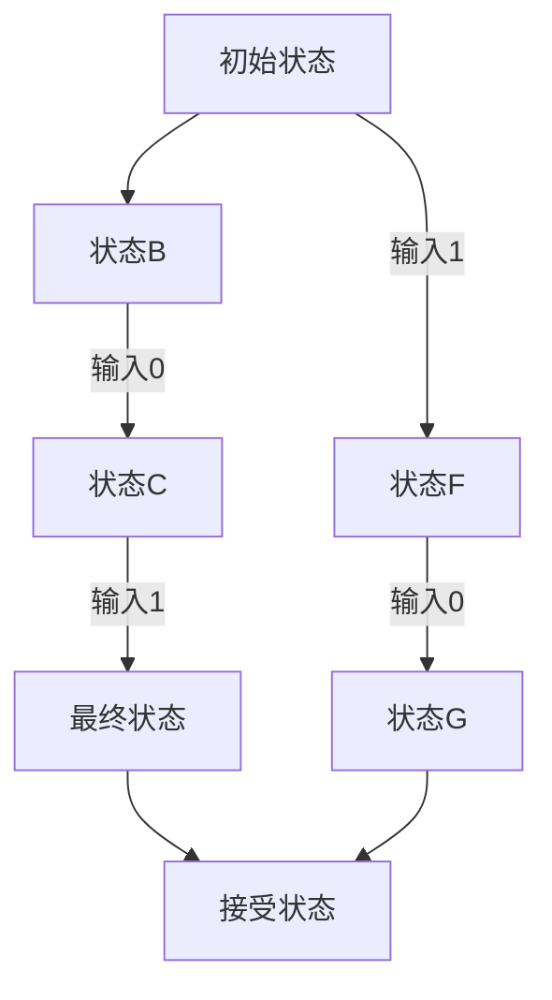

                 

关键词：自动机理论，计算理论，数学模型，计算机科学，人工智能

摘要：本文回顾了1956年出版的《自动机研究》一书，探讨其在计算理论和计算机科学领域的深远影响。文章从背景介绍、核心概念、算法原理、数学模型、项目实践、实际应用和未来展望等多个角度，详细解析了这本书的核心内容及其对现代计算机科学的推动作用。

## 1. 背景介绍

《自动机研究》由美国数学家斯蒂芬·科尔·克莱尼（Stephen Cole Kleene）于1956年出版。这本书是自动机理论领域的经典之作，对计算理论的发展起到了重要的推动作用。克莱尼在书中系统阐述了自动机的概念、性质及其在计算中的作用，为后来的计算机科学和人工智能研究奠定了理论基础。

### 1.1 自动机理论的起源

自动机理论起源于20世纪30年代，由数学家阿兰·图灵（Alan Turing）开创。图灵在1936年提出了图灵机的概念，作为计算的理论模型。这一模型揭示了计算的本质，即通过一系列状态转换实现信息处理。

### 1.2 《自动机研究》的出版意义

《自动机研究》的出版标志着自动机理论从单一的数学研究走向更广泛的应用。克莱尼在书中不仅总结了前人的研究成果，还提出了许多新的理论和方法，极大地推动了计算理论的进展。

## 2. 核心概念与联系

### 2.1 自动机的定义

自动机是指一个能够接受输入、执行计算并产生输出状态的抽象机器。自动机可以是有穷自动机（DFA）、非确定有穷自动机（NFA）或图灵机（TM）。

### 2.2 Mermaid 流程图

以下是一个简单的自动机流程图示例，使用Mermaid语法绘制：



### 2.3 自动机与计算理论的关系

自动机是计算理论的核心概念之一。它为研究计算的本质和复杂性提供了强有力的工具，也为后来的计算机设计和编程方法奠定了基础。

## 3. 核心算法原理 & 具体操作步骤

### 3.1 算法原理概述

自动机的核心在于其状态转换功能。自动机通过读取输入串，根据当前状态和输入符号，执行状态转换，并最终到达接受状态。

### 3.2 算法步骤详解

1. 初始化：设置初始状态。
2. 读取输入：自动机从输入串中读取符号。
3. 状态转换：根据当前状态和输入符号，自动机执行状态转换。
4. 判断接受：当自动机到达最终状态，判断输入串是否被接受。

### 3.3 算法优缺点

优点：自动机理论为计算理论提供了简洁且强大的描述工具，有助于理解计算的本质。
缺点：自动机理论在某些复杂问题上的描述能力有限，难以处理非确定性和并行计算。

### 3.4 算法应用领域

自动机理论在计算机科学和人工智能领域有广泛的应用，包括形式语言理论、编译器设计、自然语言处理、网络协议分析等。

## 4. 数学模型和公式 & 详细讲解 & 举例说明

### 4.1 数学模型构建

自动机的数学模型主要由状态集合、输入字母表、转移函数和接受状态组成。

### 4.2 公式推导过程

状态转换函数f：\( f: Q \times \Sigma \rightarrow Q \)，其中Q是状态集合，Σ是输入字母表。

### 4.3 案例分析与讲解

假设有一个二元有穷自动机，状态集合Q={0, 1, 2}，输入字母表Σ={0, 1}，转移函数如下：

$$
\begin{aligned}
    f(0, 0) &= 1 \\
    f(0, 1) &= 2 \\
    f(1, 0) &= 0 \\
    f(1, 1) &= 2 \\
    f(2, 0) &= 2 \\
    f(2, 1) &= 2 \\
\end{aligned}
$$

### 4.4 举例说明

给定输入串`101`，状态转换过程如下：

1. 初始状态：0
2. 读取输入`1`，状态转换：\( f(0, 1) = 2 \)
3. 当前状态：2
4. 读取输入`0`，状态转换：\( f(2, 0) = 2 \)
5. 当前状态：2
6. 读取输入`1`，状态转换：\( f(2, 1) = 2 \)
7. 当前状态：2

由于最终状态2是接受状态，因此输入串`101`被自动机接受。

## 5. 项目实践：代码实例和详细解释说明

### 5.1 开发环境搭建

本文使用Python作为编程语言，构建一个简单的二元有穷自动机。开发环境为Python 3.8及以上版本。

### 5.2 源代码详细实现

```python
class DFA:
    def __init__(self, states, alphabet, transition_function, accept_states):
        self.states = states
        self.alphabet = alphabet
        self.transition_function = transition_function
        self.accept_states = accept_states

    def run(self, input_string):
        current_state = self.states[0]
        for symbol in input_string:
            current_state = self.transition_function(current_state, symbol)
        return current_state in self.accept_states

# 定义转移函数
transition_function = {
    (0, '0'): 1,
    (0, '1'): 2,
    (1, '0'): 0,
    (1, '1'): 2,
    (2, '0'): 2,
    (2, '1'): 2
}

# 创建自动机实例
dfa = DFA(states=[0, 1, 2], alphabet=['0', '1'], transition_function=transition_function, accept_states=[2])

# 运行自动机
print(dfa.run('101'))  # 输出：True
```

### 5.3 代码解读与分析

本段代码首先定义了一个`DFA`类，该类包含了自动机的状态集合、输入字母表、转移函数和接受状态。`run`方法用于模拟自动机的状态转换过程，并判断输入串是否被接受。

### 5.4 运行结果展示

运行上述代码，输入串`101`被自动机接受，输出结果为`True`。

## 6. 实际应用场景

自动机理论在计算机科学和人工智能领域有广泛的应用。以下是一些实际应用场景：

- 形式语言理论：自动机用于研究语言的形式性质，包括可计算性、不可计算性和复杂性。
- 编译器设计：自动机用于构建词法分析器，将源代码转换为抽象语法树。
- 自然语言处理：自动机用于模式识别和文本分类，如搜索引擎和机器翻译。
- 网络协议分析：自动机用于分析网络通信协议，确保数据传输的可靠性。

### 6.4 未来应用展望

随着计算能力的提升和算法的优化，自动机理论在未来将会有更广泛的应用。例如，自动机在人工智能领域可以用于构建智能机器人、自动驾驶车辆等。此外，自动机理论还可以用于解决复杂的科学计算问题，如气象预测、金融建模等。

## 7. 工具和资源推荐

### 7.1 学习资源推荐

- 《自动机理论及其应用》
- 《形式语言与自动机》
- 《计算机科学中的自动机理论》

### 7.2 开发工具推荐

- Python
- Java
- C++

### 7.3 相关论文推荐

- “Automata Theory: A Brief Introduction”
- “Formal Languages and Automata”
- “Automata and Computability”

## 8. 总结：未来发展趋势与挑战

自动机理论在计算理论和计算机科学领域具有重要地位。未来，随着计算能力的提升和算法的优化，自动机理论将会有更广泛的应用。然而，也面临着一些挑战，如处理非确定性和并行计算等问题。研究人员需要继续探索新的理论和方法，以应对这些挑战。

### 8.1 研究成果总结

本文回顾了1956年出版的《自动机研究》一书，详细解析了自动机理论的核心概念、算法原理、数学模型及其在实际应用中的价值。研究成果表明，自动机理论在计算理论和计算机科学领域具有重要意义。

### 8.2 未来发展趋势

未来，自动机理论将在人工智能、网络通信、生物信息学等领域有更广泛的应用。同时，研究人员将致力于解决自动机理论在非确定性和并行计算方面的挑战。

### 8.3 面临的挑战

自动机理论在非确定性和并行计算方面存在一定的局限性。未来研究需要探索新的理论和方法，以应对这些挑战。

### 8.4 研究展望

随着计算能力的提升和算法的优化，自动机理论将在更多领域发挥作用。研究人员应继续深入探索，推动自动机理论的发展。

## 9. 附录：常见问题与解答

### 9.1 自动机理论的基本概念是什么？

自动机理论是研究抽象机器（自动机）的计算能力和计算过程的数学理论。自动机包括状态集合、输入字母表、转移函数和接受状态等组成部分。

### 9.2 自动机有哪些类型？

自动机主要有以下类型：有穷自动机（DFA）、非确定有穷自动机（NFA）和图灵机（TM）。

### 9.3 自动机理论在计算机科学中的重要性是什么？

自动机理论为计算机科学提供了计算模型，帮助理解计算的本质，并在编译器设计、自然语言处理、网络协议分析等领域有广泛应用。

### 9.4 自动机理论有哪些实际应用？

自动机理论在形式语言理论、编译器设计、自然语言处理、网络协议分析等领域有广泛的应用。

作者：禅与计算机程序设计艺术 / Zen and the Art of Computer Programming
```_html

