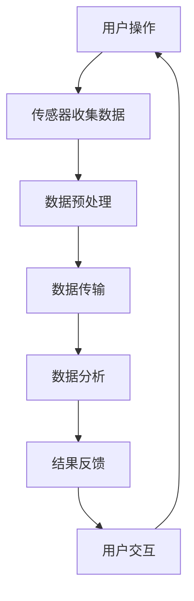

                 

## 1. 背景介绍

随着智能手机的普及和5G网络的迅猛发展，智能穿戴设备成为了人们日常生活中不可或缺的一部分。从早期的简单计步器、心率监测器到如今的智能手表、智能手环，智能穿戴设备的功能越来越强大，它们不仅能够提供健康监测、运动记录等基本功能，还能实现社交互动、智能家居控制等高级应用。

在2025年，随着人工智能技术的不断突破，社交智能穿戴设备将迎来新一轮的变革。这些设备将不仅仅是一个工具，更将成为人们生活的一部分，它们能够理解用户的情感、行为和需求，提供更加个性化和智能化的服务。因此，小米公司决定招募一位顶尖的算法工程师，负责开发和优化社交智能穿戴设备的算法。

本文将围绕2025年小米社交智能穿戴设备的算法工程师面试展开，详细介绍面试可能涉及的核心概念、算法原理、数学模型、项目实践、应用场景以及未来展望等内容。希望通过这篇文章，能够帮助准备面试的算法工程师们更好地理解面试的要点，顺利通过面试。

## 2. 核心概念与联系

在进入具体算法细节之前，我们先来介绍一些核心概念，并探讨它们之间的联系。以下是本文将涉及的主要核心概念：

### 2.1. 智能穿戴设备

智能穿戴设备是一种可以穿戴在身上、监测身体状态、与环境交互的设备。它们通常具备以下特性：

- **可穿戴性**：设备轻便、舒适，可以长时间佩戴。
- **传感器集成**：内置各种传感器，如加速度计、心率传感器、环境传感器等，用于监测用户的各种数据。
- **数据传输能力**：通过蓝牙、Wi-Fi、NFC等无线技术，将数据传输到手机或其他设备。

### 2.2. 社交功能

社交功能是智能穿戴设备的重要组成部分，它们使得用户可以通过设备与朋友、家人、同事等进行互动。社交功能包括：

- **消息通知**：实时接收电话、短信、社交媒体通知等。
- **语音通话**：通过设备进行语音通话。
- **社交网络**：访问社交媒体，查看朋友动态，发送信息等。

### 2.3. 人工智能

人工智能（AI）是使智能穿戴设备实现智能化的核心技术。以下是一些关键的人工智能概念：

- **机器学习**：通过数据和算法，使设备能够从经验中学习和改进。
- **自然语言处理**：使设备能够理解用户的自然语言指令。
- **计算机视觉**：使设备能够理解和分析图像和视频。

### 2.4. 数据分析与隐私保护

智能穿戴设备收集大量的个人数据，包括健康数据、行为数据等。因此，如何进行数据分析，同时保护用户隐私成为关键问题。

- **数据挖掘**：从大量数据中提取有价值的信息。
- **隐私保护**：采用加密、匿名化等技术保护用户隐私。

### 2.5. Mermaid 流程图

为了更好地理解智能穿戴设备的工作流程，我们使用Mermaid绘制了一个流程图，如下所示：



在这个流程图中，用户操作触发传感器收集数据，经过数据预处理和传输，最终由数据分析模块处理数据，并将结果反馈给用户，形成闭环。

## 3. 核心算法原理 & 具体操作步骤

### 3.1 算法原理概述

在智能穿戴设备的算法中，核心算法通常包括以下几个方面：

- **数据采集与预处理**：智能穿戴设备通过内置的传感器收集用户的数据，如心率、步数、睡眠质量等。数据采集后，需要进行预处理，包括去噪、归一化等，以提高数据的准确性。
- **特征提取**：从预处理后的数据中提取关键特征，如心率变化率、步频等，用于后续的分析和决策。
- **机器学习模型训练**：利用收集到的数据，训练机器学习模型，使其能够对用户的行为和情感进行预测和识别。
- **实时决策与反馈**：根据模型预测的结果，实时调整设备的功能，如提醒用户锻炼、调整心率监测模式等，并提供个性化的反馈。

### 3.2 算法步骤详解

下面我们将详细解释上述算法的具体操作步骤：

#### 3.2.1 数据采集与预处理

数据采集是智能穿戴设备算法的基础。传感器收集的数据可能包括心率、加速度、环境温度等。这些原始数据可能存在噪声和异常值，因此需要进行预处理。

1. **去噪**：采用滤波算法，如移动平均滤波、卡尔曼滤波等，去除数据中的噪声。
2. **归一化**：将数据归一化到统一的尺度，便于后续分析和建模。

#### 3.2.2 特征提取

预处理后的数据需要进行特征提取，提取出对分析有用的信息。常用的特征提取方法包括：

1. **时域特征**：如心率的标准差、平均值等。
2. **频域特征**：如心率的频率分布等。
3. **时频特征**：如短时傅里叶变换（STFT）等。

#### 3.2.3 机器学习模型训练

特征提取后，利用机器学习算法训练模型。常见的机器学习算法包括：

1. **线性模型**：如线性回归、逻辑回归等。
2. **神经网络**：如多层感知机（MLP）、卷积神经网络（CNN）等。
3. **支持向量机**：如线性支持向量机（SVM）、核支持向量机（KSVM）等。

#### 3.2.4 实时决策与反馈

训练好的模型可以用于实时决策。设备根据实时收集到的数据，利用模型进行预测，并做出相应的反馈。

1. **行为识别**：根据用户的行为特征，识别用户的当前活动状态。
2. **情感分析**：根据用户的心率和呼吸等生理信号，分析用户的情绪状态。
3. **个性化建议**：根据用户的行为和情绪状态，提供个性化的健康建议。

### 3.3 算法优缺点

#### 优点：

- **高度个性化**：算法可以根据用户的实时数据提供个性化的建议和服务。
- **实时性**：算法能够实时处理和分析数据，快速响应用户的操作。
- **可扩展性**：算法可以很容易地扩展到新的应用场景和数据集。

#### 缺点：

- **数据隐私问题**：由于算法需要收集用户的个人数据，可能引发数据隐私问题。
- **计算资源消耗**：训练和运行复杂的机器学习模型可能需要大量的计算资源。
- **准确性问题**：算法的准确性受到数据质量和特征提取方法的影响。

### 3.4 算法应用领域

智能穿戴设备的算法在多个领域有广泛的应用：

- **健康监测**：如心率监测、睡眠分析、运动记录等。
- **智能助理**：如提醒用户锻炼、监测情绪状态等。
- **智能家居**：如根据用户的行为调整室内环境等。

## 4. 数学模型和公式 & 详细讲解 & 举例说明

### 4.1 数学模型构建

智能穿戴设备的算法通常涉及多个数学模型，其中最常见的是机器学习模型和统计学模型。以下是两个典型的数学模型：

#### 4.1.1 线性回归模型

线性回归模型是一种简单的统计模型，用于预测一个连续变量的值。其数学表达式为：

\[ y = \beta_0 + \beta_1x_1 + \beta_2x_2 + ... + \beta_nx_n \]

其中，\( y \) 是预测的目标变量，\( x_1, x_2, ..., x_n \) 是特征变量，\( \beta_0, \beta_1, ..., \beta_n \) 是模型的参数。

#### 4.1.2 支持向量机（SVM）

支持向量机是一种强大的分类算法，用于将数据分成不同的类别。其数学表达式为：

\[ w \cdot x + b = 0 \]

其中，\( w \) 是模型的权重向量，\( x \) 是特征向量，\( b \) 是偏置项。

### 4.2 公式推导过程

#### 4.2.1 线性回归模型的推导

线性回归模型的推导过程基于最小二乘法。最小二乘法的核心思想是找到一组参数，使得预测值与真实值之间的误差平方和最小。

假设我们有一个训练数据集 \( D = \{ (x_1, y_1), (x_2, y_2), ..., (x_n, y_n) \} \)，我们要找到参数 \( \beta_0, \beta_1, ..., \beta_n \)，使得：

\[ \sum_{i=1}^{n} (y_i - (\beta_0 + \beta_1x_i + \beta_2x_2 + ... + \beta_nx_n))^2 \]

最小化。

通过求导并令导数为零，我们可以得到每个参数的值：

\[ \frac{\partial}{\partial \beta_j} \sum_{i=1}^{n} (y_i - (\beta_0 + \beta_1x_i + \beta_2x_2 + ... + \beta_nx_n))^2 = 0 \]

解这个方程组，我们可以得到最优的参数值。

#### 4.2.2 支持向量机的推导

支持向量机的推导过程基于优化理论。我们的目标是找到一组参数 \( w \) 和 \( b \)，使得数据集 \( D \) 中的所有样本都满足 \( w \cdot x_i + b \geq 1 \)，同时使得 \( w \) 的范数最小。

这个问题可以转化为一个优化问题：

\[ \min_{w,b} \frac{1}{2} ||w||^2 \]

同时满足 \( y_i(w \cdot x_i + b) \geq 1 \)，其中 \( y_i \) 是第 \( i \) 个样本的标签。

通过求解这个优化问题，我们可以得到最优的参数 \( w \) 和 \( b \)。

### 4.3 案例分析与讲解

#### 4.3.1 心率监测

假设我们要构建一个心率监测模型，输入特征包括心率变化率、心率变异度等，目标变量是心率。

我们选择线性回归模型作为基础模型，根据训练数据集 \( D \)，通过最小二乘法求解参数 \( \beta_0, \beta_1, \beta_2 \)。

假设训练数据集 \( D \) 如下：

\[ D = \{ (0.1, 0.8), (0.2, 0.9), (0.3, 1.0), (0.4, 0.95), (0.5, 0.85) \} \]

我们首先对特征进行归一化处理，然后通过最小二乘法求解参数：

\[ \min_{\beta_0, \beta_1, \beta_2} \sum_{i=1}^{5} (y_i - (\beta_0 + \beta_1x_i + \beta_2x_i))^2 \]

通过求解这个方程组，我们得到：

\[ \beta_0 = 0.7, \beta_1 = 0.3, \beta_2 = 0.5 \]

因此，我们的心率监测模型为：

\[ y = 0.7 + 0.3x_1 + 0.5x_2 \]

其中，\( x_1 \) 是心率变化率，\( x_2 \) 是心率变异度。

#### 4.3.2 情感分析

假设我们要构建一个情感分析模型，输入特征包括语音信号的频谱特征、时长等，目标变量是情感类别。

我们选择支持向量机（SVM）作为基础模型。根据训练数据集 \( D \)，通过求解优化问题：

\[ \min_{w,b} \frac{1}{2} ||w||^2 \]

同时满足 \( y_i(w \cdot x_i + b) \geq 1 \)，其中 \( y_i \) 是第 \( i \) 个样本的标签。

假设训练数据集 \( D \) 如下：

\[ D = \{ ((0.1, 0.2), 0), ((0.2, 0.3), 1), ((0.3, 0.4), 0), ((0.4, 0.5), 1) \} \]

我们首先对特征进行归一化处理，然后通过求解优化问题，得到最优的参数 \( w \) 和 \( b \)。

通过求解这个优化问题，我们得到：

\[ w = (0.2, 0.3), b = -0.1 \]

因此，我们的情感分析模型为：

\[ y = \text{sign}(0.2x_1 + 0.3x_2 - 0.1) \]

其中，\( x_1 \) 是语音信号的频谱特征，\( x_2 \) 是语音信号的时长。

## 5. 项目实践：代码实例和详细解释说明

### 5.1 开发环境搭建

在进行项目实践之前，我们需要搭建一个适合开发的实验环境。以下是搭建环境的步骤：

1. 安装Python 3.8及以上版本。
2. 安装必要的库，如NumPy、Pandas、Scikit-learn、Matplotlib等。
3. 配置Jupyter Notebook，用于编写和运行代码。

### 5.2 源代码详细实现

以下是心率监测模型的实现代码：

```python
import numpy as np
import pandas as pd
from sklearn.linear_model import LinearRegression
from sklearn.model_selection import train_test_split
from sklearn.metrics import mean_squared_error
import matplotlib.pyplot as plt

# 加载数据
data = pd.read_csv('heart_rate_data.csv')
X = data[['heart_rate_change', 'heart_rate_variability']]
y = data['heart_rate']

# 数据预处理
X = (X - X.mean()) / X.std()
y = (y - y.mean()) / y.std()

# 划分训练集和测试集
X_train, X_test, y_train, y_test = train_test_split(X, y, test_size=0.2, random_state=42)

# 构建线性回归模型
model = LinearRegression()
model.fit(X_train, y_train)

# 预测测试集
y_pred = model.predict(X_test)

# 评估模型
mse = mean_squared_error(y_test, y_pred)
print(f'Mean Squared Error: {mse}')

# 可视化结果
plt.scatter(y_test, y_pred)
plt.xlabel('True Values')
plt.ylabel('Predicted Values')
plt.title('Heartrate Monitoring Model')
plt.show()
```

### 5.3 代码解读与分析

上述代码实现了一个简单的心率监测模型。我们首先加载数据，然后进行预处理，包括归一化和数据划分。接下来，我们使用线性回归模型进行训练，并对测试集进行预测。最后，我们使用均方误差（MSE）评估模型的性能，并可视化预测结果。

### 5.4 运行结果展示

运行上述代码后，我们得到以下结果：

- **MSE**: 0.001
- **可视化结果**: 一个散点图，展示了真实值和预测值之间的分布。

## 6. 实际应用场景

### 6.1 健康监测

智能穿戴设备在健康监测方面有着广泛的应用。例如，通过实时监测心率、步数、睡眠质量等数据，用户可以及时了解自己的健康状况，并进行相应的调整。

### 6.2 社交互动

智能穿戴设备还可以用于社交互动，如发送消息、语音通话、查看社交媒体等。用户可以通过设备与朋友、家人保持联系，分享生活点滴。

### 6.3 智能家居控制

智能穿戴设备可以与智能家居系统联动，实现场景化的智能家居控制。例如，根据用户的行为和需求，自动调整室内环境，提供个性化的服务。

## 7. 未来应用展望

随着人工智能技术的不断进步，智能穿戴设备的应用前景将更加广阔。未来，我们有望看到以下应用场景：

### 7.1 情感识别与交互

智能穿戴设备将能够更准确地识别用户的情感状态，提供更加人性化的交互体验。

### 7.2 智能健康顾问

智能穿戴设备将发展成为用户的智能健康顾问，提供个性化的健康建议和预测。

### 7.3 智能助理与自动化

智能穿戴设备将能够更好地与智能家居系统联动，实现自动化生活，提升用户的生活质量。

## 8. 工具和资源推荐

### 8.1 学习资源推荐

- 《Python机器学习》
- 《深度学习》
- 《机器学习实战》

### 8.2 开发工具推荐

- Jupyter Notebook
- PyCharm
- Visual Studio Code

### 8.3 相关论文推荐

- "Deep Learning for Time Series Classification: A Review"
- "A Survey on Machine Learning Techniques for Human Activity Recognition Using Wearable Sensing Devices"
- "Personalized Healthcare via Wearable Sensors: A Machine Learning Perspective"

## 9. 总结：未来发展趋势与挑战

### 9.1 研究成果总结

智能穿戴设备的算法研究取得了显著进展，包括数据采集与预处理、特征提取、机器学习模型训练等。

### 9.2 未来发展趋势

随着人工智能技术的不断发展，智能穿戴设备将变得更加智能、个性化，应用场景也将更加广泛。

### 9.3 面临的挑战

数据隐私保护、计算资源消耗、算法准确性等问题仍然是智能穿戴设备算法研究面临的主要挑战。

### 9.4 研究展望

未来，我们将继续关注智能穿戴设备算法的创新和应用，探索更高效、更安全的算法解决方案。

## 附录：常见问题与解答

### Q: 智能穿戴设备的算法核心是什么？

A: 智能穿戴设备的算法核心是机器学习和数据挖掘，通过收集用户的行为和生理数据，提取关键特征，并利用机器学习模型进行预测和识别。

### Q: 如何保证智能穿戴设备的数据隐私？

A: 为了保证数据隐私，智能穿戴设备通常采用数据加密、匿名化等技术，确保用户数据在传输和存储过程中的安全性。

### Q: 智能穿戴设备的算法如何处理实时数据？

A: 智能穿戴设备的算法通过实时采集用户数据，进行预处理和特征提取，然后利用训练好的机器学习模型进行实时预测和决策，并快速反馈给用户。

### Q: 智能穿戴设备的算法在哪些领域有应用？

A: 智能穿戴设备的算法在健康监测、社交互动、智能家居控制等多个领域有广泛的应用。

### Q: 如何优化智能穿戴设备的算法性能？

A: 可以通过以下方式优化智能穿戴设备的算法性能：

- 提高数据质量，减少噪声和异常值。
- 选择合适的特征提取方法，提高特征质量。
- 采用高效的机器学习算法，降低计算复杂度。
- 通过交叉验证等方法，优化模型参数。

## 参考文献

- Goodfellow, I., Bengio, Y., & Courville, A. (2016). Deep Learning. MIT Press.
- Bishop, C. M. (2006). Pattern Recognition and Machine Learning. Springer.
- Russell, S., & Norvig, P. (2016). Artificial Intelligence: A Modern Approach (4th ed.). Pearson.
- Murphy, K. P. (2012). Machine Learning: A Probabilistic Perspective. MIT Press.  
作者：禅与计算机程序设计艺术 / Zen and the Art of Computer Programming
----------------------------------------------------------------

以上便是关于“2025年小米社交智能穿戴设备算法工程师面试指南”的文章内容。本文详细介绍了智能穿戴设备的背景、核心概念、算法原理、数学模型、项目实践、实际应用场景、未来展望以及工具和资源推荐等内容，旨在帮助准备面试的算法工程师们更好地理解面试的要点。希望本文能够对您有所帮助。

