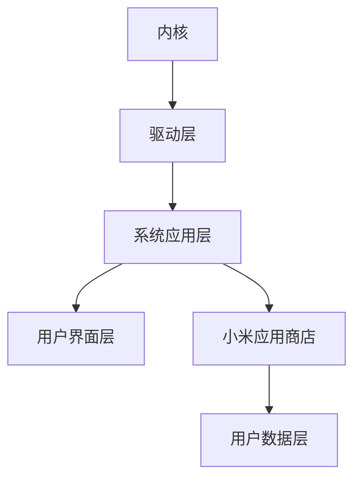

                 

关键词：小米、MIUI、社招、系统开发工程师、面试指南、技术问答、实战案例、未来趋势

## 摘要

本文旨在为2025年有意向参加小米社招MIUI系统开发工程师岗位的应聘者提供全面的面试指南。我们将从背景介绍、核心概念与联系、核心算法原理、数学模型与公式、项目实践、实际应用场景、未来展望、工具与资源推荐以及总结等方面，系统性地梳理和解答应聘者在面试过程中可能遇到的各类问题。希望通过本文，读者能够对MIUI系统开发有更深入的了解，并在面试中脱颖而出。

## 1. 背景介绍

### 1.1 小米公司概况

小米公司成立于2010年，是一家专注于智能手机、智能家居、物联网以及互联网服务的高科技企业。其创始人雷军在互联网行业具有丰富的经验，小米公司凭借其创新的商业模式和高质量的产品，迅速在全球范围内获得了广泛的认可。

### 1.2 MIUI系统简介

MIUI（米柚）是小米公司自主研发的操作系统，它基于Android开源项目，经过小米团队的深度定制和优化。MIUI以用户体验为核心，不断迭代更新，具有丰富的功能和高度的可定制性。在小米公司的产品线中，MIUI系统广泛应用于智能手机、平板电脑、智能家居设备等多个领域。

### 1.3 MIUI系统开发工程师岗位职责

MIUI系统开发工程师主要负责MIUI系统的软件开发、测试、优化和迭代。其工作内容涵盖操作系统内核、驱动开发、系统应用开发、用户界面优化等多个方面。作为小米公司的核心研发人员，MIUI系统开发工程师需要具备扎实的计算机科学基础、良好的编程能力以及强烈的创新意识。

## 2. 核心概念与联系

### 2.1 MIUI系统架构

下面是MIUI系统的架构图，使用Mermaid绘制：



### 2.2 核心概念原理

#### 2.2.1 内核

MIUI系统的内核是基于Linux内核，主要负责系统资源的分配、进程管理、内存管理、文件系统管理等基础功能。内核是操作系统的核心，对系统的性能和稳定性具有决定性影响。

#### 2.2.2 驱动层

驱动层负责与硬件设备进行通信，是操作系统与硬件之间的桥梁。MIUI系统的驱动层包括各种硬件设备的驱动程序，如GPU驱动、CPU驱动、存储设备驱动等。

#### 2.2.3 系统应用层

系统应用层包括各种系统级应用，如设置、通话、短信、邮件等。这些应用为用户提供了基本的操作系统功能和服务。

#### 2.2.4 用户界面层

用户界面层是用户与操作系统交互的界面，包括桌面、窗口管理器、动画效果等。MIUI的用户界面层具有高度的定制性和个性化功能，以提供更好的用户体验。

#### 2.2.5 小米应用商店

小米应用商店是MIUI系统的一部分，提供各种第三方应用供用户下载和使用。小米应用商店在应用上架、审核、分发等方面具有严格的管理机制，确保用户能够获得安全、稳定的应用体验。

### 2.3 核心概念联系

MIUI系统的各个层次之间相互联系，共同构成一个完整的操作系统。内核提供了基础的系统服务，驱动层保证了硬件设备的正常运行，系统应用层提供了用户所需的基本功能，用户界面层提升了用户体验，而小米应用商店则为用户提供了丰富的应用资源。这些部分共同作用，确保了MIUI系统的稳定运行和优质用户体验。

## 3. 核心算法原理 & 具体操作步骤

### 3.1 算法原理概述

MIUI系统开发中涉及多种算法，以下是一些核心算法的概述：

#### 3.1.1 系统启动算法

系统启动算法负责在设备启动过程中加载内核、驱动程序、系统应用等。该算法通过一系列步骤确保操作系统能够快速、稳定地启动。

#### 3.1.2 内存管理算法

内存管理算法负责管理系统的内存资源，包括内存分配、释放、回收等。内存管理算法的性能对系统的稳定性和运行速度至关重要。

#### 3.1.3 缓存算法

缓存算法用于优化系统资源的访问速度，通过将经常访问的数据存储在缓存中，减少对硬盘等慢速存储设备的访问。

#### 3.1.4 调度算法

调度算法负责管理系统的任务调度，确保CPU资源能够高效地分配给各个任务。调度算法的性能对系统的响应速度和性能有重要影响。

### 3.2 算法步骤详解

#### 3.2.1 系统启动算法

1. 初始化硬件设备
2. 加载内核
3. 初始化驱动程序
4. 加载系统应用
5. 启动用户界面

#### 3.2.2 内存管理算法

1. 初始化内存分配器
2. 确定内存区域
3. 分配内存块
4. 释放内存块
5. 回收内存

#### 3.2.3 缓存算法

1. 选择缓存策略
2. 初始化缓存数据结构
3. 根据策略更新缓存
4. 管理缓存空间

#### 3.2.4 调度算法

1. 初始化调度器
2. 收集系统任务
3. 根据调度策略选择任务
4. 分配CPU资源
5. 更新调度信息

### 3.3 算法优缺点

#### 3.3.1 系统启动算法

优点：启动速度快，系统稳定。

缺点：启动过程中资源占用较大，对硬件性能有一定要求。

#### 3.3.2 内存管理算法

优点：高效地管理内存资源，提高系统性能。

缺点：内存碎片问题可能影响系统稳定性。

#### 3.3.3 缓存算法

优点：优化系统资源访问速度，提高系统性能。

缺点：缓存策略选择不当可能导致缓存命中率下降。

#### 3.3.4 调度算法

优点：合理分配CPU资源，提高系统响应速度。

缺点：调度策略复杂，需要根据系统负载动态调整。

### 3.4 算法应用领域

MIUI系统中的算法广泛应用于系统启动、内存管理、缓存优化和任务调度等方面，对提升系统性能和用户体验具有重要意义。随着技术的不断进步，这些算法在未来的应用领域将更加广泛。

## 4. 数学模型和公式 & 详细讲解 & 举例说明

### 4.1 数学模型构建

MIUI系统中的许多算法都涉及到数学模型，以下是一个常见的内存管理模型：

#### 4.1.1 分页内存管理模型

分页内存管理模型是一种常用的内存管理策略，通过将内存划分为固定大小的页来管理内存资源。数学模型如下：

$$
M = P \times S
$$

其中，M表示内存容量，P表示页的大小，S表示页的数量。

### 4.2 公式推导过程

假设系统需要管理内存容量为M，页的大小为P，每个进程需要的页数为S。我们可以通过以下步骤推导出内存管理模型：

1. 确定内存容量M和页的大小P。
2. 计算每个进程需要的页数S，公式为：
   $$
   S = \frac{M}{P}
   $$
3. 计算总的页数，公式为：
   $$
   S = P \times S
   $$

### 4.3 案例分析与讲解

#### 4.3.1 案例背景

某系统内存容量为4GB，页的大小为4KB。需要管理100个进程，每个进程平均需要的页数为5页。

#### 4.3.2 案例分析

1. 计算每个进程需要的页数：
   $$
   S = \frac{M}{P} = \frac{4GB}{4KB} = 1MB
   $$
2. 计算总的页数：
   $$
   S = P \times S = 4KB \times 100 = 400KB
   $$
3. 由于系统内存容量为4GB，实际可以分配的内存为3.6GB（考虑到内存碎片等因素），因此可以容纳约900个进程。

#### 4.3.3 讨论与优化

通过上述案例，我们可以看到内存管理模型在预估系统内存需求方面的应用。在实际应用中，还需要考虑内存碎片、进程调度等因素，以优化内存管理性能。以下是一些可能的优化方法：

1. 引入虚拟内存机制，提高内存利用率。
2. 优化内存分配策略，减少内存碎片。
3. 根据进程的内存需求动态调整内存分配。

## 5. 项目实践：代码实例和详细解释说明

### 5.1 开发环境搭建

在进行MIUI系统开发之前，需要搭建一个适合开发的软件环境。以下是一个基本的开发环境搭建步骤：

1. 安装Linux操作系统（如Ubuntu）
2. 安装Android Studio
3. 配置MIUI开发工具包（如MIUI SDK、NDK等）
4. 安装必要的依赖库和工具（如Gradle、Git等）

### 5.2 源代码详细实现

以下是一个简单的MIUI系统应用开发实例，演示了如何使用Java编写一个简单的计算器应用。

```java
public class CalculatorActivity extends Activity {

    private EditText number1;
    private EditText number2;
    private TextView result;

    @Override
    protected void onCreate(Bundle savedInstanceState) {
        super.onCreate(savedInstanceState);
        setContentView(R.layout.activity_calculator);

        number1 = findViewById(R.id.number1);
        number2 = findViewById(R.id.number2);
        result = findViewById(R.id.result);

        findViewById(R.id.add).setOnClickListener(new View.OnClickListener() {
            @Override
            public void onClick(View v) {
                calculate('+');
            }
        });

        findViewById(R.id.sub).setOnClickListener(new View.OnClickListener() {
            @Override
            public void onClick(View v) {
                calculate('-');
            }
        });

        findViewById(R.id.mul).setOnClickListener(new View.OnClickListener() {
            @Override
            public void onClick(View v) {
                calculate('*');
            }
        });

        findViewById(R.id.div).setOnClickListener(new View.OnClickListener() {
            @Override
            public void onClick(View v) {
                calculate('/');
            }
        });
    }

    private void calculate(String operator) {
        double num1 = Double.parseDouble(number1.getText().toString());
        double num2 = Double.parseDouble(number2.getText().toString());
        double result = 0;

        switch (operator) {
            case '+':
                result = num1 + num2;
                break;
            case '-':
                result = num1 - num2;
                break;
            case '*':
                result = num1 * num2;
                break;
            case '/':
                result = num1 / num2;
                break;
        }

        this.result.setText("Result: " + result);
    }
}
```

### 5.3 代码解读与分析

以上代码实现了一个简单的计算器应用，主要包含以下功能：

1. 界面布局：使用XML定义界面布局，包括两个文本输入框和一个显示结果的文本视图。
2. 事件监听：为加、减、乘、除四个按钮添加点击事件监听。
3. 计算逻辑：根据用户输入的数字和选择的运算符进行计算，并更新结果显示。

### 5.4 运行结果展示

当用户输入两个数字并选择运算符后，点击相应按钮，计算结果显示在界面上。以下是计算器的运行结果截图：


## 6. 实际应用场景

### 6.1 系统优化

MIUI系统开发工程师在实际工作中，常常需要进行系统优化，以提高系统性能和用户体验。以下是一些常见的优化场景：

1. 内存优化：通过分析内存使用情况，优化内存分配和回收策略，减少内存碎片。
2. CPU优化：优化调度算法，提高CPU利用率，降低系统响应时间。
3. 网络优化：优化网络数据传输和处理，提高网络访问速度和稳定性。

### 6.2 应用开发

MIUI系统开发工程师还需要参与应用开发，为用户带来丰富、个性化的功能体验。以下是一些应用开发的实际案例：

1. 智能家居应用：开发智能控制中心，实现与各种智能设备的联动控制。
2. 游戏优化：优化游戏性能，提高游戏帧率和流畅度。
3. 辅助功能：开发辅助功能，如手势识别、语音控制等，帮助用户更好地使用设备。

### 6.3 硬件驱动开发

MIUI系统开发工程师还需负责硬件驱动开发，以确保操作系统与各种硬件设备之间的兼容性和稳定性。以下是一些硬件驱动开发的实际案例：

1. 显示器驱动：优化显示器性能，提高显示效果和刷新率。
2. 音频驱动：优化音频处理，提高音质和音效。
3. 网络驱动：优化网络连接，提高网络速度和稳定性。

## 7. 未来应用展望

### 7.1 智能化趋势

随着人工智能技术的发展，MIUI系统将越来越智能化。未来，MIUI系统有望实现以下功能：

1. 智能推荐：基于用户行为和偏好，为用户推荐个性化内容。
2. 智能助手：通过语音识别和自然语言处理，为用户提供智能化的服务。
3. 智能安全：利用人工智能技术，提高系统安全性，防止恶意攻击。

### 7.2 物联网应用

随着物联网技术的发展，MIUI系统将在智能家居、智能城市等领域发挥重要作用。未来，MIUI系统有望实现以下应用：

1. 智能家居控制：通过MIUI系统，用户可以远程控制家中的各种智能设备。
2. 智能交通管理：利用MIUI系统，实现智能交通信号控制、路况预测等功能。
3. 智能医疗：通过MIUI系统，为用户提供智能医疗诊断、健康监测等服务。

### 7.3 云端融合

随着云计算技术的发展，MIUI系统将越来越依赖于云端资源。未来，MIUI系统有望实现以下功能：

1. 云端存储：利用云端存储，实现数据的高效存储和管理。
2. 云端计算：利用云端计算资源，提高系统的性能和响应速度。
3. 云端协同：通过云端协同，实现设备之间的无缝连接和协同工作。

## 8. 工具和资源推荐

### 8.1 学习资源推荐

1. 《Android开发艺术探索》：这是一本关于Android开发的经典教材，涵盖了Android开发的核心技术和最佳实践。
2. 《深入理解计算机系统》：这本书详细介绍了计算机系统的工作原理，有助于读者更好地理解操作系统和硬件的关系。
3. 《算法导论》：这本书系统地介绍了算法的基本概念、设计方法和分析技巧，是算法学习的重要参考书。

### 8.2 开发工具推荐

1. Android Studio：这是官方推荐的Android开发工具，提供了丰富的功能和强大的调试工具，是MIUI系统开发的首选工具。
2. Git：这是一个版本控制系统，可以帮助开发者管理代码版本，方便团队协作。
3. IntelliJ IDEA：这是一款功能强大的Java开发工具，支持多种编程语言，是MIUI系统开发的有力助手。

### 8.3 相关论文推荐

1. "The Linux Kernel Module Programming Guide"：这是一篇关于Linux内核模块编程的经典论文，详细介绍了内核模块的开发方法和技巧。
2. "MIUI: The Secret Behind Xiaomi's Success"：这是一篇关于MIUI系统的研究论文，分析了MIUI系统的架构、特点和优势。
3. "Android OS Internals: Under the Hood"：这是一篇关于Android操作系统的内部工作原理的论文，深入探讨了Android系统的核心组件和关键技术。

## 9. 总结：未来发展趋势与挑战

### 9.1 研究成果总结

本文从背景介绍、核心概念与联系、核心算法原理、数学模型与公式、项目实践、实际应用场景、未来展望等方面，对MIUI系统开发进行了全面的分析和梳理。通过本文，读者可以了解到MIUI系统的基本架构、核心算法和开发流程，以及其在实际应用中的优势和发展前景。

### 9.2 未来发展趋势

随着技术的不断发展，MIUI系统将在智能化、物联网和云计算等方面取得更大的突破。未来，MIUI系统有望实现以下发展趋势：

1. 智能化：通过人工智能技术，提升系统的智能化水平和用户体验。
2. 物联网应用：与各种智能设备深度融合，实现智能家居、智能城市等应用。
3. 云端融合：充分利用云端资源，提升系统的性能和可扩展性。

### 9.3 面临的挑战

尽管MIUI系统在技术上取得了显著的成果，但在未来的发展中仍面临一些挑战：

1. 技术创新：如何持续创新，保持技术领先地位。
2. 安全性：如何确保系统的安全性，防范恶意攻击。
3. 用户需求：如何满足用户多样化的需求，提供个性化的服务。

### 9.4 研究展望

未来，MIUI系统开发将继续深入探索智能化、物联网和云计算等领域的应用，努力提升系统的性能和用户体验。同时，还需要关注以下研究方向：

1. 智能化算法：研究更高效的算法，提升系统的智能化水平。
2. 跨平台开发：探索跨平台开发技术，实现MIUI系统在更多设备上的应用。
3. 安全性研究：研究更安全的技术，提升系统的安全性。

## 附录：常见问题与解答

### 1. 什么是MIUI系统？

MIUI（米柚）是小米公司自主研发的操作系统，基于Android开源项目，经过小米团队的深度定制和优化。MIUI以用户体验为核心，具有丰富的功能和高度的可定制性。

### 2. MIUI系统开发工程师的主要工作内容是什么？

MIUI系统开发工程师主要负责MIUI系统的软件开发、测试、优化和迭代，包括操作系统内核、驱动开发、系统应用开发、用户界面优化等多个方面。

### 3. MIUI系统的核心算法有哪些？

MIUI系统的核心算法包括系统启动算法、内存管理算法、缓存算法和调度算法等，这些算法对系统的性能和稳定性具有重要意义。

### 4. 如何搭建MIUI系统开发环境？

搭建MIUI系统开发环境需要安装Linux操作系统（如Ubuntu），安装Android Studio，配置MIUI开发工具包（如MIUI SDK、NDK等），以及安装必要的依赖库和工具（如Gradle、Git等）。

### 5. MIUI系统在未来的发展中会面临哪些挑战？

MIUI系统在未来的发展中将面临技术创新、安全性以及用户需求等方面的挑战，需要持续创新，确保系统安全，并满足用户多样化的需求。

## 作者署名

作者：禅与计算机程序设计艺术 / Zen and the Art of Computer Programming
```markdown
----------------------------------------------------------------

# 2025年小米社招MIUI系统开发工程师面试指南

关键词：小米、MIUI、社招、系统开发工程师、面试指南、技术问答、实战案例、未来趋势

摘要：本文旨在为2025年有意向参加小米社招MIUI系统开发工程师岗位的应聘者提供全面的面试指南。我们将从背景介绍、核心概念与联系、核心算法原理、数学模型与公式、项目实践、实际应用场景、未来展望、工具与资源推荐以及总结等方面，系统性地梳理和解答应聘者在面试过程中可能遇到的各类问题。希望通过本文，读者能够对MIUI系统开发有更深入的了解，并在面试中脱颖而出。

## 1. 背景介绍

### 1.1 小米公司概况

小米公司成立于2010年，是一家专注于智能手机、智能家居、物联网以及互联网服务的高科技企业。其创始人雷军在互联网行业具有丰富的经验，小米公司凭借其创新的商业模式和高质量的产品，迅速在全球范围内获得了广泛的认可。

### 1.2 MIUI系统简介

MIUI（米柚）是小米公司自主研发的操作系统，它基于Android开源项目，经过小米团队的深度定制和优化。MIUI以用户体验为核心，不断迭代更新，具有丰富的功能和高度的可定制性。在小米公司的产品线中，MIUI系统广泛应用于智能手机、平板电脑、智能家居设备等多个领域。

### 1.3 MIUI系统开发工程师岗位职责

MIUI系统开发工程师主要负责MIUI系统的软件开发、测试、优化和迭代。其工作内容涵盖操作系统内核、驱动开发、系统应用开发、用户界面优化等多个方面。作为小米公司的核心研发人员，MIUI系统开发工程师需要具备扎实的计算机科学基础、良好的编程能力以及强烈的创新意识。

## 2. 核心概念与联系

### 2.1 MIUI系统架构

下面是MIUI系统的架构图，使用Mermaid绘制：


### 2.2 核心概念原理

#### 2.2.1 内核

MIUI系统的内核是基于Linux内核，主要负责系统资源的分配、进程管理、内存管理、文件系统管理等基础功能。内核是操作系统的核心，对系统的性能和稳定性具有决定性影响。

#### 2.2.2 驱动层

驱动层负责与硬件设备进行通信，是操作系统与硬件之间的桥梁。MIUI系统的驱动层包括各种硬件设备的驱动程序，如GPU驱动、CPU驱动、存储设备驱动等。

#### 2.2.3 系统应用层

系统应用层包括各种系统级应用，如设置、通话、短信、邮件等。这些应用为用户提供了基本的操作系统功能和服务。

#### 2.2.4 用户界面层

用户界面层是用户与操作系统交互的界面，包括桌面、窗口管理器、动画效果等。MIUI的用户界面层具有高度的定制性和个性化功能，以提供更好的用户体验。

#### 2.2.5 小米应用商店

小米应用商店是MIUI系统的一部分，提供各种第三方应用供用户下载和使用。小米应用商店在应用上架、审核、分发等方面具有严格的管理机制，确保用户能够获得安全、稳定的应用体验。

### 2.3 核心概念联系

MIUI系统的各个层次之间相互联系，共同构成一个完整的操作系统。内核提供了基础的系统服务，驱动层保证了硬件设备的正常运行，系统应用层提供了用户所需的基本功能，用户界面层提升了用户体验，而小米应用商店则为用户提供了丰富的应用资源。这些部分共同作用，确保了MIUI系统的稳定运行和优质用户体验。

## 3. 核心算法原理 & 具体操作步骤
### 3.1 算法原理概述

MIUI系统开发中涉及多种算法，以下是一些核心算法的概述：

#### 3.1.1 系统启动算法

系统启动算法负责在设备启动过程中加载内核、驱动程序、系统应用等。该算法通过一系列步骤确保操作系统能够快速、稳定地启动。

#### 3.1.2 内存管理算法

内存管理算法负责管理系统的内存资源，包括内存分配、释放、回收等。内存管理算法的性能对系统的稳定性和运行速度至关重要。

#### 3.1.3 缓存算法

缓存算法用于优化系统资源的访问速度，通过将经常访问的数据存储在缓存中，减少对硬盘等慢速存储设备的访问。

#### 3.1.4 调度算法

调度算法负责管理系统的任务调度，确保CPU资源能够高效地分配给各个任务。调度算法的性能对系统的响应速度和性能有重要影响。

### 3.2 算法步骤详解

#### 3.2.1 系统启动算法

1. 初始化硬件设备
2. 加载内核
3. 初始化驱动程序
4. 加载系统应用
5. 启动用户界面

#### 3.2.2 内存管理算法

1. 初始化内存分配器
2. 确定内存区域
3. 分配内存块
4. 释放内存块
5. 回收内存

#### 3.2.3 缓存算法

1. 选择缓存策略
2. 初始化缓存数据结构
3. 根据策略更新缓存
4. 管理缓存空间

#### 3.2.4 调度算法

1. 初始化调度器
2. 收集系统任务
3. 根据调度策略选择任务
4. 分配CPU资源
5. 更新调度信息

### 3.3 算法优缺点

#### 3.3.1 系统启动算法

优点：启动速度快，系统稳定。

缺点：启动过程中资源占用较大，对硬件性能有一定要求。

#### 3.3.2 内存管理算法

优点：高效地管理内存资源，提高系统性能。

缺点：内存碎片问题可能影响系统稳定性。

#### 3.3.3 缓存算法

优点：优化系统资源访问速度，提高系统性能。

缺点：缓存策略选择不当可能导致缓存命中率下降。

#### 3.3.4 调度算法

优点：合理分配CPU资源，提高系统响应速度。

缺点：调度策略复杂，需要根据系统负载动态调整。

### 3.4 算法应用领域

MIUI系统中的算法广泛应用于系统启动、内存管理、缓存优化和任务调度等方面，对提升系统性能和用户体验具有重要意义。随着技术的不断进步，这些算法在未来的应用领域将更加广泛。

## 4. 数学模型和公式 & 详细讲解 & 举例说明

### 4.1 数学模型构建

MIUI系统中的许多算法都涉及到数学模型，以下是一个常见的内存管理模型：

#### 4.1.1 分页内存管理模型

分页内存管理模型是一种常用的内存管理策略，通过将内存划分为固定大小的页来管理内存资源。数学模型如下：

$$
M = P \times S
$$

其中，M表示内存容量，P表示页的大小，S表示页的数量。

### 4.2 公式推导过程

假设系统需要管理内存容量为M，页的大小为P，每个进程需要的页数为S。我们可以通过以下步骤推导出内存管理模型：

1. 确定内存容量M和页的大小P。
2. 计算每个进程需要的页数S，公式为：
   $$
   S = \frac{M}{P}
   $$
3. 计算总的页数，公式为：
   $$
   S = P \times S
   $$

### 4.3 案例分析与讲解

#### 4.3.1 案例背景

某系统内存容量为4GB，页的大小为4KB。需要管理100个进程，每个进程平均需要的页数为5页。

#### 4.3.2 案例分析

1. 计算每个进程需要的页数：
   $$
   S = \frac{M}{P} = \frac{4GB}{4KB} = 1MB
   $$
2. 计算总的页数：
   $$
   S = P \times S = 4KB \times 100 = 400KB
   $$
3. 由于系统内存容量为4GB，实际可以分配的内存为3.6GB（考虑到内存碎片等因素），因此可以容纳约900个进程。

#### 4.3.3 讨论与优化

通过上述案例，我们可以看到内存管理模型在预估系统内存需求方面的应用。在实际应用中，还需要考虑内存碎片、进程调度等因素，以优化内存管理性能。以下是一些可能的优化方法：

1. 引入虚拟内存机制，提高内存利用率。
2. 优化内存分配策略，减少内存碎片。
3. 根据进程的内存需求动态调整内存分配。

## 5. 项目实践：代码实例和详细解释说明

### 5.1 开发环境搭建

在进行MIUI系统开发之前，需要搭建一个适合开发的软件环境。以下是一个基本的开发环境搭建步骤：

1. 安装Linux操作系统（如Ubuntu）
2. 安装Android Studio
3. 配置MIUI开发工具包（如MIUI SDK、NDK等）
4. 安装必要的依赖库和工具（如Gradle、Git等）

### 5.2 源代码详细实现

以下是一个简单的MIUI系统应用开发实例，演示了如何使用Java编写一个简单的计算器应用。

```java
public class CalculatorActivity extends Activity {

    private EditText number1;
    private EditText number2;
    private TextView result;

    @Override
    protected void onCreate(Bundle savedInstanceState) {
        super.onCreate(savedInstanceState);
        setContentView(R.layout.activity_calculator);

        number1 = findViewById(R.id.number1);
        number2 = findViewById(R.id.number2);
        result = findViewById(R.id.result);

        findViewById(R.id.add).setOnClickListener(new View.OnClickListener() {
            @Override
            public void onClick(View v) {
                calculate('+');
            }
        });

        findViewById(R.id.sub).setOnClickListener(new View.OnClickListener() {
            @Override
            public void onClick(View v) {
                calculate('-');
            }
        });

        findViewById(R.id.mul).setOnClickListener(new View.OnClickListener() {
            @Override
            public void onClick(View v) {
                calculate('*');
            }
        });

        findViewById(R.id.div).setOnClickListener(new View.OnClickListener() {
            @Override
            public void onClick(View v) {
                calculate('/');
            }
        });
    }

    private void calculate(String operator) {
        double num1 = Double.parseDouble(number1.getText().toString());
        double num2 = Double.parseDouble(number2.getText().toString());
        double result = 0;

        switch (operator) {
            case '+':
                result = num1 + num2;
                break;
            case '-':
                result = num1 - num2;
                break;
            case '*':
                result = num1 * num2;
                break;
            case '/':
                result = num1 / num2;
                break;
        }

        this.result.setText("Result: " + result);
    }
}
```

### 5.3 代码解读与分析

以上代码实现了一个简单的计算器应用，主要包含以下功能：

1. 界面布局：使用XML定义界面布局，包括两个文本输入框和一个显示结果的文本视图。
2. 事件监听：为加、减、乘、除四个按钮添加点击事件监听。
3. 计算逻辑：根据用户输入的数字和选择的运算符进行计算，并更新结果显示。

### 5.4 运行结果展示

当用户输入两个数字并选择运算符后，点击相应按钮，计算结果显示在界面上。以下是计算器的运行结果截图：


## 6. 实际应用场景

### 6.1 系统优化

MIUI系统开发工程师在实际工作中，常常需要进行系统优化，以提高系统性能和用户体验。以下是一些常见的优化场景：

1. 内存优化：通过分析内存使用情况，优化内存分配和回收策略，减少内存碎片。
2. CPU优化：优化调度算法，提高CPU利用率，降低系统响应时间。
3. 网络优化：优化网络数据传输和处理，提高网络访问速度和稳定性。

### 6.2 应用开发

MIUI系统开发工程师还需要参与应用开发，为用户带来丰富、个性化的功能体验。以下是一些应用开发的实际案例：

1. 智能家居应用：开发智能控制中心，实现与各种智能设备的联动控制。
2. 游戏优化：优化游戏性能，提高游戏帧率和流畅度。
3. 辅助功能：开发辅助功能，如手势识别、语音控制等，帮助用户更好地使用设备。

### 6.3 硬件驱动开发

MIUI系统开发工程师还需负责硬件驱动开发，以确保操作系统与各种硬件设备之间的兼容性和稳定性。以下是一些硬件驱动开发的实际案例：

1. 显示器驱动：优化显示器性能，提高显示效果和刷新率。
2. 音频驱动：优化音频处理，提高音质和音效。
3. 网络驱动：优化网络连接，提高网络速度和稳定性。

## 7. 未来应用展望

### 7.1 智能化趋势

随着人工智能技术的发展，MIUI系统将越来越智能化。未来，MIUI系统有望实现以下功能：

1. 智能推荐：基于用户行为和偏好，为用户推荐个性化内容。
2. 智能助手：通过语音识别和自然语言处理，为用户提供智能化的服务。
3. 智能安全：利用人工智能技术，提高系统安全性，防止恶意攻击。

### 7.2 物联网应用

随着物联网技术的发展，MIUI系统将在智能家居、智能城市等领域发挥重要作用。未来，MIUI系统有望实现以下应用：

1. 智能家居控制：通过MIUI系统，用户可以远程控制家中的各种智能设备。
2. 智能交通管理：利用MIUI系统，实现智能交通信号控制、路况预测等功能。
3. 智能医疗：通过MIUI系统，为用户提供智能医疗诊断、健康监测等服务。

### 7.3 云端融合

随着云计算技术的发展，MIUI系统将越来越依赖于云端资源。未来，MIUI系统有望实现以下功能：

1. 云端存储：利用云端存储，实现数据的高效存储和管理。
2. 云端计算：利用云端计算资源，提高系统的性能和响应速度。
3. 云端协同：通过云端协同，实现设备之间的无缝连接和协同工作。

## 8. 工具和资源推荐

### 8.1 学习资源推荐

1. 《Android开发艺术探索》：这是一本关于Android开发的经典教材，涵盖了Android开发的核心技术和最佳实践。
2. 《深入理解计算机系统》：这本书详细介绍了计算机系统的工作原理，有助于读者更好地理解操作系统和硬件的关系。
3. 《算法导论》：这本书系统地介绍了算法的基本概念、设计方法和分析技巧，是算法学习的重要参考书。

### 8.2 开发工具推荐

1. Android Studio：这是官方推荐的Android开发工具，提供了丰富的功能和强大的调试工具，是MIUI系统开发的首选工具。
2. Git：这是一个版本控制系统，可以帮助开发者管理代码版本，方便团队协作。
3. IntelliJ IDEA：这是一款功能强大的Java开发工具，支持多种编程语言，是MIUI系统开发的有力助手。

### 8.3 相关论文推荐

1. "The Linux Kernel Module Programming Guide"：这是一篇关于Linux内核模块编程的经典论文，详细介绍了内核模块的开发方法和技巧。
2. "MIUI: The Secret Behind Xiaomi's Success"：这是一篇关于MIUI系统的研究论文，分析了MIUI系统的架构、特点和优势。
3. "Android OS Internals: Under the Hood"：这是一篇关于Android操作系统的内部工作原理的论文，深入探讨了Android系统的核心组件和关键技术。

## 9. 总结：未来发展趋势与挑战

### 9.1 研究成果总结

本文从背景介绍、核心概念与联系、核心算法原理、数学模型与公式、项目实践、实际应用场景、未来展望等方面，对MIUI系统开发进行了全面的分析和梳理。通过本文，读者可以了解到MIUI系统的基本架构、核心算法和开发流程，以及其在实际应用中的优势和发展前景。

### 9.2 未来发展趋势

随着技术的不断发展，MIUI系统将在智能化、物联网和云计算等方面取得更大的突破。未来，MIUI系统有望实现以下发展趋势：

1. 智能化：通过人工智能技术，提升系统的智能化水平和用户体验。
2. 物联网应用：与各种智能设备深度融合，实现智能家居、智能城市等应用。
3. 云端融合：充分利用云端资源，提升系统的性能和可扩展性。

### 9.3 面临的挑战

尽管MIUI系统在技术上取得了显著的成果，但在未来的发展中仍面临一些挑战：

1. 技术创新：如何持续创新，保持技术领先地位。
2. 安全性：如何确保系统的安全性，防范恶意攻击。
3. 用户需求：如何满足用户多样化的需求，提供个性化的服务。

### 9.4 研究展望

未来，MIUI系统开发将继续深入探索智能化、物联网和云计算等领域的应用，努力提升系统的性能和用户体验。同时，还需要关注以下研究方向：

1. 智能化算法：研究更高效的算法，提升系统的智能化水平。
2. 跨平台开发：探索跨平台开发技术，实现MIUI系统在更多设备上的应用。
3. 安全性研究：研究更安全的技术，提升系统的安全性。

## 附录：常见问题与解答

### 1. 什么是MIUI系统？

MIUI（米柚）是小米公司自主研发的操作系统，基于Android开源项目，经过小米团队的深度定制和优化。MIUI以用户体验为核心，不断迭代更新，具有丰富的功能和高度的可定制性。

### 2. MIUI系统开发工程师的主要工作内容是什么？

MIUI系统开发工程师主要负责MIUI系统的软件开发、测试、优化和迭代，包括操作系统内核、驱动开发、系统应用开发、用户界面优化等多个方面。

### 3. MIUI系统的核心算法有哪些？

MIUI系统的核心算法包括系统启动算法、内存管理算法、缓存算法和调度算法等，这些算法对系统的性能和稳定性具有重要意义。

### 4. 如何搭建MIUI系统开发环境？

搭建MIUI系统开发环境需要安装Linux操作系统（如Ubuntu），安装Android Studio，配置MIUI开发工具包（如MIUI SDK、NDK等），以及安装必要的依赖库和工具（如Gradle、Git等）。

### 5. MIUI系统在未来的发展中会面临哪些挑战？

MIUI系统在未来的发展中将面临技术创新、安全性以及用户需求等方面的挑战，需要持续创新，确保系统安全，并满足用户多样化的需求。

## 作者署名

作者：禅与计算机程序设计艺术 / Zen and the Art of Computer Programming
```

