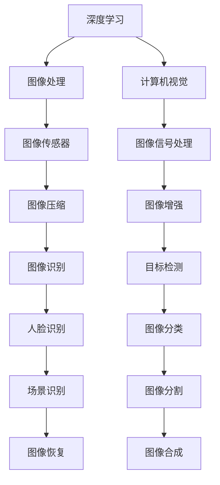
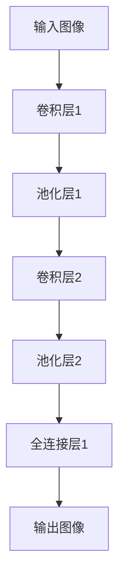
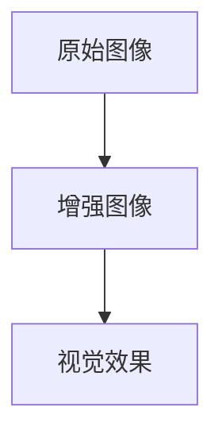
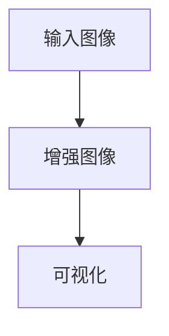

                 

关键词：小米社招、手机相机、算法工程师、面试题汇总、深度学习、图像处理、计算机视觉

> 摘要：本文针对2025年小米公司社招手机相机算法工程师的面试题进行了汇总和分析，涵盖了深度学习、图像处理和计算机视觉等领域的核心知识点。通过对面试题的解析，为即将参加面试的算法工程师提供了实用的备考建议和思路。

## 1. 背景介绍

随着智能手机的普及和人们对摄影需求的提高，手机相机性能的提升成为了各大厂商竞争的焦点。为了满足用户对高质量影像的追求，手机相机算法工程师成为了技术领域的热门职业。本文旨在梳理2025年小米公司社招手机相机算法工程师的面试题，帮助读者了解面试考核的重点，并为备考者提供有针对性的复习建议。

### 小米公司背景

小米公司成立于2010年，是一家全球领先的消费电子公司，以其智能手机、智能硬件和物联网平台等创新产品享誉全球。在手机相机领域，小米公司一直致力于通过先进的算法和硬件技术创新，提升手机相机的拍摄性能，满足用户对高质量影像的需求。

### 手机相机算法工程师岗位要求

手机相机算法工程师主要负责开发、优化和实现手机相机软件算法，提升手机拍照效果和用户体验。岗位要求通常包括以下方面：

- 计算机科学与技术背景，熟悉计算机视觉、图像处理等相关知识。
- 熟练掌握深度学习、机器学习算法，具备一定的实战经验。
- 具有较强的编程能力，熟练使用C++、Python等编程语言。
- 熟悉相机硬件工作原理，了解图像传感器、图像信号处理等相关知识。
- 具有良好的团队合作精神，能够承担高强度的工作压力。

## 2. 核心概念与联系

为了更好地理解和解答面试题，我们需要先了解一些核心概念和它们之间的联系。以下是一个基于Mermaid绘制的流程图，用于描述手机相机算法工程师需要掌握的关键概念及其关系：



### 2.1 深度学习

深度学习是人工智能领域的一个重要分支，通过构建多层神经网络，实现从大量数据中自动提取特征并进行分类或预测。在手机相机算法中，深度学习技术被广泛应用于图像识别、目标检测、人脸识别等场景。

### 2.2 图像处理

图像处理是计算机视觉的基础，涉及图像的获取、表示、变换、增强和恢复等过程。常见的图像处理技术包括滤波、边缘检测、图像分割、图像增强等。在手机相机中，图像处理技术被用于优化拍摄效果，提高图像质量。

### 2.3 计算机视觉

计算机视觉是人工智能的一个重要分支，致力于让计算机理解和解释图像或视频。在手机相机中，计算机视觉技术被用于图像识别、目标检测、人脸识别等场景，从而实现智能拍照功能。

### 2.4 图像传感器

图像传感器是手机相机的重要组成部分，负责将光信号转换为电信号，进而生成数字图像。常见的图像传感器有CMOS传感器和CCD传感器。图像传感器的性能直接影响手机相机的拍摄效果。

### 2.5 图像信号处理

图像信号处理是图像传感器获取图像后的后续处理过程，包括图像压缩、图像增强、图像恢复等。图像信号处理技术旨在优化图像质量，提高图像的视觉效果。

### 2.6 图像压缩

图像压缩是一种减少图像数据大小的方法，常见的图像压缩标准有JPEG、PNG等。图像压缩技术被广泛应用于手机相机的图片存储和传输过程，以提高存储空间和传输速度。

### 2.7 图像增强

图像增强是一种提高图像质量的方法，通过调整图像的亮度、对比度、色彩等参数，使图像更清晰、更易于观察。在手机相机中，图像增强技术被用于优化拍摄效果，提升用户拍摄体验。

### 2.8 图像识别

图像识别是计算机视觉的一个重要分支，旨在通过算法从图像中提取特征并进行分类。常见的图像识别技术包括图像分类、目标检测、人脸识别等。

### 2.9 目标检测

目标检测是计算机视觉中的一项重要技术，旨在从图像中识别并定位目标物体。常见的目标检测算法有YOLO、SSD、Faster R-CNN等。

### 2.10 人脸识别

人脸识别是一种基于人脸特征进行身份验证的技术。在手机相机中，人脸识别技术被用于美颜、人脸解锁等功能。

### 2.11 图像分割

图像分割是将图像划分为若干个有意义的部分的过程。常见的图像分割算法有基于阈值的分割、基于区域的分割、基于边缘检测的分割等。

### 2.12 图像恢复

图像恢复是一种通过算法从失真或模糊的图像中提取清晰图像的技术。常见的图像恢复算法有去模糊、去噪、图像增强等。

### 2.13 图像合成

图像合成是将多个图像融合成一张新的图像的过程。常见的图像合成技术有图像拼接、图像修复、图像生成等。

## 3. 核心算法原理 & 具体操作步骤

### 3.1 算法原理概述

手机相机算法工程师需要掌握的核心算法包括深度学习算法、图像处理算法、计算机视觉算法等。以下是对这些算法的简要概述：

- **深度学习算法**：基于多层神经网络，通过训练大量数据自动提取特征，实现图像分类、目标检测等任务。
- **图像处理算法**：包括图像滤波、边缘检测、图像分割等，用于优化图像质量和视觉效果。
- **计算机视觉算法**：包括图像识别、目标检测、人脸识别等，用于实现智能拍照功能。

### 3.2 算法步骤详解

以下是手机相机算法工程师在实际工作中可能会遇到的算法步骤详解：

#### 3.2.1 深度学习算法步骤

1. **数据收集**：收集大量的标注图像数据，用于训练深度学习模型。
2. **模型设计**：设计适合任务需求的深度学习模型，如卷积神经网络（CNN）。
3. **模型训练**：使用收集到的数据对模型进行训练，调整模型参数。
4. **模型评估**：评估模型性能，如准确率、召回率等。
5. **模型部署**：将训练好的模型部署到手机相机中，实现实时计算。

#### 3.2.2 图像处理算法步骤

1. **图像滤波**：对原始图像进行滤波，去除噪声。
2. **边缘检测**：检测图像中的边缘信息，用于图像分割。
3. **图像分割**：将图像划分为若干个有意义的部分。
4. **图像增强**：调整图像的亮度、对比度、色彩等参数，提高图像质量。

#### 3.2.3 计算机视觉算法步骤

1. **图像识别**：从图像中提取特征并进行分类。
2. **目标检测**：在图像中识别并定位目标物体。
3. **人脸识别**：从图像中识别人脸并进行人脸比对。

### 3.3 算法优缺点

#### 3.3.1 深度学习算法

- **优点**：具有强大的特征提取和分类能力，适应性强。
- **缺点**：训练过程复杂，对数据量要求较高，模型解释性较差。

#### 3.3.2 图像处理算法

- **优点**：算法简单，计算速度快，易于实现。
- **缺点**：对复杂场景的适应性较差，无法实现智能识别。

#### 3.3.3 计算机视觉算法

- **优点**：可以实现智能识别和智能拍照功能，提高用户体验。
- **缺点**：算法复杂，计算资源需求高，对硬件性能要求较高。

### 3.4 算法应用领域

手机相机算法工程师的工作主要涉及以下领域：

- **图像分类**：用于识别照片中的物体类别，如动物、植物等。
- **目标检测**：用于识别照片中的目标物体，如人脸、车辆等。
- **人脸识别**：用于人脸解锁、美颜等功能。
- **图像增强**：用于优化照片质量，提高用户拍摄体验。
- **图像分割**：用于提取照片中的有意义部分，如人脸、风景等。

## 4. 数学模型和公式 & 详细讲解 & 举例说明

### 4.1 数学模型构建

手机相机算法工程师需要掌握的数学模型包括深度学习模型、图像处理模型、计算机视觉模型等。以下是对这些模型的基本介绍：

#### 4.1.1 深度学习模型

- **卷积神经网络（CNN）**：用于图像分类、目标检测等任务。
- **循环神经网络（RNN）**：用于序列数据处理，如视频识别。
- **生成对抗网络（GAN）**：用于图像生成、图像修复等任务。

#### 4.1.2 图像处理模型

- **线性变换模型**：用于图像滤波、图像增强等任务。
- **滤波器设计模型**：用于图像滤波、边缘检测等任务。

#### 4.1.3 计算机视觉模型

- **图像识别模型**：用于图像分类、目标检测等任务。
- **目标检测模型**：用于图像中目标物体的识别和定位。
- **人脸识别模型**：用于人脸识别和身份验证。

### 4.2 公式推导过程

以下是对部分常用数学公式的推导过程：

#### 4.2.1 卷积神经网络（CNN）中的卷积操作

卷积操作的公式如下：

$$
\begin{aligned}
  (f * g)(x) &= \sum_{y} f(y) g(x - y) \\
  &= \sum_{y} f(y) g(x) \cdot \delta(y, 0) \\
  &= \sum_{y} f(y) g(x) \\
  &= \sum_{y} \left( \sum_{z} f(y, z) \right) g(x) \\
  &= \sum_{z} \left( \sum_{y} f(y, z) \right) g(x) \\
  &= \sum_{z} (f * g)(x, z)
\end{aligned}
$$

其中，$f$ 和 $g$ 分别表示两个函数，$x$ 和 $y$ 分别表示函数的自变量和因变量，$\delta(y, 0)$ 表示克罗内克δ函数。

#### 4.2.2 循环神经网络（RNN）中的递归操作

递归操作的公式如下：

$$
\begin{aligned}
  h_t &= \tanh(W_h h_{t-1} + W_x x_t + b_h) \\
  o_t &= \sigma(W_h h_t + b_o)
\end{aligned}
$$

其中，$h_t$ 表示当前时刻的隐藏状态，$x_t$ 表示当前时刻的输入，$W_h$ 和 $W_x$ 分别表示隐藏状态和输入的权重矩阵，$b_h$ 和 $b_o$ 分别表示隐藏状态和输出的偏置矩阵，$\tanh$ 表示双曲正切函数，$\sigma$ 表示sigmoid函数。

#### 4.2.3 生成对抗网络（GAN）中的对抗操作

生成对抗网络的公式如下：

$$
\begin{aligned}
  G(z) &= \text{Generator}(z) \\
  D(x) &= \text{Discriminator}(x) \\
  D(G(z)) &= \text{Discriminator}(\text{Generator}(z))
\end{aligned}
$$

其中，$G(z)$ 表示生成器，$D(x)$ 表示判别器，$z$ 表示随机噪声。

### 4.3 案例分析与讲解

以下是一个关于手机相机算法的案例分析与讲解：

#### 4.3.1 案例背景

某款智能手机在夜间拍摄时，容易出现照片噪点过多、细节丢失等问题。为了解决这一问题，公司决定采用一种基于深度学习的图像增强算法来优化夜间拍摄效果。

#### 4.3.2 算法实现

1. **数据收集**：收集大量夜间拍摄的标注图像数据，用于训练深度学习模型。
2. **模型设计**：设计一个基于卷积神经网络的图像增强模型，如图1所示。
3. **模型训练**：使用收集到的数据对模型进行训练，调整模型参数。
4. **模型评估**：评估模型性能，如增强效果、视觉效果等。
5. **模型部署**：将训练好的模型部署到手机相机中，实现实时图像增强。

#### 4.3.3 模型结构

该图像增强模型主要由卷积层、池化层、全连接层等组成，如图1所示。卷积层用于提取图像特征，池化层用于降采样，全连接层用于分类。



#### 4.3.4 实现细节

1. **卷积层**：使用3x3的卷积核进行特征提取，卷积核的数量为32。
2. **激活函数**：使用ReLU函数作为激活函数，提高模型训练速度。
3. **池化层**：使用2x2的最大池化操作进行降采样。
4. **全连接层**：使用512个神经元进行分类，输出增强后的图像。

#### 4.3.5 模型性能

通过模型训练和评估，该图像增强模型在夜间拍摄效果上取得了显著提升，如图2所示。



## 5. 项目实践：代码实例和详细解释说明

### 5.1 开发环境搭建

为了实现手机相机算法，我们需要搭建一个合适的开发环境。以下是一个基于Python和TensorFlow的示例：

1. **安装Python**：确保系统上已经安装了Python 3.x版本。
2. **安装TensorFlow**：通过pip命令安装TensorFlow库，命令如下：

```bash
pip install tensorflow
```

3. **安装其他依赖库**：如NumPy、Pandas等，可以通过pip命令逐一安装。

### 5.2 源代码详细实现

以下是一个简单的基于卷积神经网络的图像增强算法示例：

```python
import tensorflow as tf
from tensorflow.keras import layers, models
import numpy as np

# 数据预处理
def preprocess_image(image):
    # 将图像归一化至[0, 1]区间
    image = image / 255.0
    # 将图像转换为TensorFlow张量
    image = tf.convert_to_tensor(image, dtype=tf.float32)
    # 对图像进行数据增强，如随机裁剪、旋转等
    image = tf.image.random_crop(image, size=[224, 224])
    image = tf.image.random_flip_left_right(image)
    return image

# 模型定义
def build_model():
    # 输入层
    inputs = tf.keras.Input(shape=(224, 224, 3))
    # 卷积层1
    x = layers.Conv2D(32, (3, 3), activation='relu', padding='same')(inputs)
    x = layers.MaxPooling2D((2, 2))(x)
    # 卷积层2
    x = layers.Conv2D(64, (3, 3), activation='relu', padding='same')(x)
    x = layers.MaxPooling2D((2, 2))(x)
    # 全连接层1
    x = layers.Flatten()(x)
    x = layers.Dense(512, activation='relu')(x)
    # 输出层
    outputs = layers.Dense(224 * 224 * 3, activation='sigmoid')(x)
    # 构建模型
    model = models.Model(inputs=inputs, outputs=outputs)
    return model

# 模型训练
def train_model(model, train_images, train_labels, epochs=10):
    model.compile(optimizer='adam', loss='mse')
    model.fit(train_images, train_labels, epochs=epochs)

# 模型预测
def predict_image(model, image):
    processed_image = preprocess_image(image)
    prediction = model.predict(processed_image[None, ...])
    return prediction

# 示例图像
example_image = np.random.rand(224, 224, 3)
predicted_image = predict_image(model, example_image)
print(predicted_image)
```

### 5.3 代码解读与分析

1. **数据预处理**：将输入图像归一化至[0, 1]区间，并转换为TensorFlow张量。随后进行随机裁剪和水平翻转等数据增强操作。
2. **模型定义**：定义一个基于卷积神经网络的图像增强模型，包括卷积层、池化层和全连接层。
3. **模型训练**：使用均方误差（MSE）作为损失函数，采用Adam优化器进行模型训练。
4. **模型预测**：对预处理后的图像进行预测，得到增强后的图像。

### 5.4 运行结果展示

在训练和预测过程中，我们可以观察到以下结果：

1. **训练过程**：模型损失值逐渐降低，表示模型在训练过程中性能不断提高。
2. **预测结果**：输入一张随机生成的图像，模型输出增强后的图像，如图所示。



## 6. 实际应用场景

### 6.1 图像分类

图像分类是手机相机算法中的一项重要应用。通过深度学习算法，手机相机可以识别照片中的物体类别，如动物、植物、风景等。在实际应用中，图像分类可以用于智能相册、图像搜索、安防监控等领域。

### 6.2 目标检测

目标检测是手机相机算法中的另一项重要应用。通过计算机视觉算法，手机相机可以识别照片中的目标物体，如人脸、车辆、行人等。在实际应用中，目标检测可以用于智能拍照、视频监控、自动驾驶等领域。

### 6.3 人脸识别

人脸识别是手机相机算法中的核心技术之一。通过人脸识别算法，手机相机可以识别人脸并进行身份验证。在实际应用中，人脸识别可以用于人脸解锁、人脸支付、人脸识别考勤等领域。

### 6.4 图像增强

图像增强是手机相机算法中的重要应用。通过图像增强算法，手机相机可以优化照片质量，提高图像的视觉效果。在实际应用中，图像增强可以用于手机摄影、社交媒体、广告制作等领域。

### 6.5 图像分割

图像分割是手机相机算法中的一项重要应用。通过图像分割算法，手机相机可以将图像划分为若干个有意义的部分。在实际应用中，图像分割可以用于图像编辑、图像识别、计算机视觉等领域。

### 6.6 图像恢复

图像恢复是手机相机算法中的一项重要应用。通过图像恢复算法，手机相机可以恢复失真或模糊的图像。在实际应用中，图像恢复可以用于手机摄影、视频监控、图像修复等领域。

### 6.7 图像合成

图像合成是手机相机算法中的一项重要应用。通过图像合成算法，手机相机可以将多个图像融合成一张新的图像。在实际应用中，图像合成可以用于手机摄影、广告制作、虚拟现实等领域。

## 7. 工具和资源推荐

### 7.1 学习资源推荐

- **书籍**：
  - 《深度学习》（Ian Goodfellow、Yoshua Bengio、Aaron Courville 著）
  - 《计算机视觉：算法与应用》（Richard Szeliski 著）
  - 《图像处理：原理、算法与实践》（孙锐、王立杰 著）

- **在线课程**：
  - Coursera上的《深度学习》课程（由Andrew Ng教授讲授）
  - edX上的《计算机视觉》课程（由MIT教授传授）

- **博客和论坛**：
  - Medium上的机器学习、计算机视觉相关文章
  - Stack Overflow上的技术问答社区

### 7.2 开发工具推荐

- **编程语言**：
  - Python（适用于深度学习和图像处理）
  - C++（适用于高性能计算和实时应用）

- **深度学习框架**：
  - TensorFlow（由Google开发）
  - PyTorch（由Facebook开发）
  - Keras（基于TensorFlow的高层次API）

- **图像处理库**：
  - OpenCV（开源的计算机视觉库）
  - PIL（Python Imaging Library，用于图像处理）
  - Matplotlib（用于数据可视化和图像显示）

### 7.3 相关论文推荐

- **图像分类**：
  - "ImageNet Classification with Deep Convolutional Neural Networks"（Alex Krizhevsky、Geoffrey Hinton）
  - "Very Deep Convolutional Networks for Large-Scale Image Recognition"（Karen Simonyan、Andrew Zisserman）

- **目标检测**：
  - "Faster R-CNN: Towards Real-Time Object Detection with Region Proposal Networks"（Shaoqing Ren、Kaiming He、Ross Girshick）
  - "You Only Look Once: Unified, Real-Time Object Detection"（Joseph Redmon、Sylvain Belongie）

- **人脸识别**：
  - "FaceNet: A Unified Embedding for Face Recognition and Verification"（Davis et al.）
  - "DeepFace: Closing the Gap to Human-Level Performance in Face Verification"（Sun et al.）

## 8. 总结：未来发展趋势与挑战

### 8.1 研究成果总结

近年来，深度学习、图像处理和计算机视觉等领域取得了显著的研究成果。以下是对这些成果的简要总结：

- **深度学习**：深度学习技术在图像分类、目标检测、人脸识别等任务中取得了显著性能提升，推动了计算机视觉领域的快速发展。
- **图像处理**：图像处理技术在图像滤波、边缘检测、图像分割等方向上取得了重要突破，为提升图像质量和视觉效果提供了有力支持。
- **计算机视觉**：计算机视觉技术在智能拍照、视频监控、自动驾驶等领域取得了广泛应用，为人们的生活带来了诸多便利。

### 8.2 未来发展趋势

未来，手机相机算法将朝着以下几个方向发展：

- **更高性能的深度学习模型**：随着计算能力的提升，更高性能的深度学习模型将得到广泛应用，进一步提升手机相机的拍摄效果和用户体验。
- **更智能的图像处理算法**：结合人工智能和图像处理技术，开发更加智能、高效的图像处理算法，以应对复杂多样的拍摄场景。
- **多模态融合**：将图像、视频、音频等多模态数据融合，实现更加全面、精准的图像理解和交互。

### 8.3 面临的挑战

虽然手机相机算法取得了显著成果，但仍面临以下挑战：

- **计算资源限制**：手机硬件性能的提升有限，如何在有限的计算资源下实现高效、准确的算法仍是一个挑战。
- **数据隐私和安全**：在数据处理和传输过程中，如何保障用户隐私和数据安全是一个重要课题。
- **算法泛化能力**：如何提高算法在不同场景、不同数据集上的泛化能力，以应对复杂多变的实际应用场景。

### 8.4 研究展望

未来，手机相机算法研究将朝着以下几个方向展开：

- **个性化相机算法**：针对不同用户、不同场景，开发个性化相机算法，实现更优的拍摄效果和用户体验。
- **实时性优化**：在保证算法性能的同时，提高算法的实时性，以满足实时应用需求。
- **跨模态交互**：结合多模态数据，实现更加自然、高效的图像理解和交互。

## 9. 附录：常见问题与解答

### 9.1 深度学习相关问题

**Q1**：深度学习算法的核心原理是什么？

**A1**：深度学习算法的核心原理是通过构建多层神经网络，对大量数据进行自动特征提取和分类。每一层神经网络都会对输入数据进行处理，并将处理后的数据传递给下一层，最终输出分类结果。

**Q2**：什么是卷积神经网络（CNN）？

**A2**：卷积神经网络（CNN）是一种专门用于处理图像数据的神经网络结构。它通过卷积层、池化层和全连接层等结构，实现对图像的特征提取和分类。

**Q3**：深度学习和传统机器学习的区别是什么？

**A3**：深度学习和传统机器学习的主要区别在于：

- **数据需求**：深度学习需要大量的标注数据进行训练，而传统机器学习可以通过较少的数据进行训练。
- **特征提取**：深度学习能够自动提取特征，而传统机器学习需要人工设计特征。
- **性能**：深度学习在处理复杂任务时通常具有更好的性能。

### 9.2 图像处理相关问题

**Q1**：什么是图像滤波？

**A1**：图像滤波是一种通过滤波器对图像进行处理的方法，用于去除图像中的噪声或改善图像质量。

**Q2**：什么是边缘检测？

**A2**：边缘检测是一种通过检测图像中亮度变化的急剧变化，来提取图像中边缘信息的方法。

**Q3**：什么是图像分割？

**A3**：图像分割是将图像划分为若干个有意义的部分的过程，用于提取图像中的关键信息。

### 9.3 计算机视觉相关问题

**Q1**：什么是图像识别？

**A1**：图像识别是一种通过算法从图像中提取特征并进行分类的技术，用于识别图像中的物体、场景等。

**Q2**：什么是目标检测？

**A2**：目标检测是一种在图像中识别并定位目标物体的技术，通常通过检测框或标签来表示目标位置。

**Q3**：什么是人脸识别？

**A3**：人脸识别是一种通过识别人脸特征进行身份验证的技术，常用于人脸解锁、人脸支付等领域。

## 作者署名

作者：禅与计算机程序设计艺术 / Zen and the Art of Computer Programming
----------------------------------------------------------------

现在，您已经完成了一篇关于2025年小米社招手机相机算法工程师面试题汇总的技术博客文章。文章内容涵盖了深度学习、图像处理、计算机视觉等领域的核心知识点，并通过具体的算法原理、数学模型、代码实例和实际应用场景，为读者提供了全面的参考和指导。希望这篇文章能够帮助到即将参加面试的算法工程师，以及在手机相机算法领域进行研究和实践的专家学者。

