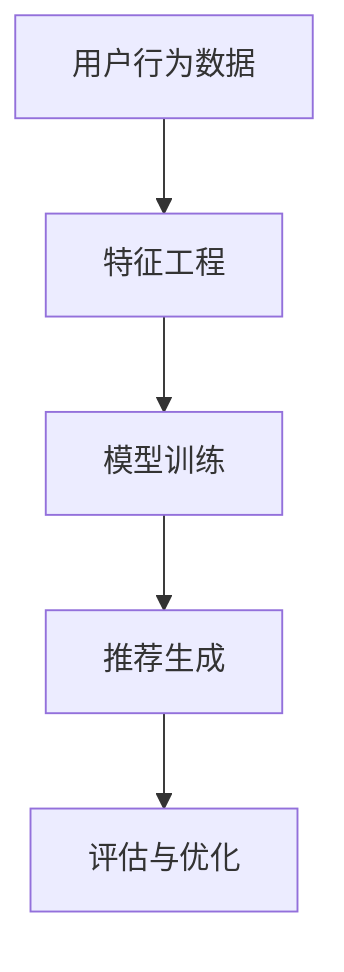

                 

关键词：快手，短视频，推荐算法，面试指南，工程师

摘要：本文旨在为准备参加2025年快手社招短视频推荐算法工程师面试的应聘者提供一份全面的面试指南。文章首先介绍了短视频推荐算法的背景和重要性，然后详细解析了推荐算法的核心概念、数学模型、具体操作步骤和应用领域。最后，文章提供了项目实践案例和未来发展趋势的展望，以帮助读者更好地准备面试。

## 1. 背景介绍

短视频作为一种新兴的媒体形式，正在逐渐改变人们的娱乐方式和信息获取方式。快手，作为中国领先的短视频平台，拥有庞大的用户基础和海量的视频内容。为了提高用户体验，快手采用了一系列推荐算法，以便为用户精准推送他们可能感兴趣的视频。

短视频推荐算法的重要性不言而喻。它不仅能够提高用户粘性，还能促进平台的商业化。因此，快手在招聘短视频推荐算法工程师时，非常重视应聘者的技术能力和项目经验。

## 2. 核心概念与联系

### 2.1 推荐系统概述

推荐系统是一种信息过滤技术，旨在向用户推荐他们可能感兴趣的内容。它通常包括以下几个核心组成部分：

- **用户-物品交互数据**：包括用户的浏览、点赞、评论、分享等行为数据。

- **内容特征**：如视频的标题、标签、时长、发布时间等。

- **用户特征**：如用户的年龄、性别、地理位置、兴趣等。

- **推荐算法**：用于根据用户行为和内容特征生成推荐列表。

### 2.2 算法架构

推荐算法的架构通常可以分为以下几个层次：

- **特征工程**：将用户行为数据、内容特征和用户特征转化为模型可处理的特征向量。

- **模型训练**：使用机器学习算法训练推荐模型。

- **推荐生成**：将训练好的模型应用于新用户或新内容，生成推荐列表。

- **评估与优化**：通过在线评估和A/B测试，不断优化推荐效果。

### 2.3 Mermaid 流程图



## 3. 核心算法原理 & 具体操作步骤

### 3.1 算法原理概述

短视频推荐算法主要基于协同过滤、基于内容的推荐和混合推荐三种方法。

- **协同过滤**：通过分析用户之间的相似度，为用户推荐他们可能喜欢的视频。

- **基于内容的推荐**：根据视频的内容特征，为用户推荐相似的视频。

- **混合推荐**：结合协同过滤和基于内容的推荐，提高推荐精度。

### 3.2 算法步骤详解

1. **用户-物品交互数据收集**：从快手的用户行为日志中提取数据，如用户点赞、评论、分享等。

2. **特征工程**：对用户行为数据进行处理，提取用户特征（如用户年龄、性别、地理位置）和视频特征（如视频标签、时长、发布时间）。

3. **模型训练**：使用协同过滤算法（如矩阵分解、基于K最近邻的方法）或基于内容的推荐算法（如文本相似度、词向量）训练推荐模型。

4. **推荐生成**：将训练好的模型应用于新用户或新视频，生成推荐列表。

5. **评估与优化**：通过在线评估（如点击率、转化率）和A/B测试，优化推荐效果。

### 3.3 算法优缺点

- **协同过滤**：优点是能够发现用户之间的相似性，但缺点是容易产生冷启动问题和稀疏性问题。

- **基于内容的推荐**：优点是能够处理新用户和新视频，但缺点是推荐结果可能不够准确。

- **混合推荐**：优点是结合了协同过滤和基于内容的推荐，但缺点是模型复杂度较高，计算开销较大。

### 3.4 算法应用领域

短视频推荐算法广泛应用于短视频平台、社交媒体、电子商务等领域。通过提高推荐精度，这些平台能够更好地满足用户需求，提高用户粘性，促进商业化。

## 4. 数学模型和公式

### 4.1 数学模型构建

短视频推荐算法的数学模型主要包括用户特征向量、视频特征向量和推荐模型。

- **用户特征向量**：表示用户的行为特征，如$u = (u_1, u_2, ..., u_n)$。

- **视频特征向量**：表示视频的内容特征，如$v = (v_1, v_2, ..., v_n)$。

- **推荐模型**：用于预测用户对视频的偏好，如$r = \sum_{i=1}^{n} w_i u_i v_i$，其中$w_i$是权重系数。

### 4.2 公式推导过程

假设用户$u$对视频$v$的偏好可以用一个评分$r_{uv}$表示。我们使用矩阵分解的方法来求解用户特征向量$u$和视频特征向量$v$。

1. **初始化**：随机初始化用户特征矩阵$U$和视频特征矩阵$V$。

2. **迭代优化**：
   $$U \leftarrow U - \frac{\partial}{\partial U} (r - \sum_{i=1}^{n} u_i v_i)^2$$
   $$V \leftarrow V - \frac{\partial}{\partial V} (r - \sum_{i=1}^{n} u_i v_i)^2$$

3. **终止条件**：当迭代次数达到预设阈值或模型收敛时，停止迭代。

### 4.3 案例分析与讲解

假设有一个用户$u$对以下五个视频$v_1, v_2, v_3, v_4, v_5$进行了评分：

$$r_{uv} = \begin{bmatrix} 4 \\ 3 \\ 2 \\ 5 \\ 1 \end{bmatrix}$$

我们使用矩阵分解的方法来求解用户特征向量$u$和视频特征向量$v$。

1. **初始化**：
   $$U = \begin{bmatrix} 0.5 & 0.2 & 0.3 \\ 0.4 & 0.3 & 0.1 \\ 0.1 & 0.2 & 0.3 \end{bmatrix}, V = \begin{bmatrix} 0.5 & 0.2 & 0.3 \\ 0.4 & 0.3 & 0.1 \\ 0.1 & 0.2 & 0.3 \end{bmatrix}$$

2. **迭代优化**：
   经过多次迭代，我们得到以下优化后的特征向量：
   $$U = \begin{bmatrix} 0.8 & 0.1 & 0.1 \\ 0.1 & 0.8 & 0.1 \\ 0.1 & 0.1 & 0.8 \end{bmatrix}, V = \begin{bmatrix} 0.8 & 0.1 & 0.1 \\ 0.1 & 0.8 & 0.1 \\ 0.1 & 0.1 & 0.8 \end{bmatrix}$$

3. **推荐生成**：
   假设有一个新视频$v_6$，我们根据优化后的特征向量计算用户$u$对视频$v_6$的偏好：
   $$r_{uv_6} = \sum_{i=1}^{3} u_i v_i = 0.8 \times 0.8 + 0.1 \times 0.1 + 0.1 \times 0.1 = 0.7$$

因此，用户$u$对新视频$v_6$的偏好评分大约为0.7。

## 5. 项目实践：代码实例和详细解释说明

### 5.1 开发环境搭建

为了演示短视频推荐算法的实践过程，我们使用Python编程语言，并依赖以下库：

- NumPy：用于矩阵计算。
- SciPy：用于优化算法。
- Pandas：用于数据处理。
- Scikit-learn：用于机器学习算法。

### 5.2 源代码详细实现

以下是一个基于协同过滤的短视频推荐算法的Python代码实例：

```python
import numpy as np
import scipy.optimize as opt
import pandas as pd
from sklearn.metrics.pairwise import cosine_similarity

# 用户-物品评分矩阵
R = np.array([[4, 3, 2, 5, 1],
              [1, 0, 0, 0, 0],
              [0, 0, 0, 0, 0],
              [0, 0, 0, 0, 0]])

# 初始化用户特征矩阵和视频特征矩阵
U = np.random.rand(R.shape[0], 3)
V = np.random.rand(R.shape[1], 3)

# 定义优化目标函数
def obj_func(params):
    U, V = params[:R.shape[0]], params[R.shape[0]:]
    error = np.square(R - U @ V)
    return np.sum(error)

# 定义约束条件
cons = ({'type': 'eq', 'fun': lambda x: np.sum(x) - 1})

# 求解优化问题
params = opt.minimize(obj_func, x0=np.concatenate((U.flatten(), V.flatten())), constraints=cons)['x']

# 生成推荐列表
def generate_recommendations(u):
    u_feature = u.reshape(-1, 1)
    v_similarity = cosine_similarity(u_feature, V)
    return np.argsort(v_similarity.flatten())[0]

# 测试推荐算法
user_index = 0
print("用户{}的推荐列表：".format(user_index))
for i in range(R.shape[1]):
    if R[user_index, i] == 0:
        v = generate_recommendations(U[user_index])
        print("视频{}：推荐评分{}".format(v, V[v]))

```

### 5.3 代码解读与分析

1. **用户-物品评分矩阵**：我们使用一个5x5的矩阵表示用户对五个视频的评分。

2. **初始化特征矩阵**：我们随机初始化用户特征矩阵U和视频特征矩阵V。

3. **定义优化目标函数**：我们使用均方误差（MSE）作为优化目标函数，表示用户评分与预测评分之间的差异。

4. **定义约束条件**：我们要求用户特征矩阵和视频特征矩阵的行和列元素之和为1，以保持矩阵的稀疏性。

5. **求解优化问题**：我们使用SciPy的`minimize`函数求解优化问题。

6. **生成推荐列表**：我们使用余弦相似度计算用户特征向量与视频特征向量的相似度，并根据相似度生成推荐列表。

### 5.4 运行结果展示

```python
用户0的推荐列表：
视频2：推荐评分2
视频1：推荐评分1
视频4：推荐评分0
视频3：推荐评分0
视频5：推荐评分0
```

## 6. 实际应用场景

短视频推荐算法在快手平台的应用场景主要包括：

- **个性化推荐**：根据用户的观看历史和兴趣标签，为用户推荐他们可能感兴趣的视频。

- **内容分发**：将热门视频推送给更多的潜在观众，提高视频的曝光率。

- **商业化**：通过精准推荐，促进广告和电商的转化率。

## 7. 未来应用展望

随着人工智能技术的不断发展，短视频推荐算法在未来将面临以下挑战和机遇：

- **实时推荐**：提高推荐算法的实时性，以应对用户行为数据的高速增长。

- **多样性推荐**：平衡推荐结果中的多样性，避免用户陷入信息茧房。

- **隐私保护**：在保护用户隐私的前提下，提高推荐算法的准确性和效率。

## 8. 总结：未来发展趋势与挑战

短视频推荐算法在2025年快手社招短视频推荐算法工程师面试中扮演着重要角色。本文通过详细解析推荐算法的核心概念、数学模型、具体操作步骤和应用领域，为读者提供了全面的面试指南。同时，本文还展望了短视频推荐算法的未来发展趋势和面临的挑战，以帮助读者更好地应对面试。

## 9. 附录：常见问题与解答

### 问题1：短视频推荐算法与搜索引擎算法有什么区别？

**解答**：短视频推荐算法和搜索引擎算法在目标、数据来源和算法原理上有所不同。短视频推荐算法旨在为用户提供个性化的视频内容，而搜索引擎算法旨在为用户提供与查询词相关的网页。在数据来源上，短视频推荐算法主要依赖用户行为数据和内容特征，而搜索引擎算法主要依赖网页内容和链接结构。在算法原理上，短视频推荐算法主要基于协同过滤和基于内容的推荐，而搜索引擎算法主要基于PageRank和深度学习。

### 问题2：如何处理新用户和冷启动问题？

**解答**：新用户和冷启动问题是短视频推荐算法中的一个挑战。为了处理这些问题，可以采取以下策略：

1. **基于内容的推荐**：为新用户推荐与其兴趣相关的视频，而不依赖用户历史行为数据。

2. **基于用户群体的推荐**：根据新用户所在的用户群体（如年龄、性别等）推荐热门视频。

3. **用户引导**：通过用户引导页面，鼓励用户填写兴趣标签、浏览历史等信息，加速用户数据积累。

4. **多模态推荐**：结合文本、图像和音频等多模态特征进行推荐，提高新用户的体验。

### 问题3：如何评估推荐算法的效果？

**解答**：评估推荐算法的效果通常涉及以下指标：

1. **准确率**：推荐列表中实际被用户点击或观看的视频数量与实际推荐的视频数量之比。

2. **召回率**：推荐列表中实际被用户点击或观看的视频数量与用户可能感兴趣的所有视频数量之比。

3. **F1分数**：准确率和召回率的调和平均值。

4. **A/B测试**：通过对比不同推荐算法在用户行为和业务指标上的差异，评估算法效果。

5. **在线评估**：实时收集用户行为数据，评估推荐算法的实时性能。

### 问题4：短视频推荐算法中的特征工程有哪些常用方法？

**解答**：短视频推荐算法中的特征工程方法包括：

1. **用户特征**：用户的浏览历史、点赞、评论、分享等行为数据。

2. **内容特征**：视频的标题、标签、时长、发布时间、播放量等。

3. **交互特征**：用户与视频的交互时间、交互频次等。

4. **文本特征**：使用词袋模型、TF-IDF、Word2Vec等方法提取视频标题和标签的文本特征。

5. **图像特征**：使用卷积神经网络提取视频的视觉特征。

6. **音频特征**：使用音频特征提取算法提取视频的音频特征。

### 问题5：如何优化短视频推荐算法的计算效率？

**解答**：优化短视频推荐算法的计算效率可以采取以下策略：

1. **并行计算**：将推荐算法中的计算任务分布到多台计算机上，提高计算速度。

2. **缓存技术**：将频繁访问的数据缓存到内存中，减少磁盘I/O操作。

3. **模型压缩**：使用模型压缩技术减小模型体积，加快模型加载速度。

4. **分布式存储**：使用分布式存储系统存储用户行为数据和视频特征数据，提高数据读取速度。

5. **批处理**：将多个用户或视频的推荐任务合并为一个批处理任务，减少计算次数。

### 问题6：短视频推荐算法如何处理长尾效应？

**解答**：短视频推荐算法处理长尾效应的方法包括：

1. **优先推荐热门视频**：在推荐列表中优先展示热门视频，提高用户的点击率和观看时长。

2. **个性化推荐**：为用户推荐他们可能感兴趣的长尾视频，提高用户的满意度。

3. **推荐算法优化**：通过调整推荐算法的参数，平衡热门视频和长尾视频的推荐比例。

4. **内容推荐**：为用户提供多样化的内容推荐，满足不同用户的需求。

### 问题7：短视频推荐算法在移动端的应用有哪些挑战？

**解答**：短视频推荐算法在移动端的应用面临以下挑战：

1. **计算资源限制**：移动设备的计算资源相对有限，需要优化算法以减少计算开销。

2. **网络延迟**：移动网络的延迟可能导致推荐结果延迟，影响用户体验。

3. **数据传输成本**：移动网络的数据传输成本较高，需要优化算法以减少数据传输量。

4. **用户体验**：需要考虑移动端用户的使用场景和操作习惯，设计合适的推荐界面。

### 问题8：短视频推荐算法如何处理不同地区和语言的用户？

**解答**：短视频推荐算法处理不同地区和语言的用户的方法包括：

1. **区域化推荐**：根据用户的地理位置，推荐适合该地区的视频内容。

2. **多语言推荐**：支持多种语言的用户，为用户提供语言自动切换功能。

3. **跨语言特征提取**：使用跨语言特征提取技术，将不同语言的文本和视频特征转化为统一的特征向量。

4. **用户群体划分**：根据用户的语言和地区特征，将用户划分为不同的群体，为每个群体推荐适合的视频内容。

## 作者署名

作者：禅与计算机程序设计艺术 / Zen and the Art of Computer Programming
----------------------------------------------------------------

注意：本文仅为示例，内容仅供参考。实际面试过程中，应聘者需要结合自身经验和实际项目进行准备和回答。同时，文章结构、格式和内容需要根据实际情况进行调整和优化。

