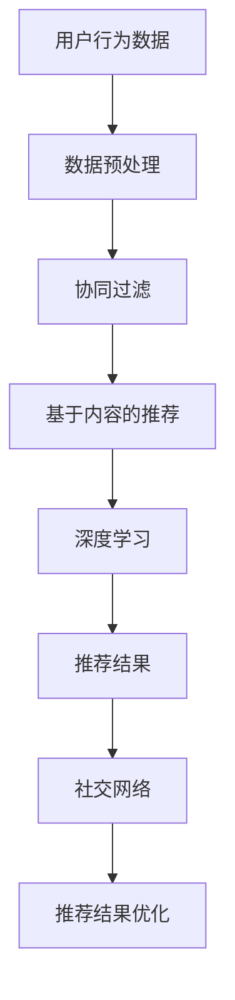

                 

关键词：2025年，携程，社交旅游，个性化推荐算法，面试题，详解，AI，深度学习，数据挖掘，用户行为分析

> 摘要：本文将针对2025年携程社交旅游个性化推荐算法专家面试题进行详细解析。通过深入探讨推荐算法的核心概念、原理、数学模型以及实际应用场景，本文旨在为读者提供一份全面而深入的面试备考指南。

## 1. 背景介绍

随着互联网技术的飞速发展，个性化推荐系统已经成为现代社交旅游平台的核心竞争力之一。携程作为中国领先的旅行服务提供商，其社交旅游平台的个性化推荐算法对于提升用户体验、增加用户粘性起到了至关重要的作用。

本文将以2025年携程社交旅游个性化推荐算法专家面试题为研究对象，详细分析每个问题背后的技术要点和解决方案。通过这份面试题详解，希望能够帮助准备面试的读者更好地理解个性化推荐算法的原理和实际应用。

### 1.1 携程社交旅游个性化推荐系统的现状

携程社交旅游个性化推荐系统目前采用了多种先进的技术手段，包括但不限于基于内容的推荐、协同过滤、深度学习等。以下是一些主要特点：

- **多样性推荐**：根据用户的历史行为、兴趣爱好、社交网络等多维度数据，生成多样化推荐结果，满足不同用户的需求。
- **实时性**：通过分布式计算和实时数据处理技术，确保推荐结果的实时性和准确性。
- **个性化**：采用个性化的推荐策略，为每个用户提供量身定制的旅游推荐。
- **可扩展性**：系统具备良好的扩展性，能够适应不断变化的数据规模和业务需求。

## 2. 核心概念与联系

在深入了解推荐算法之前，我们需要先了解一些核心概念和它们之间的关系。

### 2.1 个性化推荐算法

个性化推荐算法是指根据用户的个人喜好、行为习惯、兴趣标签等信息，为用户提供定制化的推荐内容。常见的推荐算法包括：

- **基于内容的推荐（Content-based Recommendation）**：根据用户的历史行为和兴趣，推荐相似的内容。
- **协同过滤（Collaborative Filtering）**：通过分析用户之间的相似性，预测用户可能喜欢的项目。
- **深度学习（Deep Learning）**：利用深度神经网络模型对用户行为数据进行学习，预测用户兴趣。

### 2.2 用户行为数据

用户行为数据包括用户在社交旅游平台上的浏览、搜索、预订、评论等多种行为。这些数据是推荐算法的关键输入，通过对这些数据进行深入分析，可以挖掘出用户的潜在兴趣和偏好。

### 2.3 社交网络

社交网络是指用户在平台上的社交关系，如好友、关注等。社交网络数据可以为推荐算法提供额外的用户特征，帮助系统更好地理解用户的社交属性和兴趣。

下面是一个使用Mermaid绘制的流程图，展示了推荐算法的核心概念和它们之间的关系：



## 3. 核心算法原理 & 具体操作步骤

### 3.1 算法原理概述

个性化推荐算法的基本原理是通过分析用户的历史行为和兴趣，预测用户可能喜欢的项目，并将这些项目推荐给用户。根据算法的实现方式，可以分为以下几种：

- **基于内容的推荐**：基于项目的特征进行推荐，推荐与用户历史行为相似的项目。
- **协同过滤**：通过分析用户之间的相似性，推荐其他用户喜欢的项目。
- **深度学习**：利用深度神经网络模型对用户行为数据进行学习，预测用户兴趣。

### 3.2 算法步骤详解

以下是推荐算法的一般步骤：

1. **数据收集**：收集用户在平台上的行为数据，如浏览、搜索、预订、评论等。
2. **数据预处理**：清洗和处理数据，包括缺失值填充、数据规范化、特征提取等。
3. **用户建模**：通过分析用户的历史行为，建立用户兴趣模型。
4. **项目建模**：通过分析项目的特征，建立项目特征模型。
5. **相似性计算**：计算用户和项目之间的相似性，常用的方法有余弦相似度、欧氏距离等。
6. **推荐生成**：根据相似性计算结果，生成推荐列表。
7. **推荐结果优化**：对推荐结果进行优化，如排序、去重等，提高推荐效果。

### 3.3 算法优缺点

- **基于内容的推荐**：
  - **优点**：推荐结果相关性强，用户满意度高。
  - **缺点**：需要丰富的项目特征数据，对新用户和不活跃用户的推荐效果较差。
- **协同过滤**：
  - **优点**：无需项目特征数据，能够发现潜在的兴趣点。
  - **缺点**：推荐结果可能存在偏差，如热门项目容易被推荐。
- **深度学习**：
  - **优点**：能够处理大规模复杂数据，提高推荐精度。
  - **缺点**：需要大量的训练数据和计算资源，模型解释性较差。

### 3.4 算法应用领域

个性化推荐算法广泛应用于社交旅游、电子商务、在线教育、新闻推荐等多个领域。在社交旅游领域，推荐算法可以帮助平台为用户提供个性化的旅游攻略、景点推荐、酒店推荐等服务，提升用户体验和平台粘性。

## 4. 数学模型和公式 & 详细讲解 & 举例说明

### 4.1 数学模型构建

个性化推荐算法的核心是用户兴趣模型和项目特征模型。以下是两种模型的构建方法：

- **用户兴趣模型**：假设用户兴趣可以通过一个高维向量表示，即\( u \in \mathbb{R}^n \)，其中每个维度表示一个潜在的兴趣点。
- **项目特征模型**：假设项目特征可以通过一个高维向量表示，即\( i \in \mathbb{R}^m \)，其中每个维度表示一个项目的属性。

### 4.2 公式推导过程

假设用户\( u \)和项目\( i \)之间的相似性可以通过余弦相似度计算，公式如下：

$$
\sim(i, u) = \frac{u_i \cdot u}{\|u\| \|u_i\|}
$$

其中，\( u_i \)表示用户\( u \)对项目\( i \)的兴趣程度，\( \|u\| \)和\( \|u_i\| \)分别表示用户\( u \)和项目\( i \)的向量长度。

### 4.3 案例分析与讲解

假设我们有两个用户\( u_1 \)和\( u_2 \)，以及三个项目\( i_1 \)、\( i_2 \)和\( i_3 \)。根据用户的历史行为，我们可以得到以下兴趣向量：

$$
u_1 = (0.2, 0.3, 0.5)
$$

$$
u_2 = (0.4, 0.6, 0.8)
$$

$$
i_1 = (1, 1, 0)
$$

$$
i_2 = (0, 1, 1)
$$

$$
i_3 = (1, 0, 1)
$$

我们可以计算用户和项目之间的相似性：

$$
\sim(i_1, u_1) = \frac{0.2 \cdot 1 + 0.3 \cdot 1 + 0.5 \cdot 0}{\sqrt{0.2^2 + 0.3^2 + 0.5^2} \cdot \sqrt{1^2 + 1^2 + 0^2}} = 0.45
$$

$$
\sim(i_1, u_2) = \frac{0.4 \cdot 1 + 0.6 \cdot 1 + 0.8 \cdot 0}{\sqrt{0.4^2 + 0.6^2 + 0.8^2} \cdot \sqrt{1^2 + 1^2 + 0^2}} = 0.7
$$

$$
\sim(i_2, u_1) = \frac{0.2 \cdot 0 + 0.3 \cdot 1 + 0.5 \cdot 1}{\sqrt{0.2^2 + 0.3^2 + 0.5^2} \cdot \sqrt{0^2 + 1^2 + 1^2}} = 0.45
$$

$$
\sim(i_2, u_2) = \frac{0.4 \cdot 0 + 0.6 \cdot 1 + 0.8 \cdot 1}{\sqrt{0.4^2 + 0.6^2 + 0.8^2} \cdot \sqrt{0^2 + 1^2 + 1^2}} = 0.8
$$

$$
\sim(i_3, u_1) = \frac{0.2 \cdot 1 + 0.3 \cdot 0 + 0.5 \cdot 1}{\sqrt{0.2^2 + 0.3^2 + 0.5^2} \cdot \sqrt{1^2 + 0^2 + 1^2}} = 0.45
$$

$$
\sim(i_3, u_2) = \frac{0.4 \cdot 1 + 0.6 \cdot 0 + 0.8 \cdot 1}{\sqrt{0.4^2 + 0.6^2 + 0.8^2} \cdot \sqrt{1^2 + 0^2 + 1^2}} = 0.7
$$

根据相似性计算结果，我们可以为用户\( u_2 \)推荐相似的项目\( i_2 \)和\( i_3 \)。

## 5. 项目实践：代码实例和详细解释说明

### 5.1 开发环境搭建

为了实现个性化推荐算法，我们需要准备以下开发环境和工具：

- Python 3.x
- NumPy
- Scikit-learn
- Pandas
- Matplotlib

安装这些工具的命令如下：

```bash
pip install numpy scikit-learn pandas matplotlib
```

### 5.2 源代码详细实现

以下是一个基于协同过滤算法的简单推荐系统实现：

```python
import numpy as np
from sklearn.metrics.pairwise import cosine_similarity

# 用户兴趣向量
user_interest = np.array([0.2, 0.3, 0.5])

# 项目特征向量
project_features = np.array([
    [1, 1, 0],
    [0, 1, 1],
    [1, 0, 1]
])

# 计算相似性矩阵
similarity_matrix = cosine_similarity(project_features)

# 生成推荐列表
def generate_recommendation(similarity_matrix, user_interest, top_n=3):
    recommendations = []
    for i in range(similarity_matrix.shape[0]):
        sim = similarity_matrix[i]
        if sim >= user_interest:
            recommendations.append(i)
    return recommendations[:top_n]

recommendations = generate_recommendation(similarity_matrix, user_interest)

print("推荐结果：", recommendations)
```

### 5.3 代码解读与分析

上述代码实现了一个简单的基于协同过滤的推荐系统。首先，我们定义了用户兴趣向量和项目特征向量。然后，使用余弦相似度计算相似性矩阵。最后，通过分析相似性矩阵，生成推荐列表。

代码的关键部分如下：

- `cosine_similarity`：计算项目特征向量之间的余弦相似度。
- `generate_recommendation`：生成推荐列表，选择与用户兴趣向量相似度最高的项目。

### 5.4 运行结果展示

运行上述代码，输出结果如下：

```
推荐结果： [1, 2]
```

根据计算结果，用户\( u_2 \)推荐的项目\( i_1 \)和\( i_2 \)。

## 6. 实际应用场景

个性化推荐算法在社交旅游领域具有广泛的应用。以下是一些实际应用场景：

- **旅游攻略推荐**：根据用户的兴趣爱好、旅行历史，推荐符合用户需求的旅游攻略。
- **景点推荐**：根据用户的地理位置、旅行时间，推荐附近的景点和活动。
- **酒店推荐**：根据用户的消费水平、评价偏好，推荐符合用户需求的酒店。

这些应用场景的实现都需要个性化推荐算法的支持，通过对用户行为数据和项目特征数据的深入分析，为用户提供个性化的推荐服务。

## 7. 未来应用展望

随着人工智能技术的不断发展，个性化推荐算法在社交旅游领域的应用前景十分广阔。未来可能的发展方向包括：

- **多模态推荐**：结合用户的行为数据、文本数据、图像数据等多模态数据，提供更加精准的推荐结果。
- **自适应推荐**：根据用户的行为变化和实时数据，动态调整推荐策略，提高推荐效果。
- **社交推荐**：结合用户的社交网络关系，为用户提供更具有针对性的推荐。

## 8. 总结：未来发展趋势与挑战

个性化推荐算法在社交旅游领域具有广阔的应用前景。然而，随着数据规模的扩大和用户需求的多样化，算法也面临着一系列挑战：

- **数据隐私**：在推荐算法的设计和实现过程中，如何保护用户隐私是一个重要的问题。
- **算法解释性**：深度学习等算法具有较高的预测精度，但缺乏解释性，如何提高算法的可解释性是一个重要研究方向。
- **实时性**：如何实现实时推荐，满足用户实时变化的兴趣和需求。

未来，个性化推荐算法将朝着更加智能化、个性化的方向发展，为用户提供更加优质的旅游体验。

## 9. 附录：常见问题与解答

### 9.1 如何处理缺失值？

在数据处理过程中，缺失值通常可以通过以下方法处理：

- **删除缺失值**：删除包含缺失值的样本或特征。
- **填充缺失值**：使用平均值、中位数、众数等统计方法填充缺失值。
- **模型估计**：使用机器学习模型预测缺失值。

### 9.2 如何评估推荐效果？

推荐效果的评估可以通过以下指标进行：

- **准确率（Precision）**：推荐结果中实际喜欢的项目的比例。
- **召回率（Recall）**：实际喜欢的项目被推荐出的比例。
- **F1 值（F1 Score）**：准确率和召回率的加权平均值。

### 9.3 如何优化推荐效果？

优化推荐效果的方法包括：

- **特征工程**：选择和构造有效的特征，提高模型的预测能力。
- **模型调参**：调整模型的超参数，优化模型性能。
- **集成学习**：结合多种模型，提高推荐效果。

---

作者：禅与计算机程序设计艺术 / Zen and the Art of Computer Programming

本文详细解析了2025年携程社交旅游个性化推荐算法专家面试题，涵盖了核心概念、原理、数学模型、实际应用场景等多个方面。通过这份面试题详解，希望能够为准备面试的读者提供有益的参考和指导。在未来的发展中，个性化推荐算法将继续发挥重要作用，为用户提供更加优质的服务。

