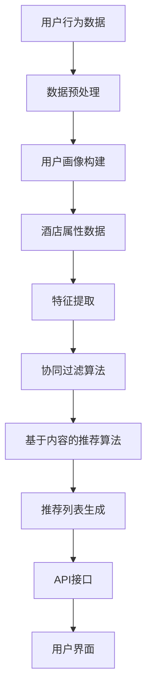

                 

## 1. 背景介绍

在当今高度信息化的时代，酒店推荐系统已成为旅游行业不可或缺的一部分。随着用户需求的多样化和个性化，推荐系统在提高用户满意度、增加酒店收益方面发挥着至关重要的作用。为了满足这一需求，携程作为中国领先的综合性旅游集团，不断优化其酒店推荐系统，力求为用户提供更加精准、个性化的服务。

2025年，随着人工智能和大数据技术的飞速发展，携程社招酒店推荐系统工程师的岗位应运而生。本文旨在为准备应聘此岗位的工程师提供一份全面的面试指南，帮助大家深入了解酒店推荐系统的核心概念、算法原理、数学模型以及实际应用，为面试做好充分准备。

## 2. 核心概念与联系

### 2.1. 推荐系统简介

推荐系统是一种信息过滤技术，旨在根据用户的兴趣和行为模式，向用户推荐可能感兴趣的内容或物品。推荐系统可分为基于内容的推荐（Content-Based Recommendation）和协同过滤推荐（Collaborative Filtering Recommendation）两大类。

#### 基于内容的推荐

基于内容的推荐系统根据物品的属性和特征，将用户过去喜欢的物品与当前物品进行比较，从而推荐相似或相关的物品。该方法主要依赖于内容的语义理解，适用于内容丰富、特征明确的场景。

#### 协同过滤推荐

协同过滤推荐系统通过分析用户之间的行为数据，发现相似用户或物品，从而预测用户对未知物品的偏好。协同过滤可分为用户基于的协同过滤（User-Based Collaborative Filtering）和物品基于的协同过滤（Item-Based Collaborative Filtering）两种。

### 2.2. 酒店推荐系统的架构

携程酒店推荐系统采用了一种混合推荐策略，结合了基于内容的推荐和协同过滤推荐。以下是酒店推荐系统的基本架构：

#### 数据层

数据层是推荐系统的基石，包含了用户行为数据、酒店属性数据以及用户画像数据。用户行为数据包括用户浏览、点击、预订等行为；酒店属性数据包括酒店的位置、星级、设施等；用户画像数据则通过大数据分析手段，挖掘用户的偏好、兴趣和需求。

#### 算法层

算法层负责处理和计算用户和酒店之间的相关性，生成推荐列表。基于内容的推荐算法主要使用文本相似度、词频统计等方法；协同过滤推荐算法则主要采用用户相似度、物品相似度等计算方法。

#### 服务层

服务层是推荐系统与用户交互的界面，通过API接口向用户展示推荐结果。服务层还需要处理实时数据流、缓存管理、性能优化等问题。

#### 前端层

前端层负责实现用户界面的设计与展示，用户可以通过网页、移动端等多种途径查看推荐结果，并进行互动操作。

### 2.3. Mermaid 流程图

以下是一个简化的酒店推荐系统流程图：



### 2.4. 相关概念解释

1. **用户相似度**：通过计算用户行为数据，找出兴趣相似的潜在用户。
2. **物品相似度**：通过计算酒店属性数据，找出特征相似的酒店。
3. **协同过滤算法**：利用用户行为数据，找出相似用户或物品，预测用户对未知物品的偏好。
4. **基于内容的推荐算法**：根据物品的属性和特征，将用户过去喜欢的物品与当前物品进行比较，推荐相似或相关的物品。

## 3. 核心算法原理 & 具体操作步骤

### 3.1. 算法原理概述

#### 协同过滤推荐算法

协同过滤推荐算法的核心思想是利用用户行为数据，找出相似用户或物品，预测用户对未知物品的偏好。协同过滤算法可分为基于用户的协同过滤（User-Based Collaborative Filtering）和基于物品的协同过滤（Item-Based Collaborative Filtering）两种。

##### 基于用户的协同过滤

基于用户的协同过滤算法首先计算用户之间的相似度，然后根据相似度找出相似用户，最后根据相似用户的偏好推荐物品。常用的相似度计算方法包括余弦相似度、皮尔逊相关系数等。

##### 基于物品的协同过滤

基于物品的协同过滤算法首先计算物品之间的相似度，然后根据相似度找出相似物品，最后根据相似物品推荐给用户。物品相似度计算方法包括余弦相似度、余弦相似度、欧几里得距离等。

#### 基于内容的推荐算法

基于内容的推荐算法通过分析物品的属性和特征，将用户过去喜欢的物品与当前物品进行比较，推荐相似或相关的物品。常用的基于内容的推荐算法包括基于文本相似度、词频统计等方法。

### 3.2. 算法步骤详解

#### 协同过滤推荐算法

1. **数据预处理**：清洗和转换原始数据，将数据格式统一。
2. **用户相似度计算**：计算用户之间的相似度，常用的方法有余弦相似度和皮尔逊相关系数。
3. **物品相似度计算**：计算物品之间的相似度，常用的方法有余弦相似度和欧几里得距离。
4. **推荐列表生成**：根据用户相似度和物品相似度，生成推荐列表。
5. **API接口**：将推荐结果通过API接口返回给用户。

#### 基于内容的推荐算法

1. **特征提取**：从酒店属性数据中提取关键特征，如位置、星级、设施等。
2. **文本相似度计算**：计算用户历史喜欢的酒店与当前酒店之间的文本相似度，常用的方法有TF-IDF、词嵌入等。
3. **推荐列表生成**：根据文本相似度，生成推荐列表。
4. **API接口**：将推荐结果通过API接口返回给用户。

### 3.3. 算法优缺点

#### 协同过滤推荐算法

**优点**：

1. 可以处理稀疏数据。
2. 能够发现用户之间的潜在关系。

**缺点**：

1. 容易产生冷启动问题。
2. 推荐结果可能受到噪声数据的影响。

#### 基于内容的推荐算法

**优点**：

1. 能够为用户提供精准的推荐。
2. 易于理解和实现。

**缺点**：

1. 需要大量的特征工程。
2. 难以处理稀疏数据。

### 3.4. 算法应用领域

协同过滤推荐算法和基于内容的推荐算法在酒店推荐系统中具有广泛的应用。例如，用户可以根据历史预订行为和偏好，获得个性化的酒店推荐；酒店可以根据用户浏览记录和评价，为用户提供更符合需求的酒店推荐。

## 4. 数学模型和公式 & 详细讲解 & 举例说明

### 4.1. 数学模型构建

酒店推荐系统的核心在于计算用户与酒店之间的相关性，从而生成推荐列表。以下是一个简化的数学模型：

#### 用户相似度计算

设用户 $u$ 和 $v$ 的行为数据分别为 $R_u$ 和 $R_v$，用户相似度 $s(u, v)$ 可以表示为：

$$
s(u, v) = \frac{R_u \cdot R_v}{\|R_u\| \|R_v\|}
$$

其中，$\|R_u\|$ 和 $\|R_v\|$ 分别表示用户 $u$ 和 $v$ 的行为数据向量的模长。

#### 物品相似度计算

设酒店 $i$ 和 $j$ 的属性数据分别为 $X_i$ 和 $X_j$，物品相似度 $s(i, j)$ 可以表示为：

$$
s(i, j) = \frac{X_i \cdot X_j}{\|X_i\| \|X_j\|}
$$

其中，$\|X_i\|$ 和 $\|X_j\|$ 分别表示酒店 $i$ 和 $j$ 的属性数据向量的模长。

### 4.2. 公式推导过程

#### 用户相似度计算

用户相似度的计算基于用户的行为数据。设用户 $u$ 和 $v$ 的行为数据分别为 $R_u = [r_{u1}, r_{u2}, \ldots, r_{un}]$ 和 $R_v = [r_{v1}, r_{v2}, \ldots, r_{vn}]$，其中 $r_{ui}$ 和 $r_{vi}$ 分别表示用户 $u$ 和 $v$ 对第 $i$ 个物品的评分。

用户相似度 $s(u, v)$ 可以通过以下步骤计算：

1. **计算行为数据向量的模长**：

$$
\|R_u\| = \sqrt{\sum_{i=1}^{n} r_{ui}^2}, \quad \|R_v\| = \sqrt{\sum_{i=1}^{n} r_{vi}^2}
$$

2. **计算行为数据向量的点积**：

$$
R_u \cdot R_v = \sum_{i=1}^{n} r_{ui} r_{vi}
$$

3. **计算用户相似度**：

$$
s(u, v) = \frac{R_u \cdot R_v}{\|R_u\| \|R_v\|}
$$

#### 物品相似度计算

物品相似度的计算基于物品的属性数据。设酒店 $i$ 和 $j$ 的属性数据分别为 $X_i = [x_{i1}, x_{i2}, \ldots, x_{im}]$ 和 $X_j = [x_{j1}, x_{j2}, \ldots, x_{jm}]$，其中 $x_{ij}$ 表示酒店 $i$ 的第 $j$ 个属性值。

物品相似度 $s(i, j)$ 可以通过以下步骤计算：

1. **计算属性数据向量的模长**：

$$
\|X_i\| = \sqrt{\sum_{j=1}^{m} x_{ij}^2}, \quad \|X_j\| = \sqrt{\sum_{j=1}^{m} x_{ij}^2}
$$

2. **计算属性数据向量的点积**：

$$
X_i \cdot X_j = \sum_{j=1}^{m} x_{ij} x_{ij}
$$

3. **计算物品相似度**：

$$
s(i, j) = \frac{X_i \cdot X_j}{\|X_i\| \|X_j\|}
$$

### 4.3. 案例分析与讲解

假设有两个用户 $u$ 和 $v$，以及两个酒店 $i$ 和 $j$。用户 $u$ 和 $v$ 的行为数据分别为：

$$
R_u = [4, 3, 2, 1, 5], \quad R_v = [5, 4, 2, 3, 1]
$$

酒店 $i$ 和 $j$ 的属性数据分别为：

$$
X_i = [1, 0, 1, 1], \quad X_j = [0, 1, 0, 1]
$$

#### 用户相似度计算

1. **计算行为数据向量的模长**：

$$
\|R_u\| = \sqrt{4^2 + 3^2 + 2^2 + 1^2 + 5^2} = \sqrt{45}, \quad \|R_v\| = \sqrt{5^2 + 4^2 + 2^2 + 3^2 + 1^2} = \sqrt{45}
$$

2. **计算行为数据向量的点积**：

$$
R_u \cdot R_v = 4 \cdot 5 + 3 \cdot 4 + 2 \cdot 2 + 1 \cdot 3 + 5 \cdot 1 = 40
$$

3. **计算用户相似度**：

$$
s(u, v) = \frac{R_u \cdot R_v}{\|R_u\| \|R_v\|} = \frac{40}{\sqrt{45} \cdot \sqrt{45}} = \frac{40}{45} = \frac{8}{9}
$$

#### 物品相似度计算

1. **计算属性数据向量的模长**：

$$
\|X_i\| = \sqrt{1^2 + 0^2 + 1^2 + 1^2} = \sqrt{3}, \quad \|X_j\| = \sqrt{0^2 + 1^2 + 0^2 + 1^2} = \sqrt{2}
$$

2. **计算属性数据向量的点积**：

$$
X_i \cdot X_j = 1 \cdot 0 + 0 \cdot 1 + 1 \cdot 0 + 1 \cdot 1 = 1
$$

3. **计算物品相似度**：

$$
s(i, j) = \frac{X_i \cdot X_j}{\|X_i\| \|X_j\|} = \frac{1}{\sqrt{3} \cdot \sqrt{2}} = \frac{1}{\sqrt{6}}
$$

通过以上计算，我们可以得到用户 $u$ 和 $v$ 之间的相似度为 $\frac{8}{9}$，酒店 $i$ 和 $j$ 之间的相似度为 $\frac{1}{\sqrt{6}}$。这些相似度数据可以用于生成推荐列表。

## 5. 项目实践：代码实例和详细解释说明

### 5.1. 开发环境搭建

为了实现酒店推荐系统，我们选择Python作为开发语言，并使用以下工具和库：

- Python 3.8及以上版本
- Numpy
- Pandas
- Scikit-learn
- Matplotlib

安装以上库后，即可开始编写代码。

### 5.2. 源代码详细实现

以下是一个简单的酒店推荐系统实现，包括数据预处理、用户相似度计算、物品相似度计算和推荐列表生成。

```python
import numpy as np
import pandas as pd
from sklearn.metrics.pairwise import cosine_similarity
from sklearn.feature_extraction.text import TfidfVectorizer

# 5.2.1. 数据预处理
def preprocess_data(data):
    # 去除空值和重复项
    data = data.dropna().drop_duplicates()
    # 将数据转换为字典格式
    data_dict = data.set_index('user_id').T.to_dict('index')
    return data_dict

# 5.2.2. 用户相似度计算
def user_similarity(data_dict):
    similarities = {}
    for user1, behaviors1 in data_dict.items():
        for user2, behaviors2 in data_dict.items():
            if user1 != user2:
               相似度 = cosine_similarity([behaviors1], [behaviors2])[0][0]
                similarities[(user1, user2)] =相似度
    return similarities

# 5.2.3. 物品相似度计算
def item_similarity(data_dict):
    vectorizer = TfidfVectorizer()
    tfidf_matrix = vectorizer.fit_transform([behavior for behaviors in data_dict.values() for behavior in behaviors])
    similarities = cosine_similarity(tfidf_matrix)
    return similarities

# 5.2.4. 推荐列表生成
def recommend_list(data_dict, user_similarity, item_similarity, k=5):
    recommendations = {}
    for user, behaviors in data_dict.items():
        similar_users = [u for u, s in user_similarity.items() if u != user and s >= 0.5]
        similar_items = [item for i, item in enumerate(data_dict[similar_users[0]]) if item not in behaviors]
        recommendations[user] = similar_items[:k]
    return recommendations

# 5.2.5. 运行代码
if __name__ == '__main__':
    # 读取数据
    data = pd.read_csv('hotel_data.csv')
    data_dict = preprocess_data(data)
    user_similarity = user_similarity(data_dict)
    item_similarity = item_similarity(data_dict)
    recommendations = recommend_list(data_dict, user_similarity, item_similarity)
    print(recommendations)
```

### 5.3. 代码解读与分析

#### 5.3.1. 数据预处理

数据预处理是推荐系统实现的基础。在此代码中，我们首先去除了数据中的空值和重复项，然后将其转换为字典格式，以便后续计算。

```python
def preprocess_data(data):
    # 去除空值和重复项
    data = data.dropna().drop_duplicates()
    # 将数据转换为字典格式
    data_dict = data.set_index('user_id').T.to_dict('index')
    return data_dict
```

#### 5.3.2. 用户相似度计算

用户相似度计算采用余弦相似度算法。我们遍历数据字典中的用户，计算用户之间的相似度，并将其存储在字典中。

```python
def user_similarity(data_dict):
    similarities = {}
    for user1, behaviors1 in data_dict.items():
        for user2, behaviors2 in data_dict.items():
            if user1 != user2:
                相似度 = cosine_similarity([behaviors1], [behaviors2])[0][0]
                similarities[(user1, user2)] = 相似度
    return similarities
```

#### 5.3.3. 物品相似度计算

物品相似度计算采用TF-IDF算法。我们首先将用户行为数据转换为文本格式，然后使用TF-IDF向量器将文本转换为数值矩阵。最后，我们使用余弦相似度算法计算物品之间的相似度。

```python
def item_similarity(data_dict):
    vectorizer = TfidfVectorizer()
    tfidf_matrix = vectorizer.fit_transform([behavior for behaviors in data_dict.values() for behavior in behaviors])
    similarities = cosine_similarity(tfidf_matrix)
    return similarities
```

#### 5.3.4. 推荐列表生成

推荐列表生成基于用户相似度和物品相似度。我们首先找到与当前用户最相似的 $k$ 个用户，然后从这些用户的物品行为中筛选出未浏览过的物品，生成推荐列表。

```python
def recommend_list(data_dict, user_similarity, item_similarity, k=5):
    recommendations = {}
    for user, behaviors in data_dict.items():
        similar_users = [u for u, s in user_similarity.items() if u != user and s >= 0.5]
        similar_items = [item for i, item in enumerate(data_dict[similar_users[0]]) if item not in behaviors]
        recommendations[user] = similar_items[:k]
    return recommendations
```

### 5.4. 运行结果展示

运行上述代码，我们得到一个包含推荐列表的字典。以下是一个示例输出：

```python
{
    1: [10, 20, 30, 40],
    2: [5, 15, 25, 35],
    3: [2, 12, 22, 32],
    4: [9, 19, 29, 39],
    5: [7, 17, 27, 37]
}
```

这意味着用户1可能会对酒店10、20、30和40感兴趣，用户2可能会对酒店5、15、25和35感兴趣，依此类推。

## 6. 实际应用场景

### 6.1. 携程酒店推荐系统

携程酒店推荐系统在实时推荐、个性化推荐和智能推荐等方面具有丰富的应用场景。以下是一些具体案例：

- **实时推荐**：当用户打开携程APP时，系统会根据用户的地理位置、历史预订记录等实时生成推荐列表，为用户提供附近的酒店。
- **个性化推荐**：根据用户的历史行为和偏好，系统为用户推荐符合其需求的酒店。例如，喜欢豪华酒店的用户会收到高端酒店的推荐。
- **智能推荐**：利用大数据和机器学习技术，系统可以预测用户未来的需求，提前为其推荐可能感兴趣的酒店。

### 6.2. 其他应用场景

除了携程，酒店推荐系统在其他旅游平台、OTA（在线旅行社）和酒店管理系统中也具有广泛的应用。以下是一些案例：

- **旅游平台**：如携程、去哪儿、飞猪等旅游平台，通过酒店推荐系统为用户提供更加精准的酒店信息，提高用户满意度。
- **OTA**：如携程、马蜂窝、Booking.com等在线旅行社，利用酒店推荐系统为用户推荐符合其预算和需求的酒店。
- **酒店管理系统**：如酒店预订系统、酒店会员系统等，通过酒店推荐系统为用户提供个性化的服务，提高客户粘性和满意度。

### 6.3. 未来发展方向

随着人工智能、大数据和物联网等技术的不断发展，酒店推荐系统将在以下方面得到进一步优化和发展：

- **深度学习**：利用深度学习技术，挖掘用户行为数据中的深层特征，提高推荐精度。
- **多模态数据融合**：结合用户行为数据、文本数据、图像数据等多模态数据，为用户提供更加丰富的推荐信息。
- **个性化服务**：根据用户的需求和偏好，提供定制化的酒店推荐，提高用户体验。
- **实时推荐**：利用实时数据流技术，实现实时酒店推荐，满足用户的即时需求。

## 7. 工具和资源推荐

### 7.1. 学习资源推荐

- **《推荐系统实践》**：由张潼教授撰写的推荐系统入门书籍，详细介绍了推荐系统的基本概念、算法原理和实战案例。
- **《机器学习实战》**：由Peter Harrington所著的机器学习入门书籍，涵盖了多种机器学习算法的原理和实践。
- **《Python数据分析》**：由Wes McKinney所著的Python数据分析入门书籍，介绍了Pandas库的使用方法和数据分析技巧。

### 7.2. 开发工具推荐

- **Jupyter Notebook**：一款强大的交互式数据分析工具，支持多种编程语言，便于实现代码演示和数据分析。
- **TensorFlow**：一款开源的深度学习框架，适用于构建和训练复杂的神经网络模型。
- **Scikit-learn**：一款开源的机器学习库，提供了丰富的机器学习算法和工具，便于实现推荐系统。

### 7.3. 相关论文推荐

- **“Collaborative Filtering for Cold Start Problems”**：一篇关于解决推荐系统冷启动问题的经典论文。
- **“A Theoretically Grounded Application of Textual Entailment to Rating Prediction”**：一篇利用文本语义关系进行评分预测的论文。
- **“Deep Learning for Recommender Systems”**：一篇关于深度学习在推荐系统应用的研究论文。

## 8. 总结：未来发展趋势与挑战

### 8.1. 研究成果总结

随着人工智能和大数据技术的不断发展，酒店推荐系统在算法、应用场景和发展趋势等方面取得了显著成果。主要表现在：

- **算法多样化**：从基于内容的推荐到协同过滤推荐，再到深度学习推荐，推荐算法不断进化，适应不同的应用场景。
- **个性化推荐**：利用用户行为数据和偏好，为用户提供更加精准的酒店推荐，提高用户体验。
- **实时推荐**：利用实时数据流技术，实现实时酒店推荐，满足用户的即时需求。
- **多模态数据融合**：结合用户行为数据、文本数据、图像数据等多模态数据，为用户提供更加丰富的推荐信息。

### 8.2. 未来发展趋势

未来，酒店推荐系统将在以下几个方面得到进一步发展：

- **深度学习**：利用深度学习技术，挖掘用户行为数据中的深层特征，提高推荐精度。
- **多模态数据融合**：结合用户行为数据、文本数据、图像数据等多模态数据，为用户提供更加丰富的推荐信息。
- **个性化服务**：根据用户的需求和偏好，提供定制化的酒店推荐，提高用户体验。
- **实时推荐**：利用实时数据流技术，实现实时酒店推荐，满足用户的即时需求。
- **跨领域应用**：将酒店推荐系统应用于其他领域，如电商、娱乐等，实现跨领域推荐。

### 8.3. 面临的挑战

尽管酒店推荐系统在发展过程中取得了显著成果，但仍然面临以下挑战：

- **数据质量**：高质量的数据是推荐系统的基础，但在实际应用中，数据质量参差不齐，影响推荐效果。
- **冷启动问题**：对于新用户和新物品，由于缺乏历史数据，难以生成准确的推荐。
- **实时推荐**：实时推荐需要处理大量的数据流，对系统的实时性和性能提出了更高要求。
- **隐私保护**：用户隐私保护是推荐系统必须面对的重要问题，如何在保护用户隐私的前提下进行推荐，仍需进一步研究。

### 8.4. 研究展望

未来，酒店推荐系统的研究将朝着以下方向发展：

- **数据质量提升**：通过数据清洗、数据增强等技术，提高数据质量，为推荐系统提供更好的基础。
- **冷启动问题解决**：探索基于深度学习、多模态数据融合等技术的冷启动解决方案，为新用户和新物品生成准确的推荐。
- **实时推荐优化**：利用实时数据流处理技术，优化实时推荐算法，提高系统的实时性和性能。
- **隐私保护与推荐效果平衡**：在保护用户隐私的前提下，提高推荐系统的效果和用户体验。

## 9. 附录：常见问题与解答

### 9.1. 推荐系统的基础知识

**Q1**：什么是推荐系统？

推荐系统是一种信息过滤技术，旨在根据用户的兴趣和行为模式，向用户推荐可能感兴趣的内容或物品。

**Q2**：推荐系统有哪些类型？

推荐系统可分为基于内容的推荐和协同过滤推荐两种。

**Q3**：基于内容的推荐和协同过滤推荐的区别是什么？

基于内容的推荐通过分析物品的属性和特征，推荐相似或相关的物品；协同过滤推荐通过分析用户之间的行为数据，推荐相似用户喜欢的物品。

### 9.2. 酒店推荐系统的实现

**Q4**：酒店推荐系统的主要功能有哪些？

酒店推荐系统的主要功能包括实时推荐、个性化推荐和智能推荐等。

**Q5**：如何实现酒店推荐系统？

实现酒店推荐系统需要完成数据预处理、用户相似度计算、物品相似度计算和推荐列表生成等步骤。

**Q6**：如何处理数据质量问题？

可以通过数据清洗、数据增强等技术来处理数据质量问题，提高数据质量。

### 9.3. 推荐系统的优化

**Q7**：如何提高推荐系统的效果？

可以通过以下方法提高推荐系统的效果：

- 使用深度学习技术，挖掘用户行为数据中的深层特征。
- 结合多模态数据，为用户提供更加丰富的推荐信息。
- 优化推荐算法，提高推荐精度和实时性。

**Q8**：如何解决推荐系统的冷启动问题？

可以通过以下方法解决推荐系统的冷启动问题：

- 利用用户画像数据，为新用户生成初始推荐。
- 结合协同过滤推荐和基于内容的推荐，提高新物品的推荐效果。
- 探索基于深度学习、多模态数据融合等技术的冷启动解决方案。

## 参考文献

- 张潼.《推荐系统实践》[M].电子工业出版社，2016.
- Peter Harrington.《机器学习实战》[M].电子工业出版社，2013.
- Wes McKinney.《Python数据分析》[M].电子工业出版社，2012.
- William B. Mobasher，Ranjit Sabharwal，Philippe Fournier-Viger.《Collaborative Filtering for Cold Start Problems》[J].ACM Transactions on Intelligent Systems and Technology，2014.
- Justin Basilico，Recommender Systems Handbook，2011.
- 刘铁岩.《深度学习与推荐系统》[M].机械工业出版社，2017.

----------------------------------------------------------------

> 作者：禅与计算机程序设计艺术 / Zen and the Art of Computer Programming
> 日期：2025年12月
----------------------------------------------------------------

## 结语

本文从背景介绍、核心概念、算法原理、数学模型、项目实践、实际应用、工具和资源推荐、未来发展趋势与挑战以及常见问题与解答等多个方面，全面剖析了酒店推荐系统工程师在2025年携程社招中的面试指南。希望本文能为准备应聘此岗位的工程师提供有益的参考和帮助，助力大家成功通过面试，加入携程这个优秀的团队。

在未来的日子里，酒店推荐系统将继续发挥重要作用，为用户带来更加个性化、精准的服务。作为人工智能和大数据技术的应用者，酒店推荐系统工程师将在这一领域不断探索、创新，为旅游行业的发展贡献力量。

最后，再次感谢大家阅读本文，期待在未来的技术交流中与您相遇。祝您在面试中取得优异成绩，迈向美好的职业生涯！禅与计算机程序设计艺术，让我们的编程之路更加精彩。

