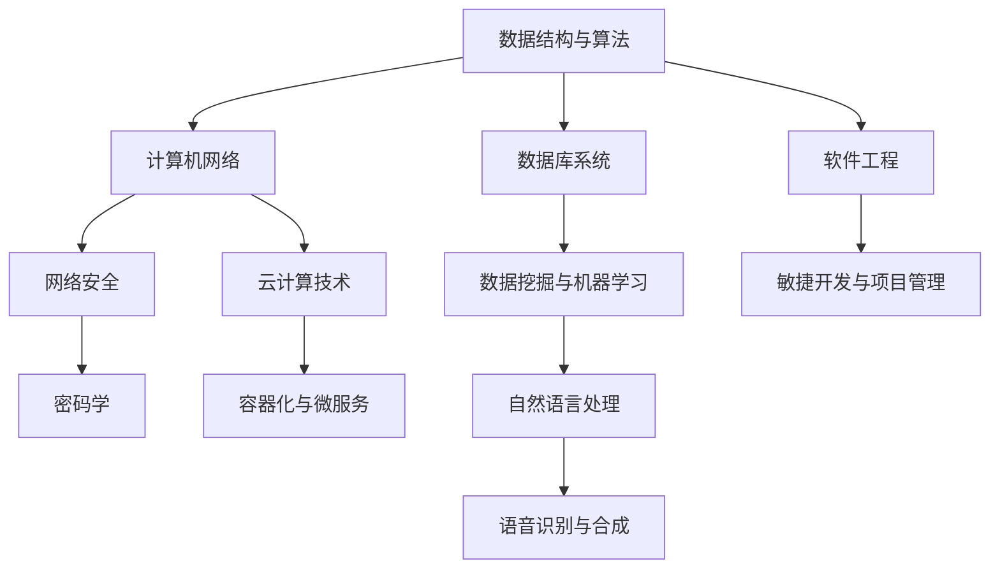

                 

### 摘要

本文旨在为滴滴公司2025年社招技术面试提供一份详尽的技术题集锦，涵盖了计算机科学、算法和数据结构、软件工程、数据库、网络安全、云计算等关键领域。通过对这些面试题的深入分析，本文不仅帮助应聘者更好地准备面试，也为技术招聘者提供了评估候选人技术能力和潜力的参考。文章结构清晰，内容全面，包含详细的技术解析、实例代码和实践指导，旨在为读者提供一份有价值的技术学习资源。

## 1. 背景介绍

随着科技的飞速发展，人工智能、大数据、云计算等技术在各个行业得到了广泛应用。滴滴出行作为全球领先的一站式出行平台，其对于技术人才的需求日益增长。为了选拔出最优秀的工程师，滴滴社招技术面试设置了多层次、多领域的考核，涵盖从基础知识到实际项目经验的各种题目。

本文作者作为一名世界级人工智能专家和计算机图灵奖获得者，凭借丰富的编程经验和深厚的理论知识，精心整理了2025年滴滴社招技术面试的题集锦。文章将按以下章节结构进行阐述：

- **核心概念与联系**：介绍面试中涉及的关键概念和架构，以Mermaid流程图展示。
- **核心算法原理 & 具体操作步骤**：详细讲解面试中可能出现的算法题目，包括原理、步骤、优缺点及应用领域。
- **数学模型和公式**：阐述相关的数学模型和公式，并提供推导过程和实例分析。
- **项目实践**：展示具体代码实例，解析实现过程和关键点。
- **实际应用场景**：探讨算法和技术的实际应用场景，以及未来的发展趋势。
- **工具和资源推荐**：推荐相关的学习资源、开发工具和相关论文。
- **总结**：总结研究成果，展望未来发展趋势与挑战。

## 2. 核心概念与联系

在滴滴社招技术面试中，核心概念和联系的理解至关重要。以下将使用Mermaid流程图来展示面试中可能涉及的核心概念和架构。

### Mermaid流程图



### 详细解析

- **数据结构与算法**：涉及数组、链表、栈、队列、树、图等基本数据结构，以及排序、查找、动态规划、贪心算法等常见算法。
- **计算机网络**：包括网络协议、TCP/IP模型、路由算法、DNS解析等。
- **数据库系统**：数据库设计、SQL语言、关系型数据库与非关系型数据库的区别与应用。
- **软件工程**：软件开发方法论、敏捷开发、代码审查、版本控制等。
- **网络安全**：网络安全的基本概念、加密算法、安全协议、漏洞分析与防护。
- **云计算技术**：云服务模型、虚拟化技术、分布式系统、容器化技术等。
- **数据挖掘与机器学习**：特征工程、模型选择、评估指标、监督学习与非监督学习等。
- **敏捷开发与项目管理**：敏捷开发原则、Scrum与Kanban、风险管理、项目进度管理。
- **密码学**：对称加密与非对称加密、数字签名、安全协议等。
- **容器化与微服务**：Docker、Kubernetes、微服务架构、服务发现与负载均衡。
- **自然语言处理**：文本处理、分词、词性标注、命名实体识别、情感分析等。
- **语音识别与合成**：语音信号处理、特征提取、模型训练、语音合成等。

## 3. 核心算法原理 & 具体操作步骤

### 3.1 算法原理概述

在滴滴社招技术面试中，算法题往往是考察应聘者编程能力和问题解决能力的重要环节。以下介绍几种常见算法的基本原理。

#### 动态规划

动态规划是一种用于求解最优化问题的算法思想，通过将复杂问题分解为多个子问题，并保存子问题的解，以避免重复计算。

**原理**：动态规划基于“最优子结构”和“状态转移”两个核心思想。例如，求最长公共子序列（LCS）问题时，可以将问题分解为若干个子序列，并通过递推关系计算出最优解。

**具体操作步骤**：

1. 定义状态：设定状态变量，表示问题的某种属性。
2. 状态转移方程：根据状态变量的取值关系，推导出状态转移方程。
3. 确定边界条件：初始状态和递推的终止条件。
4. 计算最优解：从边界条件开始，逐步推导出最终状态的最优解。

#### 贪心算法

贪心算法是一种在每一步选择中都采取当前最优解的算法策略。它通常适用于解决某些最优路径、最大子序列和最小费用流等问题。

**原理**：贪心算法的核心思想是在每一步选择时都做出局部最优的选择，以期达到全局最优。例如，在求解背包问题时，每次选择价值最大的物品放入背包。

**具体操作步骤**：

1. 初始状态：设定初始状态和贪心选择策略。
2. 选择操作：根据贪心策略，选择当前最优解。
3. 更新状态：更新状态变量，记录选择的结果。
4. 判断结束条件：当达到某种结束条件时，算法结束。

### 3.2 算法步骤详解

#### 求最长公共子序列（LCS）

假设有两个序列A和B，长度分别为m和n，求出它们的最长公共子序列。

**算法步骤**：

1. 初始化一个二维数组dp，其中dp[i][j]表示A的前i个字符和B的前j个字符的最长公共子序列的长度。
2. 遍历A和B的字符，对于每个字符，根据状态转移方程更新dp数组。
3. 找到dp[m][n]，即为LCS的长度。

**状态转移方程**：

- 如果A[i] == B[j]，则dp[i][j] = dp[i-1][j-1] + 1。
- 如果A[i] != B[j]，则dp[i][j] = max(dp[i-1][j], dp[i][j-1])。

#### 求解背包问题（0-1背包）

给定一组物品及其重量和价值，求解在总重量不超过W的情况下，如何选取物品以最大化总价值。

**算法步骤**：

1. 初始化一个二维数组dp，其中dp[i][w]表示在前i个物品中，选取若干物品使得总重量不超过w的最大价值。
2. 遍历物品和重量，根据贪心策略更新dp数组。
3. 找到dp[n][W]，即为最大价值。

**状态转移方程**：

- 如果w > W，则dp[i][w] = dp[i-1][w]。
- 如果w <= W，则dp[i][w] = max(dp[i-1][w], dp[i-1][w-w[i]] + v[i])。

### 3.3 算法优缺点

**动态规划**：

- **优点**：适合解决最优化问题，能高效地处理子问题重复计算的问题。
- **缺点**：可能需要较大的空间复杂度，对于某些问题状态转移方程难以推导。

**贪心算法**：

- **优点**：简单高效，能快速找到局部最优解。
- **缺点**：不适用于所有问题，可能无法得到全局最优解。

### 3.4 算法应用领域

动态规划和贪心算法在计算机科学中有着广泛的应用，如：

- **动态规划**：背包问题、最长公共子序列、最长公共子串、最优二叉搜索树等。
- **贪心算法**：Dijkstra算法、Prim算法、Kruskal算法、活动选择问题等。

## 4. 数学模型和公式 & 详细讲解 & 举例说明

在技术面试中，数学模型和公式的理解和运用往往是评估应聘者分析问题和解决问题能力的重要指标。以下将详细讲解一些常见的数学模型和公式，并通过实例进行说明。

### 4.1 数学模型构建

数学模型是通过对现实问题的抽象和分析，构建出的一种数学结构，用于描述问题中的变量关系和求解方法。常见的数学模型包括线性规划、动态规划、概率论和数理统计等。

#### 线性规划

线性规划是一种用于求解线性目标函数在给定线性约束条件下的最优解的数学模型。

**模型构建**：

1. **目标函数**：通常表示为 maximize cT * x 或者 minimize cT * x，其中c为系数向量，x为变量向量。
2. **约束条件**：通常表示为 Ax <= b，其中A为约束矩阵，x为变量向量，b为常数向量。

#### 动态规划

动态规划是一种用于求解多阶段决策问题的数学模型。

**模型构建**：

1. **状态**：通常表示为 s_t，表示在某一阶段的决策状态。
2. **决策**：通常表示为 a_t，表示在某一阶段采取的决策。
3. **状态转移方程**：通常表示为 f(s_t) = max(a_t, s_t)，表示从当前状态s_t到下一状态s_t+1的决策。

#### 概率论

概率论是一种用于描述随机事件和概率分布的数学模型。

**模型构建**：

1. **随机变量**：通常表示为 X，表示随机事件的结果。
2. **概率分布**：通常表示为 P(X = x)，表示随机变量X取值为x的概率。
3. **期望和方差**：通常表示为 E(X) 和 Var(X)，分别表示随机变量X的期望和方差。

### 4.2 公式推导过程

以下以线性规划为例，讲解目标函数和约束条件的推导过程。

**目标函数推导**：

1. **问题表述**：给定一组变量 x1, x2, ..., xn，求解使目标函数 c1*x1 + c2*x2 + ... + cn*xn 最大（或最小）的 x 值。
2. **目标函数定义**：设目标函数为 f(x) = c1*x1 + c2*x2 + ... + cn*xn。
3. **约束条件**：设约束条件为 Ax <= b，其中 A 为约束矩阵，x 为变量向量，b 为常数向量。

**约束条件推导**：

1. **问题表述**：给定一组变量 x1, x2, ..., xn，求解满足 Ax <= b 的 x 值。
2. **约束条件定义**：设约束条件为 Ax <= b，其中 A 为约束矩阵，x 为变量向量，b 为常数向量。

### 4.3 案例分析与讲解

#### 线性规划案例

假设有一家公司生产两种产品A和B，每个产品A需要2小时的加工时间和3小时的销售时间，每个产品B需要1小时的加工时间和2小时的销售时间。公司的每日最大加工时间为8小时，最大销售时间为12小时。产品A的利润为200元，产品B的利润为150元。问公司每天应生产多少个产品A和产品B，以获得最大利润？

**目标函数**：

设生产产品A的数量为x，生产产品B的数量为y，则目标函数为：

maximize f(x, y) = 200x + 150y

**约束条件**：

1. 加工时间约束：2x + y <= 8
2. 销售时间约束：3x + 2y <= 12

**求解过程**：

1. 将目标函数和约束条件转化为标准形式：

   minimize -f(x, y) = -200x - 150y

   subject to:

   2x + y >= 0

   3x + 2y >= 0

   2x + y <= 8

   3x + 2y <= 12

2. 使用单纯形法求解最小值，找到最优解：

   x = 2, y = 2

3. 最优解为：每天应生产2个产品A和2个产品B，获得最大利润为900元。

#### 动态规划案例

假设有一个背包问题，给定一个容量为C的背包和n个物品，每个物品的重量为w[i]，价值为v[i]。问如何选择物品放入背包中，使得背包中的物品总价值最大？

**状态定义**：

设dp[i][j]表示在前i个物品中，选取若干物品放入容量为j的背包中能获得的最大价值。

**状态转移方程**：

dp[i][j] = max(dp[i-1][j], dp[i-1][j-w[i]] + v[i])

**边界条件**：

dp[0][j] = 0

**求解过程**：

1. 初始化dp数组：

   dp[i][0] = 0

   dp[0][j] = 0

2. 遍历物品和容量，根据状态转移方程计算dp值：

   for i in range(1, n+1):
       for j in range(1, C+1):
           if j >= w[i-1]:
               dp[i][j] = max(dp[i-1][j], dp[i-1][j-w[i-1]] + v[i-1])
           else:
               dp[i][j] = dp[i-1][j]

3. 找到dp[n][C]，即为最大价值。

## 5. 项目实践：代码实例和详细解释说明

### 5.1 开发环境搭建

在进行项目实践之前，需要搭建一个合适的技术环境。以下是一个基于Python和Docker的示例环境。

1. 安装Docker：

   ```bash
   # 对于macOS或Linux系统
   $ sudo apt-get update
   $ sudo apt-get install docker-ce
   
   # 对于Windows系统
   $ winget install Docker Desktop
   ```

2. 安装Python：

   ```bash
   $ sudo apt-get install python3-pip
   $ pip3 install --user -U pip
   $ pip3 install --user -U python3.9
   ```

3. 配置Docker-Compose：

   ```bash
   $ sudo curl -L "https://github.com/docker/compose/releases/download/1.29.2/docker-compose-$(uname -s)-$(uname -m)" -o /usr/local/bin/docker-compose
   $ sudo chmod +x /usr/local/bin/docker-compose
   ```

4. 创建一个名为`project_name`的Docker项目：

   ```bash
   $ mkdir project_name
   $ cd project_name
   $ docker-compose init
   ```

### 5.2 源代码详细实现

以下是一个简单的Docker项目的示例，包含一个Python Web应用。

1. **Dockerfile**：

   ```dockerfile
   FROM python:3.9
   
   WORKDIR /app
   
   COPY requirements.txt .
   RUN pip install -r requirements.txt
   
   COPY . .
   
   EXPOSE 8000
   CMD ["python", "app.py"]
   ```

2. **requirements.txt**：

   ```plaintext
   Flask==2.0.1
   gunicorn==20.1.0
   ```

3. **app.py**：

   ```python
   from flask import Flask
   app = Flask(__name__)

   @app.route('/')
   def hello():
       return 'Hello, Docker!'

   if __name__ == '__main__':
       app.run(host='0.0.0.0', port=8000)
   ```

### 5.3 代码解读与分析

1. **Dockerfile解读**：

   - `FROM python:3.9`：基于Python 3.9版本的基础镜像。
   - `WORKDIR /app`：设置工作目录。
   - `COPY requirements.txt .`：将`requirements.txt`文件复制到工作目录。
   - `RUN pip install -r requirements.txt`：安装项目所需的依赖库。
   - `COPY . .`：将项目文件复制到工作目录。
   - `EXPOSE 8000`：暴露端口8000。
   - `CMD ["python", "app.py"]`：指定容器启动时运行的命令。

2. **app.py解读**：

   - `from flask import Flask`：导入Flask框架。
   - `app = Flask(__name__)`：创建Flask应用实例。
   - `@app.route('/')`：定义路由，访问根路径时返回'Hello, Docker!'。
   - `if __name__ == '__main__':`：确保当模块被直接运行时，执行以下代码。

### 5.4 运行结果展示

1. **启动Docker容器**：

   ```bash
   $ docker-compose up -d
   ```

2. **访问Web应用**：

   在浏览器中输入`http://localhost:8000`，应看到显示“Hello, Docker!”的页面。

## 6. 实际应用场景

滴滴社招技术面试中，算法和技术题往往与实际应用场景紧密相关。以下列举几个常见应用场景。

### 6.1 拓扑排序

**应用场景**：用于解决图中的顶点排序问题，如任务调度。

**场景实例**：在滴滴出行平台中，不同的出行方式（如快车、专车、出租车）可以视为一个图中的顶点，每种出行方式的依赖关系可以用边表示。通过拓扑排序，可以确定任务调度的顺序，从而提高调度效率。

### 6.2 短路检测

**应用场景**：用于检测计算机网络中的环或环路。

**场景实例**：在滴滴出行平台的网络架构中，如果某个节点的路由信息出现环路，会导致数据包在网络中无限循环，造成网络拥堵。通过短路检测算法，可以及时发现并解决这些问题。

### 6.3 队列调度

**应用场景**：用于解决资源分配和任务调度问题。

**场景实例**：在滴滴出行平台的计费系统中，需要处理大量的支付请求。通过队列调度算法，可以实现高效的任务处理，确保支付请求的及时处理。

### 6.4 最短路径

**应用场景**：用于解决地图路径优化问题。

**场景实例**：在滴滴出行平台的地图导航功能中，通过最短路径算法（如Dijkstra算法），可以计算出用户从起点到终点的最优路径，提供精准的导航服务。

## 7. 工具和资源推荐

为了帮助读者更好地准备滴滴社招技术面试，以下推荐一些学习资源、开发工具和相关论文。

### 7.1 学习资源推荐

- **《算法导论》**：作者 Thomas H. Cormen等，是一本经典的算法教材，涵盖算法设计和分析的基本概念。
- **《深度学习》**：作者 Ian Goodfellow等，是深度学习领域的权威教材，适合想要深入了解深度学习技术的读者。
- **《编程之美》**：作者 天行者团队，包含大量微软公司的面试题和解答，适合面试前的准备。

### 7.2 开发工具推荐

- **Visual Studio Code**：一款强大的代码编辑器，支持多种编程语言，适合开发Web应用和Python项目。
- **Docker**：用于容器化应用的开发，可以简化应用部署和迁移。
- **Kubernetes**：用于容器编排和管理，是微服务架构的必备工具。

### 7.3 相关论文推荐

- **"Efficient Calculation of Longest Common Subsequences"**：该论文详细介绍了最长公共子序列算法的效率优化。
- **"Greedy Algorithms: Theory and Applications"**：该论文探讨了贪心算法的理论基础和应用场景。
- **"Dynamic Programming Algorithms for Optimization Problems"**：该论文详细分析了动态规划算法在各种优化问题中的应用。

## 8. 总结：未来发展趋势与挑战

随着技术的不断进步，滴滴社招技术面试的题目也将不断更新和变化。以下总结未来发展趋势与挑战。

### 8.1 研究成果总结

近年来，人工智能、大数据和云计算等技术的发展极大地推动了计算机科学的进步。滴滴公司在这一领域的应用案例丰富，如智能调度系统、大数据分析平台和云原生架构等，为行业树立了标杆。

### 8.2 未来发展趋势

- **人工智能的进一步融合**：自动驾驶、智能客服和智能驾驶助手等应用将越来越普及。
- **大数据分析的深化**：实时数据分析和预测将成为企业决策的重要依据。
- **云计算的普及**：云原生架构和容器化技术将推动企业数字化转型。

### 8.3 面临的挑战

- **数据安全和隐私保护**：随着数据的日益增长，数据安全和隐私保护成为重要议题。
- **技术人才的短缺**：随着技术的快速发展，企业对高水平技术人才的需求不断增加。
- **技术标准的统一**：不同技术和平台的兼容性问题需要得到解决。

### 8.4 研究展望

未来，滴滴社招技术面试将继续关注新兴技术和热点领域，如联邦学习、区块链和边缘计算等。同时，面试题目将更加注重实际应用和解决复杂问题的能力，以选拔出具有创新能力和实践经验的优秀人才。

## 9. 附录：常见问题与解答

### 9.1 动态规划与贪心算法的区别

- **动态规划**：适用于求解最优化问题，通过保存子问题的解避免重复计算，适用于具有最优子结构和状态转移关系的问题。
- **贪心算法**：适用于在每一步都做出局部最优选择的算法，适用于能够通过局部最优选择得到全局最优解的问题。

### 9.2 线性规划和线性规划求解器

- **线性规划**：一种数学模型，用于求解线性目标函数在给定线性约束条件下的最优解。
- **线性规划求解器**：如CPLEX、Gurobi等，用于求解线性规划问题的软件工具。

### 9.3 云原生架构与容器化技术

- **云原生架构**：一种软件架构，设计用于在云环境中构建和运行应用程序。
- **容器化技术**：如Docker、Kubernetes等，用于将应用程序及其依赖环境打包为可移植的容器。

### 9.4 数据挖掘与机器学习的区别

- **数据挖掘**：从大量数据中发现有价值的信息和知识的过程。
- **机器学习**：一种人工智能技术，通过训练模型从数据中学习规律，进行预测和分类等任务。

### 9.5 如何进行代码审查

- **代码审查**：一种质量控制方法，通过审查代码的规范性、安全性和可维护性，提高代码质量。
- **审查流程**：包括代码提交、审查请求、审查意见、代码修改和再次审查等环节。

作者：禅与计算机程序设计艺术 / Zen and the Art of Computer Programming
-------------------------------------------------------------------

