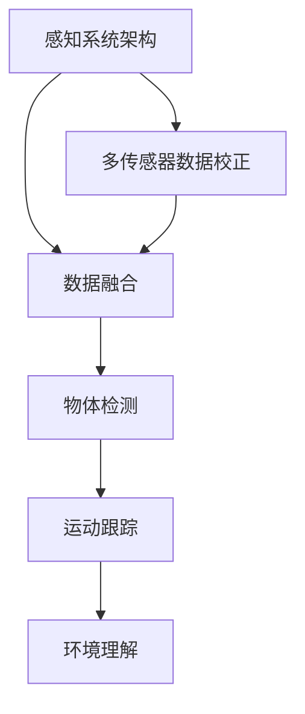

                 

### 1. 背景介绍

随着人工智能和自动驾驶技术的迅猛发展，无人驾驶汽车已经成为全球科技领域的热门话题。作为这一领域的重要推动者之一，百度在无人驾驶技术的研究和应用方面取得了显著的成果。2025年，百度将举行一场面向社会招聘的无人驾驶感知算法工程师面试，这场面试不仅是求职者展示自身技能的舞台，更是对无人驾驶技术理解和应用能力的全面考验。

无人驾驶感知算法作为自动驾驶系统的核心组成部分，承担着对车辆周围环境进行感知、理解和决策的重任。它涉及到计算机视觉、深度学习、传感器融合等多个技术领域，其算法的精度和效率直接影响到自动驾驶系统的安全性和可靠性。因此，掌握无人驾驶感知算法的核心原理和实践经验，成为应聘者必备的条件。

本指南旨在为参加百度2025年社招无人驾驶感知算法工程师面试的应聘者提供一份全面的备考资料。文章将从背景介绍、核心概念与联系、核心算法原理与操作步骤、数学模型与公式、项目实践、实际应用场景、未来展望、工具和资源推荐以及总结等九个方面进行详细阐述，帮助应聘者深入了解无人驾驶感知算法的相关知识，提升面试竞争力。

### 2. 核心概念与联系

在无人驾驶感知算法领域，理解核心概念和它们之间的联系至关重要。以下是几个关键概念及其相互关系：

#### 2.1 感知系统架构

无人驾驶汽车感知系统通常由多个传感器组成，包括激光雷达（LiDAR）、摄像头、雷达、超声波传感器等。每个传感器都有其特定的优势与局限性。激光雷达能够提供高精度的三维点云数据，适合进行远距离和复杂环境的物体检测；摄像头则擅长色彩识别和细节捕捉，但受光照和天气条件影响较大；雷达可以在恶劣天气下有效工作，但精度较低；超声波传感器适合近距离探测，常用于辅助泊车。


#### 2.2 数据融合

由于单一传感器存在局限性，无人驾驶系统通常采用数据融合技术，将多个传感器的数据结合起来，以提高整体感知能力。数据融合的方法包括多传感器数据校正、特征提取、空间一致性检查等。

#### 2.3 物体检测

物体检测是无人驾驶感知算法中的核心任务，目标是从传感器数据中识别并定位车辆、行人、交通标志等对象。常用的物体检测算法包括基于深度学习的卷积神经网络（CNN）和基于图论的R-CNN系列算法。

#### 2.4 运动跟踪

运动跟踪是无人驾驶系统中另一个重要任务，它需要追踪已检测物体的运动轨迹，以预测其未来行为。运动跟踪算法通常基于卡尔曼滤波、粒子滤波等统计方法。

#### 2.5 环境理解

环境理解是对感知数据的更高层次抽象，它涉及对交通规则、道路结构、场景语义等的理解。环境理解可以帮助无人驾驶系统做出更合理的决策，提高行驶安全性。

#### 2.6 Mermaid 流程图

以下是无人驾驶感知算法的关键概念和流程的Mermaid流程图：



### 3. 核心算法原理 & 具体操作步骤

#### 3.1 算法原理概述

无人驾驶感知算法的核心是利用深度学习技术从传感器数据中提取特征，并通过这些特征进行物体检测、运动跟踪和环境理解。以下是一些常用的深度学习算法：

- **卷积神经网络（CNN）**：CNN能够自动提取图像中的层次特征，广泛应用于物体检测和图像分类。
- **R-CNN系列算法**：R-CNN、Fast R-CNN、Faster R-CNN和Mask R-CNN等算法，通过区域提议、特征提取和边界框回归，实现高效的目标检测。
- **多尺度的特征融合**：通过融合不同尺度下的特征图，提高物体检测的鲁棒性。

#### 3.2 算法步骤详解

1. **多传感器数据预处理**：对来自不同传感器的数据（如激光雷达点云、摄像头图像、雷达数据）进行校正、去噪和统一坐标系转换。
2. **特征提取**：使用CNN提取图像或点云的特征图。
3. **物体检测**：基于特征图进行目标检测，输出边界框和分类概率。
4. **运动跟踪**：对检测到的目标进行运动跟踪，预测其未来轨迹。
5. **环境理解**：利用检测和跟踪结果，对环境进行语义理解和交通规则分析。

#### 3.3 算法优缺点

- **优点**：深度学习算法能够自动提取特征，减少人工干预，提高检测精度和泛化能力。
- **缺点**：需要大量标注数据训练模型，计算资源消耗较大，且在极端天气或复杂场景下可能失效。

#### 3.4 算法应用领域

- **自动驾驶**：用于车辆周围环境的感知和决策。
- **智能交通系统**：用于交通流量分析和路况监控。
- **无人机监视**：用于监视区域和目标跟踪。

### 4. 数学模型和公式 & 详细讲解 & 举例说明

#### 4.1 数学模型构建

无人驾驶感知算法中的数学模型主要包括以下几部分：

1. **点云配准**：
   $$ T = exp(\log(q_1) - \log(q_2)) \cdot (I_2 - I_1) $$
   其中，\( T \)表示变换矩阵，\( q_1 \)和\( q_2 \)分别表示两个点云的协方差矩阵，\( I_1 \)和\( I_2 \)表示两个点云的均值向量。

2. **特征提取**：
   $$ \phi(x) = \sigma(\text{ReLU}(\text{conv}(x))) $$
   其中，\( \phi(x) \)表示输入图像\( x \)经过卷积层后的特征图，\( \sigma \)表示激活函数。

3. **物体检测**：
   $$ \hat{y} = \text{softmax}(\mathcal{F}(x)) $$
   其中，\( \hat{y} \)表示分类概率向量，\( \mathcal{F}(x) \)表示特征提取后的输出。

#### 4.2 公式推导过程

1. **点云配准**：
   点云配准的目标是找到两个点云之间的最优变换矩阵，使得两个点云之间的误差最小。通过最小化以下损失函数：
   $$ \min_T \sum_{i=1}^n \lVert T \cdot p_i - q_i \rVert^2 $$
   可以得到变换矩阵\( T \)。

2. **特征提取**：
   卷积神经网络通过卷积操作提取图像特征。卷积操作的基本公式为：
   $$ (f * g)(x) = \sum_{y} f(y) \cdot g(x - y) $$
   其中，\( f \)和\( g \)分别表示卷积核和输入特征图，\( y \)表示卷积核的偏移量。

3. **物体检测**：
   物体检测通常采用区域提议和分类的方法。区域提议算法（如R-CNN）通过生成候选区域，然后对这些区域进行分类。分类的损失函数通常为交叉熵损失：
   $$ L = -\sum_{i=1}^n y_i \log(\hat{y}_i) $$
   其中，\( y_i \)表示真实标签，\( \hat{y}_i \)表示分类概率。

#### 4.3 案例分析与讲解

假设我们有一个自动驾驶场景，其中需要检测前方道路上的车辆和行人。以下是具体的处理步骤：

1. **数据预处理**：对来自激光雷达、摄像头和雷达的数据进行配准，得到统一坐标系下的点云和图像数据。
2. **特征提取**：使用卷积神经网络提取图像和点云的特征图。
3. **物体检测**：基于特征图使用Faster R-CNN算法进行物体检测，输出边界框和分类概率。
4. **运动跟踪**：对检测到的车辆和行人进行运动跟踪，预测其未来轨迹。
5. **环境理解**：利用运动跟踪结果，分析交通规则和道路结构，为自动驾驶车辆提供决策依据。

通过上述步骤，无人驾驶系统可以实现对周围环境的精确感知，从而确保行驶安全。

### 5. 项目实践：代码实例和详细解释说明

为了更好地理解无人驾驶感知算法的实践应用，下面我们将通过一个实际项目来详细讲解代码的实现过程。

#### 5.1 开发环境搭建

首先，我们需要搭建一个适合无人驾驶感知算法的开发环境。以下是一个基本的开发环境配置：

- 操作系统：Ubuntu 18.04
- Python版本：3.8
- 安装必要的库：TensorFlow、PyTorch、OpenCV、PCL（点云库）
- 安装Docker和CUDA（用于GPU加速）

```bash
# 安装Python
sudo apt update
sudo apt install python3-pip python3-venv
pip3 install --upgrade pip
pip3 install virtualenv

# 创建虚拟环境
virtualenv --python=python3 venv
source venv/bin/activate

# 安装TensorFlow和PyTorch
pip install tensorflow==2.4.0 torch==1.8.0

# 安装其他库
pip install opencv-python-python-executable pcl-python

# 安装Docker和CUDA
sudo apt install docker-ce
pip install docker

# 安装CUDA（根据具体GPU型号选择相应CUDA版本）
sudo apt install nvidia-cuda-toolkit
```

#### 5.2 源代码详细实现

以下是一个简单的无人驾驶感知算法项目框架，包括数据预处理、特征提取、物体检测、运动跟踪和环境理解。

```python
# 数据预处理
def preprocess_data(data):
    # 点云配准
    # 点云去噪和下采样
    # 获取图像和雷达数据
    pass

# 特征提取
def extract_features(data):
    # 使用卷积神经网络提取图像特征
    # 使用点云处理算法提取点云特征
    pass

# 物体检测
def object_detection(features):
    # 使用Faster R-CNN进行物体检测
    # 输出边界框和分类概率
    pass

# 运动跟踪
def motion_tracking(detections):
    # 使用卡尔曼滤波或粒子滤波进行运动跟踪
    # 输出目标轨迹
    pass

# 环境理解
def environment_understanding(trajectories):
    # 分析交通规则和道路结构
    # 输出决策信息
    pass

# 主函数
def main():
    # 加载数据
    # 预处理数据
    # 特征提取
    # 物体检测
    # 运动跟踪
    # 环境理解
    pass

if __name__ == "__main__":
    main()
```

#### 5.3 代码解读与分析

以上代码框架主要实现了无人驾驶感知算法的核心步骤。下面我们逐个分析每个部分的代码：

1. **数据预处理**：
   数据预处理是无人驾驶感知算法的重要环节，包括点云配准、去噪和下采样。通过点云配准，将来自不同传感器的数据统一到同一坐标系下；通过去噪和下采样，减少数据中的噪声和不必要的细节。

2. **特征提取**：
   使用卷积神经网络提取图像和点云的特征图。卷积神经网络通过多层卷积和池化操作，逐步提取图像或点云的层次特征。特征提取的结果为后续的物体检测和运动跟踪提供了重要的输入。

3. **物体检测**：
   使用Faster R-CNN进行物体检测。Faster R-CNN通过区域提议网络（RPN）生成候选区域，然后对这些区域进行特征提取和分类。物体检测的结果包括边界框和分类概率，用于识别车辆、行人等目标。

4. **运动跟踪**：
   使用卡尔曼滤波或粒子滤波进行运动跟踪。运动跟踪的目标是追踪已检测物体的运动轨迹，预测其未来行为。卡尔曼滤波是一种基于统计方法的跟踪算法，适用于线性系统；粒子滤波适用于非线性系统，通过采样和权重更新来估计目标状态。

5. **环境理解**：
   分析交通规则和道路结构，为自动驾驶车辆提供决策依据。环境理解需要对检测和跟踪结果进行更高层次的分析，识别交通标志、道路标志、车道线等信息。

#### 5.4 运行结果展示

在实际运行中，无人驾驶感知算法需要输入传感器数据，并输出检测结果和决策信息。以下是一个简单的运行结果示例：

```python
# 运行主函数
if __name__ == "__main__":
    # 加载数据
    data = load_data()
    # 预处理数据
    processed_data = preprocess_data(data)
    # 特征提取
    features = extract_features(processed_data)
    # 物体检测
    detections = object_detection(features)
    # 运动跟踪
    trajectories = motion_tracking(detections)
    # 环境理解
    decisions = environment_understanding(trajectories)
    # 显示检测结果
    display_detections(detections)
    # 显示决策信息
    display_decisions(decisions)
```

运行结果将包括检测结果和决策信息，如边界框、分类概率、目标轨迹和决策路径等，这些信息为自动驾驶车辆提供重要的参考依据。

### 6. 实际应用场景

无人驾驶感知算法在实际应用中具有广泛的应用场景，以下是几个典型的应用案例：

#### 6.1 自动驾驶汽车

自动驾驶汽车是无人驾驶感知算法最直接的应用场景。通过感知算法，自动驾驶汽车可以实时检测周围环境中的车辆、行人、交通标志等对象，并根据这些信息进行自主行驶。感知算法的精度和效率直接影响到自动驾驶汽车的安全性和可靠性。

#### 6.2 智能交通系统

智能交通系统利用无人驾驶感知算法进行交通流量分析和路况监控。通过感知算法，智能交通系统可以实时识别道路上的车辆和行人，分析交通流量和拥堵情况，为交通管理部门提供决策支持。

#### 6.3 无人机监视

无人机监视是无人驾驶感知算法在空中领域的应用。通过感知算法，无人机可以实时识别和跟踪地面目标，实现对特定区域的监视和侦察。

#### 6.4 自动化仓储

自动化仓储系统利用无人驾驶感知算法进行货物识别和路径规划。通过感知算法，自动化仓储系统可以自动识别仓库内的货物和设备，规划最优的取货和配送路径。

#### 6.5 智能安防

智能安防系统利用无人驾驶感知算法进行监控和预警。通过感知算法，智能安防系统可以实时识别异常行为和潜在威胁，为安全管理部门提供预警和决策支持。

### 6.4 未来应用展望

随着人工智能和自动驾驶技术的不断发展，无人驾驶感知算法在未来将会有更广泛的应用场景和更深入的发展。以下是未来应用展望：

#### 6.4.1 高级自动驾驶

未来，高级自动驾驶（Level 4及以上）将成为主流。高级自动驾驶将实现完全自主的驾驶，无需人类干预。感知算法将进一步提高精度和鲁棒性，以应对复杂多变的交通环境。

#### 6.4.2 智能城市管理

智能城市管理将利用无人驾驶感知算法进行交通流量优化、道路维护和城市规划。通过感知算法，智能城市管理可以实现对城市交通的实时监控和动态调整。

#### 6.4.3 智能物流

智能物流将利用无人驾驶感知算法进行货物配送和仓储管理。通过感知算法，智能物流可以实现自动化和高效化的物流配送，降低物流成本。

#### 6.4.4 农业智能化

农业智能化将利用无人驾驶感知算法进行农田监测、病虫害防治和作物识别。通过感知算法，农业智能化可以实现精准农业，提高农业生产效率。

#### 6.4.5 智能医疗

智能医疗将利用无人驾驶感知算法进行患者监测、医疗设备和药物配送。通过感知算法，智能医疗可以实现实时监测和精准治疗，提高医疗服务的质量和效率。

### 7. 工具和资源推荐

为了更好地学习和实践无人驾驶感知算法，以下是几个推荐的工具和资源：

#### 7.1 学习资源推荐

1. **《无人驾驶技术》**：一本全面介绍无人驾驶技术的教材，涵盖感知、控制、决策等各个方面。
2. **《深度学习》**：由Ian Goodfellow等编著的深度学习经典教材，适合初学者和进阶者。
3. **《计算机视觉：算法与应用》**：一本介绍计算机视觉算法的教材，包括图像处理、目标检测和跟踪等内容。

#### 7.2 开发工具推荐

1. **TensorFlow**：一款开源的深度学习框架，适合进行大规模的模型训练和推理。
2. **PyTorch**：一款流行的深度学习框架，具有动态计算图和易用性，适合研究和开发。
3. **PCL（Point Cloud Library）**：一款开源的点云处理库，提供了丰富的点云处理算法和工具。

#### 7.3 相关论文推荐

1. **"Faster R-CNN: Towards Real-Time Object Detection with Region Proposal Networks"**：提出了Faster R-CNN算法，是当前物体检测领域的主流算法之一。
2. **"Single Shot MultiBox Detector: State-of-the-Art Object Detection"**：提出了SSD算法，适用于小尺寸物体检测。
3. **"Deep Neural Network for Object Detection"**：提出了基于深度神经网络的物体检测方法，是当前研究的热点方向之一。

### 8. 总结：未来发展趋势与挑战

无人驾驶感知算法作为自动驾驶系统的核心组成部分，其在未来的发展趋势和面临的挑战如下：

#### 8.1 研究成果总结

近年来，无人驾驶感知算法取得了显著的成果。深度学习技术的引入使得物体检测、运动跟踪和环境理解等任务得到了极大的提升。同时，多传感器数据融合和高效的算法优化也进一步提高了感知算法的精度和效率。

#### 8.2 未来发展趋势

1. **高级自动驾驶**：随着技术的不断进步，高级自动驾驶（Level 4及以上）将成为未来的发展方向。高级自动驾驶将实现完全自主的驾驶，提高道路安全和效率。
2. **多模态感知**：未来的感知算法将结合多种传感器数据，如摄像头、激光雷达、雷达和超声波传感器，实现更全面和鲁棒的环境感知。
3. **实时处理与优化**：为了满足实时性和高效性的要求，未来的感知算法将采用更高效的算法结构和硬件加速技术，如GPU和FPGA。

#### 8.3 面临的挑战

1. **复杂环境适应性**：无人驾驶系统需要应对复杂多变的交通环境，如雨雪、雾霾等恶劣天气和复杂路况。提高感知算法在极端条件下的适应性是未来研究的重点。
2. **数据隐私与安全**：随着无人驾驶技术的普及，数据隐私和安全问题日益凸显。如何在保证数据安全的同时，充分利用感知数据进行算法优化和模型训练是一个重要挑战。
3. **法律法规与伦理**：无人驾驶技术的普及引发了法律法规和伦理问题的讨论。如何制定合理的法律法规，确保无人驾驶系统的安全性和公正性，是未来需要解决的问题。

#### 8.4 研究展望

未来，无人驾驶感知算法的研究将继续深入和扩展。在理论研究方面，如何设计更高效的算法结构和优化方法，提高感知算法的性能和鲁棒性，是一个重要的研究方向。在应用研究方面，如何将感知算法应用到实际场景中，解决复杂环境下的感知问题，提高无人驾驶系统的安全性和可靠性，是一个具有挑战性的课题。同时，跨学科的合作也将进一步推动无人驾驶感知算法的发展，如与人工智能、通信、交通工程等领域的结合，实现更智能和更高效的无人驾驶系统。

### 9. 附录：常见问题与解答

#### 9.1 什么是无人驾驶感知算法？

无人驾驶感知算法是自动驾驶系统的重要组成部分，负责从传感器数据中提取环境信息，包括车辆、行人、交通标志等对象，并对其进行检测、识别和跟踪。感知算法的精度和效率直接影响到无人驾驶系统的安全性和可靠性。

#### 9.2 无人驾驶感知算法有哪些关键概念？

无人驾驶感知算法的关键概念包括传感器融合、物体检测、运动跟踪和环境理解。传感器融合是将多个传感器的数据结合起来，提高感知能力；物体检测是从传感器数据中识别目标对象；运动跟踪是追踪已检测目标的运动轨迹；环境理解是对感知数据的高级抽象，为自动驾驶系统提供决策依据。

#### 9.3 无人驾驶感知算法有哪些应用场景？

无人驾驶感知算法的应用场景包括自动驾驶汽车、智能交通系统、无人机监视、自动化仓储和智能安防等。通过感知算法，可以实现自主驾驶、交通流量分析、目标跟踪和自动化控制等功能。

#### 9.4 如何搭建无人驾驶感知算法的开发环境？

搭建无人驾驶感知算法的开发环境需要安装Python、TensorFlow、PyTorch、OpenCV和PCL等库。同时，安装Docker和CUDA（用于GPU加速）。具体步骤可以参考文章中的开发环境搭建部分。

#### 9.5 无人驾驶感知算法的未来发展方向是什么？

无人驾驶感知算法的未来发展方向包括高级自动驾驶、多模态感知、实时处理与优化等。同时，随着人工智能、通信、交通工程等领域的结合，无人驾驶感知算法将在更多应用场景中发挥重要作用。面对复杂环境和数据隐私等挑战，未来的研究将继续深入和扩展，以提高算法的性能和鲁棒性。

