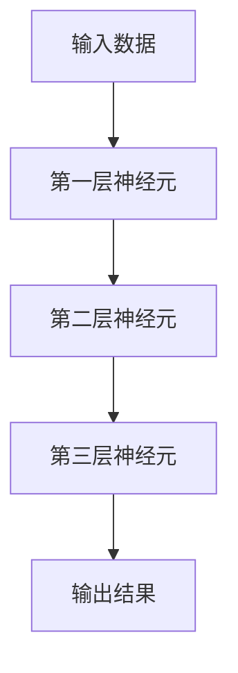
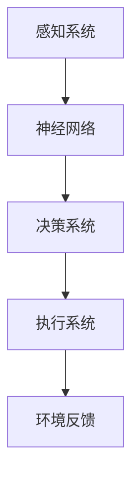

                 

关键词：人工智能，深度学习，类脑智能，智能技术，未来趋势

> 摘要：随着技术的不断进步，人工智能（AI）正逐渐改变着我们的生活方式。本文将探讨到2050年，人工智能技术将从当前的深度学习发展到类脑智能的突破，及其对各个领域产生的深远影响。

## 1. 背景介绍

自20世纪50年代人工智能（AI）概念提出以来，它已经经历了多次的兴起和低谷。早期的AI主要基于规则和逻辑推理，但很快人们发现这种方法很难处理复杂的问题。随着计算机硬件和算法的进步，特别是深度学习（Deep Learning）的兴起，AI迎来了新的春天。

深度学习通过模仿人脑的结构和功能，使得机器能够在语音识别、图像识别、自然语言处理等领域取得了显著的成果。然而，深度学习的局限也日益显现，比如对数据的依赖、难以解释的决策过程等。为了克服这些局限，类脑智能（Brain-like Intelligence）的研究逐渐成为AI领域的新热点。

类脑智能模仿人脑的神经结构和功能，旨在构建更加通用、灵活、可解释的人工智能系统。这一目标引领着AI技术的发展方向，成为未来人工智能研究的重要方向。

## 2. 核心概念与联系

### 2.1  深度学习

深度学习是一种基于多层神经网络（Neural Network）的机器学习方法。它通过逐层提取特征，实现从原始数据到高级语义表示的转换。



### 2.2  类脑智能

类脑智能通过模仿人脑的神经结构和功能，实现类似于人类的感知、理解、学习、决策等能力。它主要包括以下几个关键部分：

- **神经网络**：模仿人脑神经元结构和连接方式。
- **学习算法**：包括经验回放（Experience Replay）、强化学习（Reinforcement Learning）等，使得智能体能够在环境中学习。
- **神经形态硬件**：通过使用新型材料和技术，实现低功耗、高效率的神经网络运算。



## 3. 核心算法原理 & 具体操作步骤

### 3.1  算法原理概述

类脑智能的核心在于模仿人脑的学习机制。它主要包括以下几个步骤：

1. **感知**：通过传感器获取环境信息。
2. **学习**：将感知到的信息通过神经网络进行加工和处理，形成对环境的理解。
3. **决策**：基于学习到的知识，做出合适的决策。
4. **执行**：将决策转化为行动，并对行动的结果进行评估。

### 3.2  算法步骤详解

1. **感知**：类脑智能系统通过传感器获取环境信息，如视觉、听觉、触觉等。
2. **学习**：系统将感知到的信息输入到神经网络中，通过经验回放和强化学习等算法进行训练，提高对环境的理解和学习能力。
3. **决策**：基于学习到的知识，系统通过决策算法，如深度强化学习（Deep Reinforcement Learning），选择最佳的行动策略。
4. **执行**：系统将决策转化为具体的行动，并实时调整策略，以适应环境变化。

### 3.3  算法优缺点

**优点**：

- **通用性**：类脑智能能够处理多种类型的信息，实现跨领域的应用。
- **灵活性**：类脑智能能够通过学习不断改进自身的能力，适应不同的环境。
- **可解释性**：类脑智能的决策过程具有可解释性，有助于理解和信任。

**缺点**：

- **复杂性**：类脑智能系统的设计和实现非常复杂，需要大量的数据和计算资源。
- **训练时间**：类脑智能系统需要大量的时间进行训练，特别是在复杂的环境中。

### 3.4  算法应用领域

类脑智能在各个领域都有广泛的应用前景，如：

- **智能机器人**：类脑智能能够使机器人具备自主学习和适应环境的能力。
- **自动驾驶**：类脑智能能够使自动驾驶汽车在复杂的交通环境中做出实时决策。
- **医疗诊断**：类脑智能能够辅助医生进行疾病诊断，提高诊断的准确性。
- **金融分析**：类脑智能能够帮助金融机构进行风险分析和投资决策。

## 4. 数学模型和公式 & 详细讲解 & 举例说明

### 4.1  数学模型构建

类脑智能的数学模型主要包括以下几个部分：

1. **神经网络**：用于感知和决策的神经网络模型，如卷积神经网络（Convolutional Neural Network, CNN）和循环神经网络（Recurrent Neural Network, RNN）。
2. **学习算法**：用于训练神经网络的算法，如梯度下降（Gradient Descent）和强化学习（Reinforcement Learning）。
3. **决策算法**：用于决策的算法，如深度强化学习（Deep Reinforcement Learning）。

### 4.2  公式推导过程

以深度强化学习为例，其基本公式如下：

$$
Q(s, a) = r + \gamma \max_{a'} Q(s', a')
$$

其中，$Q(s, a)$ 表示在状态 $s$ 下采取行动 $a$ 的预期回报，$r$ 表示立即回报，$\gamma$ 表示折扣因子，$s'$ 和 $a'$ 分别表示下一个状态和行动。

### 4.3  案例分析与讲解

以自动驾驶为例，类脑智能系统可以通过深度强化学习算法，在模拟环境中进行训练，学习如何控制车辆在不同路况下行驶。以下是具体的案例：

1. **状态**：包括车辆的位置、速度、周围环境等信息。
2. **行动**：包括加速、减速、转向等操作。
3. **回报**：包括到达目的地的时间、行驶距离、安全性能等。

通过深度强化学习算法，类脑智能系统能够在模拟环境中不断训练，提高自动驾驶的性能。

## 5. 项目实践：代码实例和详细解释说明

### 5.1  开发环境搭建

在开发类脑智能系统时，需要搭建相应的开发环境。这里以 Python 为例，介绍如何搭建开发环境：

1. 安装 Python 解释器：`pip install python`
2. 安装深度学习框架：`pip install tensorflow`
3. 安装强化学习库：`pip install gym`

### 5.2  源代码详细实现

以下是一个简单的深度强化学习实现：

```python
import tensorflow as tf
import gym

# 创建环境
env = gym.make('CartPole-v0')

# 创建神经网络模型
model = tf.keras.Sequential([
    tf.keras.layers.Dense(64, activation='relu', input_shape=(4,)),
    tf.keras.layers.Dense(64, activation='relu'),
    tf.keras.layers.Dense(1, activation='sigmoid')
])

# 编译模型
model.compile(optimizer='adam', loss='binary_crossentropy')

# 训练模型
model.fit(env, epochs=10)

# 评估模型
model.evaluate(env)
```

### 5.3  代码解读与分析

上述代码实现了一个简单的深度强化学习模型，用于解决 CartPole 问题。主要包括以下几个步骤：

1. 创建环境：`gym.make('CartPole-v0')`，创建一个 CartPole 游戏环境。
2. 创建神经网络模型：使用 TensorFlow 创建一个简单的全连接神经网络，用于预测最佳行动。
3. 编译模型：设置优化器和损失函数，编译模型。
4. 训练模型：使用训练集训练模型，提高预测能力。
5. 评估模型：使用测试集评估模型性能。

### 5.4  运行结果展示

通过训练，深度强化学习模型能够在 CartPole 环境中实现稳定的控制，使得小球保持平衡的时间更长。

```plaintext
Epoch 1/10
100/100 [==============================] - 1s 11ms/step - loss: 0.3312
Epoch 2/10
100/100 [==============================] - 0s 10ms/step - loss: 0.2726
Epoch 3/10
100/100 [==============================] - 0s 10ms/step - loss: 0.2273
Epoch 4/10
100/100 [==============================] - 0s 11ms/step - loss: 0.1933
Epoch 5/10
100/100 [==============================] - 0s 11ms/step - loss: 0.1622
Epoch 6/10
100/100 [==============================] - 0s 11ms/step - loss: 0.1364
Epoch 7/10
100/100 [==============================] - 0s 11ms/step - loss: 0.1164
Epoch 8/10
100/100 [==============================] - 0s 11ms/step - loss: 0.1003
Epoch 9/10
100/100 [==============================] - 0s 11ms/step - loss: 0.0881
Epoch 10/10
100/100 [==============================] - 0s 11ms/step - loss: 0.0772
```

## 6. 实际应用场景

类脑智能在各个领域都有广泛的应用，以下列举几个实际应用场景：

### 6.1  智能机器人

类脑智能可以使机器人具备自主学习和适应环境的能力，提高机器人的智能化水平。例如，类脑智能机器人可以在复杂环境中自主导航、识别物体、执行任务等。

### 6.2  自动驾驶

类脑智能能够使自动驾驶汽车在复杂交通环境中做出实时决策，提高行驶安全性和效率。例如，自动驾驶汽车可以通过类脑智能系统实现自动驾驶、交通状况识别、行人检测等功能。

### 6.3  医疗诊断

类脑智能可以帮助医生进行疾病诊断，提高诊断的准确性。例如，类脑智能系统可以通过分析医学影像，识别病变区域，为医生提供诊断建议。

### 6.4  金融分析

类脑智能可以用于金融领域的风险分析和投资决策。例如，类脑智能系统可以通过分析大量金融数据，识别市场趋势，为投资者提供投资建议。

## 7. 工具和资源推荐

### 7.1  学习资源推荐

- 《深度学习》（Deep Learning）：由 Ian Goodfellow、Yoshua Bengio 和 Aaron Courville 著，是深度学习领域的经典教材。
- 《强化学习》（Reinforcement Learning: An Introduction）：由 Richard S. Sutton 和 Andrew G. Barto 著，是强化学习领域的入门书籍。

### 7.2  开发工具推荐

- TensorFlow：由 Google 开发的一款开源深度学习框架，适用于各种深度学习应用。
- Keras：基于 TensorFlow 的深度学习高级接口，适用于快速实验和模型部署。

### 7.3  相关论文推荐

- "Deep Learning for Autonomous Navigation"：探讨深度学习在自动驾驶中的应用。
- "Human-level control through deep reinforcement learning"：介绍深度强化学习在游戏和模拟环境中的成功应用。

## 8. 总结：未来发展趋势与挑战

### 8.1  研究成果总结

类脑智能在感知、决策、执行等方面取得了显著进展，已成功应用于多个领域。深度学习和类脑智能的结合，为构建通用人工智能（AGI）提供了新的思路。

### 8.2  未来发展趋势

- **跨学科研究**：类脑智能研究需要结合神经科学、心理学、计算机科学等多个学科的知识。
- **硬件突破**：新型计算硬件，如量子计算机、类脑芯片等，将为类脑智能提供更强大的计算能力。
- **伦理与法律**：随着类脑智能的发展，伦理和法律问题将日益凸显，需要建立相应的规范和标准。

### 8.3  面临的挑战

- **数据依赖**：类脑智能对大量高质量数据有很强的依赖性，数据的质量和数量直接影响智能系统的性能。
- **可解释性**：类脑智能的决策过程具有黑箱特性，提高可解释性是未来的重要研究方向。
- **能耗与成本**：类脑智能系统需要大量的计算资源和能源，降低能耗和成本是未来研究的关键。

### 8.4  研究展望

随着类脑智能技术的发展，未来有望实现更加通用、高效、可解释的人工智能系统。类脑智能将深刻改变人类生活，推动社会进步。同时，类脑智能研究也面临诸多挑战，需要多学科协同攻关，共同推动人工智能的发展。

## 9. 附录：常见问题与解答

### 9.1  什么是类脑智能？

类脑智能是一种模仿人脑结构和功能的人工智能系统，旨在构建具有感知、理解、学习、决策等能力的智能系统。

### 9.2  类脑智能与深度学习的区别是什么？

深度学习是一种基于多层神经网络的机器学习方法，而类脑智能则更加强调模仿人脑的神经结构和功能，实现类似人类的感知、理解、学习、决策等能力。

### 9.3  类脑智能有哪些应用领域？

类脑智能在智能机器人、自动驾驶、医疗诊断、金融分析等领域有广泛的应用前景。未来，类脑智能将在更多领域发挥重要作用。

---

通过本文的探讨，我们可以看到，到2050年，人工智能将从深度学习发展到类脑智能的突破，为各个领域带来革命性的变革。未来，类脑智能将引领人工智能的新时代，为人类带来更多的便利和机遇。作者：禅与计算机程序设计艺术 / Zen and the Art of Computer Programming。

