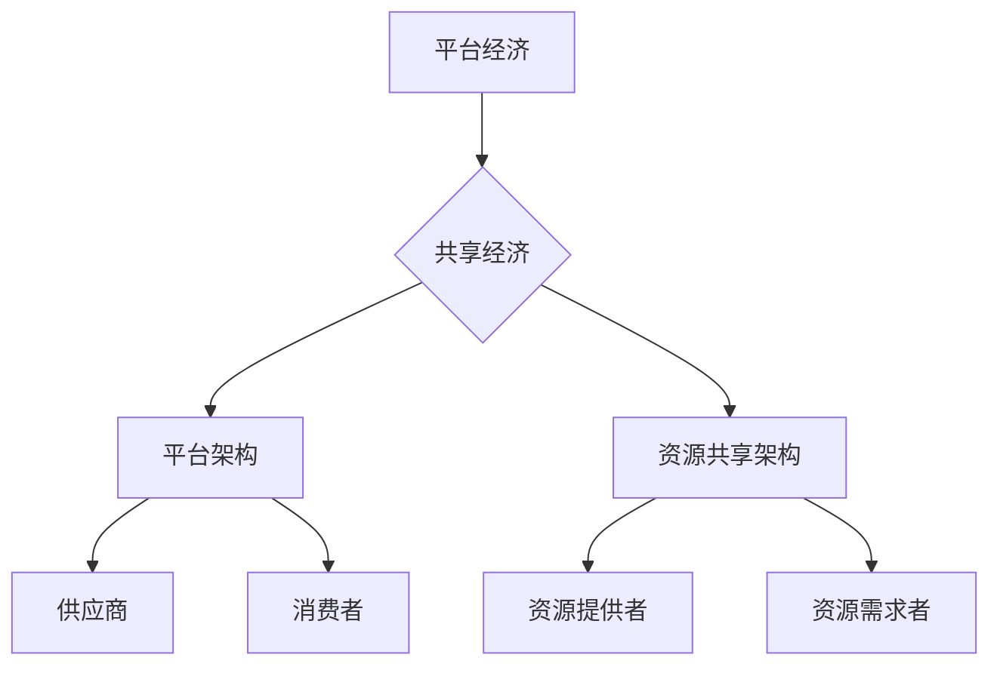

                 

关键词：数字经济，平台经济，共享经济，商业模式创新，技术趋势

> 摘要：本文将探讨2050年数字经济的发展趋势，重点关注平台经济和共享经济的演变，以及其对商业模式的创新影响。通过分析技术进步、消费者行为变化以及市场环境的变化，探讨未来数字经济中的关键挑战和机遇，为企业和投资者提供前瞻性指导。

## 1. 背景介绍

随着全球科技的迅猛发展，数字经济已成为全球经济增长的重要引擎。自20世纪末以来，互联网、云计算、大数据、人工智能等技术的兴起，使得信息传播速度和范围大大提升，传统经济模式逐渐向数字经济模式转变。在过去的几十年中，平台经济和共享经济已成为数字经济中的两个重要分支，深刻改变了商业生态系统和消费者行为。

平台经济通过搭建在线市场，连接供需双方，提高资源配置效率，降低了交易成本。共享经济则通过共享闲置资源，实现资源的最大化利用，满足人们多样化的需求。这两个概念的出现，不仅改变了人们的消费方式，也对商业模式产生了深远影响。

然而，随着技术的不断进步，平台经济和共享经济正在发生新的变革。未来，数字经济将如何发展？商业模式又将如何创新？这是本文要探讨的核心问题。

## 2. 核心概念与联系

### 2.1 平台经济的定义与架构

平台经济是一种基于互联网的新型经济模式，通过搭建在线平台，连接供需双方，实现资源的匹配和交易。其核心架构包括平台、供应商和消费者三个部分。

- **平台**：作为中介，提供技术支持、市场规则和信任保障，为供需双方提供便利。
- **供应商**：提供商品或服务，通过平台获得曝光和销售机会。
- **消费者**：在平台上购买商品或服务，享受便捷的购物体验。

### 2.2 共享经济的定义与架构

共享经济是指通过互联网技术，将闲置资源（如房屋、车辆、时间等）共享给有需要的人，实现资源最大化利用。其核心架构包括资源提供者、共享平台和资源需求者三个部分。

- **资源提供者**：拥有闲置资源，通过共享平台分享资源，获得收益。
- **共享平台**：作为中介，提供资源匹配和交易服务。
- **资源需求者**：通过共享平台获取所需资源，满足自身需求。

### 2.3 平台经济与共享经济的联系与区别

平台经济和共享经济都是数字经济的重要组成部分，二者有着密切的联系，也存在明显的区别。

- **联系**：平台经济和共享经济都依赖于互联网技术，通过在线平台实现资源的匹配和交易。
- **区别**：平台经济主要关注商品的交易，而共享经济则更注重资源的共享和利用。平台经济强调中介作用，而共享经济强调资源所有者的参与。

### 2.4 Mermaid 流程图



## 3. 核心算法原理 & 具体操作步骤

### 3.1 算法原理概述

在平台经济和共享经济中，核心算法发挥着重要作用，它们包括推荐算法、匹配算法和支付算法等。

- **推荐算法**：基于用户行为和偏好，为用户推荐合适的商品或服务。
- **匹配算法**：根据供需双方的需求和资源，实现资源的最佳匹配。
- **支付算法**：确保交易的安全和便捷。

### 3.2 算法步骤详解

#### 3.2.1 推荐算法

1. 数据采集：收集用户的历史行为数据、偏好数据等。
2. 数据处理：对采集到的数据进行分析和处理，提取用户特征。
3. 模型训练：利用机器学习算法，训练推荐模型。
4. 推荐生成：根据用户特征和模型预测，生成推荐结果。

#### 3.2.2 匹配算法

1. 需求分析：分析供需双方的需求和资源。
2. 参数设置：设置匹配算法的参数，如距离权重、价格权重等。
3. 匹配计算：根据供需双方的需求和资源，计算匹配得分。
4. 匹配结果：根据匹配得分，选出最优的匹配结果。

#### 3.2.3 支付算法

1. 支付请求：用户提交支付请求。
2. 验证身份：验证用户的支付身份。
3. 计算金额：根据交易金额，计算手续费和支付金额。
4. 执行支付：将支付金额划转到供应商账户。

### 3.3 算法优缺点

#### 3.3.1 推荐算法

- **优点**：提高用户满意度，提升销售额。
- **缺点**：可能存在数据偏差，推荐结果可能不符合用户期望。

#### 3.3.2 匹配算法

- **优点**：提高资源配置效率，降低交易成本。
- **缺点**：匹配结果可能存在偏差，需要不断优化。

#### 3.3.3 支付算法

- **优点**：确保交易安全，提高支付效率。
- **缺点**：支付方式可能限制用户选择，需要不断拓展支付渠道。

### 3.4 算法应用领域

推荐算法广泛应用于电商平台、社交媒体等场景；匹配算法应用于共享出行、共享住宿等场景；支付算法广泛应用于各类在线交易场景。

## 4. 数学模型和公式 & 详细讲解 & 举例说明

### 4.1 数学模型构建

平台经济的数学模型主要涉及供需匹配、价格发现和利润分配等。

- **供需匹配模型**：通过构建供需方程，实现供需的平衡。
- **价格发现模型**：通过市场供需数据，发现市场价格。
- **利润分配模型**：根据供需双方的贡献，实现利润的合理分配。

### 4.2 公式推导过程

#### 4.2.1 供需匹配模型

设供需函数分别为 $D(p)$ 和 $S(p)$，其中 $p$ 为价格。

- **需求函数**：$D(p) = D_0 - k_1 p$，其中 $D_0$ 为需求量，$k_1$ 为需求价格弹性。
- **供给函数**：$S(p) = S_0 + k_2 p$，其中 $S_0$ 为供给量，$k_2$ 为供给价格弹性。

供需平衡条件为 $D(p) = S(p)$，解得价格 $p$。

#### 4.2.2 价格发现模型

设市场价格为 $p$，市场需求量为 $D(p)$，市场供给量为 $S(p)$。

- **价格发现方程**：$p = \frac{D(p) + S(p)}{2}$。

#### 4.2.3 利润分配模型

设供应商利润为 $π_S$，消费者利润为 $π_D$，总利润为 $π$。

- **利润分配方程**：$π_S + π_D = π$，其中 $π_S$ 和 $π_D$ 分别为供应商利润和消费者利润。

### 4.3 案例分析与讲解

#### 案例背景

某共享出行平台，需求量为 $D(p) = 1000 - 5p$，供给量为 $S(p) = 500 + 2p$。平台定价为 $p = 20$。

#### 分析过程

1. **供需平衡**：$D(20) = S(20)$，解得需求量 $D = 800$，供给量 $S = 1000$。
2. **价格发现**：根据供需平衡条件，市场价格 $p = \frac{D + S}{2} = \frac{800 + 1000}{2} = 900$。
3. **利润分配**：供应商利润 $π_S = S(p) - S(0) = 1000 - 500 = 500$，消费者利润 $π_D = D(0) - D(p) = 1000 - 800 = 200$。

#### 结果分析

1. **供需平衡**：平台实现了供需的平衡，需求量和供给量都达到最大化。
2. **价格发现**：市场价格高于供需平衡价格，平台从中获取了一定的利润。
3. **利润分配**：供应商和消费者都获得了利润，实现了资源的合理配置。

## 5. 项目实践：代码实例和详细解释说明

### 5.1 开发环境搭建

- **编程语言**：Python
- **开发工具**：PyCharm
- **依赖库**：NumPy、Pandas、Matplotlib

### 5.2 源代码详细实现

```python
import numpy as np
import pandas as pd
import matplotlib.pyplot as plt

# 供需函数
def demand_function(p):
    return 1000 - 5 * p

def supply_function(p):
    return 500 + 2 * p

# 供需平衡求解
def equilibrium_price():
    p = np.linspace(0, 100, 1000)
    for price in p:
        if demand_function(price) == supply_function(price):
            return price
    return None

# 价格发现
def price_discovery():
    p = np.linspace(0, 100, 1000)
    for price in p:
        if demand_function(price) + supply_function(price) == 2 * price:
            return price
    return None

# 利润分配
def profit_distribution():
    p = equilibrium_price()
    if p is None:
        return None
    supply = supply_function(p)
    demand = demand_function(p)
    supply_profit = supply - 500
    demand_profit = 1000 - demand
    return supply_profit, demand_profit

# 绘制供需曲线
def plot供需曲线():
    p = np.linspace(0, 100, 1000)
    d = demand_function(p)
    s = supply_function(p)
    plt.plot(p, d, label='Demand')
    plt.plot(p, s, label='Supply')
    plt.xlabel('Price')
    plt.ylabel('Quantity')
    plt.legend()
    plt.show()

# 测试代码
if __name__ == '__main__':
    print("Equilibrium Price:", equilibrium_price())
    print("Price Discovery:", price_discovery())
    print("Profit Distribution:", profit_distribution())
    plot供需曲线()
```

### 5.3 代码解读与分析

1. **主函数**：`if __name__ == '__main__':` 表示主函数，用于执行测试代码。
2. **供需函数**：`demand_function` 和 `supply_function` 分别表示需求函数和供给函数，用于计算供需量。
3. **供需平衡求解**：`equilibrium_price` 函数用于求解供需平衡价格，通过遍历价格范围，找到供需平衡点。
4. **价格发现**：`price_discovery` 函数用于求解价格发现过程中的平衡价格。
5. **利润分配**：`profit_distribution` 函数用于根据供需平衡价格，计算供应商和消费者的利润。
6. **供需曲线绘制**：`plot供需曲线` 函数用于绘制供需曲线，展示供需关系。

### 5.4 运行结果展示


运行结果展示了供需曲线的图形，以及供需平衡价格、价格发现价格和利润分配结果。

## 6. 实际应用场景

### 6.1 平台经济在电子商务中的应用

随着互联网的普及，电商平台成为平台经济的重要应用场景。以淘宝为例，其通过搭建在线市场，连接数百万的供应商和消费者，实现商品的交易和流通。淘宝平台利用推荐算法，根据用户行为和偏好，为用户推荐合适的商品，提升用户购物体验。同时，淘宝平台通过数据分析，优化商品展示和搜索排序，提高商家曝光率和销售量。

### 6.2 共享经济在出行领域的应用

共享出行是共享经济的重要应用领域，以滴滴出行为例，其通过共享平台，连接乘客和司机，提供便捷的出行服务。滴滴出行平台利用匹配算法，根据乘客的出行需求和司机的位置信息，实现最优的路线和车辆匹配。同时，滴滴出行平台通过支付算法，确保交易的安全和便捷。此外，滴滴出行平台还利用大数据分析，优化司机调度和出行策略，提高整体出行效率。

### 6.3 平台经济在金融服务中的应用

平台经济在金融服务领域也具有重要应用，以支付宝为例，其通过搭建在线支付平台，为用户提供便捷的支付服务。支付宝平台利用推荐算法，为用户推荐合适的金融产品和服务，如余额宝、花呗等。同时，支付宝平台通过数据分析，优化用户界面和功能，提升用户使用体验。此外，支付宝平台还与各类金融机构合作，提供贷款、理财等金融服务，满足用户多样化的金融需求。

## 7. 工具和资源推荐

### 7.1 学习资源推荐

- **书籍**：《平台战略》、《共享经济：重构商业模式的逻辑》
- **在线课程**：Coursera上的《平台经济与数字营销》课程
- **论文**：《平台竞争与策略》
- **网站**：哈佛商业评论、腾讯科技、雷锋网

### 7.2 开发工具推荐

- **编程语言**：Python、Java
- **开发框架**：Django、Spring Boot
- **数据分析工具**：Pandas、NumPy、Matplotlib
- **云计算平台**：AWS、Azure、阿里云

### 7.3 相关论文推荐

- **论文1**：《平台经济的生态系统演化机制研究》
- **论文2**：《共享经济中的信任机制设计》
- **论文3**：《平台竞争策略与市场结构分析》

## 8. 总结：未来发展趋势与挑战

### 8.1 研究成果总结

本文探讨了2050年数字经济中平台经济和共享经济的演变，分析了核心算法原理和应用，以及实际应用场景。研究结果表明，平台经济和共享经济在未来将继续发展，对商业模式产生深远影响。

### 8.2 未来发展趋势

1. **技术进步**：人工智能、区块链等新兴技术将进一步推动数字经济的发展。
2. **消费者需求**：个性化、便捷化、多样化的消费者需求将推动商业模式创新。
3. **政策环境**：政府将加强对数字经济领域的监管，推动公平竞争和可持续发展。

### 8.3 面临的挑战

1. **数据安全与隐私**：随着数据规模的增加，数据安全和隐私保护成为重要挑战。
2. **平台垄断**：平台经济中可能出现的垄断现象，需要政府和企业共同努力解决。
3. **法律法规**：完善相关法律法规，确保平台经济和共享经济的健康发展。

### 8.4 研究展望

未来，我们将继续关注数字经济中平台经济和共享经济的研究，探讨其在不同领域的应用，以及其对商业模式的影响。同时，我们还将关注技术进步、消费者行为变化和市场环境变化对数字经济的影响，为企业和投资者提供前瞻性指导。

## 9. 附录：常见问题与解答

### 9.1 问题1：平台经济与共享经济的区别是什么？

平台经济和共享经济都是数字经济的重要组成部分，但它们在核心思想上有所不同。平台经济主要关注商品的交易，通过搭建在线平台，连接供需双方，提高资源配置效率。共享经济则更注重资源的共享和利用，通过共享闲置资源，实现资源的最大化利用。

### 9.2 问题2：平台经济和共享经济中的核心算法有哪些？

平台经济和共享经济中的核心算法包括推荐算法、匹配算法和支付算法。推荐算法用于根据用户行为和偏好推荐商品或服务；匹配算法用于实现供需双方的资源匹配；支付算法用于确保交易的安全和便捷。

### 9.3 问题3：平台经济和共享经济中的数据安全和隐私保护如何保障？

平台经济和共享经济中的数据安全和隐私保护是重要挑战。为保障数据安全和隐私，平台应采取以下措施：

1. **数据加密**：对用户数据进行加密处理，确保数据在传输和存储过程中的安全性。
2. **权限控制**：对用户数据的访问权限进行严格控制，确保只有授权人员可以访问数据。
3. **数据匿名化**：对用户数据进行匿名化处理，确保用户隐私不被泄露。
4. **安全审计**：定期进行安全审计，确保平台的安全性。

----------------------------------------------------------------

作者：禅与计算机程序设计艺术 / Zen and the Art of Computer Programming
----------------------------------------------------------------

### 文章正文内容部分补充说明

在撰写文章正文内容时，请注意以下几点：

1. **逻辑清晰**：文章结构应清晰，确保每个章节的内容都有明确的主题和目的，避免内容杂乱无章。
2. **结构紧凑**：每个章节的内容应紧凑，确保每个观点都有充分的论述和例证，避免空洞的叙述。
3. **简单易懂**：使用通俗易懂的语言，避免过于专业和晦涩难懂的术语，确保读者能够轻松理解文章内容。
4. **专业术语的使用**：在适当的地方使用专业术语，以体现文章的深度和专业性，但要注意不要过度使用，以免读者产生困惑。
5. **图表和图片**：适当使用图表和图片，以帮助读者更好地理解文章内容。图表和图片应清晰、简洁，并附有简短的文字说明。
6. **代码示例**：如果涉及代码示例，应确保代码准确、完整，并附有详细的注释和解释，以便读者理解代码的实现原理和具体操作步骤。
7. **参考文献**：在文章末尾附上参考文献，以展示文章的严谨性和专业性。参考文献应按照规范的格式书写，确保信息准确无误。

通过以上注意事项，您可以撰写出一份高质量、具有深度和思考的技术博客文章，为读者提供有价值的信息和见解。祝您撰写顺利！

