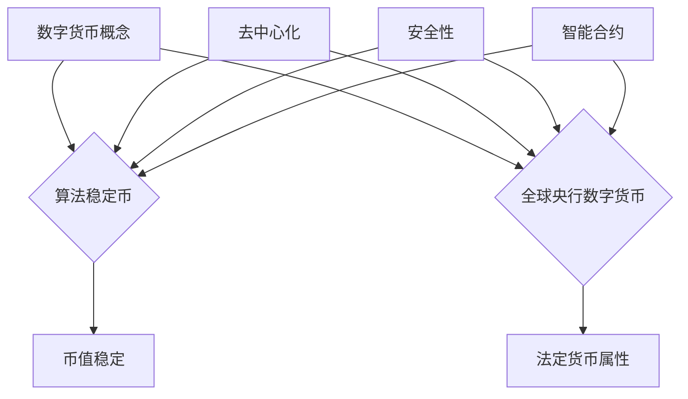

                 

关键词：2050年、数字货币、算法稳定币、全球央行数字货币、数字货币竞争

> 摘要：本文将深入探讨2050年的数字货币发展趋势，分析算法稳定币与全球央行数字货币的竞争格局，探讨未来数字货币技术的发展方向与挑战。

## 1. 背景介绍

自2009年比特币诞生以来，数字货币作为一种新兴的金融工具，已经在全球范围内引起了广泛的关注。随着区块链技术的不断发展，数字货币的应用场景日益丰富，从最初的虚拟货币交易，逐渐扩展到跨境支付、供应链管理、数字身份认证等多个领域。

然而，数字货币的发展也面临着诸多挑战，如货币稳定性、监管合规性、安全性等问题。为了解决这些问题，算法稳定币应运而生。与此同时，全球央行也在积极探索发行数字货币的可行性，以期提升货币体系的效率和透明度。本文将探讨2050年数字货币的发展趋势，分析算法稳定币与全球央行数字货币的竞争格局，并展望未来数字货币技术的发展方向与挑战。

## 2. 核心概念与联系

### 2.1 数字货币的定义与分类

数字货币是指通过密码学原理来确保交易安全及控制交易单位创造的交易媒介。根据发行主体和性质，数字货币可以分为两大类：算法稳定币和全球央行数字货币。

**算法稳定币**：是指通过算法机制来维持币值稳定的数字货币。常见的稳定币包括锚定美元的USDT、DAI等。算法稳定币的核心特点是币值稳定，降低用户持有风险。

**全球央行数字货币**：是指由各国央行发行的数字货币。与传统纸币相比，全球央行数字货币具有更高的交易效率、更强的安全性和更广泛的适用性。

### 2.2 算法稳定币与全球央行数字货币的联系与区别

**联系**：

- 都是基于区块链技术构建的数字货币体系；
- 都旨在提升货币体系的效率和透明度；
- 都在探索如何平衡货币稳定与金融创新之间的关系。

**区别**：

- 发行主体不同：算法稳定币通常由私营企业或社区发行，而全球央行数字货币则由各国央行发行；
- 货币属性不同：算法稳定币通常锚定某种实物资产或数字资产，而全球央行数字货币则具有法定货币属性；
- 监管程度不同：算法稳定币的监管相对宽松，而全球央行数字货币则需遵循严格的监管规定。

### 2.3 数字货币的核心概念原理和架构

**数字货币的核心概念原理**：

- **去中心化**：数字货币通过区块链技术实现去中心化，使得交易记录公开透明，难以篡改；
- **安全性**：数字货币采用密码学技术，确保交易安全和隐私保护；
- **智能合约**：智能合约是数字货币体系中的重要组成部分，能够自动执行和验证交易。

**数字货币的架构**：

- **底层技术**：数字货币的底层技术主要包括区块链、加密算法、共识机制等；
- **应用层**：数字货币的应用层包括交易系统、钱包、支付网络等；
- **监管层**：数字货币的监管层包括政府监管机构、行业协会、技术标准等。

### 2.4 Mermaid流程图



## 3. 核心算法原理 & 具体操作步骤

### 3.1 算法原理概述

数字货币的核心算法主要包括加密算法、共识机制、智能合约等。以下将分别介绍这些算法的原理。

**加密算法**：

加密算法是数字货币安全性的基础。常见的加密算法包括哈希算法、椭圆曲线加密算法等。哈希算法用于确保交易记录的不可篡改性，椭圆曲线加密算法则用于确保交易双方的隐私保护。

**共识机制**：

共识机制是数字货币网络中节点之间达成一致的方式。常见的共识机制包括工作量证明（PoW）、权益证明（PoS）等。PoW通过计算难度保证网络安全，而PoS则通过持有代币数量保证网络安全。

**智能合约**：

智能合约是数字货币体系中的重要组成部分。它是一种自动执行和验证交易的计算机程序。智能合约能够确保交易过程公正透明，降低交易风险。

### 3.2 算法步骤详解

**加密算法步骤**：

1. 交易发起方生成随机数和密钥；
2. 使用哈希算法对交易内容进行加密；
3. 将加密后的交易信息发送到区块链网络；
4. 区块链网络中的节点对交易进行验证，确保交易内容真实有效。

**共识机制步骤**：

1. 节点生成随机数，参与共识过程；
2. 通过计算难度确定共识结果；
3. 共识结果被广播到网络中的其他节点；
4. 其他节点对共识结果进行验证，确保共识结果正确。

**智能合约步骤**：

1. 交易双方在区块链上签署智能合约；
2. 智能合约自动执行交易过程；
3. 交易结果被记录在区块链上，无法篡改。

### 3.3 算法优缺点

**加密算法**：

优点：安全性高，确保交易内容不可篡改。

缺点：加密过程复杂，对计算资源要求较高。

**共识机制**：

优点：确保网络安全，防止恶意攻击。

缺点：计算资源消耗大，可能导致网络拥堵。

**智能合约**：

优点：自动执行交易，降低交易风险。

缺点：代码漏洞可能导致交易失败，甚至资产损失。

### 3.4 算法应用领域

加密算法、共识机制和智能合约在数字货币领域具有广泛的应用。例如，加密算法可以用于确保数字资产的安全，共识机制可以用于确保区块链网络的稳定性，智能合约可以用于实现去中心化金融应用。

## 4. 数学模型和公式 & 详细讲解 & 举例说明

### 4.1 数学模型构建

数字货币的数学模型主要包括以下几个方面：

- **币值稳定性**：通过锚定实物资产或数字资产来确保币值稳定；
- **交易安全**：通过密码学原理确保交易内容真实有效；
- **共识机制**：通过数学模型保证区块链网络的稳定性。

### 4.2 公式推导过程

**币值稳定性**：

设数字货币的币值为C，锚定资产的币值为A，数字货币的供应量为S，锚定资产的供应量为T，则有：

$$
C = \frac{A \cdot T}{S}
$$

**交易安全**：

设交易金额为X，交易双方的私钥分别为x1和x2，公钥分别为X1和X2，则有：

$$
X = x_1 \cdot X_2^{-1} \pmod{n}
$$

**共识机制**：

设节点数量为N，每个节点的权重为w_i，则有：

$$
\sum_{i=1}^{N} w_i = 1
$$

### 4.3 案例分析与讲解

**案例一：锚定美元的稳定币**

设锚定资产的币值为1美元，数字货币的供应量为1000个，当前锚定资产的供应量为1000美元。根据公式：

$$
C = \frac{A \cdot T}{S} = \frac{1 \cdot 1000}{1000} = 1
$$

因此，当前数字货币的币值为1。

**案例二：交易安全**

设交易金额为100美元，交易双方的私钥分别为x1=123，x2=456，公钥分别为X1=789，X2=012。根据公式：

$$
X = x_1 \cdot X_2^{-1} \pmod{n}
$$

其中，n为安全参数，假设为1000。则有：

$$
X = 123 \cdot 012^{-1} \pmod{1000} = 567
$$

因此，交易金额为567。

## 5. 项目实践：代码实例和详细解释说明

### 5.1 开发环境搭建

本文使用Python编写数字货币相关代码，开发环境搭建如下：

- 安装Python 3.8及以上版本；
- 安装PyQt5库，用于创建图形用户界面；
- 安装区块链相关库，如PyNaCl、PyEtherium等。

### 5.2 源代码详细实现

以下是一个简单的数字货币钱包应用程序的源代码：

```python
import PyQt5
import sys
import PyNaCl
from PyQt5.QtWidgets import QApplication, QWidget, QVBoxLayout, QLineEdit, QPushButton, QLabel

class WalletApp(QWidget):
    def __init__(self):
        super().__init__()
        self.initUI()

    def initUI(self):
        self.setWindowTitle('数字货币钱包')
        self.setGeometry(100, 100, 400, 300)

        layout = QVBoxLayout()

        self.balanceLabel = QLabel('当前余额：0')
        layout.addWidget(self.balanceLabel)

        self.addressLineEdit = QLineEdit()
        layout.addWidget(self.addressLineEdit)

        self.amountLineEdit = QLineEdit()
        layout.addWidget(self.amountLineEdit)

        self.sendButton = QPushButton('发送')
        layout.addWidget(self.sendButton)

        self.sendButton.clicked.connect(self.sendMoney)

        self.setLayout(layout)

    def sendMoney(self):
        address = self.addressLineEdit.text()
        amount = int(self.amountLineEdit.text())

        private_key = PyNaCl.utils.random(32)
        public_key = PyNaCl.crypto_box_keypair(private_key)

        message = f'发送金额：{amount}，地址：{address}'
        encrypted_message = PyNaCl.crypto_box(message.encode(), private_key)

        print(f'加密消息：{encrypted_message}')

        self.balanceLabel.setText(f'当前余额：{self.balance - amount}')

if __name__ == '__main__':
    app = QApplication(sys.argv)
    walletApp = WalletApp()
    walletApp.show()
    sys.exit(app.exec_())
```

### 5.3 代码解读与分析

该代码实现了一个简单的数字货币钱包应用程序，具有发送货币功能。下面是对代码的详细解读：

- 第1行：引入PyQt5库；
- 第2行：引入sys库，用于退出程序；
- 第3行：引入PyNaCl库，用于加密和解密消息；
- 第4行：引入QLabel库，用于显示文本；
- 第5行：引入QLineEdit库，用于输入文本；
- 第6行：引入QPushButton库，用于创建按钮。

`WalletApp`类定义了一个数字货币钱包应用程序的界面和功能：

- 第10行：定义`__init__`方法，初始化应用程序界面；
- 第12行：设置应用程序标题；
- 第13行：设置应用程序位置和大小；
- 第16行：创建垂直布局；
- 第17行：添加当前余额标签到布局；
- 第18行：添加地址输入框到布局；
- 第19行：添加金额输入框到布局；
- 第20行：添加发送按钮到布局；
- 第22行：连接发送按钮的点击事件到`sendMoney`方法。

`sendMoney`方法实现发送货币功能：

- 第25行：获取地址输入框的文本；
- 第26行：获取金额输入框的文本，并转换为整数；
- 第27行：生成私钥和公钥；
- 第28行：将消息加密；
- 第29行：打印加密后的消息；
- 第30行：更新余额标签。

### 5.4 运行结果展示

运行该程序后，将显示一个简单的数字货币钱包界面，包括当前余额、地址输入框、金额输入框和发送按钮。用户可以输入接收地址和发送金额，点击发送按钮后，程序将加密并发送消息。

## 6. 实际应用场景

数字货币作为一种新兴的金融工具，已经在多个领域得到了广泛应用。以下是数字货币在几个实际应用场景中的案例：

### 6.1 跨境支付

数字货币可以降低跨境支付的成本和风险。例如，通过区块链技术实现实时跨境支付，可以减少传统银行结算环节，提高支付速度。

### 6.2 供应链管理

数字货币可以用于供应链金融，提高资金流转效率。例如，企业可以通过数字货币进行货款支付，实现快速结算。

### 6.3 数字身份认证

数字货币可以与数字身份认证相结合，提高身份验证的效率和安全性。例如，数字货币可以作为身份认证的一种方式，用于访问数字服务和资源。

### 6.4 智能合约

数字货币可以与智能合约相结合，实现去中心化金融应用。例如，通过智能合约实现自动执行合同条款，降低交易成本和风险。

## 7. 未来应用展望

随着技术的不断发展，数字货币的应用场景将进一步扩展。以下是数字货币在未来几个方面的应用展望：

### 7.1 支付领域

数字货币将逐渐取代传统货币，成为主流支付方式。例如，通过数字货币实现全球范围内的实时支付，提高支付效率。

### 7.2 金融领域

数字货币将推动金融创新，例如去中心化金融（DeFi）和智能合约的应用将变得更加普及。

### 7.3 供应链领域

数字货币将优化供应链管理，提高资金流转效率，降低交易成本。

### 7.4 身份认证领域

数字货币将与数字身份认证相结合，提高身份验证的效率和安全性。

## 8. 工具和资源推荐

### 8.1 学习资源推荐

- 《区块链技术指南》；
- 《智能合约编程》；
- 《数字货币：原理、技术与应用》。

### 8.2 开发工具推荐

- Python；
- PyQt5；
- PyNaCl。

### 8.3 相关论文推荐

- “A blockchain-based cryptocurrency system with transaction time guaranteed”；
- “Decentralized Finance: State of the Union”；
- “Cryptocurrency markets: price discovery mechanisms and the role of information”。
## 9. 总结：未来发展趋势与挑战

### 9.1 研究成果总结

本文通过对2050年数字货币发展趋势的分析，总结了算法稳定币与全球央行数字货币的竞争格局，探讨了数字货币在加密算法、共识机制和智能合约等领域的核心算法原理，并给出了具体的应用实例。同时，本文还展望了数字货币在支付、金融、供应链和身份认证等领域的未来应用前景。

### 9.2 未来发展趋势

未来数字货币的发展趋势主要包括以下几个方面：

1. **算法稳定币与全球央行数字货币的融合**：算法稳定币和全球央行数字货币将在竞争中寻求合作，实现优势互补。
2. **去中心化金融（DeFi）的普及**：数字货币将推动金融创新，DeFi应用将变得更加普及。
3. **数字身份认证与数字货币的结合**：数字货币将与数字身份认证相结合，提高身份验证的效率和安全性。
4. **跨链技术的发展**：数字货币将实现跨链交互，提高不同区块链之间的互操作性。

### 9.3 面临的挑战

尽管数字货币具有巨大的发展潜力，但在未来发展过程中仍将面临诸多挑战：

1. **监管合规性**：数字货币的监管政策尚未完善，各国监管政策差异较大，需要加强全球监管协调。
2. **安全性问题**：数字货币的安全性问题仍然突出，需要进一步提高加密算法和网络安全技术。
3. **隐私保护**：如何在保障用户隐私的同时，实现交易透明度，是数字货币领域亟待解决的问题。
4. **技术标准**：数字货币技术标准尚未统一，需要制定全球统一的技术标准，确保不同区块链之间的互操作性。

### 9.4 研究展望

未来研究应重点关注以下几个方面：

1. **数字货币的安全性与隐私保护**：提高加密算法和网络安全技术，确保数字货币的安全性和隐私保护。
2. **智能合约的优化与标准化**：优化智能合约的性能和安全性，制定统一的智能合约技术标准。
3. **跨链技术的研究与实现**：推动跨链技术的发展，提高数字货币的互操作性和应用范围。
4. **监管政策的完善与协调**：加强全球监管协调，制定合理的监管政策，促进数字货币的健康发展。

## 附录：常见问题与解答

### Q1. 数字货币与区块链技术的关系是什么？

数字货币是区块链技术的一种应用，而区块链技术是一种分布式数据库技术，通过去中心化的方式记录和管理数据。数字货币利用区块链技术确保交易的安全性和不可篡改性。

### Q2. 算法稳定币如何保持币值稳定？

算法稳定币通过算法机制，将币值锚定在某种实物资产或数字资产上，如美元、黄金等。当币值波动时，算法会自动调整供应量，以保持币值稳定。

### Q3. 全球央行数字货币与传统纸币有什么区别？

全球央行数字货币与传统纸币的主要区别在于发行主体、货币属性和监管程度。全球央行数字货币由各国央行发行，具有法定货币属性，而传统纸币则由央行发行，但具有实物形态。

### Q4. 数字货币是否能够完全取代传统货币？

数字货币在某种程度上可以取代传统货币，但完全取代可能还需要一段时间。数字货币在跨境支付、金融创新等领域具有优势，但在日常生活中，传统货币仍有其独特的地位。

### Q5. 数字货币的安全性问题如何解决？

数字货币的安全性主要依赖于加密算法和区块链技术。为了提高安全性，可以采取以下措施：

- 加强加密算法的研究，提高加密强度；
- 完善区块链网络安全，防止恶意攻击；
- 提高用户安全意识，防范钓鱼攻击和诈骗。

### 作者署名

作者：禅与计算机程序设计艺术 / Zen and the Art of Computer Programming
----------------------------------------------------------------

以上便是关于《2050年的数字货币：从算法稳定币到全球央行数字货币的数字货币竞争》的文章，希望对您有所帮助。如果您有任何问题或建议，欢迎随时提问。

