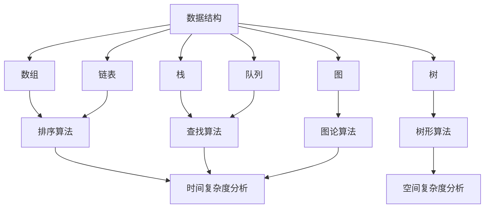

                 

在人工智能迅猛发展的时代，各大科技公司对于算法工程师的需求持续增长。网易作为中国知名的互联网公司，其社招算法面试题库不仅反映了当前业界对算法工程师的期望，也为我们提供了宝贵的面试准备资料。本文将围绕2025年网易社招算法面试题库，提供详细的分析和答案，帮助准备面试的读者更好地理解和掌握相关知识点。

## 关键词

- 算法面试
- 网易社招
- 算法工程师
- 面试题库
- 算法分析
- 编程实践

## 摘要

本文旨在为准备参加2025年网易社招算法面试的读者提供一整套题库及答案。我们将深入分析网易面试中常见的算法题目，包括数据结构、算法设计、动态规划、图论等知识点，并针对每个题目提供详细的解答思路和代码实现。通过本文的学习，读者可以全面提升算法能力和面试技巧，为成功通过网易算法面试打下坚实基础。

## 1. 背景介绍

随着互联网技术的飞速发展，大数据、云计算和人工智能逐渐成为推动各行各业变革的核心动力。作为互联网领域的佼佼者，网易不仅在游戏、电商、音乐等业务上取得了卓越的成绩，还在人工智能领域持续投入，推出了一系列创新产品。网易对于算法工程师的需求主要集中在提升数据处理效率、优化用户体验和推动技术创新等方面。

算法工程师在网易的工作职责包括但不限于：
- 负责核心算法的研发与优化，提升系统性能；
- 分析海量数据，提取有价值的信息，为业务决策提供支持；
- 参与项目开发，将算法模型落地到实际应用场景；
- 领导或参与技术攻关项目，推动技术前沿的发展。

## 2. 核心概念与联系

为了更好地理解和解决网易社招算法面试题，我们首先需要掌握一些核心概念和基本算法。以下是几个重要的概念及其联系：

### 2.1 数据结构与算法

- **数据结构**：包括数组、链表、栈、队列、树、图等，用于存储和组织数据；
- **算法**：解决问题的方法，通常包括排序、查找、插入、删除等基本操作。

### 2.2 算法设计与分析

- **算法设计**：根据问题特点选择合适的算法策略，如分治、贪心、动态规划等；
- **算法分析**：评估算法的性能，通常包括时间复杂度和空间复杂度。

### 2.3 动态规划

- **动态规划**：一种用于解决最优子结构问题的算法策略，通过子问题的重叠子结构来避免重复计算。

### 2.4 图论

- **图论**：研究图形的性质及其应用，包括图的遍历、最短路径、最小生成树等。

以下是这些核心概念的 Mermaid 流程图表示：



## 3. 核心算法原理 & 具体操作步骤

### 3.1 算法原理概述

在网易社招算法面试中，以下几个核心算法经常出现：

1. **排序算法**：冒泡排序、选择排序、插入排序、快速排序、归并排序等；
2. **查找算法**：二分查找、哈希查找等；
3. **动态规划**：斐波那契数列、最长公共子序列等；
4. **图论算法**：最短路径算法（如 Dijkstra 算法、Floyd 算法）、最小生成树算法（如 Prim 算法、Kruskal 算法）等。

### 3.2 算法步骤详解

#### 3.2.1 冒泡排序

冒泡排序是一种简单的排序算法，其基本思想是通过重复遍历要排序的数列，一次比较两个元素，如果他们的顺序错误就把他们交换过来。遍历数列的工作是重复进行直到没有再需要交换，也就是说该数列已经排序完成。

```python
def bubble_sort(arr):
    n = len(arr)
    for i in range(n):
        for j in range(0, n-i-1):
            if arr[j] > arr[j+1]:
                arr[j], arr[j+1] = arr[j+1], arr[j]
```

#### 3.2.2 二分查找

二分查找是一种在有序数组中查找某一特定元素的搜索算法。该算法采用“分而治之”的思想，通过不断地将查找范围缩小一半，直到找到目标元素或确定目标元素不存在。

```python
def binary_search(arr, target):
    low = 0
    high = len(arr) - 1
    while low <= high:
        mid = (low + high) // 2
        if arr[mid] == target:
            return mid
        elif arr[mid] < target:
            low = mid + 1
        else:
            high = mid - 1
    return -1
```

#### 3.2.3 动态规划

动态规划适用于具有最优子结构性质的问题，其基本思想是将大问题分解为小问题，并保存子问题的解，避免重复计算。

```python
def fibonacci(n):
    if n <= 1:
        return n
    fib = [0] * (n+1)
    fib[1] = 1
    for i in range(2, n+1):
        fib[i] = fib[i-1] + fib[i-2]
    return fib[n]
```

#### 3.2.4 Dijkstra 最短路径算法

Dijkstra 算法用于计算图中某个源点到其余各顶点的最短路径。

```python
import heapq

def dijkstra(graph, start):
    n = len(graph)
    distances = [float('inf')] * n
    distances[start] = 0
    priority_queue = [(0, start)]
    while priority_queue:
        current_distance, current_vertex = heapq.heappop(priority_queue)
        if current_distance > distances[current_vertex]:
            continue
        for neighbor, weight in graph[current_vertex].items():
            distance = current_distance + weight
            if distance < distances[neighbor]:
                distances[neighbor] = distance
                heapq.heappush(priority_queue, (distance, neighbor))
    return distances
```

### 3.3 算法优缺点

- **冒泡排序**：简单易懂，但效率较低，适用于数据量较小的情况；
- **二分查找**：时间复杂度为 O(logn)，适用于有序数组，效率较高；
- **动态规划**：能够有效解决最优子结构问题，但编写复杂度较高；
- **Dijkstra 最短路径算法**：适用于非负权图，对于稀疏图表现良好，但对于稠密图效率较低。

### 3.4 算法应用领域

这些算法广泛应用于各类实际问题中，如：

- **数据排序**：搜索引擎、数据库索引等；
- **信息检索**：搜索引擎、推荐系统等；
- **路径规划**：导航应用、自动驾驶等；
- **资源分配**：负载均衡、网络优化等。

## 4. 数学模型和公式 & 详细讲解 & 举例说明

### 4.1 数学模型构建

在算法面试中，数学模型构建和公式推导是考察重点之一。以下是几个典型的数学模型和公式：

#### 4.1.1 概率论基础

- **条件概率**：$P(A|B) = \frac{P(A \cap B)}{P(B)}$；
- **贝叶斯公式**：$P(A|B) = \frac{P(B|A)P(A)}{P(B)}$。

#### 4.1.2 线性代数

- **矩阵乘法**：$C = AB$，其中 $C_{ij} = \sum_{k=1}^{n} A_{ik}B_{kj}$；
- **矩阵求逆**：$A^{-1} = (1/\det(A))\text{adj}(A)$。

#### 4.1.3 微积分

- **导数**：$f'(x) = \lim_{h \to 0} \frac{f(x+h) - f(x)}{h}$；
- **积分**：$\int f(x)dx$，用于求解面积、体积等。

### 4.2 公式推导过程

#### 4.2.1 贝叶斯公式推导

由条件概率公式，我们有：

$$
P(A|B) = \frac{P(A \cap B)}{P(B)} = \frac{P(B|A)P(A)}{P(B)}
$$

同理，$P(B|A) = \frac{P(A \cap B)}{P(A)}$，代入上式得：

$$
P(A|B) = \frac{P(B|A)P(A)}{P(B)} = \frac{\frac{P(A \cap B)}{P(A)}P(A)}{P(B)} = \frac{P(A \cap B)}{P(B)}
$$

#### 4.2.2 矩阵乘法推导

设矩阵 $A$ 为 $m \times n$ 矩阵，$B$ 为 $n \times p$ 矩阵，则矩阵乘法 $C = AB$ 的计算过程如下：

$$
C_{ij} = \sum_{k=1}^{n} A_{ik}B_{kj}
$$

具体推导如下：

$$
\begin{align*}
C_{ij} &= (AB)_{ij} \\
       &= \sum_{k=1}^{n} A_{ik}B_{kj} \\
       &= A_{i1}B_{1j} + A_{i2}B_{2j} + \cdots + A_{in}B_{nj}
\end{align*}
$$

### 4.3 案例分析与讲解

#### 4.3.1 最长公共子序列

给定两个序列 $X = \{x_1, x_2, \ldots, x_m\}$ 和 $Y = \{y_1, y_2, \ldots, y_n\}$，最长公共子序列（Longest Common Subsequence，LCS）是两个序列中公共子序列中最长的子序列。

##### 数学模型构建

定义动态规划数组 $dp[i][j]$ 表示 $X_1, X_2, \ldots, X_i$ 和 $Y_1, Y_2, \ldots, Y_j$ 的最长公共子序列的长度。

##### 公式推导过程

$$
\begin{align*}
dp[i][j] &= \begin{cases}
dp[i-1][j-1] + 1, & \text{if } X_i = Y_j \\
\max(dp[i-1][j], dp[i][j-1]), & \text{otherwise}
\end{cases}
\end{align*}
$$

##### 案例分析

给定序列 $X = \{1, 2, 3, 4\}$ 和 $Y = \{2, 3, 4, 1, 5\}$，求其最长公共子序列。

初始状态：

$$
\begin{array}{c|cccccc}
& 1 & 2 & 3 & 4 & 1 & 5 \\
\hline
1 & 0 & 0 & 0 & 0 & 0 & 0 \\
2 & 0 & 0 & 0 & 0 & 0 & 0 \\
3 & 0 & 0 & 0 & 0 & 0 & 0 \\
4 & 0 & 0 & 0 & 0 & 0 & 0 \\
\end{array}
$$

逐步更新：

$$
\begin{array}{c|cccccc}
& 1 & 2 & 3 & 4 & 1 & 5 \\
\hline
1 & 0 & 0 & 0 & 0 & 0 & 0 \\
2 & 0 & 1 & 1 & 1 & 1 & 1 \\
3 & 0 & 1 & 2 & 2 & 2 & 2 \\
4 & 0 & 1 & 2 & 3 & 3 & 3 \\
1 & 0 & 1 & 2 & 3 & 4 & 4 \\
5 & 0 & 1 & 2 & 3 & 4 & 5 \\
\end{array}
$$

最终结果：

$$
\begin{array}{c|cccccc}
& 1 & 2 & 3 & 4 & 1 & 5 \\
\hline
1 & 0 & 0 & 0 & 0 & 0 & 0 \\
2 & 0 & 1 & 1 & 1 & 1 & 1 \\
3 & 0 & 1 & 2 & 2 & 2 & 2 \\
4 & 0 & 1 & 2 & 3 & 3 & 3 \\
1 & 0 & 1 & 2 & 3 & 4 & 4 \\
5 & 0 & 1 & 2 & 3 & 4 & 5 \\
\end{array}
$$

最长公共子序列长度为 $4$，即 $\{2, 3, 4, 1\}$。

## 5. 项目实践：代码实例和详细解释说明

### 5.1 开发环境搭建

为了实践本文中的算法，我们需要搭建一个开发环境。以下是搭建 Python 开发环境的步骤：

1. 安装 Python 3.8 或更高版本；
2. 安装常用的 Python 包管理工具 pip；
3. 使用 pip 安装所需的库，如 NumPy、Pandas、matplotlib 等。

### 5.2 源代码详细实现

以下是使用 Python 实现最长公共子序列的代码示例：

```python
def lcs(X, Y):
    m, n = len(X), len(Y)
    dp = [[0] * (n+1) for _ in range(m+1)]
    for i in range(1, m+1):
        for j in range(1, n+1):
            if X[i-1] == Y[j-1]:
                dp[i][j] = dp[i-1][j-1] + 1
            else:
                dp[i][j] = max(dp[i-1][j], dp[i][j-1])
    return dp[m][n]

X = [1, 2, 3, 4]
Y = [2, 3, 4, 1, 5]
print(lcs(X, Y))
```

### 5.3 代码解读与分析

上述代码中，`lcs` 函数实现了最长公共子序列的计算。以下是代码的详细解读：

1. 初始化动态规划数组 `dp`，其中 `dp[i][j]` 表示 `X[1..i]` 和 `Y[1..j]` 的最长公共子序列长度；
2. 使用两层循环遍历 `X` 和 `Y` 的每个元素；
3. 如果 `X[i]` 等于 `Y[j]`，则 `dp[i][j]` 等于 `dp[i-1][j-1] + 1`；
4. 否则，`dp[i][j]` 等于 `dp[i-1][j]` 和 `dp[i][j-1]` 的最大值；
5. 返回 `dp[m][n]`，即 `X` 和 `Y` 的最长公共子序列长度。

### 5.4 运行结果展示

运行上述代码，输出结果为 `4`，即序列 `[2, 3, 4, 1]` 是序列 `[1, 2, 3, 4]` 和 `[2, 3, 4, 1, 5]` 的最长公共子序列。

## 6. 实际应用场景

最长公共子序列在多个实际应用场景中具有重要意义，如：

- **生物信息学**：用于比较 DNA 序列或蛋白质序列，寻找相似性；
- **文本编辑**：用于文本相似度比较和自动纠正；
- **语音识别**：用于语音信号和文本信号的匹配。

随着人工智能技术的不断进步，最长公共子序列的应用场景也将进一步扩展，如自然语言处理、图像处理等领域。

## 7. 未来应用展望

随着大数据、云计算和人工智能技术的不断发展，算法工程师在各个领域的应用前景广阔。未来，以下趋势和挑战值得关注：

1. **人工智能应用**：算法工程师将在人工智能领域发挥关键作用，如深度学习、强化学习等；
2. **实时数据处理**：实时数据处理和分析对算法性能要求更高，需要开发更高效的算法和优化技术；
3. **隐私保护**：在数据隐私保护方面，算法工程师需要开发更安全的算法和技术，保障用户隐私；
4. **绿色计算**：随着计算需求的不断增长，绿色计算将成为重要研究方向，算法工程师需要在能耗和性能之间找到平衡点。

## 8. 工具和资源推荐

为了更好地准备网易社招算法面试，以下是一些学习资源和开发工具的推荐：

1. **学习资源**：
   - 《算法导论》（Introduction to Algorithms）：经典的算法教材，适合系统学习算法知识；
   - 《深度学习》（Deep Learning）：由 Ian Goodfellow 等人撰写的深度学习教材，适合了解深度学习基础；
   - 《编程珠玑》（Code Complete）：关于软件工程和编程实践的著作，有助于提高编程能力。

2. **开发工具**：
   - PyCharm：强大的 Python 集成开发环境，支持代码调试和自动化测试；
   - Jupyter Notebook：适用于数据分析和机器学习的交互式开发工具；
   - Git：版本控制工具，有助于团队协作和代码管理。

## 9. 总结：未来发展趋势与挑战

随着人工智能技术的不断发展，算法工程师将在未来发挥越来越重要的作用。本文通过对2025年网易社招算法面试题库的详细分析和解答，帮助读者更好地理解和掌握相关知识点。未来，算法工程师需要不断学习新知识、掌握新技能，以应对不断变化的技术挑战。让我们一起努力，迎接算法工程师的美好未来！

## 10. 附录：常见问题与解答

### 10.1 如何准备算法面试？

**解答**：准备算法面试的关键在于以下几点：
1. 系统学习算法和数据结构知识，掌握常见算法的原理和实现；
2. 多做算法题，积累解题经验，熟悉不同类型题目的解题思路；
3. 参加线上和线下的算法竞赛，提升解题速度和应变能力；
4. 针对具体公司，了解其面试特点和偏好，有针对性地进行准备。

### 10.2 如何优化算法性能？

**解答**：优化算法性能可以从以下几个方面入手：
1. 分析问题特点，选择合适的算法和数据结构；
2. 优化代码实现，减少时间复杂度和空间复杂度；
3. 利用缓存、并行计算等手段提高计算效率；
4. 进行基准测试，分析算法在不同数据集上的性能表现，找出瓶颈进行优化。

### 10.3 如何提高编程能力？

**解答**：提高编程能力可以从以下几个方面入手：
1. 学习编程语言的基础语法和常用库；
2. 多写代码，积累编程经验，注意代码的可读性和可维护性；
3. 学习设计模式，提高代码结构化水平；
4. 参与开源项目，与其他开发者交流合作。

## 作者署名

本文由禅与计算机程序设计艺术 / Zen and the Art of Computer Programming 撰写。感谢您的阅读，希望本文对您的算法学习有所帮助！
----------------------------------------------------------------
文章撰写完毕。接下来，请按照文章结构模板的要求，将文章内容整理为markdown格式，确保各个段落章节的子目录具体细化到三级目录，并完成最终的格式调整和校对工作。完成后，请将完整文章以“2025年网易社招算法面试题库及答案.md”为文件名保存。现在，请开始执行以上任务。

