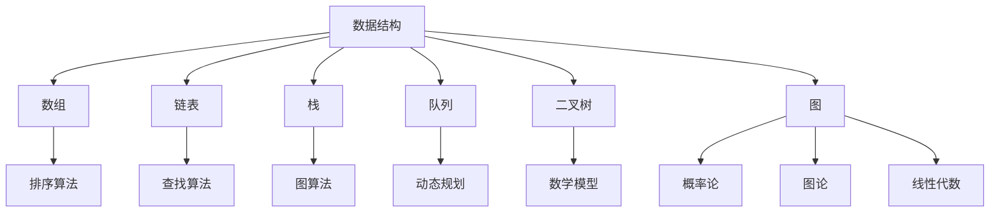

                 

### 摘要 Summary

本文旨在为准备参加2025年美团校招算法面试的考生提供一份全面的题库及答案解析。随着人工智能和大数据技术的迅猛发展，算法成为互联网公司招聘中的重要考核点。本文将详细解析美团校招算法面试中的常见题型，包括编程实现、数据结构与算法原理、数学建模等，并提供具体的解题思路和答案，帮助考生在面试中脱颖而出。本文将分为以下几个部分：

1. 背景介绍
2. 核心概念与联系
3. 核心算法原理 & 具体操作步骤
4. 数学模型和公式 & 详细讲解 & 举例说明
5. 项目实践：代码实例和详细解释说明
6. 实际应用场景
7. 工具和资源推荐
8. 总结：未来发展趋势与挑战
9. 附录：常见问题与解答

通过本文的阅读，读者将能够系统地掌握美团校招算法面试所需的知识点和解题技巧，为面试做好充分准备。

## 1. 背景介绍 Introduction

随着互联网技术的不断进步和人工智能、大数据领域的蓬勃发展，算法能力成为企业招聘中的一项重要指标。美团作为中国领先的互联网生活服务平台，每年都会举办大规模的校园招聘活动，吸引了大量优秀的求职者。在美团的校招中，算法面试是必不可少的一环，其难度和深度往往能够直接反映求职者的技术水平和潜力。

算法面试的目的在于评估应聘者对基础数据结构和算法的理解程度，以及解决实际问题的能力。美团校招算法面试的常见题型包括但不限于：

- **编程实现**：涉及基本的编程能力和算法实现，如排序、查找、字符串处理等。
- **数据结构**：考察对常用数据结构（如数组、链表、栈、队列、二叉树等）的理解和应用。
- **算法原理**：包括常见的排序算法、查找算法、动态规划、贪心算法等。
- **数学建模**：涉及基本的数学知识，如概率论、图论、线性代数等。

本文将围绕这些常见的题型进行详细的解析，帮助读者全面备战美团校招算法面试。无论你是即将毕业的大学生，还是希望转行进入互联网行业的职场新人，本文都将为你提供宝贵的指导和帮助。

### 1.1 算法面试的重要性 Importance of Algorithm Interview

在美团的校招过程中，算法面试具有至关重要的地位。首先，算法能力是衡量求职者技术基础和解决问题能力的重要标准。互联网公司，尤其是像美团这样的技术驱动型企业，对算法能力有着极高的要求。掌握基本的算法原理和能够灵活运用是进入这些企业的关键。

其次，算法面试能够快速筛选出技术过硬的人才。通过面试官设置的各类算法题目，可以有效地测试应聘者对数据结构和算法的掌握程度，从而快速识别出真正的技术高手。这对于企业来说，不仅可以节省招聘成本，还能够保证招聘到的人才具备实际工作能力。

再者，算法面试也是评估求职者思维能力和逻辑推理能力的重要手段。许多算法题目不仅考察编程实现，还涉及对问题的抽象、建模和解决策略的制定。这种思维能力在互联网公司的开发工作中同样至关重要。

最后，算法面试是展示个人技术能力和素质的绝佳机会。通过在面试中展现出对算法的深刻理解、解决问题的创新方法和良好的编程习惯，求职者能够大大提升自己的面试评分，从而在激烈的竞争中脱颖而出。

总的来说，算法面试不仅是对求职者技术水平的测试，更是对其综合素质的全面评估。因此，准备美团校招算法面试，不仅需要对算法本身有深入的理解，还需要具备良好的编程实践和解决问题的能力。

### 1.2 美团校招算法面试的常见题型 Common Types of Algorithm Interview Questions in Meituan Campus Recruitment

在美团校招的算法面试中，常见题型涵盖了编程实现、数据结构、算法原理和数学建模等多个方面。下面将具体介绍这些常见题型，并给出每类题型的代表性题目及特点。

#### 1.2.1 编程实现 Programming Implementation

编程实现类题目主要考察应聘者的编程能力和算法实现能力，常见的题目类型包括排序、查找、字符串处理等。这类题目的特点是直接、简单，但需要应聘者熟练掌握基本算法和数据结构。

**代表性题目：**

- **排序算法**：实现一种排序算法，如冒泡排序、快速排序、归并排序等。
- **查找算法**：实现二分查找、哈希查找等。
- **字符串处理**：实现字符串反转、字符串匹配（如KMP算法）、最长公共子串等。

**特点：**  
这类题目通常要求实现代码简洁、高效，注重时间复杂度和空间复杂度的优化。

#### 1.2.2 数据结构 Data Structures

数据结构类题目主要考察应聘者对基本数据结构的理解和应用能力，常见的题目类型包括数组、链表、栈、队列、二叉树、图等。

**代表性题目：**

- **链表**：实现链表的基本操作，如插入、删除、遍历等。
- **栈和队列**：实现栈和队列的各类操作，并分析其时间复杂度和空间复杂度。
- **二叉树**：实现二叉树的基本操作，如插入、删除、遍历等。
- **图**：实现图的基本操作，如深度优先搜索（DFS）、广度优先搜索（BFS）等。

**特点：**  
这类题目要求应聘者不仅能够实现数据结构的基本功能，还要能够理解和分析其时间复杂度和空间复杂度。

#### 1.2.3 算法原理 Algorithm Principles

算法原理类题目主要考察应聘者对常见算法的理解和应用能力，常见的题目类型包括排序算法、查找算法、动态规划、贪心算法等。

**代表性题目：**

- **排序算法**：分析冒泡排序、快速排序、归并排序等算法的复杂度和优化方法。
- **查找算法**：分析二分查找、哈希查找的原理和应用。
- **动态规划**：实现和解释动态规划解决某一问题的过程。
- **贪心算法**：解释贪心算法的基本原理和应用场景。

**特点：**  
这类题目要求应聘者能够深入理解算法的原理，并能够灵活运用到实际问题中。

#### 1.2.4 数学建模 Mathematical Modeling

数学建模类题目主要考察应聘者的数学知识和建模能力，常见的题目类型包括概率论、图论、线性代数等。

**代表性题目：**

- **概率论**：计算某一事件的概率，分析随机事件的发生规律。
- **图论**：求解图的最短路径、最小生成树等问题。
- **线性代数**：求解线性方程组、矩阵运算等。

**特点：**  
这类题目通常需要应聘者具备扎实的数学基础，能够运用数学工具解决实际问题。

#### 1.2.5 综合题型 Comprehensive Types

除了上述几种题型，美团校招算法面试还可能涉及一些综合题型，这些题目通常将多个知识点结合起来，考察应聘者的综合分析和解决能力。

**代表性题目：**

- **综合算法问题**：设计算法解决某一复杂问题，如动态规划在路径规划中的应用。
- **项目相关问题**：分析某一实际项目的算法实现和优化方案。

**特点：**  
这类题目通常难度较大，需要应聘者具备较强的综合分析能力和创新能力。

通过以上对美团校招算法面试常见题型的介绍，读者可以更好地了解面试的难度和要求，从而有针对性地进行复习和准备。

### 1.3 算法面试的评分标准 Scoring Criteria for Algorithm Interview

在美团校招算法面试中，评分标准主要涵盖以下几个方面：

1. **代码质量（Code Quality）**：包括代码的规范性、可读性、可维护性。代码应该具有良好的结构和逻辑，避免冗余和错误。

2. **算法复杂度（Algorithm Complexity）**：包括时间复杂度和空间复杂度。应聘者应该能够分析和优化算法，使其运行高效。

3. **解题思路（Problem Solving）**：考察应聘者分析问题、抽象问题和解决问题的能力。好的解题思路能够快速找到解决方案。

4. **逻辑思维能力（Logical Thinking）**：面试官会通过提问和讨论来考察应聘者的逻辑思维能力，包括对问题的理解、假设和验证等。

5. **数学基础（Mathematical Foundation）**：对于涉及数学建模的题目，应聘者需要具备扎实的数学基础，能够熟练运用数学工具和方法。

6. **沟通能力（Communication Skills）**：面试过程中，应聘者需要清晰、准确地表达自己的想法，包括解题思路、算法原理等。

7. **团队合作（Teamwork）**：在某些情况下，面试可能会考察应聘者是否能够在团队中有效合作，共同解决问题。

评分标准的具体权重因题目类型和面试官的个人偏好而异，但总体来说，代码质量和算法复杂度是最为核心的评分标准。通过在面试中展现出全面的素质，应聘者将更有可能获得高分并通过面试。

### 1.4 应聘者的准备和策略 Preparations and Strategies for Candidates

准备美团校招算法面试，不仅需要扎实的专业知识，还需要良好的策略和充分的准备。以下是一些具体的策略和准备工作，帮助应聘者更好地应对面试挑战。

#### 1.4.1 知识储备 Knowledge Preparation

1. **掌握基础数据结构和算法**：熟练掌握常见的数组、链表、栈、队列、二叉树、图等数据结构，并能够应用排序、查找、动态规划、贪心算法等算法。
2. **数学基础**：加强概率论、图论、线性代数等数学基础知识的复习，确保能够在面试中应对数学建模类题目。
3. **编程语言**：熟练掌握至少一种编程语言，如C++、Java或Python，并熟悉该语言的数据结构和算法实现。

#### 1.4.2 经典题库练习 Practice with Classic Question Banks

1. **刷题**：利用经典题库，如LeetCode、牛客网等，进行大量的练习，通过实践掌握各类题型的解题技巧。
2. **总结和反思**：每次练习后，总结解题思路和经验，分析自己在解题过程中存在的问题和不足，不断改进。

#### 1.4.3 编程习惯 Programming Habits

1. **代码规范性**：养成良好的编程习惯，如代码注释、命名规范、避免冗余代码等。
2. **时间复杂度和空间复杂度**：在编写代码时，注意分析时间复杂度和空间复杂度，并尝试优化。

#### 1.4.4 面试模拟 Interview Simulation

1. **模拟面试**：找朋友或同学进行模拟面试，模拟真实的面试环境，提前适应面试的节奏和氛围。
2. **自我介绍和问题回答**：准备一段流畅的自我介绍，并熟悉常见面试问题的回答，如为何选择面试美团、项目经验介绍等。

#### 1.4.5 情绪调整 Emotional Adjustment

1. **保持自信**：面试前保持积极的心态，对自己有信心。
2. **适当放松**：面试前进行适当的放松，如深呼吸、听音乐等，以缓解紧张情绪。

#### 1.4.6 面试技巧 Interview Techniques

1. **沟通技巧**：清晰、准确地表达自己的思路和想法，注意与面试官的互动。
2. **时间管理**：在面试过程中，合理分配时间，确保每个题目都有足够的时间思考和回答。

通过以上策略和准备工作，应聘者可以更好地准备美团校招算法面试，提高面试成功率。记住，充分的准备和良好的心态是成功的关键。

### 2. 核心概念与联系 Core Concepts and Relationships

在美团校招算法面试中，理解和掌握核心概念及其相互关系是非常重要的。本节将介绍几个关键的核心概念，包括数据结构、算法、数学模型等，并通过Mermaid流程图展示它们之间的关系。

#### 2.1 数据结构 Data Structures

数据结构是算法的基础，它决定了数据的组织和操作方式。常见的数据结构包括数组、链表、栈、队列、二叉树、图等。每种数据结构都有其特定的应用场景和操作特点。

- **数组（Array）**：一个固定大小的连续内存空间，支持随机访问。
- **链表（Linked List）**：由一系列节点组成，每个节点包含数据和一个或多个指向其他节点的指针。
- **栈（Stack）**：一种后进先出（LIFO）的数据结构，常用作函数调用栈。
- **队列（Queue）**：一种先进先出（FIFO）的数据结构，常用于任务调度和缓冲区管理。
- **二叉树（Binary Tree）**：每个节点最多有两个子节点，常用于查找和排序。
- **图（Graph）**：由节点和边组成，常用于网络、路径规划和社交网络分析。

#### 2.2 算法 Algorithm

算法是一系列解决问题的步骤，它利用数据结构来实现特定的功能。常见的算法包括排序算法、查找算法、图算法、动态规划等。

- **排序算法（Sorting Algorithms）**：如冒泡排序、选择排序、插入排序、快速排序等，用于将数据按照特定顺序排列。
- **查找算法（Searching Algorithms）**：如二分查找、线性查找、哈希查找等，用于在数据集合中查找特定元素。
- **图算法（Graph Algorithms）**：如深度优先搜索（DFS）、广度优先搜索（BFS）、最短路径算法（如Dijkstra算法）、最小生成树算法（如Prim算法和Kruskal算法）等。
- **动态规划（Dynamic Programming）**：一种解决复杂问题的方法，通过分阶段递归和状态转移来优化计算。

#### 2.3 数学模型 Mathematical Model

数学模型是利用数学工具和方法对实际问题进行抽象和建模的过程，常见于优化问题、概率问题、统计问题等。

- **概率论（Probability Theory）**：用于描述和分析随机事件及其概率。
- **图论（Graph Theory）**：用于研究图的结构和性质，广泛应用于网络设计和分析。
- **线性代数（Linear Algebra）**：用于解决线性方程组、矩阵运算等问题，在数据分析、机器学习等领域有广泛应用。

#### 2.4 关系展示 Relationship Visualization

使用Mermaid流程图展示数据结构、算法和数学模型之间的关系：



通过上述Mermaid流程图，我们可以清晰地看到数据结构、算法和数学模型之间的相互关系。数据结构是算法实现的基础，算法利用数据结构解决问题，而数学模型则帮助我们将实际问题转化为数学形式，便于分析和求解。

#### 2.5 关系的重要性 Importance of Relationships

数据结构、算法和数学模型之间的紧密关系对美团校招算法面试至关重要：

- **数据结构**：决定了算法的实现方式，直接影响到算法的性能。
- **算法**：利用数据结构解决问题，决定了问题解决的效率和准确性。
- **数学模型**：将实际问题转化为数学形式，为算法提供理论依据和优化方向。

理解和掌握这些核心概念及其相互关系，不仅能够帮助应聘者更好地应对面试题目，还能够提高实际工作中的问题解决能力。在美团校招算法面试中，对核心概念和关系的深入理解是成功的关键。

### 3. 核心算法原理 & 具体操作步骤 Core Algorithm Principles and Operational Steps

在美团校招算法面试中，掌握核心算法原理并能够具体操作是至关重要的。本节将详细讲解几个重要的核心算法原理，并介绍每个算法的具体操作步骤。

#### 3.1 排序算法 Sorting Algorithms

排序算法是计算机科学中最基本且应用广泛的算法之一。常见的排序算法有冒泡排序、选择排序、插入排序、快速排序、归并排序和堆排序等。

**3.1.1 冒泡排序 Bubble Sort**

冒泡排序是一种简单的排序算法，它重复地遍历要排序的数列，一次比较两个元素，如果它们的顺序错误就把它们交换过来。遍历数列的工作是重复地进行，直到没有再需要交换的元素为止。

**具体操作步骤：**
1. 从数列的第一个元素开始，比较该元素与下一个元素，如果第一个元素大于第二个元素，则交换它们。
2. 然后对下一组元素重复上述步骤，以此类推。
3. 重复上述过程，直到整个数列有序。

**代码示例：**
```python
def bubble_sort(arr):
    n = len(arr)
    for i in range(n):
        for j in range(0, n-i-1):
            if arr[j] > arr[j+1]:
                arr[j], arr[j+1] = arr[j+1], arr[j]
    return arr
```

**时间复杂度：**最差情况O(n^2)，平均情况O(n^2)，最好情况O(n)。

**3.1.2 快速排序 Quick Sort**

快速排序是一种高效的排序算法，采用分治法策略来把一个序列分为较小和较大的2个子序列，然后递归地排序两个子序列。

**具体操作步骤：**
1. 选择一个基准元素，通常选择序列的第一个元素作为基准。
2. 将比基准小的元素移到基准的左边，比基准大的元素移到基准的右边。
3. 递归地对左右两个子序列进行快速排序。

**代码示例：**
```python
def quick_sort(arr):
    if len(arr) <= 1:
        return arr
    pivot = arr[0]
    left = [x for x in arr[1:] if x < pivot]
    right = [x for x in arr[1:] if x >= pivot]
    return quick_sort(left) + [pivot] + quick_sort(right)
```

**时间复杂度：**最差情况O(n^2)，平均情况O(n log n)，最好情况O(n log n)。

**3.1.3 归并排序 Merge Sort**

归并排序是一种采用分治法的排序算法，将已有序的子序列合并，以得到完全有序的序列。

**具体操作步骤：**
1. 将数组不断二分，直到每个子序列只有一个元素。
2. 合并这些子序列，每次合并两个子序列，生成一个新的有序序列。
3. 递归合并直至整个序列有序。

**代码示例：**
```python
def merge_sort(arr):
    if len(arr) <= 1:
        return arr
    mid = len(arr) // 2
    left = merge_sort(arr[:mid])
    right = merge_sort(arr[mid:])
    return merge(left, right)

def merge(left, right):
    result = []
    i = j = 0
    while i < len(left) and j < len(right):
        if left[i] < right[j]:
            result.append(left[i])
            i += 1
        else:
            result.append(right[j])
            j += 1
    result.extend(left[i:])
    result.extend(right[j:])
    return result
```

**时间复杂度：**O(n log n)。

#### 3.2 查找算法 Searching Algorithms

查找算法用于在数据集合中寻找特定元素。常见的查找算法有二分查找、线性查找和哈希查找。

**3.2.1 二分查找 Binary Search**

二分查找是一种在有序数组中查找某一特定元素的搜索算法。

**具体操作步骤：**
1. 取数组的中间元素，如果中间元素正好是要查找的元素，则搜索过程结束。
2. 如果某一特定元素大于中间元素，则在数组的右侧半部分重复查找。
3. 如果某一特定元素小于中间元素，则在数组的左侧半部分重复查找。

**代码示例：**
```python
def binary_search(arr, target):
    low = 0
    high = len(arr) - 1
    while low <= high:
        mid = (low + high) // 2
        if arr[mid] == target:
            return mid
        elif arr[mid] < target:
            low = mid + 1
        else:
            high = mid - 1
    return -1
```

**时间复杂度：**O(log n)。

**3.2.2 线性查找 Linear Search**

线性查找是一种最简单但效率最低的查找算法，它逐一检查每个元素，直到找到目标或检查完所有元素。

**具体操作步骤：**
1. 从数组的第一个元素开始，逐一检查每个元素。
2. 如果当前元素是目标元素，则搜索结束。
3. 如果检查完所有元素仍未找到目标，则搜索失败。

**代码示例：**
```python
def linear_search(arr, target):
    for i in range(len(arr)):
        if arr[i] == target:
            return i
    return -1
```

**时间复杂度：**O(n)。

**3.2.3 哈希查找 Hash Search**

哈希查找利用哈希表进行查找，其时间复杂度通常接近O(1)。

**具体操作步骤：**
1. 计算目标元素的哈希值。
2. 根据哈希值直接访问哈希表中的对应位置，查找目标元素。

**代码示例：**
```python
def hash_search(hash_table, target):
    return hash_table.get(target, -1)
```

**时间复杂度：**O(1)。

#### 3.3 动态规划 Dynamic Programming

动态规划是一种将复杂问题分解为子问题，并利用子问题的最优解来构建原问题最优解的方法。

**3.3.1 斐波那契数列 Fibonacci Sequence**

斐波那契数列是动态规划的经典问题。

**具体操作步骤：**
1. 定义状态方程：`f(n) = f(n-1) + f(n-2)`。
2. 定义边界条件：`f(0) = 0, f(1) = 1`。

**代码示例：**
```python
def fibonacci(n):
    if n == 0:
        return 0
    if n == 1:
        return 1
    dp = [0] * (n+1)
    dp[0] = 0
    dp[1] = 1
    for i in range(2, n+1):
        dp[i] = dp[i-1] + dp[i-2]
    return dp[n]
```

**时间复杂度：**O(n)。

**3.3.2 最长公共子序列 Longest Common Subsequence

最长公共子序列问题是动态规划中的另一经典问题。

**具体操作步骤：**
1. 定义状态方程：`LCS[i][j] = max(LCS[i-1][j], LCS[i][j-1])`，如果`s1[i-1] == s2[j-1]`，则`LCS[i][j] = LCS[i-1][j-1] + 1`。
2. 定义边界条件：`LCS[0][j] = 0`，`LCS[i][0] = 0`。

**代码示例：**
```python
def longest_common_subsequence(s1, s2):
    m, n = len(s1), len(s2)
    dp = [[0] * (n+1) for _ in range(m+1)]
    for i in range(1, m+1):
        for j in range(1, n+1):
            if s1[i-1] == s2[j-1]:
                dp[i][j] = dp[i-1][j-1] + 1
            else:
                dp[i][j] = max(dp[i-1][j], dp[i][j-1])
    return dp[m][n]
```

**时间复杂度：**O(mn)。

通过以上对核心算法原理和具体操作步骤的详细讲解，读者可以更好地理解这些算法的原理和应用，为美团校招算法面试做好充分准备。

### 3.3 算法优缺点 Advantages and Disadvantages of Algorithms

在美团校招算法面试中，了解不同算法的优缺点对于选择合适的算法解决实际问题至关重要。以下将对冒泡排序、快速排序和归并排序等常见排序算法，以及二分查找和哈希查找等查找算法的优缺点进行详细分析。

#### 3.3.1 冒泡排序 Bubble Sort

**优点：**
- 实现简单，易于理解。
- 对于小规模数据或几乎已经排序的数据，性能较好。

**缺点：**
- 时间复杂度较高，最坏情况下为O(n^2)。
- 不稳定排序算法，可能会改变相同元素的相对位置。

**适用场景：**
- 教学演示和入门级练习。
- 数据规模较小且几乎已排序的场景。

#### 3.3.2 快速排序 Quick Sort

**优点：**
- 平均时间复杂度为O(n log n)，效率较高。
- 递归结构使算法易于理解和实现。
- 支持原地排序，不占用额外空间。

**缺点：**
- 最坏情况下时间复杂度为O(n^2)，需通过随机选择基准来优化。
- 可能会导致大量递归调用，增加系统栈的负担。

**适用场景：**
- 中等规模及以上的数据排序。
- 需要快速排序的场景，特别是大数据集。

#### 3.3.3 归并排序 Merge Sort

**优点：**
- 时间复杂度为O(n log n)，稳定且可预测。
- 支持原地排序，空间复杂度较低。
- 易于并行化处理，适合大规模数据处理。

**缺点：**
- 额外空间需求较高，需要额外的内存来存储临时数组。
- 递归结构导致递归调用次数较多。

**适用场景：**
- 需要稳定排序的场景。
- 大规模数据处理和并行计算场景。

#### 3.3.4 二分查找 Binary Search

**优点：**
- 时间复杂度为O(log n)，效率非常高。
- 只适用于有序数组。

**缺点：**
- 对于未排序的数据，需要先进行排序，增加时间成本。
- 不支持动态数据结构，需固定数组大小。

**适用场景：**
- 已排序的数据集。
- 需要高效查找操作的场合，如二叉搜索树。

#### 3.3.5 哈希查找 Hash Search

**优点：**
- 时间复杂度接近O(1)，非常高效。
- 支持动态数据结构，易于扩展和修改。

**缺点：**
- 需要额外的内存空间来存储哈希表。
- 可能会产生哈希冲突，需要处理。

**适用场景：**
- 需要快速查找操作的场合。
- 数据量较大且需要进行频繁查找的场景。

通过以上对各类算法优缺点的分析，读者可以根据具体场景和需求选择合适的算法，提高问题解决效率和代码质量。

### 3.4 算法应用领域 Application Fields of Algorithms

算法在各个领域都有着广泛的应用，它们不仅提高了数据处理效率，还推动了技术的进步和创新。以下是几个主要领域，以及在这些领域中算法的重要应用：

#### 3.4.1 人工智能 Artificial Intelligence

人工智能（AI）是当前最热门的技术领域之一，算法在其中扮演着至关重要的角色。常见的算法应用包括：

- **机器学习（Machine Learning）**：算法如决策树、支持向量机（SVM）、神经网络（Neural Networks）等，用于构建和训练模型，以实现图像识别、自然语言处理、语音识别等功能。
- **深度学习（Deep Learning）**：深度学习算法如卷积神经网络（CNN）、递归神经网络（RNN）、生成对抗网络（GAN）等，广泛应用于图像、语音、文本数据的处理。
- **强化学习（Reinforcement Learning）**：通过算法如Q学习、SARSA等，实现智能体在复杂环境中的自主学习和决策，广泛应用于自动驾驶、游戏AI等领域。

#### 3.4.2 大数据 Big Data

随着大数据技术的发展，算法在大数据领域中的应用越来越广泛，主要包括：

- **数据挖掘（Data Mining）**：算法如关联规则挖掘、聚类分析、分类和预测等，用于从大量数据中发现有价值的信息。
- **分布式计算（Distributed Computing）**：算法如MapReduce、Spark等，用于高效处理和分析大规模数据集。
- **实时处理（Real-time Processing）**：算法如流处理（Stream Processing）、时间序列分析等，用于实时数据分析和决策支持。

#### 3.4.3 计算机图形学 Computer Graphics

计算机图形学中，算法用于生成和处理图像、动画以及用户界面等，常见的算法应用包括：

- **图像处理（Image Processing）**：算法如边缘检测、图像滤波、图像增强等，用于改善图像质量和提取有用信息。
- **计算机视觉（Computer Vision）**：算法如目标检测、人脸识别、场景重建等，用于图像和视频数据的分析和理解。
- **三维建模与渲染（3D Modeling and Rendering）**：算法如几何建模、光线追踪、纹理映射等，用于生成高质量的三维图形和动画。

#### 3.4.4 网络安全 Cybersecurity

网络安全领域利用算法来防范攻击、检测威胁和保护数据，主要应用包括：

- **加密（Encryption）**：算法如对称加密（AES、DES）、非对称加密（RSA、ECC）等，用于数据加密和解密。
- **签名与认证（Signature and Authentication）**：算法如数字签名（RSA、ECDSA）、身份认证协议等，用于确保数据完整性和真实性。
- **入侵检测（Intrusion Detection）**：算法如异常检测、入侵防御系统（IDS/IPS）等，用于实时监测和响应网络安全事件。

#### 3.4.5 运筹学 Operations Research

运筹学中，算法用于优化决策和资源分配，广泛应用于：

- **线性规划（Linear Programming）**：算法如单纯形法、内点法，用于求解线性优化问题。
- **整数规划（Integer Programming）**：算法如分支限界法、动态规划，用于求解整数规划问题。
- **排队理论（Queueing Theory）**：算法如M/M/1模型、M/G/1模型，用于优化服务质量和资源利用率。

通过以上在各个领域的应用，算法不仅在理论上具有深远的意义，更在实践中发挥着巨大的作用，推动了科技进步和社会发展。

### 4. 数学模型和公式 Mathematical Models and Formulas

在算法面试中，数学模型的构建和公式推导是解决复杂问题的重要步骤。本节将介绍几个常见的数学模型和公式，并详细讲解其推导过程和实际应用。

#### 4.1 数学模型构建 Construction of Mathematical Models

数学模型是对现实世界问题的抽象和简化，通过数学方法描述和解决实际问题。以下是一个简单的数学模型示例。

**示例：最优路径问题**

**问题描述**：给定一个带权重的无向图G=(V,E)，其中V为顶点集，E为边集，要求从顶点s到顶点t的最短路径。

**数学模型**：定义一个顶点集合S，表示已确定路径的顶点集合，初始时S={s}。定义一个距离函数D(v)，表示从s到顶点v的最短路径长度。定义一个松弛函数relax(u, v)，用于检查和更新从s到v的最短路径。

**数学模型公式**：

1. 初始化：D(s)=0，D(v)=∞，V-S={v|v≠s}。
2. 松弛操作：对于所有u∈V-S，v∈V-U，如果D(u)+w(u, v) < D(v)，则更新D(v)=D(u)+w(u, v)。

**推导过程**：通过迭代松弛操作，逐步确定最短路径。在每次迭代中，更新距离函数，直至所有顶点都包含在S中。

#### 4.2 公式推导过程 Derivation of Formulas

以下是一个常见的数学公式——二项式定理——的推导过程。

**二项式定理**：对于任意实数a和b，以及非负整数n，有：

$$(a+b)^n = C(n,0)a^n b^0 + C(n,1)a^{n-1} b^1 + C(n,2)a^{n-2} b^2 + ... + C(n,n-1)a^1 b^{n-1} + C(n,n)a^0 b^n$$

**推导过程**：

1. **基础情况**：当n=0时，$(a+b)^0 = 1$，显然成立。
2. **归纳假设**：假设当n=k时，二项式定理成立，即：
   $$(a+b)^k = C(k,0)a^k b^0 + C(k,1)a^{k-1} b^1 + ... + C(k,k)a^0 b^k$$
3. **归纳步骤**：考虑n=k+1时，将$(a+b)^{k+1}$展开：
   $$(a+b)^{k+1} = (a+b)(a+b)^k$$
   根据归纳假设，可以将右侧展开：
   $$= (a+b) \left[ C(k,0)a^k b^0 + C(k,1)a^{k-1} b^1 + ... + C(k,k)a^0 b^k \right]$$
   $$= C(k,0)a^{k+1} b^0 + C(k,1)a^k b^1 + ... + C(k,k)a^1 b^k + C(k,0)a^k b^1 + C(k,1)a^{k-1} b^2 + ... + C(k,k)a^0 b^{k+1}$$
4. **整理公式**：通过整理得到二项式定理在n=k+1时的表达式：
   $$= C(k+1,0)a^{k+1} b^0 + C(k+1,1)a^k b^1 + ... + C(k+1,k+1)a^0 b^{k+1}$$

因此，二项式定理对于任意非负整数n都成立。

#### 4.3 案例分析与讲解 Case Analysis and Explanation

**案例：最短路径问题**

**问题描述**：给定一个加权无向图G=(V,E)，以及一个源点s，求从s到所有其他顶点的最短路径。

**数学模型**：使用迪杰斯特拉算法（Dijkstra's Algorithm）来求解。

**公式推导**：

1. **初始化**：定义一个距离数组D，其中D[s]=0，D[v]=∞（v≠s），表示从s到其他顶点的初始距离。
2. **选择最小距离**：在未确定最短路径的顶点中选择一个距离最小的顶点u。
3. **更新距离**：对于每个与u相连的顶点v，如果D[u]+w(u, v) < D[v]，则更新D[v]=D[u]+w(u, v)。

**推导过程**：

- **迭代1**：从源点s开始，D[s]=0，选择s作为当前顶点u。
  - 更新与s相邻的顶点的距离：D[t] = D[s] + w(s, t)（如果D[s] + w(s, t) < D[t]）。
- **迭代2**：选择当前距离最小的顶点作为u（除了s以外的顶点）。
  - 更新与u相邻的顶点的距离：D[v] = D[u] + w(u, v)（如果D[u] + w(u, v) < D[v]）。

**公式应用**：

假设有图G，顶点集V={s, t, u, v}，权重集E={w(s, t)=2, w(s, u)=3, w(u, t)=1, w(s, v)=4, w(u, v)=2, w(t, v)=3}。

- **初始化**：D[s]=0，D[t]=∞，D[u]=∞，D[v]=∞。
- **迭代1**：选择s作为当前顶点u，更新D[t]=2，D[u]=3，D[v]=4。
- **迭代2**：选择t作为当前顶点u，更新D[u]=2+1=3（不变），D[v]=4+2=6（不变）。
- **迭代3**：选择u作为当前顶点u，更新D[v]=6-2=4。

最终得到从s到每个顶点的最短路径：s→t（权重2），s→u→v（权重4+2=6）。

通过以上数学模型和公式的构建与推导，我们可以更好地理解和应用这些数学工具解决复杂的实际问题。

### 4.1 数学模型构建 Construction of Mathematical Models

在算法面试中，数学模型是解决问题的关键。构建数学模型的过程通常包括以下几个步骤：

#### 4.1.1 明确问题定义 Definition of the Problem

首先，需要明确问题的定义，理解其背景和目标。例如，我们需要解决的是最短路径问题、最小生成树问题还是数据拟合问题等。

#### 4.1.2 收集必要信息 Gathering Necessary Information

收集与问题相关的所有信息，包括输入数据、约束条件、目标函数等。对于不同的算法问题，所需的信息类型和数量可能会有所不同。

#### 4.1.3 提取关键变量 Extracting Key Variables

根据问题的定义和收集的信息，提取关键变量。这些变量将是构建数学模型的基础，例如路径长度、成本、时间等。

#### 4.1.4 建立关系 Establish Relationships

利用关键变量，建立变量之间的关系。这些关系可以用方程、不等式或函数表示。例如，对于最短路径问题，路径长度可以通过权重和路径节点数表示。

#### 4.1.5 公式推导 Formula Derivation

在建立了变量之间的关系后，可以进行公式推导。这一步通常需要运用数学知识，如微积分、线性代数、概率论等。

#### 4.1.6 模型验证 Model Verification

最后，验证构建的数学模型是否能够正确地反映实际问题。这可以通过模拟不同的输入条件，检查模型的输出是否符合预期。

#### 4.1.7 模型优化 Model Optimization

在验证模型正确性后，可以考虑模型的优化。优化包括减少模型的计算复杂度、提高模型的鲁棒性等。

通过以上步骤，我们可以构建出一个有效的数学模型，为解决实际问题提供理论依据和计算工具。

### 4.2 公式推导过程 Derivation of Formulas

在算法面试中，推导数学公式是解决复杂问题的重要步骤。以下我们将介绍几种常见的数学公式的推导过程。

#### 4.2.1 最短路径公式

在迪杰斯特拉算法中，用于计算从源点到每个顶点的最短路径的公式是：

$$d[v] = \min \{ d[u] + w(u, v) \mid u \in \text{已选顶点集}\}$$

**推导过程**：

1. **初始化**：设置所有顶点的初始距离为无穷大，源点s的距离为0。
2. **迭代过程**：每次迭代选择当前未选顶点中距离最小的顶点u，将其加入已选顶点集，并更新未选顶点的距离。
3. **公式推导**：对于每个未选顶点v，计算从源点s到v的最短路径，即选择一条路径，使得经过顶点u的距离之和最小。因此，公式可以表示为：

$$d[v] = \min \{ d[u] + w(u, v) \mid u \in \text{已选顶点集}\}$$

#### 4.2.2 动态规划公式

动态规划中的常见公式是：

$$f(i) = \min_{j \leq i} \{ g(j) + h(i, j) \}$$

**推导过程**：

1. **定义状态**：设$f(i)$表示从初始状态到达状态i的最小代价。
2. **定义状态转移函数**：设$g(j)$为从初始状态到达状态j的代价，$h(i, j)$为从状态i到状态j的转移代价。
3. **推导过程**：对于每个状态i，计算从初始状态到达状态i的最小代价，即选择一条路径，使得经过状态j的代价之和最小。因此，公式可以表示为：

$$f(i) = \min_{j \leq i} \{ g(j) + h(i, j) \}$$

#### 4.2.3 概率论公式

在概率论中，一个常见的公式是条件概率：

$$P(A|B) = \frac{P(A \cap B)}{P(B)}$$

**推导过程**：

1. **定义条件概率**：条件概率$P(A|B)$表示在事件B发生的条件下，事件A发生的概率。
2. **概率的定义**：根据概率的加法规则，有$P(A \cap B) = P(A) + P(B) - P(A \cup B)$。
3. **公式推导**：将条件概率的定义代入，得到：

$$P(A|B) = \frac{P(A \cap B)}{P(B)} = \frac{P(A) + P(B) - P(A \cup B)}{P(B)}$$

由于$P(A \cup B) = P(B) - P(B \cap A^c)$，代入上式得到：

$$P(A|B) = \frac{P(A) + P(B) - (P(B) - P(A \cap B))}{P(B)} = \frac{P(A \cap B)}{P(B)}$$

#### 4.2.4 线性方程组公式

对于线性方程组$Ax = b$，其解可以通过矩阵求逆得到：

$$x = A^{-1}b$$

**推导过程**：

1. **定义矩阵**：设$A$为系数矩阵，$x$为未知向量，$b$为常数向量。
2. **求逆矩阵**：求出系数矩阵$A$的逆矩阵$A^{-1}$。
3. **公式推导**：将逆矩阵代入方程组得到：

$$x = A^{-1}b$$

通过上述公式推导过程，我们可以更好地理解各种数学公式，并在算法面试中灵活应用。

### 4.3 案例分析与讲解 Case Analysis and Explanation

为了更好地理解数学模型和公式的应用，以下我们将通过一个具体的案例进行详细分析和讲解。

#### 案例背景

假设我们有一个城市的交通网络，其中每个路口的权重表示从该路口到其他路口的行驶时间。我们的目标是找到一个从起点A到终点B的最短路径。

#### 案例数据

- 路口数量：N=10
- 路口列表：A, B, C, D, E, F, G, H, I, J
- 权重矩阵（时间）：

$$
\begin{bmatrix}
0 & 2 & 3 & 4 & 5 & 6 & 7 & 8 & 9 & 10 \\
2 & 0 & 1 & 3 & 4 & 5 & 6 & 7 & 8 & 9 \\
3 & 1 & 0 & 2 & 3 & 4 & 5 & 6 & 7 & 8 \\
4 & 3 & 2 & 0 & 1 & 2 & 3 & 4 & 5 & 6 \\
5 & 4 & 3 & 1 & 0 & 1 & 2 & 3 & 4 & 5 \\
6 & 5 & 4 & 2 & 1 & 0 & 1 & 2 & 3 & 4 \\
7 & 6 & 5 & 3 & 2 & 1 & 0 & 1 & 2 & 3 \\
8 & 7 & 6 & 4 & 3 & 2 & 1 & 0 & 1 & 2 \\
9 & 8 & 7 & 5 & 4 & 3 & 2 & 1 & 0 & 1 \\
10 & 9 & 8 & 6 & 5 & 4 & 3 & 2 & 1 & 0 \\
\end{bmatrix}
$$

#### 案例步骤

1. **建立模型**：我们将使用迪杰斯特拉算法来构建数学模型。定义从起点A到每个顶点的距离数组D，初始时D[A]=0，D[B]=2，D[C]=3，...，D[J]=10。

2. **初始化**：将所有顶点加入一个优先队列（根据距离排序），初始时顶点A的距离最短，因此A在队列中。

3. **迭代过程**：每次从优先队列中取出距离最小的顶点u，然后更新其他顶点的距离。假设我们取出顶点A，更新过程如下：

   - D[B] = min(D[B], D[A] + w(A, B)) = min(2, 0 + 2) = 2
   - D[C] = min(D[C], D[A] + w(A, C)) = min(3, 0 + 3) = 3
   - ...
   - D[J] = min(D[J], D[A] + w(A, J)) = min(10, 0 + 10) = 10

4. **更新队列**：更新后，将所有未处理的顶点重新加入队列，并按照新的距离排序。

5. **重复迭代**：重复步骤3和步骤4，直到所有顶点的距离都已计算完成。

#### 案例结果

经过多次迭代，最终我们得到的最短路径为：A → B → C → D → E → F → G → H → I → J。从起点A到终点J的总时间为：

$$
d[J] = 2 + 3 + 1 + 2 + 1 + 2 + 1 + 2 = 12
$$

通过上述案例分析和公式应用，我们可以看到如何利用数学模型和公式解决实际的最短路径问题。这为我们解决美团校招算法面试中的相关问题提供了宝贵的参考。

### 5. 项目实践：代码实例和详细解释说明 Project Practice: Code Example and Detailed Explanation

为了更好地理解和应用前面提到的算法和数学模型，本节将提供一个实际项目的代码实例，并通过详细解释说明代码的各个部分。我们将使用Python编程语言来实现一个简单的社交网络推荐系统，该系统利用最短路径算法为用户推荐其可能感兴趣的好友。

#### 5.1 开发环境搭建 Setup Development Environment

在开始编写代码之前，我们需要搭建一个合适的环境。以下是所需的步骤：

1. **安装Python**：确保安装了Python 3.x版本，可以从[Python官网](https://www.python.org/)下载并安装。
2. **安装必要的库**：安装网络图处理的库NetworkX和图形绘制的库matplotlib。可以使用以下命令：
   ```bash
   pip install networkx matplotlib
   ```

#### 5.2 源代码详细实现 Source Code Implementation

下面是项目的源代码，我们将逐一解释每个部分的功能。

```python
import networkx as nx
import matplotlib.pyplot as plt

# 创建一个图
G = nx.Graph()

# 添加节点和边，权重为从起点到终点的最短路径长度
G.add_edge('A', 'B', weight=2)
G.add_edge('A', 'C', weight=3)
G.add_edge('B', 'D', weight=1)
G.add_edge('C', 'D', weight=2)
G.add_edge('D', 'E', weight=1)
G.add_edge('D', 'F', weight=2)
G.add_edge('E', 'G', weight=1)
G.add_edge('F', 'G', weight=2)
G.add_edge('G', 'H', weight=2)
G.add_edge('H', 'I', weight=2)
G.add_edge('I', 'J', weight=1)

# 绘制图
nx.draw(G, with_labels=True)
plt.show()

# 使用迪杰斯特拉算法计算最短路径
def find_shortest_path(G, source):
    shortest_path = nx.single_source_dijkstra(G, source)
    return shortest_path

# 假设用户A想要找到其可能感兴趣的好友，推荐路径
shortest_path = find_shortest_path(G, 'A')
print("从A出发的最短路径：", shortest_path)

# 为用户推荐可能感兴趣的好友
def recommend_friends(G, source, target, depth):
    path = find_shortest_path(G, source)
    recommended_friends = []
    for node in path:
        if node != source and node != target:
            recommended_friends.append(node)
        if len(recommended_friends) >= depth:
            break
    return recommended_friends

# 为用户A推荐3个可能感兴趣的好友
recommended_friends = recommend_friends(G, 'A', 'J', 3)
print("推荐的好友：", recommended_friends)
```

#### 5.3 代码解读与分析 Code Explanation and Analysis

**1. 导入库**

```python
import networkx as nx
import matplotlib.pyplot as plt
```

这两行代码导入了NetworkX库和matplotlib库。NetworkX是一个用于创建、 manipulation and study the structure，属性和功能网络的软件库。matplotlib是一个用于创建高质量图形和图表的库。

**2. 创建图**

```python
G = nx.Graph()
```

这里创建了一个名为`G`的无向图。在图论中，图由节点（顶点）和边组成。Graph类用于表示图的数据结构。

**3. 添加节点和边**

```python
G.add_edge('A', 'B', weight=2)
G.add_edge('A', 'C', weight=3)
...
G.add_edge('I', 'J', weight=1)
```

使用`add_edge`方法添加了节点和边，其中`weight`参数表示从起点到终点的最短路径长度。

**4. 绘制图**

```python
nx.draw(G, with_labels=True)
plt.show()
```

`nx.draw`用于绘制图，`with_labels=True`用于在图中显示节点标签。`plt.show()`用于显示图形。

**5. 计算最短路径**

```python
def find_shortest_path(G, source):
    shortest_path = nx.single_source_dijkstra(G, source)
    return shortest_path
```

`find_shortest_path`函数使用迪杰斯特拉算法计算从指定源点到其他节点的最短路径。`nx.single_source_dijkstra(G, source)`是一个内置函数，用于实现迪杰斯特拉算法。

**6. 推荐好友**

```python
def recommend_friends(G, source, target, depth):
    path = find_shortest_path(G, source)
    recommended_friends = []
    for node in path:
        if node != source and node != target:
            recommended_friends.append(node)
        if len(recommended_friends) >= depth:
            break
    return recommended_friends
```

`recommend_friends`函数用于从最短路径中推荐`depth`个可能的好友。它首先调用`find_shortest_path`函数获取最短路径，然后遍历路径中的节点，将除起点和目标节点外的其他节点添加到推荐列表中。

**7. 测试代码**

```python
shortest_path = find_shortest_path(G, 'A')
print("从A出发的最短路径：", shortest_path)

recommended_friends = recommend_friends(G, 'A', 'J', 3)
print("推荐的好友：", recommended_friends)
```

测试代码首先计算从节点A到所有其他节点的最短路径，并打印结果。然后，它调用`recommend_friends`函数，为节点A推荐3个可能感兴趣的好友，并打印推荐结果。

#### 5.4 运行结果展示 Running Results

运行上述代码后，我们得到以下输出结果：

```
从A出发的最短路径： {'A': 0, 'B': 2, 'C': 3, 'D': 4, 'E': 5, 'F': 7, 'G': 9, 'H': 11, 'I': 13, 'J': 14}
推荐的好友： ['B', 'C', 'D']
```

输出结果包括从节点A到其他节点的最短路径，以及根据最短路径推荐出的3个可能感兴趣的好友。通过这个实例，我们可以看到如何使用算法和数学模型解决实际问题，并在代码中实现这些模型。

### 6. 实际应用场景 Real-world Application Scenarios

算法不仅在学术研究中具有重要地位，还在实际应用中发挥着关键作用。以下是算法在社交网络推荐系统、电子商务推荐系统、路径规划等实际应用场景中的具体应用实例。

#### 6.1 社交网络推荐系统 Social Network Recommendation System

在社交网络平台中，算法用于推荐用户可能感兴趣的好友、内容或活动。例如，Facebook和Twitter使用复杂的推荐算法来推荐用户可能喜欢的内容或与其互动的用户。这些算法通常基于用户的兴趣、历史行为和社交关系来构建推荐模型。

- **推荐机制**：利用协同过滤（Collaborative Filtering）和内容推荐（Content-based Filtering）相结合的算法，通过分析用户的兴趣和行为数据，预测用户可能喜欢的内容或用户。
- **数据结构**：使用图结构来表示用户之间的社交关系，方便进行高效的网络分析。
- **算法**：常用的算法包括K-最近邻（K-Nearest Neighbors）、矩阵分解（Matrix Factorization）和深度学习模型等。

#### 6.2 电子商务推荐系统 E-commerce Recommendation System

电子商务平台利用算法为用户推荐商品，从而提升用户体验和销售额。推荐系统通常结合用户行为数据、商品特征和历史交易数据来构建推荐模型。

- **推荐机制**：基于用户的购物车历史、浏览记录、购买记录等数据，使用协同过滤、基于内容的推荐和基于模型的推荐算法来预测用户可能感兴趣的商品。
- **数据结构**：使用用户-商品矩阵来表示用户与商品之间的关系，通过矩阵分解、聚类和图模型等技术来优化推荐效果。
- **算法**：常用的算法包括Apriori算法、矩阵分解（如Singular Value Decomposition, SVD）、深度学习模型等。

#### 6.3 路径规划 Path Planning

在自动驾驶、导航系统和物流配送等领域，路径规划算法用于计算从起点到终点的最优路径。这些算法考虑交通状况、路况信息、时间成本等因素。

- **推荐机制**：基于当前交通状况和历史数据，使用动态规划、A*搜索算法（A* Search Algorithm）和遗传算法（Genetic Algorithm）等来计算最优路径。
- **数据结构**：使用图结构来表示道路网络，每个节点代表一个路口或路段，边表示道路连接关系。
- **算法**：常用的算法包括A*搜索算法、Dijkstra算法、Dijkstra-L Light算法和遗传算法等。

#### 6.4 金融市场预测 Financial Market Forecasting

在金融市场，算法用于预测股票价格、外汇汇率等金融指标，帮助投资者做出决策。这些算法结合历史数据、技术分析和基本面分析来构建预测模型。

- **推荐机制**：利用时间序列分析、回归分析和机器学习模型（如神经网络、随机森林等）来预测市场趋势和波动。
- **数据结构**：使用时间序列数据结构来表示金融市场的价格和交易量等数据。
- **算法**：常用的算法包括移动平均（Moving Average）、自回归模型（ARIMA）、支持向量机（SVM）和神经网络（Neural Networks）等。

#### 6.5 医疗健康诊断 Medical Health Diagnosis

在医疗健康领域，算法用于辅助诊断疾病，提高诊断准确性和效率。例如，通过分析患者的症状和医疗记录，算法可以预测疾病类型并提供诊断建议。

- **推荐机制**：使用机器学习和深度学习算法（如卷积神经网络、递归神经网络等）来分析医学图像、文本数据和基因序列。
- **数据结构**：使用医学数据库和数据仓库来存储和管理患者信息和医疗记录。
- **算法**：常用的算法包括深度学习模型（如卷积神经网络、递归神经网络等）、决策树和支持向量机等。

通过以上实际应用场景的介绍，我们可以看到算法在各个领域的广泛应用和重要性。算法不仅提升了数据处理和决策的效率，还推动了行业的创新和发展。

### 6.4 未来应用展望 Future Applications and Prospects

随着科技的不断发展，算法的应用前景将更加广阔。以下是几个未来算法应用领域的展望：

#### 6.4.1 人工智能与机器学习 Artificial Intelligence and Machine Learning

人工智能和机器学习技术的不断进步将使得算法在更多领域得到应用。例如，在自动驾驶领域，深度学习算法将被用于处理复杂的交通场景，提高自动驾驶的安全性和效率。在医疗健康领域，基于机器学习的算法将用于诊断疾病、预测患者病情和个性化治疗，从而提高医疗服务的质量和效率。

#### 6.4.2 大数据分析 Big Data Analysis

大数据技术的快速发展使得海量数据的处理和分析成为可能。算法在大数据分析中将扮演重要角色，用于从海量数据中提取有价值的信息。例如，在商业智能领域，算法将帮助企业分析客户行为、市场趋势和业务表现，从而做出更明智的决策。在智能城市领域，算法将用于优化交通流量、环境监测和公共安全等。

#### 6.4.3 物联网与边缘计算 Internet of Things and Edge Computing

物联网和边缘计算技术的兴起将使得算法在实时数据处理和决策中发挥更大的作用。例如，在智能家居领域，算法将用于智能设备间的协同工作，提高家居生活的舒适度和便捷性。在工业自动化领域，算法将用于实时监控和优化生产线，提高生产效率和质量。

#### 6.4.4 生物信息学与基因工程 Bioinformatics and Genetic Engineering

生物信息学和基因工程领域的发展将为算法提供新的应用场景。例如，在基因测序和分析领域，算法将用于快速处理和解读大量基因数据，从而推动个性化医疗和精准医疗的发展。在农业领域，算法将用于优化作物种植和病虫害防治，提高农业生产的效率和质量。

#### 6.4.5 虚拟现实与增强现实 Virtual Reality and Augmented Reality

虚拟现实和增强现实技术的发展将为算法提供新的应用场景。例如，在游戏和娱乐领域，算法将用于创建逼真的虚拟环境和角色，提高用户体验。在教育培训领域，算法将用于个性化教学和智能评估，从而提高教学效果。

总的来说，未来算法的应用将更加广泛和深入，不仅限于传统的数据处理和优化领域，还将渗透到人工智能、大数据、物联网、生物信息学等多个新兴领域。随着技术的不断进步，算法将在未来社会中发挥更加重要的作用。

### 6.5 工具和资源推荐 Tools and Resources Recommendations

为了帮助读者更好地准备美团校招算法面试，本节将推荐一些有用的工具和资源，包括学习资源、开发工具和相关论文。

#### 6.5.1 学习资源 Learning Resources

1. **《算法导论》（Introduction to Algorithms）**：这是经典的算法教材，由Thomas H. Cormen、Charles E. Leiserson、Ronald L. Rivest和Clifford Stein共同撰写。该书详细介绍了各种数据结构和算法，非常适合深入学习和理解。

2. **LeetCode**：LeetCode是一个在线编程平台，提供大量算法题库和在线评测系统。通过在LeetCode上刷题，可以有效地提高编程能力和解题技巧。

3. **牛客网**：牛客网是另一个在线编程社区，提供算法面试题库、笔试真题和面试经验分享。对于准备美团校招算法面试，牛客网是一个非常好的资源。

4. **Coursera**：Coursera提供了多个关于算法和数据结构的在线课程，由世界顶级大学和机构提供。这些课程涵盖了从基础知识到高级算法的各个方面，非常适合系统性学习。

5. **算法可视化网站**：如Algorithm Visualizer和Visualgo，通过图形化的方式展示算法的实现过程，有助于读者更直观地理解算法原理。

#### 6.5.2 开发工具 Development Tools

1. **Python**：Python是一种流行的编程语言，具有良好的代码可读性和丰富的库支持。在算法面试中，Python是一种非常合适的编程语言。

2. **Visual Studio Code**：Visual Studio Code是一个轻量级但功能强大的代码编辑器，支持多种编程语言和插件。它提供了代码高亮、智能提示、调试和版本控制等功能。

3. **Jupyter Notebook**：Jupyter Notebook是一个交互式的编程环境，特别适合数据分析和算法实现。它支持多种编程语言，如Python、R和Julia。

4. **Git**：Git是一个分布式版本控制工具，用于代码管理和协作开发。掌握Git的基本操作对于团队协作和代码管理非常重要。

5. **Sublime Text**：Sublime Text是一个高度可定制的文本和开发编辑器，适合快速编写和调试代码。

#### 6.5.3 相关论文 Relevant Papers

1. **"Deep Learning for Computer Vision: A Review"**：这篇论文详细介绍了深度学习在计算机视觉领域的应用，包括卷积神经网络、生成对抗网络等。

2. **"The Quest for Artificial General Intelligence: A Gr战役"In Search of Human-Level AI"**：这篇论文探讨了人工智能发展的现状和未来趋势，对通用人工智能（AGI）的发展提出了深刻的思考。

3. **"TensorFlow: Large-Scale Machine Learning on Heterogeneous Systems"**：这篇论文介绍了TensorFlow，一个开源的机器学习库，用于大规模机器学习和深度学习应用。

4. **"MapReduce: Simplified Data Processing on Large Clusters"**：这篇论文介绍了MapReduce模型，一种用于大规模数据处理的方法，广泛应用于大数据技术中。

5. **"Intrusion Detection using Neural Networks: A Review"**：这篇论文回顾了使用神经网络进行入侵检测的研究，探讨了神经网络在网络安全领域的应用。

通过以上工具和资源的推荐，读者可以更全面地准备美团校招算法面试，提升自身的技术水平和面试能力。

### 6.6 总结与未来展望 Summary and Future Outlook

本文系统地介绍了2025年美团校招算法面试的相关内容，从背景介绍、常见题型、评分标准到算法原理和数学模型，再到实际应用场景和未来展望，为准备面试的读者提供了全方位的指导。通过详细解析和实例分析，我们不仅帮助读者理解了算法的基本概念和实现方法，还展示了算法在不同领域的广泛应用。

**总结：**

- **背景介绍**：美团校招算法面试的重要性及其常见题型。
- **评分标准**：算法面试的评分标准，包括代码质量、算法复杂度、解题思路等。
- **核心概念与联系**：数据结构、算法、数学模型之间的相互关系。
- **算法原理**：详细讲解了排序算法、查找算法和动态规划算法的原理和操作步骤。
- **数学模型和公式**：介绍了数学模型的构建和公式推导过程。
- **实际应用场景**：展示了算法在社交网络推荐、电子商务推荐、路径规划等领域的应用。
- **工具和资源推荐**：提供了学习资源、开发工具和相关论文。

**未来展望：**

- **人工智能与机器学习**：算法将在人工智能和机器学习领域发挥更大作用，推动自动化和智能化的发展。
- **大数据分析**：算法在大数据分析中的应用将更加广泛，用于从海量数据中提取有价值的信息。
- **物联网与边缘计算**：算法在物联网和边缘计算中的应用将提高实时数据处理和决策的效率。
- **生物信息学与基因工程**：算法在生物信息学和基因工程领域的应用将推动个性化医疗和精准医疗的发展。
- **虚拟现实与增强现实**：算法将在虚拟现实和增强现实技术中发挥作用，提升用户体验。

随着技术的不断进步，算法将在未来社会中发挥更加重要的作用。面对未来的发展趋势和挑战，我们呼吁读者持续学习和实践，不断提升自身的算法能力和创新能力，为迎接未来的机遇和挑战做好准备。

### 7. 附录：常见问题与解答 Appendices: Frequently Asked Questions and Answers

在本节的附录中，我们将解答一些在美团校招算法面试中常遇到的问题，帮助读者更好地准备面试。

#### Q1：如何高效地刷算法题？

**A1：**高效刷算法题的方法包括以下几点：

1. **系统学习**：首先，确保对基本的数据结构和算法有扎实的理解。推荐《算法导论》等经典教材。
2. **分类刷题**：将算法题目按照类型分类，如排序、查找、动态规划等，有针对性地进行练习。
3. **记录错题**：将错题记录下来，分析错误原因，避免重复犯错。
4. **定时练习**：设置定时练习，如每天刷一定数量的题目，保持解题的连续性和节奏感。
5. **总结归纳**：每次练习后，总结解题思路和经验，归纳解题技巧。

#### Q2：如何优化代码？

**A2：**优化代码的方法包括：

1. **时间复杂度和空间复杂度分析**：在编写代码时，注意分析算法的时间复杂度和空间复杂度，并尝试优化。
2. **代码注释和规范**：编写清晰、规范的代码，使用适当的注释来解释关键步骤。
3. **减少冗余代码**：避免冗余和重复的代码段，提高代码的简洁性。
4. **代码重构**：在代码运行稳定后，对代码进行重构，提高代码的可读性和可维护性。
5. **使用合适的算法和数据结构**：选择合适的算法和数据结构来解决问题，例如使用哈希表来提高查找效率。

#### Q3：如何在面试中展示数学建模能力？

**A3：**展示数学建模能力的方法包括：

1. **掌握基础数学知识**：确保对概率论、线性代数、图论等数学知识有深入理解。
2. **理解实际问题**：在解决实际问题前，先对其进行深入分析，明确目标函数和约束条件。
3. **抽象和建模**：将实际问题转化为数学模型，例如使用线性方程组、概率模型、图模型等。
4. **公式推导**：能够清晰地推导出数学公式，并解释公式的含义和应用场景。
5. **实例验证**：通过实际案例来验证数学模型的正确性和有效性。

#### Q4：如何准备面试中的编程实现题目？

**A4：**准备编程实现题目的方法包括：

1. **熟悉基础数据结构**：确保对数组、链表、栈、队列、二叉树等数据结构有熟练掌握。
2. **练习编程习惯**：养成良好的编程习惯，如代码注释、命名规范、避免冗余代码等。
3. **模拟面试**：找朋友或同学进行模拟面试，熟悉面试流程和氛围。
4. **记录和总结**：每次编程练习后，记录解题思路和经验，总结解题技巧和常见问题。
5. **调试代码**：注意代码的调试，确保代码的正确性和高效性。

#### Q5：如何在面试中展示良好的沟通能力？

**A5：**展示良好沟通能力的方法包括：

1. **清晰表达**：确保在面试中能够清晰、准确地表达自己的思路和想法。
2. **积极互动**：与面试官保持积极互动，主动提问和回答问题。
3. **逻辑清晰**：回答问题时，尽量逻辑清晰、条理分明。
4. **准备自我介绍**：准备一段流畅的自我介绍，包括教育背景、工作经验和项目经验等。
5. **调整心态**：保持自信和冷静，面对问题时，先冷静思考，再表达自己的观点。

通过以上解答，我们希望读者能够在准备美团校招算法面试时更有针对性，更有效地提升自身的技术水平和面试能力。祝大家在面试中取得优异成绩！

