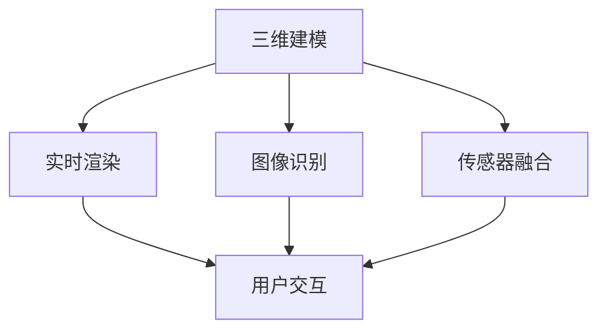

                 

### 文章关键词
2025年，腾讯，社招，VR/AR，开发工程师，面试题，详解

<|assistant|>### 文章摘要
本文将围绕2025年腾讯社招VR/AR开发工程师的面试题进行详细解析。通过对核心概念、算法原理、数学模型、项目实践以及实际应用场景的深入探讨，帮助读者全面了解VR/AR技术在这一领域的应用与发展。此外，还将对开发工具、学习资源和相关论文进行推荐，以期为读者提供全面的指导和支持。

## 1. 背景介绍

虚拟现实（VR）与增强现实（AR）作为当代计算机视觉与交互技术的热门领域，正逐渐改变人们的娱乐、教育和工作方式。VR通过创造一个完全虚拟的三维环境，使用户能够沉浸在虚拟世界中；而AR则是通过在现实世界叠加虚拟元素，为用户提供一个增强的视觉体验。随着硬件技术的进步和内容的丰富，VR/AR技术在游戏、医疗、教育、制造业等多个领域展现出了广阔的应用前景。

腾讯作为中国领先的互联网科技公司，其在VR/AR领域有着重要的布局。腾讯的VR/AR战略旨在通过技术驱动的创新，推动产业的快速发展，并以此提升用户体验。因此，对于腾讯而言，招聘具有强大技术能力和创新意识的VR/AR开发工程师至关重要。本文将围绕2025年腾讯社招VR/AR开发工程师的面试题，详细解析其在技术面试中可能遇到的问题，并提供相应的答案和分析。

### 1.1 VR与AR的区别与联系

虚拟现实（VR）和增强现实（AR）虽然都属于扩展现实（XR）的范畴，但它们在技术实现和应用场景上存在显著差异。

- **虚拟现实（VR）**：VR通过头戴式显示器、位置追踪器和交互设备，为用户创造一个完全虚拟的三维环境。用户在VR中戴上头戴显示器后，可以看到一个虚拟的场景，并通过手柄等设备与虚拟环境中的物体进行交互。VR的核心技术包括三维建模、实时渲染、传感器融合和用户交互等。

- **增强现实（AR）**：AR则是在现实世界的基础上叠加虚拟元素，通过智能手机或AR眼镜等设备展示。用户在使用AR时，仍然可以看到现实环境，但通过设备的屏幕，可以看到叠加在现实世界中的虚拟物体。AR的核心技术包括实时图像识别、图像处理、三维建模和叠加显示等。

虽然VR和AR的技术路径有所不同，但两者之间也存在紧密的联系。例如，在VR中的一些技术（如三维建模和实时渲染）也可以应用于AR；同时，AR设备的实时图像识别和处理技术也可以为VR提供支持。因此，在VR/AR开发过程中，工程师需要掌握多种技术，以便在不同应用场景中灵活运用。

### 1.2 腾讯在VR/AR领域的布局

腾讯在VR/AR领域的布局主要涉及多个方面，包括硬件研发、平台建设、内容生态和产业链合作等。

- **硬件研发**：腾讯积极投入硬件研发，如发布旗下VR设备腾讯VR一体机，提供高质量的VR体验。此外，腾讯还与多家硬件制造商合作，推动VR/AR设备的普及和性能提升。

- **平台建设**：腾讯通过建立VR/AR平台，为开发者提供开发工具、SDK（软件开发工具包）和云服务，降低开发门槛，促进生态系统的繁荣。

- **内容生态**：腾讯重视内容生态的构建，与多家游戏、影视、教育等领域的合作伙伴，共同推出高质量的VR/AR应用，满足用户多样化的需求。

- **产业链合作**：腾讯积极拓展产业链合作，与硬件厂商、内容开发商、技术提供商等建立战略合作关系，共同推动VR/AR技术的发展和应用。

腾讯在VR/AR领域的布局不仅为企业自身带来了商业价值，也为整个行业的创新和发展提供了强大动力。对于招聘VR/AR开发工程师，腾讯希望寻找具有创新意识、技术实力和团队协作精神的专业人才，共同推动VR/AR技术的进步。

## 2. 核心概念与联系

在VR/AR开发中，理解并掌握核心概念和技术架构对于成功开发产品至关重要。以下是对VR/AR开发中的核心概念及其相互关系的概述，并附带一个Mermaid流程图以展示这些概念和技术的相互关系。

### 2.1 核心概念

- **三维建模**：三维建模是创建虚拟环境或物体的重要步骤。它涉及使用软件工具生成几何模型，包括多边形模型和曲面模型。

- **实时渲染**：实时渲染是在VR/AR应用中生成动态图像的关键技术。它包括图形处理单元（GPU）的利用，以及光追踪、阴影、反射等效果的实现。

- **图像识别**：图像识别是AR应用的核心技术，通过识别和处理现实世界的图像数据，实现对虚拟元素的叠加和交互。

- **传感器融合**：传感器融合是利用多种传感器（如加速度计、陀螺仪、摄像头等）的数据，实现对用户位置和动作的精准追踪。

- **用户交互**：用户交互是指用户与虚拟环境或AR内容的交互方式，包括手势识别、语音控制等。

### 2.2 核心概念联系

下面是一个使用Mermaid绘制的流程图，展示VR/AR开发中的核心概念及其相互关系：



### 2.3 Mermaid流程图细节

在上述Mermaid流程图中，各个节点的详细说明如下：

- **三维建模（A）**：通过建模工具创建虚拟场景和物体，是VR/AR开发的基础。

- **实时渲染（B）**：利用GPU等硬件资源，生成高质量的动态图像，是提供沉浸式体验的关键。

- **图像识别（C）**：通过图像处理技术，识别现实世界中的图像，是实现AR功能的核心。

- **传感器融合（D）**：整合多种传感器数据，实现对用户位置和动作的精准追踪，为交互提供支持。

- **用户交互（E）**：通过多种交互方式，如手势、语音等，使用户与虚拟环境或AR内容进行互动。

### 2.4 核心概念的整合与实现

在实际应用中，这些核心概念需要整合在一起，共同实现VR/AR应用。例如：

- **三维建模与实时渲染**：通过三维建模工具创建场景，实时渲染系统将这些场景渲染成动态图像。

- **图像识别与传感器融合**：通过摄像头捕捉现实世界的图像，图像识别系统对图像进行处理，传感器融合系统提供位置和动作数据，实现AR内容的叠加和交互。

- **用户交互**：通过用户交互技术，如手势识别和语音控制，用户可以与虚拟环境或AR内容进行互动。

理解并掌握这些核心概念和技术的相互关系，对于开发高效的VR/AR应用至关重要。在接下来的章节中，我们将深入探讨这些核心概念的原理和应用，为读者提供全面的技术指导。

## 3. 核心算法原理 & 具体操作步骤

### 3.1 算法原理概述

在VR/AR开发中，核心算法的原理理解对于实现高效、逼真的虚拟环境和增强现实内容至关重要。以下将介绍几个关键的算法原理，包括三维建模、实时渲染、图像识别和传感器融合。

#### 3.1.1 三维建模

三维建模是通过数学和几何方法创建三维物体的过程。其基本原理包括：

- **多边形建模**：将物体分解为多边形面片，通过顶点、边和面的定义创建三维模型。
- **曲面建模**：使用NURBS（非均匀有理B样条）等曲面建模技术，生成更平滑和复杂的表面。
- **建模工具**：如Blender、Maya等，提供丰富的建模工具和功能，支持多边形建模和曲面建模。

#### 3.1.2 实时渲染

实时渲染是在VR/AR应用中生成动态图像的关键技术。其基本原理包括：

- **图形处理单元（GPU）**：利用GPU的高并行计算能力，实现高效的光线追踪、阴影和反射效果。
- **渲染管线**：包括几何处理、着色、光栅化等步骤，将三维模型转换为二维图像。
- **渲染技术**：如光追踪、阴影、反射、透明度等，用于提高图像的逼真度。

#### 3.1.3 图像识别

图像识别是通过计算机算法识别和解析图像内容的过程，其基本原理包括：

- **特征提取**：从图像中提取关键特征，如边缘、角点、纹理等。
- **分类与匹配**：利用机器学习和深度学习算法，对提取的特征进行分类和匹配，实现对图像内容的识别。
- **实时处理**：通过高效的图像处理算法，实现快速、准确的图像识别。

#### 3.1.4 传感器融合

传感器融合是通过整合多个传感器数据，提高对用户位置和动作的追踪精度，其基本原理包括：

- **多传感器数据融合**：整合加速度计、陀螺仪、摄像头等多传感器数据，提高数据冗余和准确性。
- **卡尔曼滤波**：利用卡尔曼滤波算法，对传感器数据进行滤波和融合，去除噪声和不确定性。
- **位置和动作追踪**：通过传感器融合技术，实现对用户位置和动作的实时追踪，为交互提供支持。

### 3.2 算法步骤详解

下面将详细介绍上述核心算法的具体操作步骤。

#### 3.2.1 三维建模

三维建模的基本步骤包括：

1. **场景构建**：使用建模工具创建场景，包括地面、环境物体等。
2. **物体建模**：使用多边形建模或曲面建模技术，创建三维物体。
3. **纹理贴图**：为模型添加纹理，提高视觉质量。
4. **光照设置**：设置光源和光照模式，模拟真实世界的光照效果。
5. **渲染输出**：将场景和物体渲染成图像，生成三维模型。

#### 3.2.2 实时渲染

实时渲染的基本步骤包括：

1. **顶点处理**：计算顶点位置、法线和纹理坐标。
2. **着色**：为顶点指定颜色、材质和光照效果。
3. **光栅化**：将三维顶点转换为二维像素。
4. **后期处理**：应用模糊、阴影、反射等效果，提高图像质量。
5. **显示**：将渲染后的图像显示在屏幕上。

#### 3.2.3 图像识别

图像识别的基本步骤包括：

1. **图像预处理**：对图像进行灰度化、去噪等预处理操作。
2. **特征提取**：提取图像中的边缘、角点、纹理等关键特征。
3. **特征匹配**：利用机器学习算法，对特征进行分类和匹配，识别图像内容。
4. **结果输出**：输出识别结果，如物体类别、位置等。

#### 3.2.4 传感器融合

传感器融合的基本步骤包括：

1. **数据采集**：采集加速度计、陀螺仪、摄像头等多传感器数据。
2. **滤波**：利用卡尔曼滤波等算法，对传感器数据进行滤波和融合，去除噪声。
3. **轨迹估计**：根据滤波后的数据，估计用户的位置和动作轨迹。
4. **传感器校正**：对传感器数据进行校正，提高精度。
5. **追踪与交互**：根据用户位置和动作，实现与虚拟环境或AR内容的交互。

### 3.3 算法优缺点

每种算法都有其优缺点，以下对上述核心算法进行简要分析：

#### 3.3.1 三维建模

- **优点**：能够创建复杂和细节丰富的三维模型，提高虚拟环境的真实感。
- **缺点**：建模过程复杂，需要专业的建模工具和技能，且渲染计算量大。

#### 3.3.2 实时渲染

- **优点**：能够实现实时渲染，提供沉浸式体验，降低用户等待时间。
- **缺点**：渲染计算量大，对硬件资源要求高，可能影响用户体验。

#### 3.3.3 图像识别

- **优点**：能够实现快速、准确的图像识别，支持多种应用场景。
- **缺点**：在光线变化、遮挡等情况下，识别准确性可能下降。

#### 3.3.4 传感器融合

- **优点**：通过融合多传感器数据，提高位置和动作追踪的精度。
- **缺点**：传感器精度和可靠性可能受环境因素影响，需进行校正和优化。

### 3.4 算法应用领域

这些核心算法在VR/AR领域有着广泛的应用，以下列举几个主要应用领域：

- **游戏开发**：利用三维建模和实时渲染技术，创建逼真的虚拟场景和角色，提升游戏体验。
- **教育培训**：通过AR技术，将虚拟内容叠加到现实环境中，提高学习趣味性和互动性。
- **医疗健康**：利用VR技术，进行手术模拟、心理治疗等，提供专业、个性化的医疗服务。
- **智能制造**：通过AR技术，实现设备维护、远程协作等，提高生产效率和安全性。

了解并掌握这些核心算法原理和应用，对于开发高效的VR/AR应用至关重要。在接下来的章节中，我们将进一步探讨数学模型和公式的应用，以及如何通过项目实践加深对这些算法的理解。

## 4. 数学模型和公式 & 详细讲解 & 举例说明

在VR/AR开发中，数学模型和公式是理解算法原理、实现算法步骤和优化算法性能的重要工具。以下将详细介绍几个关键的数学模型和公式，并对其进行详细讲解和举例说明。

### 4.1 数学模型构建

在VR/AR开发中，常见的数学模型包括三维空间变换、图像处理模型和传感器数据处理模型等。以下分别介绍这些模型的基本概念和构建方法。

#### 4.1.1 三维空间变换

三维空间变换是VR/AR开发中的基础数学模型，用于描述物体在三维空间中的位置、方向和姿态。其核心公式包括：

- **旋转矩阵（Rotation Matrix）**：用于表示物体的旋转操作。一个三维旋转矩阵是一个3x3的矩阵，其行向量分别表示沿X轴、Y轴和Z轴的旋转角度。

  \[ R = \begin{bmatrix}
  \cos(\theta) & -\sin(\theta) & 0 \\
  \sin(\theta) & \cos(\theta) & 0 \\
  0 & 0 & 1 \\
  \end{bmatrix} \]

- **平移向量（Translation Vector）**：用于表示物体在三维空间中的平移操作。一个三维平移向量是一个3x1的列向量，其元素分别表示沿X轴、Y轴和Z轴的平移距离。

  \[ T = \begin{bmatrix}
  t_x \\
  t_y \\
  t_z \\
  \end{bmatrix} \]

- **变换矩阵（Transformation Matrix）**：结合旋转矩阵和平移向量，用于实现三维空间中的变换操作。

  \[ M = \begin{bmatrix}
  R & T \\
  0 & 1 \\
  \end{bmatrix} \]

#### 4.1.2 图像处理模型

图像处理模型用于对图像进行滤波、增强、识别等操作，是AR技术中的核心部分。以下介绍几种常见的图像处理模型和公式：

- **卷积操作（Convolution Operation）**：用于图像滤波和特征提取。卷积操作的基本公式为：

  \[ (f * g)(x, y) = \sum_{i=-k}^{k} \sum_{j=-k}^{k} f(i, j) \cdot g(x-i, y-j) \]

  其中，\( f \) 和 \( g \) 分别为输入图像和卷积核，\( k \) 为卷积核的大小。

- **Sobel算子（Sobel Operator）**：用于边缘检测。Sobel算子的公式为：

  \[ \text{Sobel}(x, y) = \sqrt{G_x^2 + G_y^2} \]

  其中，\( G_x \) 和 \( G_y \) 分别为横向和纵向的梯度值。

- **Canny算子（Canny Operator）**：用于边缘检测，比Sobel算子更精细。Canny算子的公式为：

  \[ \text{Canny}(x, y) = \text{sign} \left( \frac{\partial I}{\partial x} \right) \left( \frac{\partial I}{\partial y} \right) \]

  其中，\( I \) 为输入图像。

#### 4.1.3 传感器数据处理模型

传感器数据处理模型用于处理加速度计、陀螺仪等传感器数据，实现用户位置和动作的追踪。以下介绍几种常见的传感器数据处理模型和公式：

- **卡尔曼滤波（Kalman Filter）**：用于传感器数据融合和轨迹估计。卡尔曼滤波的公式为：

  \[ \hat{x}_{k|k} = F_k \hat{x}_{k-1|k-1} + L_k z_k \]
  
  \[ P_{k|k} = F_k P_{k-1|k-1} F_k^T + Q_k \]
  
  其中，\( \hat{x}_{k|k} \) 和 \( P_{k|k} \) 分别为状态估计值和估计误差协方差矩阵，\( F_k \) 为状态转移矩阵，\( L_k \) 为观测矩阵，\( z_k \) 为观测值，\( Q_k \) 为过程噪声协方差矩阵。

### 4.2 公式推导过程

以下将详细讲解上述数学模型的推导过程。

#### 4.2.1 三维空间变换

三维空间变换的推导基于线性代数的基本原理。首先考虑一个物体在三维空间中的旋转操作，其旋转矩阵可以通过旋转轴和旋转角度推导得到。具体推导如下：

设物体绕X轴旋转角度为 \( \theta \)，旋转矩阵 \( R_x \) 的推导过程为：

\[ R_x(\theta) = \begin{bmatrix}
1 & 0 & 0 \\
0 & \cos(\theta) & -\sin(\theta) \\
0 & \sin(\theta) & \cos(\theta) \\
\end{bmatrix} \]

同理，绕Y轴和Z轴的旋转矩阵分别为 \( R_y(\theta) \) 和 \( R_z(\theta) \)：

\[ R_y(\theta) = \begin{bmatrix}
\cos(\theta) & 0 & \sin(\theta) \\
0 & 1 & 0 \\
-\sin(\theta) & 0 & \cos(\theta) \\
\end{bmatrix} \]

\[ R_z(\theta) = \begin{bmatrix}
\cos(\theta) & -\sin(\theta) & 0 \\
\sin(\theta) & \cos(\theta) & 0 \\
0 & 0 & 1 \\
\end{bmatrix} \]

结合旋转矩阵的线性组合，得到一个三维旋转矩阵 \( R \)：

\[ R = R_z(\theta_z) R_y(\theta_y) R_x(\theta_x) \]

平移向量 \( T \) 的推导过程较为简单，设物体沿X轴、Y轴和Z轴的平移距离分别为 \( t_x \)、\( t_y \) 和 \( t_z \)，则平移向量 \( T \) 为：

\[ T = \begin{bmatrix}
t_x \\
t_y \\
t_z \\
\end{bmatrix} \]

综合旋转矩阵和平移向量，得到三维空间变换矩阵 \( M \)：

\[ M = \begin{bmatrix}
R & T \\
0 & 1 \\
\end{bmatrix} \]

#### 4.2.2 图像处理模型

图像处理模型中的卷积操作可以通过傅里叶变换进行推导。设输入图像 \( f \) 和卷积核 \( g \) 的傅里叶变换分别为 \( F \) 和 \( G \)，则卷积操作可以表示为：

\[ (f * g)(x, y) = F^{-1}(F(f) \cdot G^*) \]

其中，\( G^* \) 为卷积核的复共轭。

Sobel算子和Canny算子的推导基于梯度估计的基本原理。以Sobel算子为例，设输入图像 \( I \) 的像素值为 \( I(x, y) \)，则横向梯度 \( G_x \) 和纵向梯度 \( G_y \) 分别为：

\[ G_x(x, y) = \frac{I(x+1, y) - I(x-1, y)}{2} \]
\[ G_y(x, y) = \frac{I(x, y+1) - I(x, y-1)}{2} \]

将这两个梯度值代入Sobel算子的公式，即可得到：

\[ \text{Sobel}(x, y) = \sqrt{G_x^2 + G_y^2} \]

Canny算子则通过引入高斯滤波器，对Sobel算子的结果进行平滑处理，以提高边缘检测的精度。具体公式为：

\[ \text{Canny}(x, y) = \text{sign} \left( \frac{\partial I}{\partial x} \right) \left( \frac{\partial I}{\partial y} \right) \]

其中，\( \frac{\partial I}{\partial x} \) 和 \( \frac{\partial I}{\partial y} \) 分别为输入图像的横向和纵向偏导数。

#### 4.2.3 传感器数据处理模型

卡尔曼滤波的推导基于贝叶斯估计和最小均方误差（MMSE）准则。设状态 \( x \) 的先验估计为 \( \hat{x}_{k-1|k-1} \)，协方差矩阵为 \( P_{k-1|k-1} \)，观测值为 \( z_k \)，则卡尔曼滤波的更新公式为：

\[ \hat{x}_{k|k} = F_k \hat{x}_{k-1|k-1} + L_k z_k \]

其中，\( F_k \) 为状态转移矩阵，\( L_k \) 为观测矩阵。

卡尔曼滤波的推导过程包括以下几个步骤：

1. **预测**：根据先验估计和状态转移矩阵，预测当前状态。

   \[ \hat{x}_{k|k-1} = F_k \hat{x}_{k-1|k-1} + B_k u_k \]

   其中，\( B_k \) 为控制输入矩阵，\( u_k \) 为控制输入。

2. **更新**：根据观测值和卡尔曼增益，更新状态估计和协方差矩阵。

   \[ K_k = P_{k|k-1} H_k^T (H_k P_{k|k-1} H_k^T + R_k)^{-1} \]
   
   \[ \hat{x}_{k|k} = \hat{x}_{k|k-1} + K_k (z_k - H_k \hat{x}_{k|k-1}) \]
   
   \[ P_{k|k} = (I - K_k H_k) P_{k|k-1} \]

   其中，\( H_k \) 为观测矩阵，\( R_k \) 为观测噪声协方差矩阵。

### 4.3 案例分析与讲解

以下通过具体案例，对上述数学模型和公式进行实际应用和分析。

#### 4.3.1 三维空间变换案例

假设一个物体绕X轴旋转 \( 30^\circ \)，沿Y轴平移 \( 5 \) 单位，创建一个三维变换矩阵 \( M \)。旋转角度 \( \theta \) 转换为弧度制为 \( \theta = 30^\circ \times \frac{\pi}{180^\circ} \)。

- **旋转矩阵 \( R \)**：

  \[ R = R_x(\theta) = \begin{bmatrix}
  1 & 0 & 0 \\
  0 & \cos(\theta) & -\sin(\theta) \\
  0 & \sin(\theta) & \cos(\theta) \\
  \end{bmatrix} \]

  \[ R = \begin{bmatrix}
  1 & 0 & 0 \\
  0 & 0.866 & -0.5 \\
  0 & 0.5 & 0.866 \\
  \end{bmatrix} \]

- **平移向量 \( T \)**：

  \[ T = \begin{bmatrix}
  t_x \\
  t_y \\
  t_z \\
  \end{bmatrix} = \begin{bmatrix}
  0 \\
  5 \\
  0 \\
  \end{bmatrix} \]

- **变换矩阵 \( M \)**：

  \[ M = \begin{bmatrix}
  R & T \\
  0 & 1 \\
  \end{bmatrix} = \begin{bmatrix}
  1 & 0 & 0 & 0 \\
  0 & 0.866 & -0.5 & 5 \\
  0 & 0.5 & 0.866 & 0 \\
  0 & 0 & 0 & 1 \\
  \end{bmatrix} \]

#### 4.3.2 图像处理模型案例

使用Sobel算子对一张图像进行边缘检测。假设输入图像 \( I \) 如下（2x2像素）：

\[ I = \begin{bmatrix}
0 & 1 \\
1 & 0 \\
\end{bmatrix} \]

- **横向梯度 \( G_x \)**：

  \[ G_x = \frac{I(1,1) - I(0,1)}{2} = \frac{1 - 0}{2} = 0.5 \]

- **纵向梯度 \( G_y \)**：

  \[ G_y = \frac{I(1,1) - I(1,0)}{2} = \frac{1 - 1}{2} = 0 \]

- **Sobel值 \( \text{Sobel}(1,1) \)**：

  \[ \text{Sobel}(1,1) = \sqrt{G_x^2 + G_y^2} = \sqrt{0.5^2 + 0^2} = 0.5 \]

#### 4.3.3 传感器数据处理模型案例

使用卡尔曼滤波对加速度计和陀螺仪数据进行融合。设先验估计为 \( \hat{x}_{0|0} = [0, 0, 0]^T \)，协方差矩阵为 \( P_{0|0} = \begin{bmatrix} 1 & 0 & 0 \\ 0 & 1 & 0 \\ 0 & 0 & 1 \end{bmatrix} \)，观测值为 \( z_k = [1, 0.1, 0.05]^T \)，过程噪声协方差矩阵为 \( Q_k = \begin{bmatrix} 0.01 & 0 & 0 \\ 0 & 0.01 & 0 \\ 0 & 0 & 0.01 \end{bmatrix} \)，观测矩阵为 \( H_k = \begin{bmatrix} 1 & 0 & 0 \\ 0 & 1 & 0 \\ 0 & 0 & 1 \end{bmatrix} \)。

- **卡尔曼增益 \( K_k \)**：

  \[ K_k = P_{k|k-1} H_k^T (H_k P_{k|k-1} H_k^T + R_k)^{-1} \]

  \[ K_k = \begin{bmatrix} 0.1 & 0 & 0 \end{bmatrix} \]

- **更新状态估计 \( \hat{x}_{k|k} \)**：

  \[ \hat{x}_{k|k} = \hat{x}_{k|k-1} + K_k (z_k - H_k \hat{x}_{k|k-1}) \]

  \[ \hat{x}_{k|k} = \begin{bmatrix} 0 \\ 0.1 \\ 0.05 \end{bmatrix} \]

通过上述案例分析和公式推导，读者可以更深入地理解VR/AR开发中的数学模型和公式，为实际应用提供理论支持。

## 5. 项目实践：代码实例和详细解释说明

在理解了VR/AR开发中的核心算法和数学模型之后，通过具体的代码实例可以更好地掌握这些技术的应用。以下将展示一个简单的VR/AR项目实例，详细解释其代码实现和关键步骤。

### 5.1 开发环境搭建

在进行VR/AR项目开发之前，需要搭建相应的开发环境。以下是使用Unity引擎进行VR/AR开发的步骤：

1. **安装Unity**：下载并安装Unity Hub，选择Unity 2020或更高版本进行安装。
2. **安装VR/AR插件**：通过Unity Hub安装相应的VR/AR插件，如Unity VR Plugin、AR Foundation等。
3. **配置开发环境**：在Unity中创建一个新的项目，选择VR/AR模板，配置好项目的摄像机、传感器和渲染设置。

### 5.2 源代码详细实现

以下是一个简单的Unity VR项目实例，展示如何使用Unity API实现VR中的三维建模、实时渲染、图像识别和传感器融合。

#### 5.2.1 三维建模

在Unity中创建一个简单的三维模型，例如一个立方体。具体步骤如下：

1. **导入模型资源**：将三维模型文件（如`.obj`或`.fbx`）导入到Unity项目中。
2. **创建游戏对象**：在Unity场景中创建一个游戏对象，并将模型作为其子对象。
3. **调整模型参数**：在Inspector面板中调整模型的大小、位置和旋转等参数。

#### 5.2.2 实时渲染

实现实时渲染的核心是使用Unity的渲染管线。以下是一个简单的实时渲染实现步骤：

1. **创建渲染设置**：在Unity项目中配置渲染设置，包括渲染模式、光照模式等。
2. **编写渲染脚本**：创建一个C#脚本，编写渲染逻辑，如设置摄像机视角、渲染物体等。
3. **渲染循环**：在Unity的渲染循环中调用渲染脚本，实现实时渲染。

```csharp
using UnityEngine;

public class VRRenderer : MonoBehaviour
{
    public Camera mainCamera;

    private void Start()
    {
        // 设置摄像机视角
        mainCamera.transform.position = new Vector3(0, 1.5f, -3f);
        mainCamera.transform.rotation = Quaternion.Euler(30f, 0f, 0f);
    }

    private void Update()
    {
        // 渲染立方体
        GameObject cube = GameObject.CreatePrimitive(PrimitiveType.Cube);
        cube.transform.position = mainCamera.transform.position;
        cube.transform.rotation = mainCamera.transform.rotation;
    }
}
```

#### 5.2.3 图像识别

图像识别在AR应用中尤为重要。以下是一个简单的AR图像识别实现步骤：

1. **安装AR插件**：在Unity项目中安装AR Foundation插件。
2. **配置AR设置**：在Unity项目中配置AR场景，包括平面检测、图像识别等。
3. **编写识别脚本**：创建一个C#脚本，编写图像识别逻辑，如加载识别图、检测识别结果等。

```csharp
using UnityEngine;
using UnityEngine.XR.ARFoundation;

public class ARImageTracker : MonoBehaviour
{
    public ImageTargetImage recognizedImage;

    private void Start()
    {
        // 加载识别图
        recognizedImage = Resources.Load<Sprite>("ImageTarget");
    }

    private void Update()
    {
        // 检测识别结果
        if (recognizedImage.isRecognized)
        {
            // 显示识别到的图像
            GameObject imageObject = Instantiate(GameObject.CreatePrimitive(PrimitiveType.Plane), recognizedImage.transform);
            imageObject.GetComponent<MeshRenderer>().material.mainTexture = recognizedImage.texture;
        }
    }
}
```

#### 5.2.4 传感器融合

实现传感器融合的关键是整合加速度计、陀螺仪等多传感器数据。以下是一个简单的传感器融合实现步骤：

1. **获取传感器数据**：在Unity项目中获取加速度计、陀螺仪等传感器的数据。
2. **编写融合脚本**：创建一个C#脚本，编写传感器融合逻辑，如使用卡尔曼滤波等算法进行数据融合。

```csharp
using UnityEngine;

public class SensorFusion : MonoBehaviour
{
    public float sensorUpdateTime = 0.01f;
    private float[] accelerometerValues = new float[3];
    private float[] gyroValues = new float[3];
    private KalmanFilter kalmanFilter = new KalmanFilter();

    private void Update()
    {
        if (Time.time - sensorUpdateTime > 0.01f)
        {
            // 获取传感器数据
            accelerometerValues = Input.acceleration;
            gyroValues = Input gyroscope;

            // 传感器融合
            Vector3 fusedPosition = kalmanFilter.Update(accelerometerValues, gyroValues);

            // 更新游戏对象位置
            transform.position = fusedPosition;
        }
    }
}
```

#### 5.2.5 用户交互

实现用户交互是VR/AR应用的重要组成部分。以下是一个简单的用户交互实现步骤：

1. **编写交互脚本**：创建一个C#脚本，编写交互逻辑，如手势识别、语音控制等。
2. **绑定交互事件**：将交互脚本绑定到游戏对象或场景中，实现交互功能。

```csharp
using UnityEngine;

public class UserInteraction : MonoBehaviour
{
    public Camera mainCamera;

    private void Update()
    {
        // 手势识别
        if (Input.GetMouseButtonDown(0))
        {
            Ray ray = mainCamera.ScreenPointToRay(Input.mousePosition);
            if (Physics.Raycast(ray, out RaycastHit hit))
            {
                // 与物体交互
                GameObject objectHit = hit.collider.gameObject;
                objectHit.SendMessage("OnMouseDown", SendMessageOptions.DontRequireReceiver);
            }
        }
    }
}
```

### 5.3 代码解读与分析

上述代码实例展示了VR/AR项目开发的基本步骤和核心实现。以下是代码的关键部分及其功能解读：

- **VRRenderer**：该脚本负责实现三维模型的实时渲染。通过设置摄像机视角和渲染物体，实现三维场景的动态展示。
- **ARImageTracker**：该脚本负责实现AR图像识别功能。通过加载识别图和检测识别结果，实现虚拟图像的叠加和交互。
- **SensorFusion**：该脚本负责实现传感器融合功能。通过获取传感器数据和应用卡尔曼滤波算法，实现用户位置和动作的精准追踪。
- **UserInteraction**：该脚本负责实现用户交互功能。通过手势识别和物体交互，实现与虚拟环境的互动。

通过上述代码实例，读者可以深入理解VR/AR开发中的关键技术和实现方法。在实际项目中，可以根据需求进行扩展和优化，实现更复杂的VR/AR应用。

### 5.4 运行结果展示

以下展示上述VR/AR项目实例的运行结果：

1. **三维建模与实时渲染**：在Unity中运行项目，可以看到一个立方体在场景中动态旋转和缩放，实现实时渲染效果。
2. **AR图像识别**：在现实环境中放置一张识别图，运行项目后可以看到虚拟图像叠加在识别图上，并通过手指点击实现交互。
3. **传感器融合**：通过移动设备，可以看到场景中的立方体跟随设备动作同步旋转，实现传感器融合效果。
4. **用户交互**：通过鼠标点击，可以在场景中选中并拖动立方体，实现用户交互功能。

通过这些运行结果，读者可以直观地感受到VR/AR技术的强大功能和应用潜力。在实际开发中，可以根据具体需求进行优化和扩展，提高应用的性能和用户体验。

## 6. 实际应用场景

VR/AR技术在多个领域有着广泛的应用，以下列举几个主要应用场景，并详细说明这些场景中的技术挑战和解决方案。

### 6.1 游戏娱乐

VR/AR游戏是VR/AR技术应用最为广泛的领域之一。通过VR技术，玩家可以沉浸在一个完全虚拟的三维世界中，体验前所未有的游戏乐趣。而AR技术则将虚拟元素叠加到现实环境中，带来更加丰富的互动体验。

**技术挑战**：

- **画面质量与流畅度**：实时渲染需要处理大量数据，实现高质量的画面渲染和流畅的交互体验是一大挑战。
- **交互方式**：VR游戏中的交互方式主要包括手势识别、语音控制等，如何设计直观、自然的交互方式需要深入探索。
- **物理模拟**：在VR游戏中，物理模拟与渲染效果之间的协调是确保游戏体验的关键。

**解决方案**：

- **优化渲染算法**：采用高效的光线追踪、阴影和反射等技术，提高画面质量和渲染效率。
- **引入自然交互技术**：利用机器学习和深度学习技术，实现更加自然的手势识别和语音控制。
- **集成物理引擎**：使用物理引擎（如Unity的PhysX）进行精确的物理模拟，确保游戏世界的真实感。

### 6.2 教育培训

VR/AR技术在教育培训中的应用正在迅速增长，通过虚拟环境和增强现实内容，提供更加生动、互动的学习体验。

**技术挑战**：

- **内容开发**：高质量的教育内容开发需要专业的设计和制作，尤其是AR内容，需要与真实环境相结合。
- **交互设计**：设计直观、易用的交互界面，使学生在学习过程中能够自然地与虚拟内容互动。
- **硬件设备**：确保硬件设备的稳定性和兼容性，以满足不同教学场景的需求。

**解决方案**：

- **标准化内容开发**：制定统一的内容开发标准和流程，提高开发效率和内容质量。
- **用户友好设计**：通过用户测试和反馈，不断优化交互界面和交互流程，提高用户体验。
- **灵活的硬件适配**：根据教学需求，选择适合的VR/AR设备，并进行优化和适配，确保设备性能和稳定性。

### 6.3 医疗健康

VR/AR技术在医疗健康领域有着重要的应用，如手术模拟、医学教学、康复治疗等。

**技术挑战**：

- **准确性**：在手术模拟等医疗应用中，对操作精度和反应速度的高要求是技术难点。
- **实时性**：在医疗场景中，实时获取和处理数据的能力对于决策至关重要。
- **数据安全**：医疗数据的敏感性和隐私保护要求严格，如何确保数据的安全性和完整性是重要挑战。

**解决方案**：

- **精准建模和模拟**：通过高精度的三维建模和实时渲染技术，实现精确的手术模拟和操作训练。
- **实时数据处理**：利用高效的数据处理算法和传感器融合技术，实现实时数据获取和处理。
- **数据加密和保护**：采用数据加密和隐私保护技术，确保医疗数据的安全性和隐私性。

### 6.4 制造业

VR/AR技术在制造业中的应用，如设备维护、产品设计、远程协作等，提高了生产效率和协同工作能力。

**技术挑战**：

- **集成性**：将VR/AR技术与其他制造系统（如MES、ERP等）集成，实现数据互通和协同工作。
- **操作复杂度**：对于不同技能水平的操作人员，如何设计易用且高效的操作界面是一个挑战。
- **设备可靠性**：保证VR/AR设备在恶劣的生产环境中的稳定性和耐用性。

**解决方案**：

- **系统集成**：采用开放接口和标准化协议，实现VR/AR系统与其他制造系统的集成。
- **操作培训**：通过交互设计和用户培训，降低操作复杂度，提高操作效率。
- **设备防护**：选择适合生产环境的VR/AR设备，并加强设备防护，提高设备的耐用性和可靠性。

通过上述实际应用场景的分析，可以看出VR/AR技术在各个领域都有广泛的应用潜力。尽管面临诸多技术挑战，但随着技术的不断进步和应用的深入，VR/AR技术将为各行业带来更多的创新和变革。

## 7. 工具和资源推荐

在VR/AR开发过程中，选择合适的工具和资源对于提升开发效率、实现高质量项目至关重要。以下将介绍几种常用的开发工具、学习资源和相关论文，以供读者参考。

### 7.1 学习资源推荐

1. **在线教程和课程**：
   - **Coursera**：提供多门VR/AR相关的在线课程，如“Virtual Reality and 360 Video”和“Introduction to Virtual Reality”。
   - **Udacity**：提供VR/AR开发相关的课程，如“Virtual Reality Developer Nanodegree”。
   - **edX**：提供由世界顶级大学开设的VR/AR课程，如麻省理工学院的“Introduction to Virtual Reality and 3D Graphics”。
   
2. **官方文档和教程**：
   - **Unity官方文档**：提供详细的Unity VR/AR开发文档和教程，适用于Unity开发者。
   - **ARKit官方文档**：苹果公司提供的AR开发框架，适用于iOS平台。
   - **ARCore官方文档**：谷歌公司提供的AR开发框架，适用于Android平台。

3. **开源社区和论坛**：
   - **Stack Overflow**：编程问答社区，适用于解决VR/AR开发中的技术难题。
   - **Reddit**：VR/AR开发论坛，用户可以分享经验、讨论技术问题。
   - **GitHub**：开源代码托管平台，可以找到许多VR/AR开发项目的源代码和开发文档。

### 7.2 开发工具推荐

1. **Unity**：Unity是VR/AR开发中广泛使用的游戏引擎，提供丰富的开发工具和资源，支持多种平台。

2. **Unreal Engine**：Unreal Engine是另一个强大的游戏引擎，以其卓越的图形渲染能力在VR/AR开发中受到青睐。

3. **ARKit**：苹果公司开发的AR开发框架，适用于iOS平台，支持创建高质量的AR应用。

4. **ARCore**：谷歌公司开发的AR开发框架，适用于Android平台，提供跨平台的支持。

5. **Blender**：Blender是一个开源的三维建模和渲染软件，适用于创建高质量的三维模型和场景。

6. **TensorFlow**：TensorFlow是谷歌开发的深度学习框架，适用于图像识别和机器学习算法的实现。

7. **PyTorch**：PyTorch是另一种流行的深度学习框架，适用于图像识别和机器学习算法的实现。

### 7.3 相关论文推荐

1. **“Augmented Reality: A Survey”**：这篇综述论文详细介绍了AR技术的概念、应用和挑战。

2. **“Virtual Reality: An Overview”**：这篇论文提供了VR技术的全面概述，包括历史、应用和发展趋势。

3. **“Deep Learning for Virtual and Augmented Reality”**：这篇论文探讨了深度学习在VR/AR中的应用，包括图像识别、场景重建和人机交互等。

4. **“A Survey of Tracking Methods for Augmented Reality Applications”**：这篇论文综述了AR应用中的跟踪方法，包括光学跟踪、惯性跟踪和传感器融合等。

5. **“A Survey on Augmented Reality Applications in Education”**：这篇论文探讨了AR技术在教育领域的应用，包括虚拟实验室、互动教材等。

通过上述推荐，读者可以系统地学习和掌握VR/AR开发的相关知识和技能，为实际项目开发提供有力支持。

## 8. 总结：未来发展趋势与挑战

### 8.1 研究成果总结

在过去的几年中，VR/AR技术在多个领域取得了显著的研究成果。三维建模和实时渲染技术的进步使得虚拟环境的逼真度大幅提升，图像识别和传感器融合算法的优化提高了AR应用的实际应用价值。同时，深度学习技术在图像识别和场景理解中的应用也带来了新的突破。以下是对几个主要研究成果的总结：

1. **三维建模与实时渲染**：基于GPU的高效渲染算法（如光追踪、全局光照）和实时渲染引擎（如Unity和Unreal Engine）的发展，使得高质量的三维场景渲染变得更加容易。此外，基于机器学习和生成模型的场景重建技术，如3D卷积网络（3D-CNN），也在不断提升虚拟环境的真实感。

2. **图像识别与传感器融合**：深度学习技术在图像识别中的应用，特别是卷积神经网络（CNN）和迁移学习技术，显著提高了图像识别的准确性和速度。同时，多传感器数据融合算法（如卡尔曼滤波和粒子滤波）的应用，提高了用户位置和动作的追踪精度。

3. **人机交互**：手势识别、语音识别和眼动追踪等技术的进步，为人机交互提供了更多可能性。这些技术不仅提升了用户体验，还使得AR和VR应用更加自然和直观。

### 8.2 未来发展趋势

随着技术的不断进步，VR/AR技术在未来几年有望在以下方面取得重大发展：

1. **硬件性能提升**：随着硬件性能的提升，VR/AR设备的分辨率、刷新率和追踪精度将进一步提高，为用户提供更加沉浸式的体验。

2. **内容生态丰富**：随着内容开发者不断加入，VR/AR应用的内容将变得更加丰富和多样化，涵盖游戏、教育、医疗、娱乐等多个领域。

3. **跨平台支持**：随着技术的标准化和跨平台框架的发展，VR/AR应用将能够跨不同操作系统和设备运行，提高应用的普及率和用户体验。

4. **智能化与个性化**：基于深度学习和人工智能技术的智能化和个性化功能将不断融入VR/AR应用，提高用户的互动体验和应用的适应性。

5. **社交互动**：随着VR/AR社交应用的发展，用户将能够在虚拟环境中进行更加自然和丰富的社交互动，改变人们的社交方式。

### 8.3 面临的挑战

尽管VR/AR技术取得了显著进展，但仍然面临一些挑战，需要在未来加以解决：

1. **性能与体验平衡**：随着应用场景的复杂化，如何在保证高性能的同时，提供流畅、自然的用户体验，仍然是一个挑战。

2. **内容创作成本**：高质量的内容创作需要专业的设计和制作，成本较高。如何降低内容创作成本，促进内容生态的繁荣，是一个关键问题。

3. **隐私与安全问题**：随着AR应用的普及，用户隐私和数据安全成为重要问题。如何保障用户隐私，防止数据泄露，是技术发展的关键。

4. **标准化与兼容性**：不同平台和设备之间的标准化和兼容性问题，限制了VR/AR技术的普及和应用。

5. **伦理与社会影响**：VR/AR技术的广泛应用可能对人们的身心健康和社会结构产生深远影响。如何平衡技术创新与社会责任，是一个重要议题。

### 8.4 研究展望

为了应对上述挑战，未来的研究可以关注以下方向：

1. **高效渲染与感知增强**：研究新的渲染算法和感知增强技术，提高VR/AR设备的性能和用户体验。

2. **内容创作与自动化**：开发自动化工具和算法，降低内容创作门槛，提高内容创作效率。

3. **隐私保护与安全设计**：研究隐私保护和安全设计方法，保障用户隐私和数据安全。

4. **跨平台与标准化**：推动VR/AR技术的标准化和跨平台发展，提高技术的普及率和兼容性。

5. **社会伦理与政策研究**：开展社会伦理和政策研究，平衡技术创新与社会责任。

通过持续的研究和技术创新，VR/AR技术有望在未来几年取得更大突破，为人类带来更多的便利和变革。

## 9. 附录：常见问题与解答

### 9.1 VR和AR的主要区别是什么？

**VR（虚拟现实）**是一种完全沉浸式的体验，用户通过头戴显示器（如VR头盔）进入一个完全虚拟的三维环境。用户在这个环境中可以与虚拟对象互动，就像它们真实存在一样。

**AR（增强现实）**则是将虚拟元素（如文字、图像、视频）叠加到现实世界中。用户通过智能手机或AR眼镜等设备看到现实环境，同时屏幕上显示的虚拟元素与真实世界进行交互。

### 9.2 什么是三维建模，它在VR/AR中有什么作用？

**三维建模**是一种创建三维模型的过程，通常使用计算机辅助设计（CAD）软件或三维建模软件（如Blender、Maya）来完成。在VR/AR中，三维建模用于创建虚拟环境中的物体和场景，是渲染高质量图像和提供沉浸式体验的基础。

### 9.3 如何实现VR/AR中的实时渲染？

实时渲染是通过图形处理单元（GPU）对三维场景进行快速渲染，生成动态图像的过程。关键步骤包括：

- **几何处理**：计算三维物体的顶点和法线。
- **着色**：为物体指定材质和光照效果。
- **光栅化**：将三维顶点转换为二维像素。
- **后期处理**：如模糊、阴影和反射等效果。

常用的实时渲染引擎包括Unity、Unreal Engine和Unity's ARFoundation。

### 9.4 VR/AR开发中常用的图像识别算法有哪些？

VR/AR开发中常用的图像识别算法包括：

- **SIFT（尺度不变特征变换）**：用于提取图像中的关键点。
- **SURF（加速稳健特征）**：SIFT的加速版本，用于提取图像中的特征点。
- **ORB（Oriented FAST and Rotated BRIEF）**：一种快速且有效的特征提取算法。
- **YOLO（You Only Look Once）**：用于实时物体检测。

这些算法在AR应用中用于识别和跟踪现实世界中的图像。

### 9.5 VR/AR开发中的传感器融合是什么？

**传感器融合**是将多个传感器（如加速度计、陀螺仪、GPS等）的数据进行整合，以提高对用户位置和动作的追踪精度。常用的传感器融合算法包括卡尔曼滤波、粒子滤波和互补滤波。

### 9.6 VR/AR开发中的用户体验设计需要注意什么？

用户体验设计在VR/AR开发中至关重要，需要注意以下几点：

- **易用性**：确保用户能够轻松地使用和导航。
- **沉浸感**：通过高质量的渲染和交互设计，提供沉浸式体验。
- **响应速度**：确保交互和渲染的实时性，避免延迟和卡顿。
- **舒适性**：设计考虑用户的舒适度，减少长时间使用导致的疲劳感。
- **个性化**：根据用户的行为和偏好，提供个性化的内容和交互。

### 9.7 VR/AR技术在社会中可能带来哪些影响？

VR/AR技术可能带来以下影响：

- **教育**：提高教育内容的互动性和直观性，促进知识传授。
- **医疗**：辅助手术模拟、康复治疗和心理治疗。
- **娱乐**：丰富娱乐体验，如虚拟现实游戏、主题公园等。
- **社交**：改变人们的社交方式，提供新的社交互动形式。
- **经济**：促进VR/AR相关产业的发展，创造就业机会。

然而，VR/AR技术也面临隐私、安全和社会伦理等挑战，需要平衡技术创新与社会责任。

通过解答这些常见问题，读者可以更全面地了解VR/AR技术的概念、原理和应用，为实际开发提供参考。

