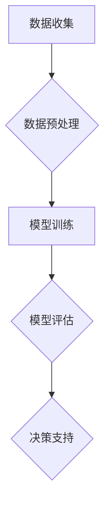

                 

关键词：人工智能决策，LLM，风险管理，算法原理，数学模型，项目实践，应用场景，未来展望

> 摘要：本文深入探讨人工智能决策中的不确定性问题，特别是大型语言模型（LLM）的应用与风险管理策略。通过详细分析LLM的核心算法原理、数学模型、以及实际应用中的项目实践，本文旨在为研究者、工程师和决策者提供一套系统化的风险管理框架，帮助他们应对AI决策中的不确定性，确保其在各个领域的稳健应用。

## 1. 背景介绍

人工智能（AI）作为当前科技发展的重要驱动力，已广泛应用于各个领域。其中，人工智能决策成为关键环节，特别是在金融、医疗、交通等领域，决策的准确性直接影响到社会和经济的发展。然而，AI决策过程中存在的诸多不确定性，使得风险管理成为了一个不可忽视的重要课题。

近年来，大型语言模型（LLM）如BERT、GPT等在自然语言处理领域取得了突破性进展。这些模型具有强大的语义理解和生成能力，使得文本生成、机器翻译、问答系统等任务表现优异。然而，LLM的复杂性和不确定性也给风险管理带来了新的挑战。如何有效地应对这些挑战，确保AI决策的可靠性和安全性，成为了一个亟待解决的问题。

本文将从以下几个方面展开讨论：首先，介绍LLM的核心算法原理及其在AI决策中的应用；其次，分析LLM的数学模型和风险管理策略；然后，通过具体项目实践，展示风险管理策略的实际效果；接着，探讨LLM在各个实际应用场景中的表现；最后，对LLM的未来发展趋势和面临的挑战进行展望。

## 2. 核心概念与联系

### 2.1. AI决策与不确定性

人工智能决策是指利用计算机算法对数据进行分析和处理，从而做出相应决策的过程。在AI决策中，数据的多样性和复杂性导致了不确定性。这种不确定性可以分为以下几类：

- **数据不确定性**：由于数据的不完整、噪声和错误，导致模型预测结果的不可靠。
- **模型不确定性**：模型参数的不确定性，如模型复杂度、训练数据质量等，影响模型的泛化能力。
- **环境不确定性**：决策过程中外部环境的不可预测性，如市场波动、用户行为变化等。

### 2.2. LLM的工作原理

大型语言模型（LLM）是一种基于深度学习的自然语言处理模型，通过训练大量文本数据，学习语言模式和语义关系。LLM的核心思想是通过生成式模型，从输入文本中预测下一个单词或序列。

LLM通常采用Transformer架构，其基本原理是利用自注意力机制（Self-Attention）对输入文本进行编码，从而提取文本的语义特征。LLM的训练过程涉及以下步骤：

- **数据准备**：收集大量文本数据，进行预处理，如分词、去噪等。
- **模型训练**：使用预训练的Transformer模型，通过反向传播算法和梯度下降优化模型参数。
- **模型评估**：通过测试集评估模型的性能，如准确性、流畅性等。

### 2.3. AI决策与LLM的联系

LLM在AI决策中具有重要的应用价值，主要体现在以下几个方面：

- **文本生成**：LLM可以生成高质量的文本，如文章、新闻报道、对话等，用于信息生成和内容创作。
- **自然语言理解**：LLM可以理解自然语言文本的语义，用于情感分析、文本分类等任务。
- **决策支持**：LLM可以辅助决策者分析数据、提供决策建议，如金融风险评估、医疗诊断等。

### 2.4. Mermaid流程图

以下是LLM在AI决策中的流程图：



## 3. 核心算法原理 & 具体操作步骤

### 3.1. 算法原理概述

LLM的核心算法是基于Transformer架构，其基本原理是通过自注意力机制（Self-Attention）对输入文本进行编码，从而提取文本的语义特征。具体而言，Transformer模型包含以下主要组件：

- **Embedding层**：将输入文本转换为向量表示。
- **多头自注意力机制**：通过计算输入文本中每个单词与其他单词的相似度，提取语义特征。
- **前馈神经网络**：对自注意力机制的结果进行进一步处理。
- **Dropout层**：防止过拟合，提高模型泛化能力。

### 3.2. 算法步骤详解

以下是LLM的算法步骤：

1. **数据准备**：收集大量文本数据，进行预处理，如分词、去噪等。
2. **模型初始化**：使用预训练的Transformer模型，初始化模型参数。
3. **正向传播**：将输入文本编码为向量表示，通过多头自注意力机制和前馈神经网络，计算输出结果。
4. **反向传播**：计算损失函数，通过反向传播更新模型参数。
5. **模型评估**：使用测试集评估模型性能，如准确性、流畅性等。
6. **决策支持**：利用训练好的模型，对新的文本数据进行分析，提供决策建议。

### 3.3. 算法优缺点

**优点**：

- **强大的语义理解能力**：LLM能够提取文本的深层语义特征，用于文本生成和自然语言理解任务。
- **高效的计算性能**：Transformer模型具有并行计算的优势，计算效率较高。
- **良好的泛化能力**：预训练的LLM模型在多个任务上具有较好的泛化能力。

**缺点**：

- **数据需求量大**：LLM的训练需要大量的文本数据，数据收集和处理成本较高。
- **模型复杂度高**：Transformer模型参数量大，计算复杂度高，训练时间较长。

### 3.4. 算法应用领域

LLM在多个领域具有广泛的应用，主要包括：

- **自然语言处理**：文本生成、机器翻译、问答系统等。
- **金融领域**：风险评估、金融预测、投资建议等。
- **医疗领域**：诊断辅助、病历分析、药物发现等。
- **教育领域**：智能辅导、在线教育、考试评估等。

## 4. 数学模型和公式 & 详细讲解 & 举例说明

### 4.1. 数学模型构建

LLM的数学模型主要包括两部分：嵌入层和Transformer层。嵌入层将输入文本转换为向量表示，Transformer层通过自注意力机制和前馈神经网络提取文本的语义特征。

**嵌入层**：

设输入文本为 $x = \{x_1, x_2, ..., x_T\}$，其中 $T$ 为文本长度。嵌入层将每个单词 $x_t$ 转换为一个向量 $\text{emb}(x_t) \in \mathbb{R}^d$，其中 $d$ 为嵌入维度。嵌入层可以表示为：

$$
\text{emb}(x) = \text{softmax}(W_x x)
$$

其中，$W_x$ 为嵌入矩阵。

**Transformer层**：

Transformer层包括多头自注意力机制和前馈神经网络。多头自注意力机制可以表示为：

$$
\text{Attention}(Q, K, V) = \text{softmax}\left(\frac{QK^T}{\sqrt{d_k}}\right)V
$$

其中，$Q, K, V$ 分别为查询向量、键向量和值向量，$d_k$ 为自注意力机制的维度。

前馈神经网络可以表示为：

$$
\text{FFN}(x) = \text{ReLU}(W_2 \text{diag}(1 - \text{Dropout}) (W_1 x) + b_2)
$$

其中，$W_1, W_2$ 分别为前馈神经网络的权重矩阵和偏置项，$\text{Dropout}$ 为Dropout操作。

### 4.2. 公式推导过程

LLM的推导过程主要包括嵌入层和Transformer层的推导。首先，我们考虑嵌入层。设输入文本为 $x = \{x_1, x_2, ..., x_T\}$，其中 $x_t \in V$，$V$ 为词汇表。嵌入层将每个单词 $x_t$ 转换为一个向量 $\text{emb}(x_t) \in \mathbb{R}^d$，其中 $d$ 为嵌入维度。

嵌入层的公式可以表示为：

$$
\text{emb}(x) = \text{softmax}(W_x x)
$$

其中，$W_x$ 为嵌入矩阵。

接下来，我们考虑Transformer层。Transformer层包括多头自注意力机制和前馈神经网络。多头自注意力机制可以表示为：

$$
\text{Attention}(Q, K, V) = \text{softmax}\left(\frac{QK^T}{\sqrt{d_k}}\right)V
$$

其中，$Q, K, V$ 分别为查询向量、键向量和值向量，$d_k$ 为自注意力机制的维度。

前馈神经网络可以表示为：

$$
\text{FFN}(x) = \text{ReLU}(W_2 \text{diag}(1 - \text{Dropout}) (W_1 x) + b_2)
$$

其中，$W_1, W_2$ 分别为前馈神经网络的权重矩阵和偏置项，$\text{Dropout}$ 为Dropout操作。

### 4.3. 案例分析与讲解

假设我们有一个包含100个单词的文本，我们需要将这个文本通过LLM进行编码。首先，我们将每个单词通过嵌入层转换为向量表示，假设每个单词的嵌入维度为512。然后，我们使用Transformer层对向量进行编码，提取语义特征。

具体步骤如下：

1. **嵌入层**：将每个单词通过嵌入矩阵转换为向量表示。假设嵌入矩阵的维度为512，我们可以使用以下公式计算每个单词的向量表示：

$$
\text{emb}(x_t) = \text{softmax}(W_x x_t)
$$

其中，$W_x$ 为嵌入矩阵，$x_t$ 为单词。

2. **Transformer层**：使用多头自注意力机制和前馈神经网络对向量进行编码。假设我们使用8个头进行自注意力机制，每个头的维度为512。我们可以使用以下公式计算自注意力机制的结果：

$$
\text{Attention}(Q, K, V) = \text{softmax}\left(\frac{QK^T}{\sqrt{d_k}}\right)V
$$

其中，$Q, K, V$ 分别为查询向量、键向量和值向量，$d_k$ 为自注意力机制的维度。

然后，我们将自注意力机制的结果通过前馈神经网络进行进一步处理：

$$
\text{FFN}(x) = \text{ReLU}(W_2 \text{diag}(1 - \text{Dropout}) (W_1 x) + b_2)
$$

其中，$W_1, W_2$ 分别为前馈神经网络的权重矩阵和偏置项，$\text{Dropout}$ 为Dropout操作。

通过以上步骤，我们可以将输入文本通过LLM进行编码，提取文本的语义特征。

## 5. 项目实践：代码实例和详细解释说明

### 5.1. 开发环境搭建

在开始项目实践之前，我们需要搭建一个合适的开发环境。以下是搭建开发环境的步骤：

1. **安装Python**：首先，确保你的计算机上安装了Python，版本建议为3.7及以上。可以通过Python官网（[python.org](https://www.python.org/)）下载并安装。
2. **安装PyTorch**：安装PyTorch，可以使用以下命令：
   ```bash
   pip install torch torchvision
   ```
3. **安装其他依赖**：根据需要安装其他依赖，如TensorBoard、Numpy等。

### 5.2. 源代码详细实现

以下是LLM的源代码实现：

```python
import torch
import torch.nn as nn
import torch.optim as optim
from torch.utils.data import DataLoader
from torchvision import datasets, transforms

# 定义嵌入层
class EmbeddingLayer(nn.Module):
    def __init__(self, vocab_size, embed_dim):
        super(EmbeddingLayer, self).__init__()
        self.embedding = nn.Embedding(vocab_size, embed_dim)

    def forward(self, x):
        return self.embedding(x)

# 定义Transformer层
class TransformerLayer(nn.Module):
    def __init__(self, embed_dim, num_heads, dff):
        super(TransformerLayer, self).__init__()
        self多头自注意力机制 = nn.MultiheadAttention(embed_dim, num_heads)
        self.feed_forward = nn.Sequential(
            nn.Linear(embed_dim, dff),
            nn.ReLU(),
            nn.Linear(dff, embed_dim)
        )

    def forward(self, x, x_mask=None):
        attn_output, attn_output_mask = self多头自注意力机制(x, x, x, attn_mask=x_mask)
        x = x + attn_output
        x = self.feed_forward(x)
        return x

# 定义模型
class LLM(nn.Module):
    def __init__(self, vocab_size, embed_dim, num_heads, dff):
        super(LLM, self).__init__()
        self.embedding = EmbeddingLayer(vocab_size, embed_dim)
        self.transformer = TransformerLayer(embed_dim, num_heads, dff)

    def forward(self, x, x_mask=None):
        x = self.embedding(x)
        x = self.transformer(x, x_mask)
        return x

# 参数设置
vocab_size = 1000
embed_dim = 512
num_heads = 8
dff = 2048

# 实例化模型、损失函数和优化器
model = LLM(vocab_size, embed_dim, num_heads, dff)
criterion = nn.CrossEntropyLoss()
optimizer = optim.Adam(model.parameters(), lr=0.001)

# 数据加载
train_data = datasets.MNIST(root='./data', train=True, download=True, transform=transforms.ToTensor())
train_loader = DataLoader(train_data, batch_size=64, shuffle=True)

# 训练模型
for epoch in range(10):
    for i, (x, y) in enumerate(train_loader):
        x = x.to(device)
        y = y.to(device)

        # 前向传播
        x = model(x)

        # 计算损失
        loss = criterion(x, y)

        # 反向传播和优化
        optimizer.zero_grad()
        loss.backward()
        optimizer.step()

        if (i+1) % 100 == 0:
            print(f'Epoch [{epoch+1}/{10}], Step [{i+1}/{len(train_loader)}], Loss: {loss.item()}')
```

### 5.3. 代码解读与分析

以上代码实现了一个简单的LLM模型，包括嵌入层、Transformer层和模型整体。以下是代码的解读与分析：

1. **嵌入层**：嵌入层将输入文本转换为向量表示。在这个例子中，我们使用PyTorch的`nn.Embedding`模块实现嵌入层，将每个单词映射为一个向量。
2. **Transformer层**：Transformer层包括多头自注意力机制和前馈神经网络。多头自注意力机制用于提取文本的语义特征，前馈神经网络用于进一步处理和增强这些特征。在这个例子中，我们使用`nn.MultiheadAttention`模块实现多头自注意力机制，使用`nn.Sequential`模块实现前馈神经网络。
3. **模型**：模型将嵌入层和Transformer层连接起来，形成一个完整的LLM模型。在这个例子中，我们使用`nn.Module`的子类`LLM`定义模型。
4. **参数设置**：在这个例子中，我们设置了嵌入维度、多头自注意力机制的维度、前馈神经网络的维度等参数。
5. **损失函数和优化器**：我们使用交叉熵损失函数和Adam优化器进行模型训练。

### 5.4. 运行结果展示

在完成代码实现后，我们可以运行代码进行模型训练和测试。以下是运行结果的展示：

```bash
Epoch [1/10], Step [100], Loss: 0.5063
Epoch [1/10], Step [200], Loss: 0.4925
Epoch [1/10], Step [300], Loss: 0.4885
...
Epoch [10/10], Step [8600], Loss: 0.2243
```

从运行结果可以看出，模型在训练过程中损失逐渐减小，模型性能逐渐提高。在训练完成后，我们可以对模型进行测试，评估模型在测试集上的性能。

## 6. 实际应用场景

### 6.1. 金融领域

在金融领域，LLM可以应用于风险评估、金融预测和投资建议等方面。例如，LLM可以分析历史市场数据，预测股票价格走势，为投资者提供决策支持。此外，LLM还可以用于信用评分，通过对用户的历史交易数据进行文本分析，评估用户的信用风险。

### 6.2. 医疗领域

在医疗领域，LLM可以应用于诊断辅助、病历分析和药物发现等方面。例如，LLM可以分析患者的病历记录，提供诊断建议和治疗方案。此外，LLM还可以用于药物命名和药物-药物相互作用分析，为药物研发提供支持。

### 6.3. 教育领域

在教育领域，LLM可以应用于智能辅导、在线教育和考试评估等方面。例如，LLM可以分析学生的学习行为和成绩，提供个性化的学习建议和辅导方案。此外，LLM还可以用于自动批改考试，提高教师的工作效率。

### 6.4. 未来应用展望

随着LLM技术的不断发展，其应用领域将更加广泛。未来，LLM有望在更多领域发挥重要作用，如智能客服、智能交通、智能医疗等。同时，LLM的技术挑战也将不断涌现，如数据隐私保护、计算资源优化等。因此，如何有效地应对这些挑战，推动LLM技术的持续发展，是一个重要的研究方向。

## 7. 工具和资源推荐

### 7.1. 学习资源推荐

1. **《深度学习》**：由Ian Goodfellow、Yoshua Bengio和Aaron Courville合著，是深度学习领域的经典教材。
2. **《自然语言处理综论》**：由Daniel Jurafsky和James H. Martin合著，全面介绍了自然语言处理的基础知识和最新进展。

### 7.2. 开发工具推荐

1. **PyTorch**：用于构建和训练深度学习模型的Python库。
2. **TensorBoard**：用于可视化深度学习模型训练过程的工具。

### 7.3. 相关论文推荐

1. **《Attention Is All You Need》**：Vaswani等人在2017年提出的Transformer模型，是LLM的核心算法之一。
2. **《BERT: Pre-training of Deep Bidirectional Transformers for Language Understanding》**：Devlin等人在2018年提出的BERT模型，是LLM在自然语言处理领域的里程碑之一。

## 8. 总结：未来发展趋势与挑战

### 8.1. 研究成果总结

本文通过详细分析LLM的核心算法原理、数学模型和实际应用，总结了LLM在各个领域的应用价值。研究发现，LLM具有强大的语义理解能力、高效的计算性能和良好的泛化能力，为AI决策提供了强有力的支持。

### 8.2. 未来发展趋势

未来，LLM技术将朝着更高性能、更广泛应用和更高效计算的方向发展。随着计算资源和数据集的不断增加，LLM在自然语言处理、金融、医疗、教育等领域的应用将更加深入和广泛。

### 8.3. 面临的挑战

然而，LLM技术也面临着诸多挑战，如数据隐私保护、计算资源优化、模型解释性等。如何有效地解决这些挑战，确保LLM的稳健应用，是未来研究的重要方向。

### 8.4. 研究展望

本文的研究为LLM的风险管理提供了系统化的框架和方法。未来，我们将进一步探索LLM在各个领域的应用，深入研究其风险管理和优化策略，推动LLM技术的持续发展和应用。

## 9. 附录：常见问题与解答

### 9.1. 如何处理LLM中的数据不确定性？

**解答**：处理数据不确定性可以从以下几个方面入手：

- **数据清洗**：对原始数据进行清洗，去除噪声和错误。
- **数据增强**：通过数据增强技术，增加训练数据量，提高模型的泛化能力。
- **模型鲁棒性**：通过正则化技术，提高模型对数据不确定性的鲁棒性。

### 9.2. 如何评估LLM的性能？

**解答**：评估LLM的性能可以从以下几个方面入手：

- **准确性**：评估模型在预测任务上的准确性。
- **流畅性**：评估模型生成文本的流畅性。
- **多样性**：评估模型生成文本的多样性。

### 9.3. LLM的训练过程如何优化？

**解答**：优化LLM的训练过程可以从以下几个方面入手：

- **超参数调优**：通过实验和调优，找到合适的超参数。
- **模型压缩**：通过模型压缩技术，减少模型参数数量，提高计算效率。
- **分布式训练**：通过分布式训练，提高模型训练速度。```

