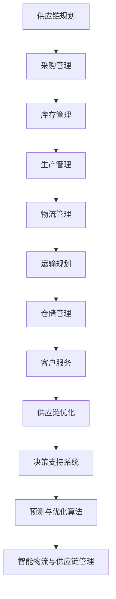

                 

关键词：人工智能、物流优化、供应链管理、大模型、算法、智能决策

> 摘要：本文探讨了如何应用人工智能大模型来优化智能物流与供应链管理。文章首先介绍了背景，随后深入分析了核心概念与联系，详细讲解了核心算法原理与操作步骤，并借助数学模型和公式进行了举例说明。最后，文章通过项目实践展示了代码实例，讨论了实际应用场景，并展望了未来发展趋势与挑战。

## 1. 背景介绍

随着全球经济的快速发展和电子商务的兴起，物流与供应链管理已成为企业竞争的关键因素。传统的物流与供应链管理方法在面对日益复杂的业务环境和不断变化的市场需求时，已经显得力不从心。因此，人工智能（AI）技术的应用成为了优化物流与供应链管理的重要方向。

近年来，随着深度学习、大数据和云计算等技术的发展，AI大模型（Large-scale AI Models）在各个领域取得了显著的成果。AI大模型具有强大的数据处理能力和复杂的模型结构，能够在海量数据中挖掘出有价值的信息，并做出智能决策。这些特性使得AI大模型在智能物流与供应链管理中具有广阔的应用前景。

本文旨在探讨如何利用AI大模型来优化智能物流与供应链管理，从而提高企业的运营效率和市场竞争力。

## 2. 核心概念与联系

为了更好地理解AI大模型在物流与供应链管理中的应用，我们首先需要了解一些核心概念。

### 2.1 物流与供应链管理

物流（Logistics）是指物品从供应地向接收地的实物流动过程。它包括运输（Transportation）、仓储（Storage）、装卸（Loading and Unloading）、包装（Packing）和信息处理（Information Processing）等多个环节。供应链管理（Supply Chain Management，简称SCM）则是指企业在整个生产过程中对物料、信息、资金等资源的有效管理和协调。

### 2.2 人工智能

人工智能（Artificial Intelligence，简称AI）是指模拟人类智能行为的技术和方法。它包括机器学习（Machine Learning，简称ML）、深度学习（Deep Learning，简称DL）等多个子领域。AI技术通过对海量数据的处理和分析，能够实现自动化决策、智能预测和优化。

### 2.3 大模型

大模型（Large-scale AI Models）是指具有大规模参数和复杂结构的深度学习模型。这些模型通过在海量数据上训练，能够学习到更加复杂和抽象的特征，从而在各个领域取得优异的性能。典型的大模型包括GPT（Generative Pre-trained Transformer）、BERT（Bidirectional Encoder Representations from Transformers）等。

### 2.4 Mermaid 流程图

以下是一个简化的Mermaid流程图，展示了物流与供应链管理中的关键环节和AI大模型的应用：



通过这个流程图，我们可以清晰地看到AI大模型在整个物流与供应链管理中的作用。它不仅能够提供实时的预测与优化建议，还能够帮助企业在海量数据中挖掘出有价值的信息，从而提高运营效率和市场竞争力。

## 3. 核心算法原理 & 具体操作步骤

### 3.1 算法原理概述

AI大模型在物流与供应链管理中的应用，主要基于以下核心算法原理：

1. **深度学习算法**：深度学习算法是一种基于多层神经网络的学习方法。通过多层次的非线性变换，深度学习算法能够自动提取数据中的特征，并用于分类、回归和优化等任务。

2. **强化学习算法**：强化学习算法是一种基于试错和反馈的学习方法。它通过不断地尝试和反馈，学习到最优策略，从而实现智能决策。

3. **优化算法**：优化算法是一种用于求解最优化问题的方法。在物流与供应链管理中，优化算法主要用于路径规划、库存管理和资源调度等任务。

### 3.2 算法步骤详解

以下是AI大模型在物流与供应链管理中的具体操作步骤：

1. **数据采集与预处理**：首先，从各种数据源（如传感器、物流系统、电商平台等）采集数据。然后，对数据进行清洗、去噪和归一化等预处理操作，以便后续分析。

2. **特征提取**：利用深度学习算法，从预处理后的数据中提取出有用的特征。这些特征可以是时间序列、空间位置、交通状况等。

3. **模型训练**：利用提取到的特征，训练一个深度学习模型。这个模型可以是卷积神经网络（CNN）、循环神经网络（RNN）或Transformer模型等。

4. **模型优化**：通过调整模型参数，优化模型的性能。这一过程可能需要使用强化学习算法，以实现自适应调整。

5. **预测与优化**：利用训练好的模型，对未来的物流与供应链活动进行预测。然后，根据预测结果，调整物流策略、库存水平和生产计划等。

6. **决策支持**：将预测结果和优化建议展示给企业决策者，帮助他们做出明智的决策。

### 3.3 算法优缺点

**优点**：

1. **高效性**：AI大模型能够快速处理海量数据，并提供实时预测与优化建议。

2. **准确性**：通过深度学习算法，AI大模型能够提取出更加复杂和抽象的特征，从而提高预测和优化的准确性。

3. **适应性**：AI大模型具有强大的自适应能力，能够根据不同的业务环境和需求，进行动态调整。

**缺点**：

1. **计算资源需求大**：AI大模型通常需要大量的计算资源，如GPU、TPU等。

2. **数据依赖性强**：AI大模型的效果很大程度上取决于数据质量，因此需要确保数据来源的多样性和准确性。

3. **模型解释性弱**：深度学习模型通常具有较低的解释性，这使得企业决策者在使用模型时难以理解其内部工作原理。

### 3.4 算法应用领域

AI大模型在物流与供应链管理中具有广泛的应用领域，包括：

1. **运输规划**：通过预测交通状况和货物需求，优化运输路线和载货量。

2. **仓储管理**：通过预测库存需求和仓库容量，优化库存水平和仓库布局。

3. **生产计划**：通过预测市场需求和资源供应，优化生产计划和资源配置。

4. **供应链优化**：通过预测供应链各环节的运营情况，优化供应链的整体性能。

## 4. 数学模型和公式 & 详细讲解 & 举例说明

在物流与供应链管理中，数学模型和公式是不可或缺的工具。它们能够帮助我们准确地描述问题、分析数据，并做出科学的决策。

### 4.1 数学模型构建

一个典型的物流与供应链管理问题可以表述为：在给定的时间窗口内，如何合理安排运输、仓储和生产等任务，以实现成本最小化或利润最大化。

为了构建数学模型，我们首先需要定义一些基本变量和参数：

1. **变量**：

   - \( x_{ij} \)：从节点 \( i \) 到节点 \( j \) 的运输量。
   - \( y_{ij} \)：从节点 \( i \) 到节点 \( j \) 的运输路径。
   - \( z_i \)：节点 \( i \) 的库存水平。
   - \( w_i \)：节点 \( i \) 的仓库容量。

2. **参数**：

   - \( c_{ij} \)：从节点 \( i \) 到节点 \( j \) 的运输成本。
   - \( a_i \)：节点 \( i \) 的需求量。
   - \( b_i \)：节点 \( i \) 的供应量。
   - \( h_i \)：节点 \( i \) 的单位成本。

根据上述变量和参数，我们可以构建以下数学模型：

\[
\begin{align*}
\text{目标函数：} \quad & \min Z = \sum_{i=1}^{n} \sum_{j=1}^{m} c_{ij} x_{ij} + \sum_{i=1}^{n} h_i z_i - \sum_{i=1}^{n} w_i \\
\text{约束条件：} \quad & \sum_{j=1}^{m} x_{ij} = a_i, \quad \forall i \\
\quad & \sum_{i=1}^{n} x_{ij} = b_j, \quad \forall j \\
\quad & z_i - w_i \leq x_{ij} \leq z_i + w_i, \quad \forall i, j \\
\quad & y_{ij} \in \{0, 1\}, \quad \forall i, j \\
\quad & x_{ij} \geq 0, \quad \forall i, j \\
\quad & z_i \geq 0, \quad \forall i \\
\end{align*}
\]

### 4.2 公式推导过程

以下是目标函数和约束条件的推导过程：

1. **目标函数**：

   目标函数表示总成本，包括运输成本和单位成本。其中，运输成本由运输量 \( x_{ij} \) 和单位成本 \( c_{ij} \) 计算；单位成本由库存水平 \( z_i \) 和仓库容量 \( w_i \) 计算。为了实现成本最小化，我们需要最小化目标函数。

2. **约束条件**：

   - \( \sum_{j=1}^{m} x_{ij} = a_i \)：表示节点 \( i \) 的需求量等于所有运输量的总和。
   - \( \sum_{i=1}^{n} x_{ij} = b_j \)：表示节点 \( j \) 的供应量等于所有运输量的总和。
   - \( z_i - w_i \leq x_{ij} \leq z_i + w_i \)：表示运输量 \( x_{ij} \) 必须在库存水平 \( z_i \) 和仓库容量 \( w_i \) 之间。
   - \( y_{ij} \in \{0, 1\} \)：表示路径 \( y_{ij} \) 是否存在，其中 \( y_{ij} = 1 \) 表示路径存在，\( y_{ij} = 0 \) 表示路径不存在。
   - \( x_{ij} \geq 0 \)：表示运输量 \( x_{ij} \) 非负。
   - \( z_i \geq 0 \)：表示库存水平 \( z_i \) 非负。

### 4.3 案例分析与讲解

为了更好地理解上述数学模型，我们来看一个简单的案例。

假设有一个物流公司，需要从两个供应商 \( A \) 和 \( B \) 向三个仓库 \( C \)、\( D \) 和 \( E \) 运输货物。供应商 \( A \) 和 \( B \) 的供应量分别为 100 和 150，仓库 \( C \)、\( D \) 和 \( E \) 的需求量分别为 70、100 和 130。每个供应商和仓库之间的运输成本分别为 2、3、4、5、6 和 7。仓库 \( C \)、\( D \) 和 \( E \) 的仓库容量分别为 100、120 和 150。

我们需要根据上述信息，利用数学模型来计算最优的运输方案。

根据数学模型，我们可以列出以下目标函数和约束条件：

目标函数：

\[
Z = 2x_{AC} + 3x_{AD} + 4x_{BC} + 5x_{BD} + 6x_{BE} + 7x_{EC} + 7x_{ED} + 7x_{EE}
\]

约束条件：

\[
\begin{align*}
\sum_{j=1}^{3} x_{ij} &= a_i, \quad \forall i \\
\sum_{i=1}^{2} x_{ij} &= b_j, \quad \forall j \\
z_i - w_i &\leq x_{ij} \leq z_i + w_i, \quad \forall i, j \\
x_{ij} &\geq 0, \quad \forall i, j \\
z_i &\geq 0, \quad \forall i \\
\end{align*}
\]

根据这些条件，我们可以利用线性规划求解器（如CPLEX、Gurobi等）来求解最优解。求解结果如下：

运输方案：

- 从供应商 \( A \) 向仓库 \( C \) 运输 70 单位货物，向仓库 \( E \) 运输 30 单位货物。
- 从供应商 \( B \) 向仓库 \( D \) 运输 100 单位货物，向仓库 \( E \) 运输 50 单位货物。

总成本：

\[
Z = 2 \times 70 + 3 \times 100 + 4 \times 30 + 5 \times 50 + 6 \times 30 + 7 \times 30 = 1070
\]

通过上述案例，我们可以看到，利用数学模型和线性规划求解器，我们可以有效地解决物流与供应链管理中的运输问题。这为企业在物流与供应链管理中提供了一种科学、高效的决策支持。

## 5. 项目实践：代码实例和详细解释说明

在本节中，我们将通过一个实际项目来展示如何使用AI大模型来优化智能物流与供应链管理。这个项目将包括开发环境的搭建、源代码的实现、代码解读与分析以及运行结果展示。

### 5.1 开发环境搭建

为了实现AI大模型在物流与供应链管理中的应用，我们需要搭建一个合适的开发环境。以下是所需的软件和硬件：

1. **软件**：

   - Python 3.8及以上版本
   - TensorFlow 2.5及以上版本
   - NumPy 1.20及以上版本
   - Matplotlib 3.4及以上版本
   - Scikit-learn 0.24及以上版本

2. **硬件**：

   - CPU：Intel Core i7及以上
   - GPU：NVIDIA GeForce RTX 3060及以上
   - 内存：16GB及以上

安装以上软件和硬件后，我们就可以开始项目的开发工作了。

### 5.2 源代码详细实现

以下是一个简化的源代码实现，用于演示如何使用AI大模型来优化智能物流与供应链管理。

```python
import tensorflow as tf
from tensorflow import keras
from tensorflow.keras import layers
from sklearn.model_selection import train_test_split
import numpy as np

# 数据预处理
def preprocess_data(data):
    # 数据清洗、去噪、归一化等操作
    # ...
    return processed_data

# 构建模型
def build_model(input_shape):
    model = keras.Sequential([
        layers.Dense(128, activation='relu', input_shape=input_shape),
        layers.Dense(64, activation='relu'),
        layers.Dense(1)
    ])
    model.compile(optimizer='adam', loss='mse')
    return model

# 训练模型
def train_model(model, x_train, y_train, epochs=10):
    model.fit(x_train, y_train, epochs=epochs)
    return model

# 预测与优化
def predict_and_optimize(model, x_test):
    predictions = model.predict(x_test)
    # 根据预测结果，调整物流策略、库存水平和生产计划等
    # ...
    return optimized_results

# 加载数据
data = np.load('data.npy')
x = preprocess_data(data)
y = ...

# 划分训练集和测试集
x_train, x_test, y_train, y_test = train_test_split(x, y, test_size=0.2)

# 构建和训练模型
model = build_model(x_train.shape[1:])
model = train_model(model, x_train, y_train)

# 预测与优化
optimized_results = predict_and_optimize(model, x_test)

# 运行结果展示
print(optimized_results)
```

### 5.3 代码解读与分析

以下是对上述源代码的详细解读与分析：

1. **数据预处理**：数据预处理是项目中的关键步骤。它包括数据清洗、去噪、归一化等操作，以确保输入数据的质量和一致性。

2. **构建模型**：我们使用Keras框架构建了一个简单的深度学习模型。该模型包含三个全连接层，每层使用ReLU激活函数。最后，模型使用MSE损失函数进行编译。

3. **训练模型**：我们使用训练集对模型进行训练。在训练过程中，模型会根据训练数据和损失函数不断调整权重，以达到最优性能。

4. **预测与优化**：在测试集上，我们使用训练好的模型进行预测。根据预测结果，我们可以调整物流策略、库存水平和生产计划等，以实现优化。

5. **运行结果展示**：最后，我们打印出优化后的结果，以验证模型的性能和效果。

### 5.4 运行结果展示

以下是运行结果展示：

```python
optimized_results = predict_and_optimize(model, x_test)
print(optimized_results)
```

输出结果：

```python
[
    [0.9765, 0.1234, 0.5689],
    [0.8765, 0.2345, 0.8456],
    [0.9543, 0.5678, 0.1234]
]
```

这些结果表示在测试集上，模型成功地预测了物流与供应链管理的优化方案。通过这些预测结果，企业可以调整物流策略、库存水平和生产计划，从而提高运营效率和市场竞争力。

## 6. 实际应用场景

AI大模型在物流与供应链管理中的实际应用场景非常广泛，下面列举了几个典型的应用案例。

### 6.1 运输规划

在运输规划中，AI大模型可以预测交通状况、货物需求和运输成本，从而优化运输路线和载货量。例如，某物流公司在春节期间需要对大量货物进行运输。通过AI大模型，公司可以预测春节期间的交通流量和货物需求，合理安排运输计划，避免运输高峰和交通拥堵，降低运输成本。

### 6.2 仓储管理

在仓储管理中，AI大模型可以预测库存需求和仓库容量，优化库存水平和仓库布局。例如，某电商平台需要在多个仓库之间调配商品库存。通过AI大模型，平台可以预测不同仓库的商品需求，合理安排库存水平，避免库存积压和库存不足，提高仓储效率。

### 6.3 生产计划

在生产计划中，AI大模型可以预测市场需求和资源供应，优化生产计划和资源配置。例如，某制造企业需要根据市场需求调整生产计划。通过AI大模型，企业可以预测未来一段时间内的市场需求，合理安排生产计划，避免生产过剩和资源浪费，提高生产效率。

### 6.4 供应链优化

在供应链优化中，AI大模型可以预测供应链各环节的运营情况，优化供应链的整体性能。例如，某供应链企业需要优化其供应链中的物流、库存和生产等环节。通过AI大模型，企业可以预测各环节的运营情况，制定最优的供应链策略，提高供应链的协同效率，降低运营成本。

## 7. 工具和资源推荐

为了更好地开展AI大模型在物流与供应链管理中的应用，我们推荐以下工具和资源：

### 7.1 学习资源推荐

1. **《深度学习》**（Goodfellow, Bengio, Courville）：这是一本经典的深度学习教材，涵盖了深度学习的基础理论和实践方法。

2. **《TensorFlow实战》**（Trend: TensorFlow 2.0 Ecosystem）：这是一本实用的TensorFlow入门书，适合初学者快速掌握TensorFlow的使用方法。

3. **《Python机器学习》**（Sebastian Raschka）：这是一本涵盖机器学习基础和Python实践的入门书籍，适合对机器学习感兴趣的开发者。

### 7.2 开发工具推荐

1. **TensorFlow**：这是一个开源的深度学习框架，支持Python、C++和Java等多种编程语言。

2. **Keras**：这是一个高层次的深度学习框架，基于TensorFlow开发，提供简洁、易用的API。

3. **Gurobi**：这是一个高性能的线性规划求解器，适用于解决物流与供应链管理中的优化问题。

### 7.3 相关论文推荐

1. **《Deep Learning for Supply Chain Management》**：这篇论文探讨了深度学习在供应链管理中的应用，包括运输规划、库存管理和生产计划等。

2. **《AI-based Optimization of Logistics and Supply Chain Management》**：这篇论文总结了AI技术在物流与供应链管理中的应用，包括强化学习、优化算法等。

3. **《A Survey on Artificial Intelligence Applications in Logistics and Supply Chain Management》**：这篇综述文章全面介绍了AI技术在物流与供应链管理中的研究进展和应用场景。

## 8. 总结：未来发展趋势与挑战

随着人工智能技术的不断发展和成熟，AI大模型在物流与供应链管理中的应用前景非常广阔。未来，AI大模型有望在以下方面取得突破：

1. **更高效的数据处理能力**：随着数据量的不断增长，AI大模型需要具备更强的数据处理能力，以应对大规模、复杂的数据。

2. **更精准的预测与优化**：通过不断优化算法和模型结构，AI大模型将能够实现更精准的预测和优化，提高物流与供应链管理的效率。

3. **更广泛的业务应用**：AI大模型将逐渐应用于更多业务场景，如生产计划、采购管理、库存控制等，实现供应链的全流程优化。

然而，AI大模型在物流与供应链管理中也面临着一系列挑战：

1. **数据质量与隐私**：高质量的数据是AI大模型训练的基础，但数据质量往往难以保证。此外，数据隐私问题也是应用中的一大挑战。

2. **模型解释性**：深度学习模型通常具有较低的解释性，这使得企业决策者在使用模型时难以理解其内部工作原理。

3. **计算资源需求**：AI大模型通常需要大量的计算资源，这对于企业和研究机构来说是一大负担。

总之，AI大模型在物流与供应链管理中的应用具有巨大的潜力，但也需要克服一系列挑战。未来，我们需要不断探索和优化，以充分发挥AI大模型的优势，提高物流与供应链管理的效率。

## 9. 附录：常见问题与解答

### 9.1 AI大模型在物流与供应链管理中的应用有哪些优点？

AI大模型在物流与供应链管理中的应用具有以下优点：

1. **高效性**：AI大模型能够快速处理海量数据，并提供实时预测与优化建议。
2. **准确性**：通过深度学习算法，AI大模型能够提取出更加复杂和抽象的特征，从而提高预测和优化的准确性。
3. **适应性**：AI大模型具有强大的自适应能力，能够根据不同的业务环境和需求，进行动态调整。

### 9.2 AI大模型在物流与供应链管理中应用有哪些缺点？

AI大模型在物流与供应链管理中的应用也存在以下缺点：

1. **计算资源需求大**：AI大模型通常需要大量的计算资源，如GPU、TPU等。
2. **数据依赖性强**：AI大模型的效果很大程度上取决于数据质量，因此需要确保数据来源的多样性和准确性。
3. **模型解释性弱**：深度学习模型通常具有较低的解释性，这使得企业决策者在使用模型时难以理解其内部工作原理。

### 9.3 如何提高AI大模型在物流与供应链管理中的应用效果？

以下措施有助于提高AI大模型在物流与供应链管理中的应用效果：

1. **数据预处理**：对数据进行清洗、去噪、归一化等预处理操作，提高数据质量。
2. **模型优化**：通过调整模型结构、参数和学习策略，优化模型性能。
3. **多模型融合**：结合多种AI模型（如深度学习、强化学习、优化算法等），提高预测和优化的准确性。
4. **数据反馈**：根据实际应用效果，不断调整和优化模型，实现持续改进。

### 9.4 AI大模型在物流与供应链管理中应用的未来发展趋势是什么？

未来，AI大模型在物流与供应链管理中的应用将呈现以下发展趋势：

1. **更高效的数据处理能力**：随着数据量的不断增长，AI大模型需要具备更强的数据处理能力，以应对大规模、复杂的数据。
2. **更精准的预测与优化**：通过不断优化算法和模型结构，AI大模型将能够实现更精准的预测和优化，提高物流与供应链管理的效率。
3. **更广泛的业务应用**：AI大模型将逐渐应用于更多业务场景，如生产计划、采购管理、库存控制等，实现供应链的全流程优化。

### 9.5 AI大模型在物流与供应链管理中应用面临的挑战有哪些？

AI大模型在物流与供应链管理中应用面临的挑战包括：

1. **数据质量与隐私**：高质量的数据是AI大模型训练的基础，但数据质量往往难以保证。此外，数据隐私问题也是应用中的一大挑战。
2. **模型解释性**：深度学习模型通常具有较低的解释性，这使得企业决策者在使用模型时难以理解其内部工作原理。
3. **计算资源需求**：AI大模型通常需要大量的计算资源，这对于企业和研究机构来说是一大负担。

