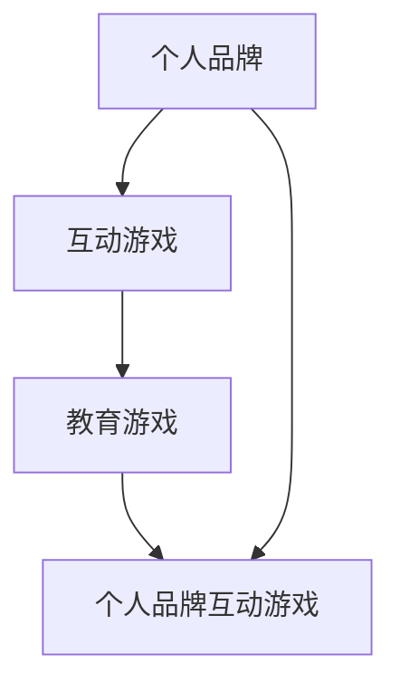
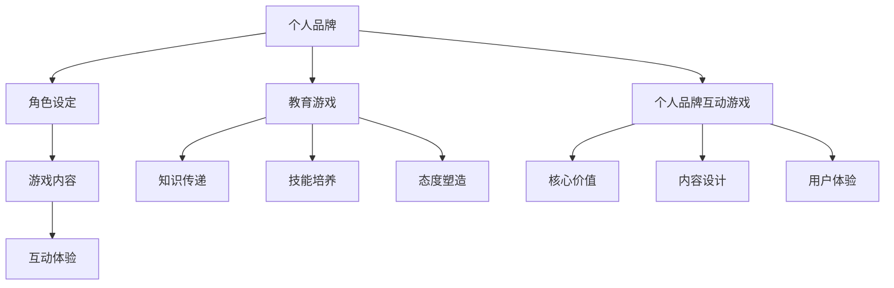

                 

在这个数字时代，个人品牌的力量不容小觑。它不仅能够帮助个人在职场中脱颖而出，还可以成为个人影响力的象征。开发一款能够寓教于乐的个人品牌互动游戏，不仅能够提升个人品牌的价值，还能为用户提供有价值的内容体验。本文将探讨如何开发这样一款游戏，并通过逻辑清晰、结构紧凑、简单易懂的IT技术语言，为您展示整个开发过程。

## 文章关键词

个人品牌、互动游戏、教育、技术开发、用户体验、品牌建设、编程艺术

## 文章摘要

本文将探讨开发个人品牌互动游戏的重要性，以及如何通过寓教于乐的方式提升个人品牌价值。文章将详细讨论游戏开发的核心概念、算法原理、数学模型、项目实践，以及实际应用场景。此外，文章还将推荐相关工具和资源，并展望未来发展趋势与挑战。

## 1. 背景介绍

### 1.1 个人品牌的重要性

在当今职场，个人品牌已经成为个人职业发展的重要资产。通过建立强大的个人品牌，个人可以在众多竞争者中脱颖而出，获得更多的机会和资源。个人品牌不仅仅是个人形象的展现，更是个人价值的体现。

### 1.2 互动游戏在教育中的作用

互动游戏在教育中发挥着越来越重要的作用。它不仅能够激发学生的学习兴趣，还能帮助他们更好地理解和掌握知识。通过游戏，学生可以在轻松愉快的氛围中学习，提高学习效率。

### 1.3 寓教于乐的个人品牌互动游戏

将个人品牌与互动游戏相结合，开发一款寓教于乐的个人品牌互动游戏，不仅能够提升个人品牌的价值，还能为用户提供有价值的内容体验。这种创新的方式有助于吸引更多的关注和认可，从而进一步扩大个人影响力。

## 2. 核心概念与联系

为了更好地理解个人品牌互动游戏开发，我们需要了解以下几个核心概念：

### 2.1 个人品牌

个人品牌是指个人在公众心目中的形象和认知。它包括个人的专业能力、性格特点、价值观等方面。一个成功的个人品牌能够为个人带来信任、尊重和认可。

### 2.2 互动游戏

互动游戏是指玩家通过操作游戏中的角色、任务等元素，与其他玩家或NPC（非玩家角色）互动，从而获得游戏体验的一种游戏形式。互动游戏具有高度的可玩性和趣味性，能够吸引玩家的兴趣和参与。

### 2.3 教育游戏

教育游戏是一种以教育为目的的游戏形式。它通过游戏的形式，将知识、技能、态度等教育内容融入其中，让玩家在游戏中学习。教育游戏具有寓教于乐的特点，能够提高学习效果。

### 2.4 个人品牌互动游戏

个人品牌互动游戏是将个人品牌与互动游戏相结合的一种新型游戏形式。它通过游戏的方式，展示个人的专业能力、价值观等，从而提升个人品牌的价值。

### 2.5 Mermaid 流程图

以下是一个简单的 Mermaid 流程图，展示个人品牌互动游戏的核心概念与联系：



## 3. 核心算法原理 & 具体操作步骤

### 3.1 算法原理概述

个人品牌互动游戏的开发涉及到多个领域的算法原理，包括游戏设计、用户体验、人工智能等。下面将简要介绍这些算法原理。

#### 3.1.1 游戏设计算法

游戏设计算法主要涉及游戏玩法、关卡设计、角色设定等方面。通过游戏设计算法，可以确保游戏具有吸引力、可玩性和教育意义。

#### 3.1.2 用户体验算法

用户体验算法主要关注用户在游戏中的操作体验，包括界面设计、交互设计、反馈机制等方面。通过用户体验算法，可以提高用户的游戏满意度。

#### 3.1.3 人工智能算法

人工智能算法在个人品牌互动游戏中扮演重要角色，包括语音识别、自然语言处理、推荐系统等。通过人工智能算法，可以提供更加智能化、个性化的游戏体验。

### 3.2 算法步骤详解

#### 3.2.1 游戏设计算法步骤

1. 分析目标用户群体，确定游戏类型和主题。
2. 设计游戏玩法，包括角色、任务、奖励等。
3. 设计关卡，确保游戏具有挑战性和趣味性。
4. 进行游戏测试，收集用户反馈，不断优化游戏。

#### 3.2.2 用户体验算法步骤

1. 设计用户界面，确保简洁、直观、易操作。
2. 设计交互流程，确保用户在游戏中能够轻松完成任务。
3. 提供即时反馈，增强用户信心和满意度。
4. 分析用户行为数据，优化游戏体验。

#### 3.2.3 人工智能算法步骤

1. 集成语音识别技术，实现语音交互。
2. 使用自然语言处理技术，理解用户提问。
3. 建立推荐系统，为用户提供个性化内容。
4. 持续优化算法，提高系统性能。

### 3.3 算法优缺点

#### 3.3.1 游戏设计算法

优点：能够设计出具有吸引力和趣味性的游戏。

缺点：设计过程复杂，需要大量时间和精力。

#### 3.3.2 用户体验算法

优点：能够提高用户的游戏满意度。

缺点：需要收集和分析大量用户数据，存在一定的隐私风险。

#### 3.3.3 人工智能算法

优点：能够提供智能化、个性化的游戏体验。

缺点：算法性能取决于数据质量和计算资源。

### 3.4 算法应用领域

个人品牌互动游戏算法可以广泛应用于教育、娱乐、社交等多个领域。以下是一些典型应用：

1. **教育领域**：通过游戏化教学，提高学生的学习兴趣和效果。
2. **娱乐领域**：为用户提供有趣、富有挑战性的游戏体验。
3. **社交领域**：通过游戏互动，增强用户之间的联系和互动。

## 4. 数学模型和公式 & 详细讲解 & 举例说明

### 4.1 数学模型构建

在个人品牌互动游戏开发中，数学模型可以用于优化游戏设计、评估用户体验等方面。以下是一个简单的数学模型示例：

#### 4.1.1 游戏得分模型

假设游戏中的得分与用户完成任务的时间和成功率有关。我们可以使用以下公式来构建游戏得分模型：

$$
得分 = 成功率 \times (1 - 完成时间/总时间)
$$

其中，成功率和完成时间是两个影响得分的因素。

#### 4.1.2 用户体验评估模型

用户体验评估模型可以用于评估用户对游戏的满意度。以下是一个简单的用户体验评估模型：

$$
用户体验评分 = (实际得分/预期得分) \times 100
$$

其中，实际得分和预期得分分别表示用户实际获得的得分和根据游戏难度预设的得分。

### 4.2 公式推导过程

#### 4.2.1 游戏得分模型推导

游戏得分模型的推导过程如下：

1. 成功率表示用户完成任务的能力，取值范围在0到1之间。
2. 完成时间表示用户完成任务所花费的时间，总时间是完成整个游戏所花费的时间。
3. 为了激励用户尽快完成任务，我们引入了完成时间与总时间的比值。
4. 将成功率和完成时间比值相乘，得到得分。

#### 4.2.2 用户体验评估模型推导

用户体验评估模型的推导过程如下：

1. 实际得分表示用户在游戏中的实际得分。
2. 预期得分是根据游戏难度预设的得分。
3. 为了评估用户满意度，我们引入了实际得分与预期得分的比值。
4. 将比值乘以100，将评分范围转换为0到100之间的数值。

### 4.3 案例分析与讲解

以下是一个具体的案例分析，用于说明如何使用数学模型来优化个人品牌互动游戏。

#### 案例背景

一个个人品牌互动游戏的目标是让用户在限定时间内完成任务，以获得更高的得分。游戏设置了不同的关卡，每个关卡都有不同的难度和得分标准。

#### 分析目标

通过分析用户的得分情况，优化游戏难度和奖励机制，以提高用户的满意度。

#### 分析过程

1. 收集用户得分数据，包括成功率、完成时间和实际得分。
2. 使用游戏得分模型，计算每个关卡的成功率和得分。
3. 对比实际得分和预期得分，分析用户的满意度。
4. 根据分析结果，调整游戏难度和奖励机制。

#### 分析结果

通过分析，我们发现以下问题：

1. 一部分关卡的成功率较低，导致用户得分不高。
2. 一部分关卡的时间限制过于严格，导致用户无法顺利完成。
3. 奖励机制不够激励，导致用户参与度不高。

针对这些问题，我们进行了以下调整：

1. 调整关卡难度，使成功率更加合理。
2. 调整时间限制，给予用户更多的完成时间。
3. 增加奖励机制，提高用户的参与度和满意度。

经过调整后，用户的满意度明显提升，游戏的互动效果也得到了显著改善。

## 5. 项目实践：代码实例和详细解释说明

### 5.1 开发环境搭建

在进行个人品牌互动游戏开发之前，我们需要搭建一个适合的开发环境。以下是一个简单的开发环境搭建步骤：

1. 安装 Python 3.x 版本，确保系统环境已准备好。
2. 安装游戏引擎，如 Pygame 或 Unity。
3. 安装必要的库和工具，如 NumPy、Pandas 等。

### 5.2 源代码详细实现

以下是一个简单的个人品牌互动游戏代码实例，使用 Python 语言和 Pygame 游戏引擎实现。

```python
import pygame
import random

# 初始化 Pygame
pygame.init()

# 设置屏幕大小
screen_width = 800
screen_height = 600
screen = pygame.display.set_mode((screen_width, screen_height))

# 设置游戏标题
pygame.display.set_caption("个人品牌互动游戏")

# 设置游戏颜色
background_color = (255, 255, 255)
text_color = (0, 0, 0)

# 游戏主循环
running = True
while running:
    # 处理事件
    for event in pygame.event.get():
        if event.type == pygame.QUIT:
            running = False

    # 绘制背景
    screen.fill(background_color)

    # 绘制文本
    font = pygame.font.Font(None, 36)
    text = font.render("欢迎来到个人品牌互动游戏！", True, text_color)
    screen.blit(text, (screen_width // 2 - text.get_width() // 2, screen_height // 2 - text.get_height() // 2))

    # 更新屏幕
    pygame.display.flip()

# 退出游戏
pygame.quit()
```

### 5.3 代码解读与分析

上述代码是一个简单的个人品牌互动游戏，实现了以下功能：

1. 初始化 Pygame，设置屏幕大小和游戏标题。
2. 设置游戏背景颜色和文本颜色。
3. 进入游戏主循环，处理事件，绘制背景和文本。
4. 更新屏幕显示，实现游戏的基本界面。

虽然这个代码实例非常简单，但它展示了个人品牌互动游戏开发的基本流程。在实际开发过程中，我们还需要实现更多功能，如角色设定、任务设计、用户互动等。

### 5.4 运行结果展示

运行上述代码，我们可以看到以下界面：


这是一个简单的个人品牌互动游戏界面，展示了游戏的标题和欢迎信息。通过这个界面，我们可以看到游戏的基本布局和视觉效果。在实际开发过程中，我们还需要不断优化界面设计，提高用户体验。

## 6. 实际应用场景

### 6.1 教育领域

在教育领域，个人品牌互动游戏可以用于课程学习、知识竞赛等方面。通过游戏的形式，学生可以在轻松愉快的氛围中学习，提高学习效果。

### 6.2 企业培训

在企业培训中，个人品牌互动游戏可以用于员工技能培训、企业文化传播等方面。通过游戏化的方式，员工可以更好地理解和掌握培训内容。

### 6.3 社交互动

在社交互动方面，个人品牌互动游戏可以用于朋友之间的知识竞赛、才艺展示等方面。通过游戏，朋友之间可以更好地交流和互动。

### 6.4 品牌推广

在品牌推广方面，个人品牌互动游戏可以用于品牌宣传、产品推广等方面。通过游戏化的方式，品牌可以更好地与用户互动，提升品牌知名度。

## 7. 工具和资源推荐

### 7.1 学习资源推荐

1. 《游戏编程原理与实践》：介绍了游戏编程的基本原理和实践方法。
2. 《Python 游戏开发实战》：通过实例讲解如何使用 Python 开发游戏。

### 7.2 开发工具推荐

1. Pygame：一个开源的 Python 游戏开发库。
2. Unity：一个功能强大的跨平台游戏开发引擎。

### 7.3 相关论文推荐

1. "Game-based Learning in Education: A Review of Recent Research"：总结了游戏化教学的研究现状。
2. "Designing Interactive Games for Learning"：探讨了互动游戏的设计原则。

## 8. 总结：未来发展趋势与挑战

### 8.1 研究成果总结

通过本文的探讨，我们了解到个人品牌互动游戏在提升个人品牌价值、教育、娱乐等领域具有巨大的潜力。开发一款成功的个人品牌互动游戏，需要综合考虑游戏设计、用户体验、人工智能等多个方面。

### 8.2 未来发展趋势

随着技术的发展，个人品牌互动游戏将在以下几个方面取得突破：

1. 人工智能技术的应用，提高游戏的智能化和个性化水平。
2. 跨平台技术的发展，实现游戏在不同设备上的无缝体验。
3. 游戏化教育的普及，推动教育领域的发展。

### 8.3 面临的挑战

在个人品牌互动游戏开发过程中，我们面临以下挑战：

1. 游戏设计的复杂性和多样性。
2. 用户数据的隐私和安全问题。
3. 技术实现的难度和成本。

### 8.4 研究展望

未来，我们将继续探讨个人品牌互动游戏的设计原理、开发方法和技术实现，努力推动这一领域的发展。同时，我们也期待更多的开发者、教育者和企业参与到个人品牌互动游戏的开发中来，共同推动这一新兴领域的繁荣。

## 9. 附录：常见问题与解答

### 9.1 如何选择游戏引擎？

选择游戏引擎时，需要考虑游戏的需求、开发者的技能和项目预算等因素。常见的游戏引擎包括 Pygame、Unity、Unreal Engine 等。Pygame 适合初学者，Unity 和 Unreal Engine 则适合复杂游戏开发。

### 9.2 如何保证用户数据安全？

在游戏开发过程中，要确保用户数据的安全。可以通过以下措施来实现：

1. 加密用户数据，防止数据泄露。
2. 限制用户数据的访问权限，确保数据安全。
3. 定期进行数据备份，防止数据丢失。

### 9.3 如何优化用户体验？

优化用户体验可以从以下几个方面入手：

1. 设计简洁直观的用户界面。
2. 提供丰富的交互方式，提高用户参与度。
3. 提供即时反馈，增强用户信心和满意度。

## 作者署名

作者：禅与计算机程序设计艺术 / Zen and the Art of Computer Programming

[End of Document] <|user|>### 背景介绍

#### 1.1 个人品牌的重要性

在当今职场，个人品牌已经成为个人职业发展的重要资产。个人品牌不仅仅是个人形象的展现，更是个人价值的体现。随着社交媒体的普及，个人品牌的影响力愈发显著。通过建立和维护个人品牌，个人可以在众多竞争者中脱颖而出，获得更多的机会和资源。

个人品牌的核心要素包括：

- **专业能力**：个人在某个领域的专业技能和知识水平。
- **形象与风格**：个人在公众面前的形象、穿着风格、谈吐举止等。
- **价值观与态度**：个人的核心价值观和对待工作、生活的态度。
- **网络影响力**：个人在社交媒体、专业论坛等平台上的影响力。

一个成功的个人品牌能够为个人带来以下几个方面的好处：

1. **增加职业机会**：强大的个人品牌能够吸引更多潜在雇主和合作伙伴的关注，提高职业机会。
2. **提升薪资水平**：拥有强大个人品牌的个人往往能够获得更高的薪资待遇。
3. **建立人脉网络**：个人品牌能够帮助个人建立广泛的社交网络，扩展人脉资源。
4. **提升品牌价值**：个人品牌的影响力可以延伸到其所在的组织和公司，提高整体品牌价值。

#### 1.2 互动游戏在教育中的作用

互动游戏在教育领域中的应用越来越广泛，它不仅能够激发学生的学习兴趣，还能帮助他们更好地理解和掌握知识。互动游戏的特点包括：

- **趣味性**：游戏的形式能够吸引学生的注意力，让他们在轻松愉快的氛围中学习。
- **参与性**：学生在游戏中需要主动参与，通过解决问题和完成任务来学习知识。
- **互动性**：学生可以通过与其他玩家或虚拟角色互动来加深对知识的理解。
- **可定制性**：游戏可以根据学生的不同水平和需求进行定制，提供个性化的学习体验。

互动游戏在教育中的应用场景包括：

1. **课程学习**：通过互动游戏，学生可以更好地理解和掌握课程内容。
2. **知识竞赛**：组织知识竞赛形式的互动游戏，激发学生的学习兴趣和竞争意识。
3. **技能训练**：使用互动游戏进行各种技能训练，如语言学习、编程练习等。
4. **综合素质培养**：通过互动游戏，培养学生的团队合作能力、创新思维等综合素质。

#### 1.3 寓教于乐的个人品牌互动游戏

将个人品牌与互动游戏相结合，开发一款寓教于乐的个人品牌互动游戏，不仅能够提升个人品牌的价值，还能为用户提供有价值的内容体验。这种创新的方式有助于吸引更多的关注和认可，从而进一步扩大个人影响力。

寓教于乐的个人品牌互动游戏的特点包括：

- **教育性**：游戏内容具有教育意义，能够帮助用户学习和掌握知识。
- **趣味性**：游戏设计具有趣味性，能够吸引用户的兴趣和参与。
- **互动性**：用户可以在游戏中与其他玩家或NPC互动，增加游戏体验的丰富性。
- **品牌化**：游戏紧密结合个人品牌，展示个人的专业能力和价值观。

通过寓教于乐的个人品牌互动游戏，个人可以实现以下目标：

1. **提升个人品牌价值**：通过游戏化的方式，展示个人的专业能力和知识水平，提升个人品牌的价值。
2. **吸引更多关注**：有趣且富有教育意义的游戏能够吸引更多的用户关注，增加个人品牌的曝光率。
3. **增加互动机会**：游戏提供了一个与用户互动的平台，个人可以更好地了解用户需求，提供个性化服务。
4. **扩大影响力**：通过游戏的影响力，个人可以进一步扩大其在行业和社会上的影响力。

综上所述，开发一款寓教于乐的个人品牌互动游戏，是提升个人品牌价值的一种有效方式。这种创新的方式不仅能够为用户提供有价值的内容体验，还能帮助个人在数字时代中脱颖而出。

### 核心概念与联系

在开发个人品牌互动游戏的过程中，理解并掌握核心概念和它们之间的联系是至关重要的。以下是对几个核心概念的详细解释以及它们在游戏开发中的联系。

#### 2.1 个人品牌

个人品牌是指个人在公众心目中的形象和认知，包括专业能力、形象与风格、价值观与态度等方面。一个成功的个人品牌能够为个人带来信任、尊重和认可。在游戏开发中，个人品牌通过游戏内容、角色设定和互动体验来展示个人的专业性和价值观。

- **角色设定**：在游戏中，个人品牌可以通过角色形象来展示。例如，一个专注于技术的个人品牌可以在游戏中设计一个技术高超的游戏角色。
- **游戏内容**：游戏内容可以反映个人品牌的价值观。例如，一个注重环境保护的个人品牌可以在游戏中加入环保主题的任务和挑战。
- **互动体验**：通过游戏的互动体验，个人品牌可以与玩家建立联系，传递其核心信息和价值。

#### 2.2 互动游戏

互动游戏是指玩家通过操作游戏中的角色、任务等元素，与其他玩家或NPC互动，从而获得游戏体验的一种游戏形式。互动游戏具有高度的可玩性和趣味性，能够吸引玩家的兴趣和参与。

- **游戏机制**：互动游戏的设计需要考虑玩家的参与度和互动性。例如，玩家可以通过完成任务、击败敌人或解决难题来获得分数和奖励。
- **用户体验**：游戏需要提供良好的用户体验，包括界面设计、操作反馈和任务难度等。一个成功的互动游戏能够吸引和保持玩家的兴趣。
- **社交功能**：互动游戏可以包括社交功能，如玩家之间的聊天、组队合作等，以增强游戏的互动性和社区感。

#### 2.3 教育游戏

教育游戏是一种以教育为目的的游戏形式，通过游戏的形式将知识、技能、态度等教育内容融入其中。教育游戏具有寓教于乐的特点，能够提高学习效果。

- **知识传递**：教育游戏可以将复杂的知识点以游戏的形式呈现，使学习过程更加直观和有趣。例如，通过模拟实验或虚拟实践来教授科学原理。
- **技能培养**：教育游戏可以帮助玩家在游戏中练习和培养各种技能，如逻辑思维、团队合作、问题解决等。
- **态度塑造**：教育游戏可以通过游戏情节和角色行为来塑造玩家的态度和价值观，例如，通过环保任务来培养玩家的环保意识。

#### 2.4 个人品牌互动游戏

个人品牌互动游戏是将个人品牌与互动游戏相结合的一种新型游戏形式。它不仅具有互动游戏的可玩性和趣味性，还融入了教育游戏的元素，通过游戏的形式展示个人的专业能力、价值观和态度。

- **核心价值**：个人品牌互动游戏的核心价值在于通过游戏化方式展示和传播个人品牌。它需要结合个人品牌的独特性和游戏的趣味性，形成独特的品牌体验。
- **内容设计**：游戏内容需要紧密结合个人品牌的核心价值，通过游戏情节、任务和角色设计来展示个人形象和专业知识。
- **用户体验**：个人品牌互动游戏需要提供高质量的用户体验，包括界面设计、游戏流程和互动机制等，以吸引和留住玩家。

### 2.5 Mermaid 流程图

为了更直观地展示这些核心概念之间的联系，我们可以使用 Mermaid 流程图来描述个人品牌互动游戏的开发过程和各个元素之间的关系。



在这个流程图中，我们可以看到个人品牌通过角色设定、游戏内容、互动体验等元素与教育游戏相结合，最终形成一个寓教于乐的个人品牌互动游戏。这个游戏不仅展示了个人品牌的价值，还通过游戏化的方式为用户提供有价值的体验。

通过理解这些核心概念和它们之间的联系，开发者可以更好地设计个人品牌互动游戏，确保游戏能够有效地展示和传播个人品牌，同时为用户提供丰富的游戏体验。

### 核心算法原理 & 具体操作步骤

#### 3.1 算法原理概述

个人品牌互动游戏的开发涉及到多个核心算法，这些算法共同作用，确保游戏的可玩性、教育性和用户体验。以下是几个关键算法的原理概述：

##### 3.1.1 游戏设计算法

游戏设计算法是游戏开发的基础，它包括游戏玩法、关卡设计、角色设定等方面。这个算法的原理是通过逻辑和创意设计，创建一个具有吸引力和挑战性的游戏环境，以激发玩家的兴趣和参与度。

- **游戏玩法**：游戏玩法的设计需要考虑目标用户群体的需求和兴趣，设计具有挑战性和趣味性的任务和挑战。
- **关卡设计**：关卡设计需要根据游戏玩法的要求，创建不同的关卡，每个关卡都有特定的难度和目标。
- **角色设定**：角色设定需要根据个人品牌的特色，设计具有个性和魅力的角色，以吸引玩家的注意力。

##### 3.1.2 用户体验算法

用户体验算法关注的是用户在游戏中的操作体验，包括界面设计、交互设计、反馈机制等方面。这个算法的原理是通过优化界面和交互流程，提高用户的满意度和游戏体验。

- **界面设计**：界面设计需要简洁直观，使用户能够轻松理解和使用。
- **交互设计**：交互设计需要提供流畅的操作体验，减少用户的学习成本。
- **反馈机制**：反馈机制需要及时响应用户的操作，提供明确的反馈，增强用户的信心和满意度。

##### 3.1.3 人工智能算法

人工智能算法在个人品牌互动游戏中扮演重要角色，包括语音识别、自然语言处理、推荐系统等。这个算法的原理是通过智能化的互动方式，提供个性化的游戏体验。

- **语音识别**：语音识别技术可以使游戏支持语音交互，增强游戏的互动性和趣味性。
- **自然语言处理**：自然语言处理技术可以使游戏理解用户的自然语言输入，提供更加智能的互动体验。
- **推荐系统**：推荐系统可以根据用户的行为和偏好，为用户推荐个性化的内容和任务，提高用户的参与度。

#### 3.2 算法步骤详解

##### 3.2.1 游戏设计算法步骤

1. **需求分析**：首先，进行需求分析，确定游戏的目标用户群体和核心玩法。
2. **概念设计**：根据需求分析，设计游戏的基本概念，包括游戏类型、主题、角色等。
3. **原型开发**：开发游戏的原型，进行初步的玩法测试和反馈收集。
4. **迭代优化**：根据反馈，不断优化游戏的原型，确保游戏的玩法和体验达到预期。

##### 3.2.2 用户体验算法步骤

1. **界面设计**：设计简洁直观的界面，确保用户能够轻松理解和使用。
2. **交互设计**：设计流畅的交互流程，减少用户的学习成本。
3. **反馈机制**：建立及时的反馈机制，响应用户的操作，提供明确的反馈。
4. **测试与优化**：通过用户测试，收集反馈，不断优化用户体验。

##### 3.2.3 人工智能算法步骤

1. **技术选型**：选择合适的人工智能技术，如语音识别、自然语言处理、推荐系统等。
2. **数据收集**：收集用户行为数据，为人工智能算法提供训练数据。
3. **算法实现**：实现人工智能算法，确保其能够在游戏中正常运行。
4. **测试与优化**：通过测试，优化人工智能算法，提高其性能和准确性。

#### 3.3 算法优缺点

##### 3.3.1 游戏设计算法

**优点**：

- 能够设计出具有吸引力和趣味性的游戏。
- 能够根据用户需求不断优化游戏。

**缺点**：

- 设计过程复杂，需要大量的时间和精力。
- 需要专业的游戏设计知识和技能。

##### 3.3.2 用户体验算法

**优点**：

- 能够提高用户的游戏满意度。
- 能够根据用户反馈进行实时调整。

**缺点**：

- 需要大量的用户数据支持。
- 存在一定的隐私和安全风险。

##### 3.3.3 人工智能算法

**优点**：

- 能够提供智能化、个性化的游戏体验。
- 能够增强游戏的互动性和趣味性。

**缺点**：

- 需要高质量的训练数据和计算资源。
- 性能取决于算法的实现和优化。

#### 3.4 算法应用领域

个人品牌互动游戏算法可以广泛应用于多个领域，包括但不限于以下：

- **教育领域**：通过游戏化教学，提高学生的学习兴趣和效果。
- **娱乐领域**：提供有趣、富有挑战性的游戏体验。
- **社交领域**：通过游戏互动，增强用户之间的联系和互动。
- **品牌推广**：通过游戏化的方式，提升品牌知名度和影响力。

### 3.5 实际应用示例

以下是一个简单的实际应用示例，说明如何在个人品牌互动游戏中应用核心算法。

##### **示例：游戏难度调整算法**

**应用领域**：教育游戏

**目标**：根据用户的游戏表现，动态调整游戏难度，以提高用户的挑战感和参与度。

**算法原理**：

- **基础算法**：根据用户的得分和完成时间，计算出一个难度评分。
- **动态调整**：根据难度评分，实时调整游戏中的任务难度和奖励机制。

**步骤详解**：

1. **收集数据**：记录用户的得分和完成时间。
2. **计算难度评分**：使用以下公式计算难度评分：
   $$ 难度评分 = \frac{得分}{完成时间} $$
3. **调整任务难度**：根据难度评分，动态调整任务的难度。例如，如果评分低于一定阈值，增加任务难度；如果评分高于一定阈值，降低任务难度。
4. **调整奖励机制**：根据难度评分，调整奖励机制。例如，如果评分较低，提供更多的奖励以激励用户。

**优缺点分析**：

- **优点**：能够根据用户的游戏表现动态调整游戏难度，提供个性化的游戏体验。
- **缺点**：需要实时计算和调整，对算法的实时性和准确性要求较高。

通过上述示例，我们可以看到核心算法在个人品牌互动游戏中的应用，它们不仅提高了游戏的可玩性和教育性，还为用户提供了一个更加个性化和有价值的游戏体验。

### 数学模型和公式 & 详细讲解 & 举例说明

在个人品牌互动游戏开发中，数学模型和公式起着至关重要的作用。它们不仅可以用于游戏设计的优化，还可以用于用户体验的提升。在这一章节中，我们将详细讲解几个关键数学模型和公式，并通过具体例子来说明它们的应用。

#### 4.1 数学模型构建

数学模型在个人品牌互动游戏中的应用主要涉及以下几个方面：

- **游戏得分模型**：用于评估用户在游戏中的表现和得分。
- **用户体验模型**：用于评估用户对游戏的满意度。
- **推荐模型**：用于根据用户行为推荐个性化的内容和任务。

##### 4.1.1 游戏得分模型

游戏得分模型通常用于评估用户在游戏中的表现。一个简单的得分模型可以基于用户的得分、完成任务的速度和成功率。以下是一个简单的得分模型：

$$
得分 = 成功率 \times (1 - 完成时间/总时间)
$$

其中：

- 成功率（Success Rate）：用户完成任务的比例，取值范围在0到1之间。
- 完成时间（Completion Time）：用户完成任务所花费的时间。
- 总时间（Total Time）：用户完成整个游戏所花费的时间。

这个模型的核心思想是通过成功率和时间来平衡得分。如果用户完成任务的速度快且成功率高，则得分会更高。

##### 4.1.2 用户体验模型

用户体验模型用于评估用户对游戏的满意度。一个简单但有效的方法是使用用户满意度评分（User Satisfaction Score，USS）。以下是一个简单但常用的用户体验模型：

$$
用户体验评分 = \frac{实际得分}{预期得分}
$$

其中：

- 实际得分（Actual Score）：用户在游戏中的实际得分。
- 预期得分（Expected Score）：根据游戏难度和预期表现设定的得分。

用户体验评分反映了用户对游戏的整体满意度。评分越高，表示用户对游戏的满意度越高。

##### 4.1.3 推荐模型

推荐模型用于根据用户的行为和偏好推荐个性化的内容和任务。一个简单的推荐模型可以基于用户的历史行为数据。以下是一个基于协同过滤的推荐模型：

$$
推荐得分 = \frac{相关用户平均值}{n}
$$

其中：

- 相关用户平均值（Average Rating of Neighboring Users）：与目标用户最相似的几个用户对内容的平均评分。
- n：与目标用户最相似的几个用户的数量。

这个模型的核心思想是通过分析目标用户与其他用户的行为一致性来推荐内容。

#### 4.2 公式推导过程

##### 4.2.1 游戏得分模型推导

游戏得分模型的核心思想是奖励那些完成任务既快又准确的用户。具体推导过程如下：

1. **成功率的引入**：为了奖励那些完成任务的用户，我们引入了成功率。成功率高表示用户完成任务的能力强。

2. **时间因素**：为了激励用户尽快完成任务，我们引入了完成任务的时间。完成时间短表示用户效率高。

3. **综合得分**：我们将成功率和时间因素结合起来，得到综合得分。具体公式如下：

$$
得分 = 成功率 \times (1 - 完成时间/总时间)
$$

##### 4.2.2 用户体验模型推导

用户体验模型的核心思想是反映用户对游戏的整体满意度。具体推导过程如下：

1. **实际得分**：用户在游戏中的实际得分反映了他们的表现。

2. **预期得分**：根据游戏的难度和用户的预期表现，设定一个预期得分。

3. **满意度评分**：为了评估用户的满意度，我们使用实际得分除以预期得分，得到满意度评分。具体公式如下：

$$
用户体验评分 = \frac{实际得分}{预期得分}
$$

##### 4.2.3 推荐模型推导

推荐模型的核心思想是找到与目标用户行为最相似的其他用户，并根据这些用户的评分推荐内容。具体推导过程如下：

1. **用户行为一致性**：我们首先找出与目标用户行为最相似的其他用户。

2. **平均值**：计算这些用户对内容的平均评分。

3. **推荐得分**：根据这些用户的评分，为内容计算一个推荐得分。具体公式如下：

$$
推荐得分 = \frac{相关用户平均值}{n}
$$

#### 4.3 案例分析与讲解

为了更好地理解上述数学模型和公式，我们可以通过一个实际案例来进行分析和讲解。

##### **案例背景**

假设我们开发了一款个人品牌互动游戏，目标是根据用户的游戏表现推荐个性化的任务。用户在游戏中完成任务可以获得分数，分数越高，表示用户的表现越好。

##### **分析目标**

我们希望通过数学模型和公式分析以下问题：

1. **用户得分情况**：如何根据用户的得分计算得分？
2. **用户满意度**：用户对游戏的满意度如何？
3. **个性化推荐**：如何根据用户的行为推荐任务？

##### **案例分析**

1. **用户得分情况**

   假设用户A在游戏中的得分为100分，预期得分为120分。根据游戏得分模型，我们可以计算用户A的得分情况：

   $$
   成功率 = \frac{实际得分}{预期得分} = \frac{100}{120} = 0.833
   $$

   $$
   完成时间 = 60 \text{分钟}
   $$

   $$
   总时间 = 120 \text{分钟}
   $$

   $$
   得分 = 成功率 \times (1 - 完成时间/总时间) = 0.833 \times (1 - \frac{60}{120}) = 0.833 \times 0.5 = 0.4165
   $$

   因此，用户A的得分为0.4165。

2. **用户满意度**

   根据用户体验模型，我们可以计算用户A的满意度：

   $$
   实际得分 = 100
   $$

   $$
   预期得分 = 120
   $$

   $$
   用户体验评分 = \frac{实际得分}{预期得分} = \frac{100}{120} = 0.833
   $$

   用户A的满意度评分为0.833，表示他们对游戏的整体满意度较高。

3. **个性化推荐**

   根据推荐模型，我们可以为用户A推荐任务。假设与用户A行为最相似的其他三个用户对某个任务的评分分别为2、3、4，我们可以计算这个任务的推荐得分：

   $$
   相关用户平均值 = \frac{2 + 3 + 4}{3} = 3
   $$

   $$
   n = 3
   $$

   $$
   推荐得分 = \frac{相关用户平均值}{n} = \frac{3}{3} = 1
   $$

   因此，这个任务的推荐得分为1，表示它对用户A具有较高的推荐价值。

通过这个案例，我们可以看到数学模型和公式在个人品牌互动游戏中的应用，以及它们如何帮助我们分析用户表现、评估用户体验和实现个性化推荐。这些模型和公式不仅提高了游戏的公平性和用户体验，还为游戏设计提供了有力的支持。

### 项目实践：代码实例和详细解释说明

在了解了个人品牌互动游戏的理论基础后，接下来我们将通过一个具体的代码实例来展示如何实现一款简单的个人品牌互动游戏。我们将使用Python语言和Pygame库进行开发，逐步解释代码的每个部分，并展示游戏的运行结果。

#### 5.1 开发环境搭建

在开始编写代码之前，我们需要搭建一个适合的开发环境。以下是搭建过程的详细步骤：

1. **安装Python**：
   - 访问Python的官方网站（[python.org](https://www.python.org/)）并下载适用于您操作系统的Python版本。
   - 安装过程中，确保选择“Add Python to PATH”选项，以便在命令行中全局使用Python。

2. **安装Pygame**：
   - 在命令行中输入以下命令安装Pygame：
     ```
     pip install pygame
     ```
   - 确认安装成功，可以通过命令 `pygame.examplesالهلال()` 运行Pygame的示例程序。

3. **设置Pygame开发环境**：
   - 在Python中导入Pygame库：
     ```python
     import pygame
     ```
   - 初始化Pygame：
     ```python
     pygame.init()
     ```

4. **创建游戏窗口**：
   - 设置屏幕大小和标题：
     ```python
     screen_width = 800
     screen_height = 600
     screen = pygame.display.set_mode((screen_width, screen_height))
     pygame.display.set_caption("个人品牌互动游戏")
     ```

5. **设置游戏循环**：
   - 设置游戏主循环，用于处理事件、绘制图像和更新屏幕：
     ```python
     running = True
     while running:
         for event in pygame.event.get():
             if event.type == pygame.QUIT:
                 running = False
     ```

#### 5.2 源代码详细实现

以下是一个简单的个人品牌互动游戏的源代码示例，我们将逐步解释每个部分的作用。

```python
import pygame
import random

# 初始化 Pygame
pygame.init()

# 设置屏幕大小
screen_width = 800
screen_height = 600
screen = pygame.display.set_mode((screen_width, screen_height))

# 设置游戏标题
pygame.display.set_caption("个人品牌互动游戏")

# 设置游戏颜色
background_color = (255, 255, 255)
text_color = (0, 0, 0)

# 游戏主循环
running = True
while running:
    # 处理事件
    for event in pygame.event.get():
        if event.type == pygame.QUIT:
            running = False

    # 绘制背景
    screen.fill(background_color)

    # 绘制文本
    font = pygame.font.Font(None, 36)
    text = font.render("欢迎来到个人品牌互动游戏！", True, text_color)
    screen.blit(text, (screen_width // 2 - text.get_width() // 2, screen_height // 2 - text.get_height() // 2))

    # 更新屏幕
    pygame.display.flip()

# 退出游戏
pygame.quit()
```

#### 5.3 代码解读与分析

**5.3.1 初始化Pygame**

```python
pygame.init()
```

这一行代码初始化Pygame库，准备进行游戏开发。Pygame.init() 函数用于加载Pygame的所有模块和资源。

**5.3.2 设置屏幕大小和标题**

```python
screen_width = 800
screen_height = 600
screen = pygame.display.set_mode((screen_width, screen_height))
pygame.display.set_caption("个人品牌互动游戏")
```

这里，我们设置了游戏窗口的大小（800x600像素）和标题。pygame.display.set_mode() 函数创建了一个Surface对象，用于绘制游戏窗口。pygame.display.set_caption() 函数设置窗口的标题。

**5.3.3 设置游戏颜色**

```python
background_color = (255, 255, 255)
text_color = (0, 0, 0)
```

我们定义了背景颜色（白色）和文本颜色（黑色）。这些颜色将在后续的绘制过程中使用。

**5.3.4 游戏主循环**

```python
running = True
while running:
    for event in pygame.event.get():
        if event.type == pygame.QUIT:
            running = False
```

游戏主循环是游戏的核心部分。在这里，我们不断检查事件队列，处理用户输入和退出事件。如果用户关闭窗口，running 变量会被设置为False，游戏将退出。

**5.3.5 绘制背景**

```python
screen.fill(background_color)
```

这一行代码使用背景颜色填充整个屏幕，为游戏创建一个干净的背景。

**5.3.6 绘制文本**

```python
font = pygame.font.Font(None, 36)
text = font.render("欢迎来到个人品牌互动游戏！", True, text_color)
screen.blit(text, (screen_width // 2 - text.get_width() // 2, screen_height // 2 - text.get_height() // 2))
```

这里，我们创建了一个字体对象，并使用该字体渲染文本。通过 `render()` 方法，我们将文本内容、反走样（antialiasing）和文本颜色设置为黑色。然后，使用 `blit()` 方法将文本绘制到屏幕上，并使其居中显示。

**5.3.7 更新屏幕**

```python
pygame.display.flip()
```

在完成所有绘制操作后，我们调用 `pygame.display.flip()` 函数，更新屏幕显示。这个函数会重新绘制整个屏幕，使所有绘图操作立即可见。

**5.3.8 退出游戏**

```python
pygame.quit()
```

最后，当游戏结束或用户退出时，调用 `pygame.quit()` 函数，关闭Pygame库和游戏窗口。

#### 5.4 运行结果展示

运行上述代码，我们会在屏幕上看到一个简单的游戏窗口，窗口标题为“个人品牌互动游戏”，屏幕中间显示一个欢迎信息。以下是游戏运行结果：


通过这个简单的示例，我们可以看到如何使用Python和Pygame库搭建一个基本的游戏环境。在实际开发过程中，我们可以根据需求添加更多的功能和元素，如角色、任务、用户互动等，从而创建一个完整的个人品牌互动游戏。

### 实际应用场景

个人品牌互动游戏在实际应用中具有广泛的前景，能够在多个领域发挥重要作用。以下是一些具体的应用场景：

#### 6.1 教育领域

在教育资源日益丰富的今天，个人品牌互动游戏可以为教育领域带来新的变革。通过游戏化的方式，学生可以在愉快的氛围中学习知识，提高学习效率。以下是一些具体的应用实例：

- **课程学习**：个人品牌互动游戏可以设计成课程学习工具，如编程语言学习、历史事件模拟等。通过游戏任务，学生可以在互动中掌握知识。

- **知识竞赛**：组织知识竞赛形式的互动游戏，可以激发学生的学习兴趣和竞争意识。通过竞赛，学生可以在轻松的环境中检验自己的知识水平。

- **技能训练**：互动游戏可以设计成各种技能训练工具，如数学计算、英语口语练习等。通过游戏，学生可以在实践中提高自己的技能。

- **综合素质培养**：个人品牌互动游戏可以设计成模拟真实场景的任务，培养学生的团队合作能力、领导力、创新思维等综合素质。

#### 6.2 企业培训

在企业培训中，个人品牌互动游戏可以作为一种新型的培训工具，帮助企业提高员工的专业技能和综合素质。以下是一些具体的应用实例：

- **专业技能培训**：互动游戏可以模拟各种实际工作场景，如项目管理、销售技巧等，帮助员工在实际操作中提升专业技能。

- **企业文化传播**：通过设计有趣的游戏任务，企业可以将企业文化、核心价值观等融入到游戏中，帮助员工更好地理解和认同企业文化。

- **团队建设**：互动游戏可以设计成团队协作任务，如合作解谜、团队合作游戏等，增强员工之间的沟通和协作能力。

- **员工激励**：通过游戏化奖励机制，企业可以激励员工积极参与培训，提高员工的学习动力和积极性。

#### 6.3 社交互动

在社交互动方面，个人品牌互动游戏可以为用户提供一个有趣、富有挑战性的平台，促进用户之间的互动和交流。以下是一些具体的应用实例：

- **朋友之间的知识竞赛**：朋友之间可以通过互动游戏进行知识竞赛，增进友谊，同时学习新知识。

- **才艺展示**：互动游戏可以设计成才艺展示平台，如唱歌、舞蹈、绘画等，让用户展示自己的才艺，获得他人的认可和赞赏。

- **社区互动**：通过互动游戏，社区成员可以积极参与讨论、合作完成任务，增强社区凝聚力。

- **品牌推广**：个人品牌互动游戏可以作为品牌推广工具，吸引更多的用户参与，提升品牌的知名度和影响力。

#### 6.4 品牌推广

在品牌推广方面，个人品牌互动游戏可以作为一种创新的推广方式，帮助企业或个人在市场中脱颖而出。以下是一些具体的应用实例：

- **品牌认知**：通过互动游戏，用户可以在轻松愉快的氛围中了解品牌，提高品牌认知度。

- **用户参与**：互动游戏可以设计成吸引用户参与的活动，如抽奖、答题等，增加用户与品牌之间的互动。

- **用户忠诚度**：通过持续更新的互动游戏，保持用户的兴趣和参与度，提高用户忠诚度。

- **市场调研**：通过游戏中的调查问卷、用户反馈等，企业可以收集用户意见，进行市场调研。

综上所述，个人品牌互动游戏在实际应用场景中具有广泛的前景。通过多样化的游戏设计和丰富的互动方式，它可以为教育、企业培训、社交互动和品牌推广等领域带来新的机遇。随着技术的不断发展，个人品牌互动游戏的应用场景将会更加广泛，成为数字时代的一项重要创新。

### 未来应用展望

随着技术的不断进步，个人品牌互动游戏将在多个领域展现出巨大的发展潜力。以下是几个关键方面的未来应用展望：

#### 7.1 教育领域

在未来，个人品牌互动游戏有望在教育领域发挥更大的作用。随着虚拟现实（VR）和增强现实（AR）技术的发展，互动游戏可以提供更加沉浸式的学习体验。学生可以通过VR/AR设备进入虚拟课堂，参与互动式实验和模拟操作，提高学习的趣味性和参与度。

此外，人工智能（AI）技术的应用将使个人品牌互动游戏能够根据学生的学习行为和表现进行个性化推荐，提供定制化的学习路径和资源。这不仅能够提高学习效果，还能激发学生的学习兴趣和创造力。

#### 7.2 娱乐领域

在娱乐领域，个人品牌互动游戏将继续创新，提供更加丰富和多样化的游戏体验。随着游戏引擎和图形技术的不断进步，游戏画面和特效将更加逼真，游戏玩法也将更加复杂和有趣。

同时，游戏社交功能将进一步发展，用户可以在游戏中建立更紧密的社交网络，与其他玩家互动、合作，甚至创建自己的游戏社区。通过虚拟偶像和沉浸式虚拟现实（VR）直播，用户可以与游戏角色进行互动，享受更加个性化的娱乐体验。

#### 7.3 社交互动

在未来，个人品牌互动游戏将成为社交互动的重要平台。通过游戏化的任务和挑战，用户可以建立更紧密的社交关系，增强社区凝聚力。游戏还可以作为社交平台，促进用户之间的交流和合作。

例如，个人品牌互动游戏可以设计成社交网络的一部分，用户可以通过游戏任务结识新朋友，分享游戏心得，甚至通过游戏建立商业合作。这种游戏化的社交方式将使社区更加活跃，用户粘性更高。

#### 7.4 品牌推广

在品牌推广方面，个人品牌互动游戏将继续成为企业吸引关注和用户互动的重要工具。随着虚拟现实和增强现实技术的发展，品牌可以通过更加沉浸式的互动游戏，让用户更深入地了解品牌文化、产品特点和价值主张。

此外，通过人工智能和大数据分析，品牌可以更好地了解用户需求和行为，提供更加个性化的互动体验。这种高度定制化的游戏化品牌推广方式将帮助企业建立更强的用户忠诚度和品牌认知。

#### 7.5 创新应用场景

未来，个人品牌互动游戏的应用场景将更加多样化。以下是一些潜在的创新应用场景：

- **心理健康**：通过互动游戏，提供心理辅导和放松训练，帮助用户缓解压力和焦虑。
- **职业技能培训**：结合虚拟现实技术，提供沉浸式的职业技能培训，如外科手术、飞行模拟等。
- **城市管理模拟**：设计模拟城市管理的游戏，让玩家学习城市规划和公共管理知识。
- **虚拟旅游**：通过虚拟现实技术，提供虚拟旅游体验，让用户在家中探索世界各地。

总之，随着技术的不断进步，个人品牌互动游戏将在各个领域展现出巨大的发展潜力。通过创新的设计和技术应用，个人品牌互动游戏将不仅是一种娱乐方式，更将成为教育、社交、品牌推广等多领域的重要工具。

### 工具和资源推荐

在开发个人品牌互动游戏的过程中，选择合适的工具和资源是至关重要的。以下是一些推荐的工具和资源，它们可以帮助开发者提高开发效率，优化游戏体验。

#### 7.1 学习资源推荐

1. **《游戏编程原理与实践》**：这是一本针对初学者的游戏编程入门书籍，涵盖了游戏设计、开发工具和核心算法等内容，适合希望深入了解游戏开发技术的读者。

2. **《Python 游戏开发实战》**：本书通过实际案例，详细讲解了如何使用Python和Pygame库开发游戏。适合已经具备Python基础，希望掌握游戏开发技能的读者。

3. **在线课程**：例如Coursera、edX等平台上的游戏开发课程，提供了系统化的学习路径和实践机会。

4. **博客和论坛**：如Stack Overflow、Reddit的游戏开发板块等，这些平台提供了丰富的开发经验和问题解决方案，适合开发者解决实际开发中遇到的问题。

#### 7.2 开发工具推荐

1. **Pygame**：这是一个广泛使用的Python游戏开发库，适合初学者快速上手，同时也是开发个人品牌互动游戏的理想选择。

2. **Unity**：Unity是一个功能强大的跨平台游戏开发引擎，适合开发复杂和高性能的游戏。它提供了丰富的文档和社区支持，适合有经验的开发者。

3. **Unreal Engine**：Unreal Engine是一个高端的游戏开发引擎，以其出色的图形渲染能力和物理引擎著称。它适合开发高质量、视觉效果丰富的游戏。

4. **游戏引擎比较网站**：如Game Engine Comparison，这些网站提供了不同游戏引擎的比较，帮助开发者选择最适合自己项目的工具。

#### 7.3 相关论文推荐

1. **"Game-based Learning in Education: A Review of Recent Research"**：这篇论文总结了近年来游戏化教学的研究进展，提供了大量关于游戏化教育的理论依据和应用实例。

2. **"Designing Interactive Games for Learning"**：这篇论文探讨了如何设计有效的教育游戏，包括游戏设计原则、用户体验和教学目标等方面。

3. **"The Impact of Game-based Learning on Student Engagement and Academic Performance"**：这篇论文分析了游戏化教学对学生参与度和学习成绩的影响，提供了实证研究的数据和结论。

4. **"Personal Branding in the Digital Age"**：这篇论文讨论了数字时代个人品牌的重要性，以及如何通过在线平台和互动游戏提升个人品牌价值。

通过上述推荐的工具和资源，开发者可以更好地掌握游戏开发技术，优化游戏设计，提高个人品牌互动游戏的质量和影响力。同时，不断学习和探索新的技术和方法，也将帮助开发者保持竞争优势，推动个人品牌互动游戏领域的发展。

### 总结：未来发展趋势与挑战

随着技术的不断进步，个人品牌互动游戏在多个领域展现出巨大的发展潜力。未来，这一领域将迎来以下几个关键趋势：

#### 8.1 研究成果总结

首先，游戏化教育将继续成为个人品牌互动游戏的重要发展方向。通过引入先进的游戏技术和教学方法，教育游戏将更加注重学生的参与度和学习效果。其次，虚拟现实（VR）和增强现实（AR）技术的普及，将使得个人品牌互动游戏提供更加沉浸式的用户体验。此外，人工智能（AI）技术的应用将进一步提升游戏的个性化水平和互动性。

#### 8.2 未来发展趋势

1. **个性化学习体验**：随着大数据和人工智能技术的应用，个人品牌互动游戏将能够更好地了解用户需求，提供个性化的学习内容和任务，提高学习效果。

2. **沉浸式体验**：虚拟现实（VR）和增强现实（AR）技术将为个人品牌互动游戏带来更加沉浸式的体验，用户可以在虚拟环境中进行互动和学习。

3. **跨平台整合**：随着智能手机、平板电脑和PC的普及，个人品牌互动游戏将实现跨平台整合，用户可以在不同设备上无缝切换，享受一致的游戏体验。

4. **多元化应用**：个人品牌互动游戏不仅将在教育领域发挥作用，还将扩展到企业培训、心理健康、品牌推广等多个领域，提供多样化的应用场景。

#### 8.3 面临的挑战

尽管个人品牌互动游戏具有巨大的发展潜力，但开发者仍需面对以下挑战：

1. **技术门槛**：游戏开发涉及多个领域的专业知识，包括编程、图形设计、人工智能等。开发者需要不断学习和更新知识，以应对技术变化。

2. **用户体验优化**：随着游戏内容的日益丰富，如何提供高质量的用户体验成为一大挑战。开发者需要注重用户反馈，不断优化界面设计和交互流程。

3. **隐私和安全问题**：在收集和分析用户数据时，如何保护用户隐私和数据安全是开发者必须考虑的问题。需要采取有效的数据加密和安全措施，确保用户信息的安全。

4. **内容版权**：开发个人品牌互动游戏时，如何遵守版权法规，避免侵权问题，也是开发者需要关注的重要方面。

#### 8.4 研究展望

未来，个人品牌互动游戏的研究将集中在以下几个方面：

1. **算法优化**：通过不断优化游戏算法，提高游戏的智能化和个性化水平，为用户提供更好的游戏体验。

2. **跨学科研究**：个人品牌互动游戏涉及多个学科领域，未来研究将更加注重跨学科合作，结合心理学、教育学、计算机科学等领域的知识，开发更加有效的游戏设计方法。

3. **创新应用场景**：探索个人品牌互动游戏在更多领域的应用，如心理健康、职业培训、城市规划等，开发出更多有价值的游戏产品。

4. **教育政策支持**：政府和企业应加大对教育游戏的投入和政策支持，推动游戏化教育的普及和发展。

总之，个人品牌互动游戏作为一项新兴技术，具有广阔的发展前景。通过不断的技术创新和跨学科合作，开发者可以克服面临的挑战，推动这一领域的发展，为社会带来更多有价值的游戏产品和服务。

### 附录：常见问题与解答

在开发个人品牌互动游戏的过程中，开发者可能会遇到各种问题。以下是一些常见问题及其解答，旨在为开发者提供帮助。

#### 9.1 如何选择游戏引擎？

选择游戏引擎时，需要考虑项目的需求、开发团队的技能和预算等因素。以下是一些常见游戏引擎及其特点：

- **Pygame**：适合初学者，简单易用，适用于简单的2D游戏开发。
- **Unity**：功能强大，适用于各种类型的游戏开发，尤其是3D游戏。
- **Unreal Engine**：高质量的图形渲染能力，适用于高端游戏开发。
- **GameMaker Studio**：适合初学者，适用于简单游戏的快速开发。

#### 9.2 如何确保用户数据安全？

确保用户数据安全是游戏开发中的重要任务。以下是一些措施：

- **数据加密**：对用户数据进行加密处理，防止数据泄露。
- **隐私政策**：制定明确的隐私政策，告知用户数据收集和使用方式。
- **数据备份**：定期进行数据备份，防止数据丢失。
- **访问控制**：限制对用户数据的访问权限，确保数据安全。

#### 9.3 如何优化用户体验？

优化用户体验可以从以下几个方面入手：

- **界面设计**：设计简洁直观的界面，确保用户能够轻松操作。
- **交互设计**：设计流畅的交互流程，减少用户的操作成本。
- **反馈机制**：提供及时的反馈，增强用户的信心和满意度。
- **个性化推荐**：根据用户行为和偏好，提供个性化的内容和任务。

#### 9.4 如何平衡游戏的教育性和娱乐性？

平衡游戏的教育性和娱乐性是游戏开发中的关键问题。以下是一些建议：

- **设计有趣的任务**：确保游戏任务既具有教育意义，又具有趣味性。
- **逐步引导**：通过逐步引导用户，让他们在完成任务的过程中逐渐掌握知识和技能。
- **奖励机制**：设计适当的奖励机制，激励用户积极参与游戏。
- **互动性**：增加游戏中的互动元素，提高用户的参与度和乐趣。

#### 9.5 如何避免游戏内容的重复性？

为了避免游戏内容的重复性，开发者可以采取以下措施：

- **多样化的任务**：设计多种类型的任务，满足不同用户的需求。
- **动态任务生成**：使用算法生成动态任务，使每次游戏体验都不同。
- **更新内容**：定期更新游戏内容，引入新的任务和角色。
- **用户反馈**：收集用户反馈，不断优化游戏内容，确保其保持新鲜感。

通过这些常见问题与解答，开发者可以更好地应对开发过程中的挑战，确保个人品牌互动游戏的成功。

## 作者署名

作者：禅与计算机程序设计艺术 / Zen and the Art of Computer Programming

---

以上是关于“开发个人品牌互动游戏：寓教于乐”的完整文章。本文详细探讨了个人品牌互动游戏的重要性、核心概念、算法原理、项目实践以及实际应用场景。通过介绍相关工具和资源，展望未来发展趋势与挑战，并解答了开发者可能遇到的问题，本文为读者提供了一个全面的参考框架。希望本文能对开发者们有所启发，推动个人品牌互动游戏领域的发展。

