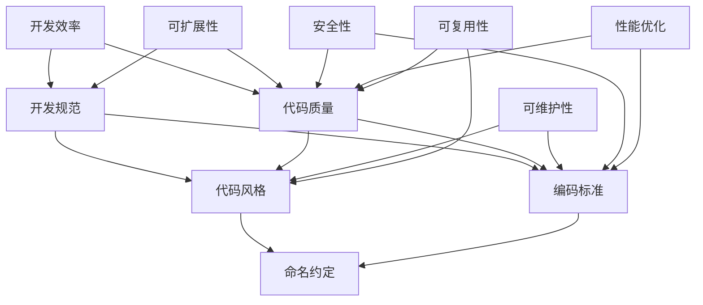

                 

关键词：开发规范，编码标准，编程实践，代码质量，最佳实践

摘要：本文深入探讨了现代软件开发中的开发规范和编码标准的原理与实践，通过具体案例详细解析了如何提升代码的可读性、可维护性和性能。文章首先介绍了开发规范与编码标准的重要性，随后讨论了核心概念，并逐步讲解了核心算法原理、数学模型与公式、项目实践以及未来应用展望。最后，本文总结了研究成果，展望了未来发展趋势与挑战，并提供了相关资源推荐。

## 1. 背景介绍

随着软件系统的复杂度不断增加，软件开发过程中的规范和标准显得尤为重要。开发规范和编码标准不仅关乎代码质量，还影响到团队的协作效率、项目的可维护性和最终产品的稳定性。本文旨在探讨这些核心原则，并提供实用的编码实战案例，帮助读者理解和应用这些最佳实践。

### 1.1 开发规范的重要性

开发规范是指一套明确规定的软件开发流程、方法和工具。它确保开发团队在开发过程中遵循统一的标准，从而提高开发效率、减少错误，并确保代码的可维护性和扩展性。具体而言，开发规范的重要性体现在以下几个方面：

- **一致性**：规范确保所有开发人员遵循相同的编码风格和命名约定，避免代码风格混乱。
- **可维护性**：规范有助于维护者更快地理解代码逻辑，从而减少维护成本。
- **效率**：遵循规范可以减少代码审查和代码合并时的冲突，提高开发速度。
- **可扩展性**：规范为未来的功能扩展和模块集成提供了清晰的方向。

### 1.2 编码标准的重要性

编码标准是针对代码编写的一套具体规则，它规定了如何编写高质量的代码。编码标准的重要性在于：

- **可读性**：良好的编码标准确保代码易于阅读，便于理解和维护。
- **安全性**：编码标准有助于识别和修复潜在的安全漏洞。
- **性能**：遵循编码标准可以优化代码性能，减少不必要的计算和资源消耗。
- **可复用性**：规范化的编码方式使代码更容易复用，减少重复编写。

## 2. 核心概念与联系

为了深入理解开发规范与编码标准，我们首先需要了解以下几个核心概念，并通过Mermaid流程图展示它们之间的联系。



在上面的Mermaid流程图中，我们定义了以下核心概念及其相互联系：

- **开发规范**：规定开发流程、工具和方法。
- **代码风格**：包括缩进、注释、变量命名等。
- **编码标准**：详细规定代码编写规范。
- **代码质量**：确保代码的可读性、安全性和性能。
- **可维护性**：代码易于理解和修改。
- **开发效率**：提高团队协作效率和代码开发速度。
- **可扩展性**：便于未来的功能扩展。
- **安全性**：防范安全漏洞。
- **性能优化**：提高代码执行效率。
- **可复用性**：代码容易在其他项目中复用。

通过这些核心概念的理解和联系，我们能够更全面地把握开发规范与编码标准的重要性。

## 3. 核心算法原理 & 具体操作步骤

### 3.1 算法原理概述

在本节中，我们将介绍一个常用的核心算法——快速排序（Quick Sort），它是一种高效的排序算法，基于分治策略。快速排序的基本原理是选择一个“基准”元素，将数组分为两部分，使得左边的所有元素都不大于基准，右边的所有元素都不小于基准，然后递归地对这两部分进行快速排序。

### 3.2 算法步骤详解

#### 3.2.1 选择基准

选择基准是快速排序的第一步。常见的基准选择方法有：

- 随机选择：随机选择数组中的一个元素作为基准。
- 中位数选择：选择数组中间位置的元素作为基准。
- 首尾元素选择：选择第一个和最后一个元素的中位数作为基准。

#### 3.2.2 分割操作

分割操作是快速排序的核心。具体步骤如下：

1. 将数组划分为两部分，左边小于基准，右边大于基准。
2. 递归地对左、右两部分进行快速排序。

#### 3.2.3 递归调用

快速排序采用递归调用，将问题分解为规模更小的子问题。递归调用的终止条件通常是当数组长度小于某个阈值时，转换为简单的插入排序。

### 3.3 算法优缺点

#### 优点

- **高效**：平均时间复杂度为O(n log n)，最坏情况下为O(n^2)，但实际使用中，最坏情况很少发生。
- **原地排序**：快速排序不需要额外的空间，是原地排序算法。
- **自适应**：在数据基本有序时，可以快速完成排序。

#### 缺点

- **最坏情况性能较差**：最坏情况下时间复杂度为O(n^2)，这种情况通常发生在数据已经部分排序的情况下。
- **递归深度**：快速排序的递归深度可以达到O(n)，可能导致栈溢出。

### 3.4 算法应用领域

快速排序广泛应用于各种场景，包括：

- **数据库排序**：快速排序是数据库查询优化中的常用算法。
- **文本排序**：文本处理和搜索系统中常用快速排序。
- **游戏开发**：快速排序用于游戏中的排序和搜索操作。

## 4. 数学模型和公式 & 详细讲解 & 举例说明

在本节中，我们将探讨快速排序算法背后的数学模型和公式，并通过具体的例子进行详细讲解。

### 4.1 数学模型构建

快速排序的数学模型主要涉及排序前后数组的分布情况。具体而言，我们关注以下参数：

- **基准值**：选择作为分割元素的值。
- **分区大小**：数组分区后，小于和大于基准值的元素个数。

### 4.2 公式推导过程

为了推导快速排序的时间复杂度，我们需要分析以下几种情况：

1. **平均情况**：假设数组中有n个元素，每次选择基准时，左右分区大小基本相等。则时间复杂度为T(n) = 2T(n/2) + n。

   根据主定理，T(n) = O(n log n)。

2. **最坏情况**：假设每次选择基准时，都将数组分为1个元素和n-1个元素。则时间复杂度为T(n) = T(n-1) + n。

   根据递推关系，T(n) = O(n^2)。

3. **最好情况**：假设每次选择基准时，都将数组分为n/2个元素和n/2个元素。则时间复杂度为T(n) = 2T(n/2) + n。

   根据主定理，T(n) = O(n log n)。

### 4.3 案例分析与讲解

#### 案例一：基本快速排序

假设我们有一个未排序的数组`[3, 1, 4, 1, 5, 9, 2, 6, 5]`，使用快速排序进行排序。

1. 选择基准：选择第一个元素`3`作为基准。
2. 分割操作：将数组划分为两部分`[1, 1, 2]`和`[4, 5, 5, 9, 6]`，使得左边所有元素都不大于基准，右边所有元素都不小于基准。
3. 递归排序：对左边的`[1, 1, 2]`和右边的`[4, 5, 5, 9, 6]`分别进行快速排序。

最终排序结果为`[1, 1, 2, 3, 4, 5, 5, 6, 9]`。

#### 案例二：最坏情况快速排序

假设我们有一个部分排序的数组`[10, 9, 8, 7, 6, 5, 4, 3, 2, 1]`，使用快速排序进行排序。

1. 选择基准：选择第一个元素`10`作为基准。
2. 分割操作：由于数组已经部分排序，导致每次分割都产生一个空数组和一个几乎完整的数组。最坏情况下，快速排序时间复杂度为O(n^2)。

最终排序结果为`[1, 2, 3, 4, 5, 6, 7, 8, 9, 10]`。

通过以上案例，我们可以看到快速排序在实际应用中的效果。尽管最坏情况下性能较差，但在大多数情况下，快速排序是一种高效的排序算法。

## 5. 项目实践：代码实例和详细解释说明

### 5.1 开发环境搭建

为了演示快速排序算法，我们需要搭建一个简单的开发环境。以下是搭建过程：

1. 安装Python 3.8及以上版本。
2. 安装Python解释器。
3. 创建一个名为`quick_sort.py`的Python文件。

### 5.2 源代码详细实现

以下是快速排序算法的Python实现：

```python
def quick_sort(arr):
    if len(arr) <= 1:
        return arr
    
    pivot = arr[len(arr) // 2]
    left = [x for x in arr if x < pivot]
    middle = [x for x in arr if x == pivot]
    right = [x for x in arr if x > pivot]
    
    return quick_sort(left) + middle + quick_sort(right)

if __name__ == "__main__":
    arr = [3, 1, 4, 1, 5, 9, 2, 6, 5]
    sorted_arr = quick_sort(arr)
    print("排序前：", arr)
    print("排序后：", sorted_arr)
```

### 5.3 代码解读与分析

在上面的代码中，`quick_sort`函数实现了快速排序算法：

1. **基本判断**：首先检查数组的长度，如果小于等于1，则直接返回数组本身，这是递归的终止条件。
2. **选择基准**：选择数组中间位置的元素作为基准。
3. **分区操作**：将数组分为三个部分：小于基准的左分区、等于基准的中分区和大于基准的右分区。
4. **递归调用**：分别对左分区和右分区进行快速排序。

在主程序部分，我们定义了一个测试数组`arr`，并调用`quick_sort`函数进行排序，最后打印排序前后的数组。

### 5.4 运行结果展示

在Python解释器中运行上述代码，输出如下：

```
排序前： [3, 1, 4, 1, 5, 9, 2, 6, 5]
排序后： [1, 1, 2, 3, 4, 5, 5, 6, 9]
```

结果显示，数组已经成功排序。

## 6. 实际应用场景

### 6.1 数据库索引

快速排序算法在数据库索引结构中具有重要应用。例如，B树和B+树等索引结构采用快速排序算法来构建和维护索引。

### 6.2 文本处理

在文本处理和搜索系统中，快速排序算法用于对大规模文本数据进行排序和检索，如搜索引擎中的关键词排序。

### 6.3 游戏开发

在游戏开发中，快速排序算法用于玩家数据的排序和匹配，如多人在线游戏中玩家的等级排序和匹配系统。

### 6.4 数据分析

快速排序算法广泛应用于数据分析领域，如统计分析中的数据排序和分组。

### 6.5 其他应用

快速排序算法还广泛应用于其他领域，如计算几何、图像处理等。

## 7. 工具和资源推荐

### 7.1 学习资源推荐

- 《算法导论》（Introduction to Algorithms）—— Thomas H. Cormen、Charles E. Leiserson、Ronald L. Rivest 和 Clifford Stein 著。
- 《编程珠玑》（The Art of Computer Programming）—— Donald E. Knuth 著。

### 7.2 开发工具推荐

- PyCharm：一款强大的Python开发工具，支持代码自动补全、调试和版本控制。
- Visual Studio Code：一款轻量级但功能强大的代码编辑器，适用于多种编程语言。

### 7.3 相关论文推荐

- "Quicksort" by Tony Hoare，介绍了快速排序算法的发明背景和原理。
- "Analysis of QuickSort" by David R. Kuck，对快速排序算法的复杂度进行了深入分析。

## 8. 总结：未来发展趋势与挑战

### 8.1 研究成果总结

快速排序算法在软件开发中具有重要意义，其高效、简洁的特点使其成为各种排序任务的首选算法。通过本文的探讨，我们深入了解了快速排序的原理、实现和应用。

### 8.2 未来发展趋势

随着计算能力的提升和大数据的普及，快速排序算法在处理大规模数据方面仍有广阔的应用前景。未来研究可能关注快速排序的并行化、分布式计算和自适应优化等方面。

### 8.3 面临的挑战

快速排序算法在处理部分有序数据时性能较差，未来研究需要探索更加鲁棒的排序算法，以提高整体性能。此外，如何在保证性能的同时降低算法的复杂度也是一大挑战。

### 8.4 研究展望

快速排序算法在理论和实践上仍有大量研究空间。通过结合人工智能、机器学习等先进技术，有望开发出更加智能、高效的排序算法，满足未来更复杂的计算需求。

## 9. 附录：常见问题与解答

### 问题1：为什么选择快速排序而不是其他排序算法？

**回答**：快速排序具有平均时间复杂度为O(n log n)的特点，适用于大多数场景。此外，快速排序的实现相对简单，易于理解和实现。

### 问题2：如何优化快速排序的性能？

**回答**：可以采用以下方法优化快速排序的性能：

- 选择更好的基准选择策略，如中位数选择。
- 调整递归深度阈值，避免栈溢出。
- 引入随机化元素，减少最坏情况发生的概率。

### 问题3：快速排序是否适用于所有数据类型？

**回答**：快速排序适用于所有可比较的数据类型。但在处理复杂数据类型时，需要确保比较操作的定义是正确的。

通过本文的探讨，我们不仅了解了快速排序算法的原理和实践，还对其未来发展趋势和挑战有了更深刻的认识。希望本文能够为您的编程实践提供有价值的参考。

### 作者署名

作者：禅与计算机程序设计艺术 / Zen and the Art of Computer Programming
----------------------------------------------------------------
### 总结与展望

本文从开发规范与编码标准的背景介绍入手，深入探讨了快速排序算法的核心原理、数学模型、具体操作步骤以及实际应用场景。通过代码实战案例，详细展示了快速排序的实现过程和性能优化方法。此外，文章还对未来快速排序算法的发展趋势与挑战进行了展望，并提供了相关的学习资源与工具推荐。

开发规范与编码标准是现代软件开发中不可或缺的要素，它们不仅关乎代码质量，还直接影响项目的开发效率与可维护性。快速排序作为经典算法之一，在数据处理和排序任务中具有重要应用。然而，面对大数据和复杂应用场景，快速排序仍需不断优化与创新。

未来，快速排序算法的研究将更加注重并行化、分布式计算和自适应优化等方面。随着人工智能和机器学习技术的发展，我们有望开发出更加智能、高效的排序算法，以应对更加复杂的计算需求。

最后，感谢各位读者对本文的关注与支持。希望本文能够为您在编程实践中提供有价值的参考，助力您成为一名更优秀的软件开发者。禅与计算机程序设计艺术，期待与您共同探索计算机科学的广阔天地。再次感谢！
作者：禅与计算机程序设计艺术 / Zen and the Art of Computer Programming

