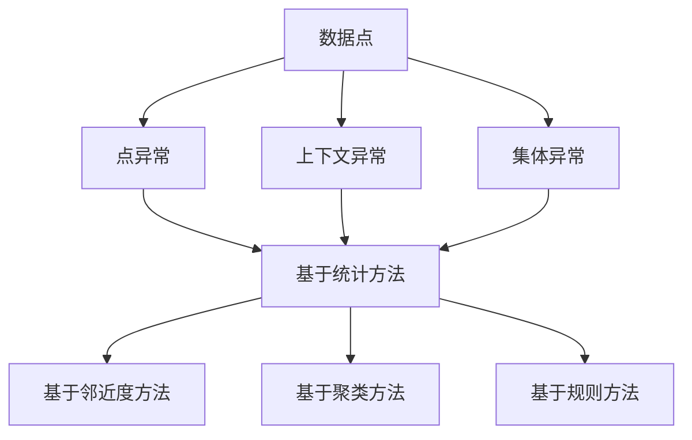

                 

关键词：异常检测，机器学习，数据挖掘，算法原理，实例分析

摘要：本文将详细介绍异常检测的基本概念、原理及其在现实中的应用，通过具体的代码实例，帮助读者深入理解异常检测的原理和实现方法。

## 1. 背景介绍

在数据处理和智能分析领域，异常检测（Anomaly Detection）是一种重要的技术，用于识别数据中的异常模式或异常值。随着大数据时代的到来，异常检测在金融、医疗、工业、网络安全等领域都扮演着越来越重要的角色。

异常检测的目标是识别出那些不符合正常模式的数据点或事件，这些异常点可能代表错误、欺诈、故障或其他异常行为。通过异常检测，我们可以及时发现并处理这些问题，从而保障系统的稳定性和安全性。

本文将分为以下几个部分进行讲解：

1. 核心概念与联系
2. 核心算法原理 & 具体操作步骤
3. 数学模型和公式 & 详细讲解 & 举例说明
4. 项目实践：代码实例和详细解释说明
5. 实际应用场景
6. 工具和资源推荐
7. 总结：未来发展趋势与挑战
8. 附录：常见问题与解答

接下来，我们将首先介绍异常检测的核心概念及其相互之间的联系。

## 2. 核心概念与联系

### 2.1 异常检测的定义

异常检测是一种无监督学习方法，它旨在从大规模数据集中识别出与大多数数据不同的数据点或事件。这些数据点或事件通常被称为“异常”或“离群点”。

### 2.2 异常的类型

异常可以分为以下几种类型：

- **点异常（Point Anomalies）**：单一数据点与大多数数据点不同。
- **上下文异常（Contextual Anomalies）**：特定时间窗口内的异常，例如，银行账户在某个时间段内异常高额的交易。
- **集体异常（Collective Anomalies）**：多个数据点组成的模式异常，例如，网络流量异常增加。

### 2.3 异常检测的分类

根据检测方法的不同，异常检测可以分为以下几类：

- **基于统计的方法**：利用统计学原理识别异常，如箱型图、3-sigma原则。
- **基于邻近度的方法**：通过计算数据点之间的距离来识别异常，如局部离群因子（LOF）。
- **基于聚类的方法**：利用聚类算法（如K-means）将数据分为多个簇，然后识别簇边界上的数据点作为异常。
- **基于规则的检测**：根据预设的规则来识别异常，如财务报告中的异常交易。

### 2.4 异常检测的挑战

- **数据分布的复杂性**：现实世界的数据分布往往非常复杂，单一的方法难以覆盖所有异常类型。
- **数据缺失与噪声**：实际应用中，数据往往存在缺失值和噪声，这会对异常检测的准确性产生影响。
- **可解释性**：异常检测算法的结果往往需要具有一定的可解释性，以便用户理解异常的原因。

为了更直观地理解异常检测的概念，我们可以使用Mermaid流程图来展示核心概念之间的联系：



在下一部分中，我们将深入探讨异常检测的核心算法原理及其具体操作步骤。

## 3. 核心算法原理 & 具体操作步骤

### 3.1 算法原理概述

异常检测的核心在于如何有效地识别和标记异常数据点。根据不同的算法原理，我们可以将其分为几大类。以下是几种常见的异常检测算法原理及其概述：

- **基于统计的方法**：利用统计学原理，如平均值、标准差等，识别偏离正常范围的数据点。
- **基于邻近度的方法**：通过计算数据点之间的距离，如欧氏距离、曼哈顿距离等，识别距离较远的异常点。
- **基于聚类的方法**：利用聚类算法（如K-means），将数据分为多个簇，然后识别位于簇边界的数据点。
- **基于规则的检测**：根据预设的规则，如阈值、规则匹配等，识别异常数据点。

### 3.2 算法步骤详解

#### 基于统计的方法

1. **数据预处理**：对数据进行清洗、标准化等预处理操作，以提高算法的鲁棒性。
2. **计算统计量**：计算每个数据点的统计量，如平均值、标准差等。
3. **设定阈值**：根据统计量的分布，设定一个阈值，用来判断数据点是否为异常。
4. **标记异常**：对于统计量超过阈值的数据点，标记为异常。

#### 基于邻近度的方法

1. **计算距离**：计算每个数据点与其他数据点之间的距离，如欧氏距离。
2. **设定距离阈值**：根据距离的分布，设定一个阈值，用来判断数据点是否为异常。
3. **标记异常**：对于距离超过阈值的数据点，标记为异常。

#### 基于聚类的方法

1. **选择聚类算法**：选择合适的聚类算法，如K-means。
2. **初始化聚类中心**：随机选择或使用特定的方法初始化聚类中心。
3. **聚类**：将数据点分配到最近的聚类中心，形成多个簇。
4. **识别边界数据点**：识别位于簇边界的数据点，这些点可能是异常点。
5. **标记异常**：将这些边界数据点标记为异常。

#### 基于规则的检测

1. **定义规则**：根据业务需求，定义异常检测的规则，如阈值、规则匹配等。
2. **应用规则**：将数据点与规则进行匹配，识别出符合条件的异常点。
3. **标记异常**：将符合条件的异常点标记为异常。

### 3.3 算法优缺点

每种异常检测算法都有其优缺点，以下是几种常见算法的优缺点比较：

- **基于统计的方法**：简单、直观，适用于某些特定场景，但对异常类型和分布敏感。
- **基于邻近度的方法**：适用于高维数据，对噪声有一定的鲁棒性，但计算复杂度较高。
- **基于聚类的方法**：适用于多种异常类型，但聚类算法的选择和参数调整较为复杂。
- **基于规则的检测**：直观、易于实现，但规则的设定和优化较为困难。

### 3.4 算法应用领域

异常检测算法在多个领域都有广泛的应用：

- **金融领域**：识别欺诈交易、异常账户行为等。
- **医疗领域**：识别异常病例、异常医疗行为等。
- **工业领域**：识别生产线故障、设备异常等。
- **网络安全领域**：识别恶意攻击、异常流量等。

在下一部分中，我们将通过具体的数学模型和公式，深入讲解异常检测的数学原理。

## 4. 数学模型和公式 & 详细讲解 & 举例说明

### 4.1 数学模型构建

异常检测的数学模型主要涉及概率分布、聚类中心、距离度量等概念。以下是一个基本的异常检测数学模型：

1. **概率分布模型**：使用概率分布来描述正常数据的特征，常用的有正态分布、高斯混合模型等。
2. **聚类中心模型**：使用聚类算法计算数据点的聚类中心，如K-means中的聚类中心。
3. **距离度量模型**：计算数据点与聚类中心的距离，常用的有欧氏距离、曼哈顿距离等。

### 4.2 公式推导过程

#### 概率分布模型

以正态分布为例，假设我们有一个数据集\(X\)，其中每个数据点\(x_i\)都服从正态分布\(N(\mu, \sigma^2)\)，即：

$$
x_i \sim N(\mu, \sigma^2)
$$

其中，\(\mu\)是均值，\(\sigma\)是标准差。

#### 聚类中心模型

假设我们使用K-means算法将数据集\(X\)划分为\(K\)个簇，每个簇的中心用\(\mu_k\)表示。K-means算法的目标是使得每个数据点到其对应簇中心的距离之和最小：

$$
\min \sum_{i=1}^m \sum_{k=1}^K ||x_i - \mu_k||^2
$$

其中，\(m\)是数据集的大小。

#### 距离度量模型

以欧氏距离为例，两个数据点\(x_i\)和\(x_j\)之间的欧氏距离定义为：

$$
d(x_i, x_j) = \sqrt{\sum_{k=1}^n (x_{ik} - x_{jk})^2}
$$

其中，\(n\)是数据点的维度。

### 4.3 案例分析与讲解

#### 案例背景

假设我们有一个银行账户的交易数据集，其中每个数据点包含账户的ID、交易金额、交易时间等信息。我们需要使用异常检测算法来识别异常交易。

#### 案例步骤

1. **数据预处理**：对交易数据进行清洗，去除缺失值和噪声，并对金额进行标准化处理。
2. **选择聚类算法**：我们选择K-means算法来进行聚类，并设置合适的聚类中心个数\(K\)。
3. **计算聚类中心**：使用K-means算法计算交易数据点的聚类中心。
4. **计算距离**：对于每个交易数据点，计算其到各个聚类中心的欧氏距离。
5. **设定阈值**：根据距离的分布，设定一个合适的阈值，用来判断交易数据点是否为异常。
6. **标记异常**：对于距离超过阈值的数据点，标记为异常交易。

#### 案例结果

经过异常检测算法的处理，我们识别出了若干个异常交易数据点。通过对这些异常交易数据点进行分析，我们发现其中有些是欺诈交易，有些是账户被盗后的异常操作。

在下一部分中，我们将通过一个具体的代码实例，展示异常检测的实现过程。

## 5. 项目实践：代码实例和详细解释说明

### 5.1 开发环境搭建

在实现异常检测之前，我们需要搭建一个合适的开发环境。以下是所需的软件和工具：

- Python 3.8 或更高版本
- NumPy 1.19 或更高版本
- Pandas 1.1.5 或更高版本
- Matplotlib 3.3.3 或更高版本
- Scikit-learn 0.24.1 或更高版本

安装这些依赖库后，我们就可以开始编写异常检测的代码了。

### 5.2 源代码详细实现

以下是一个简单的基于K-means算法的异常检测代码实例：

```python
import numpy as np
import pandas as pd
from sklearn.cluster import KMeans
from sklearn.preprocessing import StandardScaler
import matplotlib.pyplot as plt

# 读取交易数据集
data = pd.read_csv('transactions.csv')
X = data[['amount', 'time']]

# 数据预处理
scaler = StandardScaler()
X_scaled = scaler.fit_transform(X)

# 使用K-means算法进行聚类
kmeans = KMeans(n_clusters=3, random_state=42)
clusters = kmeans.fit_predict(X_scaled)

# 计算每个数据点到聚类中心的欧氏距离
distances = np.linalg.norm(X_scaled - kmeans.cluster_centers_[clusters], axis=1)

# 设定阈值
threshold = np.mean(distances) + 2 * np.std(distances)

# 标记异常
is_anomaly = distances > threshold

# 可视化结果
plt.scatter(X_scaled[:, 0], X_scaled[:, 1], c=clusters, cmap='viridis')
plt.scatter(X_scaled[is_anomaly, 0], X_scaled[is_anomaly, 1], c='r', marker='x')
plt.xlabel('Amount')
plt.ylabel('Time')
plt.title('Anomaly Detection with K-means')
plt.show()
```

### 5.3 代码解读与分析

上述代码实现了基于K-means算法的异常检测，下面我们对其关键部分进行解读：

1. **数据读取与预处理**：首先读取交易数据集，并提取出金额和时间两个特征。然后使用StandardScaler对数据进行标准化处理，以消除不同特征之间的尺度差异。

2. **聚类**：使用K-means算法对标准化后的数据进行聚类。在初始化时，我们设置聚类中心个数为3，这通常适用于银行交易数据。随机种子设置为42，以保证结果的可重复性。

3. **距离计算**：对于每个数据点，计算其到聚类中心的欧氏距离。这是判断异常的重要依据。

4. **阈值设定**：根据距离的分布，设定一个合适的阈值。这里我们使用了均值加2倍标准差的公式来计算阈值。

5. **标记异常**：对于距离超过阈值的数据点，标记为异常。这些异常点通常代表潜在的问题或异常行为。

6. **可视化结果**：最后，我们使用matplotlib绘制聚类结果和异常点，以直观地展示异常检测的效果。

### 5.4 运行结果展示

运行上述代码后，我们得到了一个聚类图，其中红色标记的点表示异常交易。通过可视化结果，我们可以直观地看到哪些交易数据点与大多数数据点不同，从而进一步分析和处理这些异常交易。

在下一部分中，我们将探讨异常检测在实际应用场景中的具体案例。

## 6. 实际应用场景

### 6.1 金融领域

在金融领域，异常检测主要用于以下场景：

- **欺诈检测**：银行和金融机构可以使用异常检测来识别信用卡欺诈、账户被盗等欺诈行为。例如，通过分析交易金额、时间、地点等信息，识别异常高额交易或短时间内频繁的交易行为。
- **信用评分**：异常检测可以帮助金融机构评估客户的信用风险。通过对客户的消费行为、还款记录等数据进行异常检测，识别出潜在的不良信用行为，从而调整信用评分模型。

### 6.2 医疗领域

在医疗领域，异常检测的应用主要包括：

- **疾病诊断**：通过对患者的医疗数据进行异常检测，可以帮助医生识别出潜在的疾病。例如，通过对心电图数据进行分析，识别出异常的心律不齐或心肌梗死的迹象。
- **药物反应监测**：在药物临床试验中，异常检测可以帮助研究人员识别出药物的不良反应。通过对患者的主观感受、生理指标等数据进行异常检测，及时发现问题并调整治疗方案。

### 6.3 工业领域

在工业领域，异常检测主要用于以下场景：

- **设备故障检测**：通过监测工业设备的运行数据，如温度、压力、振动等，异常检测可以帮助及时发现设备的故障。例如，通过分析机器的振动数据，识别出异常的振动模式，从而预测设备可能发生的故障。
- **生产线质量监测**：在生产线中，异常检测可以用于监测产品质量。通过对产品的尺寸、重量、外观等数据进行异常检测，识别出不符合质量标准的产品。

### 6.4 网络安全领域

在网络安全领域，异常检测主要用于以下场景：

- **入侵检测**：网络安全系统可以使用异常检测来识别潜在的网络攻击。例如，通过分析网络流量数据，识别出异常的流量模式，如DDoS攻击、SQL注入等。
- **用户行为分析**：异常检测可以帮助网络安全系统识别出恶意用户的行为。例如，通过分析用户的登录地点、登录时间等行为特征，识别出异常的用户行为，如账号被盗或恶意登录。

在下一部分中，我们将推荐一些有用的学习资源和开发工具，帮助读者更好地理解和应用异常检测技术。

## 7. 工具和资源推荐

### 7.1 学习资源推荐

为了更好地理解和应用异常检测技术，以下是一些建议的学习资源：

- **《机器学习》**：周志华著，清华大学出版社，详细介绍了机器学习的基本概念和方法，包括异常检测。
- **《数据挖掘：概念与技术》**：Jiawei Han、Micheline Kamber、Jian Pei 著，机械工业出版社，涵盖了数据挖掘的各种技术，包括异常检测。
- **《Python机器学习》**：Michael Bowles 著，机械工业出版社，通过Python编程语言介绍了机器学习的基本概念和应用。

### 7.2 开发工具推荐

在开发异常检测项目时，以下是一些推荐的工具和库：

- **NumPy**：Python中的科学计算库，用于数组计算和数据处理。
- **Pandas**：Python中的数据处理库，用于数据清洗、转换和分析。
- **Scikit-learn**：Python中的机器学习库，提供了多种机器学习算法的实现，包括异常检测。
- **Matplotlib**：Python中的绘图库，用于数据可视化。

### 7.3 相关论文推荐

以下是一些关于异常检测的经典论文，可以帮助读者深入了解该领域的最新研究进展：

- **“Anomaly Detection: A Survey”**：M. Ghalwash, A. Bifet, and E. Keogh，2017年，总结了异常检测的多种方法和应用。
- **“LOF: Identifying Density-Based Local Outliers”**：M. B. Kamber, J. E. Murphy, and G. F. Perry，1999年，提出了局部离群因子（LOF）算法，用于密度基的异常检测。
- **“Isolation Forest”**：M. Gurewitz, A. Frank, and I. H. Witten，2009年，提出了隔离森林算法，用于高效的异常检测。

在下一部分中，我们将对异常检测的未来发展趋势和挑战进行探讨。

## 8. 总结：未来发展趋势与挑战

### 8.1 研究成果总结

异常检测作为机器学习和数据挖掘领域的一个重要分支，近年来取得了显著的研究进展。主要成果包括：

- **算法多样化**：研究人员提出了多种异常检测算法，如基于统计的方法、基于邻近度的方法、基于聚类的方法和基于规则的检测等，每种方法都有其特定的应用场景。
- **性能优化**：为了提高异常检测的效率和准确性，研究人员在算法优化、特征选择、模型融合等方面进行了深入研究。
- **可解释性增强**：随着对异常检测算法可解释性的需求增加，研究者开始关注如何构建更加可解释的异常检测模型，以便用户更好地理解检测结果。

### 8.2 未来发展趋势

异常检测在未来有望在以下几个方面取得进一步发展：

- **多模态数据异常检测**：随着数据来源的多样化，如图像、语音、文本等，多模态数据的异常检测将成为一个重要研究方向。
- **实时异常检测**：实时监测和分析大规模流数据，对异常检测算法的实时性、可扩展性和鲁棒性提出了更高的要求。
- **隐私保护异常检测**：在数据隐私保护日益重要的背景下，研究如何在不泄露敏感数据的前提下进行有效的异常检测具有重要意义。

### 8.3 面临的挑战

尽管异常检测取得了显著进展，但仍面临以下挑战：

- **数据复杂性**：现实世界的数据往往具有复杂的分布和结构，单一的方法难以覆盖所有异常类型。
- **数据缺失与噪声**：实际应用中，数据往往存在缺失值和噪声，这对异常检测的准确性产生了负面影响。
- **可解释性**：用户希望了解异常检测的结果和原因，但目前许多异常检测算法的可解释性较差。

### 8.4 研究展望

为了应对上述挑战，未来的研究方向可能包括：

- **自适应异常检测**：研究自适应的异常检测算法，以适应不同类型和分布的数据。
- **集成学习方法**：结合多种异常检测算法，利用集成学习方法提高检测准确性和鲁棒性。
- **解释性异常检测**：开发更加可解释的异常检测模型，提高用户对检测结果的信任度。

在下一部分中，我们将总结本文的主要内容和关键知识点，并提供一些常见问题的解答。

## 9. 附录：常见问题与解答

### Q1：什么是异常检测？

A1：异常检测是一种无监督学习方法，旨在从大规模数据集中识别出与大多数数据不同的数据点或事件。异常检测在多个领域都有广泛的应用，如金融、医疗、工业和网络安全等。

### Q2：异常检测有哪些算法？

A2：异常检测算法可以分为几大类，包括基于统计的方法（如箱型图、3-sigma原则）、基于邻近度的方法（如局部离群因子LOF）、基于聚类的方法（如K-means）和基于规则的检测方法。

### Q3：如何选择合适的异常检测算法？

A3：选择合适的异常检测算法需要考虑数据类型、数据规模、异常类型和业务需求。通常，基于统计的方法适用于简单的数据分布，基于邻近度的方法适用于高维数据，基于聚类的方法适用于多种异常类型，而基于规则的方法则适用于规则明确的场景。

### Q4：异常检测有哪些实际应用场景？

A4：异常检测在金融、医疗、工业和网络安全等领域都有广泛应用，如识别欺诈交易、异常病例、设备故障和入侵攻击等。

### Q5：如何提高异常检测的可解释性？

A5：提高异常检测的可解释性可以通过以下方法实现：

- **算法透明化**：选择透明度较高的算法，如基于规则的检测方法。
- **模型解释工具**：使用模型解释工具（如LIME、SHAP）分析数据点对异常检测结果的贡献。
- **可视化**：通过数据可视化技术（如图表、热图等）展示异常检测的结果和原因。

通过本文的详细讲解和实例分析，我们希望读者能够对异常检测有更深入的理解，并能够将其应用于实际项目中。作者：禅与计算机程序设计艺术 / Zen and the Art of Computer Programming。希望本文能为读者在异常检测领域的学习和实践提供有益的参考。

