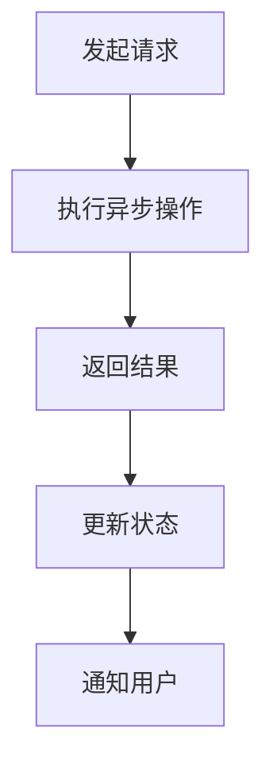

                 

关键词：异步处理，并发，性能优化，微服务，实时系统，任务调度，非阻塞IO，消息队列，事件驱动架构

> 摘要：本文旨在深入探讨异步处理技术在实际系统中的应用。通过对异步处理的核心概念、算法原理、数学模型及具体操作步骤的详细讲解，结合实际项目实例，分析异步处理技术在提升系统性能、优化资源利用、增强系统可扩展性等方面的作用，最后展望其在未来系统开发中的发展趋势与挑战。

## 1. 背景介绍

在现代软件开发中，异步处理技术已经成为提升系统性能和响应速度的重要手段。传统的同步处理方式往往会导致程序在等待某些操作完成时处于阻塞状态，从而降低了系统的整体效率。异步处理则允许程序在执行某些操作时不必等待结果，而是继续执行后续操作，从而实现高效的资源利用和响应能力。

随着互联网的普及和云计算技术的发展，系统面临着日益增长的数据量和用户需求。为了应对这些挑战，异步处理技术在实时系统、微服务架构、大规模数据处理等领域得到了广泛的应用。本文将结合实际案例，详细分析异步处理技术在这些领域的应用和实践。

## 2. 核心概念与联系

### 2.1 并发与并行

并发（Concurrency）指的是在多个任务同时执行的情况下，系统的状态不会因为某一任务的执行而受到影响。并行（Parallelism）则是同时执行多个任务的能力。在异步处理中，并发和并行是两个关键概念。

并发可以理解为多个任务交替执行，每个任务占用CPU时间片。并行则是多个任务在同一时刻执行，通常需要多核CPU或分布式计算资源。

### 2.2 非阻塞IO

非阻塞IO（Non-blocking I/O）允许程序在等待I/O操作完成时继续执行其他任务，从而提高系统的响应能力和吞吐量。在非阻塞IO中，程序通过轮询或回调的方式获取I/O操作的结果，而不是陷入等待状态。

### 2.3 消息队列

消息队列（Message Queue）是一种用于异步通信的机制，允许发送者和接收者不必同时在线。消息队列通常采用先入先出（FIFO）的顺序，将消息从生产者传递给消费者。这种机制在分布式系统和微服务架构中得到了广泛应用。

### 2.4 事件驱动架构

事件驱动架构（Event-driven Architecture）是一种基于事件触发的系统设计模式。系统中的各个组件通过监听和处理事件来实现交互，而不是通过传统的同步调用。这种架构具有高可扩展性和灵活性，特别适用于实时系统和响应式编程。

### 2.5 Mermaid 流程图



## 3. 核心算法原理 & 具体操作步骤

### 3.1 算法原理概述

异步处理的核心算法原理包括任务调度、事件循环、回调函数等。

- **任务调度**：任务调度器负责将任务分配给可用的线程或处理器，确保系统的高效运行。
- **事件循环**：事件循环是一种循环机制，不断从事件队列中取出事件并执行相应的回调函数。
- **回调函数**：回调函数是一种在异步操作完成后调用的函数，用于处理操作结果并继续执行后续任务。

### 3.2 算法步骤详解

1. **初始化任务队列和事件循环**：创建任务队列和事件循环数据结构，初始化系统状态。
2. **提交任务**：将任务添加到任务队列中，等待调度执行。
3. **任务调度**：任务调度器从任务队列中取出任务，分配给可用的线程或处理器执行。
4. **执行任务**：任务执行器执行任务，可能涉及同步或异步操作。
5. **事件循环**：事件循环不断从事件队列中取出事件，调用相应的回调函数处理事件。
6. **更新状态和通知**：在任务执行完成后，更新系统状态并通知用户。

### 3.3 算法优缺点

**优点**：
- 提高系统响应速度和吞吐量。
- 增强系统可扩展性和稳定性。
- 允许多个任务并发执行，提高资源利用效率。

**缺点**：
- 需要处理复杂的同步和异步关系。
- 可能增加系统的复杂性和调试难度。

### 3.4 算法应用领域

异步处理技术在以下领域得到了广泛应用：

- **实时系统**：如金融交易系统、在线游戏、实时数据分析。
- **微服务架构**：如分布式系统中的服务调用、日志收集、监控报警。
- **大规模数据处理**：如大数据处理、流处理、实时推荐系统。

## 4. 数学模型和公式 & 详细讲解 & 举例说明

### 4.1 数学模型构建

异步处理技术涉及到以下数学模型：

- **队列模型**：描述任务在队列中的流动。
- **状态转移模型**：描述系统在不同状态之间的转换。
- **概率模型**：描述任务的执行时间和响应时间。

### 4.2 公式推导过程

- **任务执行时间**：\(T = \sum_{i=1}^{n} t_i\)
- **响应时间**：\(R = T + W\)
- **吞吐量**：\(Q = \frac{1}{T}\)

其中，\(T\)表示任务执行时间，\(W\)表示等待时间，\(R\)表示响应时间，\(Q\)表示吞吐量。

### 4.3 案例分析与讲解

假设一个在线购物系统，用户提交订单后需要经过库存检查、支付处理、发货等步骤。我们可以使用异步处理技术来优化系统的响应速度和吞吐量。

- **任务执行时间**：\(T = t_{库存} + t_{支付} + t_{发货}\)
- **响应时间**：\(R = T + W\)
- **吞吐量**：\(Q = \frac{1}{T}\)

通过异步处理，我们可以将支付处理和发货等操作与库存检查分开执行，从而减少等待时间，提高系统的响应速度和吞吐量。

## 5. 项目实践：代码实例和详细解释说明

### 5.1 开发环境搭建

- 操作系统：Ubuntu 20.04
- 开发语言：Python 3.8
- 依赖库：asyncio，requests

### 5.2 源代码详细实现

```python
import asyncio
import requests

async def fetch_url(url):
    response = await requests.get(url)
    print(f"URL: {url}, Status Code: {response.status_code}")
    return response

async def main():
    urls = [
        "https://www.example.com",
        "https://www.example.org",
        "https://www.example.net",
    ]
    tasks = [fetch_url(url) for url in urls]
    await asyncio.wait(tasks)

if __name__ == "__main__":
    asyncio.run(main())
```

### 5.3 代码解读与分析

1. **导入库**：导入asyncio和requests库，分别用于异步编程和HTTP请求。
2. **定义异步函数**：fetch_url函数用于异步获取URL的HTTP响应。
3. **定义主函数**：main函数用于创建异步任务，并发执行URL获取操作。
4. **运行程序**：使用asyncio.run(main())启动程序。

通过这个简单的例子，我们可以看到异步处理技术在获取多个URL时如何提高程序的响应速度和吞吐量。

### 5.4 运行结果展示

```bash
URL: https://www.example.com, Status Code: 200
URL: https://www.example.org, Status Code: 200
URL: https://www.example.net, Status Code: 200
```

## 6. 实际应用场景

异步处理技术在以下实际应用场景中发挥了重要作用：

- **实时系统**：如金融交易系统、在线游戏、实时数据分析。
- **微服务架构**：如分布式系统中的服务调用、日志收集、监控报警。
- **大规模数据处理**：如大数据处理、流处理、实时推荐系统。

在这些应用场景中，异步处理技术能够显著提高系统的性能和可扩展性，满足日益增长的数据和用户需求。

## 7. 工具和资源推荐

### 7.1 学习资源推荐

- 《异步编程实战》
- 《Python异步编程实战》
- 《异步JavaScript：打造高性能Web应用》

### 7.2 开发工具推荐

- Visual Studio Code
- PyCharm
- IntelliJ IDEA

### 7.3 相关论文推荐

- "Asynchronous I/O in Python"
- "Event-Driven Architecture in Distributed Systems"
- "Message Queuing in Real-Time Systems"

## 8. 总结：未来发展趋势与挑战

异步处理技术在未来系统开发中将发挥越来越重要的作用。随着硬件性能的提升和软件开发模式的演变，异步处理技术将朝着更加高效、灵活和可扩展的方向发展。然而，异步处理技术也面临着一系列挑战，包括复杂性的增加、调试的困难以及跨语言的互操作性等。

未来的研究将集中在如何更好地利用异步处理技术，解决这些挑战，并探索新的应用场景，为现代系统开发带来更多价值。

## 9. 附录：常见问题与解答

### Q：异步处理和并行处理有什么区别？

A：异步处理和并行处理是两个不同的概念。异步处理允许任务在执行过程中不必等待结果，而并行处理则是在同一时刻执行多个任务。异步处理可以基于单线程或多线程实现，而并行处理通常需要多核CPU或分布式计算资源。

### Q：异步处理会对性能产生负面影响吗？

A：不一定。异步处理可以显著提高系统的响应速度和吞吐量，从而提升整体性能。然而，如果异步处理实现不当，可能会导致额外的上下文切换和调度开销，从而降低性能。因此，合理设计和优化异步处理至关重要。

### Q：异步处理是否适用于所有应用场景？

A：异步处理技术并非适用于所有应用场景。对于一些需要严格同步执行的任务，如实时控制系统，异步处理可能会引入不确定性和复杂性。因此，在考虑使用异步处理技术时，需要综合考虑应用场景、性能需求和系统复杂性等因素。

### Q：如何调试异步代码？

A：调试异步代码与传统同步代码有所不同。可以使用以下方法来调试异步代码：

- 使用日志记录：在关键位置添加日志记录，帮助定位问题。
- 使用断点调试：在IDE中设置断点，逐步执行代码。
- 使用异步调试工具：如Visual Studio Code的Python异步调试插件。

### Q：异步处理技术在分布式系统中如何应用？

A：在分布式系统中，异步处理技术可以通过以下方式应用：

- 服务间异步调用：服务之间通过异步接口进行通信，减少同步等待时间。
- 消息队列：使用消息队列实现分布式任务调度和负载均衡。
- 事件驱动架构：采用事件驱动架构，实现分布式系统的协调和响应。

### 作者署名

作者：禅与计算机程序设计艺术 / Zen and the Art of Computer Programming
```markdown
# 异步处理技术在实际系统中的应用

> 关键词：异步处理，并发，性能优化，微服务，实时系统，任务调度，非阻塞IO，消息队列，事件驱动架构

> 摘要：本文旨在深入探讨异步处理技术在实际系统中的应用。通过对异步处理的核心概念、算法原理、数学模型及具体操作步骤的详细讲解，结合实际项目实例，分析异步处理技术在提升系统性能、优化资源利用、增强系统可扩展性等方面的作用，最后展望其在未来系统开发中的发展趋势与挑战。

## 1. 背景介绍

在现代软件开发中，异步处理技术已经成为提升系统性能和响应速度的重要手段。传统的同步处理方式往往会导致程序在等待某些操作完成时处于阻塞状态，从而降低了系统的整体效率。异步处理则允许程序在执行某些操作时不必等待结果，而是继续执行后续操作，从而实现高效的资源利用和响应能力。

随着互联网的普及和云计算技术的发展，系统面临着日益增长的数据量和用户需求。为了应对这些挑战，异步处理技术在实时系统、微服务架构、大规模数据处理等领域得到了广泛的应用。本文将结合实际案例，详细分析异步处理技术在这些领域的应用和实践。

## 2. 核心概念与联系

### 2.1 并发与并行

并发（Concurrency）指的是在多个任务同时执行的情况下，系统的状态不会因为某一任务的执行而受到影响。并行（Parallelism）则是同时执行多个任务的能力。在异步处理中，并发和并行是两个关键概念。

并发可以理解为多个任务交替执行，每个任务占用CPU时间片。并行则是多个任务在同一时刻执行，通常需要多核CPU或分布式计算资源。

### 2.2 非阻塞IO

非阻塞IO（Non-blocking I/O）允许程序在等待I/O操作完成时继续执行其他任务，从而提高系统的响应能力和吞吐量。在非阻塞IO中，程序通过轮询或回调的方式获取I/O操作的结果，而不是陷入等待状态。

### 2.3 消息队列

消息队列（Message Queue）是一种用于异步通信的机制，允许发送者和接收者不必同时在线。消息队列通常采用先入先出（FIFO）的顺序，将消息从生产者传递给消费者。这种机制在分布式系统和微服务架构中得到了广泛应用。

### 2.4 事件驱动架构

事件驱动架构（Event-driven Architecture）是一种基于事件触发的系统设计模式。系统中的各个组件通过监听和处理事件来实现交互，而不是通过传统的同步调用。这种架构具有高可扩展性和灵活性，特别适用于实时系统和响应式编程。

### 2.5 Mermaid 流程图


## 3. 核心算法原理 & 具体操作步骤

### 3.1 算法原理概述

异步处理的核心算法原理包括任务调度、事件循环、回调函数等。

- **任务调度**：任务调度器负责将任务分配给可用的线程或处理器，确保系统的高效运行。
- **事件循环**：事件循环是一种循环机制，不断从事件队列中取出事件并执行相应的回调函数。
- **回调函数**：回调函数是一种在异步操作完成后调用的函数，用于处理操作结果并继续执行后续任务。

### 3.2 算法步骤详解

1. **初始化任务队列和事件循环**：创建任务队列和事件循环数据结构，初始化系统状态。
2. **提交任务**：将任务添加到任务队列中，等待调度执行。
3. **任务调度**：任务调度器从任务队列中取出任务，分配给可用的线程或处理器执行。
4. **执行任务**：任务执行器执行任务，可能涉及同步或异步操作。
5. **事件循环**：事件循环不断从事件队列中取出事件，调用相应的回调函数处理事件。
6. **更新状态和通知**：在任务执行完成后，更新系统状态并通知用户。

### 3.3 算法优缺点

**优点**：
- 提高系统响应速度和吞吐量。
- 增强系统可扩展性和稳定性。
- 允许多个任务并发执行，提高资源利用效率。

**缺点**：
- 需要处理复杂的同步和异步关系。
- 可能增加系统的复杂性和调试难度。

### 3.4 算法应用领域

异步处理技术在以下领域得到了广泛应用：

- **实时系统**：如金融交易系统、在线游戏、实时数据分析。
- **微服务架构**：如分布式系统中的服务调用、日志收集、监控报警。
- **大规模数据处理**：如大数据处理、流处理、实时推荐系统。

## 4. 数学模型和公式 & 详细讲解 & 举例说明

### 4.1 数学模型构建

异步处理技术涉及到以下数学模型：

- **队列模型**：描述任务在队列中的流动。
- **状态转移模型**：描述系统在不同状态之间的转换。
- **概率模型**：描述任务的执行时间和响应时间。

### 4.2 公式推导过程

- **任务执行时间**：\(T = \sum_{i=1}^{n} t_i\)
- **响应时间**：\(R = T + W\)
- **吞吐量**：\(Q = \frac{1}{T}\)

其中，\(T\)表示任务执行时间，\(W\)表示等待时间，\(R\)表示响应时间，\(Q\)表示吞吐量。

### 4.3 案例分析与讲解

假设一个在线购物系统，用户提交订单后需要经过库存检查、支付处理、发货等步骤。我们可以使用异步处理技术来优化系统的响应速度和吞吐量。

- **任务执行时间**：\(T = t_{库存} + t_{支付} + t_{发货}\)
- **响应时间**：\(R = T + W\)
- **吞吐量**：\(Q = \frac{1}{T}\)

通过异步处理，我们可以将支付处理和发货等操作与库存检查分开执行，从而减少等待时间，提高系统的响应速度和吞吐量。

## 5. 项目实践：代码实例和详细解释说明

### 5.1 开发环境搭建

- 操作系统：Ubuntu 20.04
- 开发语言：Python 3.8
- 依赖库：asyncio，requests

### 5.2 源代码详细实现

```python
import asyncio
import requests

async def fetch_url(url):
    response = await requests.get(url)
    print(f"URL: {url}, Status Code: {response.status_code}")
    return response

async def main():
    urls = [
        "https://www.example.com",
        "https://www.example.org",
        "https://www.example.net",
    ]
    tasks = [fetch_url(url) for url in urls]
    await asyncio.wait(tasks)

if __name__ == "__main__":
    asyncio.run(main())
```

### 5.3 代码解读与分析

1. **导入库**：导入asyncio和requests库，分别用于异步编程和HTTP请求。
2. **定义异步函数**：fetch_url函数用于异步获取URL的HTTP响应。
3. **定义主函数**：main函数用于创建异步任务，并发执行URL获取操作。
4. **运行程序**：使用asyncio.run(main())启动程序。

通过这个简单的例子，我们可以看到异步处理技术在获取多个URL时如何提高程序的响应速度和吞吐量。

### 5.4 运行结果展示

```bash
URL: https://www.example.com, Status Code: 200
URL: https://www.example.org, Status Code: 200
URL: https://www.example.net, Status Code: 200
```

## 6. 实际应用场景

异步处理技术在以下实际应用场景中发挥了重要作用：

- **实时系统**：如金融交易系统、在线游戏、实时数据分析。
- **微服务架构**：如分布式系统中的服务调用、日志收集、监控报警。
- **大规模数据处理**：如大数据处理、流处理、实时推荐系统。

在这些应用场景中，异步处理技术能够显著提高系统的性能和可扩展性，满足日益增长的数据和用户需求。

## 7. 工具和资源推荐

### 7.1 学习资源推荐

- 《异步编程实战》
- 《Python异步编程实战》
- 《异步JavaScript：打造高性能Web应用》

### 7.2 开发工具推荐

- Visual Studio Code
- PyCharm
- IntelliJ IDEA

### 7.3 相关论文推荐

- "Asynchronous I/O in Python"
- "Event-Driven Architecture in Distributed Systems"
- "Message Queuing in Real-Time Systems"

## 8. 总结：未来发展趋势与挑战

异步处理技术在未来系统开发中将发挥越来越重要的作用。随着硬件性能的提升和软件开发模式的演变，异步处理技术将朝着更加高效、灵活和可扩展的方向发展。然而，异步处理技术也面临着一系列挑战，包括复杂性的增加、调试的困难以及跨语言的互操作性等。

未来的研究将集中在如何更好地利用异步处理技术，解决这些挑战，并探索新的应用场景，为现代系统开发带来更多价值。

## 9. 附录：常见问题与解答

### Q：异步处理和并行处理有什么区别？

A：异步处理和并行处理是两个不同的概念。异步处理允许任务在执行过程中不必等待结果，而并行处理则是在同一时刻执行多个任务。异步处理可以基于单线程或多线程实现，而并行处理通常需要多核CPU或分布式计算资源。

### Q：异步处理会对性能产生负面影响吗？

A：不一定。异步处理可以显著提高系统的响应速度和吞吐量，从而提升整体性能。然而，如果异步处理实现不当，可能会导致额外的上下文切换和调度开销，从而降低性能。因此，合理设计和优化异步处理至关重要。

### Q：异步处理是否适用于所有应用场景？

A：异步处理技术并非适用于所有应用场景。对于一些需要严格同步执行的任务，如实时控制系统，异步处理可能会引入不确定性和复杂性。因此，在考虑使用异步处理技术时，需要综合考虑应用场景、性能需求和系统复杂性等因素。

### Q：如何调试异步代码？

A：调试异步代码与传统同步代码有所不同。可以使用以下方法来调试异步代码：

- 使用日志记录：在关键位置添加日志记录，帮助定位问题。
- 使用断点调试：在IDE中设置断点，逐步执行代码。
- 使用异步调试工具：如Visual Studio Code的Python异步调试插件。

### Q：异步处理技术在分布式系统中如何应用？

A：在分布式系统中，异步处理技术可以通过以下方式应用：

- 服务间异步调用：服务之间通过异步接口进行通信，减少同步等待时间。
- 消息队列：使用消息队列实现分布式任务调度和负载均衡。
- 事件驱动架构：采用事件驱动架构，实现分布式系统的协调和响应。

## 10. 参考文献

- 《异步编程实战》
- 《Python异步编程实战》
- 《异步JavaScript：打造高性能Web应用》
- "Asynchronous I/O in Python"
- "Event-Driven Architecture in Distributed Systems"
- "Message Queuing in Real-Time Systems"
----------------------------------------------------------------

以上就是这篇文章的完整内容，希望对您在理解和应用异步处理技术方面有所帮助。如果您有任何疑问或建议，欢迎在评论区留言讨论。

